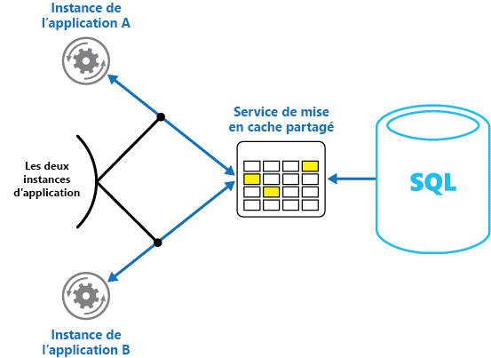
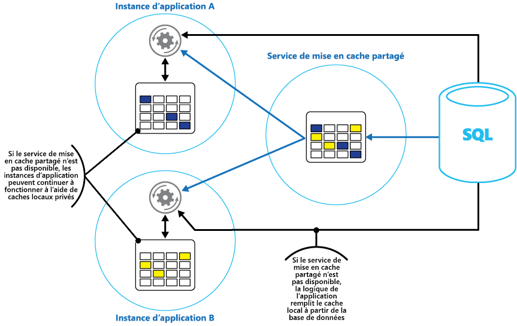

# <a name="caching"></a><span data-ttu-id="412c3-103">Mise en cache</span><span class="sxs-lookup"><span data-stu-id="412c3-103">Caching</span></span>

<span data-ttu-id="412c3-104">La mise en cache est une technique courante qui vise à améliorer les performances et l’extensibilité d’un système.</span><span class="sxs-lookup"><span data-stu-id="412c3-104">Caching is a common technique that aims to improve the performance and scalability of a system.</span></span> <span data-ttu-id="412c3-105">Elle consiste à copier temporairement des données fréquemment sollicitées dans un stockage rapide situé près de l’application.</span><span class="sxs-lookup"><span data-stu-id="412c3-105">It does this by temporarily copying frequently accessed data to fast storage that's located close to the application.</span></span> <span data-ttu-id="412c3-106">Si cet espace de stockage rapide des données se trouve plus près de l’application que la source d’origine, la mise en cache peut améliorer sensiblement les temps de réponse des applications clientes en fournissant les données plus rapidement.</span><span class="sxs-lookup"><span data-stu-id="412c3-106">If this fast data storage is located closer to the application than the original source, then caching can significantly improve response times for client applications by serving data more quickly.</span></span>

<span data-ttu-id="412c3-107">La mise en cache est plus efficace quand une instance client lit à plusieurs reprises les mêmes données, en particulier si le magasin de données d’origine réunit les conditions suivantes :</span><span class="sxs-lookup"><span data-stu-id="412c3-107">Caching is most effective when a client instance repeatedly reads the same data, especially if all the following conditions apply to the original data store:</span></span>

- <span data-ttu-id="412c3-108">Il reste relativement statique.</span><span class="sxs-lookup"><span data-stu-id="412c3-108">It remains relatively static.</span></span>
- <span data-ttu-id="412c3-109">Il est lent par rapport à la vitesse du cache.</span><span class="sxs-lookup"><span data-stu-id="412c3-109">It's slow compared to the speed of the cache.</span></span>
- <span data-ttu-id="412c3-110">Il est soumis à un niveau élevé de contention.</span><span class="sxs-lookup"><span data-stu-id="412c3-110">It's subject to a high level of contention.</span></span>
- <span data-ttu-id="412c3-111">Il est éloigné quand la latence du réseau peut ralentir l’accès.</span><span class="sxs-lookup"><span data-stu-id="412c3-111">It's far away when network latency can cause access to be slow.</span></span>

## <a name="caching-in-distributed-applications"></a><span data-ttu-id="412c3-112">Mise en cache dans les applications distribuées</span><span class="sxs-lookup"><span data-stu-id="412c3-112">Caching in distributed applications</span></span>

<span data-ttu-id="412c3-113">Les applications distribuées implémentent généralement une des deux stratégies suivantes ou les deux lors de la mise en cache des données :</span><span class="sxs-lookup"><span data-stu-id="412c3-113">Distributed applications typically implement either or both of the following strategies when caching data:</span></span>

- <span data-ttu-id="412c3-114">Utilisation d’un cache privé, où les données sont stockées localement sur l’ordinateur exécutant une instance d’une application ou d’un service.</span><span class="sxs-lookup"><span data-stu-id="412c3-114">Using a private cache, where data is held locally on the computer that's running an instance of an application or service.</span></span>
- <span data-ttu-id="412c3-115">Utilisation d'un cache partagé, agissant comme une source commune accessible par plusieurs ordinateurs et/ou processus.</span><span class="sxs-lookup"><span data-stu-id="412c3-115">Using a shared cache, serving as a common source which can be accessed by multiple processes and/or machines.</span></span>

<span data-ttu-id="412c3-116">Dans les deux cas, la mise en cache peut être effectuée côté client ou côté serveur.</span><span class="sxs-lookup"><span data-stu-id="412c3-116">In both cases, caching can be performed client-side and/or server-side.</span></span> <span data-ttu-id="412c3-117">La mise en cache côté client est effectuée par le processus qui fournit l’interface utilisateur pour un système, tel qu’un navigateur web ou une application de bureau.</span><span class="sxs-lookup"><span data-stu-id="412c3-117">Client-side caching is done by the process that provides the user interface for a system, such as a web browser or desktop application.</span></span> <span data-ttu-id="412c3-118">La mise en cache côté serveur est effectuée par le processus qui fournit les services professionnels exécutés à distance.</span><span class="sxs-lookup"><span data-stu-id="412c3-118">Server-side caching is done by the process that provides the business services that are running remotely.</span></span>

### <a name="private-caching"></a><span data-ttu-id="412c3-119">Mise en cache privée</span><span class="sxs-lookup"><span data-stu-id="412c3-119">Private caching</span></span>

<span data-ttu-id="412c3-120">Le type de cache le plus élémentaire est un magasin en mémoire.</span><span class="sxs-lookup"><span data-stu-id="412c3-120">The most basic type of cache is an in-memory store.</span></span> <span data-ttu-id="412c3-121">Il est maintenu dans l’espace d’adressage d’un processus unique, et le code qui s’exécute dans ce processus y accède directement.</span><span class="sxs-lookup"><span data-stu-id="412c3-121">It's held in the address space of a single process and accessed directly by the code that runs in that process.</span></span> <span data-ttu-id="412c3-122">L’accès à ce type de cache est très rapide.</span><span class="sxs-lookup"><span data-stu-id="412c3-122">This type of cache is very quick to access.</span></span> <span data-ttu-id="412c3-123">Cette solution peut être très efficace pour stocker de faibles volumes de données statiques, car la taille d’un cache est généralement limitée par le volume de mémoire disponible sur l’ordinateur hébergeant le processus.</span><span class="sxs-lookup"><span data-stu-id="412c3-123">It can also provide an extremely effective means for storing modest amounts of static data, since the size of a cache is typically constrained by the volume of memory that's available on the machine hosting the process.</span></span>

<span data-ttu-id="412c3-124">Si vous avez besoin de mettre en cache davantage d’informations que ce qui est physiquement possible en mémoire, vous pouvez écrire les données mises en cache dans le système de fichiers local.</span><span class="sxs-lookup"><span data-stu-id="412c3-124">If you need to cache more information than is physically possible in memory, you can write cached data to the local file system.</span></span> <span data-ttu-id="412c3-125">L’accès sera plus lent qu’à des données conservées en mémoire, mais il sera toujours plus rapide et plus fiable que la récupération de données sur un réseau.</span><span class="sxs-lookup"><span data-stu-id="412c3-125">This will be slower to access than data that's held in-memory, but should still be faster and more reliable than retrieving data across a network.</span></span>

<span data-ttu-id="412c3-126">Si plusieurs instances d’une application utilisant ce modèle s’exécutent simultanément, chaque instance a son propre cache indépendant contenant sa propre copie des données.</span><span class="sxs-lookup"><span data-stu-id="412c3-126">If you have multiple instances of an application that uses this model running concurrently, each application instance has its own independent cache holding its own copy of the data.</span></span>

<span data-ttu-id="412c3-127">Il faut considérer un cache comme une capture instantanée des données d’origine à un moment donné dans le passé.</span><span class="sxs-lookup"><span data-stu-id="412c3-127">Think of a cache as a snapshot of the original data at some point in the past.</span></span> <span data-ttu-id="412c3-128">Si ces données ne sont pas statiques, il est probable que différentes instances d’application contiennent différentes versions des données dans leur cache.</span><span class="sxs-lookup"><span data-stu-id="412c3-128">If this data is not static, it is likely that different application instances hold different versions of the data in their caches.</span></span> <span data-ttu-id="412c3-129">Par conséquent, une même requête effectuée par ces instances peut renvoyer des résultats différents, comme l’illustre la Figure 1.</span><span class="sxs-lookup"><span data-stu-id="412c3-129">Therefore, the same query performed by these instances can return different results, as shown in Figure 1.</span></span>


<span data-ttu-id="412c3-131">*Figure 1 : Utilisation d’un cache en mémoire dans différentes instances d’une application.*</span><span class="sxs-lookup"><span data-stu-id="412c3-131">*Figure 1: Using an in-memory cache in different instances of an application.*</span></span>

### <a name="shared-caching"></a><span data-ttu-id="412c3-132">Shared Caching (mise en cache partagé)</span><span class="sxs-lookup"><span data-stu-id="412c3-132">Shared caching</span></span>

<span data-ttu-id="412c3-133">L’utilisation d’un cache partagé peut atténuer le problème résultant du fait que des données peuvent différer dans chaque cache, comme cela peut se produire avec la mise en cache en mémoire.</span><span class="sxs-lookup"><span data-stu-id="412c3-133">Using a shared cache can help alleviate concerns that data might differ in each cache, which can occur with in-memory caching.</span></span> <span data-ttu-id="412c3-134">La mise en cache partagé garantit que les différentes instances d’application ont accès à la même vue des données mises en cache.</span><span class="sxs-lookup"><span data-stu-id="412c3-134">Shared caching ensures that different application instances see the same view of cached data.</span></span> <span data-ttu-id="412c3-135">Pour cela, elle place le cache dans un emplacement spécifique, généralement hébergé dans un service distinct, comme l’illustre la Figure 2.</span><span class="sxs-lookup"><span data-stu-id="412c3-135">It does this by locating the cache in a separate location, typically hosted as part of a separate service, as shown in Figure 2.</span></span>



<span data-ttu-id="412c3-137">*Figure 2 : Utilisation d’un cache partagé.*</span><span class="sxs-lookup"><span data-stu-id="412c3-137">*Figure 2: Using a shared cache.*</span></span>

<span data-ttu-id="412c3-138">Un avantage important de l’approche de la mise en cache partagé est l’extensibilité qu’elle offre.</span><span class="sxs-lookup"><span data-stu-id="412c3-138">An important benefit of the shared caching approach is the scalability it provides.</span></span> <span data-ttu-id="412c3-139">De nombreux services de cache partagé sont implémentés à l'aide d'un cluster de serveurs et utilisent des logiciels qui distribuent les données dans le cluster de manière transparente.</span><span class="sxs-lookup"><span data-stu-id="412c3-139">Many shared cache services are implemented by using a cluster of servers, and utilize software that distributes the data across the cluster in a transparent manner.</span></span> <span data-ttu-id="412c3-140">Une instance d’application envoie simplement une demande au service de cache (Cache Service).</span><span class="sxs-lookup"><span data-stu-id="412c3-140">An application instance simply sends a request to the cache service.</span></span> <span data-ttu-id="412c3-141">L’infrastructure sous-jacente est chargée de déterminer l’emplacement des données mises en cache dans le cluster.</span><span class="sxs-lookup"><span data-stu-id="412c3-141">The underlying infrastructure is responsible for determining the location of the cached data in the cluster.</span></span> <span data-ttu-id="412c3-142">Vous pouvez facilement faire évoluer le cache en ajoutant des serveurs.</span><span class="sxs-lookup"><span data-stu-id="412c3-142">You can easily scale the cache by adding more servers.</span></span>

<span data-ttu-id="412c3-143">L’approche de mise en cache partagé présente essentiellement deux inconvénients :</span><span class="sxs-lookup"><span data-stu-id="412c3-143">There are two main disadvantages of the shared caching approach:</span></span>

- <span data-ttu-id="412c3-144">L’accès au cache est plus lent, car il n’est plus conservé localement pour chaque instance d’application.</span><span class="sxs-lookup"><span data-stu-id="412c3-144">The cache is slower to access because it is no longer held locally to each application instance.</span></span>
- <span data-ttu-id="412c3-145">La nécessité d’implémenter un service de cache séparé peut compliquer la solution.</span><span class="sxs-lookup"><span data-stu-id="412c3-145">The requirement to implement a separate cache service might add complexity to the solution.</span></span>

## <a name="considerations-for-using-caching"></a><span data-ttu-id="412c3-146">Considérations sur l’utilisation de la mise en cache</span><span class="sxs-lookup"><span data-stu-id="412c3-146">Considerations for using caching</span></span>

<span data-ttu-id="412c3-147">Les sections suivantes décrivent plus en détail les éléments à prendre en compte pour la conception et l’utilisation d'un cache.</span><span class="sxs-lookup"><span data-stu-id="412c3-147">The following sections describe in more detail the considerations for designing and using a cache.</span></span>

### <a name="decide-when-to-cache-data"></a><span data-ttu-id="412c3-148">Décider quand mettre en cache des données</span><span class="sxs-lookup"><span data-stu-id="412c3-148">Decide when to cache data</span></span>

<span data-ttu-id="412c3-149">La mise en cache peut améliorer considérablement les performances, l'extensibilité et la disponibilité.</span><span class="sxs-lookup"><span data-stu-id="412c3-149">Caching can dramatically improve performance, scalability, and availability.</span></span> <span data-ttu-id="412c3-150">Plus vous avez de données et d’utilisateurs devant y accéder, plus la mise en cache est avantageuse.</span><span class="sxs-lookup"><span data-stu-id="412c3-150">The more data that you have and the larger the number of users that need to access this data, the greater the benefits of caching become.</span></span> <span data-ttu-id="412c3-151">Cela résulte du fait que la mise en cache réduit la latence et la contention associée à la gestion de volumes importants de demandes concurrentielles dans le magasin de données d’origine.</span><span class="sxs-lookup"><span data-stu-id="412c3-151">That's because caching reduces the latency and contention that's associated with handling large volumes of concurrent requests in the original data store.</span></span>

<span data-ttu-id="412c3-152">Par exemple, une base de données peut prendre en charge un nombre limité de connexions concurrentielles.</span><span class="sxs-lookup"><span data-stu-id="412c3-152">For example, a database might support a limited number of concurrent connections.</span></span> <span data-ttu-id="412c3-153">Toutefois, la récupération de données à partir d’un cache partagé plutôt qu’à partir de la base de données sous-jacente permet à une application cliente d’accéder à ces données, même si le nombre de connexions disponibles est épuisé.</span><span class="sxs-lookup"><span data-stu-id="412c3-153">Retrieving data from a shared cache, however, rather than the underlying database, makes it possible for a client application to access this data even if the number of available connections is currently exhausted.</span></span> <span data-ttu-id="412c3-154">En outre, si la base de données devient indisponible, les applications clientes peuvent continuer à utiliser les données mises en cache.</span><span class="sxs-lookup"><span data-stu-id="412c3-154">Additionally, if the database becomes unavailable, client applications might be able to continue by using the data that's held in the cache.</span></span>

<span data-ttu-id="412c3-155">Envisagez de mettre en cache des données fréquemment lues mais rarement modifiées (par exemple, des données faisant l’objet d’un plus grand nombre d’opérations de lecture que d’opérations d’écriture).</span><span class="sxs-lookup"><span data-stu-id="412c3-155">Consider caching data that is read frequently but modified infrequently (for example, data that has a higher proportion of read operations than write operations).</span></span> <span data-ttu-id="412c3-156">Toutefois, il est déconseillé d’utiliser le cache comme magasin de référence pour des informations critiques.</span><span class="sxs-lookup"><span data-stu-id="412c3-156">However, we don't recommend that you use the cache as the authoritative store of critical information.</span></span> <span data-ttu-id="412c3-157">Assurez-vous plutôt que les modifications que votre application ne peut pas se permettre de perdre sont toujours enregistrées dans un magasin de données persistant.</span><span class="sxs-lookup"><span data-stu-id="412c3-157">Instead, ensure that all changes that your application cannot afford to lose are always saved to a persistent data store.</span></span> <span data-ttu-id="412c3-158">Ainsi, si le cache n’est pas disponible, votre application peut continuer à opérer en utilisant le magasin de données, et vous ne perdez pas d’informations importantes.</span><span class="sxs-lookup"><span data-stu-id="412c3-158">This means that if the cache is unavailable, your application can still continue to operate by using the data store, and you won't lose important information.</span></span>

### <a name="determine-how-to-cache-data-effectively"></a><span data-ttu-id="412c3-159">Déterminer comment mettre en cache des données de façon efficace</span><span class="sxs-lookup"><span data-stu-id="412c3-159">Determine how to cache data effectively</span></span>

<span data-ttu-id="412c3-160">L’important lors de l’utilisation du cache est effectivement de déterminer les données les plus appropriées à mettre en cache et l’heure la plus adaptée pour cette opération.</span><span class="sxs-lookup"><span data-stu-id="412c3-160">The key to using a cache effectively lies in determining the most appropriate data to cache, and caching it at the appropriate time.</span></span> <span data-ttu-id="412c3-161">Des données peuvent être ajoutées au cache à la demande lors de leur première récupération par une application.</span><span class="sxs-lookup"><span data-stu-id="412c3-161">The data can be added to the cache on demand the first time it is retrieved by an application.</span></span> <span data-ttu-id="412c3-162">Cela signifie que l’application ne doit extraire les données du magasin qu’une seule fois, et que le cache peut satisfaire les accès suivants.</span><span class="sxs-lookup"><span data-stu-id="412c3-162">This means that the application needs to fetch the data only once from the data store, and that subsequent access can be satisfied by using the cache.</span></span>

<span data-ttu-id="412c3-163">Un cache peut aussi être partiellement ou entièrement rempli de données à l’avance, généralement au démarrage de l’application. On parle dans ce cas d’amorçage.</span><span class="sxs-lookup"><span data-stu-id="412c3-163">Alternatively, a cache can be partially or fully populated with data in advance, typically when the application starts (an approach known as seeding).</span></span> <span data-ttu-id="412c3-164">Toutefois, il peut être déconseillé d’implémenter l’amorçage d’un cache volumineux, car cette approche peut imposer une charge élevée et soudaine au magasin de données d’origine au début de l’exécution de l’application.</span><span class="sxs-lookup"><span data-stu-id="412c3-164">However, it might not be advisable to implement seeding for a large cache because this approach can impose a sudden, high load on the original data store when the application starts running.</span></span>

<span data-ttu-id="412c3-165">Souvent, une analyse des modèles d’utilisation peut vous aider à décider s’il convient de préremplir entièrement ou partiellement un cache, ainsi qu’à choisir les données à mettre en cache.</span><span class="sxs-lookup"><span data-stu-id="412c3-165">Often an analysis of usage patterns can help you decide whether to fully or partially prepopulate a cache, and to choose the data to cache.</span></span> <span data-ttu-id="412c3-166">Par exemple, il peut être utile d’amorcer le cache avec les données de profil utilisateur statiques pour des clients qui utilisent régulièrement l’application (par exemple, quotidiennement), mais pas pour des clients qui ne l’utilisent qu’une seule fois par semaine.</span><span class="sxs-lookup"><span data-stu-id="412c3-166">For example, it can be useful to seed the cache with the static user profile data for customers who use the application regularly (perhaps every day), but not for customers who use the application only once a week.</span></span>

<span data-ttu-id="412c3-167">En général, la mise en cache fonctionne bien avec les données non modifiables ou qui changent rarement.</span><span class="sxs-lookup"><span data-stu-id="412c3-167">Caching typically works well with data that is immutable or that changes infrequently.</span></span> <span data-ttu-id="412c3-168">Il peut s’agir d’informations de référence telles qu’un produit et un prix dans une application de commerce électronique, ou de ressources statiques partagées dont la construction est onéreuse.</span><span class="sxs-lookup"><span data-stu-id="412c3-168">Examples include reference information such as product and pricing information in an e-commerce application, or shared static resources that are costly to construct.</span></span> <span data-ttu-id="412c3-169">Une partie ou la totalité des données peut être chargée dans le cache au démarrage de l'application afin de réduire la sollicitation des ressources et d'améliorer les performances.</span><span class="sxs-lookup"><span data-stu-id="412c3-169">Some or all of this data can be loaded into the cache at application startup to minimize demand on resources and to improve performance.</span></span> <span data-ttu-id="412c3-170">Il peut également être opportun d’avoir un processus en arrière-plan qui met à jour régulièrement les données de référence dans le cache, ou qui actualise le cache lorsque des données de référence changent.</span><span class="sxs-lookup"><span data-stu-id="412c3-170">It might also be appropriate to have a background process that periodically updates reference data in the cache to ensure it is up to date, or that refreshes the cache when reference data changes.</span></span>

<span data-ttu-id="412c3-171">La mise en cache est moins utile pour des données dynamiques, même s’il existe des exceptions (pour plus d’informations, voir la section Mise en cache de données hautement dynamiques, plus loin dans cet article).</span><span class="sxs-lookup"><span data-stu-id="412c3-171">Caching is less useful for dynamic data, although there are some exceptions to this consideration (see the section Cache highly dynamic data later in this article for more information).</span></span> <span data-ttu-id="412c3-172">Si les données d’origine changent régulièrement, soit les informations mises en cache deviennent très rapidement caduques, soit la surcharge résultant de la synchronisation du cache avec le magasin de données d’origine réduit l’efficacité de la mise en cache.</span><span class="sxs-lookup"><span data-stu-id="412c3-172">When the original data changes regularly, either the cached information becomes stale very quickly or the overhead of synchronizing the cache with the original data store reduces the effectiveness of caching.</span></span>

<span data-ttu-id="412c3-173">Notez qu’un cache n'inclut pas nécessairement les données complètes d’une entité.</span><span class="sxs-lookup"><span data-stu-id="412c3-173">Note that a cache does not have to include the complete data for an entity.</span></span> <span data-ttu-id="412c3-174">Par exemple, si un élément de données représente un objet à valeurs multiples, comme un client de banque avec un nom, une adresse et un solde, certains éléments peuvent rester statiques (tels le nom et l’adresse), tandis que d’autres peuvent être dynamiques (tel le solde du compte).</span><span class="sxs-lookup"><span data-stu-id="412c3-174">For example, if a data item represents a multivalued object such as a bank customer with a name, address, and account balance, some of these elements might remain static (such as the name and address), while others (such as the account balance) might be more dynamic.</span></span> <span data-ttu-id="412c3-175">Dans ces situations, il peut être utile de mettre en cache les parties statiques des données et de récupérer (ou calculer) uniquement les informations restantes quand il le faut.</span><span class="sxs-lookup"><span data-stu-id="412c3-175">In these situations, it can be useful to cache the static portions of the data and retrieve (or calculate) only the remaining information when it is required.</span></span>

<span data-ttu-id="412c3-176">Nous vous recommandons de tester les performances et d’analyser l’utilisation pour déterminer si un préremplissage ou un chargement à la demande du cache sont appropriés.</span><span class="sxs-lookup"><span data-stu-id="412c3-176">We recommend that you carry out performance testing and usage analysis to determine whether pre-population or on-demand loading of the cache, or a combination of both, is appropriate.</span></span> <span data-ttu-id="412c3-177">La décision doit être basée sur la volatilité et le modèle d’utilisation des données.</span><span class="sxs-lookup"><span data-stu-id="412c3-177">The decision should be based on the volatility and usage pattern of the data.</span></span> <span data-ttu-id="412c3-178">L’utilisation du cache et l’analyse des performances sont particulièrement importantes dans les applications qui rencontrent de lourdes charges de travail et doivent être hautement évolutives.</span><span class="sxs-lookup"><span data-stu-id="412c3-178">Cache utilization and performance analysis is particularly important in applications that encounter heavy loads and must be highly scalable.</span></span> <span data-ttu-id="412c3-179">Par exemple, dans des scénarios où l’extensibilité doit être élevée, il peut être judicieux d’amorcer le cache pour réduire la charge sur le magasin de données aux heures de pointe.</span><span class="sxs-lookup"><span data-stu-id="412c3-179">For example, in highly scalable scenarios it might make sense to seed the cache to reduce the load on the data store at peak times.</span></span>

<span data-ttu-id="412c3-180">La mise en cache peut également permettre d’éviter de répéter des calculs lors de l’exécution de l’application.</span><span class="sxs-lookup"><span data-stu-id="412c3-180">Caching can also be used to avoid repeating computations while the application is running.</span></span> <span data-ttu-id="412c3-181">Si une opération transforme les données ou effectue un calcul complexe, elle peut enregistrer les résultats de l'opération dans le cache.</span><span class="sxs-lookup"><span data-stu-id="412c3-181">If an operation transforms data or performs a complicated calculation, it can save the results of the operation in the cache.</span></span> <span data-ttu-id="412c3-182">Si le même calcul est requis par la suite, l’application peut simplement extraire les résultats du cache.</span><span class="sxs-lookup"><span data-stu-id="412c3-182">If the same calculation is required afterward, the application can simply retrieve the results from the cache.</span></span>

<span data-ttu-id="412c3-183">Une application peut modifier des données contenues dans un cache.</span><span class="sxs-lookup"><span data-stu-id="412c3-183">An application can modify data that's held in a cache.</span></span> <span data-ttu-id="412c3-184">Toutefois, nous vous recommandons de considérer le cache comme magasin de données temporaire, susceptible de disparaître à tout moment.</span><span class="sxs-lookup"><span data-stu-id="412c3-184">However, we recommend thinking of the cache as a transient data store that could disappear at any time.</span></span> <span data-ttu-id="412c3-185">Ne stockez pas de données précieuses uniquement dans le cache, et veillez à conserver les informations contenues dans le magasin de données d’origine.</span><span class="sxs-lookup"><span data-stu-id="412c3-185">Do not store valuable data in the cache only; make sure that you maintain the information in the original data store as well.</span></span> <span data-ttu-id="412c3-186">Vous réduisez ainsi le risque de perdre des données en cas d’indisponibilité du cache.</span><span class="sxs-lookup"><span data-stu-id="412c3-186">This means that if the cache becomes unavailable, you minimize the chance of losing data.</span></span>

### <a name="cache-highly-dynamic-data"></a><span data-ttu-id="412c3-187">Mise en cache de données hautement dynamiques</span><span class="sxs-lookup"><span data-stu-id="412c3-187">Cache highly dynamic data</span></span>

<span data-ttu-id="412c3-188">Le stockage d’informations qui changent rapidement dans un magasin de données persistant peut entraîner une surcharge du système.</span><span class="sxs-lookup"><span data-stu-id="412c3-188">When you store rapidly-changing information in a persistent data store, it can impose an overhead on the system.</span></span> <span data-ttu-id="412c3-189">Par exemple, prenons un appareil qui signale continuellement un état ou tout autre mesure.</span><span class="sxs-lookup"><span data-stu-id="412c3-189">For example, consider a device that continually reports status or some other measurement.</span></span> <span data-ttu-id="412c3-190">Si une application ne met pas en cache ces données parce que les informations mises en cache risquent d’être presque toujours obsolètes, le même raisonnement peut s’appliquer au stockage et à la récupération de ces informations dans le magasin de données.</span><span class="sxs-lookup"><span data-stu-id="412c3-190">If an application chooses not to cache this data on the basis that the cached information will nearly always be outdated, then the same consideration could be true when storing and retrieving this information from the data store.</span></span> <span data-ttu-id="412c3-191">Les données risquent de changer pendant le temps nécessaire à leur enregistrement et à leur extraction.</span><span class="sxs-lookup"><span data-stu-id="412c3-191">In the time it takes to save and fetch this data, it might have changed.</span></span>

<span data-ttu-id="412c3-192">Dans ce cas, pesez les avantages d’un stockage des informations dynamiques directement dans le cache plutôt que dans le magasin de données persistant.</span><span class="sxs-lookup"><span data-stu-id="412c3-192">In a situation such as this, consider the benefits of storing the dynamic information directly in the cache instead of in the persistent data store.</span></span> <span data-ttu-id="412c3-193">Si les données ne sont pas critiques et ne nécessitent pas d’audit, la perte occasionnelle d’une modification a peu d’importance.</span><span class="sxs-lookup"><span data-stu-id="412c3-193">If the data is non-critical and does not require auditing, then it doesn't matter if the occasional change is lost.</span></span>

### <a name="manage-data-expiration-in-a-cache"></a><span data-ttu-id="412c3-194">Gérer l’expiration des données dans un cache</span><span class="sxs-lookup"><span data-stu-id="412c3-194">Manage data expiration in a cache</span></span>

<span data-ttu-id="412c3-195">Le plus souvent, les données conservées dans un cache sont une copie de celles contenues dans le magasin de données d’origine.</span><span class="sxs-lookup"><span data-stu-id="412c3-195">In most cases, data that's held in a cache is a copy of data that's held in the original data store.</span></span> <span data-ttu-id="412c3-196">Les données du magasin de données d'origine peuvent changer après leur mise en cache, entraînant l’expiration des données mises en cache.</span><span class="sxs-lookup"><span data-stu-id="412c3-196">The data in the original data store might change after it was cached, causing the cached data to become stale.</span></span> <span data-ttu-id="412c3-197">De nombreux systèmes de mise en cache permettent de configurer le cache de manière à faire expirer les données et à réduire la période pendant laquelle les données peuvent être obsolètes.</span><span class="sxs-lookup"><span data-stu-id="412c3-197">Many caching systems enable you to configure the cache to expire data and reduce the period for which data may be out of date.</span></span>

<span data-ttu-id="412c3-198">Lorsque les données en cache arrivent à expiration, elles sont supprimées du cache, et l’application doit les récupérer à partir du magasin de données d’origine (elle peut remettre en cache les informations qui viennent d’être lues).</span><span class="sxs-lookup"><span data-stu-id="412c3-198">When cached data expires, it's removed from the cache, and the application must retrieve the data from the original data store (it can put the newly-fetched information back into cache).</span></span> <span data-ttu-id="412c3-199">Vous pouvez définir une stratégie d'expiration par défaut lorsque vous configurez le cache.</span><span class="sxs-lookup"><span data-stu-id="412c3-199">You can set a default expiration policy when you configure the cache.</span></span> <span data-ttu-id="412c3-200">Dans de nombreux services de cache, vous pouvez également stipuler la période d’expiration pour des objets individuels lorsque vous stockez ceux-ci par programme dans le cache.</span><span class="sxs-lookup"><span data-stu-id="412c3-200">In many cache services, you can also stipulate the expiration period for individual objects when you store them programmatically in the cache.</span></span> <span data-ttu-id="412c3-201">Pour certains caches, vous pouvez spécifier une période d’expiration en tant que valeur absolue, ou en tant que valeur glissante entraînant la suppression de l’élément du cache à défaut d’accès dans le délai spécifié.</span><span class="sxs-lookup"><span data-stu-id="412c3-201">Some caches enable you to specify the expiration period as an absolute value, or as a sliding value that causes the item to be removed from the cache if it is not accessed within the specified time.</span></span> <span data-ttu-id="412c3-202">Ce paramètre remplace les stratégies d'expiration du cache, mais uniquement pour les objets spécifiés.</span><span class="sxs-lookup"><span data-stu-id="412c3-202">This setting overrides any cache-wide expiration policy, but only for the specified objects.</span></span>

> [!NOTE]
> <span data-ttu-id="412c3-203">Réfléchissez attentivement à la période d'expiration du cache et aux objets qu'il contient.</span><span class="sxs-lookup"><span data-stu-id="412c3-203">Consider the expiration period for the cache and the objects that it contains carefully.</span></span> <span data-ttu-id="412c3-204">Si cette période est trop courte, les objets expirent trop rapidement et vous limitez les avantages de l'utilisation du cache.</span><span class="sxs-lookup"><span data-stu-id="412c3-204">If you make it too short, objects will expire too quickly and you will reduce the benefits of using the cache.</span></span> <span data-ttu-id="412c3-205">Si la période est trop longue, les données risquent de devenir obsolètes.</span><span class="sxs-lookup"><span data-stu-id="412c3-205">If you make the period too long, you risk the data becoming stale.</span></span>

<span data-ttu-id="412c3-206">Il est également possible que le cache soit saturé si des données peuvent y résider pendant une longue période.</span><span class="sxs-lookup"><span data-stu-id="412c3-206">It's also possible that the cache might fill up if data is allowed to remain resident for a long time.</span></span> <span data-ttu-id="412c3-207">Dans ce cas, toute demande d’ajout d’éléments au cache peut entraîner la suppression forcée d’autres éléments. On parle alors d’éviction.</span><span class="sxs-lookup"><span data-stu-id="412c3-207">In this case, any requests to add new items to the cache might cause some items to be forcibly removed in a process known as eviction.</span></span> <span data-ttu-id="412c3-208">Les services de cache suppriment généralement les données les moins récemment utilisées (LRU), mais vous pouvez généralement remplacer cette stratégie et empêcher l’éviction des éléments.</span><span class="sxs-lookup"><span data-stu-id="412c3-208">Cache services typically evict data on a least-recently-used (LRU) basis, but you can usually override this policy and prevent items from being evicted.</span></span> <span data-ttu-id="412c3-209">Toutefois, si vous adoptez cette approche, vous risquez un dépassement de la mémoire disponible dans le cache.</span><span class="sxs-lookup"><span data-stu-id="412c3-209">However, if you adopt this approach, you risk exceeding the memory that's available in the cache.</span></span> <span data-ttu-id="412c3-210">Dans ce cas, si une application tente d’ajouter un élément au cache, l’opération échoue et lève une exception.</span><span class="sxs-lookup"><span data-stu-id="412c3-210">An application that attempts to add an item to the cache will fail with an exception.</span></span>

<span data-ttu-id="412c3-211">Certaines implémentations de la mise en cache peuvent nécessiter des stratégies d’éviction supplémentaires.</span><span class="sxs-lookup"><span data-stu-id="412c3-211">Some caching implementations might provide additional eviction policies.</span></span> <span data-ttu-id="412c3-212">Il existe plusieurs types de stratégies d’éviction.</span><span class="sxs-lookup"><span data-stu-id="412c3-212">There are several types of eviction policies.</span></span> <span data-ttu-id="412c3-213">Il s’agit des actions suivantes :</span><span class="sxs-lookup"><span data-stu-id="412c3-213">These include:</span></span>

- <span data-ttu-id="412c3-214">Stratégie des dernières données utilisées (en supposant que les données ne seront plus nécessaires).</span><span class="sxs-lookup"><span data-stu-id="412c3-214">A most-recently-used policy (in the expectation that the data will not be required again).</span></span>
- <span data-ttu-id="412c3-215">Stratégie dite du premier entré, premier sorti (les données les plus anciennes sont supprimées en premier).</span><span class="sxs-lookup"><span data-stu-id="412c3-215">A first-in-first-out policy (oldest data is evicted first).</span></span>
- <span data-ttu-id="412c3-216">Stratégie de suppression explicite basée sur un événement déclenché (par exemple, des données en cours de modification).</span><span class="sxs-lookup"><span data-stu-id="412c3-216">An explicit removal policy based on a triggered event (such as the data being modified).</span></span>

### <a name="invalidate-data-in-a-client-side-cache"></a><span data-ttu-id="412c3-217">Annulation de la validité des données dans un cache côté client</span><span class="sxs-lookup"><span data-stu-id="412c3-217">Invalidate data in a client-side cache</span></span>

<span data-ttu-id="412c3-218">Des données contenues dans un cache côté client sont généralement considérées comme étant extérieures au service qui fournit les données au client.</span><span class="sxs-lookup"><span data-stu-id="412c3-218">Data that's held in a client-side cache is generally considered to be outside the auspices of the service that provides the data to the client.</span></span> <span data-ttu-id="412c3-219">Un service ne peut pas forcer directement un client à ajouter ou à supprimer des informations d’un cache côté client.</span><span class="sxs-lookup"><span data-stu-id="412c3-219">A service cannot directly force a client to add or remove information from a client-side cache.</span></span>

<span data-ttu-id="412c3-220">Cela signifie qu’il est possible qu’un client utilisant un cache mal configuré continue à utiliser des informations obsolètes.</span><span class="sxs-lookup"><span data-stu-id="412c3-220">This means that it's possible for a client that uses a poorly configured cache to continue using outdated information.</span></span> <span data-ttu-id="412c3-221">Par exemple, si les stratégies d’expiration du cache ne sont pas correctement implémentées, un client risque d’utiliser des informations obsolètes mises en cache localement alors que les informations contenues dans la source de données d’origine ont été modifiées.</span><span class="sxs-lookup"><span data-stu-id="412c3-221">For example, if the expiration policies of the cache aren't properly implemented, a client might use outdated information that's cached locally when the information in the original data source has changed.</span></span>

<span data-ttu-id="412c3-222">Si vous générez une application web qui traite des données via une connexion HTTP, vous pouvez implicitement forcer un client web (par exemple, un navigateur ou un proxy web) à extraire les informations les plus récentes.</span><span class="sxs-lookup"><span data-stu-id="412c3-222">If you are building a web application that serves data over an HTTP connection, you can implicitly force a web client (such as a browser or web proxy) to fetch the most recent information.</span></span> <span data-ttu-id="412c3-223">Vous pouvez faire cela si une ressource est mise à jour par une modification de son URI.</span><span class="sxs-lookup"><span data-stu-id="412c3-223">You can do this if a resource is updated by a change in the URI of that resource.</span></span> <span data-ttu-id="412c3-224">Les clients web utilisent généralement l’URI d’une ressource comme clé dans le cache côté client. Par conséquent, en cas de modification de l’URI, le client web ignore les versions précédemment mises en cache d’une ressource et extrait la nouvelle version à la place.</span><span class="sxs-lookup"><span data-stu-id="412c3-224">Web clients typically use the URI of a resource as the key in the client-side cache, so if the URI changes, the web client ignores any previously cached versions of a resource and fetches the new version instead.</span></span>

## <a name="managing-concurrency-in-a-cache"></a><span data-ttu-id="412c3-225">Gestion de l'accès concurrentiel dans un cache</span><span class="sxs-lookup"><span data-stu-id="412c3-225">Managing concurrency in a cache</span></span>

<span data-ttu-id="412c3-226">Les caches sont souvent conçus pour être partagés par plusieurs instances d'une application.</span><span class="sxs-lookup"><span data-stu-id="412c3-226">Caches are often designed to be shared by multiple instances of an application.</span></span> <span data-ttu-id="412c3-227">Chaque instance de l'application peut lire et modifier les données du cache.</span><span class="sxs-lookup"><span data-stu-id="412c3-227">Each application instance can read and modify data in the cache.</span></span> <span data-ttu-id="412c3-228">Pas conséquent, les problèmes d’accès concurrentiel résultant du partage d’un magasin de données s’appliquent également à un cache.</span><span class="sxs-lookup"><span data-stu-id="412c3-228">Consequently, the same concurrency issues that arise with any shared data store also apply to a cache.</span></span> <span data-ttu-id="412c3-229">Si une application doit modifier des données mises en cache, assurez-vous que les mises à jour effectuées par une instance de l’application ne remplacent pas les modifications apportées par une autre instance.</span><span class="sxs-lookup"><span data-stu-id="412c3-229">In a situation where an application needs to modify data that's held in the cache, you might need to ensure that updates made by one instance of the application do not overwrite the changes made by another instance.</span></span>

<span data-ttu-id="412c3-230">Selon la nature des données et la probabilité de collisions, vous pouvez adopter une des deux approches d'accès concurrentiel suivantes :</span><span class="sxs-lookup"><span data-stu-id="412c3-230">Depending on the nature of the data and the likelihood of collisions, you can adopt one of two approaches to concurrency:</span></span>

- <span data-ttu-id="412c3-231">**Accès concurrentiel optimiste**.</span><span class="sxs-lookup"><span data-stu-id="412c3-231">**Optimistic**.</span></span> <span data-ttu-id="412c3-232"> Juste avant la mise à jour des données, l’application vérifie si les données mises en cache ont été modifiées depuis leur récupération.</span><span class="sxs-lookup"><span data-stu-id="412c3-232">Immediately prior to updating the data, the application checks to see whether the data in the cache has changed since it was retrieved.</span></span> <span data-ttu-id="412c3-233">Si les données sont toujours identiques, la modification peut être apportée.</span><span class="sxs-lookup"><span data-stu-id="412c3-233">If the data is still the same, the change can be made.</span></span> <span data-ttu-id="412c3-234">Dans le cas contraire, l’application doit décider s’il convient de les mettre à jour.</span><span class="sxs-lookup"><span data-stu-id="412c3-234">Otherwise, the application has to decide whether to update it.</span></span> <span data-ttu-id="412c3-235">(La logique métier sur laquelle cette décision s’appuie est spécifique de l’application). Cette approche est appropriée pour les situations où les mises à jour sont peu fréquentes ou celles où les collisions sont peu probables.</span><span class="sxs-lookup"><span data-stu-id="412c3-235">(The business logic that drives this decision will be application-specific.) This approach is suitable for situations where updates are infrequent, or where collisions are unlikely to occur.</span></span>
- <span data-ttu-id="412c3-236">**Accès concurrentiel pessimiste**.</span><span class="sxs-lookup"><span data-stu-id="412c3-236">**Pessimistic**.</span></span> <span data-ttu-id="412c3-237"> Lors de la récupération des données, l’application les verrouille dans le cache pour empêcher qu’une autre instance les modifie.</span><span class="sxs-lookup"><span data-stu-id="412c3-237">When it retrieves the data, the application locks it in the cache to prevent another instance from changing it.</span></span> <span data-ttu-id="412c3-238">Ce processus permet d’éviter les collisions, mais peut bloquer d’autres instances qui doivent traiter les mêmes données.</span><span class="sxs-lookup"><span data-stu-id="412c3-238">This process ensures that collisions cannot occur, but they can also block other instances that need to process the same data.</span></span> <span data-ttu-id="412c3-239">Un accès concurrentiel pessimiste pouvant affecter l’extensibilité d’une solution, il n’est conseillé que pour des opérations à durée de vie limitée.</span><span class="sxs-lookup"><span data-stu-id="412c3-239">Pessimistic concurrency can affect the scalability of a solution and is recommended only for short-lived operations.</span></span> <span data-ttu-id="412c3-240">Cette approche peut être appropriée dans les cas où des collisions sont probables, en particulier si une application met à jour plusieurs éléments du cache et doit veiller à ce que ces modifications soient appliquées de manière cohérente.</span><span class="sxs-lookup"><span data-stu-id="412c3-240">This approach might be appropriate for situations where collisions are more likely, especially if an application updates multiple items in the cache and must ensure that these changes are applied consistently.</span></span>

### <a name="implement-high-availability-and-scalability-and-improve-performance"></a><span data-ttu-id="412c3-241">Implémenter une disponibilité et une extensibilité élevées, et améliorer les performances</span><span class="sxs-lookup"><span data-stu-id="412c3-241">Implement high availability and scalability, and improve performance</span></span>

<span data-ttu-id="412c3-242">Évitez d’utiliser un cache comme référentiel principal de données. Il s’agit du rôle du magasin de données d’origine à partir duquel le cache est rempli.</span><span class="sxs-lookup"><span data-stu-id="412c3-242">Avoid using a cache as the primary repository of data; this is the role of the original data store from which the cache is populated.</span></span> <span data-ttu-id="412c3-243">Le magasin de données d'origine est responsable de la persistance des données.</span><span class="sxs-lookup"><span data-stu-id="412c3-243">The original data store is responsible for ensuring the persistence of the data.</span></span>

<span data-ttu-id="412c3-244">Veillez à ne pas introduire de dépendances critiques sur la disponibilité d'un service de cache partagé dans vos solutions.</span><span class="sxs-lookup"><span data-stu-id="412c3-244">Be careful not to introduce critical dependencies on the availability of a shared cache service into your solutions.</span></span> <span data-ttu-id="412c3-245">Une application doit pouvoir continuer à fonctionner si le service fournissant le cache partagé n’est pas disponible.</span><span class="sxs-lookup"><span data-stu-id="412c3-245">An application should be able to continue functioning if the service that provides the shared cache is unavailable.</span></span> <span data-ttu-id="412c3-246">L’application ne doit pas se bloquer ou échouer en attendant la reprise de l’exécution du service de cache.</span><span class="sxs-lookup"><span data-stu-id="412c3-246">The application should not hang or fail while waiting for the cache service to resume.</span></span>

<span data-ttu-id="412c3-247">Par conséquent, l'application doit pouvoir détecter la disponibilité du service de cache et revenir au magasin de données d'origine si le cache n'est pas accessible.</span><span class="sxs-lookup"><span data-stu-id="412c3-247">Therefore, the application must be prepared to detect the availability of the cache service and fall back to the original data store if the cache is inaccessible.</span></span> <span data-ttu-id="412c3-248">Le [modèle du disjoncteur](../patterns/circuit-breaker.md) est utile dans ce scénario.</span><span class="sxs-lookup"><span data-stu-id="412c3-248">The [Circuit-Breaker pattern](../patterns/circuit-breaker.md) is useful for handling this scenario.</span></span> <span data-ttu-id="412c3-249">Le service qui fournit le cache peut être récupéré et, dès qu’il est disponible, le cache peut être rempli à nouveau à mesure que des données sont lues à partir du magasin de données d’origine, en suivant une stratégie telle que le [mode de type cache-aside](../patterns/cache-aside.md).</span><span class="sxs-lookup"><span data-stu-id="412c3-249">The service that provides the cache can be recovered, and once it becomes available, the cache can be repopulated as data is read from the original data store, following a strategy such as the [Cache-aside pattern](../patterns/cache-aside.md).</span></span>

<span data-ttu-id="412c3-250">Toutefois, l’évolutivité du système peut être affectée si l’application revient au magasin de données d’origine lorsque le cache est temporairement indisponible.</span><span class="sxs-lookup"><span data-stu-id="412c3-250">However, system scalability may be affected if the application falls back to the original data store when the cache is temporarily unavailable.</span></span> <span data-ttu-id="412c3-251">Durant la récupération du magasin de données, le magasin d’origine peut être submergé de demandes de données, ce qui entraîne des délais d’attente et des échecs de connexion.</span><span class="sxs-lookup"><span data-stu-id="412c3-251">While the data store is being recovered, the original data store could be swamped with requests for data, resulting in timeouts and failed connections.</span></span>

<span data-ttu-id="412c3-252">Songez à implémenter un cache local privé dans chaque instance d’une application, en plus du cache partagé auquel toutes les instances de l’application accèdent.</span><span class="sxs-lookup"><span data-stu-id="412c3-252">Consider implementing a local, private cache in each instance of an application, together with the shared cache that all application instances access.</span></span> <span data-ttu-id="412c3-253">Quand l’application récupère un élément, elle peut vérifier le cache local, puis le cache partagé, puis le magasin de données d’origine.</span><span class="sxs-lookup"><span data-stu-id="412c3-253">When the application retrieves an item, it can check first in its local cache, then in the shared cache, and finally in the original data store.</span></span> <span data-ttu-id="412c3-254">Le cache local peut être rempli à l’aide des données du cache partagé ou de la base de données si le cache partagé n’est pas disponible.</span><span class="sxs-lookup"><span data-stu-id="412c3-254">The local cache can be populated using the data in either the shared cache, or in the database if the shared cache is unavailable.</span></span>

<span data-ttu-id="412c3-255">Cette approche nécessite une configuration soigneuse pour éviter que le cache local devienne trop caduque par rapport au cache partagé.</span><span class="sxs-lookup"><span data-stu-id="412c3-255">This approach requires careful configuration to prevent the local cache from becoming too stale with respect to the shared cache.</span></span> <span data-ttu-id="412c3-256">Toutefois, le cache local fait office de tampon si le cache partagé est inaccessible.</span><span class="sxs-lookup"><span data-stu-id="412c3-256">However, the local cache acts as a buffer if the shared cache is unreachable.</span></span> <span data-ttu-id="412c3-257">La figure 3 illustre cette structure.</span><span class="sxs-lookup"><span data-stu-id="412c3-257">Figure 3 shows this structure.</span></span>



<span data-ttu-id="412c3-259">*Figure 3 : Utilisation d’un cache privé local avec un cache partagé.*</span><span class="sxs-lookup"><span data-stu-id="412c3-259">*Figure 3: Using a local private cache with a shared cache.*</span></span>

<span data-ttu-id="412c3-260">Pour prendre en charge des caches volumineux qui contiennent des données à long terme, certains services de cache offrent une option de haute disponibilité qui implémente le basculement automatique si le cache devient indisponible.</span><span class="sxs-lookup"><span data-stu-id="412c3-260">To support large caches that hold relatively long-lived data, some cache services provide a high-availability option that implements automatic failover if the cache becomes unavailable.</span></span> <span data-ttu-id="412c3-261">Cette approche implique généralement une réplication des données mises en cache sur un serveur de cache principal vers un serveur de cache secondaire, et un basculement vers le serveur secondaire en cas d’échec du serveur principal ou de perte de la connectivité.</span><span class="sxs-lookup"><span data-stu-id="412c3-261">This approach typically involves replicating the cached data that's stored on a primary cache server to a secondary cache server, and switching to the secondary server if the primary server fails or connectivity is lost.</span></span>

<span data-ttu-id="412c3-262">Pour réduire la latence associée à l’écriture vers plusieurs destinations, la réplication vers le serveur secondaire peut se produire en mode asynchrone lors de l’écriture de données dans le cache sur le serveur principal.</span><span class="sxs-lookup"><span data-stu-id="412c3-262">To reduce the latency that's associated with writing to multiple destinations, the replication to the secondary server might occur asynchronously when data is written to the cache on the primary server.</span></span> <span data-ttu-id="412c3-263">Cette approche peut entraîner le perte de certaines informations mises en cache en cas de défaillance, mais la proportion de ces données doit être faible par rapport à la taille globale du cache.</span><span class="sxs-lookup"><span data-stu-id="412c3-263">This approach leads to the possibility that some cached information might be lost in the event of a failure, but the proportion of this data should be small compared to the overall size of the cache.</span></span>

<span data-ttu-id="412c3-264">Si un cache partagé est volumineux, il peut être avantageux de partitionner les données mises en cache sur des nœuds afin de réduire les risques de contention et d’améliorer l’extensibilité.</span><span class="sxs-lookup"><span data-stu-id="412c3-264">If a shared cache is large, it might be beneficial to partition the cached data across nodes to reduce the chances of contention and improve scalability.</span></span> <span data-ttu-id="412c3-265">De nombreux caches partagés prennent en charge la possibilité d'ajouter (et de supprimer) dynamiquement des nœuds et de rééquilibrer les données sur plusieurs partitions.</span><span class="sxs-lookup"><span data-stu-id="412c3-265">Many shared caches support the ability to dynamically add (and remove) nodes and rebalance the data across partitions.</span></span> <span data-ttu-id="412c3-266">Cette approche peut impliquer un clustering. La collection de nœuds est alors présentée aux applications clientes comme un cache unique transparent.</span><span class="sxs-lookup"><span data-stu-id="412c3-266">This approach might involve clustering, in which the collection of nodes is presented to client applications as a seamless, single cache.</span></span> <span data-ttu-id="412c3-267">Toutefois, en interne, les données sont réparties sur plusieurs nœuds selon une stratégie de distribution prédéfinie qui équilibre la charge uniformément.</span><span class="sxs-lookup"><span data-stu-id="412c3-267">Internally, however, the data is dispersed between nodes following a predefined distribution strategy that balances the load evenly.</span></span> <span data-ttu-id="412c3-268">Pour plus d’informations sur les stratégies de partitionnement possibles, consultez [Conseils sur le partitionnement des données](https://msdn.microsoft.com/library/dn589795.aspx).</span><span class="sxs-lookup"><span data-stu-id="412c3-268">For more information about possible partitioning strategies, see [Data partitioning guidance](https://msdn.microsoft.com/library/dn589795.aspx).</span></span>

<span data-ttu-id="412c3-269">Un clustering peut également augmenter la disponibilité du cache.</span><span class="sxs-lookup"><span data-stu-id="412c3-269">Clustering can also increase the availability of the cache.</span></span> <span data-ttu-id="412c3-270">Si un nœud échoue, le reste du cache est toujours accessible.</span><span class="sxs-lookup"><span data-stu-id="412c3-270">If a node fails, the remainder of the cache is still accessible.</span></span> <span data-ttu-id="412c3-271">Un clustering est fréquemment utilisé conjointement avec une réplication et un basculement.</span><span class="sxs-lookup"><span data-stu-id="412c3-271">Clustering is frequently used in conjunction with replication and failover.</span></span> <span data-ttu-id="412c3-272">Chaque nœud peut être répliqué, et le réplica peut être mis en ligne rapidement en cas de défaillant du nœud.</span><span class="sxs-lookup"><span data-stu-id="412c3-272">Each node can be replicated, and the replica can be quickly brought online if the node fails.</span></span>

<span data-ttu-id="412c3-273">De nombreuses opérations de lecture et d’écriture peuvent produire des valeurs ou objets de données uniques.</span><span class="sxs-lookup"><span data-stu-id="412c3-273">Many read and write operations are likely to involve single data values or objects.</span></span> <span data-ttu-id="412c3-274">Toutefois, il est parfois nécessaire stocker ou de récupérer rapidement de grands volumes de données.</span><span class="sxs-lookup"><span data-stu-id="412c3-274">However, at times it might be necessary to store or retrieve large volumes of data quickly.</span></span> <span data-ttu-id="412c3-275">Par exemple, l’amorçage d’un cache peut impliquer l’écriture des centaines, voire de milliers d’éléments dans le cache.</span><span class="sxs-lookup"><span data-stu-id="412c3-275">For example, seeding a cache could involve writing hundreds or thousands of items to the cache.</span></span> <span data-ttu-id="412c3-276">Il se peut également qu’une application doive récupérer un grand nombre d’éléments connexes à partir du cache dans le cadre de la même demande.</span><span class="sxs-lookup"><span data-stu-id="412c3-276">An application might also need to retrieve a large number of related items from the cache as part of the same request.</span></span>

<span data-ttu-id="412c3-277">De nombreux caches à grande échelle offrent des opérations de traitement par lots à ces fins.</span><span class="sxs-lookup"><span data-stu-id="412c3-277">Many large-scale caches provide batch operations for these purposes.</span></span> <span data-ttu-id="412c3-278">Cela permet à une application cliente d’empaqueter un volume important d’éléments dans une seule demande, et réduit la surcharge associée à l’exécution d’un grand nombre de petites demandes.</span><span class="sxs-lookup"><span data-stu-id="412c3-278">This enables a client application to package up a large volume of items into a single request and reduces the overhead that's associated with performing a large number of small requests.</span></span>

## <a name="caching-and-eventual-consistency"></a><span data-ttu-id="412c3-279">Mise en cache et cohérence finale</span><span class="sxs-lookup"><span data-stu-id="412c3-279">Caching and eventual consistency</span></span>

<span data-ttu-id="412c3-280">Pour le modèle de type cache-aside, l’instance de l’application qui remplit le cache doit avoir accès à la version la plus récente et la plus cohérente des données.</span><span class="sxs-lookup"><span data-stu-id="412c3-280">For the cache-aside pattern to work, the instance of the application that populates the cache must have access to the most recent and consistent version of the data.</span></span> <span data-ttu-id="412c3-281">Cela peut ne pas être le cas dans un système qui implémente la cohérence finale (par exemple, un magasin de données répliqué).</span><span class="sxs-lookup"><span data-stu-id="412c3-281">In a system that implements eventual consistency (such as a replicated data store) this might not be the case.</span></span>

<span data-ttu-id="412c3-282">Une des instances d'une application peut modifier un élément de données et invalider la version mise en cache de cet élément.</span><span class="sxs-lookup"><span data-stu-id="412c3-282">One instance of an application could modify a data item and invalidate the cached version of that item.</span></span> <span data-ttu-id="412c3-283">Une autre instance de l’application peut tenter de lire cet élément à partir d’un cache, ce qui entraîne l’échec d’une opération dans le cache. Elle lit alors les données du magasin de données et les ajoute au cache.</span><span class="sxs-lookup"><span data-stu-id="412c3-283">Another instance of the application might attempt to read this item from a cache, which causes a cache-miss, so it reads the data from the data store and adds it to the cache.</span></span> <span data-ttu-id="412c3-284">Toutefois, si le magasin de données n’a pas été entièrement synchronisé avec les autres réplicas, l’instance d’application peut lire l’ancienne valeur et remplir le cache avec celle-ci.</span><span class="sxs-lookup"><span data-stu-id="412c3-284">However, if the data store has not been fully synchronized with the other replicas, the application instance could read and populate the cache with the old value.</span></span>

<span data-ttu-id="412c3-285">Pour plus d’informations sur la gestion de la cohérence des données, consultez l’article [Data consistency primer (Introduction à la cohérence des données)](https://msdn.microsoft.com/library/dn589800.aspx).</span><span class="sxs-lookup"><span data-stu-id="412c3-285">For more information about handling data consistency, see the [Data consistency primer](https://msdn.microsoft.com/library/dn589800.aspx).</span></span>

### <a name="protect-cached-data"></a><span data-ttu-id="412c3-286">Protéger les données mises en cache</span><span class="sxs-lookup"><span data-stu-id="412c3-286">Protect cached data</span></span>

<span data-ttu-id="412c3-287">Quel que soit le service de cache que vous utilisez, songez à la manière de protéger les données contenues dans le cache contre un accès non autorisé.</span><span class="sxs-lookup"><span data-stu-id="412c3-287">Irrespective of the cache service you use, consider how to protect the data that's held in the cache from unauthorized access.</span></span> <span data-ttu-id="412c3-288">Il existe deux problèmes principaux :</span><span class="sxs-lookup"><span data-stu-id="412c3-288">There are two main concerns:</span></span>

- <span data-ttu-id="412c3-289">confidentialité des données dans le cache ;</span><span class="sxs-lookup"><span data-stu-id="412c3-289">The privacy of the data in the cache.</span></span>
- <span data-ttu-id="412c3-290">confidentialité des données lorsqu’elles circulent entre le cache et l’application utilisant le cache.</span><span class="sxs-lookup"><span data-stu-id="412c3-290">The privacy of data as it flows between the cache and the application that's using the cache.</span></span>

<span data-ttu-id="412c3-291">Pour protéger des données dans le cache, le service de cache peut implémenter un mécanisme d’authentification qui requiert que les applications spécifient les éléments suivants :</span><span class="sxs-lookup"><span data-stu-id="412c3-291">To protect data in the cache, the cache service might implement an authentication mechanism that requires that applications specify the following:</span></span>

- <span data-ttu-id="412c3-292">les identités pouvant accéder aux données dans le cache ;</span><span class="sxs-lookup"><span data-stu-id="412c3-292">Which identities can access data in the cache.</span></span>
- <span data-ttu-id="412c3-293">les opérations (lecture et écriture) que ces identités sont autorisées à effectuer.</span><span class="sxs-lookup"><span data-stu-id="412c3-293">Which operations (read and write) that these identities are allowed to perform.</span></span>

<span data-ttu-id="412c3-294">Pour réduire la surcharge associée à la lecture et à l’écriture de données, une fois que l’identité a obtenu un accès en écriture et/ou en lecture au cache, elle peut utiliser toutes les données de celui-ci.</span><span class="sxs-lookup"><span data-stu-id="412c3-294">To reduce overhead that's associated with reading and writing data, after an identity has been granted write and/or read access to the cache, that identity can use any data in the cache.</span></span>

<span data-ttu-id="412c3-295">Si vous devez restreindre l’accès à des sous-ensembles des données mises en cache, vous pouvez effectuer les opérations suivantes :</span><span class="sxs-lookup"><span data-stu-id="412c3-295">If you need to restrict access to subsets of the cached data, you can do one of the following:</span></span>

- <span data-ttu-id="412c3-296">fractionner le cache en partitions (à l’aide de différents serveurs de cache) et accorder uniquement aux identités l’accès aux partitions qu’elles sont autorisées à utiliser ;</span><span class="sxs-lookup"><span data-stu-id="412c3-296">Split the cache into partitions (by using different cache servers) and only grant access to identities for the partitions that they should be allowed to use.</span></span>
- <span data-ttu-id="412c3-297">chiffrer les données dans chaque sous-ensemble en utilisant différentes clés, et fournir les clés de chiffrement uniquement aux identités qui doivent avoir accès à chaque sous-ensemble.</span><span class="sxs-lookup"><span data-stu-id="412c3-297">Encrypt the data in each subset by using different keys, and provide the encryption keys only to identities that should have access to each subset.</span></span> <span data-ttu-id="412c3-298">Il se peut qu’une application cliente soit toujours être en mesure de récupérer toutes les données du cache, mais elle ne peut déchiffrer que les données pour lesquelles elle possède les clés.</span><span class="sxs-lookup"><span data-stu-id="412c3-298">A client application might still be able to retrieve all of the data in the cache, but it will only be able to decrypt the data for which it has the keys.</span></span>

<span data-ttu-id="412c3-299">Vous devez également protéger les données échangées avec le cache.</span><span class="sxs-lookup"><span data-stu-id="412c3-299">You must also protect the data as it flows in and out of the cache.</span></span> <span data-ttu-id="412c3-300">Pour ce faire, vous dépendez des fonctionnalités de sécurité fournies par l’infrastructure réseau que les applications clientes utilisent pour se connecter au cache.</span><span class="sxs-lookup"><span data-stu-id="412c3-300">To do this, you depend on the security features provided by the network infrastructure that client applications use to connect to the cache.</span></span> <span data-ttu-id="412c3-301">Si le cache est implémenté à l’aide d’un serveur local de l’organisation qui héberge les applications clientes, il se peut que l’isolation du réseau lui-même ne nécessite aucune mesure supplémentaire.</span><span class="sxs-lookup"><span data-stu-id="412c3-301">If the cache is implemented using an on-site server within the same organization that hosts the client applications, then the isolation of the network itself might not require you to take additional steps.</span></span> <span data-ttu-id="412c3-302">Si le cache est distant et requiert une connexion TCP ou HTTP via un réseau public (comme Internet), songez à implémenter le protocole SSL.</span><span class="sxs-lookup"><span data-stu-id="412c3-302">If the cache is located remotely and requires a TCP or HTTP connection over a public network (such as the Internet), consider implementing SSL.</span></span>

## <a name="considerations-for-implementing-caching-in-azure"></a><span data-ttu-id="412c3-303">Considérations liées à l’implémentation de la mise en cache dans Azure</span><span class="sxs-lookup"><span data-stu-id="412c3-303">Considerations for implementing caching in Azure</span></span>

<span data-ttu-id="412c3-304">[Cache Redis Azure](/azure/redis-cache/) est une implémentation du cache Redis open source qui s’exécute en tant que service dans un centre de données Azure.</span><span class="sxs-lookup"><span data-stu-id="412c3-304">[Azure Redis Cache](/azure/redis-cache/) is an implementation of the open source Redis cache that runs as a service in an Azure datacenter.</span></span> <span data-ttu-id="412c3-305">Il fournit un service de mise en cache qui est accessible à partir de n'importe quelle application Azure, que l'application soit implémentée comme un service cloud, un site web, ou soit située à l'intérieur d'une machine virtuelle Azure.</span><span class="sxs-lookup"><span data-stu-id="412c3-305">It provides a caching service that can be accessed from any Azure application, whether the application is implemented as a cloud service, a website, or inside an Azure virtual machine.</span></span> <span data-ttu-id="412c3-306">Les caches peuvent être partagés par les applications clientes qui possèdent la clé d'accès appropriée.</span><span class="sxs-lookup"><span data-stu-id="412c3-306">Caches can be shared by client applications that have the appropriate access key.</span></span>

<span data-ttu-id="412c3-307">Le cache Redis Azure est une solution de mise en cache très performante qui offre disponibilité, extensibilité et sécurité.</span><span class="sxs-lookup"><span data-stu-id="412c3-307">Azure Redis Cache is a high-performance caching solution that provides availability, scalability and security.</span></span> <span data-ttu-id="412c3-308">Il s’exécute généralement en tant que service réparti sur une ou plusieurs machines dédiées.</span><span class="sxs-lookup"><span data-stu-id="412c3-308">It typically runs as a service spread across one or more dedicated machines.</span></span> <span data-ttu-id="412c3-309">Il tente de stocker autant d’informations que possible en mémoire pour assurer un accès rapide.</span><span class="sxs-lookup"><span data-stu-id="412c3-309">It attempts to store as much information as it can in memory to ensure fast access.</span></span> <span data-ttu-id="412c3-310">Cette architecture est conçue pour fournir une latence faible et un haut débit en réduisant la nécessité d'effectuer des opérations d'E/S lentes.</span><span class="sxs-lookup"><span data-stu-id="412c3-310">This architecture is intended to provide low latency and high throughput by reducing the need to perform slow I/O operations.</span></span>

<span data-ttu-id="412c3-311">Le cache Redis Azure est compatible avec de nombreuses API utilisées par des applications clientes.</span><span class="sxs-lookup"><span data-stu-id="412c3-311">Azure Redis Cache is compatible with many of the various APIs that are used by client applications.</span></span> <span data-ttu-id="412c3-312">Si vous avez des applications existantes qui utilisent déjà le cache Redis Azure localement, celui-ci fournit un chemin de migration rapide vers une mise en cache dans le cloud.</span><span class="sxs-lookup"><span data-stu-id="412c3-312">If you have existing applications that already use Azure Redis Cache running on-premises, the Azure Redis Cache provides a quick migration path to caching in the cloud.</span></span>

### <a name="features-of-redis"></a><span data-ttu-id="412c3-313">Fonctionnalités de Redis</span><span class="sxs-lookup"><span data-stu-id="412c3-313">Features of Redis</span></span>

<span data-ttu-id="412c3-314">Redis est plus qu’un simple serveur de cache.</span><span class="sxs-lookup"><span data-stu-id="412c3-314">Redis is more than a simple cache server.</span></span> <span data-ttu-id="412c3-315">Il fournit une base de données en mémoire distribuée avec un jeu de commandes complet qui prend en charge de nombreux scénarios courants.</span><span class="sxs-lookup"><span data-stu-id="412c3-315">It provides a distributed in-memory database with an extensive command set that supports many common scenarios.</span></span> <span data-ttu-id="412c3-316">Ceux-ci sont décrits plus loin dans ce document, dans la section Utilisation de la mise en cache Redis.</span><span class="sxs-lookup"><span data-stu-id="412c3-316">These are described later in this document, in the section Using Redis caching.</span></span> <span data-ttu-id="412c3-317">Cette section décrit quelques-unes des fonctionnalités clés que fournit Redis.</span><span class="sxs-lookup"><span data-stu-id="412c3-317">This section summarizes some of the key features that Redis provides.</span></span>

### <a name="redis-as-an-in-memory-database"></a><span data-ttu-id="412c3-318">Redis comme base de données en mémoire</span><span class="sxs-lookup"><span data-stu-id="412c3-318">Redis as an in-memory database</span></span>

<span data-ttu-id="412c3-319">Redis prend en charge les opérations de lecture et d’écriture.</span><span class="sxs-lookup"><span data-stu-id="412c3-319">Redis supports both read and write operations.</span></span> <span data-ttu-id="412c3-320">Redis permet de protéger les écritures contre une défaillance du système en les stockant régulièrement dans un fichier de capture instantanée local ou dans un fichier journal en mode Ajout uniquement.</span><span class="sxs-lookup"><span data-stu-id="412c3-320">In Redis, writes can be protected from system failure either by being stored periodically in a local snapshot file or in an append-only log file.</span></span> <span data-ttu-id="412c3-321">Cela n’est pas le cas de nombreux caches (qui doivent être considérés des magasins de données temporaires).</span><span class="sxs-lookup"><span data-stu-id="412c3-321">This is not the case in many caches (which should be considered transitory data stores).</span></span>

<span data-ttu-id="412c3-322">Les écritures sont asynchrones et n’empêchent pas les clients de lire et d’écrire des données.</span><span class="sxs-lookup"><span data-stu-id="412c3-322">All writes are asynchronous and do not block clients from reading and writing data.</span></span> <span data-ttu-id="412c3-323">Lorsque Redis commence à s’exécuter, il lit les données à partir du fichier journal ou de l'instantané et les utilise pour construire le cache en mémoire.</span><span class="sxs-lookup"><span data-stu-id="412c3-323">When Redis starts running, it reads the data from the snapshot or log file and uses it to construct the in-memory cache.</span></span> <span data-ttu-id="412c3-324">Pour plus d’informations, voir [Persistance Redis](https://redis.io/topics/persistence) sur le site web de Redis.</span><span class="sxs-lookup"><span data-stu-id="412c3-324">For more information, see [Redis persistence](https://redis.io/topics/persistence) on the Redis website.</span></span>

> [!NOTE]
> <span data-ttu-id="412c3-325">Redis ne garantit pas l’enregistrement de toutes les écritures en cas de défaillance irrémédiable mais, dans le pire des cas, vous ne perdriez que quelques secondes de données.</span><span class="sxs-lookup"><span data-stu-id="412c3-325">Redis does not guarantee that all writes will be saved in the event of a catastrophic failure, but at worst you might lose only a few seconds worth of data.</span></span> <span data-ttu-id="412c3-326">N'oubliez pas qu'un cache n'est pas destiné à agir comme source de données faisant autorité. Il est responsable des applications qui utilisent le cache pour s’assurer que les données critiques sont correctement enregistrées dans un magasin de données adéquat.</span><span class="sxs-lookup"><span data-stu-id="412c3-326">Remember that a cache is not intended to act as an authoritative data source, and it is the responsibility of the applications using the cache to ensure that critical data is saved successfully to an appropriate data store.</span></span> <span data-ttu-id="412c3-327">Pour plus d'informations, consultez [Modèle Cache-Aside](../patterns/cache-aside.md).</span><span class="sxs-lookup"><span data-stu-id="412c3-327">For more information, see the [Cache-aside pattern](../patterns/cache-aside.md).</span></span>

#### <a name="redis-data-types"></a><span data-ttu-id="412c3-328">Types de données Redis</span><span class="sxs-lookup"><span data-stu-id="412c3-328">Redis data types</span></span>

<span data-ttu-id="412c3-329">Redis est un magasin de clés-valeurs, où les valeurs peuvent contenir des types simples ou des structures de données complexes telles que des hachages, des listes et des ensembles.</span><span class="sxs-lookup"><span data-stu-id="412c3-329">Redis is a key-value store, where values can contain simple types or complex data structures such as hashes, lists, and sets.</span></span> <span data-ttu-id="412c3-330">Il prend en charge un ensemble d'opérations atomiques pour ces types de données.</span><span class="sxs-lookup"><span data-stu-id="412c3-330">It supports a set of atomic operations on these data types.</span></span> <span data-ttu-id="412c3-331">Les clés peuvent être permanentes ou marquées avec une durée de vie limitée, qui a pour effet que la clé et la valeur correspondante sont automatiquement supprimées du cache.</span><span class="sxs-lookup"><span data-stu-id="412c3-331">Keys can be permanent or tagged with a limited time-to-live, at which point the key and its corresponding value are automatically removed from the cache.</span></span> <span data-ttu-id="412c3-332">Pour plus d’informations sur les valeurs et clés Redis, voir la page présentant les [types de données et abstractions Redis](https://redis.io/topics/data-types-intro) sur le site web de Redis.</span><span class="sxs-lookup"><span data-stu-id="412c3-332">For more information about Redis keys and values, visit the page [An introduction to Redis data types and abstractions](https://redis.io/topics/data-types-intro) on the Redis website.</span></span>

#### <a name="redis-replication-and-clustering"></a><span data-ttu-id="412c3-333">Réplication et clustering Redis</span><span class="sxs-lookup"><span data-stu-id="412c3-333">Redis replication and clustering</span></span>

<span data-ttu-id="412c3-334">Redis prend en charge la réplication maître/subordonné pour garantir la disponibilité et maintenir le débit.</span><span class="sxs-lookup"><span data-stu-id="412c3-334">Redis supports master/subordinate replication to help ensure availability and maintain throughput.</span></span> <span data-ttu-id="412c3-335">Les opérations d’écriture sur un nœud principal Redis sont répliquées sur un ou plusieurs nœuds subordonnés.</span><span class="sxs-lookup"><span data-stu-id="412c3-335">Write operations to a Redis master node are replicated to one or more subordinate nodes.</span></span> <span data-ttu-id="412c3-336">Les opérations de lecture peuvent être effectuées par le maître ou l’un des subordonnés.</span><span class="sxs-lookup"><span data-stu-id="412c3-336">Read operations can be served by the master or any of the subordinates.</span></span>

<span data-ttu-id="412c3-337">Dans le cas d'une partition réseau, les subordonnés peuvent continuer à fournir les données, puis se resynchroniser en toute transparence avec le maître lorsque la connexion est rétablie.</span><span class="sxs-lookup"><span data-stu-id="412c3-337">In the event of a network partition, subordinates can continue to serve data and then transparently resynchronize with the master when the connection is reestablished.</span></span> <span data-ttu-id="412c3-338">Pour plus d'informations, visitez la page [Réplication](https://redis.io/topics/replication) sur le site web Redis.</span><span class="sxs-lookup"><span data-stu-id="412c3-338">For further details, visit the [Replication](https://redis.io/topics/replication) page on the Redis website.</span></span>

<span data-ttu-id="412c3-339">Redis offre également un clustering qui permet de partitionner les données de manière transparente sur des serveurs et de répartir la charge.</span><span class="sxs-lookup"><span data-stu-id="412c3-339">Redis also provides clustering, which enables you to transparently partition data into shards across servers and spread the load.</span></span> <span data-ttu-id="412c3-340">Cette fonctionnalité améliore l’extensibilité, car de nouveaux serveurs Redis peuvent être ajoutés, et les données réparties à mesure que la taille du cache augmente.</span><span class="sxs-lookup"><span data-stu-id="412c3-340">This feature improves scalability, because new Redis servers can be added and the data repartitioned as the size of the cache increases.</span></span>

<span data-ttu-id="412c3-341">En outre, chaque serveur du cluster peut être répliqué à l’aide d’une réplication maître/subordonné.</span><span class="sxs-lookup"><span data-stu-id="412c3-341">Furthermore, each server in the cluster can be replicated by using master/subordinate replication.</span></span> <span data-ttu-id="412c3-342">Cela garantit la disponibilité sur chaque nœud du cluster.</span><span class="sxs-lookup"><span data-stu-id="412c3-342">This ensures availability across each node in the cluster.</span></span> <span data-ttu-id="412c3-343">Pour plus d’informations sur le clustering et le partitionnement, voir le [didacticiel sur le cluster Redis](https://redis.io/topics/cluster-tutorial) sur le site web de Redis.</span><span class="sxs-lookup"><span data-stu-id="412c3-343">For more information about clustering and sharding, visit the [Redis cluster tutorial page](https://redis.io/topics/cluster-tutorial) on the Redis website.</span></span>

### <a name="redis-memory-use"></a><span data-ttu-id="412c3-344">Utilisation de la mémoire Redis</span><span class="sxs-lookup"><span data-stu-id="412c3-344">Redis memory use</span></span>

<span data-ttu-id="412c3-345">Un cache Redis a une taille limitée dépendant des ressources disponibles sur l’ordinateur hôte.</span><span class="sxs-lookup"><span data-stu-id="412c3-345">A Redis cache has a finite size that depends on the resources available on the host computer.</span></span> <span data-ttu-id="412c3-346">Lorsque vous configurez un serveur Redis, vous pouvez spécifier la quantité maximale de mémoire qu'il peut utiliser.</span><span class="sxs-lookup"><span data-stu-id="412c3-346">When you configure a Redis server, you can specify the maximum amount of memory it can use.</span></span> <span data-ttu-id="412c3-347">Vous pouvez également configurer dans un cache Redis une clé avec un délai d’expiration à l’issue duquel elle est automatiquement supprimée du cache.</span><span class="sxs-lookup"><span data-stu-id="412c3-347">You can also configure a key in a Redis cache to have an expiration time, after which it is automatically removed from the cache.</span></span> <span data-ttu-id="412c3-348">Cette fonctionnalité peut empêcher le remplissage du cache en mémoire avec des données anciennes ou caduques.</span><span class="sxs-lookup"><span data-stu-id="412c3-348">This feature can help prevent the in-memory cache from filling with old or stale data.</span></span>

<span data-ttu-id="412c3-349">À mesure que la mémoire se remplit, Redis peut automatiquement supprimer les clés et leurs valeurs en suivant un certain nombre de stratégies.</span><span class="sxs-lookup"><span data-stu-id="412c3-349">As memory fills up, Redis can automatically evict keys and their values by following a number of policies.</span></span> <span data-ttu-id="412c3-350">La valeur par défaut est Dernier récemment utilisé (LRU), mais vous pouvez également sélectionner d’autres stratégies, telles que l’éviction aléatoire des clés ou la désactivation de l’éviction (auquel cas, les tentatives d’ajout d’éléments au cache échouent si ce dernier est plein).</span><span class="sxs-lookup"><span data-stu-id="412c3-350">The default is LRU (least recently used), but you can also select other policies such as evicting keys at random or turning off eviction altogether (in which, case attempts to add items to the cache fail if it is full).</span></span> <span data-ttu-id="412c3-351">Pour plus d’informations, voir la page [Utilisation de Redis comme cache LRU](https://redis.io/topics/lru-cache) .</span><span class="sxs-lookup"><span data-stu-id="412c3-351">The page [Using Redis as an LRU cache](https://redis.io/topics/lru-cache) provides more information.</span></span>

### <a name="redis-transactions-and-batches"></a><span data-ttu-id="412c3-352">Transactions et lots Redis</span><span class="sxs-lookup"><span data-stu-id="412c3-352">Redis transactions and batches</span></span>

<span data-ttu-id="412c3-353">Redis permet à une application cliente d’envoyer une série d'opérations qui lisent et écrivent des données dans le cache en tant que transaction atomique.</span><span class="sxs-lookup"><span data-stu-id="412c3-353">Redis enables a client application to submit a series of operations that read and write data in the cache as an atomic transaction.</span></span> <span data-ttu-id="412c3-354">Toutes les commandes de la transaction sont exécutées de façon séquentielle, et aucune commande émise par d’autres clients concurrentiels n’est insérée entre elles.</span><span class="sxs-lookup"><span data-stu-id="412c3-354">All the commands in the transaction are guaranteed to run sequentially, and no commands issued by other concurrent clients will be interwoven between them.</span></span>

<span data-ttu-id="412c3-355">Toutefois, il ne s’agit pas de transactions réelles, car une base de données relationnelle les exécute.</span><span class="sxs-lookup"><span data-stu-id="412c3-355">However, these are not true transactions as a relational database would perform them.</span></span> <span data-ttu-id="412c3-356">Le traitement des transactions comprend deux phases : la première consiste en une mise en attente des commandes, et la seconde en leur exécution.</span><span class="sxs-lookup"><span data-stu-id="412c3-356">Transaction processing consists of two stages--the first is when the commands are queued, and the second is when the commands are run.</span></span> <span data-ttu-id="412c3-357">Durant la phase de mise en file d'attente des commandes, les commandes qui composent la transaction sont envoyées par le client.</span><span class="sxs-lookup"><span data-stu-id="412c3-357">During the command queuing stage, the commands that comprise the transaction are submitted by the client.</span></span> <span data-ttu-id="412c3-358">Si une erreur se produit à ce stade (par exemple, une erreur de syntaxe ou un nombre incorrect de paramètres), Redis refuse de traiter toute la transaction et l’ignore.</span><span class="sxs-lookup"><span data-stu-id="412c3-358">If some sort of error occurs at this point (such as a syntax error, or the wrong number of parameters) then Redis refuses to process the entire transaction and discards it.</span></span>

<span data-ttu-id="412c3-359">Pendant la phase d’exécution, Redis exécute successivement chaque commande en file d’attente.</span><span class="sxs-lookup"><span data-stu-id="412c3-359">During the run phase, Redis performs each queued command in sequence.</span></span> <span data-ttu-id="412c3-360">En cas d’échec d’une commande au cours de cette phase, Redis passe à la commande en file d’attente suivante, et n’annule pas les effets de commandes déjà exécutées.</span><span class="sxs-lookup"><span data-stu-id="412c3-360">If a command fails during this phase, Redis continues with the next queued command and does not roll back the effects of any commands that have already been run.</span></span> <span data-ttu-id="412c3-361">Cette forme simplifiée de transaction aide à maintenir les performances et à éviter des problèmes de performances résultant d’une contention.</span><span class="sxs-lookup"><span data-stu-id="412c3-361">This simplified form of transaction helps to maintain performance and avoid performance problems that are caused by contention.</span></span>

<span data-ttu-id="412c3-362">Redis implémente une forme de verrouillage optimiste pour aider à maintenir la cohérence.</span><span class="sxs-lookup"><span data-stu-id="412c3-362">Redis does implement a form of optimistic locking to assist in maintaining consistency.</span></span> <span data-ttu-id="412c3-363">Pour plus d'informations sur les transactions et le verrouillage avec Redis, visitez la page [Transactions](https://redis.io/topics/transactions) sur le site web de Redis.</span><span class="sxs-lookup"><span data-stu-id="412c3-363">For detailed information about transactions and locking with Redis, visit the [Transactions page](https://redis.io/topics/transactions) on the Redis website.</span></span>

<span data-ttu-id="412c3-364">Redis prend également en charge le traitement par lots non transactionnel des demandes.</span><span class="sxs-lookup"><span data-stu-id="412c3-364">Redis also supports non-transactional batching of requests.</span></span> <span data-ttu-id="412c3-365">Le protocole Redis que les clients utilisent pour envoyer des commandes à un serveur Redis permet à un client d'envoyer une série d'opérations dans le cadre de la même demande.</span><span class="sxs-lookup"><span data-stu-id="412c3-365">The Redis protocol that clients use to send commands to a Redis server enables a client to send a series of operations as part of the same request.</span></span> <span data-ttu-id="412c3-366">Cela peut aider à réduire la fragmentation des paquets sur le réseau.</span><span class="sxs-lookup"><span data-stu-id="412c3-366">This can help to reduce packet fragmentation on the network.</span></span> <span data-ttu-id="412c3-367">Lorsque le lot est traité, chaque commande est exécutée.</span><span class="sxs-lookup"><span data-stu-id="412c3-367">When the batch is processed, each command is performed.</span></span> <span data-ttu-id="412c3-368">Toute commande incorrecte est rejetée (ce qui ne se produit pas avec une transaction), mais les commandes restantes sont exécutées.</span><span class="sxs-lookup"><span data-stu-id="412c3-368">If any of these commands are malformed, they will be rejected (which doesn't happen with a transaction), but the remaining commands will be performed.</span></span> <span data-ttu-id="412c3-369">Il n’existe aucune garantie quand à l’ordre dans lequel les commandes du lot sont traitées.</span><span class="sxs-lookup"><span data-stu-id="412c3-369">There is also no guarantee about the order in which the commands in the batch will be processed.</span></span>

### <a name="redis-security"></a><span data-ttu-id="412c3-370">Sécurité Redis</span><span class="sxs-lookup"><span data-stu-id="412c3-370">Redis security</span></span>

<span data-ttu-id="412c3-371">Redis se concentre strictement sur la fourniture d’un accès rapide aux données, et est conçu pour s’exécuter au sein d’un environnement approuvé auquel seuls des clients approuvés peuvent accéder.</span><span class="sxs-lookup"><span data-stu-id="412c3-371">Redis is focused purely on providing fast access to data, and is designed to run inside a trusted environment that can be accessed only by trusted clients.</span></span> <span data-ttu-id="412c3-372">Redis prend en charge un modèle de sécurité limitée basé sur une authentification par mot de passe.</span><span class="sxs-lookup"><span data-stu-id="412c3-372">Redis supports a limited security model based on password authentication.</span></span> <span data-ttu-id="412c3-373">(S’il est possible de supprimer totalement l’authentification, cette option est déconseillée.)</span><span class="sxs-lookup"><span data-stu-id="412c3-373">(It is possible to remove authentication completely, although we don't recommend this.)</span></span>

<span data-ttu-id="412c3-374">Tous les clients authentifiés partagent le même mot de passe global et ont accès aux mêmes ressources.</span><span class="sxs-lookup"><span data-stu-id="412c3-374">All authenticated clients share the same global password and have access to the same resources.</span></span> <span data-ttu-id="412c3-375">Si vous avez besoin d’une sécurité de connexion plus complète, vous devez implémenter votre propre couche de sécurité devant le serveur Redis, et toutes les demandes des clients doivent transiter par cette couche supplémentaire.</span><span class="sxs-lookup"><span data-stu-id="412c3-375">If you need more comprehensive sign-in security, you must implement your own security layer in front of the Redis server, and all client requests should pass through this additional layer.</span></span> <span data-ttu-id="412c3-376">Redis ne doit pas être exposé directement à des clients non approuvés ou non authentifiés.</span><span class="sxs-lookup"><span data-stu-id="412c3-376">Redis should not be directly exposed to untrusted or unauthenticated clients.</span></span>

<span data-ttu-id="412c3-377">Vous pouvez restreindre l’accès aux commandes en les désactivant ou en les renommant (et en fournissant les nouveaux noms uniquement aux clients dotés de privilèges).</span><span class="sxs-lookup"><span data-stu-id="412c3-377">You can restrict access to commands by disabling them or renaming them (and by providing only privileged clients with the new names).</span></span>

<span data-ttu-id="412c3-378">Redis ne gère pas directement les différentes formes de chiffrement des données. Tout l’encodage doit être effectué par les applications clientes.</span><span class="sxs-lookup"><span data-stu-id="412c3-378">Redis does not directly support any form of data encryption, so all encoding must be performed by client applications.</span></span> <span data-ttu-id="412c3-379">En outre, Redis ne fournit aucune forme de sécurité du transport.</span><span class="sxs-lookup"><span data-stu-id="412c3-379">Additionally, Redis does not provide any form of transport security.</span></span> <span data-ttu-id="412c3-380">Si vous avez besoin protéger des données transitant sur le réseau, nous vous recommandons d’implémenter un proxy SSL.</span><span class="sxs-lookup"><span data-stu-id="412c3-380">If you need to protect data as it flows across the network, we recommend implementing an SSL proxy.</span></span>

<span data-ttu-id="412c3-381">Pour plus d’informations, voir la page [Sécurité Redis](https://redis.io/topics/security) sur le site web de Redis.</span><span class="sxs-lookup"><span data-stu-id="412c3-381">For more information, visit the [Redis security](https://redis.io/topics/security) page on the Redis website.</span></span>

> [!NOTE]
> <span data-ttu-id="412c3-382">Le cache Redis Azure dispose de sa propre couche de sécurité via laquelle les clients se connectent.</span><span class="sxs-lookup"><span data-stu-id="412c3-382">Azure Redis Cache provides its own security layer through which clients connect.</span></span> <span data-ttu-id="412c3-383">Les serveurs Redis sous-jacents ne sont pas exposés au réseau public.</span><span class="sxs-lookup"><span data-stu-id="412c3-383">The underlying Redis servers are not exposed to the public network.</span></span>

### <a name="azure-redis-cache"></a><span data-ttu-id="412c3-384">Cache Redis Azure</span><span class="sxs-lookup"><span data-stu-id="412c3-384">Azure Redis cache</span></span>

<span data-ttu-id="412c3-385">Le cache Redis Azure donne accès à des serveurs Redis hébergés dans un centre de données Azure.</span><span class="sxs-lookup"><span data-stu-id="412c3-385">Azure Redis Cache provides access to Redis servers that are hosted at an Azure datacenter.</span></span> <span data-ttu-id="412c3-386">Il agit comme une façade assurant la sécurité et le contrôle d’accès.</span><span class="sxs-lookup"><span data-stu-id="412c3-386">It acts as a façade that provides access control and security.</span></span> <span data-ttu-id="412c3-387">Vous pouvez déployer un cache à l’aide du portail Azure.</span><span class="sxs-lookup"><span data-stu-id="412c3-387">You can provision a cache by using the Azure portal.</span></span>

<span data-ttu-id="412c3-388">Le portail fournit un certain nombre de configurations prédéfinies.</span><span class="sxs-lookup"><span data-stu-id="412c3-388">The portal provides a number of predefined configurations.</span></span> <span data-ttu-id="412c3-389">Celles-ci vont d’un cache de 53 Go opérant en tant que service dédié qui prend en charge les communications SSL (pour la confidentialité) et la réplication maître/subordonné avec un contrat SLA garantissant une disponibilité de 99,9 %, à un cache de 250 Mo sans réplication (aucune garantie de disponibilité) s’exécutant sur du matériel partagé.</span><span class="sxs-lookup"><span data-stu-id="412c3-389">These range from a 53 GB cache running as a dedicated service that supports SSL communications (for privacy) and master/subordinate replication with an SLA of 99.9% availability, down to a 250 MB cache without replication (no availability guarantees) running on shared hardware.</span></span>

<span data-ttu-id="412c3-390">Le portail Azure vous permet également de configurer la stratégie d’éviction du cache et de contrôler l’accès au cache en ajoutant des utilisateurs aux rôles fournis .</span><span class="sxs-lookup"><span data-stu-id="412c3-390">Using the Azure portal, you can also configure the eviction policy of the cache, and control access to the cache by adding users to the roles provided.</span></span> <span data-ttu-id="412c3-391">Ces rôles qui définissent les opérations que les membres peuvent effectuer sont Propriétaire, Collaborateur et Lecteur.</span><span class="sxs-lookup"><span data-stu-id="412c3-391">These roles, which define the operations that members can perform, include Owner, Contributor, and Reader.</span></span> <span data-ttu-id="412c3-392">Par exemple, les membres du rôle Propriétaire ont un contrôle complet du cache (y compris la sécurité) et de son contenu, les membres du rôle Collaborateur peuvent lire et écrire des informations dans le cache, et les membres du rôle Lecteur peuvent uniquement récupérer des données à partir du cache.</span><span class="sxs-lookup"><span data-stu-id="412c3-392">For example, members of the Owner role have complete control over the cache (including security) and its contents, members of the Contributor role can read and write information in the cache, and members of the Reader role can only retrieve data from the cache.</span></span>

<span data-ttu-id="412c3-393">La plupart des tâches d’administration sont effectuées via le portail Azure.</span><span class="sxs-lookup"><span data-stu-id="412c3-393">Most administrative tasks are performed through the Azure portal.</span></span> <span data-ttu-id="412c3-394">Pour cette raison, bon nombre des commandes d’administration disponibles dans la version standard de Redis ne sont pas accessibles, dont la possibilité de modifier la configuration par programme, d’arrêter le serveur Redis, de configurer des subordonnés supplémentaires, ou de forcer l’enregistrement de données sur disque.</span><span class="sxs-lookup"><span data-stu-id="412c3-394">For this reason, many of the administrative commands that are available in the standard version of Redis are not available, including the ability to modify the configuration programmatically, shut down the Redis server, configure additional subordinates, or forcibly save data to disk.</span></span>

<span data-ttu-id="412c3-395">Le portail Azure inclut un affichage graphique pratique qui vous permet d’analyser les performances du cache.</span><span class="sxs-lookup"><span data-stu-id="412c3-395">The Azure portal includes a convenient graphical display that enables you to monitor the performance of the cache.</span></span> <span data-ttu-id="412c3-396">Par exemple, vous pouvez afficher le nombre de connexions établies, le nombre de demandes effectuées, le volume de lectures et écritures, ainsi que le nombre de correspondances dans le cache par rapport aux absences dans le cache.</span><span class="sxs-lookup"><span data-stu-id="412c3-396">For example, you can view the number of connections being made, the number of requests being performed, the volume of reads and writes, and the number of cache hits versus cache misses.</span></span> <span data-ttu-id="412c3-397">Ces informations vous permettent de déterminer l’efficacité du cache et, si nécessaire, de basculer vers une autre configuration ou de modifier la stratégie d’éviction.</span><span class="sxs-lookup"><span data-stu-id="412c3-397">Using this information, you can determine the effectiveness of the cache and if necessary, switch to a different configuration or change the eviction policy.</span></span>

<span data-ttu-id="412c3-398">En outre, vous pouvez créer des alertes qui envoient des messages électroniques à un administrateur si une ou plusieurs mesures critiques sont comprises dans une plage attendue.</span><span class="sxs-lookup"><span data-stu-id="412c3-398">Additionally, you can create alerts that send email messages to an administrator if one or more critical metrics fall outside of an expected range.</span></span> <span data-ttu-id="412c3-399">Par exemple, vous pouvez décider d’alerter un administrateur quand le nombre d’absences dans le cache au cours de la dernière heure dépasse une valeur spécifiée, car cela signifie que le cache pourrait être trop petit ou que des données pourraient être évincées trop rapidement.</span><span class="sxs-lookup"><span data-stu-id="412c3-399">For example, you might want to alert an administrator if the number of cache misses exceeds a specified value in the last hour, because it means the cache might be too small or data might be being evicted too quickly.</span></span>

<span data-ttu-id="412c3-400">Vous pouvez également surveiller le processeur, la mémoire et l’utilisation du réseau pour le cache.</span><span class="sxs-lookup"><span data-stu-id="412c3-400">You can also monitor the CPU, memory, and network usage for the cache.</span></span>

<span data-ttu-id="412c3-401">Pour plus d'informations et pour obtenir des exemples montrant comment créer et configurer un Cache Redis Azure, visitez la page [Tour d’horizon du Cache Redis Azure](https://azure.microsoft.com/blog/2014/06/04/lap-around-azure-redis-cache-preview/) sur le blog Azure.</span><span class="sxs-lookup"><span data-stu-id="412c3-401">For further information and examples showing how to create and configure an Azure Redis Cache, visit the page [Lap around Azure Redis Cache](https://azure.microsoft.com/blog/2014/06/04/lap-around-azure-redis-cache-preview/) on the Azure blog.</span></span>

## <a name="caching-session-state-and-html-output"></a><span data-ttu-id="412c3-402">État de session de mise en cache et sortie HTML</span><span class="sxs-lookup"><span data-stu-id="412c3-402">Caching session state and HTML output</span></span>

<span data-ttu-id="412c3-403">Si vous concevez des applications web ASP.NET qui s’exécutent à l’aide de rôles web Azure, vous pouvez enregistrer la sortie HTML et les informations d’état de session dans un cache Redis Azure.</span><span class="sxs-lookup"><span data-stu-id="412c3-403">If you're building ASP.NET web applications that run by using Azure web roles, you can save session state information and HTML output in an Azure Redis Cache.</span></span> <span data-ttu-id="412c3-404">Le fournisseur d’état de session pour le cache Redis Azure vous permet de partager des informations de session entre différentes instances d’une application web ASP.NET. Il est très utile dans le cas d’une batterie de serveurs web où l’affinité client-serveur n’est pas disponible et où la mise en cache des données de session en mémoire ne serait pas appropriée.</span><span class="sxs-lookup"><span data-stu-id="412c3-404">The session state provider for Azure Redis Cache enables you to share session information between different instances of an ASP.NET web application, and is very useful in web farm situations where client-server affinity is not available and caching session data in-memory would not be appropriate.</span></span>

<span data-ttu-id="412c3-405">L’utilisation du fournisseur d’état de session avec le cache Redis Azure offre plusieurs avantages, notamment :</span><span class="sxs-lookup"><span data-stu-id="412c3-405">Using the session state provider with Azure Redis Cache delivers several benefits, including:</span></span>

- <span data-ttu-id="412c3-406">partage d’état de session avec un grand nombre d’instances d’applications web ASP.NET ;</span><span class="sxs-lookup"><span data-stu-id="412c3-406">Sharing session state with a large number of instances of ASP.NET web applications.</span></span>
- <span data-ttu-id="412c3-407">extensibilité améliorée ;</span><span class="sxs-lookup"><span data-stu-id="412c3-407">Providing improved scalability.</span></span>
- <span data-ttu-id="412c3-408">prise en charge d’un accès contrôlé concurrentiel aux mêmes données d’état de session pour plusieurs lecteurs et un seul enregistreur ;</span><span class="sxs-lookup"><span data-stu-id="412c3-408">Supporting controlled, concurrent access to the same session state data for multiple readers and a single writer.</span></span>
- <span data-ttu-id="412c3-409">utilisation d’une compression pour économiser la mémoire et améliorer les performances réseau.</span><span class="sxs-lookup"><span data-stu-id="412c3-409">Using compression to save memory and improve network performance.</span></span>

<span data-ttu-id="412c3-410">Pour plus d’informations, consultez l’article [Fournisseur d’état de session ASP.NET pour Cache Redis Azure](/azure/redis-cache/cache-aspnet-session-state-provider/).</span><span class="sxs-lookup"><span data-stu-id="412c3-410">For more information, see [ASP.NET session state provider for Azure Redis Cache](/azure/redis-cache/cache-aspnet-session-state-provider/).</span></span>

> [!NOTE]
> <span data-ttu-id="412c3-411">N’utilisez pas le fournisseur d’état de session pour le cache Redis Azure avec des applications ASP.NET qui s’exécutent en dehors de l’environnement Azure.</span><span class="sxs-lookup"><span data-stu-id="412c3-411">Do not use the session state provider for Azure Redis Cache with ASP.NET applications that run outside of the Azure environment.</span></span> <span data-ttu-id="412c3-412">La latence de l’accès au cache depuis l’extérieur d'Azure peut éliminer les avantages en matière de performances de la mise en cache de données.</span><span class="sxs-lookup"><span data-stu-id="412c3-412">The latency of accessing the cache from outside of Azure can eliminate the performance benefits of caching data.</span></span>

<span data-ttu-id="412c3-413">De même, le fournisseur de caches de sortie pour le cache Redis Azure vous permet d’enregistrer les réponses HTTP générées par une application web ASP.NET.</span><span class="sxs-lookup"><span data-stu-id="412c3-413">Similarly, the output cache provider for Azure Redis Cache enables you to save the HTTP responses generated by an ASP.NET web application.</span></span> <span data-ttu-id="412c3-414">L’utilisation du fournisseur de caches de sortie avec le cache Redis Azure peut améliorer les temps de réponse d’applications qui restituent une sortie HTML complexe.</span><span class="sxs-lookup"><span data-stu-id="412c3-414">Using the output cache provider with Azure Redis Cache can improve the response times of applications that render complex HTML output.</span></span> <span data-ttu-id="412c3-415">Instances d’applications qui génèrent des réponses similaires peuvent utiliser les fragments de sortie partagés dans le cache au lieu de générer entièrement cette sortie HTML.</span><span class="sxs-lookup"><span data-stu-id="412c3-415">Application instances that generate similar responses can use the shared output fragments in the cache rather than generating this HTML output afresh.</span></span> <span data-ttu-id="412c3-416">Pour plus d’informations, consultez l’article [Fournisseur de caches de sortie ASP.NET pour le Cache Redis Azure](/azure/redis-cache/cache-aspnet-output-cache-provider/).</span><span class="sxs-lookup"><span data-stu-id="412c3-416">For more information, see [ASP.NET output cache provider for Azure Redis Cache](/azure/redis-cache/cache-aspnet-output-cache-provider/).</span></span>

## <a name="building-a-custom-redis-cache"></a><span data-ttu-id="412c3-417">Création d'un cache Redis personnalisé</span><span class="sxs-lookup"><span data-stu-id="412c3-417">Building a custom Redis cache</span></span>

<span data-ttu-id="412c3-418">Le cache Redis Azure agit comme façade devant les serveurs Redis sous-jacents.</span><span class="sxs-lookup"><span data-stu-id="412c3-418">Azure Redis Cache acts as a façade to the underlying Redis servers.</span></span> <span data-ttu-id="412c3-419">Si vous avez besoin d’une configuration avancée non couverte par le cache Redis Azure (par exemple, d’un cache supérieur à 53 Go), vous pouvez créer et héberger vos propres serveurs Redis à l’aide de machines virtuelles Azure.</span><span class="sxs-lookup"><span data-stu-id="412c3-419">If you require an advanced configuration that is not covered by the Azure Redis cache (such as a cache bigger than 53 GB) you can build and host your own Redis servers by using Azure virtual machines.</span></span>

<span data-ttu-id="412c3-420">Il s’agit d’un processus potentiellement complexe, car vous devrez peut-être créer plusieurs machines virtuelles faisant office de nœuds principaux et subordonnés si vous souhaitez implémenter une réplication.</span><span class="sxs-lookup"><span data-stu-id="412c3-420">This is a potentially complex process because you might need to create several VMs to act as master and subordinate nodes if you want to implement replication.</span></span> <span data-ttu-id="412c3-421">En outre, si vous souhaitez créer un cluster, vous avez besoin de plusieurs serveurs maîtres et subordonnés.</span><span class="sxs-lookup"><span data-stu-id="412c3-421">Furthermore, if you wish to create a cluster, then you need multiple masters and subordinate servers.</span></span> <span data-ttu-id="412c3-422">Une topologie de réplication en cluster minimale offrant un niveau élevé de disponibilité et d’évolutivité comprend au moins six machines virtuelles organisées sous la forme de trois paires de serveurs maître/subordonné (un cluster devant contenir au moins trois nœuds principaux).</span><span class="sxs-lookup"><span data-stu-id="412c3-422">A minimal clustered replication topology that provides a high degree of availability and scalability comprises at least six VMs organized as three pairs of master/subordinate servers (a cluster must contain at least three master nodes).</span></span>

<span data-ttu-id="412c3-423">Chaque paire maître/subordonné doit être proche pour réduire la latence.</span><span class="sxs-lookup"><span data-stu-id="412c3-423">Each master/subordinate pair should be located close together to minimize latency.</span></span> <span data-ttu-id="412c3-424">Toutefois, chaque ensemble de paires peut s’exécuter dans différents centres de données Azure situés dans différentes régions, si vous souhaitez rechercher des données mises en cache à proximité des applications les plus susceptibles de les utiliser.</span><span class="sxs-lookup"><span data-stu-id="412c3-424">However, each set of pairs can be running in different Azure datacenters located in different regions, if you wish to locate cached data close to the applications that are most likely to use it.</span></span> <span data-ttu-id="412c3-425">Pour découvrir un exemple de création et de configuration d’un nœud Redis s’exécutant en tant que machine virtuelle Azure, consultez l’article [Running Redis on a CentOS Linux VM in Azure (Exécution de Redis sur une machine virtuelle Linux CentOS dans Azure)](https://blogs.msdn.microsoft.com/tconte/2012/06/08/running-redis-on-a-centos-linux-vm-in-windows-azure/).</span><span class="sxs-lookup"><span data-stu-id="412c3-425">For an example of building and configuring a Redis node running as an Azure VM, see [Running Redis on a CentOS Linux VM in Azure](https://blogs.msdn.microsoft.com/tconte/2012/06/08/running-redis-on-a-centos-linux-vm-in-windows-azure/).</span></span>

> [!NOTE]
> <span data-ttu-id="412c3-426">Notez que si vous implémentez votre propre cache Redis de cette façon, vous êtes responsable de la surveillance, de la gestion et de la sécurisation du service.</span><span class="sxs-lookup"><span data-stu-id="412c3-426">Please note that if you implement your own Redis cache in this way, you are responsible for monitoring, managing, and securing the service.</span></span>

## <a name="partitioning-a-redis-cache"></a><span data-ttu-id="412c3-427">Partitionnement d’un cache Redis</span><span class="sxs-lookup"><span data-stu-id="412c3-427">Partitioning a Redis cache</span></span>

<span data-ttu-id="412c3-428">Le partitionnement du cache implique le fractionnement du cache sur plusieurs ordinateurs.</span><span class="sxs-lookup"><span data-stu-id="412c3-428">Partitioning the cache involves splitting the cache across multiple computers.</span></span> <span data-ttu-id="412c3-429">Cette structure présente plusieurs avantages par rapport à l'utilisation d'un serveur de cache unique, notamment :</span><span class="sxs-lookup"><span data-stu-id="412c3-429">This structure gives you several advantages over using a single cache server, including:</span></span>

- <span data-ttu-id="412c3-430">Création d'un cache beaucoup plus volumineux que ce qui peut être stocké sur un serveur unique.</span><span class="sxs-lookup"><span data-stu-id="412c3-430">Creating a cache that is much bigger than can be stored on a single server.</span></span>
- <span data-ttu-id="412c3-431">Distribution des données entre serveurs, en améliorant la disponibilité.</span><span class="sxs-lookup"><span data-stu-id="412c3-431">Distributing data across servers, improving availability.</span></span> <span data-ttu-id="412c3-432">Si un serveur est défaillant ou devient inaccessible, les données qu’il contient sont indisponibles, mais les données des autres serveurs restent accessibles.</span><span class="sxs-lookup"><span data-stu-id="412c3-432">If one server fails or becomes inaccessible, the data that it holds is unavailable, but the data on the remaining servers can still be accessed.</span></span> <span data-ttu-id="412c3-433">Pour un cache, cela n’est pas essentiel, car les données mises en cache ne sont qu’une copie temporaire des données contenues dans une base de données.</span><span class="sxs-lookup"><span data-stu-id="412c3-433">For a cache, this is not crucial because the cached data is only a transient copy of the data that's held in a database.</span></span> <span data-ttu-id="412c3-434">Les données mises en cache sur un serveur qui devient inaccessible peuvent être mises en cache sur un autre serveur à la place.</span><span class="sxs-lookup"><span data-stu-id="412c3-434">Cached data on a server that becomes inaccessible can be cached on a different server instead.</span></span>
- <span data-ttu-id="412c3-435">Répartition de la charge entre les serveurs, ce qui améliore les performances et l'extensibilité.</span><span class="sxs-lookup"><span data-stu-id="412c3-435">Spreading the load across servers, thereby improving performance and scalability.</span></span>
- <span data-ttu-id="412c3-436">Géolocalisation des données à proximité des utilisateurs qui y accèdent, ce qui réduit la latence.</span><span class="sxs-lookup"><span data-stu-id="412c3-436">Geolocating data close to the users that access it, thus reducing latency.</span></span>

<span data-ttu-id="412c3-437">Pour un cache, la forme la plus courante est le partitionnement.</span><span class="sxs-lookup"><span data-stu-id="412c3-437">For a cache, the most common form of partitioning is sharding.</span></span> <span data-ttu-id="412c3-438">Dans le cadre de cette stratégie, chaque partition est un cache Redis à part entière.</span><span class="sxs-lookup"><span data-stu-id="412c3-438">In this strategy, each partition (or shard) is a Redis cache in its own right.</span></span> <span data-ttu-id="412c3-439">Les données sont dirigées vers une partition spécifique à l'aide de la logique de partitionnement, qui peut utiliser plusieurs méthodes.</span><span class="sxs-lookup"><span data-stu-id="412c3-439">Data is directed to a specific partition by using sharding logic, which can use a variety of approaches to distribute the data.</span></span> <span data-ttu-id="412c3-440">Le [modèle de partitionnement](../patterns/sharding.md) fournit des informations supplémentaires sur l’implémentation du partitionnement.</span><span class="sxs-lookup"><span data-stu-id="412c3-440">The [Sharding pattern](../patterns/sharding.md) provides more information about implementing sharding.</span></span>

<span data-ttu-id="412c3-441">Pour implémenter le partitionnement dans un cache Redis, vous pouvez adopter l’une des approches suivantes :</span><span class="sxs-lookup"><span data-stu-id="412c3-441">To implement partitioning in a Redis cache, you can take one of the following approaches:</span></span>

- <span data-ttu-id="412c3-442">*Routage des demandes côté serveur.*</span><span class="sxs-lookup"><span data-stu-id="412c3-442">*Server-side query routing.*</span></span> <span data-ttu-id="412c3-443">Dans cette technique, une application cliente envoie une demande à un des serveurs Redis qui composent le cache (probablement le serveur le plus proche).</span><span class="sxs-lookup"><span data-stu-id="412c3-443">In this technique, a client application sends a request to any of the Redis servers that comprise the cache (probably the closest server).</span></span> <span data-ttu-id="412c3-444">Chaque serveur Redis stocke les métadonnées décrivant la partition qu’il contient, et contient également les informations relatives aux partitions présentes sur d’autres serveurs.</span><span class="sxs-lookup"><span data-stu-id="412c3-444">Each Redis server stores metadata that describes the partition that it holds, and also contains information about which partitions are located on other servers.</span></span> <span data-ttu-id="412c3-445">Le serveur Redis examine la demande du client.</span><span class="sxs-lookup"><span data-stu-id="412c3-445">The Redis server examines the client request.</span></span> <span data-ttu-id="412c3-446">Si elle peut être résolue localement, il effectue l’opération demandée.</span><span class="sxs-lookup"><span data-stu-id="412c3-446">If it can be resolved locally, it will perform the requested operation.</span></span> <span data-ttu-id="412c3-447">Dans le cas contraire, il transfère la demande au serveur approprié.</span><span class="sxs-lookup"><span data-stu-id="412c3-447">Otherwise it will forward the request on to the appropriate server.</span></span> <span data-ttu-id="412c3-448">Ce modèle est mis en œuvre à l’aide du clustering Redis et est décrit plus en détail dans le [didacticiel sur les clusters Redis](https://redis.io/topics/cluster-tutorial) sur le site web de Redis.</span><span class="sxs-lookup"><span data-stu-id="412c3-448">This model is implemented by Redis clustering, and is described in more detail on the [Redis cluster tutorial](https://redis.io/topics/cluster-tutorial) page on the Redis website.</span></span> <span data-ttu-id="412c3-449">Le clustering Redis est transparent pour les applications clientes et il est possible d’ajouter des serveurs Redis supplémentaires au cluster (et aux données repartitionnées) sans devoir reconfigurer les clients.</span><span class="sxs-lookup"><span data-stu-id="412c3-449">Redis clustering is transparent to client applications, and additional Redis servers can be added to the cluster (and the data re-partitioned) without requiring that you reconfigure the clients.</span></span>
- <span data-ttu-id="412c3-450">*Partitionnement côté client.*</span><span class="sxs-lookup"><span data-stu-id="412c3-450">*Client-side partitioning.*</span></span> <span data-ttu-id="412c3-451">Dans ce modèle, l'application cliente contient la logique (éventuellement sous la forme d'une bibliothèque) qui achemine les demandes vers le serveur Redis approprié.</span><span class="sxs-lookup"><span data-stu-id="412c3-451">In this model, the client application contains logic (possibly in the form of a library) that routes requests to the appropriate Redis server.</span></span> <span data-ttu-id="412c3-452">Cette approche peut être utilisée avec un cache Redis Azure.</span><span class="sxs-lookup"><span data-stu-id="412c3-452">This approach can be used with Azure Redis Cache.</span></span> <span data-ttu-id="412c3-453">Créez plusieurs caches Redis Azure (un par partition de données) et implémentez la logique côté client qui achemine les demandes vers le cache adéquat.</span><span class="sxs-lookup"><span data-stu-id="412c3-453">Create multiple Azure Redis Caches (one for each data partition) and implement the client-side logic that routes the requests to the correct cache.</span></span> <span data-ttu-id="412c3-454">Si le schéma de partitionnement change (par exemple, si des caches Redis Azure supplémentaires sont créés), il se peut que des applications clientes doivent être reconfigurées.</span><span class="sxs-lookup"><span data-stu-id="412c3-454">If the partitioning scheme changes (if additional Azure Redis Caches are created, for example), client applications might need to be reconfigured.</span></span>
- <span data-ttu-id="412c3-455">*Partitionnement assisté par un proxy.*</span><span class="sxs-lookup"><span data-stu-id="412c3-455">*Proxy-assisted partitioning.*</span></span> <span data-ttu-id="412c3-456">Dans ce schéma, les applications clientes envoient des demandes à un service proxy intermédiaire qui comprend la façon dont les données sont partitionnées puis achemine la demande ver le serveur Redis approprié.</span><span class="sxs-lookup"><span data-stu-id="412c3-456">In this scheme, client applications send requests to an intermediary proxy service which understands how the data is partitioned and then routes the request to the appropriate Redis server.</span></span> <span data-ttu-id="412c3-457">Cette approche est également valable avec un cache Redis Azure. Le service proxy peut être implémenté en tant que service cloud Azure.</span><span class="sxs-lookup"><span data-stu-id="412c3-457">This approach can also be used with Azure Redis Cache; the proxy service can be implemented as an Azure cloud service.</span></span> <span data-ttu-id="412c3-458">Cette approche nécessite un niveau supplémentaire de complexité pour implémenter le service, et l’exécution des demandes peut prendre plus de temps qu’en utilisant un partitionnement côté client.</span><span class="sxs-lookup"><span data-stu-id="412c3-458">This approach requires an additional level of complexity to implement the service, and requests might take longer to perform than using client-side partitioning.</span></span>

<span data-ttu-id="412c3-459">La page sur le [partitionnement et le fractionnement des données entre plusieurs instances Redis](https://redis.io/topics/partitioning) sur le site web de Redis fournit des informations supplémentaires concernant la mise en œuvre du partitionnement avec Redis.</span><span class="sxs-lookup"><span data-stu-id="412c3-459">The page [Partitioning: how to split data among multiple Redis instances](https://redis.io/topics/partitioning) on the Redis website provides further information about implementing partitioning with Redis.</span></span>

### <a name="implement-redis-cache-client-applications"></a><span data-ttu-id="412c3-460">Implémenter des applications clientes de cache Redis</span><span class="sxs-lookup"><span data-stu-id="412c3-460">Implement Redis cache client applications</span></span>

<span data-ttu-id="412c3-461">Redis prend en charge les applications clientes écrites dans plusieurs langages de programmation.</span><span class="sxs-lookup"><span data-stu-id="412c3-461">Redis supports client applications written in numerous programming languages.</span></span> <span data-ttu-id="412c3-462">Si vous générez de nouvelles applications à l'aide de .NET Framework, l'approche recommandée consiste à utiliser la bibliothèque cliente StackExchange.Redis.</span><span class="sxs-lookup"><span data-stu-id="412c3-462">If you are building new applications by using the .NET Framework, the recommended approach is to use the StackExchange.Redis client library.</span></span> <span data-ttu-id="412c3-463">Cette bibliothèque fournit un modèle objet .NET Framework qui résume les détails de connexion à un serveur Redis, l'envoi de commandes et la réception des réponses.</span><span class="sxs-lookup"><span data-stu-id="412c3-463">This library provides a .NET Framework object model that abstracts the details for connecting to a Redis server, sending commands, and receiving responses.</span></span> <span data-ttu-id="412c3-464">Elle est disponible dans Visual Studio comme package NuGet.</span><span class="sxs-lookup"><span data-stu-id="412c3-464">It is available in Visual Studio as a NuGet package.</span></span> <span data-ttu-id="412c3-465">Vous pouvez utiliser cette bibliothèque pour vous connecter à un cache Redis Azure ou à un cache Redis personnalisé hébergé sur une machine virtuelle.</span><span class="sxs-lookup"><span data-stu-id="412c3-465">You can use this same library to connect to an Azure Redis Cache, or a custom Redis cache hosted on a VM.</span></span>

<span data-ttu-id="412c3-466">Pour vous connecter à un serveur Redis, utilisez la méthode `Connect` statique de la classe `ConnectionMultiplexer`.</span><span class="sxs-lookup"><span data-stu-id="412c3-466">To connect to a Redis server you use the static `Connect` method of the `ConnectionMultiplexer` class.</span></span> <span data-ttu-id="412c3-467">La connexion créée par cette méthode est conçue pour être utilisée pendant la durée de vie de l’application cliente, et la même connexion peut être utilisée par plusieurs threads simultanés.</span><span class="sxs-lookup"><span data-stu-id="412c3-467">The connection that this method creates is designed to be used throughout the lifetime of the client application, and the same connection can be used by multiple concurrent threads.</span></span> <span data-ttu-id="412c3-468">N’effectuez pas de reconnexion et de déconnexion chaque fois que vous effectuez une opération Redis, car cela peut dégrader les performances.</span><span class="sxs-lookup"><span data-stu-id="412c3-468">Do not reconnect and disconnect each time you perform a Redis operation because this can degrade performance.</span></span>

<span data-ttu-id="412c3-469">Vous pouvez spécifier les paramètres de connexion, tels que l'adresse de l'hôte Redis et le mot de passe.</span><span class="sxs-lookup"><span data-stu-id="412c3-469">You can specify the connection parameters, such as the address of the Redis host and the password.</span></span> <span data-ttu-id="412c3-470">Si vous utilisez un cache Redis Azure, le mot de passe correspond à la clé primaire ou secondaire générée pour le cache à l’aide du portail de gestion Azure.</span><span class="sxs-lookup"><span data-stu-id="412c3-470">If you are using Azure Redis Cache, the password is either the primary or secondary key that is generated for Azure Redis Cache by using the Azure Management portal.</span></span>

<span data-ttu-id="412c3-471">Une fois que vous vous êtes connecté au serveur Redis, vous pouvez obtenir un handle sur la base de données Redis qui agit comme cache.</span><span class="sxs-lookup"><span data-stu-id="412c3-471">After you have connected to the Redis server, you can obtain a handle on the Redis database that acts as the cache.</span></span> <span data-ttu-id="412c3-472">La connexion Redis fournit la méthode `GetDatabase` correspondante.</span><span class="sxs-lookup"><span data-stu-id="412c3-472">The Redis connection provides the `GetDatabase` method to do this.</span></span> <span data-ttu-id="412c3-473">Vous pouvez ensuite récupérer les éléments dans le cache et stocker des données dans le cache à l'aide des méthodes `StringGet` et `StringSet`.</span><span class="sxs-lookup"><span data-stu-id="412c3-473">You can then retrieve items from the cache and store data in the cache by using the `StringGet` and `StringSet` methods.</span></span> <span data-ttu-id="412c3-474">Ces méthodes attendent une clé en tant que paramètre. Elles renvoient l’élément du cache ayant une valeur correspondante (`StringGet`) ou ajoutent l’élément au cache avec cette clé (`StringSet`).</span><span class="sxs-lookup"><span data-stu-id="412c3-474">These methods expect a key as a parameter, and return the item either in the cache that has a matching value (`StringGet`) or add the item to the cache with this key (`StringSet`).</span></span>

<span data-ttu-id="412c3-475">Selon l’emplacement du serveur Redis, de nombreuses opérations peuvent entraîner une latence pendant la transmission d’une demande au serveur et le renvoi d’une réponse au client.</span><span class="sxs-lookup"><span data-stu-id="412c3-475">Depending on the location of the Redis server, many operations might incur some latency while a request is transmitted to the server and a response is returned to the client.</span></span> <span data-ttu-id="412c3-476">La bibliothèque StackExchange fournit des versions asynchrones de la plupart des méthodes qu'elle expose pour aider les applications clientes à rester réactives.</span><span class="sxs-lookup"><span data-stu-id="412c3-476">The StackExchange library provides asynchronous versions of many of the methods that it exposes to help client applications remain responsive.</span></span> <span data-ttu-id="412c3-477">Ces méthodes prennent en charge le [modèle asynchrone basé sur des tâches](/dotnet/standard/asynchronous-programming-patterns/task-based-asynchronous-pattern-tap) dans .NET Framework.</span><span class="sxs-lookup"><span data-stu-id="412c3-477">These methods support the [Task-based Asynchronous pattern](/dotnet/standard/asynchronous-programming-patterns/task-based-asynchronous-pattern-tap) in the .NET Framework.</span></span>

<span data-ttu-id="412c3-478">L’extrait de code suivant illustre une méthode nommée `RetrieveItem`.</span><span class="sxs-lookup"><span data-stu-id="412c3-478">The following code snippet shows a method named `RetrieveItem`.</span></span> <span data-ttu-id="412c3-479">Il illustre une implémentation du modèle de type cache-aside basée sur Redis et la bibliothèque StackExchange.</span><span class="sxs-lookup"><span data-stu-id="412c3-479">It illustrates an implementation of the cache-aside pattern based on Redis and the StackExchange library.</span></span> <span data-ttu-id="412c3-480">La méthode accepte une valeur de clé de type chaîne, et tente de récupérer l’élément correspondant à partir du cache Redis en appelant la méthode `StringGetAsync` (version asynchrone de `StringGet`).</span><span class="sxs-lookup"><span data-stu-id="412c3-480">The method takes a string key value and attempts to retrieve the corresponding item from the Redis cache by calling the `StringGetAsync` method (the asynchronous version of `StringGet`).</span></span>

<span data-ttu-id="412c3-481">Si l’élément est introuvable, il est extrait de la source de données sous-jacente à l’aide de la méthode `GetItemFromDataSourceAsync` (méthode locale ne faisant pas partie de la bibliothèque StackExchange).</span><span class="sxs-lookup"><span data-stu-id="412c3-481">If the item is not found, it is fetched from the underlying data source using the `GetItemFromDataSourceAsync` method (which is a local method and not part of the StackExchange library).</span></span> <span data-ttu-id="412c3-482">Il est alors ajouté au cache à l’aide de la méthode `StringSetAsync` , de sorte qu’il peut être récupéré plus rapidement par la suite.</span><span class="sxs-lookup"><span data-stu-id="412c3-482">It's then added to the cache by using the `StringSetAsync` method so it can be retrieved more quickly next time.</span></span>

```csharp
// Connect to the Azure Redis cache
ConfigurationOptions config = new ConfigurationOptions();
config.EndPoints.Add("<your DNS name>.redis.cache.windows.net");
config.Password = "<Redis cache key from management portal>";
ConnectionMultiplexer redisHostConnection = ConnectionMultiplexer.Connect(config);
IDatabase cache = redisHostConnection.GetDatabase();
...
private async Task<string> RetrieveItem(string itemKey)
{
    // Attempt to retrieve the item from the Redis cache
    string itemValue = await cache.StringGetAsync(itemKey);

    // If the value returned is null, the item was not found in the cache
    // So retrieve the item from the data source and add it to the cache
    if (itemValue == null)
    {
        itemValue = await GetItemFromDataSourceAsync(itemKey);
        await cache.StringSetAsync(itemKey, itemValue);
    }

    // Return the item
    return itemValue;
}
```

<span data-ttu-id="412c3-483">Les méthodes `StringGet` et `StringSet` ne sont pas limitées à l’extraction ou au stockage de valeurs de type chaîne.</span><span class="sxs-lookup"><span data-stu-id="412c3-483">The `StringGet` and `StringSet` methods are not restricted to retrieving or storing string values.</span></span> <span data-ttu-id="412c3-484">Elles peuvent accepter tout élément qui est sérialisé en tant que tableau d’octets.</span><span class="sxs-lookup"><span data-stu-id="412c3-484">They can take any item that is serialized as an array of bytes.</span></span> <span data-ttu-id="412c3-485">Si vous avez besoin d’enregistrer un objet .NET, vous pouvez le sérialiser en tant que flux d’octets et utiliser la méthode `StringSet` pour l’écrire dans le cache.</span><span class="sxs-lookup"><span data-stu-id="412c3-485">If you need to save a .NET object, you can serialize it as a byte stream and use the `StringSet` method to write it to the cache.</span></span>

<span data-ttu-id="412c3-486">De même, vous pouvez lire un objet à partir du cache à l’aide de la méthode `StringGet` et le désérialiser en tant qu’objet .NET.</span><span class="sxs-lookup"><span data-stu-id="412c3-486">Similarly, you can read an object from the cache by using the `StringGet` method and deserializing it as a .NET object.</span></span> <span data-ttu-id="412c3-487">Le code suivant illustre un ensemble de méthodes d’extension pour l’interface IDatabase (la méthode `GetDatabase` d’une connexion Redis renvoie un objet `IDatabase`), ainsi qu’un exemple de code utilisant ces méthodes pour lire et écrire un objet `BlogPost` dans le cache :</span><span class="sxs-lookup"><span data-stu-id="412c3-487">The following code shows a set of extension methods for the IDatabase interface (the `GetDatabase` method of a Redis connection returns an `IDatabase` object),  and some sample code that uses these methods to read and write a `BlogPost` object to the cache:</span></span>

```csharp
public static class RedisCacheExtensions
{
    public static async Task<T> GetAsync<T>(this IDatabase cache, string key)
    {
        return Deserialize<T>(await cache.StringGetAsync(key));
    }

    public static async Task<object> GetAsync(this IDatabase cache, string key)
    {
        return Deserialize<object>(await cache.StringGetAsync(key));
    }

    public static async Task SetAsync(this IDatabase cache, string key, object value)
    {
        await cache.StringSetAsync(key, Serialize(value));
    }

    static byte[] Serialize(object o)
    {
        byte[] objectDataAsStream = null;

        if (o != null)
        {
            BinaryFormatter binaryFormatter = new BinaryFormatter();
            using (MemoryStream memoryStream = new MemoryStream())
            {
                binaryFormatter.Serialize(memoryStream, o);
                objectDataAsStream = memoryStream.ToArray();
            }
        }

        return objectDataAsStream;
    }

    static T Deserialize<T>(byte[] stream)
    {
        T result = default(T);

        if (stream != null)
        {
            BinaryFormatter binaryFormatter = new BinaryFormatter();
            using (MemoryStream memoryStream = new MemoryStream(stream))
            {
                result = (T)binaryFormatter.Deserialize(memoryStream);
            }
        }

        return result;
    }
}
```

<span data-ttu-id="412c3-488">Le code suivant illustre une méthode nommée `RetrieveBlogPost` qui utilise ces méthodes d'extension pour lire et écrire un objet `BlogPost` sérialisable dans le cache selon le mode de type cache-aside :</span><span class="sxs-lookup"><span data-stu-id="412c3-488">The following code illustrates a method named `RetrieveBlogPost` that uses these extension methods to read and write a serializable `BlogPost` object to the cache following the cache-aside pattern:</span></span>

```csharp
// The BlogPost type
[Serializable]
public class BlogPost
{
    private HashSet<string> tags;

    public BlogPost(int id, string title, int score, IEnumerable<string> tags)
    {
        this.Id = id;
        this.Title = title;
        this.Score = score;
        this.tags = new HashSet<string>(tags);
    }

    public int Id { get; set; }
    public string Title { get; set; }
    public int Score { get; set; }
    public ICollection<string> Tags => this.tags;
}
...
private async Task<BlogPost> RetrieveBlogPost(string blogPostKey)
{
    BlogPost blogPost = await cache.GetAsync<BlogPost>(blogPostKey);
    if (blogPost == null)
    {
        blogPost = await GetBlogPostFromDataSourceAsync(blogPostKey);
        await cache.SetAsync(blogPostKey, blogPost);
    }

    return blogPost;
}
```

<span data-ttu-id="412c3-489">Redis prend en charge la mise en pipeline des commandes si une application cliente envoie plusieurs demandes asynchrones.</span><span class="sxs-lookup"><span data-stu-id="412c3-489">Redis supports command pipelining if a client application sends multiple asynchronous requests.</span></span> <span data-ttu-id="412c3-490">Redis peut appliquer un multiplexage aux demandes à l'aide de la même connexion plutôt que de recevoir et de répondre aux commandes dans une séquence stricte.</span><span class="sxs-lookup"><span data-stu-id="412c3-490">Redis can multiplex the requests using the same connection rather than receiving and responding to commands in a strict sequence.</span></span>

<span data-ttu-id="412c3-491">Cette approche permet de réduire la latence grâce à une utilisation plus efficace du réseau.</span><span class="sxs-lookup"><span data-stu-id="412c3-491">This approach helps to reduce latency by making more efficient use of the network.</span></span> <span data-ttu-id="412c3-492">L'extrait de code suivant montre un exemple qui récupère simultanément les détails de deux clients.</span><span class="sxs-lookup"><span data-stu-id="412c3-492">The following code snippet shows an example that retrieves the details of two customers concurrently.</span></span> <span data-ttu-id="412c3-493">Le code envoie deux demandes, effectue d'autres traitements (non illustrés), puis attend de recevoir les résultats.</span><span class="sxs-lookup"><span data-stu-id="412c3-493">The code submits two requests and then performs some other processing (not shown) before waiting to receive the results.</span></span> <span data-ttu-id="412c3-494">La méthode `Wait` de l’objet cache est similaire à la méthode .NET Framework `Task.Wait` :</span><span class="sxs-lookup"><span data-stu-id="412c3-494">The `Wait` method of the cache object is similar to the .NET Framework `Task.Wait` method:</span></span>

```csharp
ConnectionMultiplexer redisHostConnection = ...;
IDatabase cache = redisHostConnection.GetDatabase();
...
var task1 = cache.StringGetAsync("customer:1");
var task2 = cache.StringGetAsync("customer:2");
...
var customer1 = cache.Wait(task1);
var customer2 = cache.Wait(task2);
```

<span data-ttu-id="412c3-495">Pour plus d’informations sur l’écriture d’applications clientes pouvant utiliser le Cache Redis Azure, consultez la [documentation sur le Cache Redis Azure](/azure/azure-cache-for-redis/).</span><span class="sxs-lookup"><span data-stu-id="412c3-495">For additional information on writing client applications that can the Azure Redis Cache, see the [Azure Cache for Redis documentation](/azure/azure-cache-for-redis/).</span></span> <span data-ttu-id="412c3-496">D’autres informations sont également accessibles sur [StackExchange.Redis](https://github.com/StackExchange/StackExchange.Redis/blob/master/Docs/Basics.md).</span><span class="sxs-lookup"><span data-stu-id="412c3-496">More information is also available at [StackExchange.Redis](https://github.com/StackExchange/StackExchange.Redis/blob/master/Docs/Basics.md).</span></span>

<span data-ttu-id="412c3-497">La page [Pipelines et multiplexeurs](https://stackexchange.github.io/StackExchange.Redis/PipelinesMultiplexers) sur le même site web fournit des informations supplémentaires sur les opérations asynchrones et le traitement en pipeline avec Redis et la bibliothèque StackExchange.</span><span class="sxs-lookup"><span data-stu-id="412c3-497">The page [Pipelines and multiplexers](https://stackexchange.github.io/StackExchange.Redis/PipelinesMultiplexers) on the same website provides more information about asynchronous operations and pipelining with Redis and the StackExchange library.</span></span>

## <a name="using-redis-caching"></a><span data-ttu-id="412c3-498">Utilisation de la mise en cache Redis</span><span class="sxs-lookup"><span data-stu-id="412c3-498">Using Redis caching</span></span>

<span data-ttu-id="412c3-499">L’utilisation la plus simple de Redis pour la mise en cache consiste à recourir à des paires clé-valeur où la valeur est une chaîne non interprétée de longueur arbitraire qui peut contenir des données binaires quelconques.</span><span class="sxs-lookup"><span data-stu-id="412c3-499">The simplest use of Redis for caching concerns is key-value pairs where the value is an uninterpreted string of arbitrary length that can contain any binary data.</span></span> <span data-ttu-id="412c3-500">(Il s’agit essentiellement d’un tableau d’octets qui peut être traité en tant que chaîne).</span><span class="sxs-lookup"><span data-stu-id="412c3-500">(It is essentially an array of bytes that can be treated as a string).</span></span> <span data-ttu-id="412c3-501">Ce scénario est illustré dans la section Implémenter des applications clientes de cache Redis, plus haut dans cet article.</span><span class="sxs-lookup"><span data-stu-id="412c3-501">This scenario was illustrated in the section Implement Redis Cache client applications earlier in this article.</span></span>

<span data-ttu-id="412c3-502">Notez que ces clés contiennent également des données non interprétées, afin que vous puissiez utiliser tout type d’informations binaires comme clé.</span><span class="sxs-lookup"><span data-stu-id="412c3-502">Note that keys also contain uninterpreted data, so you can use any binary information as the key.</span></span> <span data-ttu-id="412c3-503">Toutefois, plus la clé est longue, plus il faut d’espace pour la stocker et plus les opérations de recherche prennent de temps.</span><span class="sxs-lookup"><span data-stu-id="412c3-503">The longer the key is, however, the more space it will take to store, and the longer it will take to perform lookup operations.</span></span> <span data-ttu-id="412c3-504">Pour faciliter l’utilisation et la maintenance, concevez votre espace de clés soigneusement et utilisez des clés explicites (mais pas longues).</span><span class="sxs-lookup"><span data-stu-id="412c3-504">For usability and ease of maintenance, design your keyspace carefully and use meaningful (but not verbose) keys.</span></span>

<span data-ttu-id="412c3-505">Par exemple, utilisez des clés structurées telles que « client:100 » pour représenter la clé pour le client avec l'ID 100 plutôt que simplement « 100 ».</span><span class="sxs-lookup"><span data-stu-id="412c3-505">For example, use structured keys such as "customer:100" to represent the key for the customer with ID 100 rather than simply "100".</span></span> <span data-ttu-id="412c3-506">Ce schéma permet de facilement faire la différence entre les valeurs qui stockent les différents types de données.</span><span class="sxs-lookup"><span data-stu-id="412c3-506">This scheme enables you to easily distinguish between values that store different data types.</span></span> <span data-ttu-id="412c3-507">Par exemple, vous pouvez également utiliser la clé « orders:100 » pour représenter la clé pour la commande avec l'ID 100.</span><span class="sxs-lookup"><span data-stu-id="412c3-507">For example, you could also use the key "orders:100" to represent the key for the order with ID 100.</span></span>

<span data-ttu-id="412c3-508">Indépendamment des chaînes binaires unidimensionnelles, une valeur d’une paire clé/valeur Redis peut également contenir des informations plus structurées, dont des listes, des ensembles (triés et non triés) et des hachages.</span><span class="sxs-lookup"><span data-stu-id="412c3-508">Apart from one-dimensional binary strings, a value in a Redis key-value pair can also hold more structured information, including lists, sets (sorted and unsorted), and hashes.</span></span> <span data-ttu-id="412c3-509">Redis fournit un ensemble de commandes complet qui permet de manipuler ces types. Bon nombre de ces commandes sont accessibles par les applications .NET Framework via une bibliothèque cliente telle que StackExchange.</span><span class="sxs-lookup"><span data-stu-id="412c3-509">Redis provides a comprehensive command set that can manipulate these types, and many of these commands are available to .NET Framework applications through a client library such as StackExchange.</span></span> <span data-ttu-id="412c3-510">La page [Présentation des types de données et abstractions Redis](https://redis.io/topics/data-types-intro) du site web de Redis fournit une vue plus détaillée de ces types et des commandes que vous pouvez utiliser pour les manipuler.</span><span class="sxs-lookup"><span data-stu-id="412c3-510">The page [An introduction to Redis data types and abstractions](https://redis.io/topics/data-types-intro) on the Redis website provides a more detailed overview of these types and the commands that you can use to manipulate them.</span></span>

<span data-ttu-id="412c3-511">Cette section récapitule quelques utilisations habituelles de ces types de données et commandes.</span><span class="sxs-lookup"><span data-stu-id="412c3-511">This section summarizes some common use cases for these data types and commands.</span></span>

### <a name="perform-atomic-and-batch-operations"></a><span data-ttu-id="412c3-512">Exécuter des opérations atomiques et par lots</span><span class="sxs-lookup"><span data-stu-id="412c3-512">Perform atomic and batch operations</span></span>

<span data-ttu-id="412c3-513">Redis prend en charge une série d'opérations get et set atomiques sur les valeurs de chaîne.</span><span class="sxs-lookup"><span data-stu-id="412c3-513">Redis supports a series of atomic get-and-set operations on string values.</span></span> <span data-ttu-id="412c3-514">Ces opérations suppriment les risques de conditions de concurrence possibles qui peuvent se produire lors de l'utilisation de commandes `GET` et `SET` distinctes.</span><span class="sxs-lookup"><span data-stu-id="412c3-514">These operations remove the possible race hazards that might occur when using separate `GET` and `SET` commands.</span></span> <span data-ttu-id="412c3-515">Les opérations disponibles sont les suivantes :</span><span class="sxs-lookup"><span data-stu-id="412c3-515">The operations that are available include:</span></span>

- <span data-ttu-id="412c3-516">`INCR`, `INCRBY`, `DECR` et `DECRBY` effectuent des opérations d’incrémentation et de décrémentation atomiques sur les valeurs de données numériques entières.</span><span class="sxs-lookup"><span data-stu-id="412c3-516">`INCR`, `INCRBY`, `DECR`, and `DECRBY`, which perform atomic increment and decrement operations on integer numeric data values.</span></span> <span data-ttu-id="412c3-517">La bibliothèque StackExchange fournit des versions surchargées des méthodes `IDatabase.StringIncrementAsync` et `IDatabase.StringDecrementAsync` pour effectuer ces opérations et renvoyer la valeur résultante stockée dans le cache.</span><span class="sxs-lookup"><span data-stu-id="412c3-517">The StackExchange library provides overloaded versions of the `IDatabase.StringIncrementAsync` and `IDatabase.StringDecrementAsync` methods to perform these operations and return the resulting value that is stored in the cache.</span></span> <span data-ttu-id="412c3-518">L'extrait de code suivant illustre l’utilisation de ces méthodes :</span><span class="sxs-lookup"><span data-stu-id="412c3-518">The following code snippet illustrates how to use these methods:</span></span>

  ```csharp
  ConnectionMultiplexer redisHostConnection = ...;
  IDatabase cache = redisHostConnection.GetDatabase();
  ...
  await cache.StringSetAsync("data:counter", 99);
  ...
  long oldValue = await cache.StringIncrementAsync("data:counter");
  // Increment by 1 (the default)
  // oldValue should be 100
  
  long newValue = await cache.StringDecrementAsync("data:counter", 50);
  // Decrement by 50
  // newValue should be 50
  ```

- <span data-ttu-id="412c3-519">`GETSET`récupère la valeur associée à une clé et la remplace par une autre.</span><span class="sxs-lookup"><span data-stu-id="412c3-519">`GETSET`, which retrieves the value that's associated with a key and changes it to a new value.</span></span> <span data-ttu-id="412c3-520">La bibliothèque StackExchange donne accès à cette opération via la méthode `IDatabase.StringGetSetAsync`.</span><span class="sxs-lookup"><span data-stu-id="412c3-520">The StackExchange library makes this operation available through the `IDatabase.StringGetSetAsync` method.</span></span> <span data-ttu-id="412c3-521">L'extrait de code ci-dessous montre un exemple de cette méthode.</span><span class="sxs-lookup"><span data-stu-id="412c3-521">The code snippet below shows an example of this method.</span></span> <span data-ttu-id="412c3-522">Ce code retourne la valeur actuelle associée à la clé « data:counter » de l’exemple précédent.</span><span class="sxs-lookup"><span data-stu-id="412c3-522">This code returns the current value that's associated with the key "data:counter" from the previous example.</span></span> <span data-ttu-id="412c3-523">Il réinitialise ensuite la valeur de cette clé à zéro, le tout dans le cadre de la même opération :</span><span class="sxs-lookup"><span data-stu-id="412c3-523">Then it resets the value for this key back to zero, all as part of the same operation:</span></span>

  ```csharp
  ConnectionMultiplexer redisHostConnection = ...;
  IDatabase cache = redisHostConnection.GetDatabase();
  ...
  string oldValue = await cache.StringGetSetAsync("data:counter", 0);
  ```

- <span data-ttu-id="412c3-524">`MGET` et `MSET` peuvent renvoyer ou modifier un ensemble de valeurs de chaîne en une seule opération.</span><span class="sxs-lookup"><span data-stu-id="412c3-524">`MGET` and `MSET`, which can return or change a set of string values as a single operation.</span></span> <span data-ttu-id="412c3-525">Les méthodes `IDatabase.StringGetAsync` et `IDatabase.StringSetAsync` sont surchargées pour prendre en charge cette fonctionnalité, comme illustré dans l'exemple suivant :</span><span class="sxs-lookup"><span data-stu-id="412c3-525">The `IDatabase.StringGetAsync` and `IDatabase.StringSetAsync` methods are overloaded to support this functionality, as shown in the following example:</span></span>

  ```csharp
  ConnectionMultiplexer redisHostConnection = ...;
  IDatabase cache = redisHostConnection.GetDatabase();
  ...
  // Create a list of key-value pairs
  var keysAndValues =
      new List<KeyValuePair<RedisKey, RedisValue>>()
      {
          new KeyValuePair<RedisKey, RedisValue>("data:key1", "value1"),
          new KeyValuePair<RedisKey, RedisValue>("data:key99", "value2"),
          new KeyValuePair<RedisKey, RedisValue>("data:key322", "value3")
      };
  
  // Store the list of key-value pairs in the cache
  cache.StringSet(keysAndValues.ToArray());
  ...
  // Find all values that match a list of keys
  RedisKey[] keys = { "data:key1", "data:key99", "data:key322"};
  // values should contain { "value1", "value2", "value3" }
  RedisValue[] values = cache.StringGet(keys);

  ```

<span data-ttu-id="412c3-526">Vous pouvez également combiner plusieurs opérations en une seule opération Redis, comme décrit dans la section Transactions et lots Redis plus haut dans cet article.</span><span class="sxs-lookup"><span data-stu-id="412c3-526">You can also combine multiple operations into a single Redis transaction as described in the Redis transactions and batches section earlier in this article.</span></span> <span data-ttu-id="412c3-527">La bibliothèque StackExchange prend en charge les transactions via l’interface `ITransaction`.</span><span class="sxs-lookup"><span data-stu-id="412c3-527">The StackExchange library provides support for transactions through the `ITransaction` interface.</span></span>

<span data-ttu-id="412c3-528">Vous créez un objet `ITransaction` à l’aide de la méthode `IDatabase.CreateTransaction`.</span><span class="sxs-lookup"><span data-stu-id="412c3-528">You create an `ITransaction` object by using the `IDatabase.CreateTransaction` method.</span></span> <span data-ttu-id="412c3-529">Vous appelez des commandes à la transaction à l’aide des méthodes fournies par l’objet `ITransaction` .</span><span class="sxs-lookup"><span data-stu-id="412c3-529">You invoke commands to the transaction by using the methods provided by the `ITransaction` object.</span></span>

<span data-ttu-id="412c3-530">L’interface `ITransaction` donne accès à un ensemble de méthodes similaires à celles auxquelles l’interface `IDatabase`, sauf que toutes les méthodes sont asynchrones.</span><span class="sxs-lookup"><span data-stu-id="412c3-530">The `ITransaction` interface provides access to a set of methods that's similar to those accessed by the `IDatabase` interface, except that all the methods are asynchronous.</span></span> <span data-ttu-id="412c3-531">Cela signifie qu’elles sont exécutées uniquement lors de l’appel de la méthode `ITransaction.Execute` .</span><span class="sxs-lookup"><span data-stu-id="412c3-531">This means that they are only performed when the `ITransaction.Execute` method is invoked.</span></span> <span data-ttu-id="412c3-532">La valeur renvoyée par la méthode `ITransaction.Execute` indique si la transaction a été créée avec succès (true) ou a échoué (false).</span><span class="sxs-lookup"><span data-stu-id="412c3-532">The value that's returned by the `ITransaction.Execute` method indicates whether the transaction was created successfully (true) or if it failed (false).</span></span>

<span data-ttu-id="412c3-533">L'extrait de code suivant montre un exemple qui incrémente et décrémente deux compteurs dans le cadre d’une même transaction :</span><span class="sxs-lookup"><span data-stu-id="412c3-533">The following code snippet shows an example that increments and decrements two counters as part of the same transaction:</span></span>

```csharp
ConnectionMultiplexer redisHostConnection = ...;
IDatabase cache = redisHostConnection.GetDatabase();
...
ITransaction transaction = cache.CreateTransaction();
var tx1 = transaction.StringIncrementAsync("data:counter1");
var tx2 = transaction.StringDecrementAsync("data:counter2");
bool result = transaction.Execute();
Console.WriteLine("Transaction {0}", result ? "succeeded" : "failed");
Console.WriteLine("Result of increment: {0}", tx1.Result);
Console.WriteLine("Result of decrement: {0}", tx2.Result);
```

<span data-ttu-id="412c3-534">N'oubliez pas que les transactions Redis sont peu probables dans les bases de données relationnelles.</span><span class="sxs-lookup"><span data-stu-id="412c3-534">Remember that Redis transactions are unlike transactions in relational databases.</span></span> <span data-ttu-id="412c3-535">La méthode `Execute` met simplement en file d’attente toutes les commandes qui composent la transaction à exécuter. Si l’une d’elles est mal formée, la transaction est arrêtée.</span><span class="sxs-lookup"><span data-stu-id="412c3-535">The `Execute` method simply queues all the commands that comprise the transaction to be run, and if any of them is malformed then the transaction is stopped.</span></span> <span data-ttu-id="412c3-536">Si toutes les commandes ont été correctement mises en file d’attente, chacune d’elles s’exécute en mode asynchrone.</span><span class="sxs-lookup"><span data-stu-id="412c3-536">If all the commands have been queued successfully, each command runs asynchronously.</span></span>

<span data-ttu-id="412c3-537">Si une commande échoue, le traitement des autres continue.</span><span class="sxs-lookup"><span data-stu-id="412c3-537">If any command fails, the others still continue processing.</span></span> <span data-ttu-id="412c3-538">Pour vérifier qu’une commande a été correctement exécutée, vous devez extraire les résultats de la commande à l’aide de la propriété **Result** de la tâche correspondante, comme illustré dans l’exemple ci-dessus.</span><span class="sxs-lookup"><span data-stu-id="412c3-538">If you need to verify that a command has completed successfully, you must fetch the results of the command by using the **Result** property of the corresponding task, as shown in the example above.</span></span> <span data-ttu-id="412c3-539">La lecture de la propriété **Result** bloque le thread appelant jusqu’à ce que la tâche soit accomplie.</span><span class="sxs-lookup"><span data-stu-id="412c3-539">Reading the **Result** property will block the calling thread until the task has completed.</span></span>

<span data-ttu-id="412c3-540">Pour plus d’informations, consultez [Transactions dans Redis](https://stackexchange.github.io/StackExchange.Redis/Transactions).</span><span class="sxs-lookup"><span data-stu-id="412c3-540">For more information, see [Transactions in Redis](https://stackexchange.github.io/StackExchange.Redis/Transactions).</span></span>

<span data-ttu-id="412c3-541">Lors de l’exécution des opérations par lot, vous pouvez utiliser l’interface `IBatch` de la bibliothèque StackExchange.</span><span class="sxs-lookup"><span data-stu-id="412c3-541">When performing batch operations, you can use the `IBatch` interface of the StackExchange library.</span></span> <span data-ttu-id="412c3-542">Cette interface donne accès à un ensemble de méthodes similaires à celles auxquelles accède l’interface `IDatabase` , sauf que toutes les méthodes sont asynchrones.</span><span class="sxs-lookup"><span data-stu-id="412c3-542">This interface provides access to a set of methods similar to those accessed by the `IDatabase` interface, except that all the methods are asynchronous.</span></span>

<span data-ttu-id="412c3-543">Vous créez un objet `IBatch` à l’aide de la méthode `IDatabase.CreateBatch`, puis exécutez le lot à l’aide de la méthode `IBatch.Execute`, comme indiqué dans l’exemple suivant.</span><span class="sxs-lookup"><span data-stu-id="412c3-543">You create an `IBatch` object by using the `IDatabase.CreateBatch` method, and then run the batch by using the `IBatch.Execute` method, as shown in the following example.</span></span> <span data-ttu-id="412c3-544">Ce code définit simplement une valeur de chaîne, incrémente et décrémente les compteurs utilisés dans l’exemple précédent, puis affiche les résultats :</span><span class="sxs-lookup"><span data-stu-id="412c3-544">This code simply sets a string value, increments and decrements the same counters used in the previous example, and displays the results:</span></span>

```csharp
ConnectionMultiplexer redisHostConnection = ...;
IDatabase cache = redisHostConnection.GetDatabase();
...
IBatch batch = cache.CreateBatch();
batch.StringSetAsync("data:key1", 11);
var t1 = batch.StringIncrementAsync("data:counter1");
var t2 = batch.StringDecrementAsync("data:counter2");
batch.Execute();
Console.WriteLine("{0}", t1.Result);
Console.WriteLine("{0}", t2.Result);
```

<span data-ttu-id="412c3-545">Il est important de comprendre qu’à la différence d’une transaction, si une commande du lot échoue parce qu’elle est mal formée, les autres commandes peuvent continuer à s’exécuter.</span><span class="sxs-lookup"><span data-stu-id="412c3-545">It is important to understand that unlike a transaction, if a command in a batch fails because it is malformed, the other commands might still run.</span></span> <span data-ttu-id="412c3-546">La méthode `IBatch.Execute` ne retourne pas d’indication de réussite ou d’échec.</span><span class="sxs-lookup"><span data-stu-id="412c3-546">The `IBatch.Execute` method does not return any indication of success or failure.</span></span>

### <a name="perform-fire-and-forget-cache-operations"></a><span data-ttu-id="412c3-547">Effectuer des opérations de cache « fire and forget »</span><span class="sxs-lookup"><span data-stu-id="412c3-547">Perform fire and forget cache operations</span></span>

<span data-ttu-id="412c3-548">Redis prend en charge les opérations « fire and forget » à l’aide d’indicateurs de commande.</span><span class="sxs-lookup"><span data-stu-id="412c3-548">Redis supports fire and forget operations by using command flags.</span></span> <span data-ttu-id="412c3-549">Dans ce cas, le client lance simplement une opération mais n’est pas intéressé par le résultat et n'attend pas la fin de la commande.</span><span class="sxs-lookup"><span data-stu-id="412c3-549">In this situation, the client simply initiates an operation but has no interest in the result and does not wait for the command to be completed.</span></span> <span data-ttu-id="412c3-550">L’exemple ci-dessous montre comment exécuter la commande INCR en tant qu’opération « fire and forget » :</span><span class="sxs-lookup"><span data-stu-id="412c3-550">The example below shows how to perform the INCR command as a fire and forget operation:</span></span>

```csharp
ConnectionMultiplexer redisHostConnection = ...;
IDatabase cache = redisHostConnection.GetDatabase();
...
await cache.StringSetAsync("data:key1", 99);
...
cache.StringIncrement("data:key1", flags: CommandFlags.FireAndForget);
```

### <a name="specify-automatically-expiring-keys"></a><span data-ttu-id="412c3-551">Spécifier une expiration automatique des clés</span><span class="sxs-lookup"><span data-stu-id="412c3-551">Specify automatically expiring keys</span></span>

<span data-ttu-id="412c3-552">Lorsque vous stockez un élément dans un cache Redis, vous pouvez spécifier un délai après lequel l'élément est automatiquement supprimé du cache.</span><span class="sxs-lookup"><span data-stu-id="412c3-552">When you store an item in a Redis cache, you can specify a timeout after which the item will be automatically removed from the cache.</span></span> <span data-ttu-id="412c3-553">Vous pouvez également demander le temps restant avant qu’une clé expire à l’aide de la commande `TTL` .</span><span class="sxs-lookup"><span data-stu-id="412c3-553">You can also query how much more time a key has before it expires by using the `TTL` command.</span></span> <span data-ttu-id="412c3-554">Cette commande est disponible pour des applications StackExchange à l’aide de la méthode `IDatabase.KeyTimeToLive` .</span><span class="sxs-lookup"><span data-stu-id="412c3-554">This command is available to StackExchange applications by using the `IDatabase.KeyTimeToLive` method.</span></span>

<span data-ttu-id="412c3-555">L’extrait de code suivant montre comment définir un délai d’expiration de 20 secondes sur une clé et demander la durée de vie restante de la clé :</span><span class="sxs-lookup"><span data-stu-id="412c3-555">The following code snippet shows how to set an expiration time of 20 seconds on a key, and query the remaining lifetime of the key:</span></span>

```csharp
ConnectionMultiplexer redisHostConnection = ...;
IDatabase cache = redisHostConnection.GetDatabase();
...
// Add a key with an expiration time of 20 seconds
await cache.StringSetAsync("data:key1", 99, TimeSpan.FromSeconds(20));
...
// Query how much time a key has left to live
// If the key has already expired, the KeyTimeToLive function returns a null
TimeSpan? expiry = cache.KeyTimeToLive("data:key1");
```

<span data-ttu-id="412c3-556">Vous pouvez également définir le délai d’expiration sur une date et une heure spécifiques à l’aide de la commande EXPIRE, disponible dans la bibliothèque StackExchange en tant que méthode `KeyExpireAsync` :</span><span class="sxs-lookup"><span data-stu-id="412c3-556">You can also set the expiration time to a specific date and time by using the EXPIRE command, which is available in the StackExchange library as the `KeyExpireAsync` method:</span></span>

```csharp
ConnectionMultiplexer redisHostConnection = ...;
IDatabase cache = redisHostConnection.GetDatabase();
...
// Add a key with an expiration date of midnight on 1st January 2015
await cache.StringSetAsync("data:key1", 99);
await cache.KeyExpireAsync("data:key1",
    new DateTime(2015, 1, 1, 0, 0, 0, DateTimeKind.Utc));
...
```

> [!TIP]
> <span data-ttu-id="412c3-557">Vous pouvez supprimer manuellement un élément du cache à l’aide de la commande DEL, disponible par le biais de la bibliothèque StackExchange en tant que méthode `IDatabase.KeyDeleteAsync`.</span><span class="sxs-lookup"><span data-stu-id="412c3-557">You can manually remove an item from the cache by using the DEL command, which is available through the StackExchange library as the `IDatabase.KeyDeleteAsync` method.</span></span>

### <a name="use-tags-to-cross-correlate-cached-items"></a><span data-ttu-id="412c3-558">Utiliser des balises pour établir une corrélation croisée entre des éléments mis en cache</span><span class="sxs-lookup"><span data-stu-id="412c3-558">Use tags to cross-correlate cached items</span></span>

<span data-ttu-id="412c3-559">Un ensemble Redis est constitué de plusieurs éléments qui partagent une clé unique.</span><span class="sxs-lookup"><span data-stu-id="412c3-559">A Redis set is a collection of multiple items that share a single key.</span></span> <span data-ttu-id="412c3-560">Vous pouvez créer un ensemble à l'aide de la commande SADD.</span><span class="sxs-lookup"><span data-stu-id="412c3-560">You can create a set by using the SADD command.</span></span> <span data-ttu-id="412c3-561">Vous pouvez récupérer les éléments d’un ensemble à l'aide de la commande SMEMBERS.</span><span class="sxs-lookup"><span data-stu-id="412c3-561">You can retrieve the items in a set by using the SMEMBERS command.</span></span> <span data-ttu-id="412c3-562">La bibliothèque StackExchange implémente la commande SADD avec la méthode `IDatabase.SetAddAsync`, et la commande SMEMBERS avec la méthode `IDatabase.SetMembersAsync`.</span><span class="sxs-lookup"><span data-stu-id="412c3-562">The StackExchange library implements the SADD command with the `IDatabase.SetAddAsync` method, and the SMEMBERS command with the `IDatabase.SetMembersAsync` method.</span></span>

<span data-ttu-id="412c3-563">Vous pouvez également combiner les ensembles existants pour créer de nouveaux ensembles à l'aide des commandes SDIFF (différence ensembliste), SINTER (intersection ensembliste) et SUNION (union ensembliste).</span><span class="sxs-lookup"><span data-stu-id="412c3-563">You can also combine existing sets to create new sets by using the SDIFF (set difference), SINTER (set intersection), and SUNION (set union) commands.</span></span> <span data-ttu-id="412c3-564">La bibliothèque StackExchange unifie ces opérations dans la méthode `IDatabase.SetCombineAsync` .</span><span class="sxs-lookup"><span data-stu-id="412c3-564">The StackExchange library unifies these operations in the `IDatabase.SetCombineAsync` method.</span></span> <span data-ttu-id="412c3-565">Le premier paramètre de cette méthode spécifie l’opération ensembliste à effectuer.</span><span class="sxs-lookup"><span data-stu-id="412c3-565">The first parameter to this method specifies the set operation to perform.</span></span>

<span data-ttu-id="412c3-566">Les extraits de code suivants montrent comment les ensembles peuvent être utiles pour rapidement stocker et récupérer des collections d'éléments connexes.</span><span class="sxs-lookup"><span data-stu-id="412c3-566">The following code snippets show how sets can be useful for quickly storing and retrieving collections of related items.</span></span> <span data-ttu-id="412c3-567">Ce code utilise le type `BlogPost` décrit dans la section Implémenter des applications clientes de cache Redis, plus haut dans cet article.</span><span class="sxs-lookup"><span data-stu-id="412c3-567">This code uses the `BlogPost` type that was described in the section Implement Redis Cache Client Applications earlier in this article.</span></span>

<span data-ttu-id="412c3-568">Un `BlogPost` objet contient quatre champs &mdash; un ID, un titre, un score de classement et une collection de balises.</span><span class="sxs-lookup"><span data-stu-id="412c3-568">A `BlogPost` object contains four fields &mdash; an ID, a title, a ranking score, and a collection of tags.</span></span> <span data-ttu-id="412c3-569">Le premier extrait de code ci-dessous montre les exemples de données utilisés pour remplir une liste C# d’objets `BlogPost` :</span><span class="sxs-lookup"><span data-stu-id="412c3-569">The first code snippet below shows the sample data that's used for populating a C# list of `BlogPost` objects:</span></span>

```csharp
List<string[]> tags = new List<string[]>
{
    new[] { "iot","csharp" },
    new[] { "iot","azure","csharp" },
    new[] { "csharp","git","big data" },
    new[] { "iot","git","database" },
    new[] { "database","git" },
    new[] { "csharp","database" },
    new[] { "iot" },
    new[] { "iot","database","git" },
    new[] { "azure","database","big data","git","csharp" },
    new[] { "azure" }
};

List<BlogPost> posts = new List<BlogPost>();
int blogKey = 1;
int numberOfPosts = 20;
Random random = new Random();
for (int i = 0; i < numberOfPosts; i++)
{
    blogKey++;
    posts.Add(new BlogPost(
        blogKey,                  // Blog post ID
        string.Format(CultureInfo.InvariantCulture, "Blog Post #{0}",
            blogKey),             // Blog post title
        random.Next(100, 10000),  // Ranking score
        tags[i % tags.Count]));   // Tags--assigned from a collection
                                  // in the tags list
}
```

<span data-ttu-id="412c3-570">Vous pouvez stocker les balises pour chaque objet `BlogPost` en tant qu’ensemble dans un cache Redis, puis associer chaque ensemble avec l’ID de l’objet `BlogPost`.</span><span class="sxs-lookup"><span data-stu-id="412c3-570">You can store the tags for each `BlogPost` object as a set in a Redis cache and associate each set with the ID of the `BlogPost`.</span></span> <span data-ttu-id="412c3-571">Cela permet à une application de trouver rapidement toutes les balises appartenant à un billet de blog spécifique.</span><span class="sxs-lookup"><span data-stu-id="412c3-571">This enables an application to quickly find all the tags that belong to a specific blog post.</span></span> <span data-ttu-id="412c3-572">Pour activer la recherche dans le sens opposé et rechercher tous les billets de blog qui partagent une balise spécifique, vous pouvez créer un autre ensemble qui contient les billets de blog faisant référence à l'ID de balise dans la clé :</span><span class="sxs-lookup"><span data-stu-id="412c3-572">To enable searching in the opposite direction and find all blog posts that share a specific tag, you can create another set that holds the blog posts referencing the tag ID in the key:</span></span>

```csharp
ConnectionMultiplexer redisHostConnection = ...;
IDatabase cache = redisHostConnection.GetDatabase();
...
// Tags are easily represented as Redis Sets
foreach (BlogPost post in posts)
{
    string redisKey = string.Format(CultureInfo.InvariantCulture,
        "blog:posts:{0}:tags", post.Id);
    // Add tags to the blog post in Redis
    await cache.SetAddAsync(
        redisKey, post.Tags.Select(s => (RedisValue)s).ToArray());

    // Now do the inverse so we can figure out which blog posts have a given tag
    foreach (var tag in post.Tags)
    {
        await cache.SetAddAsync(string.Format(CultureInfo.InvariantCulture,
            "tag:{0}:blog:posts", tag), post.Id);
    }
}
```

<span data-ttu-id="412c3-573">Ces structures permettent d'effectuer de nombreuses requêtes courantes de manière très efficace.</span><span class="sxs-lookup"><span data-stu-id="412c3-573">These structures enable you to perform many common queries very efficiently.</span></span> <span data-ttu-id="412c3-574">Par exemple, vous pouvez rechercher et afficher toutes les balises du billet de blog 1 comme suit :</span><span class="sxs-lookup"><span data-stu-id="412c3-574">For example, you can find and display all of the tags for blog post 1 like this:</span></span>

```csharp
// Show the tags for blog post #1
foreach (var value in await cache.SetMembersAsync("blog:posts:1:tags"))
{
    Console.WriteLine(value);
}
```

<span data-ttu-id="412c3-575">Vous pouvez rechercher toutes les balises qui sont communes aux billets de blog 1 et 2 en effectuant une opération d'intersection ensembliste, comme suit :</span><span class="sxs-lookup"><span data-stu-id="412c3-575">You can find all tags that are common to blog post 1 and blog post 2 by performing a set intersection operation, as follows:</span></span>

```csharp
// Show the tags in common for blog posts #1 and #2
foreach (var value in await cache.SetCombineAsync(SetOperation.Intersect, new RedisKey[]
    { "blog:posts:1:tags", "blog:posts:2:tags" }))
{
    Console.WriteLine(value);
}
```

<span data-ttu-id="412c3-576">Vous pouvez également rechercher tous les billets de blog qui contiennent une balise spécifique :</span><span class="sxs-lookup"><span data-stu-id="412c3-576">And you can find all blog posts that contain a specific tag:</span></span>

```csharp
// Show the ids of the blog posts that have the tag "iot".
foreach (var value in await cache.SetMembersAsync("tag:iot:blog:posts"))
{
    Console.WriteLine(value);
}
```

### <a name="find-recently-accessed-items"></a><span data-ttu-id="412c3-577">Rechercher des éléments consultés récemment</span><span class="sxs-lookup"><span data-stu-id="412c3-577">Find recently accessed items</span></span>

<span data-ttu-id="412c3-578">Une tâche requise courante de nombreuses applications est celle de trouver les éléments consultés le plus récemment.</span><span class="sxs-lookup"><span data-stu-id="412c3-578">A common task required of many applications is to find the most recently accessed items.</span></span> <span data-ttu-id="412c3-579">Par exemple, un blog peut souhaiter afficher des informations sur les billets de blog les plus récemment consultés.</span><span class="sxs-lookup"><span data-stu-id="412c3-579">For example, a blogging site might want to display information about the most recently read blog posts.</span></span>

<span data-ttu-id="412c3-580">Vous pouvez implémenter cette fonctionnalité en utilisant une liste Redis.</span><span class="sxs-lookup"><span data-stu-id="412c3-580">You can implement this functionality by using a Redis list.</span></span> <span data-ttu-id="412c3-581">Celle-ci contient plusieurs éléments qui partagent la même clé.</span><span class="sxs-lookup"><span data-stu-id="412c3-581">A Redis list contains multiple items that share the same key.</span></span> <span data-ttu-id="412c3-582">Elle agit comme une file d’attente à deux extrémités.</span><span class="sxs-lookup"><span data-stu-id="412c3-582">The list acts as a double-ended queue.</span></span> <span data-ttu-id="412c3-583">Vous pouvez envoyer des éléments vers chaque extrémité de la liste à l’aide des commandes LPUSH (push à gauche) et RPUSH (push à droite).</span><span class="sxs-lookup"><span data-stu-id="412c3-583">You can push items to either end of the list by using the LPUSH (left push) and RPUSH (right push) commands.</span></span> <span data-ttu-id="412c3-584">Vous pouvez récupérer des éléments à partir d’une des extrémités de la liste en utilisant les commandes LPOP et RPOP.</span><span class="sxs-lookup"><span data-stu-id="412c3-584">You can retrieve items from either end of the list by using the LPOP and RPOP commands.</span></span> <span data-ttu-id="412c3-585">Vous pouvez également renvoyer un ensemble d'éléments à l'aide des commandes LRANGE et RRANGE.</span><span class="sxs-lookup"><span data-stu-id="412c3-585">You can also return a set of elements by using the LRANGE and RRANGE commands.</span></span>

<span data-ttu-id="412c3-586">Les extraits de code ci-dessous montrent comment vous pouvez effectuer ces opérations à l'aide de la bibliothèque StackExchange.</span><span class="sxs-lookup"><span data-stu-id="412c3-586">The code snippets below show how you can perform these operations by using the StackExchange library.</span></span> <span data-ttu-id="412c3-587">Ce code utilise le type `BlogPost` issu des exemples précédents.</span><span class="sxs-lookup"><span data-stu-id="412c3-587">This code uses the `BlogPost` type from the previous examples.</span></span> <span data-ttu-id="412c3-588">Quand un utilisateur lit un billet de blog, la méthode `IDatabase.ListLeftPushAsync` pousse son titre vers une liste associée à la clé « blog:recent_posts » dans le cache Redis.</span><span class="sxs-lookup"><span data-stu-id="412c3-588">As a blog post is read by a user, the `IDatabase.ListLeftPushAsync` method pushes the title of the blog post onto a list that's associated with the key "blog:recent_posts" in the Redis cache.</span></span>

```csharp
ConnectionMultiplexer redisHostConnection = ...;
IDatabase cache = redisHostConnection.GetDatabase();
...
string redisKey = "blog:recent_posts";
BlogPost blogPost = ...; // Reference to the blog post that has just been read
await cache.ListLeftPushAsync(
    redisKey, blogPost.Title); // Push the blog post onto the list
```

<span data-ttu-id="412c3-589">Lors de la lecture des autres billets de blog, leurs titres sont envoyés à la même liste.</span><span class="sxs-lookup"><span data-stu-id="412c3-589">As more blog posts are read, their titles are pushed onto the same list.</span></span> <span data-ttu-id="412c3-590">La liste est organisée selon la séquence d’ajout des titres.</span><span class="sxs-lookup"><span data-stu-id="412c3-590">The list is ordered by the sequence in which the titles have been added.</span></span> <span data-ttu-id="412c3-591">Les billets de blog consultés le plus récemment figurent à l’extrémité gauche de la liste.</span><span class="sxs-lookup"><span data-stu-id="412c3-591">The most recently read blog posts are towards the left end of the list.</span></span> <span data-ttu-id="412c3-592">(Si un même billet de blog est lu plusieurs fois, il a plusieurs entrées dans la liste.)</span><span class="sxs-lookup"><span data-stu-id="412c3-592">(If the same blog post is read more than once, it will have multiple entries in the list.)</span></span>

<span data-ttu-id="412c3-593">Vous pouvez afficher les titres des billets de blog consultés le plus récemment à l’aide de la méthode `IDatabase.ListRange` .</span><span class="sxs-lookup"><span data-stu-id="412c3-593">You can display the titles of the most recently read posts by using the `IDatabase.ListRange` method.</span></span> <span data-ttu-id="412c3-594">Cette méthode prend la clé qui contient la liste, un point de départ et un point de fin.</span><span class="sxs-lookup"><span data-stu-id="412c3-594">This method takes the key that contains the list, a starting point, and an ending point.</span></span> <span data-ttu-id="412c3-595">L’extrait de code suivant récupère le titre des 10 billets de blog (éléments de 0 à 9) à l’extrémité la plus à gauche de la liste :</span><span class="sxs-lookup"><span data-stu-id="412c3-595">The following code retrieves the titles of the 10 blog posts (items from 0 to 9) at the left-most end of the list:</span></span>

```csharp
// Show latest ten posts
foreach (string postTitle in await cache.ListRangeAsync(redisKey, 0, 9))
{
    Console.WriteLine(postTitle);
}
```

<span data-ttu-id="412c3-596">Notez que la méthode `ListRangeAsync` ne supprime pas d’éléments de la liste.</span><span class="sxs-lookup"><span data-stu-id="412c3-596">Note that the `ListRangeAsync` method does not remove items from the list.</span></span> <span data-ttu-id="412c3-597">Pour ce faire, vous pouvez utiliser les méthodes `IDatabase.ListLeftPopAsync` et `IDatabase.ListRightPopAsync`.</span><span class="sxs-lookup"><span data-stu-id="412c3-597">To do this, you can use the `IDatabase.ListLeftPopAsync` and `IDatabase.ListRightPopAsync` methods.</span></span>

<span data-ttu-id="412c3-598">Pour empêcher la liste de croître indéfiniment, vous pouvez régulièrement éliminer les éléments de la liste.</span><span class="sxs-lookup"><span data-stu-id="412c3-598">To prevent the list from growing indefinitely, you can periodically cull items by trimming the list.</span></span> <span data-ttu-id="412c3-599">L’extrait de code ci-dessous montre comment supprimer tous les éléments de la liste, sauf les cinq les plus à gauche :</span><span class="sxs-lookup"><span data-stu-id="412c3-599">The code snippet below shows you how to remove all but the five left-most items from the list:</span></span>

```csharp
await cache.ListTrimAsync(redisKey, 0, 5);
```

### <a name="implement-a-leader-board"></a><span data-ttu-id="412c3-600">Implémenter un classement</span><span class="sxs-lookup"><span data-stu-id="412c3-600">Implement a leader board</span></span>

<span data-ttu-id="412c3-601">Par défaut, les éléments d’un ensemble ne sont pas conservés dans un ordre spécifique.</span><span class="sxs-lookup"><span data-stu-id="412c3-601">By default, the items in a set are not held in any specific order.</span></span> <span data-ttu-id="412c3-602">Vous pouvez créer un ensemble ordonné en utilisant la commande ZADD (méthode `IDatabase.SortedSetAdd` dans la bibliothèque StackExchange).</span><span class="sxs-lookup"><span data-stu-id="412c3-602">You can create an ordered set by using the ZADD command (the `IDatabase.SortedSetAdd` method in the StackExchange library).</span></span> <span data-ttu-id="412c3-603">Les éléments sont classés à l’aide d’une valeur numérique appelée « score », fournie en tant que paramètre à la commande.</span><span class="sxs-lookup"><span data-stu-id="412c3-603">The items are ordered by using a numeric value called a score, which is provided as a parameter to the command.</span></span>

<span data-ttu-id="412c3-604">L'extrait de code suivant ajoute le titre d'un billet de blog à une liste ordonnée.</span><span class="sxs-lookup"><span data-stu-id="412c3-604">The following code snippet adds the title of a blog post to an ordered list.</span></span> <span data-ttu-id="412c3-605">Dans cet exemple, chaque billet de blog comporte également un champ de score contenant son classement.</span><span class="sxs-lookup"><span data-stu-id="412c3-605">In this example, each blog post also has a score field that contains the ranking of the blog post.</span></span>

```csharp
ConnectionMultiplexer redisHostConnection = ...;
IDatabase cache = redisHostConnection.GetDatabase();
...
string redisKey = "blog:post_rankings";
BlogPost blogPost = ...; // Reference to a blog post that has just been rated
await cache.SortedSetAddAsync(redisKey, blogPost.Title, blogPost.Score);
```

<span data-ttu-id="412c3-606">Vous pouvez récupérer les titres et scores de billet de blog dans l’ordre croissant des scores à l’aide de la méthode `IDatabase.SortedSetRangeByRankWithScores` :</span><span class="sxs-lookup"><span data-stu-id="412c3-606">You can retrieve the blog post titles and scores in ascending score order by using the `IDatabase.SortedSetRangeByRankWithScores` method:</span></span>

```csharp
foreach (var post in await cache.SortedSetRangeByRankWithScoresAsync(redisKey))
{
    Console.WriteLine(post);
}
```

> [!NOTE]
> <span data-ttu-id="412c3-607">La bibliothèque StackExchange fournit également la méthode `IDatabase.SortedSetRangeByRankAsync` qui renvoie les données dans l’ordre des scores, mais ne renvoie pas les scores.</span><span class="sxs-lookup"><span data-stu-id="412c3-607">The StackExchange library also provides the `IDatabase.SortedSetRangeByRankAsync` method, which returns the data in score order, but does not return the scores.</span></span>

<span data-ttu-id="412c3-608">Vous pouvez également récupérer des éléments dans l’ordre décroissant des scores et limiter le nombre d’éléments renvoyés en fournissant des paramètres supplémentaires à la méthode `IDatabase.SortedSetRangeByRankWithScoresAsync`.</span><span class="sxs-lookup"><span data-stu-id="412c3-608">You can also retrieve items in descending order of scores, and limit the number of items that are returned by providing additional parameters to the `IDatabase.SortedSetRangeByRankWithScoresAsync` method.</span></span> <span data-ttu-id="412c3-609">L'exemple suivant affiche les titres et les scores des 10 premiers billets de blog classés :</span><span class="sxs-lookup"><span data-stu-id="412c3-609">The next example displays the titles and scores of the top 10 ranked blog posts:</span></span>

```csharp
foreach (var post in await cache.SortedSetRangeByRankWithScoresAsync(
                               redisKey, 0, 9, Order.Descending))
{
    Console.WriteLine(post);
}
```

<span data-ttu-id="412c3-610">L’exemple suivant utilise la méthode `IDatabase.SortedSetRangeByScoreWithScoresAsync` qui permet de limiter les éléments qui sont retournés à ceux qui s’inscrivent dans une plage de scores donnée :</span><span class="sxs-lookup"><span data-stu-id="412c3-610">The next example uses the `IDatabase.SortedSetRangeByScoreWithScoresAsync` method, which you can use to limit the items that are returned to those that fall within a given score range:</span></span>

```csharp
// Blog posts with scores between 5000 and 100000
foreach (var post in await cache.SortedSetRangeByScoreWithScoresAsync(
                               redisKey, 5000, 100000))
{
    Console.WriteLine(post);
}
```

### <a name="message-by-using-channels"></a><span data-ttu-id="412c3-611">Message à l’aide de canaux</span><span class="sxs-lookup"><span data-stu-id="412c3-611">Message by using channels</span></span>

<span data-ttu-id="412c3-612">Outre son utilisation comme cache de données, un serveur Redis fournit la messagerie via un mécanisme éditeur/abonné hautes performances.</span><span class="sxs-lookup"><span data-stu-id="412c3-612">Apart from acting as a data cache, a Redis server provides messaging through a high-performance publisher/subscriber mechanism.</span></span> <span data-ttu-id="412c3-613">Les applications clientes peuvent s'abonner à un canal, et les autres applications ou services peuvent publier des messages dans le canal.</span><span class="sxs-lookup"><span data-stu-id="412c3-613">Client applications can subscribe to a channel, and other applications or services can publish messages to the channel.</span></span> <span data-ttu-id="412c3-614">Les applications abonnées reçoivent ensuite ces messages pour les traiter.</span><span class="sxs-lookup"><span data-stu-id="412c3-614">Subscribing applications will then receive these messages and can process them.</span></span>

<span data-ttu-id="412c3-615">Redis fournit la commande SUBSCRIBE que les applications clientes doivent utiliser pour s’abonner à des canaux.</span><span class="sxs-lookup"><span data-stu-id="412c3-615">Redis provides the SUBSCRIBE command for client applications to use to subscribe to channels.</span></span> <span data-ttu-id="412c3-616">Cette commande attend le nom d'un ou de plusieurs canaux sur lesquels l'application acceptera les messages.</span><span class="sxs-lookup"><span data-stu-id="412c3-616">This command expects the name of one or more channels on which the application will accept messages.</span></span> <span data-ttu-id="412c3-617">La bibliothèque StackExchange inclut l’interface `ISubscription` qui permet à une application .NET Framework de s’abonner à des canaux et de publier sur ceux-ci.</span><span class="sxs-lookup"><span data-stu-id="412c3-617">The StackExchange library includes the `ISubscription` interface, which enables a .NET Framework application to subscribe and publish to channels.</span></span>

<span data-ttu-id="412c3-618">Vous créez un objet `ISubscription` à l’aide de la méthode `GetSubscriber` de la connexion au serveur Redis.</span><span class="sxs-lookup"><span data-stu-id="412c3-618">You create an `ISubscription` object by using the `GetSubscriber` method of the connection to the Redis server.</span></span> <span data-ttu-id="412c3-619">Vous écoutez ensuite des messages sur un canal à l’aide de la méthode `SubscribeAsync` de cet objet.</span><span class="sxs-lookup"><span data-stu-id="412c3-619">Then you listen for messages on a channel by using the `SubscribeAsync` method of this object.</span></span> <span data-ttu-id="412c3-620">L'exemple de code suivant montre comment s'abonner à un canal nommé « messages:blogPosts » :</span><span class="sxs-lookup"><span data-stu-id="412c3-620">The following code example shows how to subscribe to a channel named "messages:blogPosts":</span></span>

```csharp
ConnectionMultiplexer redisHostConnection = ...;
ISubscriber subscriber = redisHostConnection.GetSubscriber();
...
await subscriber.SubscribeAsync("messages:blogPosts", (channel, message) => Console.WriteLine("Title is: {0}", message));
```

<span data-ttu-id="412c3-621">Le premier paramètre de la méthode `Subscribe` est le nom du canal.</span><span class="sxs-lookup"><span data-stu-id="412c3-621">The first parameter to the `Subscribe` method is the name of the channel.</span></span> <span data-ttu-id="412c3-622">Ce nom suit les conventions qu’utilisent les clés dans le cache.</span><span class="sxs-lookup"><span data-stu-id="412c3-622">This name follows the same conventions that are used by keys in the cache.</span></span> <span data-ttu-id="412c3-623">Le nom peut contenir des données binaires quelconques. Il est néanmoins conseillé d’utiliser des chaînes explicites relativement courtes afin de garantir des performances et une facilité de maintenance correctes.</span><span class="sxs-lookup"><span data-stu-id="412c3-623">The name can contain any binary data, although it is advisable to use relatively short, meaningful strings to help ensure good performance and maintainability.</span></span>

<span data-ttu-id="412c3-624">Notez également que l’espace de noms que les canaux utilisent diffère de celui utilisé par les clés.</span><span class="sxs-lookup"><span data-stu-id="412c3-624">Note also that the namespace used by channels is separate from that used by keys.</span></span> <span data-ttu-id="412c3-625">Cela signifie que vous pouvez avoir des canaux et des clés portant le même nom, même si cela risque de compliquer la gestion du code de votre application.</span><span class="sxs-lookup"><span data-stu-id="412c3-625">This means you can have channels and keys that have the same name, although this may make your application code more difficult to maintain.</span></span>

<span data-ttu-id="412c3-626">Le deuxième paramètre est un délégué Action.</span><span class="sxs-lookup"><span data-stu-id="412c3-626">The second parameter is an Action delegate.</span></span> <span data-ttu-id="412c3-627">Ce délégué s'exécute en mode asynchrone chaque fois qu'un nouveau message apparaît dans le canal.</span><span class="sxs-lookup"><span data-stu-id="412c3-627">This delegate runs asynchronously whenever a new message appears on the channel.</span></span> <span data-ttu-id="412c3-628">Cet exemple affiche simplement le message dans la console (le message contient le titre d'un billet de blog).</span><span class="sxs-lookup"><span data-stu-id="412c3-628">This example simply displays the message on the console (the message will contain the title of a blog post).</span></span>

<span data-ttu-id="412c3-629">Pour publier vers un canal, une application peut utiliser la commande Redis PUBLISH.</span><span class="sxs-lookup"><span data-stu-id="412c3-629">To publish to a channel, an application can use the Redis PUBLISH command.</span></span> <span data-ttu-id="412c3-630">La bibliothèque StackExchange fournit la méthode `IServer.PublishAsync` pour effectuer cette opération.</span><span class="sxs-lookup"><span data-stu-id="412c3-630">The StackExchange library provides the `IServer.PublishAsync` method to perform this operation.</span></span> <span data-ttu-id="412c3-631">L'extrait de code suivant montre comment publier un message sur le canal « messages:blogPosts » :</span><span class="sxs-lookup"><span data-stu-id="412c3-631">The next code snippet shows how to publish a message to the "messages:blogPosts" channel:</span></span>

```csharp
ConnectionMultiplexer redisHostConnection = ...;
ISubscriber subscriber = redisHostConnection.GetSubscriber();
...
BlogPost blogPost = ...;
subscriber.PublishAsync("messages:blogPosts", blogPost.Title);
```

<span data-ttu-id="412c3-632">Il existe plusieurs points que vous devez comprendre sur le mécanisme éditeur/abonné :</span><span class="sxs-lookup"><span data-stu-id="412c3-632">There are several points you should understand about the publish/subscribe mechanism:</span></span>

- <span data-ttu-id="412c3-633">Plusieurs utilisateurs peuvent s’abonner au même canal. Tous recevront les messages publiés sur celui-ci.</span><span class="sxs-lookup"><span data-stu-id="412c3-633">Multiple subscribers can subscribe to the same channel, and they will all receive the messages that are published to that channel.</span></span>
- <span data-ttu-id="412c3-634">Les abonnés ne reçoivent que les messages qui ont été publiés après le début de leur abonnement.</span><span class="sxs-lookup"><span data-stu-id="412c3-634">Subscribers only receive messages that have been published after they have subscribed.</span></span> <span data-ttu-id="412c3-635">Les canaux ne sont pas mis en mémoire tampon. Quand un message est publié, l’infrastructure Redis l’envoie à chaque abonné, puis le supprime.</span><span class="sxs-lookup"><span data-stu-id="412c3-635">Channels are not buffered, and once a message is published, the Redis infrastructure pushes the message to each subscriber and then removes it.</span></span>
- <span data-ttu-id="412c3-636">Par défaut, les messages sont reçus par les abonnés dans l'ordre dans lequel ils sont envoyés.</span><span class="sxs-lookup"><span data-stu-id="412c3-636">By default, messages are received by subscribers in the order in which they are sent.</span></span> <span data-ttu-id="412c3-637">Dans un système très actif avec un grand nombre de messages et de nombreux abonnés et éditeurs, garantir la remise de messages séquentielle peut ralentir les performances du système.</span><span class="sxs-lookup"><span data-stu-id="412c3-637">In a highly active system with a large number of messages and many subscribers and publishers, guaranteed sequential delivery of messages can slow performance of the system.</span></span> <span data-ttu-id="412c3-638">Si chaque message est indépendant et si l’ordre est sans importance, vous pouvez activer un traitement simultané par le système Redis, qui peut contribuer à améliorer la réactivité.</span><span class="sxs-lookup"><span data-stu-id="412c3-638">If each message is independent and the order is unimportant, you can enable concurrent processing by the Redis system, which can help to improve responsiveness.</span></span> <span data-ttu-id="412c3-639">Vous pouvez faire cela dans un client StackExchange en définissant l’élément PreserveAsyncOrder de la connexion utilisée par l’abonné sur false :</span><span class="sxs-lookup"><span data-stu-id="412c3-639">You can achieve this in a StackExchange client by setting the PreserveAsyncOrder of the connection used by the subscriber to false:</span></span>

```csharp
ConnectionMultiplexer redisHostConnection = ...;
redisHostConnection.PreserveAsyncOrder = false;
ISubscriber subscriber = redisHostConnection.GetSubscriber();
```

### <a name="serialization-considerations"></a><span data-ttu-id="412c3-640">Considérations relatives à la sérialisation</span><span class="sxs-lookup"><span data-stu-id="412c3-640">Serialization considerations</span></span>

<span data-ttu-id="412c3-641">Lorsque vous choisissez un format de sérialisation, tenez compte des compromis à trouver entre les performances, l’interopérabilité, le contrôle de version, la compatibilité avec les systèmes existants, la compression des données et la surcharge de la mémoire.</span><span class="sxs-lookup"><span data-stu-id="412c3-641">When you choose a serialization format, consider tradeoffs between performance, interoperability, versioning, compatibility with existing systems, data compression, and memory overhead.</span></span> <span data-ttu-id="412c3-642">Lorsque vous évaluez les performances, n’oubliez pas que les benchmarks sont fortement dépendants du contexte.</span><span class="sxs-lookup"><span data-stu-id="412c3-642">When you are evaluating performance, remember that benchmarks are highly dependent on context.</span></span> <span data-ttu-id="412c3-643">Ils risquent de ne pas refléter votre charge de travail réelle et de ne pas prendre en compte les bibliothèques ou versions plus récentes.</span><span class="sxs-lookup"><span data-stu-id="412c3-643">They may not reflect your actual workload, and may not consider newer libraries or versions.</span></span> <span data-ttu-id="412c3-644">Il n’existe aucun sérialiseur ultrarapide répondant à lui seul aux besoins de tous les scénarios.</span><span class="sxs-lookup"><span data-stu-id="412c3-644">There is no single "fastest" serializer for all scenarios.</span></span>

<span data-ttu-id="412c3-645">Voici certaines options à prendre en considération :</span><span class="sxs-lookup"><span data-stu-id="412c3-645">Some options to consider include:</span></span>

- <span data-ttu-id="412c3-646">[Protocol Buffers](https://github.com/google/protobuf) (également appelé protobuf) est un format de sérialisation développé par Google qui permet de sérialiser efficacement les données structurées.</span><span class="sxs-lookup"><span data-stu-id="412c3-646">[Protocol Buffers](https://github.com/google/protobuf) (also called protobuf) is a serialization format developed by Google for serializing structured data efficiently.</span></span> <span data-ttu-id="412c3-647">Il utilise des fichiers de définition fortement typés pour définir les structures des messages.</span><span class="sxs-lookup"><span data-stu-id="412c3-647">It uses strongly-typed definition files to define message structures.</span></span> <span data-ttu-id="412c3-648">Ces fichiers de définition sont ensuite compilés sous la forme d’un code propre au langage pour la sérialisation et la désérialisation des messages.</span><span class="sxs-lookup"><span data-stu-id="412c3-648">These definition files are then compiled to language-specific code for serializing and deserializing messages.</span></span> <span data-ttu-id="412c3-649">Protobuf est utilisable sur des mécanismes RPC existants ou peut générer un service RPC.</span><span class="sxs-lookup"><span data-stu-id="412c3-649">Protobuf can be used over existing RPC mechanisms, or it can generate an RPC service.</span></span>

- <span data-ttu-id="412c3-650">[Apache Thrift](https://thrift.apache.org/) applique une approche similaire, impliquant des fichiers de définition fortement typés et une étape de compilation pour générer le code de sérialisation et les services RPC.</span><span class="sxs-lookup"><span data-stu-id="412c3-650">[Apache Thrift](https://thrift.apache.org/) uses a similar approach, with strongly typed definition files and a compilation step to generate the serialization code and RPC services.</span></span>

- <span data-ttu-id="412c3-651">[Apache Avro](https://avro.apache.org/) offre des fonctionnalités comparables à Protocol Buffers et à Thrift, mais ne comporte pas d’étape de compilation.</span><span class="sxs-lookup"><span data-stu-id="412c3-651">[Apache Avro](https://avro.apache.org/) provides similar functionality to Protocol Buffers and Thrift, but there is no compilation step.</span></span> <span data-ttu-id="412c3-652">À la place, les données sérialisées incluent toujours un schéma qui décrit la structure.</span><span class="sxs-lookup"><span data-stu-id="412c3-652">Instead, serialized data always includes a schema that describes the structure.</span></span>

- <span data-ttu-id="412c3-653">[JSON](https://json.org/) est une norme ouverte qui utilise des champs de texte explicites.</span><span class="sxs-lookup"><span data-stu-id="412c3-653">[JSON](https://json.org/) is an open standard that uses human-readable text fields.</span></span> <span data-ttu-id="412c3-654">Ce format offre une prise en charge multiplateforme étendue.</span><span class="sxs-lookup"><span data-stu-id="412c3-654">It has broad cross-platform support.</span></span> <span data-ttu-id="412c3-655">JSON n’utilise pas de schémas de message.</span><span class="sxs-lookup"><span data-stu-id="412c3-655">JSON does not use message schemas.</span></span> <span data-ttu-id="412c3-656">Étant donné que ce format repose sur du texte, il ne se révèle pas très efficace sur le réseau.</span><span class="sxs-lookup"><span data-stu-id="412c3-656">Being a text-based format, it is not very efficient over the wire.</span></span> <span data-ttu-id="412c3-657">Toutefois, vous pouvez parfois renvoyer directement à un client des éléments mis en cache par le biais du protocole HTTP ; dans ce cas, le stockage de données JSON permet d’économiser les coûts de désérialisation à partir d’un autre format et de sérialisation vers JSON.</span><span class="sxs-lookup"><span data-stu-id="412c3-657">In some cases, however, you may be returning cached items directly to a client via HTTP, in which case storing JSON could save the cost of deserializing from another format and then serializing to JSON.</span></span>

- <span data-ttu-id="412c3-658">[BSON](http://bsonspec.org/) est un format de sérialisation binaire qui utilise une structure analogue à JSON.</span><span class="sxs-lookup"><span data-stu-id="412c3-658">[BSON](http://bsonspec.org/) is a binary serialization format that uses a structure similar to JSON.</span></span> <span data-ttu-id="412c3-659">BSON a été conçu pour offrir un format plus léger, plus facile à analyser et plus rapidement sérialisable et désérialisable que JSON.</span><span class="sxs-lookup"><span data-stu-id="412c3-659">BSON was designed to be lightweight, easy to scan, and fast to serialize and deserialize, relative to JSON.</span></span> <span data-ttu-id="412c3-660">Ses charges utiles présentent une taille comparable à celles du format JSON.</span><span class="sxs-lookup"><span data-stu-id="412c3-660">Payloads are comparable in size to JSON.</span></span> <span data-ttu-id="412c3-661">Selon les données, une charge utile BSON peut être plus modeste ou plus volumineuse qu’une charge utile JSON.</span><span class="sxs-lookup"><span data-stu-id="412c3-661">Depending on the data, a BSON payload may be smaller or larger than a JSON payload.</span></span> <span data-ttu-id="412c3-662">BSON comporte certains types de données supplémentaires qui ne sont pas disponibles au format JSON, en particulier BinData (pour les tableaux d’octets) et Date.</span><span class="sxs-lookup"><span data-stu-id="412c3-662">BSON has some additional data types that are not available in JSON, notably BinData (for byte arrays) and Date.</span></span>

- <span data-ttu-id="412c3-663">[MessagePack](https://msgpack.org/) est un format de sérialisation binaire conçu pour se révéler compact dans le cadre des transmissions sur le réseau.</span><span class="sxs-lookup"><span data-stu-id="412c3-663">[MessagePack](https://msgpack.org/) is a binary serialization format that is designed to be compact for transmission over the wire.</span></span> <span data-ttu-id="412c3-664">Il ne comporte aucun schéma de message ni contrôle du type de message.</span><span class="sxs-lookup"><span data-stu-id="412c3-664">There are no message schemas or message type checking.</span></span>

- <span data-ttu-id="412c3-665">[Bond](https://microsoft.github.io/bond/) est une infrastructure multiplateforme permettant d’utiliser des données schématisées.</span><span class="sxs-lookup"><span data-stu-id="412c3-665">[Bond](https://microsoft.github.io/bond/) is a cross-platform framework for working with schematized data.</span></span> <span data-ttu-id="412c3-666">Il prend en charge la sérialisation et la désérialisation interlangage.</span><span class="sxs-lookup"><span data-stu-id="412c3-666">It supports cross-language serialization and deserialization.</span></span> <span data-ttu-id="412c3-667">Les différences notables entre Bond et les autres systèmes répertoriés ici concernent la prise en charge de l’héritage, des alias de type et des génériques.</span><span class="sxs-lookup"><span data-stu-id="412c3-667">Notable differences from other systems listed here are support for inheritance, type aliases, and generics.</span></span>

- <span data-ttu-id="412c3-668">[gRPC](https://www.grpc.io/) est un système RPC open source développé par Google.</span><span class="sxs-lookup"><span data-stu-id="412c3-668">[gRPC](https://www.grpc.io/) is an open source RPC system developed by Google.</span></span> <span data-ttu-id="412c3-669">Par défaut, il utilise Protocol Buffers comme langage de définition et format d’échange de messages sous-jacent.</span><span class="sxs-lookup"><span data-stu-id="412c3-669">By default, it uses Protocol Buffers as its definition language and underlying message interchange format.</span></span>

## <a name="related-patterns-and-guidance"></a><span data-ttu-id="412c3-670">Conseils et modèles connexes</span><span class="sxs-lookup"><span data-stu-id="412c3-670">Related patterns and guidance</span></span>

<span data-ttu-id="412c3-671">Les modèles suivants peuvent également être pertinents dans votre cas si vous implémentez une mise en cache dans vos applications :</span><span class="sxs-lookup"><span data-stu-id="412c3-671">The following patterns might also be relevant to your scenario when you implement caching in your applications:</span></span>

- <span data-ttu-id="412c3-672">[Modèle Cache-Aside](../patterns/cache-aside.md) : ce modèle décrit comment charger des données à la demande dans un cache à partir d’un magasin de données.</span><span class="sxs-lookup"><span data-stu-id="412c3-672">[Cache-aside pattern](../patterns/cache-aside.md): This pattern describes how to load data on demand into a cache from a data store.</span></span> <span data-ttu-id="412c3-673">Il permet également de maintenir la cohérence entre les données en cache et les données du magasin de données d’origine.</span><span class="sxs-lookup"><span data-stu-id="412c3-673">This pattern also helps to maintain consistency between data that's held in the cache and the data in the original data store.</span></span>

- <span data-ttu-id="412c3-674">Le [modèle de partitionnement](../patterns/sharding.md) fournit des informations sur l’implémentation d’un partitionnement horizontal pour vous aider à améliorer l’extensibilité lors du stockage de grands volumes de données et de l’accès à ceux-ci.</span><span class="sxs-lookup"><span data-stu-id="412c3-674">The [Sharding pattern](../patterns/sharding.md) provides information about implementing horizontal partitioning to help improve scalability when storing and accessing large volumes of data.</span></span>

## <a name="more-information"></a><span data-ttu-id="412c3-675">Plus d’informations</span><span class="sxs-lookup"><span data-stu-id="412c3-675">More information</span></span>

- [<span data-ttu-id="412c3-676">Documentation du Cache Redis Azure</span><span class="sxs-lookup"><span data-stu-id="412c3-676">Azure Redis Cache documentation</span></span>](/azure/azure-cache-for-redis/)
- [<span data-ttu-id="412c3-677">Forum aux questions sur le Cache Redis Azure</span><span class="sxs-lookup"><span data-stu-id="412c3-677">Azure Redis Cache FAQ</span></span>](/azure/redis-cache/cache-faq)
- [<span data-ttu-id="412c3-678">Modèle asynchrone basé sur des tâches</span><span class="sxs-lookup"><span data-stu-id="412c3-678">Task-based Asynchronous pattern</span></span>](/dotnet/standard/asynchronous-programming-patterns/task-based-asynchronous-pattern-tap)
- [<span data-ttu-id="412c3-679">Documentation Redis</span><span class="sxs-lookup"><span data-stu-id="412c3-679">Redis documentation</span></span>](https://redis.io/documentation)
- [<span data-ttu-id="412c3-680">StackExchange.Redis</span><span class="sxs-lookup"><span data-stu-id="412c3-680">StackExchange.Redis</span></span>](https://stackexchange.github.io/StackExchange.Redis/)
- [<span data-ttu-id="412c3-681">Conseils sur le partitionnement des données</span><span class="sxs-lookup"><span data-stu-id="412c3-681">Data partitioning guide</span></span>](https://msdn.microsoft.com/library/dn589795.aspx)
