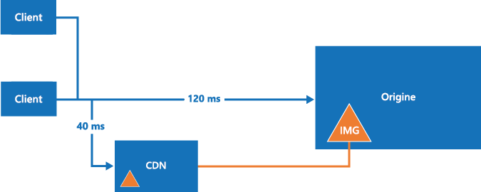

# Meilleures pratiques pour utiliser des réseaux de diffusion de contenu (CDN)

Un réseau de diffusion de contenu (CDN) est un réseau distribué de serveurs capables de fournir efficacement du contenu web aux utilisateurs. Il stocke le contenu en cache sur des serveurs de périmètre proches des utilisateurs finaux afin de réduire la latence. 

Les réseaux CDN sont généralement utilisés pour distribuer du contenu statique, notamment des images, des feuilles de style, des documents, des fichiers, des scripts côté client et des pages HTML. Leurs avantages principaux sont la diminution de la latence et l’accélération de la distribution de contenu aux utilisateurs, quel que soit leur emplacement géographique par rapport au centre de données dans lequel est hébergée l’application. Ils contribuent également à réduire la charge des applications web, car celles-ci n’ont plus à traiter les demandes portant sur le contenu hébergé dans le réseau CDN.
 

Dans Azure, [Azure Content Delivery Network](/azure/cdn/cdn-overview) est une solution CDN globale qui fournit du contenu à large bande passante hébergé dans Azure ou ailleurs. Il permet de mettre en cache des objets accessibles au public, chargés à partir du Stockage Blob Azure, d’une application web, d’une machine virtuelle ou d’un serveur web en accès public. 

Cette rubrique décrit certaines des meilleures pratiques, ainsi que des considérations générales sur l’utilisation d’un réseau CDN. Pour en savoir plus sur Azure CDN, consultez la page [Documentation sur les réseaux CDN](/azure/cdn/).

## Fonctionnement et raisons de l’utilisation d’un CDN

Un CDN est généralement utilisé dans les cas suivants :  

* La distribution de ressources statiques pour des applications clientes, souvent depuis un site web. Il peut s’agir d’images, de feuilles de style, de documents, de fichiers, de scripts côté client, de pages HTML, de fragments HTML ou de tout autre contenu que le serveur n’a pas besoin de modifier à chaque demande. L’application peut créer des éléments au cours de son exécution et les rendre disponibles au CDN (par exemple, en créant une liste de titres d’information actuels), mais elle ne le fait pas pour chaque demande.
* La distribution de contenu public statique et partagé à des appareils tels que des téléphones mobiles et des tablettes. L’application elle-même est un service web qui offre une API pour des clients s’exécutant sur divers appareils. Le CDN peut également fournir des jeux de données statiques (via le service web), que les clients peuvent utiliser, par exemple, pour générer l’interface utilisateur du client. Par exemple, le CDN peut permettre de distribuer des documents JSON ou XML.
* La mise à disposition de sites web entiers qui se composent uniquement de contenu statique public pour les clients, sans nécessiter de ressources de calcul dédiées.
* La diffusion en continu de fichiers vidéo à la demande pour le client. La vidéo bénéficie d’une latence faible et d’une connectivité fiable disponible depuis les centres de données répartis dans le monde qui offrent des connexions au CDN. Microsoft Azure Media Services (AMS) est intégré à Azure CDN afin de fournir directement du contenu au CDN en vue de sa redistribution. Pour plus d’informations, consultez [Vue d’ensemble des points de terminaison de streaming](/azure/media-services/media-services-streaming-endpoints-overview).
* L’amélioration générale de l’expérience des utilisateurs, en particulier de ceux qui se trouvent loin du centre de données hébergeant l’application. Autrement, ces utilisateurs peuvent pâtir d’une latence plus élevée. Une grande partie de la taille totale du contenu d’une application web est souvent statique et l’utilisation d’un CDN peut aider à maintenir la performance ainsi que l’expérience utilisateur générale tout en éliminant la contrainte du déploiement de l’application sur plusieurs centres de données. Vous trouverez la liste des emplacements de nœuds Azure CDN sur la page [Emplacements des points de présence des réseaux Azure CDN](/azure/cdn/cdn-pop-locations/).
* La prise en charge de solutions IoT (Internet des objets). La multitude d’appareils et d’appliances impliqués dans une solution IoT pourrait facilement surcharger l’application si celle-ci devait distribuer directement les mises à jour de microprogrammes à chacun des appareils.
* La gestion des fluctuations de la demande sans que l’application doive être mise à l’échelle, évitant ainsi une augmentation des coûts d’exécution. Par exemple, quand une mise à jour de système d’exploitation est publiée pour un appareil tel qu’un modèle spécifique de routeur, ou pour un bien de consommation tel qu’un téléviseur connecté, la demande croît fortement, car des millions d’utilisateurs et d’appareils télécharge la mise à jour sur une brève période.

## Défis

Il faut prendre en compte plusieurs problématiques avant d’utiliser un réseau CDN.  

* **Déploiement**. Choisissez l’origine à partir de laquelle le réseau CDN extraira le contenu, et déterminez si vous avez besoin de déployer ce contenu dans plusieurs systèmes de stockage. Prenez en compte le processus de déploiement des ressources et des contenus statiques. Par exemple, il se peut que vous deviez implémenter une étape distincte pour charger du contenu dans le stockage d’objets blob Azure.
* **Contrôle de version et de cache**. Envisagez la façon dont vous allez mettre à jour le contenu statique et déployer de nouvelles versions. Renseignez-vous sur la manière dont le réseau CDN effectue la mise en cache et la durée de vie (TTL). Pour Azure CDN, consultez la page [Comment fonctionne la mise en cache](/azure/cdn/cdn-how-caching-works).
* **Test**. Il peut être difficile de réaliser des tests locaux de vos paramètres de CDN lors du développement et du test d’une application localement ou dans un environnement intermédiaire.
* **Optimisation du référencement d’un site auprès d’un moteur de recherche (SEO)**. Du contenu tel que des images et des documents est servi à partir d’un autre domaine lorsque vous utilisez le CDN. Cela peut avoir un effet sur le SEO pour ce contenu.
* **Sécurité du contenu**. Les différents réseaux CDN n’offrent pas tous les types de contrôle d’accès au contenu. Certains de ces services, notamment Azure CDN, prennent en charge l’authentification par jeton pour protéger le contenu CDN. Pour plus d’informations, consultez la page [Sécuriser des ressources Azure Content Delivery Network avec l’authentification par jeton](/azure/cdn/cdn-token-auth).
* **Sécurité du client**. Des clients peuvent se connecter à partir d’un environnement qui n’autorise pas l’accès aux ressources sur le CDN. Cela peut être un environnement soumis à des contraintes de sécurité qui limite l’accès uniquement à un ensemble de sources connues ou qui empêche le chargement de ressources à partir de tout autre emplacement que la page d’origine. Une implémentation de secours est requise pour gérer ces situations.
* **Résilience**. Le CDN peut être le point unique de défaillance d’une application. 

Les scénarios où le CDN peut s’avérer moins utile sont :  

* Si le contenu présente un faible taux d’accès, il risque de n’être accessible qu’à quelques reprises lorsqu’il est valide (ce que détermine son paramètre de durée de vie). 
* Si les données sont privées, comme pour les grandes entreprises ou les écosystèmes de chaîne d’approvisionnement.

## Instructions générales et meilleures pratiques

Les réseaux CDN représentent un bon moyen de réduire la charge de l’application et d’optimiser la disponibilité et les performances. Envisagez d’adopter cette stratégie pour l’ensemble du contenu et des ressources appropriés que votre application utilise. Prenez en compte les points des sections suivantes pour concevoir votre stratégie d’utilisation d’un réseau CDN.

### Déploiement
Il se peut que vous deviez configurer et déployer le contenu statique indépendamment de l’application si vous ne l’incluez pas dans le package ou le processus de déploiement d’application. Pensez à la façon dont cela affectera l’approche du contrôle de version que vous utilisez pour gérer les composants d’application et le contenu de ressources statique.

Envisagez d’utiliser des techniques de regroupement et de minimisation afin de réduire le temps de chargement pour les clients. Le regroupement consiste à combiner plusieurs fichiers en un seul. La minimisation supprime les caractères inutiles des scripts et des fichiers CSS sans dégrader les fonctionnalités.

Si vous devez déployer le contenu à un emplacement supplémentaire, cela constitue une étape supplémentaire dans le processus de déploiement. Si l’application met à jour le contenu pour le CDN, peut-être à intervalles réguliers ou en réponse à un événement, elle doit stocker le contenu mis à jour dans tous les emplacements supplémentaires ainsi qu’au niveau du point de terminaison du CDN.

Déterminez la façon dont vous gérerez le développement et les tests en cas de traitement de contenu statique à partir d’un réseau CDN. Par exemple, vous pourriez prédéployer le contenu sur le réseau CDN dans votre script de génération. Une autre possibilité serait d’utiliser des indicateurs ou des directives de compilation pour contrôler la manière dont l’application charge les ressources. Par exemple, en mode débogage, l’application pourrait charger des ressources statiques à partir d’un dossier local. Dans la version finale, elle utiliserait le réseau CDN.

Étudiez les options de compression de fichier, notamment gzip (GNU zip). Cette opération peut être effectuée par l’application web d’hébergement sur le serveur d’origine, ou par le réseau CDN directement sur les serveurs de périmètre. Pour plus d’informations, consultez la page [Améliorer les performances en compressant les fichiers dans Azure CDN](/azure/cdn/cdn-improve-performance).

### Routage et contrôle de version
Il se peut que vous deviez utiliser différentes instances de CDN à différents moments. Par exemple, lorsque vous déployez une nouvelle version de l’application, vous pouvez utiliser un nouveau CDN et conserver l’ancien (comprenant du contenu de format plus ancien) pour des versions antérieures. Si vous utilisez le stockage d’objets blob Azure comme origine du contenu, vous pouvez créer un compte de stockage ou un conteneur distincts et pointer le point de terminaison CDN vers ce compte ou ce conteneur. 

N’utilisez pas la chaîne de requête pour indiquer d’autres versions de l’application dans des liens vers des ressources sur le CDN car, lors de la récupération de contenu à partir du stockage d’objets blob Azure, la chaîne de requête fait partie du nom de la ressource (nom d’objet blob). Cette approche peut également avoir une incidence sur la façon dont le client met en cache les ressources.

Le déploiement de nouvelles versions de contenu statique lorsque vous mettez à jour une application peut être problématique si les ressources précédentes sont mises en cache sur le CDN. Pour plus d’informations, consultez la section ci-dessous sur le contrôle du cache.

Envisagez de limiter l’accès au contenu du CDN par pays. Le CDN Azure vous permet de filtrer les demandes en fonction du pays d’origine, et de restreindre le contenu distribué. Pour plus d’informations, voir [Restriction de l’accès à votre contenu par pays](/azure/cdn/cdn-restrict-access-by-country/).

### contrôle de cache
Considérez comment gérer la mise en cache dans le système. Par exemple, dans Azure CDN, vous pouvez définir des règles globales de mise en cache, puis établir une mise en cache personnalisée pour les points de terminaison ayant une origine particulière. Vous avez également la possibilité de contrôler le déroulement de la mise en cache dans un réseau CDN en envoyant des en-têtes de directive de cache à l’origine. 

Pour plus d’informations, consultez la page [Comment fonctionne la mise en cache](/azure/cdn/cdn-how-caching-works).

Pour rendre les objets inaccessibles sur le réseau CDN, vous pouvez les supprimer de l’origine, supprimer le point de terminaison CDN ou, dans le cas du Stockage Blob, rendre le conteneur ou l’objet blob privé. Toutefois, les éléments ne seront supprimés qu'à l’expiration de la durée de vie. Vous pouvez également vider manuellement le point de terminaison CDN.

### Sécurité

Le CDN peut distribuer du contenu par le biais de HTTPS (SSL) à l’aide du certificat fourni par le CDN, ainsi que par l’intermédiaire du protocole HTTP standard. Afin d’éviter les avertissements de navigateur relatifs au contenu mixte, vous devrez peut-être utiliser HTTPS pour demander du contenu statique qui est affiché dans les pages chargées par le biais de HTTPS.

Si vous distribuez des ressources statiques telles que des fichiers de polices à l’aide du CDN, vous pouvez rencontrer des problèmes de stratégie de même origine dans les cas où vous utilisez un appel *XMLHttpRequest* pour demander ces ressources à partir d’un autre domaine. De nombreux navigateurs web empêchent le partage des ressources provenant de différentes origines (CORS) sauf si le serveur web est configuré pour définir les en-têtes de réponse appropriés. Vous pouvez configurer le CDN pour la prise en charge du mécanisme CORS en utilisant l’une des méthodes suivantes :

* Configurez le réseau CDN de façon à ajouter des en-têtes CORS aux réponses. Pour plus d’informations, consultez l’article [Utilisation d’Azure CDN avec CORS](/azure/cdn/cdn-cors). 
* Si l’origine est le Stockage Blob Azure, ajoutez des règles CORS au point de terminaison de stockage. Pour plus d’informations, consultez [Support du partage des ressources provenant de différentes origines (CORS) pour les services de stockage d’Azure](/rest/api/storageservices/Cross-Origin-Resource-Sharing--CORS--Support-for-the-Azure-Storage-Services).
* Configurez l’application de façon à définir les en-têtes CORS. Par exemple, consultez la section [Autoriser les demandes d’origines différentes (CORS)](/aspnet/core/security/cors) dans la documentation d’ASP.NET Core.

### Secours CDN
Envisagez la façon dont votre application peut faire face à une défaillance ou à une indisponibilité temporaire du CDN. Les applications clientes peuvent être en mesure d’utiliser des copies des ressources qui ont été mises en cache localement (sur le client) lors de requêtes précédentes. Vous pouvez également inclure du code qui détecte des défaillances, et demande à la place des ressources à partir de l’emplacement d’origine (dossier de l’application ou conteneur d’objets blob Azure contenant les ressources) si le CDN n’est pas disponible.
