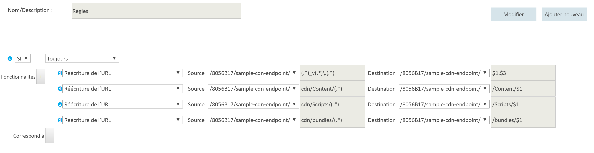

# <a name="content-delivery-network"></a><span data-ttu-id="7f012-103">Réseau de distribution de contenu</span><span class="sxs-lookup"><span data-stu-id="7f012-103">Content Delivery Network</span></span>
[!INCLUDE [header](../_includes/header.md)]

<span data-ttu-id="7f012-104">La fonction [Microsoft Azure Content Delivery Network (CDN)](/azure/cdn/cdn-overview) offre aux développeurs une solution globale pour fournir du contenu de large bande passante hébergé dans Azure ou ailleurs.</span><span class="sxs-lookup"><span data-stu-id="7f012-104">The Microsoft Azure [Content Delivery Network (CDN)](/azure/cdn/cdn-overview) offers developers a global solution for delivering high-bandwidth content that is hosted in Azure or any other location.</span></span> <span data-ttu-id="7f012-105">Le réseau de diffusion de contenu (CDN) vous permet de mettre en cache des objets disponibles publiquement, chargés à partir d’un stockage d’objets blob Azure, d’une application web, d’une machine virtuelle, d’un dossier d’application ou d’un autre emplacement HTTP/HTTPS.</span><span class="sxs-lookup"><span data-stu-id="7f012-105">Using the CDN, you can cache publicly available objects loaded from Azure blob storage, a web application, virtual machine, application folder, or other HTTP/HTTPS location.</span></span> <span data-ttu-id="7f012-106">Le cache du CDN peut être maintenu dans des emplacements stratégiques afin d’offrir une bande passante maximale pour la distribution de contenu aux utilisateurs.</span><span class="sxs-lookup"><span data-stu-id="7f012-106">The CDN cache can be held at strategic locations to provide maximum bandwidth for delivering content to users.</span></span> <span data-ttu-id="7f012-107">Le CDN est généralement utilisé pour distribuer du contenu statique tel que des images, des feuilles de style, des documents, des fichiers, des scripts côté client et des pages HTML.</span><span class="sxs-lookup"><span data-stu-id="7f012-107">The CDN is typically used for delivering static content such as images, style sheets, documents, files, client-side scripts, and HTML pages.</span></span>

<span data-ttu-id="7f012-108">Vous pouvez également utiliser le CDN en tant que cache pour servir du contenu dynamique, tel qu’un rapport au format PDF ou un graphique basé sur des entrées spécifiées. Si les mêmes valeurs d’entrée sont fournies par différents utilisateurs, le résultat doit être identique.</span><span class="sxs-lookup"><span data-stu-id="7f012-108">You can also use the CDN as a cache for serving dynamic content, such as a PDF report or graph based on specified inputs; if the same input values are provided by different users the result should be the same.</span></span>

<span data-ttu-id="7f012-109">Les principaux avantages de l’utilisation du CDN sont une latence plus faible et une distribution plus rapide de contenu aux utilisateurs, quel que soit leur emplacement géographique par rapport au centre de données où l’application est hébergée.</span><span class="sxs-lookup"><span data-stu-id="7f012-109">The major advantages of using the CDN are lower latency and faster delivery of content to users irrespective of their geographical location in relation to the datacenter where the application is hosted.</span></span>  


<span data-ttu-id="7f012-111">L’utilisation du CDN doit également contribuer à réduire la charge sur l’application, car celle-ci est libérée du traitement requis pour accéder au contenu et le distribuer.</span><span class="sxs-lookup"><span data-stu-id="7f012-111">Using the CDN should also help to reduce the load on application because it is relieved of the processing required to access and deliver the content.</span></span> <span data-ttu-id="7f012-112">Cette réduction de charge peut contribuer à augmenter les performances et l’extensibilité de l’application, tout en minimisant les coûts d’hébergement par une réduction des ressources de traitement requises pour atteindre un certain niveau de performances et de disponibilité.</span><span class="sxs-lookup"><span data-stu-id="7f012-112">This reduction in load can help to increase the performance and scalability of the application, as well as minimizing hosting costs by reducing the processing resources required to achieve a specific level of performance and availability.</span></span>

## <a name="how-and-why-a-cdn-is-used"></a><span data-ttu-id="7f012-113">Fonctionnement et raisons de l’utilisation d’un CDN</span><span class="sxs-lookup"><span data-stu-id="7f012-113">How and why a CDN is used</span></span>
<span data-ttu-id="7f012-114">Un CDN est généralement utilisé dans les cas suivants :</span><span class="sxs-lookup"><span data-stu-id="7f012-114">Typical uses for a CDN include:</span></span>  

* <span data-ttu-id="7f012-115">La distribution de ressources statiques pour des applications clientes, souvent depuis un site web.</span><span class="sxs-lookup"><span data-stu-id="7f012-115">Delivering static resources for client applications, often from a website.</span></span> <span data-ttu-id="7f012-116">Il peut s’agir d’images, de feuilles de style, de documents, de fichiers, de scripts côté client, de pages HTML, de fragments HTML ou de tout autre contenu que le serveur n’a pas besoin de modifier à chaque demande.</span><span class="sxs-lookup"><span data-stu-id="7f012-116">These resources can be images, style sheets, documents, files, client-side scripts, HTML pages, HTML fragments, or any other content that the server does not need to modify for each request.</span></span> <span data-ttu-id="7f012-117">L’application peut créer des éléments au cours de son exécution et les rendre disponibles au CDN (par exemple, en créant une liste de titres d’information actuels), mais elle ne le fait pas pour chaque demande.</span><span class="sxs-lookup"><span data-stu-id="7f012-117">The application can create items at runtime and make them available to the CDN (for example, by creating a list of current news headlines), but it does not do so for each request.</span></span>
* <span data-ttu-id="7f012-118">La distribution de contenu public statique et partagé à des appareils tels que des téléphones mobiles et des tablettes.</span><span class="sxs-lookup"><span data-stu-id="7f012-118">Delivering public static and shared content to devices such as mobile phones and tablet computers.</span></span> <span data-ttu-id="7f012-119">L’application elle-même est un service web qui offre une API pour des clients s’exécutant sur divers appareils.</span><span class="sxs-lookup"><span data-stu-id="7f012-119">The application itself is a web service that offers an API to clients running on the various devices.</span></span> <span data-ttu-id="7f012-120">Le CDN peut également fournir des jeux de données statiques (via le service web), que les clients peuvent utiliser, par exemple, pour générer l’interface utilisateur du client.</span><span class="sxs-lookup"><span data-stu-id="7f012-120">The CDN can also deliver static datasets (via the web service) for the clients to use, perhaps to generate the client UI.</span></span> <span data-ttu-id="7f012-121">Par exemple, le CDN peut permettre de distribuer des documents JSON ou XML.</span><span class="sxs-lookup"><span data-stu-id="7f012-121">For example, the CDN could be used to distribute JSON or XML documents.</span></span>
* <span data-ttu-id="7f012-122">La mise à disposition de sites web entiers qui se composent uniquement de contenu statique public pour les clients, sans nécessiter de ressources de calcul dédiées.</span><span class="sxs-lookup"><span data-stu-id="7f012-122">Serving entire websites that consist of only public static content to clients, without requiring any dedicated compute resources.</span></span>
* <span data-ttu-id="7f012-123">La diffusion en continu de fichiers vidéo à la demande pour le client.</span><span class="sxs-lookup"><span data-stu-id="7f012-123">Streaming video files to the client on demand.</span></span> <span data-ttu-id="7f012-124">La vidéo bénéficie d’une latence faible et d’une connectivité fiable disponible depuis les centres de données répartis dans le monde qui offrent des connexions au CDN.</span><span class="sxs-lookup"><span data-stu-id="7f012-124">Video benefits from the low latency and reliable connectivity available from the globally located datacenters that offer CDN connections.</span></span> <span data-ttu-id="7f012-125">Microsoft Azure Media Services (AMS) est intégré à Azure CDN afin de fournir directement du contenu au CDN en vue de sa redistribution.</span><span class="sxs-lookup"><span data-stu-id="7f012-125">Microsoft Azure Media Services (AMS) integrates with Azure CDN to deliver content directly to the CDN for further distribution.</span></span> <span data-ttu-id="7f012-126">Pour plus d’informations, consultez [Vue d’ensemble des points de terminaison de streaming](/azure/media-services/media-services-streaming-endpoints-overview).</span><span class="sxs-lookup"><span data-stu-id="7f012-126">For more information, see [Streaming endpoints overview](/azure/media-services/media-services-streaming-endpoints-overview).</span></span>
* <span data-ttu-id="7f012-127">L’amélioration générale de l’expérience des utilisateurs, en particulier de ceux qui se trouvent loin du centre de données hébergeant l’application.</span><span class="sxs-lookup"><span data-stu-id="7f012-127">Generally improving the experience for users, especially those located far from the datacenter hosting the application.</span></span> <span data-ttu-id="7f012-128">Autrement, ces utilisateurs peuvent pâtir d’une latence plus élevée.</span><span class="sxs-lookup"><span data-stu-id="7f012-128">These users might otherwise suffer higher latency.</span></span> <span data-ttu-id="7f012-129">Une grande partie de la taille totale du contenu d’une application web est souvent statique et l’utilisation d’un CDN peut aider à maintenir la performance ainsi que l’expérience utilisateur générale tout en éliminant la contrainte du déploiement de l’application sur plusieurs centres de données.</span><span class="sxs-lookup"><span data-stu-id="7f012-129">A large proportion of the total size of the content in a web application is often static, and using the CDN can help to maintain performance and overall user experience while eliminating the requirement to deploy the application to multiple data centers.</span></span>
* <span data-ttu-id="7f012-130">La gestion de la charge croissante pesant sur les applications qui prennent en charge les solutions IoT (Internet of Things, Internet des objets).</span><span class="sxs-lookup"><span data-stu-id="7f012-130">Handling the growing load on applications that support IoT (Internet of Things) solutions.</span></span> <span data-ttu-id="7f012-131">Le nombre considérable de ces appareils et équipements pourrait facilement déborder une application si celle-ci devait traiter les messages de diffusion et gérer la distribution des mises à jour de microprogrammes directement à chaque service.</span><span class="sxs-lookup"><span data-stu-id="7f012-131">The huge numbers of such devices and appliances involved could easily overwhelm an application if it was required to process broadcast messages and manage firmware update distribution directly to each device.</span></span>
* <span data-ttu-id="7f012-132">La gestion des fluctuations de la demande sans que l’application doive être mise à l’échelle, évitant ainsi une augmentation des coûts d’exécution.</span><span class="sxs-lookup"><span data-stu-id="7f012-132">Coping with peaks and surges in demand without requiring the application to scale, avoiding the consequent increased running costs.</span></span> <span data-ttu-id="7f012-133">Par exemple, quand une mise à jour de système d’exploitation est publiée pour un appareil tel qu’un modèle spécifique de routeur, ou pour un bien de consommation tel qu’un téléviseur connecté, la demande croît fortement, car des millions d’utilisateurs et d’appareils télécharge la mise à jour sur une brève période.</span><span class="sxs-lookup"><span data-stu-id="7f012-133">For example, when an update to an operating system is released for a hardware device such as a specific model of router, or for a consumer device such as a smart TV, there will be a huge peak in demand as it is downloaded by millions of users and devices over a short period.</span></span>

<span data-ttu-id="7f012-134">La liste suivante répertorie des exemples de temps médian jusqu’au premier octet dans différentes zones géographiques.</span><span class="sxs-lookup"><span data-stu-id="7f012-134">The following list shows examples of the median time to first byte from various geographic locations.</span></span> <span data-ttu-id="7f012-135">Le rôle web cible est déployé sur Azure dans l’ouest des États-Unis.</span><span class="sxs-lookup"><span data-stu-id="7f012-135">The target web role is deployed to Azure West US.</span></span> <span data-ttu-id="7f012-136">Il existe un lien étroit entre la forte stimulation due au CDN et la proximité d’un nœud du CDN.</span><span class="sxs-lookup"><span data-stu-id="7f012-136">There is a strong correlation between greater boost due to the CDN and proximity to a CDN node.</span></span> <span data-ttu-id="7f012-137">Pour obtenir la liste complète des emplacements de nœuds CDN Azure, consultez [Emplacements des nœuds du réseau de distribution de contenu (CDN) Azure](/azure/cdn/cdn-pop-locations/).</span><span class="sxs-lookup"><span data-stu-id="7f012-137">A complete list of Azure CDN node locations is available at [Azure Content Delivery Network (CDN) Node Locations](/azure/cdn/cdn-pop-locations/).</span></span>

|  | <span data-ttu-id="7f012-138">Temps (en ms) jusqu’au premier octet (origine)</span><span class="sxs-lookup"><span data-stu-id="7f012-138">Time (ms) to First Byte (Origin)</span></span> | <span data-ttu-id="7f012-139">Temps (en ms) jusqu’au premier octet (CDN)</span><span class="sxs-lookup"><span data-stu-id="7f012-139">Time (ms) to First (CDN)</span></span> | <span data-ttu-id="7f012-140">% d’amélioration du temps CDN</span><span class="sxs-lookup"><span data-stu-id="7f012-140">%CDN time improvement</span></span> |
| --- | --- | --- | --- |
| <span data-ttu-id="7f012-141">\*San Jose, CA</span><span class="sxs-lookup"><span data-stu-id="7f012-141">\*San Jose, CA</span></span> |<span data-ttu-id="7f012-142">47,5</span><span class="sxs-lookup"><span data-stu-id="7f012-142">47.5</span></span> |<span data-ttu-id="7f012-143">46,5</span><span class="sxs-lookup"><span data-stu-id="7f012-143">46.5</span></span> |<span data-ttu-id="7f012-144">2%</span><span class="sxs-lookup"><span data-stu-id="7f012-144">2%</span></span> |
| <span data-ttu-id="7f012-145">\*\*Dulles, VA</span><span class="sxs-lookup"><span data-stu-id="7f012-145">\*\*Dulles, VA</span></span> |<span data-ttu-id="7f012-146">109</span><span class="sxs-lookup"><span data-stu-id="7f012-146">109</span></span> |<span data-ttu-id="7f012-147">40,5</span><span class="sxs-lookup"><span data-stu-id="7f012-147">40.5</span></span> |<span data-ttu-id="7f012-148">169 %</span><span class="sxs-lookup"><span data-stu-id="7f012-148">169%</span></span> |
| <span data-ttu-id="7f012-149">Buenos Aires, AR</span><span class="sxs-lookup"><span data-stu-id="7f012-149">Buenos Aires, AR</span></span> |<span data-ttu-id="7f012-150">210</span><span class="sxs-lookup"><span data-stu-id="7f012-150">210</span></span> |<span data-ttu-id="7f012-151">151</span><span class="sxs-lookup"><span data-stu-id="7f012-151">151</span></span> |<span data-ttu-id="7f012-152">39 %</span><span class="sxs-lookup"><span data-stu-id="7f012-152">39%</span></span> |
| <span data-ttu-id="7f012-153">\*Londres, Royaume-Uni</span><span class="sxs-lookup"><span data-stu-id="7f012-153">\*London, UK</span></span> |<span data-ttu-id="7f012-154">195</span><span class="sxs-lookup"><span data-stu-id="7f012-154">195</span></span> |<span data-ttu-id="7f012-155">44</span><span class="sxs-lookup"><span data-stu-id="7f012-155">44</span></span> |<span data-ttu-id="7f012-156">343 %</span><span class="sxs-lookup"><span data-stu-id="7f012-156">343%</span></span> |
| <span data-ttu-id="7f012-157">Shanghai, CN</span><span class="sxs-lookup"><span data-stu-id="7f012-157">Shanghai, CN</span></span> |<span data-ttu-id="7f012-158">242</span><span class="sxs-lookup"><span data-stu-id="7f012-158">242</span></span> |<span data-ttu-id="7f012-159">206</span><span class="sxs-lookup"><span data-stu-id="7f012-159">206</span></span> |<span data-ttu-id="7f012-160">17 %</span><span class="sxs-lookup"><span data-stu-id="7f012-160">17%</span></span> |
| <span data-ttu-id="7f012-161">\*Singapour</span><span class="sxs-lookup"><span data-stu-id="7f012-161">\*Singapore</span></span> |<span data-ttu-id="7f012-162">214</span><span class="sxs-lookup"><span data-stu-id="7f012-162">214</span></span> |<span data-ttu-id="7f012-163">74</span><span class="sxs-lookup"><span data-stu-id="7f012-163">74</span></span> |<span data-ttu-id="7f012-164">189%</span><span class="sxs-lookup"><span data-stu-id="7f012-164">189%</span></span> |
| <span data-ttu-id="7f012-165">\*Tokyo, JP</span><span class="sxs-lookup"><span data-stu-id="7f012-165">\*Tokyo, JP</span></span> |<span data-ttu-id="7f012-166">163</span><span class="sxs-lookup"><span data-stu-id="7f012-166">163</span></span> |<span data-ttu-id="7f012-167">48</span><span class="sxs-lookup"><span data-stu-id="7f012-167">48</span></span> |<span data-ttu-id="7f012-168">204%</span><span class="sxs-lookup"><span data-stu-id="7f012-168">204%</span></span> |
| <span data-ttu-id="7f012-169">Séoul, KR</span><span class="sxs-lookup"><span data-stu-id="7f012-169">Seoul, KR</span></span> |<span data-ttu-id="7f012-170">190</span><span class="sxs-lookup"><span data-stu-id="7f012-170">190</span></span> |<span data-ttu-id="7f012-171">190</span><span class="sxs-lookup"><span data-stu-id="7f012-171">190</span></span> |<span data-ttu-id="7f012-172">0 %</span><span class="sxs-lookup"><span data-stu-id="7f012-172">0%</span></span> |

<span data-ttu-id="7f012-173">\* A un nœud de CDN Azure dans la même ville.</span><span class="sxs-lookup"><span data-stu-id="7f012-173">\* Has an Azure CDN node in the same city.</span></span>  
<span data-ttu-id="7f012-174">\*\* A un nœud de CDN Azure dans une ville voisine.</span><span class="sxs-lookup"><span data-stu-id="7f012-174">\*\* Has an Azure CDN node in a neighboring city.</span></span>  

## <a name="challenges"></a><span data-ttu-id="7f012-175">Défis</span><span class="sxs-lookup"><span data-stu-id="7f012-175">Challenges</span></span>
<span data-ttu-id="7f012-176">Il existe plusieurs problèmes à prendre en compte lorsque vous envisagez d’utiliser le CDN :</span><span class="sxs-lookup"><span data-stu-id="7f012-176">There are several challenges to take into account when planning to use the CDN:</span></span>  

* <span data-ttu-id="7f012-177">**Déploiement**.</span><span class="sxs-lookup"><span data-stu-id="7f012-177">**Deployment**.</span></span> <span data-ttu-id="7f012-178">Déterminez l’origine à partir de laquelle le CDN extrait le contenu, et décidez si vous avez besoin de déployer le contenu dans plusieurs systèmes de stockage (par exemple, dans le CDN et à un autre emplacement).</span><span class="sxs-lookup"><span data-stu-id="7f012-178">Decide the origin from which the CDN fetches the content, and whether you need to deploy the content in more than one storage system (such as in the CDN and an alternative location).</span></span>

  <span data-ttu-id="7f012-179">Le mécanisme de déploiement de votre application doit prendre en compte le processus de déploiement de contenu et de ressources statiques, ainsi que de déploiement des fichiers d’application tels que des pages ASPX.</span><span class="sxs-lookup"><span data-stu-id="7f012-179">Your application deployment mechanism must take into account the process for deploying static content and resources as well as deploying the application files, such as ASPX pages.</span></span> <span data-ttu-id="7f012-180">Par exemple, il se peut que vous deviez implémenter une étape distincte pour charger du contenu dans le stockage d’objets blob Azure.</span><span class="sxs-lookup"><span data-stu-id="7f012-180">For example, you may need to implement a separate step to load content into Azure blob storage.</span></span>
* <span data-ttu-id="7f012-181">**Contrôle de version et de cache**.</span><span class="sxs-lookup"><span data-stu-id="7f012-181">**Versioning and cache-control**.</span></span> <span data-ttu-id="7f012-182">Envisagez la façon dont vous allez mettre à jour le contenu statique et déployer de nouvelles versions.</span><span class="sxs-lookup"><span data-stu-id="7f012-182">Consider how you will update static content and deploy new versions.</span></span> <span data-ttu-id="7f012-183">Le contenu du CDN peut être [vidé](/azure/cdn/cdn-purge-endpoint/) à l’aide du portail Azure lorsque de nouvelles versions de vos ressources sont disponibles.</span><span class="sxs-lookup"><span data-stu-id="7f012-183">The CDN content may be [purged](/azure/cdn/cdn-purge-endpoint/) using the Azure portal when new versions of your assets are available.</span></span> <span data-ttu-id="7f012-184">Il s’agit d’un défi comparable à la gestion de la mise en cache côté client, comme celle qui se produit dans un navigateur web.</span><span class="sxs-lookup"><span data-stu-id="7f012-184">This is a similar challenge to managing client-side caching, such as that which occurs in a web browser.</span></span>
* <span data-ttu-id="7f012-185">**Test**.</span><span class="sxs-lookup"><span data-stu-id="7f012-185">**Testing**.</span></span> <span data-ttu-id="7f012-186">Il peut être difficile de réaliser des tests locaux de vos paramètres de CDN lors du développement et du test d’une application localement ou dans un environnement intermédiaire.</span><span class="sxs-lookup"><span data-stu-id="7f012-186">It can be difficult to perform local testing of your CDN settings when developing and testing an application locally or in a staging environment.</span></span>
* <span data-ttu-id="7f012-187">**Optimisation du référencement d’un site auprès d’un moteur de recherche (SEO)**.</span><span class="sxs-lookup"><span data-stu-id="7f012-187">**Search engine optimization (SEO)**.</span></span> <span data-ttu-id="7f012-188">Du contenu tel que des images et des documents est servi à partir d’un autre domaine lorsque vous utilisez le CDN.</span><span class="sxs-lookup"><span data-stu-id="7f012-188">Content such as images and documents are served from a different domain when you use the CDN.</span></span> <span data-ttu-id="7f012-189">Cela peut avoir un effet sur le SEO pour ce contenu.</span><span class="sxs-lookup"><span data-stu-id="7f012-189">This can have an effect on SEO for this content.</span></span>
* <span data-ttu-id="7f012-190">**Sécurité du contenu**.</span><span class="sxs-lookup"><span data-stu-id="7f012-190">**Content security**.</span></span> <span data-ttu-id="7f012-191">De nombreux services de CDN, tel le CDN Azure, n’offrent actuellement aucun type de contrôle d’accès pour le contenu.</span><span class="sxs-lookup"><span data-stu-id="7f012-191">Many CDN services such as Azure CDN do not currently offer any type of access control for the content.</span></span>
* <span data-ttu-id="7f012-192">**Sécurité du client**.</span><span class="sxs-lookup"><span data-stu-id="7f012-192">**Client security**.</span></span> <span data-ttu-id="7f012-193">Des clients peuvent se connecter à partir d’un environnement qui n’autorise pas l’accès aux ressources sur le CDN.</span><span class="sxs-lookup"><span data-stu-id="7f012-193">Clients might connect from an environment that does not allow access to resources on the CDN.</span></span> <span data-ttu-id="7f012-194">Cela peut être un environnement soumis à des contraintes de sécurité qui limite l’accès uniquement à un ensemble de sources connues ou qui empêche le chargement de ressources à partir de tout autre emplacement que la page d’origine.</span><span class="sxs-lookup"><span data-stu-id="7f012-194">This could be a security-constrained environment that limits access to only a set of known sources, or one that prevents loading of resources from anything other than the page origin.</span></span> <span data-ttu-id="7f012-195">Une implémentation de secours est requise pour gérer ces situations.</span><span class="sxs-lookup"><span data-stu-id="7f012-195">A fallback implementation is required to handle these cases.</span></span>
* <span data-ttu-id="7f012-196">**Résilience**.</span><span class="sxs-lookup"><span data-stu-id="7f012-196">**Resilience**.</span></span> <span data-ttu-id="7f012-197">Le CDN peut être le point unique de défaillance d’une application.</span><span class="sxs-lookup"><span data-stu-id="7f012-197">The CDN is a potential single point of failure for an application.</span></span> <span data-ttu-id="7f012-198">Il dispose d’une disponibilité SLA inférieure au stockage d’objets blob (qui peut être utilisé pour distribuer directement du contenu). Par conséquent, vous devrez peut-être envisager d’implémenter un mécanisme de secours pour le contenu important.</span><span class="sxs-lookup"><span data-stu-id="7f012-198">It has a lower availability SLA than blob storage (which can be used to deliver content directly) so you may need to consider implementing a fallback mechanism for critical content.</span></span>

  <span data-ttu-id="7f012-199">Vous pouvez surveiller la disponibilité du contenu, la bande passante, les données transférées, les accès, le taux de correspondances dans le cache et les métriques du cache de votre CDN sur le portail Azure en [temps réel](/azure/cdn/cdn-real-time-stats/) et dans les [rapports agrégés](/azure/cdn/cdn-analyze-usage-patterns/).</span><span class="sxs-lookup"><span data-stu-id="7f012-199">You can monitor your CDN content availability, bandwidth, data transferred, hits, cache hit ratio, and cache metrics from the Azure portal in [real-time](/azure/cdn/cdn-real-time-stats/) and [aggregate reports](/azure/cdn/cdn-analyze-usage-patterns/).</span></span>

<span data-ttu-id="7f012-200">Les scénarios où le CDN peut s’avérer moins utile sont :</span><span class="sxs-lookup"><span data-stu-id="7f012-200">Scenarios where CDN may be less useful include:</span></span>  

* <span data-ttu-id="7f012-201">Si le contenu présente un faible taux d’accès, il risque de n’être accessible qu’à quelques reprises lorsqu’il est valide (ce que détermine son paramètre de durée de vie).</span><span class="sxs-lookup"><span data-stu-id="7f012-201">If the content has a low hit rate, it might be accessed only few times while it is valid (determined by its time-to-live setting).</span></span> <span data-ttu-id="7f012-202">La première fois qu’un élément est téléchargé, vous encourez deux frais de transaction (du point d’origine au CDN, puis du CDN au client).</span><span class="sxs-lookup"><span data-stu-id="7f012-202">The first time an item is downloaded you incur two transaction charges from the origin to the CDN, and then from the CDN to the customer.</span></span>
* <span data-ttu-id="7f012-203">Si les données sont privées, comme pour les grandes entreprises ou les écosystèmes de chaîne d’approvisionnement.</span><span class="sxs-lookup"><span data-stu-id="7f012-203">If the data is private, such as for large enterprises or supply chain ecosystems.</span></span>

## <a name="general-guidelines-and-good-practices"></a><span data-ttu-id="7f012-204">Instructions générales et meilleures pratiques</span><span class="sxs-lookup"><span data-stu-id="7f012-204">General guidelines and good practices</span></span>
<span data-ttu-id="7f012-205">L’utilisation du CDN est une bonne façon de réduire la charge sur votre application et d’optimiser la disponibilité et les performances.</span><span class="sxs-lookup"><span data-stu-id="7f012-205">Using the CDN is a good way to minimize the load on your application, and maximize availability and performance.</span></span> <span data-ttu-id="7f012-206">Envisagez d’adopter cette stratégie pour l’ensemble du contenu et des ressources appropriés que votre application utilise.</span><span class="sxs-lookup"><span data-stu-id="7f012-206">Consider adopting this strategy for all of the appropriate content and resources your application uses.</span></span> <span data-ttu-id="7f012-207">Lors de l’élaboration de votre stratégie d’utilisation du CDN, prenez en considération les points des sections suivantes :</span><span class="sxs-lookup"><span data-stu-id="7f012-207">Consider the points in the following sections when designing your strategy to use the CDN:</span></span>  

### <a name="origin"></a><span data-ttu-id="7f012-208">Origine</span><span class="sxs-lookup"><span data-stu-id="7f012-208">Origin</span></span>
<span data-ttu-id="7f012-209">Un déploiement de contenu via la fonction CDN nécessite simplement que vous spécifiiez un [point de terminaison](/azure/cdn/cdn-create-new-endpoint) HTTP et/ou HTTPS que le service CDN utilisera pour accéder au contenu et le mettre en cache.</span><span class="sxs-lookup"><span data-stu-id="7f012-209">Deploying content through the CDN simply requires you to specify an HTTP and/or HTTPS [endpoint](/azure/cdn/cdn-create-new-endpoint) that the CDN service will use to access and cache the content.</span></span>

<span data-ttu-id="7f012-210">Le point de terminaison peut spécifier un conteneur de stockage d’objets blob Azure comprenant le contenu statique que vous voulez distribuer via le CDN.</span><span class="sxs-lookup"><span data-stu-id="7f012-210">The endpoint can specify an Azure blob storage container that holds the static content you want to deliver through the CDN.</span></span> <span data-ttu-id="7f012-211">Le conteneur doit être marqué comme étant public.</span><span class="sxs-lookup"><span data-stu-id="7f012-211">The container must be marked as public.</span></span> <span data-ttu-id="7f012-212">Seuls les blobs d’un conteneur public qui disposent d’un accès en lecture public sont disponibles par le biais du CDN.</span><span class="sxs-lookup"><span data-stu-id="7f012-212">Only blobs in a public container that have public read access are available through the CDN.</span></span>

<span data-ttu-id="7f012-213">Le point de terminaison peut spécifier un dossier nommé **cdn** dans la racine de l’une des couches de calcul de l’application (par exemple, un rôle web ou une machine virtuelle).</span><span class="sxs-lookup"><span data-stu-id="7f012-213">The endpoint can specify a folder named **cdn** in the root of one of application’s compute layers (such as a web role or a virtual machine).</span></span> <span data-ttu-id="7f012-214">Les résultats des demandes de ressources, y compris des ressources dynamiques telles que des pages ASPX, sont mis en cache sur le CDN.</span><span class="sxs-lookup"><span data-stu-id="7f012-214">The results from requests for resources, including dynamic resources such as ASPX pages, will be cached on the CDN.</span></span> <span data-ttu-id="7f012-215">La période minimale de mise en cache est de 300 secondes.</span><span class="sxs-lookup"><span data-stu-id="7f012-215">The minimum cache period is 300 seconds.</span></span> <span data-ttu-id="7f012-216">Une période plus courte empêche le déploiement du contenu sur le CDN (pour plus d’informations, consultez la section *Contrôle de cache* plus bas dans cet article).</span><span class="sxs-lookup"><span data-stu-id="7f012-216">Any shorter period prevents the content from being deployed to the CDN (for more information, see the following heading *Cache control* below).</span></span>

<span data-ttu-id="7f012-217">Si vous utilisez Azure Web Apps, le point de terminaison est défini dans le dossier racine du site en sélectionnant le site lors de la création de l’instance du CDN.</span><span class="sxs-lookup"><span data-stu-id="7f012-217">If you are using Azure Web Apps, the endpoint is set to the root folder of the site by selecting the site when creating the CDN instance.</span></span> <span data-ttu-id="7f012-218">Tout le contenu du site est accessible via le CDN.</span><span class="sxs-lookup"><span data-stu-id="7f012-218">All of the content for the site will be available through the CDN.</span></span>

<span data-ttu-id="7f012-219">Dans la plupart des cas, le pointage de votre point de terminaison CDN vers un dossier de l’une des couches de calcul de votre application vous offre un surcroît de flexibilité et de contrôle.</span><span class="sxs-lookup"><span data-stu-id="7f012-219">In most cases, pointing your CDN endpoint at a folder within one of the compute layers of your application offers more flexibility and control.</span></span> <span data-ttu-id="7f012-220">Par exemple, il est plus facile de gérer les exigences de routage actuelles et futures et de générer de façon dynamique le contenu statique tel que des images miniatures.</span><span class="sxs-lookup"><span data-stu-id="7f012-220">For instance, it makes it easier to manage current and future routing requirements, and dynamically generate static content such as image thumbnails.</span></span>

<span data-ttu-id="7f012-221">Vous pouvez utiliser des [chaînes de requête](/azure/cdn/cdn-query-string/) pour différencier les objets dans le cache lorsque le contenu est distribué à partir de sources dynamiques telles que les pages ASPX.</span><span class="sxs-lookup"><span data-stu-id="7f012-221">You can use [query strings](/azure/cdn/cdn-query-string/) to differentiate objects in the cache when content is delivered from dynamic sources, such as ASPX pages.</span></span> <span data-ttu-id="7f012-222">Toutefois, vous pouvez désactiver ce comportement à l’aide d’un paramètre dans le portail Azure lorsque vous spécifiez le point de terminaison CDN.</span><span class="sxs-lookup"><span data-stu-id="7f012-222">However, this behavior can be disabled by a setting in the Azure portal when you specify the CDN endpoint.</span></span> <span data-ttu-id="7f012-223">Lors de la distribution de contenu à partir du stockage d’objets blob, les chaînes de requête sont traitées comme des littéraux de chaîne de manière à ce que deux éléments présentant le même nom mais des chaînes de requête différentes soient stockés en tant qu’éléments distincts sur le CDN.</span><span class="sxs-lookup"><span data-stu-id="7f012-223">When delivering content from blob storage, query strings are treated as string literals so two items that have the same name but different query strings are stored as separate items on the CDN.</span></span>

<span data-ttu-id="7f012-224">Vous pouvez utiliser la réécriture d’URL pour les ressources telles que les scripts et autres contenus afin d’éviter de déplacer vos fichiers dans le dossier d’origine du CDN.</span><span class="sxs-lookup"><span data-stu-id="7f012-224">You can utilize URL rewriting for resources, such as scripts and other content, to avoid moving your files to the CDN origin folder.</span></span>

<span data-ttu-id="7f012-225">Lorsque vous utilisez des blobs de stockage Azure pour conserver le contenu du CDN, l’URL des ressources dans les blobs est sensible à la casse pour le nom du conteneur et des blobs.</span><span class="sxs-lookup"><span data-stu-id="7f012-225">When using Azure storage blobs to hold content for the CDN, the URL of the resources in blobs is case-sensitive for the container and blob name.</span></span>

<span data-ttu-id="7f012-226">Lorsque vous utilisez des origines personnalisées ou Azure Web Apps, vous spécifiez le chemin d’accès à l’instance CDN dans les liens vers les ressources.</span><span class="sxs-lookup"><span data-stu-id="7f012-226">When using custom origins or Azure Web Apps, you specify the path to the CDN instance in the links to resources.</span></span> <span data-ttu-id="7f012-227">Par exemple, le code suivant spécifie un fichier image dans le dossier **Images** dossier du site qui sera distribué via le CDN :</span><span class="sxs-lookup"><span data-stu-id="7f012-227">For example, the following specifies an image file in the **Images** folder of the site that will be delivered through the CDN:</span></span>

```XML

```

### <a name="deployment"></a><span data-ttu-id="7f012-228">Déploiement</span><span class="sxs-lookup"><span data-stu-id="7f012-228">Deployment</span></span>
<span data-ttu-id="7f012-229">Il se peut que vous deviez configurer et déployer le contenu statique indépendamment de l’application si vous ne l’incluez pas dans le package ou le processus de déploiement d’application.</span><span class="sxs-lookup"><span data-stu-id="7f012-229">Static content may need to be provisioned and deployed independently from the application if you do not include it in the application deployment package or process.</span></span> <span data-ttu-id="7f012-230">Pensez à la façon dont cela affectera l’approche du contrôle de version que vous utilisez pour gérer les composants d’application et le contenu de ressources statique.</span><span class="sxs-lookup"><span data-stu-id="7f012-230">Consider how this will affect the versioning approach you use to manage both the application components and the static resource content.</span></span>

<span data-ttu-id="7f012-231">Pensez à la façon dont le regroupement (le rassemblement de plusieurs fichiers dans un seul fichier) et la minimisation (la suppression de caractères inutiles tels que des espaces blancs, les caractères de nouvelle ligne, les commentaires et autres caractères) des scripts et des fichiers CSS peuvent être gérés.</span><span class="sxs-lookup"><span data-stu-id="7f012-231">Consider how bundling (combining several files into one file) and minification (removing unnecessary characters such as white space, new line characters, comments, and other characters) for script and CSS files will be handled.</span></span> <span data-ttu-id="7f012-232">Ces techniques couramment utilisées peuvent réduire les temps de chargement pour les clients, et sont compatibles avec la distribution de contenu via le CDN.</span><span class="sxs-lookup"><span data-stu-id="7f012-232">These are commonly used techniques that can reduce load times for clients, and are compatible with delivering content through the CDN.</span></span> <span data-ttu-id="7f012-233">Pour plus d’informations, consultez [Regroupement et minimisation](http://www.asp.net/mvc/tutorials/mvc-4/bundling-and-minification).</span><span class="sxs-lookup"><span data-stu-id="7f012-233">For more information, see [Bundling and Minification](http://www.asp.net/mvc/tutorials/mvc-4/bundling-and-minification).</span></span>

<span data-ttu-id="7f012-234">Si vous devez déployer le contenu à un emplacement supplémentaire, cela constitue une étape supplémentaire dans le processus de déploiement.</span><span class="sxs-lookup"><span data-stu-id="7f012-234">If you need to deploy the content to an additional location, this will be an extra step in the deployment process.</span></span> <span data-ttu-id="7f012-235">Si l’application met à jour le contenu pour le CDN, peut-être à intervalles réguliers ou en réponse à un événement, elle doit stocker le contenu mis à jour dans tous les emplacements supplémentaires ainsi qu’au niveau du point de terminaison du CDN.</span><span class="sxs-lookup"><span data-stu-id="7f012-235">If the application updates the content for the CDN, perhaps at regular intervals or in response to an event, it must store the updated content in any additional locations as well as the endpoint for the CDN.</span></span>

<span data-ttu-id="7f012-236">Vous ne pouvez pas configurer un point de terminaison CDN pour une application de l’émulateur Azure local dans Visual Studio.</span><span class="sxs-lookup"><span data-stu-id="7f012-236">You cannot set up a CDN endpoint for an application in the local Azure emulator in Visual Studio.</span></span> <span data-ttu-id="7f012-237">Cette restriction affecte les tests d’unités, les tests fonctionnels et les tests avant le déploiement final.</span><span class="sxs-lookup"><span data-stu-id="7f012-237">This restriction will affect unit testing, functional testing, and final pre-deployment testing.</span></span> <span data-ttu-id="7f012-238">Vous devez autoriser cela en implémentant un autre mécanisme.</span><span class="sxs-lookup"><span data-stu-id="7f012-238">You must allow for this by implementing an alternative mechanism.</span></span> <span data-ttu-id="7f012-239">Par exemple, vous pouvez prédéployer le contenu du CDN à l’aide d’une application ou d’un utilitaire personnalisés, et effectuer des tests pendant la période où il est mis en cache.</span><span class="sxs-lookup"><span data-stu-id="7f012-239">For example, you could pre-deploy the content to the CDN using a custom application or utility, and perform testing during the period in which it is cached.</span></span> <span data-ttu-id="7f012-240">Autrement, utilisez des directives de compilation ou des constantes globales pour contrôler l’emplacement à partir duquel l’application charge les ressources.</span><span class="sxs-lookup"><span data-stu-id="7f012-240">Alternatively, use compile directives or global constants to control from where the application loads the resources.</span></span> <span data-ttu-id="7f012-241">Par exemple, lors de l’exécution en mode débogage, elle peut charger des ressources telles que les regroupements de script côté client et d’autres contenus à partir d’un dossier local et utiliser le CDN lors de l’exécution en mode version finale.</span><span class="sxs-lookup"><span data-stu-id="7f012-241">For example, when running in debug mode it could load resources such as client-side script bundles and other content from a local folder, and use the CDN when running in release mode.</span></span>

<span data-ttu-id="7f012-242">Envisagez l’approche de compression que votre CDN doit prendre en charge :</span><span class="sxs-lookup"><span data-stu-id="7f012-242">Consider which compression approach you want your CDN to support:</span></span>

* <span data-ttu-id="7f012-243">Vous pouvez [activer la compression](/azure/cdn/cdn-improve-performance/) sur votre serveur d’origine, auquel cas le CDN prend en charge la compression par défaut, et distribue le contenu compressé aux clients dans un format tel que zip ou gzip.</span><span class="sxs-lookup"><span data-stu-id="7f012-243">You can [enable compression](/azure/cdn/cdn-improve-performance/) on your origin server, in which case the CDN will support compression by default and deliver compressed content to clients in a format such as zip or gzip.</span></span> <span data-ttu-id="7f012-244">Lorsque vous utilisez un dossier d’application comme point de terminaison du CDN, le serveur peut compresser du contenu automatiquement de la même façon que lors de sa distribution directement à un navigateur web ou à un autre type de client.</span><span class="sxs-lookup"><span data-stu-id="7f012-244">When using an application folder as the CDN endpoint, the server may compress some content automatically in the same way as when delivering it directly to a web browser or other type of client.</span></span> <span data-ttu-id="7f012-245">Le format dépend la valeur de l’en-tête **Accept-Encoding** dans la demande envoyée par le client.</span><span class="sxs-lookup"><span data-stu-id="7f012-245">The format depends on the value of the **Accept-Encoding** header in the request sent by the client.</span></span> <span data-ttu-id="7f012-246">Dans Azure, le mécanisme par défaut consiste à compresser automatiquement le contenu lorsque l’utilisation du processeur est inférieure à 50 %.</span><span class="sxs-lookup"><span data-stu-id="7f012-246">In Azure the default mechanism is to automatically compress content when CPU utilization is below 50%.</span></span> <span data-ttu-id="7f012-247">Si vous utilisez un service cloud pour héberger l’application, la modification des paramètres peut nécessiter l’utilisation d’une tâche de démarrage pour activer la compression du résultat dynamique dans IIS.</span><span class="sxs-lookup"><span data-stu-id="7f012-247">If you are using a cloud service to host the application, changing the settings may require using a startup task to turn on compression of dynamic output in IIS.</span></span> <span data-ttu-id="7f012-248">Pour plus d’informations, voir [Activation de la compression gzip avec le CDN Microsoft Azure via un rôle web](http://blogs.msdn.com/b/avkashchauhan/archive/2012/03/05/enableing-gzip-compression-with-windows-azure-cdn-through-web-role.aspx) .</span><span class="sxs-lookup"><span data-stu-id="7f012-248">See [Enabling gzip compression with Microsoft Azure CDN through a Web Role](http://blogs.msdn.com/b/avkashchauhan/archive/2012/03/05/enableing-gzip-compression-with-windows-azure-cdn-through-web-role.aspx) for more information.</span></span>
* <span data-ttu-id="7f012-249">Vous pouvez activer la compression directement sur les serveurs Edge CDN, auquel cas le CDN compresse les fichiers et les envoie aux utilisateurs.</span><span class="sxs-lookup"><span data-stu-id="7f012-249">You can enable compression directly on CDN edge servers, in which case the CDN will compress the files and serve it to end users.</span></span> <span data-ttu-id="7f012-250">Pour plus d’informations, voir [Compression du CDN Azure](/azure/cdn/cdn-improve-performance/).</span><span class="sxs-lookup"><span data-stu-id="7f012-250">For more information, see [Azure CDN Compression](/azure/cdn/cdn-improve-performance/).</span></span>

### <a name="routing-and-versioning"></a><span data-ttu-id="7f012-251">Routage et contrôle de version</span><span class="sxs-lookup"><span data-stu-id="7f012-251">Routing and versioning</span></span>
<span data-ttu-id="7f012-252">Il se peut que vous deviez utiliser différentes instances de CDN à différents moments.</span><span class="sxs-lookup"><span data-stu-id="7f012-252">You may need to use different CDN instances at various times.</span></span> <span data-ttu-id="7f012-253">Par exemple, lorsque vous déployez une nouvelle version de l’application, vous pouvez utiliser un nouveau CDN et conserver l’ancien (comprenant du contenu de format plus ancien) pour des versions antérieures.</span><span class="sxs-lookup"><span data-stu-id="7f012-253">For example, when you deploy a new version of the application you may want to use a new CDN and retain the old CDN (holding content in an older format) for previous versions.</span></span> <span data-ttu-id="7f012-254">Si vous utilisez le stockage d’objets blob Azure comme origine du contenu, vous pouvez créer un compte de stockage ou un conteneur distincts et pointer le point de terminaison CDN vers ce compte ou ce conteneur.</span><span class="sxs-lookup"><span data-stu-id="7f012-254">If you use Azure blob storage as the content origin, you can create a separate storage account or a separate container and point the CDN endpoint to it.</span></span> <span data-ttu-id="7f012-255">Si vous utilisez le dossier racine cdn dans l’application en tant que point de terminaison CDN, vous pouvez utiliser des techniques de réécriture d’URL pour diriger les requêtes vers un autre dossier.</span><span class="sxs-lookup"><span data-stu-id="7f012-255">If you use the cdn root folder within the application as the CDN endpoint, you can use URL rewriting techniques to direct requests to a different folder.</span></span>

<span data-ttu-id="7f012-256">N’utilisez pas la chaîne de requête pour indiquer d’autres versions de l’application dans des liens vers des ressources sur le CDN car, lors de la récupération de contenu à partir du stockage d’objets blob Azure, la chaîne de requête fait partie du nom de la ressource (nom d’objet blob).</span><span class="sxs-lookup"><span data-stu-id="7f012-256">Do not use the query string to denote different versions of the application in links to resources on the CDN because, when retrieving content from Azure blob storage, the query string is part of the resource name (the blob name).</span></span> <span data-ttu-id="7f012-257">Cette approche peut également avoir une incidence sur la façon dont le client met en cache les ressources.</span><span class="sxs-lookup"><span data-stu-id="7f012-257">This approach can also affect how the client caches resources.</span></span>

<span data-ttu-id="7f012-258">Le déploiement de nouvelles versions de contenu statique lorsque vous mettez à jour une application peut être problématique si les ressources précédentes sont mises en cache sur le CDN.</span><span class="sxs-lookup"><span data-stu-id="7f012-258">Deploying new versions of static content when you update an application can be a challenge if the previous resources are cached on the CDN.</span></span> <span data-ttu-id="7f012-259">Pour plus d’informations, voir *Contrôle de cache*.</span><span class="sxs-lookup"><span data-stu-id="7f012-259">For more information, see the section *Cache control*).</span></span>

<span data-ttu-id="7f012-260">Envisagez de limiter l’accès au contenu du CDN par pays.</span><span class="sxs-lookup"><span data-stu-id="7f012-260">Consider restricting the CDN content access by country.</span></span> <span data-ttu-id="7f012-261">Le CDN Azure vous permet de filtrer les demandes en fonction du pays d’origine, et de restreindre le contenu distribué.</span><span class="sxs-lookup"><span data-stu-id="7f012-261">Azure CDN allows you to filter requests based on the country of origin and restrict the content delivered.</span></span> <span data-ttu-id="7f012-262">Pour plus d’informations, voir [Restriction de l’accès à votre contenu par pays](/azure/cdn/cdn-restrict-access-by-country/).</span><span class="sxs-lookup"><span data-stu-id="7f012-262">For more information, see [Restrict access to your content by country](/azure/cdn/cdn-restrict-access-by-country/).</span></span>

### <a name="cache-control"></a><span data-ttu-id="7f012-263">contrôle de cache</span><span class="sxs-lookup"><span data-stu-id="7f012-263">Cache control</span></span>
<span data-ttu-id="7f012-264">Considérez comment gérer la mise en cache dans le système.</span><span class="sxs-lookup"><span data-stu-id="7f012-264">Consider how to manage caching within the system.</span></span> <span data-ttu-id="7f012-265">Par exemple, lors de l’utilisation d’un dossier en tant qu’origine du CDN, vous pouvez spécifier la capacité de mise en cache de pages qui génèrent le contenu, et le délai d’expiration de contenu pour toutes les ressources d’un dossier spécifique.</span><span class="sxs-lookup"><span data-stu-id="7f012-265">For example, when using a folder as the CDN origin you can specify the cacheability of pages that generate the content, and the content expiry time for all the resources in a specific folder.</span></span> <span data-ttu-id="7f012-266">Vous pouvez également spécifier des propriétés de cache pour le CDN et pour le client à l’aide d’en-têtes HTTP standard.</span><span class="sxs-lookup"><span data-stu-id="7f012-266">You can also specify cache properties for the CDN, and for the client using standard HTTP headers.</span></span> <span data-ttu-id="7f012-267">Même si vous gérez probablement déjà la mise en cache sur le serveur et client, l’utilisation du CDN vous permettra de mieux voir la façon dont votre contenu est mis en cache à quel emplacement.</span><span class="sxs-lookup"><span data-stu-id="7f012-267">Although you should already be managing caching on the server and client, using the CDN will help to make you more aware of how your content is cached, and where.</span></span>

<span data-ttu-id="7f012-268">Pour empêcher des objets d’être disponibles sur le CDN, vous pouvez les supprimer du point l’origine (conteneur d’objets blob ou dossier racine *cdn* de l’application), supprimer le point de terminaison du CDN ou, dans le cas du stockage d’objets blob, rendre le conteneur ou l’objet blob privés.</span><span class="sxs-lookup"><span data-stu-id="7f012-268">To prevent objects from being available on the CDN you can delete them from the origin (blob container or application *cdn* root folder), remove or delete the CDN endpoint, or, in the case of blob storage, make the container or blob private.</span></span> <span data-ttu-id="7f012-269">Toutefois, des éléments sont supprimés du CDN uniquement lorsque leur durée de vie (TTL) expire.</span><span class="sxs-lookup"><span data-stu-id="7f012-269">However, items will be removed from the CDN only when their time-to-live expires.</span></span> <span data-ttu-id="7f012-270">Si aucune période d’expiration du cache n’est spécifiée (par exemple, quand le contenu est chargé à partir d’un stockage d’objets blob), le contenu est mis en cache sur le CDN pour une durée pouvant atteindre jusqu’à sept jours.</span><span class="sxs-lookup"><span data-stu-id="7f012-270">If no cache expiry period is specified (such as when content is loaded from blob storage), it is cached on the CDN for up to seven days.</span></span>  <span data-ttu-id="7f012-271">Vous pouvez également [vider un point de terminaison CDN](/azure/cdn/cdn-purge-endpoint/)manuellement.</span><span class="sxs-lookup"><span data-stu-id="7f012-271">You can also manually [purge a CDN endpoint](/azure/cdn/cdn-purge-endpoint/).</span></span>

<span data-ttu-id="7f012-272">Dans une application web, vous pouvez définir la mise en cache et l’expiration pour tout le contenu à l’aide de l’élément *clientCache* dans la section *system.webServer/staticContent* du fichier web.config.</span><span class="sxs-lookup"><span data-stu-id="7f012-272">In a web application, you can set the caching and expiry for all content by using the *clientCache* element in the *system.webServer/staticContent* section of the web.config file.</span></span> <span data-ttu-id="7f012-273">N’oubliez pas que, lorsque vous placez un fichier web.config dans un dossier, il a une incidence sur les fichiers de ce dossier et tous ses sous-dossiers.</span><span class="sxs-lookup"><span data-stu-id="7f012-273">Remember that when you place a web.config file in a folder it affects the files in that folder and all subfolders.</span></span>

<span data-ttu-id="7f012-274">Si vous créez le contenu du CDN de façon dynamique (par exemple, dans le code de votre application), veillez à spécifier la propriété *Cache.SetExpires* sur chaque page.</span><span class="sxs-lookup"><span data-stu-id="7f012-274">If you create the content for the CDN dynamically (in your application code for example), ensure that you specify the *Cache.SetExpires* property on each page.</span></span> <span data-ttu-id="7f012-275">Le CDN ne met pas en cache le résultat des pages qui utilisent le paramètre *public*de capacité de mise en cache par défaut.</span><span class="sxs-lookup"><span data-stu-id="7f012-275">The CDN will not cache the output from pages that use the default cacheability setting of *public*.</span></span>  <span data-ttu-id="7f012-276">Définissez la période d’expiration du cache à une valeur appropriée pour vous assurer que le contenu n’est pas ignoré et rechargé à partir de l’application à des intervalles très courts.</span><span class="sxs-lookup"><span data-stu-id="7f012-276">Set the cache expiry period to a suitable value to ensure that the content is not discarded and reloaded from the application at very short intervals.</span></span>  

### <a name="security"></a><span data-ttu-id="7f012-277">Sécurité</span><span class="sxs-lookup"><span data-stu-id="7f012-277">Security</span></span>
<span data-ttu-id="7f012-278">Le CDN peut distribuer du contenu par le biais de HTTPS (SSL) à l’aide du certificat fourni par le CDN, ainsi que par l’intermédiaire du protocole HTTP standard.</span><span class="sxs-lookup"><span data-stu-id="7f012-278">The CDN can deliver content over HTTPS (SSL), by using the certificate provided by the CDN, as well as over standard HTTP.</span></span> <span data-ttu-id="7f012-279">Afin d’éviter les avertissements de navigateur relatifs au contenu mixte, vous devrez peut-être utiliser HTTPS pour demander du contenu statique qui est affiché dans les pages chargées par le biais de HTTPS.</span><span class="sxs-lookup"><span data-stu-id="7f012-279">To avoid browser warnings about mixed content, you might need to use HTTPS to request static content that is displayed in pages loaded through HTTPS.</span></span>

<span data-ttu-id="7f012-280">Si vous distribuez des ressources statiques telles que des fichiers de polices à l’aide du CDN, vous pouvez rencontrer des problèmes de stratégie de même origine dans les cas où vous utilisez un appel *XMLHttpRequest* pour demander ces ressources à partir d’un autre domaine.</span><span class="sxs-lookup"><span data-stu-id="7f012-280">If you deliver static assets such as font files by using the CDN, you might encounter same-origin policy issues if you use an *XMLHttpRequest* call to request these resources from a different domain.</span></span> <span data-ttu-id="7f012-281">De nombreux navigateurs web empêchent le partage des ressources provenant de différentes origines (CORS) sauf si le serveur web est configuré pour définir les en-têtes de réponse appropriés.</span><span class="sxs-lookup"><span data-stu-id="7f012-281">Many web browsers prevent cross-origin resource sharing (CORS) unless the web server is configured to set the appropriate response headers.</span></span> <span data-ttu-id="7f012-282">Vous pouvez configurer le CDN pour la prise en charge du mécanisme CORS en utilisant l’une des méthodes suivantes :</span><span class="sxs-lookup"><span data-stu-id="7f012-282">You can configure the CDN to support CORS by using one of the following methods:</span></span>

* <span data-ttu-id="7f012-283">Utilisez le moteur de règles CDN pour ajouter des en-têtes CORS aux réponses.</span><span class="sxs-lookup"><span data-stu-id="7f012-283">Use the CDN rules engine to add CORS headers to the responses.</span></span> <span data-ttu-id="7f012-284">Cette méthode est généralement préconisée, car elle prend en charge à la fois les origines avec caractère générique et l’autorisation de plusieurs origines spécifiques.</span><span class="sxs-lookup"><span data-stu-id="7f012-284">This method is usually the best one to use because both wildcard and multiple specific-allowed origins are supported.</span></span> <span data-ttu-id="7f012-285">Pour plus d’informations, consultez l’article [Utilisation d’Azure CDN avec CORS](https://docs.microsoft.com/en-us/azure/cdn/cdn-cors).</span><span class="sxs-lookup"><span data-stu-id="7f012-285">For more information, see [Using Azure CDN with CORS](https://docs.microsoft.com/en-us/azure/cdn/cdn-cors).</span></span> 
* <span data-ttu-id="7f012-286">Ajoutez un élément *CorsRule* aux propriétés de service.</span><span class="sxs-lookup"><span data-stu-id="7f012-286">Add a *CorsRule* to the service properties.</span></span> <span data-ttu-id="7f012-287">Vous pouvez utiliser cette méthode si le stockage d’objets blob Azure est l’emplacement d’origine à partir duquel vous distribuez du contenu.</span><span class="sxs-lookup"><span data-stu-id="7f012-287">You can use this method if the origin from which you are delivering content is Azure blob storage.</span></span> <span data-ttu-id="7f012-288">La règle peut spécifier les origines autorisées pour les demandes CORS, les méthodes autorisées telles que GET et la durée maximale en secondes de la règle (la période pendant laquelle le client doit demander les ressources liées après le chargement du contenu d’origine).</span><span class="sxs-lookup"><span data-stu-id="7f012-288">The rule can specify the allowed origins for CORS requests, the allowed methods such as GET, and the maximum age in seconds for the rule (the period within which the client must request the linked resources after loading the original content).</span></span> <span data-ttu-id="7f012-289">Lorsque vous définissez CORS pour le stockage à utiliser avec CDN, seul le caractère générique « \* » est pris en charge pour la liste d’origines autorisées.</span><span class="sxs-lookup"><span data-stu-id="7f012-289">When you set CORS on Storage to use with CDN, only the ‘\*’ wildcard is supported for the allowed origins list.</span></span> <span data-ttu-id="7f012-290">Pour plus d’informations, consultez [Support du partage des ressources provenant de différentes origines (CORS) pour les services de stockage d’Azure](http://msdn.microsoft.com/library/azure/dn535601.aspx).</span><span class="sxs-lookup"><span data-stu-id="7f012-290">For more information, see [Cross-Origin Resource Sharing (CORS) Support for the Azure Storage Services](http://msdn.microsoft.com/library/azure/dn535601.aspx).</span></span>
* <span data-ttu-id="7f012-291">Configurez des règles sortantes dans le fichier de configuration de l’application de façon à définir un en-tête *Access-Control-Allow-Origin* sur toutes les réponses.</span><span class="sxs-lookup"><span data-stu-id="7f012-291">Configure outbound rules in the application configuration file to set an *Access-Control-Allow-Origin* header on all responses.</span></span> <span data-ttu-id="7f012-292">Vous pouvez utiliser cette méthode si le serveur d’origine exécute IIS.</span><span class="sxs-lookup"><span data-stu-id="7f012-292">You can use this method if the origin server is running IIS.</span></span> <span data-ttu-id="7f012-293">Lorsque vous utilisez cette méthode avec CDN, seul le caractère générique « \* » est pris en charge pour la liste d’origines autorisées.</span><span class="sxs-lookup"><span data-stu-id="7f012-293">When you use this method with CDN, only the ‘\*’ wildcard is supported for the allowed origins list.</span></span> <span data-ttu-id="7f012-294">Pour plus d’informations sur l’utilisation des règles de réécriture, consultez [Module de réécriture d’URL](http://www.iis.net/learn/extensions/url-rewrite-module).</span><span class="sxs-lookup"><span data-stu-id="7f012-294">For more information about using rewrite rules, see [URL Rewrite Module](http://www.iis.net/learn/extensions/url-rewrite-module).</span></span>

### <a name="custom-domains"></a><span data-ttu-id="7f012-295">Domaines personnalisés</span><span class="sxs-lookup"><span data-stu-id="7f012-295">Custom domains</span></span>
<span data-ttu-id="7f012-296">Le CDN Azure vous permet de spécifier un [nom de domaine personnalisé](/azure/cdn/cdn-map-content-to-custom-domain/) et de l’utiliser pour accéder à des ressources via le CDN.</span><span class="sxs-lookup"><span data-stu-id="7f012-296">The Azure CDN allows you to specify a [custom domain name](/azure/cdn/cdn-map-content-to-custom-domain/) and use it to access resources through the CDN.</span></span> <span data-ttu-id="7f012-297">Vous pouvez également définir un nom de sous-domaine personnalisé à l'aide d’un enregistrement *CNAME* dans votre DNS.</span><span class="sxs-lookup"><span data-stu-id="7f012-297">You can also set up a custom subdomain name using a *CNAME* record in your DNS.</span></span> <span data-ttu-id="7f012-298">Cette approche peut fournir une couche supplémentaire d’abstraction et de contrôle.</span><span class="sxs-lookup"><span data-stu-id="7f012-298">Using this approach can provide an additional layer of abstraction and control.</span></span>

<span data-ttu-id="7f012-299">Si vous utilisez un enregistrement *CNAME*, vous ne pouvez pas utiliser SSL, car le CDN utilise son propre certificat SSL unique qui ne correspond pas à vos noms de domaine/sous-domaine personnalisés.</span><span class="sxs-lookup"><span data-stu-id="7f012-299">If you use a *CNAME*, you cannot use SSL because the CDN uses its own single SSL certificate, and this certificate will not match your custom domain/subdomain names.</span></span>

### <a name="cdn-fallback"></a><span data-ttu-id="7f012-300">Secours CDN</span><span class="sxs-lookup"><span data-stu-id="7f012-300">CDN fallback</span></span>
<span data-ttu-id="7f012-301">Envisagez la façon dont votre application peut faire face à une défaillance ou à une indisponibilité temporaire du CDN.</span><span class="sxs-lookup"><span data-stu-id="7f012-301">Consider how your application will cope with a failure or temporary unavailability of the CDN.</span></span> <span data-ttu-id="7f012-302">Les applications clientes peuvent être en mesure d’utiliser des copies des ressources qui ont été mises en cache localement (sur le client) lors de requêtes précédentes. Vous pouvez également inclure du code qui détecte des défaillances, et demande à la place des ressources à partir de l’emplacement d’origine (dossier de l’application ou conteneur d’objets blob Azure contenant les ressources) si le CDN n’est pas disponible.</span><span class="sxs-lookup"><span data-stu-id="7f012-302">Client applications may be able to use copies of the resources that were cached locally (on the client) during previous requests, or you can include code that detects failure and instead requests resources from the origin (the application folder or Azure blob container that holds the resources) if the CDN is unavailable.</span></span>

<span data-ttu-id="7f012-303">L’exemple ci-après présente les mécanismes de secours en utilisant des [assistances de balise](https://docs.microsoft.com/en-us/aspnet/core/mvc/views/tag-helpers/intro) dans une vue Razor.</span><span class="sxs-lookup"><span data-stu-id="7f012-303">The example below shows the fallback mechanisms using [Tag Helpers](https://docs.microsoft.com/en-us/aspnet/core/mvc/views/tag-helpers/intro) in a Razor view.</span></span>

```HTML
...
<link rel="stylesheet" href="https://[your-cdn-endpoint].azureedge.net/lib/bootstrap/dist/css/bootstrap.min.css"
      asp-fallback-href="~/lib/bootstrap/dist/css/bootstrap.min.css"
      asp-fallback-test-class="sr-only" asp-fallback-test-property="position" asp-fallback-test-value="absolute"/>
<link rel="stylesheet" href="~/css/site.min.css" asp-append-version="true"/>
...
<script src="https://[your-cdn-endpoint].azureedge.net/lib/jquery/dist/jquery-2.2.0.min.js"
        asp-fallback-src="~/lib/jquery/dist/jquery.min.js"
        asp-fallback-test="window.jQuery">
</script>
<script src="https://[your-cdn-endpoint].azureedge.net/lib/bootstrap/dist/js/bootstrap.min.js"
        asp-fallback-src="~/lib/bootstrap/dist/js/bootstrap.min.js"
        asp-fallback-test="window.jQuery && window.jQuery.fn && window.jQuery.fn.modal">
</script>
...
```

### <a name="search-engine-optimization"></a><span data-ttu-id="7f012-304">Optimisation du référencement d’un site auprès d’un moteur de recherche (SEO)</span><span class="sxs-lookup"><span data-stu-id="7f012-304">Search engine optimization</span></span>
<span data-ttu-id="7f012-305">Si la SEO constitue un aspect important de votre application, effectuez les tâches suivantes :</span><span class="sxs-lookup"><span data-stu-id="7f012-305">If SEO is an important consideration in your application, perform the following tasks:</span></span>

* <span data-ttu-id="7f012-306">Incluez un en-tête canonique *Rel* dans chaque page ou ressource.</span><span class="sxs-lookup"><span data-stu-id="7f012-306">Include a *Rel* canonical header in each page or resource.</span></span>
* <span data-ttu-id="7f012-307">Utilisez un enregistrement de sous-domaine *CNAME* et accédez aux ressources à l’aide de ce nom.</span><span class="sxs-lookup"><span data-stu-id="7f012-307">Use a *CNAME* subdomain record and access the resources using this name.</span></span>
* <span data-ttu-id="7f012-308">Prenez en compte l’impact relatif au fait que l’adresse IP du CDN peut être un autre pays ou une autre région que celui/celle de l’application elle-même.</span><span class="sxs-lookup"><span data-stu-id="7f012-308">Consider the impact of the fact that the IP address of the CDN may be a country or region that differs from that of the application itself.</span></span>
* <span data-ttu-id="7f012-309">Lorsque vous utilisez le stockage d’objets blob Azure comme origine, conservez la même structure du fichier pour les ressources sur le CDN que celle des dossiers de l’application.</span><span class="sxs-lookup"><span data-stu-id="7f012-309">When using Azure blob storage as the origin, maintain the same file structure for resources on the CDN as in the application folders.</span></span>

### <a name="monitoring-and-logging"></a><span data-ttu-id="7f012-310">Surveillance et journalisation</span><span class="sxs-lookup"><span data-stu-id="7f012-310">Monitoring and logging</span></span>
<span data-ttu-id="7f012-311">Incluez le CDN dans le cadre de la stratégie de surveillance de votre application pour détecter et mesurer des défaillances ou des occurrences de latence prolongée.</span><span class="sxs-lookup"><span data-stu-id="7f012-311">Include the CDN as part of your application monitoring strategy to detect and measure failures or extended latency occurrences.</span></span>  <span data-ttu-id="7f012-312">La surveillance est disponible à partir du gestionnaire de profil de CDN situé sur le site du portail Azure.</span><span class="sxs-lookup"><span data-stu-id="7f012-312">Monitoring is available from the CDN profile manager located on the Azure portal site.</span></span>

<span data-ttu-id="7f012-313">Activez la journalisation pour le CDN et incluez-la dans vos opérations quotidiennes.</span><span class="sxs-lookup"><span data-stu-id="7f012-313">Enable logging for the CDN and monitor this log as part of your daily operations.</span></span>

<span data-ttu-id="7f012-314">Envisagez d’analyser le trafic du CDN pour les modèles d’utilisation.</span><span class="sxs-lookup"><span data-stu-id="7f012-314">Consider analyzing the CDN traffic for usage patterns.</span></span> <span data-ttu-id="7f012-315">Le portail Azure fournit des outils qui vous permettent de surveiller :</span><span class="sxs-lookup"><span data-stu-id="7f012-315">The Azure portal provides tools that enable you to monitor:</span></span>

* <span data-ttu-id="7f012-316">la bande passante,</span><span class="sxs-lookup"><span data-stu-id="7f012-316">Bandwidth,</span></span>
* <span data-ttu-id="7f012-317">les données transférées,</span><span class="sxs-lookup"><span data-stu-id="7f012-317">Data Transferred,</span></span>
* <span data-ttu-id="7f012-318">les correspondances (codes d'état),</span><span class="sxs-lookup"><span data-stu-id="7f012-318">Hits (status codes),</span></span>
* <span data-ttu-id="7f012-319">l’état du cache,</span><span class="sxs-lookup"><span data-stu-id="7f012-319">Cache Status,</span></span>
* <span data-ttu-id="7f012-320">le taux d'accès au cache</span><span class="sxs-lookup"><span data-stu-id="7f012-320">Cache HIT Ratio, and</span></span>
* <span data-ttu-id="7f012-321">et le taux de requêtes IPV4/IPV6.</span><span class="sxs-lookup"><span data-stu-id="7f012-321">Ratio of IPV4/IPV6 requests.</span></span>

<span data-ttu-id="7f012-322">Pour plus d’informations, voir [Analyse des modèles d’utilisation CDN](/azure/cdn/cdn-analyze-usage-patterns/).</span><span class="sxs-lookup"><span data-stu-id="7f012-322">For more information, see [Analyze CDN usage patterns](/azure/cdn/cdn-analyze-usage-patterns/).</span></span>

### <a name="cost-implications"></a><span data-ttu-id="7f012-323">Coûts résultants</span><span class="sxs-lookup"><span data-stu-id="7f012-323">Cost implications</span></span>
<span data-ttu-id="7f012-324">Vous êtes facturé pour les transferts de données sortantes depuis le CDN.</span><span class="sxs-lookup"><span data-stu-id="7f012-324">You are charged for outbound data transfers from the CDN.</span></span>  <span data-ttu-id="7f012-325">En outre, si vous utilisez le stockage d'objets blob pour héberger vos ressources, vous êtes facturé pour les transactions de stockage lorsque le CDN charge des données à partir de votre application.</span><span class="sxs-lookup"><span data-stu-id="7f012-325">Additionally, if you're using blob storage to host your assets, you are charged for storage transactions when the CDN loads data from your application.</span></span> <span data-ttu-id="7f012-326">Définissez des délais d’expiration réalistes de cache du contenu pour garantir l’actualisation, sans que ces délais soient trop courts, ce qui entraînerait le rechargement répété du contenu à partir de l’application ou du stockage d’objets blob sur le CDN.</span><span class="sxs-lookup"><span data-stu-id="7f012-326">Set realistic cache expiry periods for content to ensure freshness, but not so short as to cause repeated reloading of content from the application or blob storage to the CDN.</span></span>

<span data-ttu-id="7f012-327">Les éléments rarement téléchargés impliquent les deux frais de transaction sans fournir une réduction notable de la charge du serveur.</span><span class="sxs-lookup"><span data-stu-id="7f012-327">Items that are rarely downloaded will incur the two transaction charges without providing any significant reduction in server load.</span></span>

### <a name="bundling-and-minification"></a><span data-ttu-id="7f012-328">Regroupement et minimisation</span><span class="sxs-lookup"><span data-stu-id="7f012-328">Bundling and minification</span></span>
<span data-ttu-id="7f012-329">Utilisez un regroupement et un minimisation pour réduire la taille de ressources telles que le code JavaScript et les pages HTML stockés dans le CDN.</span><span class="sxs-lookup"><span data-stu-id="7f012-329">Use bundling and minification to reduce the size of resources such as JavaScript code and HTML pages stored in the CDN.</span></span> <span data-ttu-id="7f012-330">Cette stratégie peut vous aider à réduire le temps nécessaire pour télécharger ces éléments sur le client.</span><span class="sxs-lookup"><span data-stu-id="7f012-330">This strategy can help to reduce the time taken to download these items to the client.</span></span>

<span data-ttu-id="7f012-331">Le regroupement et la minimisation peuvent être gérés par ASP.NET.</span><span class="sxs-lookup"><span data-stu-id="7f012-331">Bundling and minification can be handled by ASP.NET.</span></span> <span data-ttu-id="7f012-332">Dans un projet MVC, vous définissez vos regroupements dans *BundleConfig.cs*.</span><span class="sxs-lookup"><span data-stu-id="7f012-332">In an MVC project, you define your bundles in *BundleConfig.cs*.</span></span> <span data-ttu-id="7f012-333">Une référence au regroupement de script minimisé est créée en appelant la méthode *Script.Render* , généralement dans le code dans la classe d’affichage.</span><span class="sxs-lookup"><span data-stu-id="7f012-333">A reference to the minified script bundle is created by calling the *Script.Render* method, typically in code in the view class.</span></span> <span data-ttu-id="7f012-334">Cette référence contient une chaîne de requête qui inclut un hachage basé sur le contenu du regroupement.</span><span class="sxs-lookup"><span data-stu-id="7f012-334">This reference contains a query string that includes a hash, which is based on the content of the bundle.</span></span> <span data-ttu-id="7f012-335">Si le contenu du regroupement est modifié, le hachage généré est également modifié.</span><span class="sxs-lookup"><span data-stu-id="7f012-335">If the bundle contents change, the generated hash will also change.</span></span>  

<span data-ttu-id="7f012-336">Par défaut, les instances Azure CDN ont le paramètre *État de la chaîne de requête* désactivé.</span><span class="sxs-lookup"><span data-stu-id="7f012-336">By default, Azure CDN instances have the *Query String Status* setting disabled.</span></span> <span data-ttu-id="7f012-337">Afin que les regroupements de script mis à jour soient correctement gérés par le CDN, vous devez activer le paramètre *État de la chaîne de requête* pour l’instance CDN.</span><span class="sxs-lookup"><span data-stu-id="7f012-337">In order for updated script bundles to be handled properly by the CDN, you must enable the *Query String Status* setting for the CDN instance.</span></span> <span data-ttu-id="7f012-338">Notez qu’une heure ou plus peut s’écouler avant que le paramètre prenne effet.</span><span class="sxs-lookup"><span data-stu-id="7f012-338">Note that it may take an hour or more before the setting takes effect.</span></span>

### <a name="features"></a><span data-ttu-id="7f012-339">Caractéristiques</span><span class="sxs-lookup"><span data-stu-id="7f012-339">Features</span></span>

<span data-ttu-id="7f012-340">Azure comporte plusieurs produits CDN.</span><span class="sxs-lookup"><span data-stu-id="7f012-340">Azure has several CDN products.</span></span> <span data-ttu-id="7f012-341">Lorsque vous sélectionnez un CDN, considérez les fonctionnalités prises en charge par chacun des produits.</span><span class="sxs-lookup"><span data-stu-id="7f012-341">When selecting a CDN, consider the features that each product supports.</span></span> <span data-ttu-id="7f012-342">Pour plus d’informations, consultez l’article [Fonctionnalités d’Azure CDN][cdn-features].</span><span class="sxs-lookup"><span data-stu-id="7f012-342">See [Azure CDN Features][cdn-features] for details.</span></span> <span data-ttu-id="7f012-343">Les fonctionnalités Premium que vous devez prendre en considération sont les suivantes :</span><span class="sxs-lookup"><span data-stu-id="7f012-343">Premium features that you may wish to consider include:</span></span>

- <span data-ttu-id="7f012-344">**[Moteur de règles](/azure/cdn/cdn-rules-engine)**.</span><span class="sxs-lookup"><span data-stu-id="7f012-344">**[Rules engine](/azure/cdn/cdn-rules-engine)**.</span></span> <span data-ttu-id="7f012-345">Le moteur de règles vous permet de personnaliser comment sont gérées les requêtes HTTP, telles que le blocage de la remise de certains types de contenu, la définition d’une stratégie de mise en cache et la modification des en-têtes HTTP.</span><span class="sxs-lookup"><span data-stu-id="7f012-345">The rules engine allows you to customize how HTTP requests are handled, such as blocking the delivery of certain types of content, defining a caching policy, and modifying HTTP headers.</span></span> 

- <span data-ttu-id="7f012-346">**[Statistiques en temps réel](/azure/cdn/cdn-real-time-stats)**.</span><span class="sxs-lookup"><span data-stu-id="7f012-346">**[Real-time statistics](/azure/cdn/cdn-real-time-stats)**.</span></span> <span data-ttu-id="7f012-347">Surveillez les données en temps réel, notamment la bande passante, les états du cache et les connexions simultanées à votre profil CDN, et recevez des [alertes en temps réel](/azure/cdn/cdn-real-time-alerts).</span><span class="sxs-lookup"><span data-stu-id="7f012-347">Monitor real-time data, such as bandwidth, cache statuses, and concurrent connections to your CDN profile, and receive [real-time alerts](/azure/cdn/cdn-real-time-alerts).</span></span> 


## <a name="rules-engine-url-rewriting-example"></a><span data-ttu-id="7f012-348">Exemple de réécriture d’URL de moteur de règles</span><span class="sxs-lookup"><span data-stu-id="7f012-348">Rules engine URL rewriting example</span></span>

<span data-ttu-id="7f012-349">Le diagramme ci-après indique comment procéder à la [réécriture d’URL](https://technet.microsoft.com/library/ee215194.aspx) lors de l’utilisation du CDN.</span><span class="sxs-lookup"><span data-stu-id="7f012-349">The following diagram demonstrates how to perform [URL rewriting](https://technet.microsoft.com/library/ee215194.aspx) when using the CDN.</span></span> <span data-ttu-id="7f012-350">Les demandes du CDN pour le contenu en cache sont redirigées vers des dossiers spécifiques dans la racine de l’application, en fonction du type de la ressource (par exemple, des scripts et des images).</span><span class="sxs-lookup"><span data-stu-id="7f012-350">Requests from the CDN for content that is cached are redirected to specific folders within the application root based on the type of the resource (such as scripts and images).</span></span>  



<span data-ttu-id="7f012-352">Ces règles de réécriture effectuent les redirections suivantes :</span><span class="sxs-lookup"><span data-stu-id="7f012-352">These rewrite rules perform the following redirections:</span></span>

* <span data-ttu-id="7f012-353">La première règle vous permet d’incorporer une version dans le nom de fichier d’une ressource, qui est alors ignorée.</span><span class="sxs-lookup"><span data-stu-id="7f012-353">The first rule allows you to embed a version in the file name of a resource, which is then ignored.</span></span> <span data-ttu-id="7f012-354">Par exemple, *Filename_v123.jpg* est réécrit sous la forme *Filename.jpg*.</span><span class="sxs-lookup"><span data-stu-id="7f012-354">For example, *Filename_v123.jpg* is rewritten as *Filename.jpg*.</span></span>
* <span data-ttu-id="7f012-355">Les quatre règles ci-après indiquent comment rediriger les requêtes si vous ne souhaitez pas stocker les ressources dans un dossier nommé *cdn*\* à la racine du rôle Web.</span><span class="sxs-lookup"><span data-stu-id="7f012-355">The next four rules show how to redirect requests if you do not want to store the resources in a folder named *cdn*\* in the root of the web role.</span></span> <span data-ttu-id="7f012-356">Les règles mappent les URL *cdn/Images*, *cdn/Content*, *cdn/Scripts* et *cdn/bundles* sur leurs dossiers racines respectifs dans le rôle Web.</span><span class="sxs-lookup"><span data-stu-id="7f012-356">The rules map the *cdn/Images*, *cdn/Content*, *cdn/Scripts*, and *cdn/bundles* URLs to their respective root folders in the web role.</span></span>

<span data-ttu-id="7f012-357">Notez que l’utilisation de la réécriture d’URL requiert que vous apportiez quelques modifications au regroupement des ressources.</span><span class="sxs-lookup"><span data-stu-id="7f012-357">Note that using URL rewriting requires you to make some changes to the bundling of resources.</span></span>     

## <a name="more-information"></a><span data-ttu-id="7f012-358">Plus d’informations</span><span class="sxs-lookup"><span data-stu-id="7f012-358">More information</span></span>
* [<span data-ttu-id="7f012-359">Azure CDN</span><span class="sxs-lookup"><span data-stu-id="7f012-359">Azure CDN</span></span>](https://azure.microsoft.com/services/cdn/)
* [<span data-ttu-id="7f012-360">Documentation Azure Content Delivery Network (CDN)</span><span class="sxs-lookup"><span data-stu-id="7f012-360">Azure Content Delivery Network (CDN) Documentation</span></span>](https://azure.microsoft.com/documentation/services/cdn/)
* [<span data-ttu-id="7f012-361">Utilisation d’Azure CDN</span><span class="sxs-lookup"><span data-stu-id="7f012-361">Using Azure CDN</span></span>](/azure/cdn/cdn-create-new-endpoint/)
* <span data-ttu-id="7f012-362">[Intégration d’un service cloud à Azure CDN](/azure/cdn/cdn-cloud-service-with-cdn/)(https://azure.microsoft.com/blog/2011/03/18/best-practices-for-the-windows-azure-content-delivery-network/)</span><span class="sxs-lookup"><span data-stu-id="7f012-362">[Integrate a cloud service with Azure CDN](/azure/cdn/cdn-cloud-service-with-cdn/)(https://azure.microsoft.com/blog/2011/03/18/best-practices-for-the-windows-azure-content-delivery-network/)</span></span>


<!-- links -->

[cdn-features]: /azure/cdn/cdn-overview#azure-cdn-features
