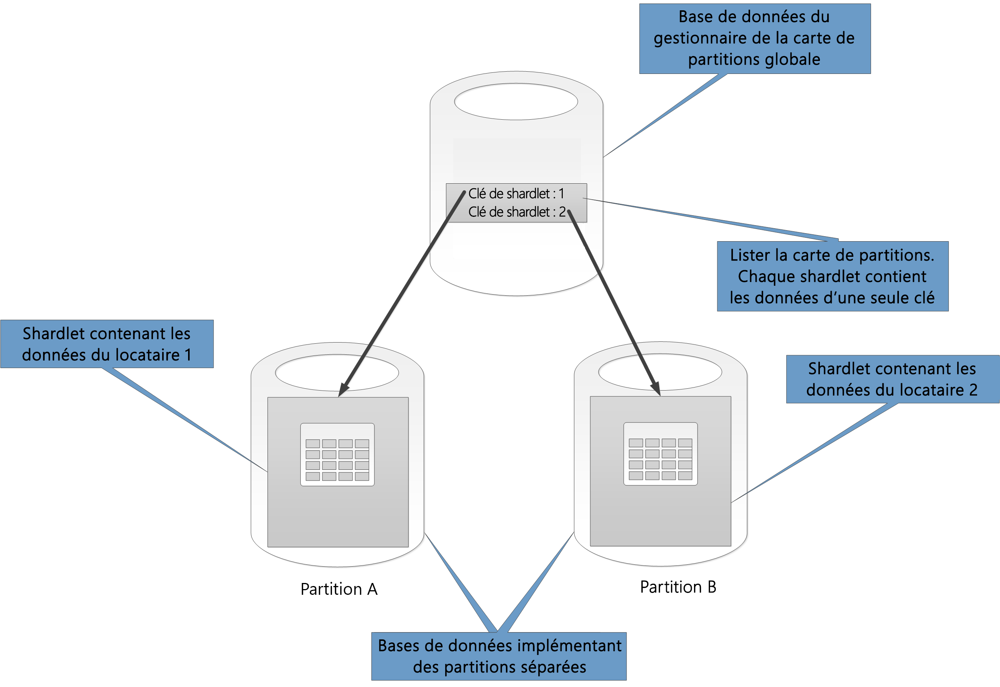
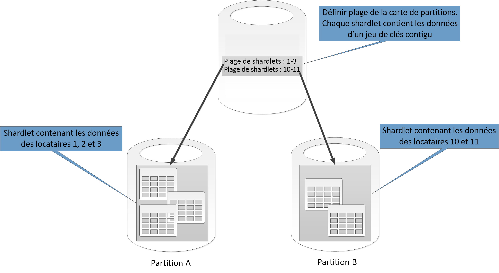
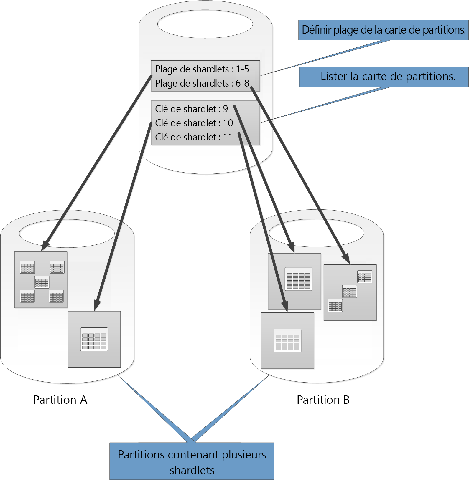
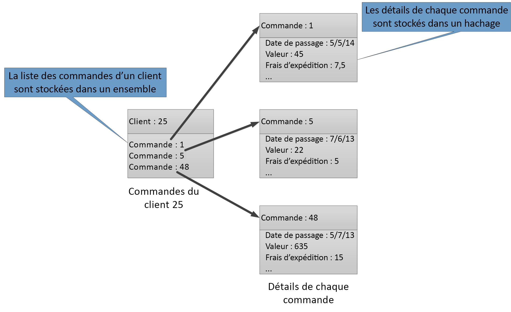

# Stratégies de partitionnement de données

Cet article décrit certaines stratégies utilisées pour le partitionnement des données dans divers magasins de données Azure. Pour obtenir des instructions générales concernant le meilleur moment et les meilleures pratiques pour partitionner les données, consultez [Partitionnement des données](./data-partitioning.md)

## Partitionnement d’Azure SQL Database

Une base de données SQL est limitée quant au volume de données qu’elle peut contenir. Le débit est limité par des facteurs architecturaux et par le nombre de connexions simultanées prises en charge.

Les [pools élastiques](/azure/sql-database/sql-database-elastic-pool) prennent en charge la mise à l’échelle horizontale d’une base de données SQL. En les utilisant, vous pouvez partitionner vos données sur des partitions réparties sur plusieurs bases de données SQL. Vous pouvez également ajouter ou supprimer des partitions à mesure que le volume de données que vous devez gérer augmente ou diminue. Les pools élastiques permettent également de réduire la contention en répartissant la charge parmi les bases de données.

Chaque partition est mise en œuvre sous forme de base de données SQL. Une partition peut contenir plusieurs jeux de données (nommés *shardlets*). Chaque base de données tient à jour des métadonnées qui décrivent les shardlets qu’elle contient. Un shardlet peut correspondre à un seul élément de données ou à un groupe d’éléments partageant la même clé de shardlet. Par exemple, au sein d’une application mutualisée, la clé de shardlet peut correspondre à l’ID client, et toutes les données relatives à un client seront stockées au sein du même shardlet.

Les applications clientes sont chargées de l’association d’un jeu de données avec une clé de shardlet. Une base de données SQL distincte fonctionne comme un gestionnaire global des cartes des partitions. Cette base de données possède une liste de l’ensemble des partitions et shardlets dans le système. L’application se connecte à la base de données du gestionnaire des cartes de partitions afin d’obtenir une copie des cartes de partitions. Il met la carte de partitions en cache en local et utilise le mappage pour acheminer les requêtes de données vers la partition appropriée. Cette fonctionnalité est masquée derrière une série d’API présentes dans la [Bibliothèque de client de base de données élastique](/azure/sql-database/sql-database-elastic-database-client-library), qui est disponible pour Java et .NET.

Pour en savoir plus sur les pools élastiques, consultez la rubrique [Montée en charge avec Azure SQL Database](/azure/sql-database/sql-database-elastic-scale-introduction).

Pour réduire la latence et améliorer la disponibilité, vous pouvez répliquer la base de données du gestionnaire global des cartes des partitions. À l’aide de l’un des niveaux tarifaires Premium, vous pouvez configurer la géoréplication active pour copier des données en continu dans des bases de données présentes dans différentes régions.

Une autre approche consiste à utiliser le [Azure SQL Data Sync](/azure/sql-database/sql-database-sync-data) ou [Azure Data Factory](/azure/data-factory/) pour répliquer la base de données du gestionnaire des cartes des partitions dans les différentes régions. Cette forme de réplication s’exécute périodiquement et est plus appropriée si la carte des partitions change peu fréquemment. Elle n’exige pas le niveau Premium.

La fonction Base de données élastique présente deux schémas de mappage des données vers les shardlets et de stockage dans ces derniers :

- Une **carte de partitions de liste** associe une clé unique à un shardlet. Par exemple, dans un système mutualisé, les données relatives à chaque client peuvent être associées à une clé unique et stockées dans leur propre shardlet. Pour garantir l’isolation, chaque shardlet peut être stocké dans sa propre partition.

    

- Une **carte de partitions de plage** associe un jeu de valeurs de clés contiguës à un shardlet. Par exemple, vous pouvez regrouper les données d’un ensemble de clients (chacun présentant sa propre clé) au sein du même shardlet. Ce schéma est moins onéreux que le premier, étant donné que les clients partagent le stockage de données, mais l’isolation des données est moins bonne.

    

Une même partition peut comporter des données relatives à plusieurs shardlets. Par exemple, vous pouvez utiliser des  shardlets de liste pour stocker des données relatives à différents clients non contigus dans la même partition. Vous pouvez aussi associer des shardlets de plage et des shardlets de liste dans une même partition, bien qu’ils soient interrogés par le biais de différentes cartes. Le diagramme qui suit montre cette approche :

Les pools élastiques permettent d’ajouter et de supprimer des partitions à mesure que le volume de données augmente et diminue. Les applications clientes peuvent créer et supprimer des partitions de façon dynamique et mettre à jour le gestionnaire de cartes de partitions en toute transparence. Toutefois, la suppression d’une partition est une opération destructive qui nécessite également la suppression de toutes les données présentes dans cette partition.

Si une application doit fractionner une partition en deux partitions distinctes ou combiner des partitions, utilisez [l’outil de fractionnement et de fusion](/azure/sql-database/sql-database-elastic-scale-overview-split-and-merge). Cet outil s’exécute comme un service web Azure et effectue une migration des données sécurisée entre les partitions.

Le schéma de partition peut considérablement affecter les performances de votre système. Il peut également affecter la vitesse à laquelle les partitions doivent être ajoutées ou supprimées, celle à laquelle les données doivent être repartitionnées entre les partitions. Observez les points suivants :

- Regroupez les données utilisées conjointement dans une même partition et évitez les opérations qui ont un accès à des données présentes dans plusieurs partitions. Une partition est une base de données SQL à part entière et les jonctions entre plusieurs bases de données doivent être effectuées du côté client.

    Bien que SQL Database ne prenne pas en charge les jointures entre les bases de données, vous pouvez utiliser les outils de bases de données élastiques pour effectuer des [requêtes multi-partitions](/azure/sql-database/sql-database-elastic-scale-multishard-querying). Une requête multi-partitions envoie des requêtes individuelles à chaque base de données et fusionne les résultats.

- Ne créez pas un système présentant des dépendances entre les partitions. Les contraintes d’intégrité référentielle, les déclencheurs et les procédures stockées dans une base de données ne peuvent pas faire référence à des objets présents dans une seconde base de données.

- Si vous avez des données de référence fréquemment utilisées par les requêtes, envisagez de répliquer ces données sur les partitions. Cette approche peut prévenir la nécessité de joindre des données sur des bases de données. Dans l’idéal, ces données doivent être statiques ou lentes afin de réduire les efforts de réplication et de diminuer le risque qu’elles deviennent obsolètes.

- Des shardlets appartenant à la même carte des partitions doivent présenter le même schéma. Cette règle n’est pas indispensable pour SQL Database, mais la gestion et l’interrogation des données deviennent très complexes si chaque shardlet présente un schéma différent. Créez plutôt des cartes de partitions distinctes pour chaque schéma. N’oubliez pas que des données appartenant à différents shardlets peuvent être stockées au sein de la même partition.

- Les opérations transactionnelles sont prises en charge uniquement pour les données stockées dans une partition, et non dans des partitions différentes. Les transactions peuvent être stockées au sein de différents shardlets tant qu’elles font partie de la même partition. Par conséquent, si votre logique professionnelle nécessite la réalisation de transactions, stockez les données au sein de la même partition ou mettez en œuvre la cohérence finale.

- Disposez les partitions à proximité des utilisateurs qui accèdent aux données stockées dans ces partitions. Cette stratégie aide à réduire la latence.

- Évitez de disposer de diverses partitions très actives et de partitions relativement inactives. Essayez de répartir la charge de manière homogène parmi les partitions. Cela peut nécessiter un hachage des clés de sharding. Si vous géolocalisez des partitions, assurez-vous que la carte des clés hachées renvoie vers les shardlets stockés au sein des partitions stockées à proximité des utilisateurs qui accèdent à ces données.

### Partitionner le stockage de tables Azure

Le stockage de tables Azure est un magasin de clés-valeurs conçue pour le partitionnement. Toutes les entités sont stockées au sein d’une partition et les partitions sont gérées en interne par le stockage de tables Azure. Chaque entité stockée dans une table doit présenter une clé en deux parties comprenant :

- **La clé de partition**. Il s’agit d’une valeur de chaîne qui détermine la partition dans laquelle le stockage de tables Azure placera l’entité. Toutes les entités avec la même clé de partition sont stockées au sein de la même partition.

- **La clé de ligne**. Il s’agit d’une valeur de chaîne qui identifie l’entité au sein de la partition. Toutes les entités présentes au sein d’une partition sont triées par ordre croissant lexical selon cette clé. La combinaison de la clé de partition et de la clé de ligne doit être unique pour chaque entité, et sa longueur ne peut pas dépasser 1 Ko.

Si une entité est ajoutée à une table avec une clé de partition précédemment inutilisée, le stockage de tables Azure crée une partition pour cette entité. Les autres entités présentant la même clé de partition sont stockées au sein de la même partition.

Ce mécanisme met efficacement en œuvre une stratégie de montée en puissance automatique. Chaque partition est stockée sur le même serveur dans un centre de données Azure pour s’assurer que les requêtes qui récupèrent des données à partir d’une partition unique s’exécutent rapidement.

Microsoft a publié des [objectifs d’extensibilité] pour Azure Storage. Si votre système est susceptible de dépasser ces limites, envisagez de fractionner les entités en plusieurs tables. Utilisez le partitionnement vertical pour diviser les champs dans les groupes qui sont le plus susceptibles d’être sollicités ensemble.

Le diagramme suivant illustre la structure logique d’un exemple de compte de stockage. Le compte de stockage contient trois tables : Informations relatives aux clients, informations relatives aux produits et informations relatives aux commandes.

Chaque table a plusieurs partitions.

- Dans la table des informations relatives aux clients, les données sont partitionnées en fonction de la ville où se trouve le client. La clé de ligne contient l’ID client.
- Dans la table des informations relatives aux produits, les produits sont partitionnés par catégorie et la clé de ligne contient le numéro du produit.
- Dans la table des informations relatives aux commandes, les commandes sont partitionnées en fonction de la date de commande et la clé de ligne indique l’horaire de réception de la commande. Remarquez que toutes les données sont classées en fonction de la clé de ligne au sein de chaque partition.

Considérez les points suivants quand vous concevez vos entités pour le stockage de tables Azure :

- Sélectionnez une clé de partition et une clé de ligne en fonction de comment accéder aux données. Choisissez une combinaison de clé de partition et de clé de ligne qui prend en charge la plupart de vos requêtes. Les requêtes les plus efficaces récupèrent les données en spécifiant la clé de partition et la clé de ligne. Les requêtes qui spécifient une clé de partition et une plage de clés de ligne peuvent être effectuées en analysant une seule partition. Cette opération est relativement rapide, car les données sont conservées par ordre de clé de ligne. Si les requêtes ne précisent pas quelle partition doit être analysée, il faut toutes les analyser.

- Si une entité présente une clé naturelle, utilisez-la alors en tant que clé de partition et spécifiez une chaîne vide en tant que clé de ligne. Si une entité présente une clé composite de deux propriétés, sélectionnez la propriété variable la plus lente en tant que clé de partition et l’autre en tant que clé de ligne. Si une entité présente plus de deux propriétés de clé, utilisez une concaténation des propriétés pour spécifier les clés de partition et de ligne.

- Si vous effectuez régulièrement des requêtes pour rechercher des données à l’aide de champs autres que les clés de partition et de ligne, implémentez le [modèle de table d’index](../patterns/index-table.md) ou utilisez plutôt un autre magasin de données prenant en charge l’indexation, tel que Cosmos DB.

- Si vous générez des clés de partition à l’aide d’une séquence incrémentielle unitone (par exemple, « 0001 », « 0002 », « 0003 ») et que chaque partition contient uniquement une quantité limitée de données, le stockage de tables Azure peut regrouper physiquement ces partitions sur le même serveur. Le stockage Azure suppose que l’application est plus susceptible d’effectuer des requêtes sur une plage contiguë de partitions (requêtes de plage) et est optimisée pour cet usage. Cependant, cette approche peut conduire à la présence de zones réactives, car toutes les insertions de nouvelles entités seront probablement concentrées sur l’une des extrémités de la plage contiguë. Elle peut également réduire l’évolutivité. Pour répartir la charge de manière plus homogène, il peut être nécessaire de hacher la clé de partition.

- Le stockage de tables Azure prend en charge les opérations transactionnelles pour les entités appartenant à la même partition. Une application peut effectuer plusieurs opérations d’insertion, de mise à jour, de suppression, de remplacement ou de fusion sous forme d’unité atomique tant que la transaction ne comporte pas plus de 100 entités et que la charge utile de la requête ne dépasse pas 4 Mo. Les opérations qui chevauchent plusieurs partitions ne sont pas transactionnelles et peuvent vous obliger à implémenter la cohérence finale. Pour plus d’informations sur le stockage de tables et les transactions, consultez la page [Exécution de transactions de groupe d’entités].

- Prenez en compte la granularité de la clé de partition :

  - Utiliser la même clé de partition pour chaque entité a conduit à la création d’une unique partition sur un seul serveur. Cela empêche la montée en charge de la partition et restreint la charge à un seul serveur. Par conséquent, cette approche convient uniquement pour stocker un nombre restreint d’entités. Cependant, elle garantit que toutes les entités puissent participer aux transactions relatives à des groupes d’entités.

  - Le fait d’utiliser une clé de partition unique pour chaque entité conduit le service de stockage de tables à créer une partition distincte pour chaque entité, ce qui peut mener à la création d’un grand nombre de petites partitions. Cette approche est plus extensible que l’utilisation d’une clé de partition unique, mais les transactions de groupe d’entités ne sont pas possibles. De plus, les requêtes qui extraient plusieurs entités peuvent impliquer la lecture à partir de plusieurs serveurs. Cependant, si l’application effectue des requêtes de plage, l’utilisation d’une séquence unitone pour les clés de partition peut permettre d’optimiser ces requêtes.

  - Le fait de partager la clé de partition au sein d’un sous-ensemble d’entités permet de regrouper les entités associées au sein de la même partition. Les opérations qui impliquent des entités associées peuvent être effectuées à l’aide de transactions relatives à des groupes d’entités et les requêtes intervenant sur un jeu d’entités associées peuvent être traitées en accédant à un seul serveur.

Pour plus d’informations, consultez le [Guide de conception de table de stockage Azure].

## Partitionner le stockage d’objets blob Azure 

Le stockage d’objets blob Azure permet de stocker des objets binaires volumineux. Utilisez des objets blob de blocs lorsque vous devez charger ou télécharger rapidement d’importants volumes de données. Utilisez des objets blob de pages pour les applications nécessitant un accès aléatoire plutôt qu’en série à certaines parties des données.

Chaque objet blob (de blocs ou de pages) est stocké au sein d’un conteneur dans un compte de stockage Azure. Vous pouvez utiliser des conteneurs pour regrouper des blobs associés présentant les mêmes exigences de sécurité. Ce regroupement est logique, et non physique. Dans un conteneur, chaque objet blob a un nom unique.

La clé de partition d’un blob est le nom du compte + le nom du conteneur + le nom du blob. La clé de partition sert à partitionner les données en plages, et la charge de ces plages est équilibrée sur l’ensemble du système. Les blobs peuvent être répartis sur plusieurs serveurs afin d’offrir un accès horizontal. Toutefois, un blob donné ne peut être servi que par un seul serveur.

Si votre schéma d’affectation de noms utilise des timestamp ou des identificateurs numériques, cela peut entraîner un trafic excessif vers une partition, limitant l’efficacité du système à équilibrer la charge. Par exemple, si vos opérations quotidiennes utilisent un objet blob avec un timestamp comme *yyyy-mm-dd*, tout le trafic pour cette opération est alors dirigé vers un serveur de partition unique. Envisagez plutôt d’ajouter un préfixe au nom avec un hachage à 3 chiffres. Pour plus d’informations, consultez [Convention de nommage des partitions](/azure/storage/common/storage-performance-checklist#subheading47)

Les actions d’écriture d’un seul bloc ou d’une seule page sont atomiques, mais pas les opérations intervenant sur des blocs, des pages ou des objets blob. S’il vous faut garantir la cohérence quand vous réalisez des opérations d’écriture entre des blocs, des pages et des objets blob, désactivez un verrou d’écriture à l’aide d’un bail d’objet blob.

## Partitionner les files d’attente de stockage

Les files d’attente de stockage Azure vous permettent de mettre en œuvre une messagerie asynchrone entre les processus. Un compte de stockage Azure peut contenir un nombre illimité de files d’attente, et chaque file d’attente peut contenir un nombre illimité de messages. La seule limite concerne l’espace disponible dans le compte de stockage. La taille maximale d’un message est de 64 Ko. Si vous devez utiliser des messages dont la taille est supérieure, envisagez plutôt d’utiliser des files d’attente Service Bus Azure.

Chaque file d’attente de stockage a un nom unique au sein du compte de stockage qui la contient. Azure partitionne les files d’attente en fonction du nom. Tous les messages de la même file d’attente sont stockés dans la même partition, qui est contrôlée par un serveur unique. Différentes files d’attente peuvent être gérées par différents serveurs afin d’équilibrer la charge. La répartition des files d’attente entre les serveurs est transparente pour les applications et les utilisateurs.

Dans une application à grande échelle, n’utilisez pas la même file d’attente de stockage pour toutes les instances de l’application, car cette approche peut transformer le serveur qui héberge la file d’attente en zone sensible. Utilisez plutôt différentes files d’attente pour les différentes zones fonctionnelles de l’application. Les files d’attente de stockage Azure ne prennent pas en charge les transactions. Ainsi, le fait de diriger les messages vers différentes files d’attente ne présente que des répercussions limitées sur la cohérence de la messagerie.

Une file d’attente de stockage Azure peut gérer jusqu’à 2 000 messages par seconde. Si vous devez traiter les messages à une vitesse supérieure, créez plusieurs files d’attente. Par exemple, dans une application globale, créez des files d’attente de stockage distinctes dans des comptes de stockage distincts pour gérer les instances de l’application en cours d’exécution dans chaque région.

## Partitionnement Azure Service Bus

Azure Service Bus utilise un courtier de messages pour gérer les messages envoyés à une file d’attente ou une rubrique Service Bus. Par défaut, tous les messages envoyés à une file d’attente ou une rubrique sont gérés par le même processus de courtier de messages. Cette architecture peut imposer une limite concernant le débit global de la file d’attente des messages. Toutefois, vous pouvez également partitionner une file d’attente ou une rubrique quand elle est créée. Pour cela, affectez la valeur *true* à la propriété *EnablePartitioning* de la description de file d’attente ou de rubrique.

Une file d’attente ou une rubrique partitionnée est divisée en plusieurs fragments, chacun d’eux étant secondé par une banque de messages et un courtier de messages distincts. Service Bus prend en charge la création et la gestion de ces fragments. Lorsqu’une application publie un message à destination d’une file d’attente ou d’une rubrique partitionnée, Service Bus attribue ce message à un fragment de cette file d’attente ou rubrique. Lorsqu’une application reçoit un message à partir d’une file d’attente ou d’un abonnement, Service Bus vérifie chaque fragment pour identifier le message suivant disponible et le transmet ensuite à l’application pour le traiter.

Cette structure permet de répartir la charge parmi les courtiers de messages et les banques de messages, ce qui améliore l’extensibilité et la disponibilité. Si la banque de messages ou le courtier de messages pour un fragment est temporairement indisponible, Service Bus peut récupérer des messages à partir de l’un des fragments restants disponibles.

Service Bus attribue un message à un fragment comme suit :

- Si le message appartient à une session, tous les messages présentant la même valeur pour la propriété *SessionId* sont envoyés au même fragment.

- Si le message n’appartient pas à une session, mais que l’expéditeur a spécifié une valeur pour la propriété *PartitionKey*, tous les messages ayant la même valeur *PartitionKey* sont envoyés au même fragment.

  > [!NOTE]
  > Si les propriétés *SessionId* et *PartitionKey* sont toutes deux spécifiées, elles doivent être définies sur la même valeur, sinon le message est rejeté.

- Si les propriétés *SessionId* et *PartitionKey* d’un message ne sont pas spécifiées, mais que la détection des doublons est activée, la propriété *MessageId* est utilisée. Tous les messages présentant la même propriété *MessageId* sont dirigés vers le même fragment.

- Si des messages ne présentent aucune propriété *SessionId, PartitionKey* ou *MessageId*, Service Bus les attribue aux fragments de manière séquentielle. Si un fragment n’est pas disponible, Service Bus passe au suivant. Ainsi, une défaillance temporaire de l’infrastructure de messagerie n’entraîne pas de défaillance de l’opération d’envoi des messages.

Considérez les points suivants quand vous décidez ou non de partitionner une rubrique ou une file d’attente de messages Service Bus, et à l’aide de quelle méthode :

- Les rubriques et files d’attente Service Bus sont créées dans l’étendue d’un espace de noms Service Bus. Service Bus permet actuellement de disposer jusqu’à 100 rubriques ou files d’attente par espace de noms.

- Chaque espace de noms Service Bus impose des quotas sur les ressources disponibles, telles que le nombre d’abonnements par rubrique, le nombre d’envois et de réceptions simultanés de demandes par seconde, et le nombre maximal de connexions simultanées pouvant être établies. Ces quotas sont décrits dans [Quotas Service Bus]. Si vous pensez dépasser ces valeurs, créez des espaces de nom supplémentaires disposant de leurs propres rubriques et files d’attente, puis répartissez le travail entre ces espaces de nom. Par exemple, au sein d’une application globale, créez des espaces de noms distincts dans chaque région et configurez les instances applicatives pour utiliser les rubriques et les files d’attente présentes au sein de l’espace de nom le plus proche.

- Les messages envoyés dans le cadre d’une transaction doivent spécifier une clé de partition. Il peut s’agir d’une propriété *SessionId*, *PartitionKey* ou *MessageId*. Tous les messages envoyés dans le cadre de la même transaction doivent spécifier la même clé de partition, car ils doivent être gérés par le même processus Broker de messages. Vous ne pouvez pas envoyer des messages à différentes files d’attente ou rubriques au sein de la même transaction.

- Vous ne pouvez pas configurer les rubriques et les files d’attente partitionnées pour qu’elles soient supprimées automatiquement quand elles deviennent inactives.

- Actuellement, vous ne pouvez pas utiliser des files d’attente et des rubriques partitionnées avec le protocole AMQP (Advanced Message Queueing Protocol) si vous créez des solutions interplateformes ou hybrides.

## Partitionnement Cosmos DB

Azure Cosmos DB est une base de données NoSQL pouvant stocker des documents JSON à l’aide de [l’API SQL Azure Cosmos DB][cosmosdb-sql-api]. Un document de base de données Cosmos DB correspond à une représentation sérialisée JSON d’un objet ou autre élément de données. Aucun schéma fixe n’est appliqué, mais chaque document doit contenir un ID unique.

Les documents sont organisés en collections. Vous pouvez regrouper des documents connexes dans une collection. Par exemple, dans un système gérant des publications de blog, vous pouvez stocker le contenu de chaque publication de blog sous forme de document dans une collection. Vous pouvez également créer des collections pour chaque type d’objet. Sinon, dans une application mutualisée (telle qu’un système dans lequel différents auteurs contrôlent et gèrent leurs propres publications de blog), vous pouvez partitionner les blogs par auteur et créer des collections distinctes pour chaque auteur. L’espace de stockage alloué aux collections est flexible et peut évoluer à la hausse ou à la baisse en fonction des besoins.

Cosmos DB prend en charge le partitionnement automatique des données d’après une clé de partition définie au niveau de l’application. Une *partition logique* est une partition qui stocke toutes les données associées à une valeur de clé de partition unique. Tous les documents qui partagent la même valeur de clé de partition sont placés dans la même partition logique. Cosmos DB distribue les valeurs en fonction du hachage de la clé de partition. Une partition logique présente une taille maximale de 10 Go. Pour cette raison, le choix de la clé de partition est une décision importante que vous devrez prendre au moment de la conception. Choisissez une propriété avec une large gamme de valeurs, voire des modèles d’accès. Pour en savoir plus, voir [Partitionner et mettre à l’échelle dans Azure Cosmos DB](/azure/cosmos-db/partition-data).

> [!NOTE]
> Chaque base de données Cosmos DB présente un *niveau de performances* qui détermine la quantité de ressources obtenue. À chaque niveau de performance est associé un taux limite d’*unités de demande*. Le taux limite d’unités de demande spécifie le volume de ressources réservé et disponible exclusivement pour cette collection. Le coût d’une collection dépend du niveau de performances sélectionné pour cette collection. Plus le niveau de performances (et le taux limite d’unités de demande) est élevé, plus la charge est élevée. Vous pouvez régler le niveau de performance d’une collection à l’aide du portail Azure. Pour en savoir plus, voir [Unités de requête dans Azure Cosmos DB][cosmos-db-ru].

Si le mécanisme de partitionnement Cosmos DB offre n’est pas suffisant, vous devrez peut-être partitionner les données au niveau de l’application. Les collections de documents fournissent un mécanisme naturel permettant de partitionner des données dans une base de données unique. La méthode la plus simple permettant de mettre en œuvre le partitionnement consiste à créer une collection pour chaque partition. Les conteneurs sont des ressources logiques. Ils peuvent s’étendre sur un ou plusieurs serveurs. Les conteneurs de taille fixe ont une limite maximale de 10 Go et de 10 000 RU/s de débit. Un nombre illimité de conteneurs ne présente aucune taille de stockage maximale, mais doit spécifier une clé de partition. Il incombe à l’application cliente d’envoyer les requêtes vers la partition appropriée, généralement en implémentant son propre mécanisme de mappage en fonction de certains attributs des données qui définissent la clé de partitionnement.

Toutes les bases de données sont créées dans le contexte d’un compte de base de données Cosmos DB. Un même compte peut contenir plusieurs bases de données et indique les régions dans lesquelles les bases de données sont créées. Chaque compte applique également son propre contrôle d’accès. Vous pouvez utiliser des comptes Cosmos DB pour géolocaliser les partitions (collections au sein des bases de données) situées à proximité des utilisateurs ayant besoin d’y accéder, et appliquer des restrictions afin que seuls ces utilisateurs puissent s’y connecter.

Lorsque vous décidez de la procédure à suivre pour partitionner des données à l’aide de l’API SQL Cosmos DB, tenez compte des points suivants :

- **Les ressources disponibles pour une base de données Cosmos DB sont soumises aux limites de quota du compte**. Chaque base de données peut contenir un certain nombre de collections, et chaque collection est associée à un niveau de performances qui régit le taux limite d’unités de demande (débit réservé) pour cette collection. Pour plus d’informations, consultez [Abonnement Azure et limites, quotas et contraintes de service][azure-limits].

- **Chaque document doit avoir un attribut pouvant être utilisé pour identifier de manière unique ce document dans la collection dans laquelle il est stocké**. Cet attribut est différent de la clé de partition, qui définit la collection dans laquelle le document est stocké. Une collection peut contenir un grand nombre de documents. En théorie, ce nombre est limité uniquement par la longueur maximale de l’ID de document. L’ID du document peut comprendre jusqu’à 255 caractères.

- **Toutes les opérations sur un document sont exécutées dans le contexte d’une transaction. Les transactions se limitent à la collection dans laquelle se trouve le document.** Si une opération échoue, la tâche réalisée est annulée. Quand un document est sujet à une opération, toutes les modifications apportées sont soumises à un isolement de niveau capture instantanée. Ce mécanisme garantit que si, par exemple, une requête visant à créer un document échoue, un autre utilisateur qui interroge la base de données simultanément ne verra pas un document partiel supprimé par la suite.

- **Les requêtes de base de données se limitent également au niveau de la collection**. Une seule requête peut récupérer les données issues d’une seule collection. Si vous devez récupérer des données issues de plusieurs collections, vous devez interroger chaque collection individuellement et fusionner les résultats dans votre code d’application.

- **Cosmos DB prend en charge les éléments programmables qui peuvent tous être stockés dans une collection avec des documents**. Il s’agit notamment des procédures stockées, des fonctions définies par l’utilisateur et des déclencheurs (écrits en JavaScript). Ces éléments peuvent accéder à n’importe quel document au sein de la même collection. En outre, ces éléments s’exécutent soit dans le cadre de la portée de la transaction actuelle (dans le cas d’un déclencheur intervenant suite à une opération de création, de suppression ou de remplacement effectuée sur un document), soit en démarrant une nouvelle transaction (dans le cas d’une procédure stockée exécutée suite à une demande client explicite). Si le code d’un élément programmable lève une exception, la transaction est annulée. Vous pouvez utiliser des procédures stockées et des déclencheurs pour maintenir l’intégrité et la cohérence entre des documents, mais ces documents doivent tous faire partie de la même collection.

- **Les collections que vous souhaitez conserver dans les bases de données doivent être peu susceptibles de dépasser les limites de débit définies par les niveaux de performances des collections**. Pour en savoir plus, voir [Unités de requête dans Azure Cosmos DB][cosmos-db-ru]. Si vous prévoyez d’atteindre ces limites, envisagez de fractionner les collections des bases de données entre différents comptes afin de réduire la charge par collection.

## Partitionnement Recherche Azure

La capacité à rechercher des données est souvent la méthode principale de navigation et d’exploration fournie par de nombreuses applications web. Elle permet aux utilisateurs de trouver des ressources rapidement (par exemple, des produits dans une application de commerce électronique) en fonction de combinaisons de critères de recherche. Le service de recherche Azure Search propose des fonctionnalités de recherche en texte intégral dans le contenu Web, ainsi que des fonctionnalités telles que les requêtes prédictives, les requêtes suggérées en fonction des correspondances suivantes et la navigation à facettes. Pour plus d’informations, consultez [Qu’est-ce que Recherche Azure ?].

Azure Search stocke le contenu pouvant faire l’objet d’une recherche sous forme de documents JSON dans une base de données. Vous définissez des index qui spécifient les champs de recherche dans ces documents et fournissez ces définitions à Azure Search. Quand un utilisateur soumet une demande de recherche, Azure Search utilise les index appropriés pour trouver les éléments correspondants.

Pour réduire la contention, le stockage utilisé par Azure Search peut être divisé en 1, 2, 3, 4, 6, ou 12 partitions, et chaque partition peut être répliquée jusqu’à 6 fois. Le produit du nombre de partitions multiplié par le nombre de réplicas est appelé *unité de recherche*. Une même instance d’Azure Search peut contenir au maximum 36 unités de recherche (une base de données avec 12 partitions prend en charge 3 réplicas au maximum).

La facturation se fait en fonction de chaque unité de recherche allouée à votre service. À mesure que le volume de contenu pouvant faire l’objet d’une recherche ou que le taux des demandes de recherche augmente, vous pouvez ajouter des unités de recherche à une instance existante d’Azure Search pour gérer la charge supplémentaire. Azure Search distribue uniformément les documents parmi les partitions. Aucune stratégie de partitionnement manuel n’est actuellement prise en charge.

Chaque partition peut contenir un maximum de 15 millions de documents ou occuper 300 Go d’espace de stockage (la valeur la plus petite étant retenue). Vous pouvez créer jusqu’à 50 index. Les performances du service varient et dépendent de la complexité des documents, des index disponibles et de la latence du réseau. En moyenne, un réplica (1 unité de recherche) doit pouvoir gérer 15 requêtes par seconde, même s’il convient de réaliser une mesure à l’aide de vos propres données pour obtenir un résultat plus précis du débit. Pour plus d’informations, consultez [Limites de service d’Azure Search].

> [!NOTE]
> Vous pouvez stocker un jeu de types de données limité dans les documents pouvant faire l’objet d’une recherche, notamment des chaînes, des valeurs booléennes, des données numériques, des données d’horodatage et certaines données géographiques. Pour plus d’informations, consultez la page [Types de données pris en charge (Azure Search)] sur le site web de Microsoft.

Vous disposez d’un contrôle limité sur la manière dont Azure Search partitionne les données pour chaque instance du service. Cependant, dans un environnement global, vous pouvez améliorer les performances et réduire la latence et la contention en partitionnant le service proprement dit en appliquant l’une des stratégies suivantes :

- Créez une instance d’Azure Search dans chaque région géographique et vérifiez que les applications clientes sont dirigées vers l’instance disponible la plus proche. Cette stratégie exige la réplication de chaque mise à jour du contenu pouvant faire l’objet d’une recherche en temps voulu au sein de toutes les instances du service.

- Créez deux niveaux d’Azure Search :

  - Un service local dans chaque région qui contient les données les plus fréquemment sollicitées par les utilisateurs dans cette région. Les utilisateurs peuvent diriger les demandes ici pour obtenir des résultats rapides, mais limités.
  - Un service global qui englobe toutes les données. Les utilisateurs peuvent diriger les demandes ici pour obtenir des résultats plus lents, mais plus complets.

Cette approche est plus appropriée quand les données faisant l’objet d’une recherche présentent des variations régionales significatives.

## Partitionnement Cache Redis Azure

Le cache Redis Azure propose un service de mise en cache partagé dans le cloud basé sur le magasin de données de clés et de valeurs Redis. Comme son nom l’indique, le cache Redis Azure est conçu comme une solution de mise en cache. Utilisez-le uniquement pour contenir des données temporaires, et non comme un magasin de données permanent. Les applications qui utilisent le cache Redis Azure doivent pouvoir continuer à fonctionner si le cache n’est pas disponible. Le cache Redis Azure prend en charge la réplication principale/secondaire pour fournir une haute disponibilité, mais le service limite actuellement la taille maximale du cache à 53 Go. Si vous devez disposer de davantage d’espace, vous devez créer des caches supplémentaires. Pour plus d’informations, consultez [Cache Redis Azure].

Le partitionnement d’un magasin de données Redis implique la répartition des données entre des instances du service Redis. Chaque instance constitue une partition unique. Le cache Redis Azure fait abstraction des services Redis derrière une façade et ne les expose pas directement. La méthode la plus simple pour implémenter le partitionnement consiste à créer plusieurs instances de cache Redis Azure et à répartir les données entre elles.

Vous pouvez associer chaque élément de données à un identificateur (une clé de partition) qui indique dans quel cache l’élément est stocké. La logique de l’application cliente peut ensuite utiliser cet identificateur pour acheminer les demandes vers la partition appropriée. Ce schéma est très simple mais, si le schéma de partitionnement change (par exemple si d’autres instances de cache Redis Azure sont créées), vous devrez peut-être reconfigurer les applications clientes.

Le cache Redis natif (pas le cache Redis Azure) prend en charge le partitionnement côté serveur basé sur le clustering Redis. Avec cette approche, vous pouvez répartir les données de manière égale parmi les serveurs à l’aide d’un mécanisme de hachage. Chaque serveur Redis stocke les métadonnées décrivant la plage de clés de hachage stockées dans la partition et contient également les informations relatives aux clés de hachage présentes au sein de partitions présentes sur d’autres serveurs.

Les applications clientes envoient simplement les demandes à l’un des serveurs Redis participants (probablement le plus proche). Le serveur Redis examine la demande du client. Si elle peut être résolue localement, il effectue l’opération demandée. Dans le cas contraire, il transfère la demande au serveur approprié.

Ce modèle est mis en œuvre à l’aide du clustering Redis et est décrit plus en détail sur la page [Redis cluster tutorial] sur le site web de Redis. Le clustering Redis est transparent pour les applications clientes. Vous pouvez ajouter des serveurs Redis supplémentaires au cluster (et repartitionner les données) sans avoir à reconfigurer les clients.

> [!IMPORTANT]
> Le Cache Redis Azure prend actuellement en charge le clustering Redis seulement dans le niveau [Premium](/azure/azure-cache-for-redis/cache-how-to-premium-clustering).

La page [Partitioning: how to split data among multiple Redis instances] sur le site web de Redis fournit des informations supplémentaires sur l’implémentation du partitionnement avec Redis. Le reste de cette section part du principe que vous mettez en œuvre le partitionnement côté client ou assisté par proxy.

Considérez les points suivants quand vous décidez de partitionner des données avec le cache Redis Azure :

- Le cache Redis Azure n’est pas destiné à fonctionner en tant que magasin de données permanent. Ainsi, quel que soit le schéma de partitionnement que vous implémentez, votre code d’application doit pouvoir récupérer les données à partir d’un emplacement autre que le cache.

- Les données fréquemment sollicitées doivent être conservées dans la même partition. Redis est un magasin de clés/valeurs puissant qui offre plusieurs mécanismes hautement optimisés pour structurer les données. Il peut s’agir des mécanismes suivants :
  - Chaînes simples (données binaires d’une longueur allant jusqu’à 512 Mo)
  - Types d’agrégation comme des listes (qui peuvent servir de files d’attente et de piles)
  - Ensembles (triés et non triés)
  - Hachages (qui peuvent regrouper des champs associés, tels que des éléments qui représentent les champs d’un objet)

- Les types d’agrégation permettent d’associer de nombreuses valeurs connexes avec la même clé. Une clé Redis identifie une liste, un ensemble ou un hachage plutôt que les éléments de données qu’elle contient. Ces types sont tous disponibles avec le cache Redis Azure et sont décrits dans la page [Data types] sur le site web de Redis. Par exemple, dans le cadre d’un système de commerce électronique qui assure le suivi des commandes passées par les clients, les détails de chaque client peuvent être stockés dans un hachage Redis indexé à l’aide de l’ID du client. Chaque hachage peut contenir une collection d’ID de commande relatifs au client. Un jeu Redis distinct peut contenir les commandes, à nouveau structurées sous forme de hachages, indexées à l’aide de l’ID de la commande. La figure 8 illustre cette structure. Remarquez que Redis ne met pas en œuvre toutes les formes d’intégrité référentielle ; il incombe au développeur de maintenir les relations entre les clients et commandes.

*Figure 8 : Structure suggérée au sein du stockage Redis pour enregistrer les commandes des clients et les détails associés.*

> [!NOTE]
> Dans Redis, toutes les clés sont des valeurs de données binaires (telles que des chaînes Redis) pouvant contenir jusqu’à 512 Mo de données. En théorie, une clé peut contenir pratiquement n’importe quelle information. Cependant, nous vous recommandons d’adopter une convention d’affectation de noms cohérente concernant les clés et permettant de décrire le type de données et d’identifier l’entité, sans pour autant que le nom soit trop long. Une approche courante consiste à utiliser des clés au format « type_entité:ID ». Par exemple, vous pouvez utiliser « client:99 » pour indiquer la clé pour un client avec l’ID 99.

- Vous pouvez mettre en œuvre le partitionnement vertical en stockant les informations connexes dans des agrégations différentes au sein de la même base de données. Par exemple, dans une application de commerce électronique, vous pouvez stocker les informations relatives aux produits fréquemment sollicitées dans une table de hachage Redis et les informations les moins fréquemment sollicitées dans une autre. Les deux hachages peuvent utiliser le même ID de produit dans le cadre de la clé. Par exemple, vous pouvez utiliser « product: *nn* » (où *nn* correspond à l’ID du produit) pour les informations sur le produit et « product_details:*nn* » pour les informations détaillées. Cette stratégie favorise la réduction du volume de données que la plupart des requêtes sont susceptibles de récupérer.

- Vous pouvez repartitionner un magasin de données Redis, mais sachez qu’il s’agit d’une tâche longue et complexe. Le clustering Redis peut repartitionner automatiquement les données, mais cette capacité n’est pas disponible avec le cache Redis Azure. Ainsi, quand vous concevez votre schéma de partitionnement, essayez de laisser suffisamment d’espace libre dans chaque partition pour permettre l’augmentation attendue du volume de données au fil du temps. Cependant, n’oubliez pas que le cache Redis Azure est conçu pour mettre temporairement des données en cache et que les données stockées dans le cache peuvent présenter une durée de vie limitée, spécifiée en tant que valeur de durée de vie. Concernant les données relativement volatiles, la durée de vie peut être courte. En revanche, concernant les données statiques, la durée de vie peut être beaucoup plus longue. Évitez de stocker de grandes quantités de données durables dans le cache si le volume de ces données est susceptible de remplir le cache. Vous pouvez spécifier une stratégie d’éviction permettant au cache Redis Azure de supprimer les données si l’espace est limité.

  > [!NOTE]
  > Le cache Redis Azure vous permet de spécifier la taille maximale du cache (de 250 Mo à 53 Go) en sélectionnant le niveau tarifaire approprié. Cependant, après avoir créé un cache Redis Azure, vous ne pouvez plus en augmenter ni en réduire la taille.

- Les lots et transactions Redis ne peuvent pas couvrir plusieurs connexions. Ainsi, toutes les données affectées par un lot ou une transaction doivent être stockées dans la même base de données (partition).

  > [!NOTE]
  > Une séquence d’opérations relative à une transaction Redis n’est pas nécessairement atomique. Les commandes qui composent une transaction sont vérifiées et mises en file d’attente avant d’être exécutées. Si une erreur se produit pendant cette phase, la file d’attente entière est ignorée. Cependant, une fois la transaction envoyée avec succès, les commandes placées en file d’attente sont exécutées en séquence. Si une commande échoue, seule cette commande cesse de s’exécuter. Toutes les commandes précédentes et suivantes dans la file d’attente sont exécutées. Pour plus d’informations, consultez la page [Transactions] sur le site web de Redis.

- Redis prend en charge un nombre limité d’opérations atomiques. Les seules opérations de ce type qui prennent en charge plusieurs clés et valeurs sont les opérations MGET et MSET. Les opérations MGET retournent une collection de valeurs pour une liste de clés spécifiée, et les opérations MSET stockent une collection de valeurs pour une liste de clés spécifiée. Si vous devez utiliser ces opérations, les paires clés/valeurs référencées par les commandes MSET et MGET doivent être stockées dans la même base de données.

## Partitionnement Azure Service Fabric

Azure Service Fabric est une plateforme de microservices qui fournit un runtime pour les applications distribuées dans le cloud. Service Fabric prend en charge les exécutables invités .Net, les services avec état et sans état, ainsi que les conteneurs. Les services avec état fournissent une [collection fiable][service-fabric-reliable-collections] pour stocker les données de manière permanente dans une collection clé-valeur au sein du cluster Service Fabric. Pour plus d’informations sur les stratégies relatives aux clés de partitionnement dans une collection fiable, consultez l’article [Instructions et recommandations pour les collections fiables dans Azure Service Fabric].

### Plus d’informations

- L’article [Vue d’ensemble d’Azure Service Fabric] constitue une présentation d’Azure Service Fabric.

- L’article [Partitionnement des services fiables Service Fabric] fournit des informations supplémentaires sur les services fiables dans Azure Service Fabric.

## Partitionnement Azure Event Hubs

[Azure Event Hubs][event-hubs] est conçu pour la diffusion de données en continu à grande échelle, et le partitionnement est intégré au service pour permettre une mise à l’échelle horizontale. Chaque consommateur lit uniquement une partition spécifique du flux de messages.

L’éditeur d’événements est uniquement informé de sa clé de partition, et non de la partition sur laquelle les événements sont publiés. Grâce à cette dissociation de la clé et de la partition, l’expéditeur n’a pas besoin de connaître trop d’informations sur le traitement en aval. (Il est également possible d’envoyer des événements directement à une partition spécifique, mais cette opération est généralement déconseillée.)  

Lorsque vous sélectionnez le nombre de partitions, tenez compte de la mise à l’échelle sur le long terme. Après la création d’un Event Hub, vous ne pourrez plus modifier le nombre de partitions.

Pour plus d’informations sur l’utilisation de partitions dans Event Hubs, consultez l’article [Qu’est-ce qu’Event Hubs ?].

Pour découvrir des considérations relatives aux compromis entre la disponibilité et la cohérence, consultez l’article [Disponibilité et cohérence dans Event Hubs].

[Disponibilité et cohérence dans Event Hubs]: /azure/event-hubs/event-hubs-availability-and-consistency
[azure-limits]: /azure/azure-subscription-service-limits
[Azure Content Delivery Network]: /azure/cdn/cdn-overview
[Cache Redis Azure]: https://azure.microsoft.com/services/cache/
[Azure Storage Scalability and Performance Targets]: /azure/storage/storage-scalability-targets
[Guide de conception de table de stockage Azure]: /azure/storage/storage-table-design-guide
[Building a Polyglot Solution]: https://msdn.microsoft.com/library/dn313279.aspx
[cosmos-db-ru]: /azure/cosmos-db/request-units
[Data Access for Highly-Scalable Solutions: Using SQL, NoSQL, and Polyglot Persistence]: https://msdn.microsoft.com/library/dn271399.aspx
[Data consistency primer]: https://aka.ms/Data-Consistency-Primer
[Data Partitioning Guidance]: https://msdn.microsoft.com/library/dn589795.aspx
[Data types]: https://redis.io/topics/data-types
[cosmosdb-sql-api]: /azure/cosmos-db/sql-api-introduction
[Elastic Database features overview]: /azure/sql-database/sql-database-elastic-scale-introduction
[event-hubs]: /azure/event-hubs
[Federations Migration Utility]: https://code.msdn.microsoft.com/vstudio/Federations-Migration-ce61e9c1
[Instructions et recommandations pour les collections fiables dans Azure Service Fabric]: /azure/service-fabric/service-fabric-reliable-services-reliable-collections-guidelines
[Multi-shard querying]: /azure/sql-database/sql-database-elastic-scale-multishard-querying
[Vue d’ensemble d’Azure Service Fabric]: /azure/service-fabric/service-fabric-overview
[Partitionnement des services fiables Service Fabric]: /azure/service-fabric/service-fabric-concepts-partitioning
[Partitioning: how to split data among multiple Redis instances]: https://redis.io/topics/partitioning
[Exécution de transactions de groupe d’entités]: /rest/api/storageservices/Performing-Entity-Group-Transactions
[Redis cluster tutorial]: https://redis.io/topics/cluster-tutorial
[Running Redis on a CentOS Linux VM in Azure]: https://blogs.msdn.microsoft.com/tconte/2012/06/08/running-redis-on-a-centos-linux-vm-in-windows-azure/
[Scaling using the Elastic Database split-merge tool]: /azure/sql-database/sql-database-elastic-scale-overview-split-and-merge
[Using Azure Content Delivery Network]: /azure/cdn/cdn-create-new-endpoint
[Quotas Service Bus]: /azure/service-bus-messaging/service-bus-quotas
[service-fabric-reliable-collections]: /azure/service-fabric/service-fabric-reliable-services-reliable-collections
[Limites de service d’Azure Search]:  /azure/search/search-limits-quotas-capacity
[Sharding pattern]: ../patterns/sharding.md
[Types de données pris en charge (Azure Search)]:  https://msdn.microsoft.com/library/azure/dn798938.aspx
[Transactions]: https://redis.io/topics/transactions
[Qu’est-ce qu’Event Hubs ?]: /azure/event-hubs/event-hubs-what-is-event-hubs
[Qu’est-ce que Recherche Azure ?]: /azure/search/search-what-is-azure-search
[What is Azure SQL Database?]: /azure/sql-database/sql-database-technical-overview
[objectifs d’extensibilité]: /azure/storage/common/storage-scalability-targets
