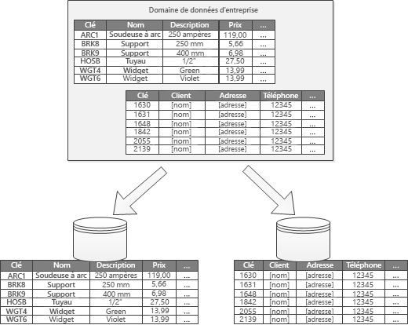

# Partitionnement des donnéesData partitioning

Au sein de nombreuses solutions à grande échelle, les données sont divisées en partitions distinctes qui peuvent être gérées et accessibles séparément.In many large-scale solutions, data is divided into separate partitions that can be managed and accessed separately. La stratégie de partitionnement doit être choisie avec soin afin d’optimiser les avantages tout en réduisant les effets négatifs.The partitioning strategy must be chosen carefully to maximize the benefits while minimizing adverse effects. Le partitionnement peut aider à améliorer l’extensibilité, à réduire la contention et à optimiser les performances.Partitioning can help improve scalability, reduce contention, and optimize performance. Autre avantage du partitionnement, il peut fournir un mécanisme permettant de diviser les données selon le modèle d’utilisation.Another benefit of partitioning is that it can provide a mechanism for dividing data by the pattern of use. Par exemple, vous pouvez archiver les données (froides) anciennes et moins actives dans le stockage de données le plus économique.For example, you can archive older, less active (cold) data in cheaper data storage.

## Pourquoi partitionner les données ?Why partition data?
La plupart des services et applications cloud stockent et récupèrent des données dans le cadre de leurs opérations.Most cloud applications and services store and retrieve data as part of their operations. La conception des magasins de données utilisés par une application peut avoir une incidence considérable sur les performances, le débit et l’évolutivité d’un système.The design of the data stores that an application uses can have a significant bearing on the performance, throughput, and scalability of a system. Une technique couramment appliquée dans les systèmes à grande échelle consiste à diviser les données en partitions distinctes.One technique that is commonly applied in large-scale systems is to divide the data into separate partitions.

> Dans cet article, le terme *partitionnement* désigne le processus de division physique des données sous forme de magasins de données distincts.In this article, the term *partitioning* means the process of physically dividing data into separate data stores. Il convient de le distinguer du partitionnement de tables SQL Server, qui est un concept différent.It is not the same as SQL Server table partitioning.

Le partitionnement des données présente un certain nombre d’avantages.Partitioning data can offer a number of benefits. Par exemple, il peut être utilisé pour :For example, it can be applied in order to:

* **Améliorer l’évolutivité**.**Improve scalability**. Quand vous procédez à la montée en puissance d’un système de base de données unique, celui-ci finit par atteindre une limite liée au matériel physique.When you scale up a single database system, it will eventually reach a physical hardware limit. Si vous divisez les données en plusieurs partitions, chacune étant hébergée sur un serveur distinct, vous pouvez faire évoluer le système presque indéfiniment.If you divide data across multiple partitions, each of which is hosted on a separate server, you can scale out the system almost indefinitely.
* **Améliorer les performances**.**Improve performance**. Les opérations d’accès aux données présentes au sein de chaque partition interviennent sur un plus petit volume de données.Data access operations on each partition take place over a smaller volume of data. Sous réserve que les données sont partitionnées convenablement, le partitionnement peut améliorer l’efficacité de votre système.Provided that the data is partitioned in a suitable way, partitioning can make your system more efficient. Les opérations qui affectent plusieurs partitions peuvent s’exécuter en parallèle.Operations that affect more than one partition can run in parallel. Chaque partition peut être située près de l’application qui l’utilise afin de réduire la latence du réseau.Each partition can be located near the application that uses it to minimize network latency.
* **Améliorer la disponibilité**.**Improve availability**. Diviser les données au sein de plusieurs serveurs permet d’éviter un point de défaillance unique.Separating data across multiple servers avoids a single point of failure. Si un serveur tombe en panne ou est en cours de maintenance planifiée, seules les données présentes au sein de cette partition sont indisponibles.If a server fails, or is undergoing planned maintenance, only the data in that partition is unavailable. Les opérations intervenant sur les autres partitions peuvent se poursuivre.Operations on other partitions can continue. L’augmentation du nombre de partitions réduit l’impact relatif d’une défaillance sur un serveur unique en réduisant le pourcentage de données qui ne seront pas disponibles.Increasing the number of partitions reduces the relative impact of a single server failure by reducing the percentage of data that will be unavailable. La réplication de chaque partition permet de réduire le risque d’une défaillance de partition unique qui affecterait les opérations.Replicating each partition can further reduce the chance of a single partition failure affecting operations. Cela permet aussi de séparer les données critiques qui doivent être hautement disponibles en permanence des données peu importantes, dont les exigences de disponibilité sont moindres (fichiers journaux, par exemple).It also makes it possible to separate critical data that must be continually and highly available from low-value data that has lower availability requirements (log files, for example).
* **Améliorer la sécurité**.**Improve security**. Selon la nature des données et la manière dont elles sont partitionnées,les données sensibles et non sensibles peuvent être séparées dans différentes partitions et donc dans différents serveurs ou magasins de données.Depending on the nature of the data and how it is partitioned, it might be possible to separate sensitive and non-sensitive data into different partitions, and therefore into different servers or data stores. Il est ensuite possible d’optimiser le sécurité de manière spécifique concernant les données sensibles.Security can then be specifically optimized for the sensitive data.
* **Procurer une flexibilité opérationnelle**.**Provide operational flexibility**. Le partitionnement offre de nombreuses possibilités de réglage des opérations, d’optimisation de l’efficacité de l’administration et de réduction des coûts.Partitioning offers many opportunities for fine tuning operations, maximizing administrative efficiency, and minimizing cost. Par exemple, vous pouvez définir différentes stratégies de gestion, surveillance, sauvegarde et restauration et autres tâches d’administration en fonction de l’importance des données présentes dans chaque partition.For example, you can define different strategies for management, monitoring, backup and restore, and other administrative tasks based on the importance of the data in each partition.
* **Faire correspondre le magasin de données au modèle d’utilisation**.**Match the data store to the pattern of use**. Le partitionnement permet le déploiement de chaque partition sur un type de magasin de données différent, en fonction du coût et des fonctionnalités intégrées proposées par le magasin de données.Partitioning allows each partition to be deployed on a different type of data store, based on cost and the built-in features that data store offers. Par exemple, il est possible de stocker les données binaires volumineuses dans un magasin de données blob et de stocker les données plus structurées dans une base de données de documents.For example, large binary data can be stored in a blob data store, while more structured data can be held in a document database. Pour plus d’informations, consultez [Création d’une solution polyglotte] dans le guide des modèles et pratiques, et [Accès aux données pour des solutions hautement extensibles : utilisation de la persistance SQL, NoSQL et polyglotte] sur le site web Microsoft.For more information, see [Building a polyglot solution] in the patterns & practices guide and [Data access for highly-scalable solutions: Using SQL, NoSQL, and polyglot persistence] on the Microsoft website.

Certains systèmes n’implémentent pas le partitionnement, car cette technique est considérée comme un coût plutôt qu’un avantage.Some systems do not implement partitioning because it is considered a cost rather than an advantage. Les arguments courants motivant ce point de vue sont les suivants :Common reasons for this rationale include:

* De nombreux systèmes de stockage de données ne prennent pas en charge les jointures entre les partitions, et il peut s’avérer difficile de maintenir l’intégrité référentielle au sein d’un système partitionné.Many data storage systems do not support joins across partitions, and it can be difficult to maintain referential integrity in a partitioned system. Il est souvent nécessaire de mettre en œuvre des jointures et vérifications de l’intégrité dans le code applicatif (au niveau de la couche de partitionnement), ce qui peut conduire à une augmentation des E/S et une complexité applicative supplémentaire.It is frequently necessary to implement joins and integrity checks in application code (in the partitioning layer), which can result in additional I/O and application complexity.
* La maintenance des partitions ne se révèle pas toujours aisée.Maintaining partitions is not always a trivial task. Dans un système où les données sont volatiles, vous serez peut-être amené à rééquiliber régulièrement les partitions pour réduire la contention et les zones sensibles.In a system where the data is volatile, you might need to rebalance partitions periodically to reduce contention and hot spots.
* Certains outils courants ne fonctionnent pas naturellement avec des données partitionnées.Some common tools do not work naturally with partitioned data.

## Concevoir des partitionsDesigning partitions
Il est possible de partitionner les données de différentes manières : horizontale, verticale ou fonctionnelle.Data can be partitioned in different ways: horizontally, vertically, or functionally. La stratégie que vous choisissez dépend des motifs du partitionnement des données et des besoins des applications et services qui utilisent ces données.The strategy you choose depends on the reason for partitioning the data, and the requirements of the applications and services that will use the data.

> [!NOTE]
> Les schémas de partitionnement décrits dans ces recommandations sont expliqués indépendamment de la technologie de stockage de données sous-jacente.The partitioning schemes described in this guidance are explained in a way that is independent of the underlying data storage technology. Ces schémas peuvent être appliqués à de nombreux types de magasins de données, notamment les bases de données relationnelles et NoSQL.They can be applied to many types of data stores, including relational and NoSQL databases.
>
>

### Stratégies de partitionnementPartitioning strategies
Les trois stratégies de partitionnement des données habituelles sont les suivantes :The three typical strategies for partitioning data are:

* **Partitionnement horizontal** (souvent appelé *sharding*).**Horizontal partitioning** (often called *sharding*). Dans cette stratégie, chaque partition est un magasin de données à part entière, mais toutes les partitions ont le même schéma.In this strategy, each partition is a data store in its own right, but all partitions have the same schema. Chaque partition est appelée *shard* et comporte une partie spécifique des données, par exemple, toutes les commandes d’un groupe spécifique de clients dans une application de commerce électronique.Each partition is known as a *shard* and holds a specific subset of the data, such as all the orders for a specific set of customers in an e-commerce application.
* **Partitionnement vertical**.**Vertical partitioning**. Dans cette stratégie, chaque partition comporte une partie des champs des éléments présents dans le magasin de données.In this strategy, each partition holds a subset of the fields for items in the data store. Les champs sont divisés selon leur modèle d’utilisation.The fields are divided according to their pattern of use. Par exemple, les champs fréquemment utilisés peuvent être placés dans une partition verticale et les champs moins fréquemment utilisés dans une autre.For example, frequently accessed fields might be placed in one vertical partition and less frequently accessed fields in another.
* **Partitionnement fonctionnel**.**Functional partitioning**. Dans cette stratégie, les données sont agrégées en fonction de leur utilisation par chaque contexte limité au sein du système.In this strategy, data is aggregated according to how it is used by each bounded context in the system. Par exemple, un système de commerce électronique qui implémente des fonctions d’entreprise distinctes pour la facturation et la gestion de l’inventaire des produits peut stocker les données de facturation dans une partition et les données d’inventaire des produits dans une autre.For example, an e-commerce system that implements separate business functions for invoicing and managing product inventory might store invoice data in one partition and product inventory data in another.

Il est important de noter qu’il est possible d’associer les trois stratégies décrites.It’s important to note that the three strategies described here can be combined. Elles ne s’excluent pas mutuellement et nous vous recommandons de les considérer dans leur ensemble au moment de concevoir un schéma de partitionnement.They are not mutually exclusive, and we recommend that you consider them all when you design a partitioning scheme. Vous pouvez, par exemple, diviser les données en partitions, puis utiliser le partitionnement vertical pour ensuite sous-diviser les données au sein de chaque partition.For example, you might divide data into shards and then use vertical partitioning to further subdivide the data in each shard. De même, les données contenues dans une partition fonctionnelle peuvent être divisées en partitions (qui peuvent aussi faire l’objet d’un partitionnement vertical).Similarly, the data in a functional partition can be split into shards (which can also be vertically partitioned).

Cependant, les différentes exigences de chaque stratégie peuvent présenter un certain nombre d’enjeux conflictuels.However, the differing requirements of each strategy can raise a number of conflicting issues. Vous devez évaluer et mettre en balance tous ces paramètres pour concevoir un schéma de partitionnement qui respecte les objectifs généraux de performance de traitement des données de votre système.You must evaluate and balance all of these when designing a partitioning scheme that meets the overall data processing performance targets for your system. Les sections qui suivent décrivent chacune des stratégies plus en détail.The following sections explore each of the strategies in more detail.

### Partitionnement horizontal (sharding)Horizontal partitioning (sharding)
La figure 1 présente une vue d’ensemble du partitionnement horizontal ou sharding.Figure 1 shows an overview of horizontal partitioning or sharding. Dans cet exemple, les données relatives à l’inventaire des produits sont divisées en partitions en fonction de la clé du produit.In this example, product inventory data is divided into shards based on the product key. Chaque partition comporte les données relatives à une plage contiguë de clés de partition (A à G et H à Z), classées par ordre alphabétique.Each shard holds the data for a contiguous range of shard keys (A-G and H-Z), organized alphabetically.

*Figure 1 : Partitionnement horizontal des données (sharding) en fonction d’une clé de partition**Figure 1. Horizontally partitioning (sharding) data based on a partition key*

Le partitionnement vous permet de répartir la charge sur davantage d’ordinateurs, ce qui réduit la contention et améliore les performances.Sharding helps you spread the load over more computers, which reduces contention and improves performance. Vous pouvez faire évoluer le système en ajoutant des partitions qui s’exécutent sur des serveurs supplémentaires.You can scale the system out by adding further shards that run on additional servers.

Le facteur le plus important lors de la mise en œuvre de cette stratégie de partitionnement correspond au choix de la clé de partitionnement.The most important factor when implementing this partitioning strategy is the choice of sharding key. Il peut s’avérer difficile de modifier la clé une fois le système est en fonctionnement.It can be difficult to change the key after the system is in operation. La clé doit garantir un partitionnement des données permettant de disposer d’une charge de travail aussi homogène que possible au sein des partitions.The key must ensure that data is partitioned so that the workload is as even as possible across the shards.

Notez que les différentes partitions ne doivent pas nécessairement contenir des volumes de données similaires.Note that different shards do not have to contain similar volumes of data. En fait, le plus important est d’équilibrer le nombre de demandes.Rather, the more important consideration is to balance the number of requests. Si certaines partitions peuvent être très volumineuses, le nombre d’accès dont fait l’objet chaque élément est très faible.Some shards might be very large, but each item is the subject of a low number of access operations. En revanche, dans d’autres partitions plus petites, chaque élément fait l’objet d’accès beaucoup plus fréquents.Other shards might be smaller, but each item is accessed much more frequently. Il est aussi important de s’assurer qu’une partition ne dépasse pas les limites d’échelle (en termes de capacité et de ressources de traitement) du magasin de données servant à héberger cette partition.It is also important to ensure that a single shard does not exceed the scale limits (in terms of capacity and processing resources) of the data store that's being used to host that shard.

Si vous utilisez un schéma de partitionnement, évitez de créer des zones sensibles (ou partitions actives) qui pourraient avoir des répercussions sur les performances et la disponibilité.If you use a sharding scheme, avoid creating hotspots (or hot partitions) that can affect performance and availability. Par exemple, si vous hachez l’identificateur d’un client plutôt que la première lettre de son nom, vous empêchez la répartition non équilibrée qui résulte de l’utilisation d’initiales plus ou moins courantes.For example, if you use a hash of a customer identifier instead of the first letter of a customer’s name, you prevent the unbalanced distribution that results from common and less common initial letters. Il s’agit d’une technique classique qui permet de répartir les données de façon plus homogène entre les partitions.This is a typical technique that helps distribute data more evenly across partitions.

Choisissez une clé de partitionnement qui limite toute exigence future de fractionnement des partitions volumineuses en plus petits éléments, de regroupement de petites partitions en partitions plus volumineuses ou de modification du schéma qui décrit les données stockées dans un jeu de partitions.Choose a sharding key that minimizes any future requirements to split large shards into smaller pieces, coalesce small shards into larger partitions, or change the schema that describes the data stored in a set of partitions. Ces opérations peuvent prendre beaucoup de temps et nécessiter la mise hors connexion d’une ou plusieurs partitions pendant leur exécution.These operations can be very time consuming, and might require taking one or more shards offline while they are performed.

En cas de réplication de partitions, certains réplicas peuvent parfois être maintenus en ligne pendant que d’autres sont fractionnés, fusionnés ou reconfigurés.If shards are replicated, it might be possible to keep some of the replicas online while others are split, merged, or reconfigured. Cependant, le système peut être contraint de limiter les opérations qui peuvent être exécutées sur les données de ces partitions pendant que la reconfiguration se produit.However, the system might need to limit the operations that can be performed on the data in these shards while the reconfiguration is taking place. Par exemple, les données des réplicas peuvent être marquées en lecture seule pour limiter la portée des incohérences qui pourraient survenir pendant la restructuration des partitions.For example, the data in the replicas can be marked as read-only to limit the scope of inconsistences that might occur while shards are being restructured.

> Pour obtenir des informations et des conseils plus détaillés sur la plupart de ces considérations, ainsi que des techniques de bonnes pratiques pour concevoir des magasins de données qui implémentent le partitionnement horizontal, consultez [Modèle de partitionnement].For more detailed information and guidance about many of these considerations, and good practice techniques for designing data stores that implement horizontal partitioning, see [Sharding pattern].
>
>

### Partitionnement verticalVertical partitioning
L’utilisation la plus courante du partitionnement vertical vise à réduire les E/S et les coûts de performance associés à la recherche des éléments les plus fréquemment utilisés.The most common use for vertical partitioning is to reduce the I/O and performance costs associated with fetching the items that are accessed most frequently. La figure 2 montre un exemple de partitionnement vertical.Figure 2 shows an example of vertical partitioning. Dans cet exemple, les différentes propriétés de chaque élément de données se trouvent dans des partitions différentes.In this example, different properties for each data item are held in different partitions. L’un d’elles contient des données qui font l’objet d’accès plus fréquents, comme le nom, la description et les informations tarifaires des produits.One partition holds data that is accessed more frequently, including the name, description, and price information for products. Une autre contient le volume en stock et la date de la dernière commande.Another holds the volume in stock and the last ordered date.

*Figure 2 : Partitionnement vertical des données en fonction du modèle d’utilisation**Figure 2. Vertically partitioning data by its pattern of use*

Dans cet exemple, l’application émet des requêtes à intervalles réguliers concernant le nom, la description et le prix du produit quand il s’agit d’afficher les détails du produit aux clients.In this example, the application regularly queries the product name, description, and price when displaying the product details to customers. Le niveau des stocks et la date de dernière commande du produit auprès du fabricant sont stockés au sein d’une partition distincte, ces deux éléments étant généralement utilisés conjointement.The stock level and date when the product was last ordered from the manufacturer are held in a separate partition because these two items are commonly used together.

Ce schéma de partitionnement présente l’avantage de séparer les données relativement lentes (nom, description et prix du produit) des données plus dynamiques (niveau de stock et dernière date de commande).This partitioning scheme has the added advantage that the relatively slow-moving data (product name, description, and price) is separated from the more dynamic data (stock level and last ordered date). Une application peut tirer parti de la mise en mémoire cache des données lentes si elles font l’objet d’accès fréquents.An application might find it beneficial to cache the slow-moving data in memory if it is frequently accessed.

Un autre scénario habituel concernant cette stratégie de partitionnement consiste à optimiser la sécurité des données sensibles.Another typical scenario for this partitioning strategy is to maximize the security of sensitive data. Pour ce faire, vous pouvez par exemple stocker les numéros de carte de crédit et les numéros de vérification correspondants dans des partitions distinctes.For example, you can do this by storing credit card numbers and the corresponding card security verification numbers in separate partitions.

Le partitionnement vertical peut aussi limiter le nombre d’accès simultanés aux données nécessaires.Vertical partitioning can also reduce the amount of concurrent access that's needed to the data.

> Le partitionnement vertical fonctionne au niveau de l’entité au sein d’un magasin de données, en normalisant partiellement une entité pour organiser un *large* élément en un jeu d’éléments *restreints*.Vertical partitioning operates at the entity level within a data store, partially normalizing an entity to break it down from a *wide* item to a set of *narrow* items. Il est parfaitement adapté aux magasins de données organisés en colonnes, tels que HBase et Cassandra.It is ideally suited for column-oriented data stores such as HBase and Cassandra. Si les données présentes au sein d’une collection de colonnes sont peu susceptibles d’être modifiées, vous pouvez également envisager d’utiliser des magasins organisés en colonnes dans SQL Server.If the data in a collection of columns is unlikely to change, you can also consider using column stores in SQL Server.
>
>

### Partitionnement fonctionnelFunctional partitioning
Concernant les systèmes au sein desquels il est possible d’identifier un contexte limité pour chaque secteur d’activité ou service au sein de l’application, le partitionnement fonctionnel constitue une technique permettant d’améliorer les performances en matière d’isolement et d’accès aux données.For systems where it is possible to identify a bounded context for each distinct business area or service in the application, functional partitioning provides a technique for improving isolation and data access performance. Une autre utilisation courante du partitionnement fonctionnel consiste à séparer les données en lecture-écriture des données en lecture seule utilisées pour générer des rapports.Another common use of functional partitioning is to separate read-write data from read-only data that's used for reporting purposes. La figure 3 présente une vue d’ensemble du partitionnement fonctionnel au sein duquel les données d’inventaire sont séparées des données relatives aux clients.Figure 3 shows an overview of functional partitioning where inventory data is separated from customer data.

*Figure 3 : Partitionnement fonctionnel des données en fonction du contexte limité ou du sous-domaine**Figure 3. Functionally partitioning data by bounded context or subdomain*

Cette stratégie de partitionnement peut contribuer à réduire la contention d’accès aux données entre les différentes parties d’un système.This partitioning strategy can help reduce data access contention across different parts of a system.

## Concevoir des partitions évolutivesDesigning partitions for scalability
Il est essentiel de tenir compte de la taille et de la charge de travail de chaque partition et de les équilibrer de sorte que les données soient réparties de manière à assurer une extensibilité maximale.It's vital to consider size and workload for each partition and balance them so that data is distributed to achieve maximum scalability. Cependant, vous devez également partitionner les données de sorte qu’elles ne dépassent pas les limites d’échelle d’un magasin de partitions.However, you must also partition the data so that it does not exceed the scaling limits of a single partition store.

Pour concevoir des partitions extensibles, procédez comme suit :Follow these steps when designing partitions for scalability:

1. Analysez l’application pour comprendre les modèles d’accès aux données, telles que la taille du jeu de résultats retourné par chaque requête, la fréquence d’accès, la latence inhérente et les exigences de traitement de calcul côté serveur.Analyze the application to understand the data access patterns, such as the size of the result set returned by each query, the frequency of access, the inherent latency, and the server-side compute processing requirements. Dans de nombreux cas, seules quelques entités principales nécessitent la majorité des ressources de traitement.In many cases, a few major entities will demand most of the processing resources.
2. Servez-vous de cette analyse pour déterminer les objectifs d’extensibilité actuels et futurs, tels que la taille des données et la charge de travail.Use this analysis to determine the current and future scalability targets, such as data size and workload. Répartissez ensuite les données entre les partitions pour satisfaire aux objectifs d’extensibilité.Then distribute the data across the partitions to meet the scalability target. Concernant la stratégie de partitionnement horizontal, le choix de la clé de partitionnement appropriée est important pour s’assurer de l’homogénéité de la répartition.In the horizontal partitioning strategy, choosing the appropriate shard key is important to make sure distribution is even. Pour plus d’informations, consultez [Modèle de partitionnement].For more information, see the [Sharding pattern].
3. Assurez-vous que les ressources disponibles pour chaque partition sont suffisantes pour traiter les exigences d’évolutivité en termes de débit et de taille des données.Make sure that the resources available to each partition are sufficient to handle the scalability requirements in terms of data size and throughput. Par exemple, le nœud qui héberge une partition peut imposer une limite stricte concernant la quantité d’espace de stockage, la puissance de traitement ou la bande passante réseau qu’il fournit.For example, the node that's hosting a partition might impose a hard limit on the amount of storage space, processing power, or network bandwidth that it provides. Si les exigences de stockage et de traitement des données sont susceptibles de dépasser ces limites, il peut s’avérer nécessaire d’affiner votre stratégie de partitionnement ou de fractionner davantage les données.If the data storage and processing requirements are likely to exceed these limits, it might be necessary to refine your partitioning strategy or split data out further. Par exemple, une approche d’extensibilité peut consister à séparer les données de journalisation des principales fonctionnalités de l’application.For example, one scalability approach might be to separate logging data from the core application features. Pour cela, vous pouvez utiliser différents magasins de données pour éviter que le total des besoins en stockage de données dépasse la limite de mise à l’échelle du nœud.You do this by using separate data stores to prevent the total data storage requirements from exceeding the scaling limit of the node. Si le nombre total de magasins de données dépasse la limite du nœud, il peut être nécessaire d’utiliser des nœuds de stockage distincts.If the total number of data stores exceeds the node limit, it might be necessary to use separate storage nodes.
4. Surveillez le système en cours d’utilisation pour vérifier que les données sont réparties comme prévu et que les partitions peuvent gérer la charge qui leur est affectée.Monitor the system under use to verify that the data is distributed as expected and that the partitions can handle the load that is imposed on them. Il est possible que l’utilisation ne corresponde pas à celle prévue par l’analyse.It's possible that the usage does not match the usage that's anticipated by the analysis. Dans ce cas, il est parfois possible de rééquilibrer les partitions.In that case, it might be possible to rebalance the partitions. En cas d’échec, il peut s’avérer nécessaire de redéfinir certains composants du système pour obtenir l’équilibrage nécessaire.Failing that, it might be necessary to redesign some parts of the system to gain the required balance.

Notez que certains environnements cloud allouent les ressources en fonction des limites de l’infrastructure.Note that some cloud environments allocate resources in terms of infrastructure boundaries. Vérifiez que les limites sélectionnées offrent assez d’espace pour permettre toute croissance anticipée en termes de volume de données, de stockage des données, de puissance de traitement et de bande passante.Ensure that the limits of your selected boundary provide enough room for any anticipated growth in the volume of data, in terms of data storage, processing power, and bandwidth.

Par exemple, si vous utilisez le stockage de table Azure, une partition occupée peut réclamer plus de ressources qu’il n’y en a à disposition dans une partition unique pour gérer les demandes.For example, if you use Azure table storage, a busy shard might require more resources than are available to a single partition to handle requests. (Le volume de demandes qu’une même partition peut gérer sur une période donnée est limité.(There is a limit to the volume of requests that can be handled by a single partition in a particular period of time. Pour plus d’informations, consultez la page [Objectifs de performance et évolutivité d’Azure Storage] sur le site web Microsoft.)See the page [Azure storage scalability and performance targets] on the Microsoft website for more details.)

 Si c’est le cas, vous devrez peut-être repartitionner la partition pour répartir la charge.If this is the case, the shard might need to be repartitioned to spread the load. Si la taille totale ou le débit de ces tables dépasse la capacité d’un compte de stockage, il peut être nécessaire de créer des comptes de stockage supplémentaires et de répartir les tables sur ces comptes.If the total size or throughput of these tables exceeds the capacity of a storage account, it might be necessary to create additional storage accounts and spread the tables across these accounts. Si le nombre de comptes de stockage dépasse le nombre de comptes disponibles pour un abonnement, il peut être nécessaire d’utiliser plusieurs abonnements.If the number of storage accounts exceeds the number of accounts that are available to a subscription, then it might be necessary to use multiple subscriptions.

## Concevoir des partitions pour garantir la performance des requêtesDesigning partitions for query performance
La performance des requêtes peut souvent être améliorée en utilisant des jeux de données plus petits et en exécutant des requêtes parallèles.Query performance can often be boosted by using smaller data sets and by running parallel queries. Chaque partition doit contenir une petite proportion du jeu de données entier.Each partition should contain a small proportion of the entire data set. Cette réduction de volume peut améliorer la performance des requêtes.This reduction in volume can improve the performance of queries. Cependant, le partitionnement n’est pas une alternative permettant de concevoir et de configurer une base de données de manière appropriée.However, partitioning is not an alternative for designing and configuring a database appropriately. Assurez-vous, par exemple, que vous disposez des index nécessaires si vous utilisez une base de données relationnelle.For example, make sure that you have the necessary indexes in place if you are using a relational database.

Pour concevoir des partitions qui favorisent la performance des requêtes, procédez comme suit :Follow these steps when designing partitions for query performance:

1. Examinez les exigences et les performances applicatives :Examine the application requirements and performance:
   * En fonction des exigences opérationnelles, identifiez les requêtes importantes qui doivent toujours être exécutées avec rapidité.Use the business requirements to determine the critical queries that must always perform quickly.
   * Surveillez le système afin d’identifier les requêtes s’exécutant lentement.Monitor the system to identify any queries that perform slowly.
   * Identifiez les requêtes les plus fréquemment exécutées.Establish which queries are performed most frequently. Une seule instance de chaque requête peut correspondre à un coût minime, mais la consommation cumulée de ressources peut être considérable.A single instance of each query might have minimal cost, but the cumulative consumption of resources could be significant. Il peut être avantageux de séparer les données récupérées par ces requêtes dans une partition distincte, voire dans un cache.It might be beneficial to separate the data that's retrieved by these queries into a distinct partition, or even a cache.
2. Partitionnez les données à l’origine du ralentissement des performances :Partition the data that is causing slow performance:
   * Limitez la taille de chaque partition afin que le temps de réponse aux requêtes corresponde à l’objectif.Limit the size of each partition so that the query response time is within target.
   * Concevez la clé de partitionnement de sorte que l’application puisse aisément trouver la partition si vous implémentez un partitionnement horizontal.Design the shard key so that the application can easily find the partition if you are implementing horizontal partitioning. La requête n’est alors pas contrainte de parcourir chaque partition.This prevents the query from having to scan through every partition.
   * Tenez compte de l’emplacement d’une partition.Consider the location of a partition. Si possible, essayez de conserver les données au sein de partitions physiquement proches des applications et utilisateurs qui y accèdent.If possible, try to keep data in partitions that are geographically close to the applications and users that access it.
3. Si une entité présente des exigences en matière de débit et de performance des requêtes, utilisez le partitionnement fonctionnel en vous basant sur cette entité.If an entity has throughput and query performance requirements, use functional partitioning based on that entity. Si cela ne permet toujours pas de satisfaire aux exigences, appliquez aussi un partitionnement horizontal.If this still doesn't satisfy the requirements, apply horizontal partitioning as well. Dans la plupart des cas, une seule stratégie de partitionnement suffit, mais dans certains cas, il s’avère plus efficace d’associer les deux stratégies.In most cases a single partitioning strategy will suffice, but in some cases it is more efficient to combine both strategies.
4. Envisagez d’utiliser des requêtes asynchrones qui s’exécutent en parallèle sur plusieurs partitions pour améliorer les performances.Consider using asynchronous queries that run in parallel across partitions to improve performance.

## Concevoir des partitions évolutivesDesigning partitions for availability
Le fait de partitionner des données peut améliorer la disponibilité des applications en veillant à ce que l’ensemble du jeu de données ne constitue pas un point de défaillance unique et que les sous-ensembles individuels du jeu de données puissent être gérés indépendamment.Partitioning data can improve the availability of applications by ensuring that the entire dataset does not constitute a single point of failure and that individual subsets of the dataset can be managed independently. Le fait de répliquer des partitions qui contiennent des données critiques peut aussi contribuer à améliorer la disponibilité.Replicating partitions that contain critical data can also improve availability.

Lors de la conception et de la mise en œuvre des partitions, tenez compte des facteurs suivants qui affectent la disponibilité :When designing and implementing partitions, consider the following factors that affect availability:

* **Importance des données concernant les opérations d’exploitation**.**How critical the data is to business operations**. Certaines données peuvent comporter des informations d’entreprise importantes, telles que des détails de facture ou des transactions bancaires.Some data might include critical business information such as invoice details or bank transactions. D’autres données peuvent inclure des données opérationnelles moins importantes, comme des fichiers journaux, des suivis de performances, etc.Other data might include less critical operational data, such as log files, performance traces, and so on. Après avoir identifié le type des données, considérez les points suivants :After identifying each type of data, consider:
  * Stockage des données critiques au sein de partitions hautement disponibles avec un plan de sauvegarde approprié.Storing critical data in highly-available partitions with an appropriate backup plan.
  * Établissement de mécanismes ou procédures de gestion et de surveillance distincts selon l’importance de chaque jeu de données.Establishing separate management and monitoring mechanisms or procedures for the different criticalities of each dataset. Placez les données présentant le même niveau d’importance dans la même partition pour qu’elles puissent être sauvegardées ensemble selon une fréquence appropriée.Place data that has the same level of criticality in the same partition so that it can be backed up together at an appropriate frequency. Par exemple, les partitions qui comportent des données de transactions bancaires doivent être sauvegardées plus fréquemment que les partitions qui comportent des informations de journalisation ou de suivi.For example, partitions that hold data for bank transactions might need to be backed up more frequently than partitions that hold logging or trace information.
* **Gestion des partitions individuelles**.**How individual partitions can be managed**. Le fait de créer des partitions venant favoriser une gestion et une maintenance indépendantes présente plusieurs avantages.Designing partitions to support independent management and maintenance provides several advantages. Par exemple : For example:
  * En cas de défaillance d’une partition, elle peut être récupérée de manière indépendante, sans affecter les instances des applications accédant aux données présentes au sein des autres partitions.If a partition fails, it can be recovered independently without affecting instances of applications that access data in other partitions.
  * Le partitionnement des données par zone géographique permet l’exécution des tâches de maintenance planifiée à des heures creuses pour chaque emplacement.Partitioning data by geographical area allows scheduled maintenance tasks to occur at off-peak hours for each location. Assurez-vous que les partitions ne sont pas trop volumineuses pour empêcher l’exécution de toute maintenance planifiée au cours de cette période.Ensure that partitions are not too big to prevent any planned maintenance from being completed during this period.
* **Réplication des données importantes dans plusieurs partitions**.**Whether to replicate critical data across partitions**. Cette stratégie peut améliorer la disponibilité et les performances, bien qu’elle puisse également présenter certains problèmes de cohérence.This strategy can improve availability and performance, although it can also introduce consistency issues. Synchroniser les modifications apportées aux données contenues dans une partition avec chaque réplica prend du temps.It takes time for changes made to data in a partition to be synchronized with every replica. Au cours de cette période, les différentes partitions contiennent des valeurs de données différentes.During this period, different partitions will contain different data values.

## Impact du partitionnement sur la conception et le développementUnderstanding how partitioning affects design and development
L’utilisation du partitionnement complique la conception et le développement du système.Using partitioning adds complexity to the design and development of your system. Envisagez le partitionnement comme une composante fondamentale de la conception du système, même si celui-ci ne contient au départ qu’une seule partition.Consider partitioning as a fundamental part of system design even if the system initially only contains a single partition. Si vous décidez d’utiliser le partitionnement après coup, une fois que le système commence à présenter des problèmes de performance et d’extensibilité, cela ne fera qu’accroître la complexité, dans la mesure où vous aurez déjà un système actif à gérer.If you address partitioning as an afterthought, when the system starts to suffer performance and scalability issues, the complexity increases because you already have a live system to maintain.

Si vous mettez à jour le système de façon à intégrer le partitionnement dans cet environnement, vous devrez modifier la logique d’accès aux données.If you update the system to incorporate partitioning in this environment, it necessitates modifying the data access logic. Vous pourrez aussi être amené à migrer de grandes quantités de données existantes de façon à les répartir entre les partitions, souvent à des moments où les utilisateurs auront besoin d’utiliser le système.It can also involve migrating large quantities of existing data to distribute it across partitions, often while users expect to be able to continue using the system.

Dans certains cas, le partitionnement n’est pas considéré comme un élément important, le jeu de données initial étant peu volumineux et pouvant être facilement traité par un seul serveur.In some cases, partitioning is not considered important because the initial dataset is small and can be easily handled by a single server. Cela peut être le cas dans un système qui n’est pas censé évoluer au-delà de sa taille initiale, mais de nombreux systèmes commerciaux doivent évoluer à mesure que le nombre d’utilisateurs augmente.This might be true in a system that is not expected to scale beyond its initial size, but many commercial systems need to expand as the number of users increases. Cette évolution est généralement accompagnée d’une croissance du volume de données.This expansion is typically accompanied by a growth in the volume of data.

De même, il est important de comprendre que le partitionnement n’est pas toujours réservé aux magasins de données volumineux.It's also important to understand that partitioning is not always a function of large data stores. Par exemple, un magasin de données de petite taille peut faire l’objet d’accès de la part de centaines de clients simultanés.For example, a small data store might be heavily accessed by hundreds of concurrent clients. Le fait de partitionner les données dans une telle situation peut aider à réduire la contention et améliorer le débit.Partitioning the data in this situation can help to reduce contention and improve throughput.

Au moment de concevoir un schéma de partitionnement de données, tenez compte des points suivants :Consider the following points when you design a data partitioning scheme:

* **Si possible, conservez les données relatives aux opérations de base de données les plus courantes dans chaque partition afin de réduire les opérations d’accès aux données entre partitions**.**Where possible, keep data for the most common database operations together in each partition to minimize cross-partition data access operations**. Le fait d’interroger plusieurs partitions peut se révéler plus long que d’interroger une seule partition, mais l’optimisation des partitions d’un jeu de requêtes peut, au contraire, affecter les autres jeux de requêtes.Querying across partitions can be more time-consuming than querying only within a single partition, but optimizing partitions for one set of queries might adversely affect other sets of queries. Quand vous ne pouvez pas éviter d’interroger plusieurs partitions, limitez la durée des requêtes en exécutant des requêtes parallèles et en agrégeant les résultats dans l’application.When you can't avoid querying across partitions, minimize query time by running parallel queries and aggregating the results within the application. Il se peut néanmoins que cette approche ne soit pas possible dans certains cas, par exemple quand le résultat d’une requête doit être obtenu et utilisé dans la requête suivante.This approach might not be possible in some cases, such as when it's necessary to obtain a result from one query and use it in the next query.
* **Si les requêtes utilisent des données de référence relativement statiques, telles que des tables de codes postaux ou des listes de produits, envisagez de répliquer ces données dans toutes les partitions de façon à réduire le recours à des opérations de recherche distinctes dans différentes partitions**.**If queries make use of relatively static reference data, such as postal code tables or product lists, consider replicating this data in all of the partitions to reduce the requirement for separate lookup operations in different partitions**. Cette approche peut aussi limiter les chances de voir les données de référence devenir un jeu de données « sensible » soumis à un trafic dense à l’échelle du système entier.This approach can also reduce the likelihood of the reference data becoming a "hot" dataset that is subject to heavy traffic from across the entire system. Cependant, la synchronisation des modifications pouvant intervenir sur ces données de référence s’accompagnent de coûts supplémentaires.However,   there is an additional cost associated with synchronizing any changes that might occur to this reference data.
* **Dans la mesure du possible, réduisez les exigences en matière d’intégrité référentielle dans les partitions verticales et fonctionnelles**.**Where possible, minimize requirements for referential integrity across vertical and functional partitions**. Dans ces schémas, l’application elle-même est chargée de maintenir l’intégrité référentielle au sein des partitions lorsque les données sont mises à jour et utilisées.In these schemes, the application itself is responsible for maintaining referential integrity across partitions when data is updated and consumed. Les requêtes qui doivent joindre les données de plusieurs partitions s’exécutent plus lentement que celles qui joignent les données d’une même partition, car l’application doit généralement exécuter des requêtes consécutives basées sur une clé, puis sur une clé étrangère.Queries that must join data across multiple partitions run more slowly than queries that join data only within the same partition because the application typically needs to perform consecutive queries based on a key and then on a foreign key. Envisagez plutôt de répliquer ou de dénormaliser les données pertinentes.Instead, consider replicating or de-normalizing the relevant data. Pour réduire le durée des requêtes consultant plusieurs partitions, exécutez des requêtes parallèles sur les partitions et joignez les données dans l’application.To minimize the query time where cross-partition joins are necessary, run parallel queries over the partitions and join the data within the application.
* **Considérez l’effet possible du schéma de partitionnement sur la cohérence des données au sein des partitions.****Consider the effect that the partitioning scheme might have on the data consistency across partitions.** Déterminez si une forte cohérence est un élément indispensable.Evaluate whether strong consistency is actually a requirement. Une approche courante alternative dans le cloud consiste à mettre en œuvre une cohérence finale.Instead, a common approach in the cloud is to implement eventual consistency. Les données de chaque partition sont mises à jour séparément, et la logique d’application vérifie que toutes les mises à jour aboutissent.The data in each partition is updated separately, and the application logic ensures that the updates are all completed successfully. De même, elle gère les incohérences qui peuvent découler de l’interrogation de données pendant l’exécution d’une opération finalement cohérente.It also handles the inconsistencies that can arise from querying data while an eventually consistent operation is running. Pour plus d’informations sur l’implémentation de la cohérence finale, consultez [conseils en matière de cohérence des données](Manuel d’introduction à la cohérence des données).For more information about implementing eventual consistency, see the [Data consistency primer].
* **Tenez compte de la façon dont les requêtes localisent la partition appropriée**.**Consider how queries locate the correct partition**. Si une requête doit parcourir toutes les partitions pour localiser les données souhaitées, cela affecte considérablement les performances, même si plusieurs requêtes en parallèle sont exécutées.If a query must scan all partitions to locate the required data, there is a significant impact on performance, even when multiple parallel queries are running. Les requêtes utilisées avec des stratégies de partitionnement vertical et fonctionnel peuvent spécifier naturellement les partitions.Queries that are used with vertical and functional partitioning strategies can naturally specify the partitions. Cependant, le partitionnement horizontal (sharding) peut contrarier la localisation d’un élément, car chaque partition a le même schéma.However, horizontal partitioning (sharding) can make locating an item difficult because every shard has the same schema. Une solution de partitionnement classique consiste à actualiser une carte pouvant être utilisée pour rechercher l’emplacement de la partition afin de consulter des éléments de données spécifiques.A typical solution for sharding is to maintain a map that can be used to look up the shard location for specific items of data. Cette carte peut être implémentée dans la logique de partitionnement de l’application ou tenue à jour par le magasin de données s’il prend en charge le partitionnement transparent.This map can be implemented in the sharding logic of the application, or maintained by the data store if it supports transparent sharding.
* **Quand vous utilisez une stratégie de partitionnement horizontal, pensez à rééquilibrer régulièrement les partitions**.**When using a horizontal partitioning strategy, consider periodically rebalancing the shards**. Cela permet de répartir les données de manière homogène en fonction de leur taille et de la charge de travail et ainsi de réduire les zones sensibles, d’optimiser la performance des requêtes et de contourner les limites de stockage physique.This helps distribute the data evenly by size and by workload to minimize hotspots, maximize query performance, and work around physical storage limitations. Il s’agit cependant d’une tâche complexe qui nécessite souvent l’utilisation d’un processus ou d’un outil personnalisé.However, this is a complex task that often requires the use of a custom tool or process.
* **Si vous répliquez chaque partition, elle offre une protection supplémentaire contre les défaillances**.**If you replicate each partition, it provides additional protection against failure**. Si une réplique connaît une défaillance, les requêtes peuvent être dirigées vers une copie de travail.If a single replica fails, queries can be directed towards a working copy.
* **Si vous atteignez les limites physiques d’une stratégie de partitionnement, vous devrez peut-être développer l’extensibilité à un autre niveau**.**If you reach the physical limits of a partitioning strategy, you might need to extend the scalability to a different level**. Par exemple, si le partitionnement se situe au niveau de la base de données, vous devrez peut-être localiser ou répliquer les partitions dans plusieurs bases de données.For example, if partitioning is at the database level, you might need to locate or replicate partitions in multiple databases. Si le partitionnement se situe déjà au niveau de la base de données et que les limitations physiques posent problème, vous serez peut-être amené à localiser ou à répliquer les partitions dans plusieurs comptes d’hébergement.If partitioning is already at the database level, and physical limitations are an issue, it might mean that you need to locate or replicate partitions in multiple hosting accounts.
* **Évitez les transactions qui accèdent à des données présentes dans plusieurs partitions**.**Avoid transactions that access data in multiple partitions**. Certains magasins de données implémentent l’intégrité et la cohérence transactionnelles pour les opérations qui modifient les données, mais seulement quand ces données se trouvent dans une même partition.Some data stores implement transactional consistency and integrity for operations that modify data, but only when the data is located in a single partition. Si vous devez disposer d’une prise en charge au sein de plusieurs partitions, il vous faut probablement mettre en œuvre ce mécanisme en l’intégrant à votre logique applicative, la plupart des systèmes de partitionnement ne proposant pas de prise en charge native.If you need transactional support across multiple partitions, you will probably need to implement this as part of your application logic because most partitioning systems do not provide native support.

Tous les magasins de données nécessitent une certaine gestion opérationnelle et une certaine surveillance.All data stores require some operational management and monitoring activity. Les tâches associées peuvent aller du chargement, de sauvegarde, de la restauration et de la réorganisation des données à la vérification du fonctionnement correct et efficace du système.The tasks can range from loading data, backing up and restoring data, reorganizing data, and ensuring that the system is performing correctly and efficiently.

Tenez compte des facteurs suivants qui affectent la gestion des opérations :Consider the following factors that affect operational management:

* **Implémentation des tâches opérationnelles et de gestion appropriées quand les données sont partitionnées**.**How to implement appropriate management and operational tasks when the data is partitioned**. Ces tâches peuvent inclure la sauvegarde et la restauration, l’archivage de données, la surveillance du système et d’autres tâches d’administration.These tasks might include backup and restore, archiving data, monitoring the system, and other administrative tasks. Par exemple, la maintenance de la cohérence logique au cours des opérations de sauvegarde et de restauration peut se révéler compliquée.For example, maintaining logical consistency during backup and restore operations can be a challenge.
* **Chargement des données dans plusieurs partitions et ajout de nouvelles données en provenance d’autres sources**.**How to load the data into multiple partitions and add new data that's arriving from other sources**. Il peut arriver que certains outils et utilitaires ne prennent pas en charge certaines opérations de données partitionnées, telles que le chargement des données dans la partition appropriée.Some tools and utilities might not support sharded data operations such as loading data into the correct partition. Cela signifie que vous serez peut-être amené à créer ou à vous procurer de nouveaux outils et utilitaires.This means that you might have to create or obtain new tools and utilities.
* **Archivage et suppression des données de façon régulière**.**How to archive and delete the data on a regular basis**. Pour éviter une croissance excessive des partitions, vous devez archiver et supprimer les données de façon régulière (parfois tous les mois).To prevent the excessive growth of partitions, you need to archive and delete data on a regular basis (perhaps monthly). Il peut être nécessaire de transformer les données pour les adapter à un schéma d’archivage différent.It might be necessary to transform the data to match a different archive schema.
* **Identification des problèmes d’intégrité des données**.**How to locate data integrity issues**. Envisagez d’exécuter un processus périodique capable d’identifier tout problème d’intégrité de données, par exemple, des données au sein d’une seule partition qui font référence à des informations manquantes dans une autre.Consider running a periodic process to locate any data integrity issues such as data in one partition that references missing information in another. Le processus peut soit tenter de résoudre ces problèmes automatiquement, soit déclencher une alerte auprès d’un opérateur pour qu’il les corrige manuellement.The process can either attempt to fix these issues automatically or raise an alert to an operator to correct the problems manually. Par exemple, dans une application de commerce électronique, les informations relatives aux commandes peuvent être stockées dans une partition, mais les éléments de ligne constituant chaque commande peuvent être stockés dans une autre partition.For example, in an e-commerce application, order information might be held in one partition but the line items that constitute each order might be held in another. Le processus pour passer une commande doit ajouter des données à d’autres partitions.The process of placing an order needs to add data to other partitions. Si ce processus échoue, il se peut que certains éléments de ligne stockés ne correspondent à aucune commande.If this process fails, there might be line items stored for which there is no corresponding order.

Les différentes technologies de stockage de données fournissent généralement leurs propres fonctionnalités pour prendre en charge le partitionnement.Different data storage technologies typically provide their own features to support partitioning. Les sections suivantes récapitulent les options qui sont implémentées par les magasins de données couramment utilisés par les applications Azure.The following sections summarize the options that are implemented by data stores commonly used by Azure applications. Elles décrivent également comment concevoir des applications pour tirer le meilleur parti de ces fonctionnalités.They also describe considerations for designing applications that can best take advantage of these features.

## Stratégies de partitionnement pour Azure SQL DatabasePartitioning strategies for Azure SQL Database
Azure SQL Database est une base de données relationnelle sour forme de service qui s’exécute dans le cloud.Azure SQL Database is a relational database-as-a-service that runs in the cloud. Ce service est basé sur Microsoft SQL Server.It is based on Microsoft SQL Server. Une base de données relationnelle divise les informations en différentes tables, chacune de ces tables comprenant des informations relatives aux entités sous forme de séries de lignes.A relational database divides information into tables, and each table holds information about entities as a series of rows. Chaque ligne comporte des colonnes qui contiennent les données relatives aux champs individuels d’une entité.Each row contains columns that hold the data for the individual fields of an entity. La page [Présentation d’Azure SQL Database] sur le site web de Microsoft présente des informations détaillées concernant la création et l’utilisation de bases de données SQL.The page [What is Azure SQL Database?] on the Microsoft website provides detailed documentation about creating and using SQL databases.

## Partitionnement horizontal avec la fonction Base de données élastiqueHorizontal partitioning with Elastic Database
Une base de données SQL est limitée quant au volume de données qu’elle peut contenir.A single SQL database has a limit to the volume of data that it can contain. Le débit est limité par des facteurs architecturaux et par le nombre de connexions simultanées prises en charge.Throughput is constrained by architectural factors and the number of concurrent connections that it supports. La fonctionnalité de base de données élastique de SQL Database prend en charge la mise à l’échelle horizontale d’une base de données SQL.The Elastic Database feature of SQL Database supports horizontal scaling for a SQL database. Grâce à elle, vous pouvez partitionner vos données sur des partitions réparties sur plusieurs bases de données SQL.Using Elastic Database, you can partition your data into shards that are spread across multiple SQL databases. Vous pouvez également ajouter ou supprimer des partitions à mesure que le volume de données que vous devez gérer augmente ou diminue.You can also add or remove shards as the volume of data that you need to handle grows and shrinks. La fonction Base de données élastique permet également de réduire la contention en répartissant la charge parmi les bases de données.Using Elastic Database can also help reduce contention by distributing the load across databases.

> [!NOTE]
> La fonctionnalité de base de données élastique remplace la fonctionnalité de fédérations d’Azure SQL Database.Elastic Database is a replacement for the Federations feature of Azure SQL Database. Les installations existantes de Fédération pour SQL Database peuvent être migrées vers une base de données élastique à l’aide de l’utilitaire de migration de fédérations.Existing SQL Database Federation installations can be migrated to Elastic Database by using the Federations migration utility. Vous pouvez également implémenter votre propre mécanisme de partitionnement si votre système ne se prête pas naturellement aux fonctionnalités offertes par les bases de données élastiques.Alternatively, you can implement your own sharding mechanism if your scenario does not lend itself naturally to the features that are provided by Elastic Database.
>
>

Chaque partition est mise en œuvre sous forme de base de données SQL.Each shard is implemented as a SQL database. Une partition peut contenir plusieurs jeux de données (appelés *shardlets*).A shard can hold more than one dataset (referred to as a *shardlet*). Chaque base de données tient à jour des métadonnées qui décrivent les shardlets qu’elle contient.Each database maintains metadata that describes the shardlets that it contains. Un shardlet peut correspondre à un seul élément de données ou à un groupe d’éléments partageant la même clé de shardlet.A shardlet can be a single data item, or it can be a group of items that share the same shardlet key. Par exemple, si vous procédez au partitionnement de données au sein d’une application mutualisée, la clé de shardlet peut correspondre à l’ID client, et toutes les données relatives à un client seront stockées au sein du même shardlet.For example, if you are sharding data in a multitenant application, the shardlet key can be the tenant ID, and all data for a given tenant can be held as part of the same shardlet. Les données relatives aux autres clients seront stockées au sein de différents shardlets.Data for other tenants would be held in different shardlets.

Il incombe au programmeur d’associer un groupe de données à une clé de shardlet.It is the programmer's responsibility to associate a dataset with a shardlet key. Une base de données SQL distincte fonctionne comme un gestionnaire global des cartes des partitions.A separate SQL database acts as a global shard map manager. Cette base de données contient une liste de l’ensemble des partitions et shardlets dans le système.This database contains a list of all the shards and shardlets in the system. Une application cliente qui accède aux données se connecte d’abord à la base de données du gestionnaire global des cartes des partitions pour obtenir une copie de la carte (répertoriant les partitions et les shardlets), qu’elle place ensuite en mémoire cache locale.A client application that accesses data connects first to the global shard map manager database to obtain a copy of the shard map (listing shards and shardlets), which it then caches locally.

L’application utilise ensuite ces informations pour acheminer les demandes de données vers la partition appropriée.The application then uses this information to route data requests to the appropriate shard. Cette fonctionnalité est masquée derrière une série d’API présentes dans la Bibliothèque cliente Base de données élastique Azure SQL Database, qui est disponible sous forme de package NuGet.This functionality is hidden behind a series of APIs that are contained in the Azure SQL Database Elastic Database Client Library, which is available as a NuGet package. La page [Vue d’ensemble des fonctionnalités de bases de données élastiques] sur le site Web de Microsoft dresse une présentation plus complète de la fonction Base de données élastique.The page [Elastic Database features overview] on the Microsoft website provides a more comprehensive introduction to Elastic Database.

> [!NOTE]
> Vous pouvez répliquer la base de données du gestionnaire global des cartes des partitions pour réduire la latence et améliorer la disponibilité.You can replicate the global shard map manager database to reduce latency and improve availability. Si vous implémentez la base de données à l’aide de l’un des niveaux tarifaires Premium, vous pouvez configurer la géoréplication active pour copier des données en continu dans des bases de données présentes dans différentes régions.If you implement the database by using one of the Premium pricing tiers, you can configure active geo-replication to continuously copy data to databases in different regions. Créez une copie de la base de données dans chaque région où résident des utilisateurs.Create a copy of the database in each region in which users are based. Ensuite, configurez votre application pour qu’elle se connecte à cette copie pour obtenir la carte des partitions.Then configure your application to connect to this copy to obtain the shard map.
>
> Une autre approche consiste à utiliser la Synchronisation des données SQL Azure ou un pipeline Azure Data Factory pour répliquer la base de données du gestionnaire des cartes des partitions dans les différentes régions.An alternative approach is to use Azure SQL Data Sync or an Azure Data Factory pipeline to replicate the shard map manager database across regions. Cette forme de réplication s’exécute périodiquement et est plus appropriée si la carte des partitions change peu fréquemment.This form of replication runs periodically and is more suitable if the shard map changes infrequently. En outre, vous n’êtes pas obligé de créer la base de données du gestionnaire des cartes des partitions à l’aide d’un niveau tarifaire Premium.Additionally, the shard map manager database does not have to be created by using a Premium pricing tier.
>
>

La fonction Base de données élastique présente deux schémas de mappage des données vers les shardlets et de stockage dans ces derniers :Elastic Database provides two schemes for mapping data to shardlets and storing them in shards:

* Une **carte de partitions de liste** décrit une association entre une clé unique et un shardlet.A **list shard map** describes an association between a single key and a shardlet. Par exemple, dans un système mutualisé, les données relatives à chaque client peuvent être associées à une clé unique et stockées dans leur propre shardlet.For example, in a multitenant system, the data for each tenant can be associated with a unique key and stored in its own shardlet. Pour garantir la confidentialité et l’isolement (autrement dit, pour empêcher un client d’épuiser les ressources de stockage de données disponibles pour d’autres), chaque shardlet peut être stocké dans sa propre partition.To guarantee privacy and isolation (that is, to prevent one tenant from exhausting the data storage resources available to others), each shardlet can be held within its own shard.

*Figure 4 : Utilisation d’une carte de partitions de liste pour stocker les données d’un client dans des partitions distinctes**Figure 4. Using a list shard map to store tenant data in separate shards*

* Une **carte de partitions de plage** décrit une association entre un jeu de valeurs de clé contiguës et un shardlet.A **range shard map** describes an association between a set of contiguous key values and a shardlet. Dans l’exemple d’architecture mutualisée décrit précédemment, vous pouvez, comme alternative à la mise en œuvre de shardlets dédiés, regrouper les données d’un jeu de clients (chacun présentant sa propre clé) au sein du même shardlet.In the multitenant example described previously, as an alternative to implementing dedicated shardlets, you can group the data for a set of tenants (each with their own key) within the same shardlet. Ce schéma est moins onéreux que le premier (car les clients partagent les ressources de stockage de données), mais il présente un risque de baisse de la confidentialité et de l’isolement des données.This scheme is less expensive than the first (because tenants share data storage resources), but it also creates a risk of reduced data privacy and isolation.

*Figure 5 : Utilisation d’une carte de partitions de plage pour stocker des données relatives à une plage de clients dans une partition**Figure 5. Using a range shard map to store data for a range of tenants in a shard*

Remarquez qu’une même partition peut comporter des données relatives à plusieurs shardlets.Note that a single shard can contain the data for several shardlets. Par exemple, vous pouvez utiliser des  shardlets de liste pour stocker des données relatives à différents clients non contigus dans la même partition.For example, you can use list shardlets to store data for different non-contiguous tenants in the same shard. Vous pouvez aussi associer des shardlets de plage et des shardlets de liste dans une même partition, bien qu’ils soient interrogés par le biais de différentes cartes au sein de la base de données du gestionnaire global des cartes des partitions.You can also mix range shardlets and list shardlets in the same shard, although they will be addressed through different maps in the global shard map manager database. (La base de données du gestionnaire global des cartes des partitions peut contenir plusieurs cartes des partitions.) La figure 6 illustre cette approche.(The global shard map manager database can contain multiple shard maps.) Figure 6 depicts this approach.

*Figure 6 : Implémentation de plusieurs cartes des partitions**Figure 6. Implementing multiple shard maps*

Le schéma de partitionnement que vous implémentez peut avoir une incidence significative sur les performances de votre système.The partitioning scheme that you implement can have a significant bearing on the performance of your system. Il peut également affecter la vitesse à laquelle les partitions doivent être ajoutées ou supprimées, ou la vitesse à laquelle les données doivent être repartitionnées entre les partitions.It can also affect the rate at which shards have to be added or removed, or the rate at which data must be repartitioned across shards. Considérez les points suivants quand vous utilisez la fonction Base de données élastique pour partitionner des données :Consider the following points when you use Elastic Database to partition data:

* Regroupez les données utilisées conjointement dans une même partition et évitez les opérations nécessitant un accès à des données présentes dans plusieurs partitions.Group data that is used together in the same shard, and avoid operations that need to access data that's held in multiple shards. N’oubliez pas qu’avec la fonctionnalité de base de données élastique, une partition constitue une base de données SQL à part entière et qu’Azure SQL Database ne prend pas en charge les jointures entre bases de données (qui doivent être effectuées côté client).Keep in mind that with Elastic Database, a shard is a SQL database in its own right, and Azure SQL Database does not support cross-database joins (which have to be performed on the client side). Souvenez-vous également qu’avec Azure SQL Database, les contraintes d’intégrité référentielle, les déclencheurs et les procédures stockées dans une base de données ne peuvent pas faire référence à des objets présents dans une autre.Remember also that in Azure SQL Database, referential integrity constraints, triggers, and stored procedures in one database cannot reference objects in another. Aussi, ne concevez pas un système présentant des dépendances entre les partitions.Therefore, don't design a system that has dependencies between shards. Une base de données SQL peut cependant contenir des tables qui contiennent des copies des données de référence fréquemment utilisées par des requêtes et d’autres opérations.A SQL database can, however, contain tables that hold copies of reference data frequently used by queries and other operations. Il n’est pas obligatoire que ces tables appartiennent à un shardlet spécifique.These tables do not have to belong to any specific shardlet. Le fait de répliquer ces données sur des partitions peut permettre de s’affranchir de la nécessité de consulter des données présentes dans différentes bases de données.Replicating this data across shards can help remove the need to join data that spans databases. Dans l’idéal, ces données doivent être statiques ou lentes afin de réduire les efforts de réplication et de diminuer le risque qu’elles deviennent obsolètes.Ideally, such data should be static or slow-moving to minimize the replication effort and reduce the chances of it becoming stale.

  > [!NOTE]
  > Bien que SQL Database ne prenne pas en charge les jointures entre bases de données, vous pouvez exécuter des requêtes sur plusieurs partitions avec l’API de base de données élastique.Although SQL Database does not support cross-database joins, you can perform cross-shard queries with the Elastic Database API. Ces requêtes peuvent itérer en toute transparence les données contenues dans tous les shardlets qui sont référencés par une carte des partitions.These queries can transparently iterate through the data held in all the shardlets that are referenced by a shard map. L’API Base de données élastique répartit les requêtes sur plusieurs partitions en une série de requêtes individuelles (une pour chaque base de données), puis fusionne les résultats.The Elastic Database API breaks cross-shard queries down into a series of individual queries (one for each database) and then merges the results. Pour plus d’informations, consultez la page [Requête sur plusieurs partitions] sur le site web Microsoft.For more information, see the page [Multi-shard querying] on the Microsoft website.
  >
  >
* Les données stockées au sein des shardlets appartenant à la même carte des partitions doivent présenter le même schéma.The data stored in shardlets that belong to the same shard map should have the same schema. Par exemple, ne créez pas une carte de partitions de liste pointant vers des shardlets comportant des données relatives aux clients et d’autres shardlets comportant des informations relatives aux produits.For example, don't create a list shard map that points to some shardlets containing tenant data and other shardlets containing product information. Cette règle n’est pas indispensable pour la fonction Base de données élastique, mais la gestion et l’interrogation des données deviennent très complexes si chaque shardlet présente un schéma différent.This rule is not enforced by Elastic Database, but data management and querying becomes very complex if each shardlet has a different schema. Dans l’exemple que nous venons de citer, une bonne solution consiste à créer deux cartes de partitions de liste : une qui référence les données relatives aux clients, et une autre qui pointe vers les informations sur les produits.In the example just cited, a good solution is to create two list shard maps: one that references tenant data and another that points to product information. N’oubliez pas que les données appartenant à différentes shardlets peuvent être stockées au sein de la même partition.Remember that the data belonging to different shardlets can be stored in the same shard.

  > [!NOTE]
  > La fonctionnalité de requête entre partitions de l'API Base de données élastique dépend de chaque shardlet dans la carte de partitions contenant le même schéma.The cross-shard query functionality of the Elastic Database API depends on each shardlet in the shard map containing the same schema.
  >
  >
* Les opérations transactionnelles sont prises en charge uniquement pour les données stockées dans la même partition, et non dans différentes partitions.Transactional operations are only supported for data that's held within the same shard, and not across shards. Les transactions peuvent être stockées au sein de différents shardlets tant qu’elles font partie de la même partition.Transactions can span shardlets as long as they are part of the same shard. Par conséquent, si votre logique professionnelle nécessite la réalisation de transactions, stockez les données concernées au sein de la même partition ou mettez en œuvre la cohérence finale.Therefore, if your business logic needs to perform transactions, either store the affected data in the same shard or implement eventual consistency. Pour plus d’informations, consultez les [conseils en matière de cohérence des données].For more information, see the [Data consistency primer].
* Disposez les partitions à proximité des utilisateurs qui accèdent aux données stockées dans ces partitions (autrement dit, géolocalisez les partitions).Place shards close to the users that access the data in those shards (in other words, geo-locate the shards). Cette stratégie aide à réduire la latence.This strategy helps reduce latency.
* Évitez de disposer de diverses partitions très actives (zones sensibles) et de partitions relativement inactives.Avoid having a mixture of highly active (hotspots) and relatively inactive shards. Essayez de répartir la charge de manière homogène parmi les partitions.Try to spread the load evenly across shards. Cela peut nécessiter un hachage des clés de shardlet.This might require hashing the shardlet keys.
* Si vous géolocalisez des partitions, assurez-vous que la carte des clés hachées renvoie vers les shardlets stockés au sein des partitions stockées à proximité des utilisateurs qui accèdent à ces données.If you are geo-locating shards, make sure that the hashed keys map to shardlets held in shards stored close to the users that access that data.
* Actuellement, seul un jeu limité de types de données SQL est pris en charge en tant que clés de shardlet : *int, bigint, varbinary* et *uniqueidentifier*.Currently, only a limited set of SQL data types are supported as shardlet keys; *int, bigint, varbinary,* and *uniqueidentifier*. Les types SQL *int* et *bigint* correspondent aux types de données *int* et *long* en C# ; ils présentent les mêmes plages.The SQL *int* and *bigint* types correspond to the *int* and *long* data types in C#, and have the same ranges. Le type SQL *varbinary* peut être géré à l’aide d’un tableau *Byte* en C# et le type SQL *uniqueidentier* correspond à la classe *Guid* de .NET Framework.The SQL *varbinary* type can be handled by using a *Byte* array in C#, and the SQL *uniqueidentier* type corresponds to the *Guid* class in the .NET Framework.

Comme son nom l’indique, la fonctionnalité de base de données élastique permet à un système d’ajouter et de supprimer des partitions à mesure que le volume de données augmente et diminue.As the name implies, Elastic Database makes it possible for a system to add and remove shards as the volume of data shrinks and grows. Les API de la Bibliothèque cliente Base de données élastique Azure SQL Database permettent à une application de créer et de supprimer des partitions de manière dynamique (et de mettre à jour le gestionnaire des cartes des partitions de manière transparente).The APIs in the Azure SQL Database Elastic Database client library enable an application to create and delete shards dynamically (and transparently update the shard map manager). Toutefois, la suppression d’une partition est une opération destructive qui nécessite également la suppression de toutes les données présentes dans cette partition.However, removing a shard is a destructive operation that also requires deleting all the data in that shard.

Si une application doit fractionner une partition en deux partitions distinctes ou combiner des partitions, la fonction Base de données élastique propose un service distinct de fractionnement et de fusion.If an application needs to split a shard into two separate shards or combine shards, Elastic Database provides a separate split-merge service. Ce service s’exécute dans un service hébergé dans le cloud (qui doit être créé par le développeur) et migre les données en toute sécurité entre les partitions.This service runs in a cloud-hosted service (which must be created by the developer) and migrates data safely between shards. Pour plus d'informations, consultez la rubrique [Mise à l’échelle utilisant l’outil de fractionnement et de fusion de bases de données élastiques] sur le site Web de Microsoft.For more information, see the topic [Scaling using the Elastic Database split-merge tool] on the Microsoft website.

## Stratégies de partitionnement pour Azure StoragePartitioning strategies for Azure Storage
Le service Stockage Azure fournit quatre abstractions pour la gestion des données :Azure storage provides four abstractions for managing data:

* Blob Storage stocke les données d’objets non structurées.Blob Storage stores unstructured object data. Un objet blob peut correspondre à n'importe quel type de données texte ou binaires, par exemple, un document, un fichier multimédia ou un programme d'installation d'application.A blob can be any type of text or binary data, such as a document, media file, or application installer. Blob Storage est parfois appelé stockage d’objets.Blob storage is also referred to as Object storage.
* Table Storage stocke des jeux de données structurés.Table Storage stores structured datasets. Le stockage de tables est un magasin de données de clés-attributs NoSQL qui permet le développement rapide et l'accès rapide à de grosses quantités de données.Table storage is a NoSQL key-attribute data store, which allows for rapid development and fast access to large quantities of data.
* Queue Storage fournit une messagerie fiable pour le traitement des flux de travail et pour la communication entre les composants des services cloud.Queue Storage provides reliable messaging for workflow processing and for communication between components of cloud services.
* File Storage propose un stockage partagé pour les applications héritées utilisant le protocole SMB standard.File Storage offers shared storage for legacy applications using the standard SMB protocol. Les machines virtuelles et les services cloud Microsoft Azure peuvent partager des données de fichiers entre plusieurs composants d’application grâce à des partages montés. Les applications locales peuvent accéder aux données de fichiers d’un partage via l’API REST du service de stockage de fichiers.Azure virtual machines and cloud services can share file data across application components via mounted shares, and on-premises applications can access file data in a share via the File service REST API.

Le stockage de tables et le stockage d’objets blob correspondent essentiellement à des magasins de valeurs de clés optimisés pour le stockage respectif de données structurées et non structurées.Table storage and blob storage are essentially key-value stores that are optimized to hold structured and unstructured data respectively. Les files d’attente de stockage sont un mécanisme permettant de créer des applications extensibles faiblement couplées.Storage queues provide a mechanism for building loosely coupled, scalable applications. Le stockage de tables, le stockage de fichiers, le stockage blob et les files d’attente de stockage sont créés dans le contexte d’un compte de stockage Azure.Table storage, file storage, blob storage, and storage queues are created within the context of an Azure storage account. Les comptes de stockage prennent en charge trois formes de redondance :Storage accounts support three forms of redundancy:

* Le **stockage localement redondant**, qui tient à jour trois copies des données dans un centre de données unique.**Locally redundant storage**, which maintains three copies of data within a single datacenter. Cette forme de redondance fournit une protection contre les défaillances matérielles, mais pas contre un incident affectant la totalité du centre de données.This form of redundancy protects against hardware failure but not against a disaster that encompasses the entire datacenter.
* Le **stockage de zone redondant**, qui tient à jour trois copies des données réparties parmi différents centres de données dans la même région (ou deux régions proches géographiquement).**Zone-redundant storage**, which maintains three copies of data spread across different datacenters within the same region (or across two geographically close regions). Cette forme de redondance permet une protection contre les incidents se produisant au sein d’un centre de données unique, mais pas contre des déconnexions à grande échelle du réseau qui affectent une région tout entière.This form of redundancy can protect against disasters that occur within a single datacenter, but cannot protect against large-scale network disconnects that affect an entire region. Notez que pour l’instant, le stockage redondant dans une zone est uniquement disponible pour les objets blob de blocs.Note that zone-redundant storage is currently only available for block blobs.
* Le **stockage géoredondant**, qui tient à jour six copies des données : trois copies dans une région (votre région locale) et trois autres copies dans une région distante.**Geo-redundant storage**, which maintains six copies of data: three copies in one region (your local region), and another three copies in a remote region. Cette forme de redondance fournit le plus haut niveau de protection contre les incidents.This form of redundancy provides the highest level of disaster protection.

Microsoft a publié des objectifs d’extensibilité pour Azure Storage.Microsoft has published scalability targets for Azure Storage. Pour plus d’informations, consultez la page [Objectifs de performance et évolutivité d’Azure Storage] sur le site web Microsoft.For more information, see the page [Azure Storage scalability and performance targets] on the Microsoft website. Actuellement, la capacité totale du compte de stockage ne peut pas dépasser 500 To.Currently, the total storage account capacity cannot exceed 500 TB. (Cela inclut la taille des données conservées dans le stockage de tables, le stockage de fichiers et le stockage blob, ainsi que les messages en attente dans la file d’attente de stockage).(This includes the size of data that's held in table storage, file storage and blob storage, as well as outstanding messages that are held in storage queue).

Le taux de requêtes maximal d’un compte de stockage (pour une entité, un blob ou un message d’une taille de 1 Ko) est de 20 000 requêtes par seconde.The maximum request rate for a storage account (assuming a 1-KB entity, blob, or message size) is 20,000 requests per second. Un compte de stockage présente un maximum de 1 000 IOPS (d’une taille de 8 Ko) par partage de fichiers.A storage account has a maximum of 1000 IOPS (8 KB in size) per file share. Si votre système est susceptible de dépasser ces limites, partitionnez la charge sur plusieurs comptes de stockage.If your system is likely to exceed these limits, consider partitioning the load across multiple storage accounts. Un même abonnement Azure peut créer jusqu’à 200 comptes de stockage.A single Azure subscription can create up to 200 storage accounts. Notez toutefois que ces limites peuvent évoluer au fil du temps.However, note that these limits might change over time.

## Partitionner le stockage de tables AzurePartitioning Azure table storage
Le stockage de tables Azure est un magasin de clés-valeurs conçue pour le partitionnement.Azure table storage is a key-value store that's designed around partitioning. Toutes les entités sont stockées au sein d’une partition et les partitions sont gérées en interne par le stockage de tables Azure.All entities are stored in a partition, and partitions are managed internally by Azure table storage. Chaque entité stockée dans une table doit présenter une clé en deux parties comprenant :Each entity that's stored in a table must provide a two-part key that includes:

* **La clé de partition**.**The partition key**. Il s’agit d’une valeur de chaîne qui détermine la partition dans laquelle le stockage de tables Azure placera l’entité.This is a string value that determines in which partition Azure table storage will place the entity. Toutes les entités présentant la même clé de partition sont stockées au sein de la même partition.All entities with the same partition key will be stored in the same partition.
* **La clé de ligne**.**The row key**. Il s’agit d’une autre valeur de chaîne qui identifie l’entité au sein de la partition.This is another string value that identifies the entity within the partition. Toutes les entités présentes au sein d’une partition sont triées par ordre croissant lexical selon cette clé.All entities within a partition are sorted lexically, in ascending order, by this key. La combinaison de la clé de partition et de la clé de ligne doit être unique pour chaque entité, et sa longueur ne peut pas dépasser 1 Ko.The partition key/row key combination must be unique for each entity and cannot exceed 1 KB in length.

Le reste des données relatives à une entité est composé de champs définis par l’application.The remainder of the data for an entity consists of application-defined fields. Aucun schéma particulier n’est appliqué et chaque ligne peut contenir un jeu différent de champs définis par l’application.No particular schemas are enforced, and each row can contain a different set of application-defined fields. La seule limite concerne la taille maximale d’une entité (notamment les clés de partition et de ligne), qui est actuellement d’1 Mo.The only limitation is that the maximum size of an entity (including the partition and row keys) is currently 1 MB. La taille maximale d’une table est de 200 To, bien que ce chiffre puisse évoluer ultérieurement.The maximum size of a table is 200 TB, although these figures might change in the future. (Pour obtenir les dernières informations sur ces limites, consultez la page [Objectifs de performance et évolutivité d’Azure Storage] sur le site web Microsoft.)(Check the page [Azure Storage scalability and performance targets] on the Microsoft website for the most recent information about these limits.)

Si vous tentez de stocker des entités qui dépassent cette capacité, fractionnez-les en plusieurs tables.If you are attempting to store entities that exceed this capacity, then consider splitting them into multiple tables. Utilisez le partitionnement vertical pour diviser les champs dans les groupes qui sont le plus susceptibles d’être sollicités ensemble.Use vertical partitioning to divide the fields into the groups that are most likely to be accessed together.

La figure 7 illustre la structure logique d’un exemple de compte de stockage (données Contoso) pour une application de commerce électronique fictive.Figure 7 shows the logical structure of an example storage account (Contoso Data) for a fictitious e-commerce application. Le compte de stockage comprend trois tables : informations relatives aux clients, informations relatives aux produits et informations relatives aux commandes.The storage account contains three tables: Customer Info, Product Info, and Order Info. Chaque table a plusieurs partitions.Each table has multiple partitions.

Dans la table des informations relatives aux clients, les données sont partitionnées en fonction de la ville dans laquelle se trouve le client et la clé de ligne contient l’ID du client.In the Customer Info table, the data is partitioned according to the city in which the customer is located, and the row key contains the customer ID. Dans la table des informations relatives aux produits, les produits sont partitionnés par catégorie et la clé de ligne contient le numéro du produit.In the Product Info table, the products are partitioned by product category, and the row key contains the product number. Dans la table des informations relatives aux commandes, les commandes sont partitionnées en fonction de la date et la clé de ligne indique l’horaire de réception de la commande.In the Order Info table, the orders are partitioned by the date on which they were placed, and the row key specifies the time the order was received. Remarquez que toutes les données sont classées en fonction de la clé de ligne au sein de chaque partition.Note that all data is ordered by the row key in each partition.

*Figure 7 : Tables et partitions dans un exemple de compte de stockage**Figure 7. The tables and partitions in an example storage account*

> [!NOTE]
> Le stockage de tables Azure ajoute également un champ d’horodatage à chaque entité.Azure table storage also adds a timestamp field to each entity. Le champ d’horodatage est géré par le stockage de tables et actualisé à chaque modification et réinscription de l’entité dans une partition.The timestamp field is maintained by table storage and is updated each time the entity is modified and written back to a partition. Le service de stockage de table utilise ce champ pour implémenter l’accès concurrentiel optimiste.The table storage service uses this field to implement optimistic concurrency. Chaque fois qu’une application écrit une entité dans le stockage de table, le service de stockage de table compare la valeur de l’horodatage de l’entité qui est écrite à la valeur contenue dans le stockage de table.(Each time an application writes an entity back to table storage, the table storage service compares the value of the timestamp in the entity that's being written with the value that's held in table storage. Si les valeurs sont différentes, cela signifie qu’une autre application a dû modifier l’entité depuis sa dernière récupération, et l’opération d’écriture échoue.If the values are different, it means that another application must have modified the entity since it was last retrieved, and the write operation fails. Ne modifiez pas ce champ dans votre propre code et ne spécifiez pas de valeur pour ce champ quand vous créez une entité.Don't modify this field in your own code, and don't specify a value for this field when you create a new entity.
>
>

Le stockage de tables Azure utilise la clé de partition pour déterminer la méthode de stockage des données.Azure table storage uses the partition key to determine how to store the data. Si une entité est ajoutée à une table avec une clé de partition précédemment inutilisée, le stockage de tables Azure crée une partition pour cette entité.If an entity is added to a table with a previously unused partition key, Azure table storage creates a new partition for this entity. Les autres entités présentant la même clé de partition sont stockées au sein de la même partition.Other entities with the same partition key will be stored in the same partition.

Ce mécanisme met efficacement en œuvre une stratégie de montée en puissance automatique.This mechanism effectively implements an automatic scale-out strategy. Chaque partition est stockée sur un serveur unique dans un centre de données Azure pour s’assurer que les requêtes qui récupèrent des données à partir d’une partition unique s’exécutent rapidement.Each partition is stored on a single server in an Azure datacenter to help ensure that queries that retrieve data from a single partition run quickly. Toutefois, il est possible de répartir différentes partitions sur plusieurs serveurs.However, different partitions can be distributed across multiple servers. En outre, un serveur unique peut héberger plusieurs partitions si ces dernières sont limitées en taille.Additionally, a single server can host multiple partitions if these partitions are limited in size.

Considérez les points suivants quand vous concevez vos entités pour le stockage de tables Azure :Consider the following points when you design your entities for Azure table storage:

* La sélection des valeurs des clés de partition et des clés de ligne doit être motivée en fonction de la méthode d’accès aux données.The selection of partition key and row key values should be driven by the way in which the data is accessed. Choisissez une combinaison de clé de partition et de clé de ligne qui prend en charge la plupart de vos requêtes.Choose a partition key/row key combination that supports the majority of your queries. Les requêtes les plus efficaces récupèrent les données en spécifiant la clé de partition et la clé de ligne.The most efficient queries retrieve data by specifying the partition key and the row key. Les requêtes qui spécifient une clé de partition et une plage de clés de ligne peuvent être effectuées en analysant une seule partition.Queries that specify a partition key and a range of row keys can be completed by scanning a single partition. Cette opération est relativement rapide, car les données sont conservées par ordre de clé de ligne.This is relatively fast because the data is held in row key order. Si les requêtes ne spécifient pas la partition à analyser, la clé de partition peut obliger le stockage de tables Azure à analyser chaque partition pour rechercher vos données.If queries don't specify which partition to scan, the partition key might require Azure table storage to scan every partition for your data.

  > [!TIP]
  > Si une entité présente une clé naturelle, utilisez-la alors en tant que clé de partition et spécifiez une chaîne vide en tant que clé de ligne.If an entity has one natural key, then use it as the partition key and specify an empty string as the row key. Si une entité présente une clé composite comprenant deux propriétés, sélectionnez la propriété variable la plus lente en tant que clé de partition et l’autre en tant que clé de ligne.If an entity has a composite key comprising two properties, select the slowest changing property as the partition key and the other as the row key. Si une entité présente plus de deux propriétés de clé, utilisez une concaténation des propriétés pour spécifier les clés de partition et de ligne.If an entity has more than two key properties, use a concatenation of properties to provide the partition and row keys.
  >
  >
* Si vous effectuez régulièrement des requêtes pour rechercher des données à l’aide de champs autres que les clés de partition et de ligne, implémentez le [modèle de table d’index].If you regularly perform queries that look up data by using fields other than the partition and row keys, consider implementing the [index table pattern].
* Si vous générez des clés de partition à l’aide d’une séquence incrémentielle croissante ou décroissante unitone (par exemple, « 0001 », « 0002 », « 0003 », et ainsi de suite) et que chaque partition contient uniquement une quantité limitée de données, le stockage de tables Azure peut regrouper physiquement ces partitions sur le même serveur.If you generate partition keys by using a monotonic increasing or decreasing sequence (such as "0001", "0002", "0003", and so on) and each partition only contains a limited amount of data, then Azure table storage can physically group these partitions together on the same server. Ce mécanisme suppose que l’application est plus susceptible d’effectuer des requêtes sur une plage contiguë de partitions (requêtes de plage) et est optimisée pour cet usage.This mechanism assumes that the application is most likely to perform queries across a contiguous range of partitions (range queries) and is optimized for this case. Cependant, cette approche peut conduire à la présence de zones sensibles axées sur un seul serveur, car toutes les insertions de nouvelles entités seront probablement concentrées sur l’une ou l’autre des extrémités des plages contiguës.However, this approach can lead to hotspots focused on a single server because all insertions of new entities are likely to be concentrated at one end or the other of the contiguous ranges. Elle peut également réduire l’évolutivité.It can also reduce scalability. Pour répartir la charge de manière plus homogène entre les serveurs, envisagez de hacher la clé de partition pour rendre la séquence plus aléatoire.To spread the load more evenly across servers, consider hashing the partition key to make the sequence more random.
* Le stockage de tables Azure prend en charge les opérations transactionnelles pour les entités appartenant à la même partition.Azure table storage supports transactional operations for entities that belong to the same partition. Cela signifie qu’une application peut effectuer plusieurs opérations d’insertion, de mise à jour, de suppression, de remplacement ou de fusion sous forme d’unité atomique (tant que la transaction ne comporte pas plus de 100 entités et que la charge utile de la demande ne dépasse pas 4 Mo).This means that an application can perform multiple insert, update, delete, replace, or merge operations as an atomic unit (as long as the transaction doesn't include more than 100 entities and the payload of the request doesn't exceed 4 MB). Les opérations qui chevauchent plusieurs partitions ne sont pas transactionnelles et peuvent vous obliger à implémenter la cohérence finale, comme décrit dans les [conseils en matière de cohérence des données].Operations that span multiple partitions are not transactional, and might require you to implement eventual consistency as described by the [Data consistency primer]. Pour plus d’informations sur le stockage de tables et les transactions, consultez la page [Exécution de transactions de groupe d’entités] sur le site web Microsoft.For more information about table storage and transactions, go to the page [Performing entity group transactions] on the Microsoft website.
* Accordez une attention particulière à la précision de la clé de partition, pour les raisons suivantes :Give careful attention to the granularity of the partition key because of the following reasons:
  * L’utilisation de la même clé de partition pour chaque entité fait en sorte que le service de stockage de table crée une seule grande partition sur un seul serveur.Using the same partition key for every entity causes the table storage service to create a single large partition that's held on one server. Cela empêche la montée en charge et restreint la charge à un seul serveur.This prevents it from scaling out and instead focuses the load on a single server. Par conséquent, cette approche convient uniquement pour les systèmes qui gèrent un nombre restreint d’entités.As a result, this approach is only suitable for systems that manage a small number of entities. Cependant, cette approche garantit que toutes les entités peuvent participer aux transactions relatives à des groupes d’entités.However, this approach does ensure that all entities can participate in entity group transactions.
  * Le fait d’utiliser une clé de partition unique pour chaque entité conduit le service de stockage de tables à créer une partition distincte pour chaque entité, ce qui peut mener à la création d’un grand nombre de petites partitions (en fonction de la taille des entités).Using a unique partition key for every entity causes the table storage service to create a separate partition for each entity, possibly resulting in a large number of small partitions (depending on the size of the entities). Cette approche est plus extensible que l’utilisation d’une clé de partition unique, mais les transactions de groupe d’entités ne sont pas possibles.This approach is more scalable than using a single partition key, but entity group transactions are not possible. De plus, les requêtes qui extraient plusieurs entités peuvent impliquer la lecture à partir de plusieurs serveurs.Also, queries that fetch more than one entity might involve reading from more than one server. Cependant, si l’application effectue des requêtes de plage, l’utilisation d’une séquence unitone pour générer les clés de partition peut permettre d’optimiser ces requêtes.However, if the application performs range queries, then using a monotonic sequence to generate the partition keys might help to optimize these queries.
  * Le fait de partager la clé de partition au sein d’un sous-ensemble d’entités vous permet de regrouper les entités associées au sein de la même partition.Sharing the partition key across a subset of entities makes it possible for you to group related entities in the same partition. Les opérations qui impliquent des entités associées peuvent être effectuées à l’aide de transactions relatives à des groupes d’entités et les requêtes intervenant sur un jeu d’entités associées peuvent être traitées en accédant à un seul serveur.Operations that involve related entities can be performed by using entity group transactions, and queries that fetch a set of related entities can be satisfied by accessing a single server.

Pour plus d’informations sur le partitionnement des données dans le stockage de tables Azure, consultez l’article [Guide de conception de table Azure Storage] sur le site web Microsoft.For additional information about partitioning data in Azure table storage, see the article [Azure storage table design guide] on the Microsoft website.

## Partitionner le stockage d’objets blob Azure Partitioning Azure blob storage
Grâce au service Stockage Blob Azure, il est possible de stocker des objets binaires volumineux dont la taille peut atteindre jusqu’à 5 To pour les objets blob de blocs ou 1 To pour les objets blob de pages.Azure blob storage makes it possible to hold large binary objects--currently up to 5 TB in size for block blobs or 1 TB for page blobs. (Pour obtenir les informations les plus récentes, consultez la page [Objectifs de performance et évolutivité d’Azure Storage] sur le site web Microsoft.) Utilisez des objets blob de blocs dans des situations telles que la diffusion en continu, lorsque vous devez téléverser ou télécharger rapidement d’importants volumes de données.(For the most recent information, go to the page [Azure Storage scalability and performance targets] on the Microsoft website.) Use block blobs in scenarios such as streaming where you need to upload or download large volumes of data quickly. Utilisez des objets blob de pages pour les applications nécessitant un accès aléatoire plutôt qu’en série à certaines parties des données.Use page blobs for applications that require random rather than serial access to parts of the data.

Chaque objet blob (de blocs ou de pages) est stocké au sein d’un conteneur dans un compte de stockage Azure.Each blob (either block or page) is held in a container in an Azure storage account. Vous pouvez utiliser des conteneurs pour regrouper des blobs associés présentant les mêmes exigences de sécurité.You can use containers to group related blobs that have the same security requirements. Ce regroupement est logique, et non physique.This grouping is logical rather than physical. Dans un conteneur, chaque objet blob a un nom unique.Inside a container, each blob has a unique name.

La clé de partition d’un blob est le nom du compte + le nom du conteneur + le nom du blob.The partition key for a blob is account name + container name + blob name. Cela signifie que chaque blob peut avoir sa propre partition si la charge sur le blob l’exige.This means each blob can have its own partition if load on the blob demands it. Les blobs peuvent être répartis sur plusieurs serveurs afin d’offrir un accès horizontal. Toutefois, un blob donné ne peut être servi que par un seul serveur.Blobs can be distributed across many servers in order to scale out access to them, but a single blob can only be served by a single server. 

Les actions d’écriture d’un seul bloc (objet blob de blocs) ou page (objet blob de pages) sont atomiques, mais pas les opérations intervenant sur des blocs, des pages ou des objets blob.The actions of writing a single block (block blob) or page (page blob) are atomic, but operations that span blocks, pages, or blobs are not. S’il vous faut garantir la cohérence quand vous réalisez des opérations d’écriture entre des blocs, des pages et des objets blob, désactivez un verrou d’écriture à l’aide d’un bail d’objet blob.If you need to ensure consistency when performing write operations across blocks, pages, and blobs, take out a write lock by using a blob lease.

Le stockage blob Azure cible des taux de transfert atteignant jusqu’à 60 Mo par seconde ou 500 requêtes par seconde pour chaque blob.Azure blob storage targets transfer rates of up to 60 MB per second or 500 requests per second for each blob. Si vous prévoyez de dépasser ces limites et que les données d’objets blob sont relativement statiques, répliquez les objets blob à l’aide du réseau de distribution de contenu Azure.If you anticipate surpassing these limits, and the blob data is relatively static, then consider replicating blobs by using the Azure Content Delivery Network. Pour plus d’informations, consultez l’article [Vue d’ensemble du réseau de distribution de contenu (CDN) Azure] du site web de Microsoft.For more information, see the page [Azure Content Delivery Network] on the Microsoft website. Pour obtenir des instructions et des considérations supplémentaires, consultez l’article [Utilisation d’Azure CDN].For additional guidance and considerations, see [Using Azure Content Delivery Network].

## Partitionner les files d’attente de stockagePartitioning Azure storage queues
Les files d’attente de stockage Azure vous permettent de mettre en œuvre une messagerie asynchrone entre les processus.Azure storage queues enable you to implement asynchronous messaging between processes. Un compte de stockage Azure peut contenir un nombre illimité de files d’attente, et chaque file d’attente peut contenir un nombre illimité de messages.An Azure storage account can contain any number of queues, and each queue can contain any number of messages. La seule limite concerne l’espace disponible dans le compte de stockage.The only limitation is the space that's available in the storage account. La taille maximale d’un message est de 64 Ko.The maximum size of an individual message is 64 KB. Si vous devez utiliser des messages dont la taille est supérieure, envisagez plutôt d’utiliser des files d’attente Service Bus Azure.If you require messages bigger than this, then consider using Azure Service Bus queues instead.

Chaque file d’attente de stockage a un nom unique au sein du compte de stockage qui la contient.Each storage queue has a unique name within the storage account that contains it. Azure partitionne les files d’attente en fonction du nom.Azure partitions queues based on the name. Tous les messages de la même file d’attente sont stockés dans la même partition, qui est contrôlée par un serveur unique.All messages for the same queue are stored in the same partition, which is controlled by a single server. Différentes files d’attente peuvent être gérées par différents serveurs afin d’équilibrer la charge.Different queues can be managed by different servers to help balance the load. La répartition des files d’attente entre les serveurs est transparente pour les applications et les utilisateurs.The allocation of queues to servers is transparent to applications and users.

 Dans une application à grande échelle, n’utilisez pas la même file d’attente de stockage pour toutes les instances de l’application, car cette approche peut transformer le serveur qui héberge la file d’attente en zone sensible.In a large-scale application, don't use the same storage queue for all instances of the application because this approach might cause the server that's hosting the queue to become a hotspot. Utilisez plutôt différentes files d’attente pour les différentes zones fonctionnelles de l’application.Instead, use different queues for different functional areas of the application. Les files d’attente de stockage Azure ne prennent pas en charge les transactions. Ainsi, le fait de diriger les messages vers différentes files d’attente ne présente que des répercussions limitées sur la cohérence de la messagerie.Azure storage queues do not support transactions, so directing messages to different queues should have little impact on messaging consistency.

Une file d’attente de stockage Azure peut gérer jusqu’à 2 000 messages par seconde.An Azure storage queue can handle up to 2,000 messages per second.  Si vous devez traiter les messages à une vitesse supérieure, créez plusieurs files d’attente.If you need to process messages at a greater rate than this, consider creating multiple queues. Par exemple, dans une application globale, créez des files d’attente de stockage distinctes dans des comptes de stockage distincts pour gérer les instances de l’application en cours d’exécution dans chaque région.For example, in a global application, create separate storage queues in separate storage accounts to handle application instances that are running in each region.

## Stratégies de partitionnement pour Azure Service BusPartitioning strategies for Azure Service Bus
Azure Service Bus utilise un courtier de messages pour gérer les messages envoyés à une file d’attente ou une rubrique Service Bus.Azure Service Bus uses a message broker to handle messages that are sent to a Service Bus queue or topic. Par défaut, tous les messages envoyés à une file d’attente ou une rubrique sont gérés par le même processus de courtier de messages.By default, all messages that are sent to a queue or topic are handled by the same message broker process. Cette architecture peut imposer une limite concernant le débit global de la file d’attente des messages.This architecture can place a limitation on the overall throughput of the message queue. Toutefois, vous pouvez également partitionner une file d’attente ou une rubrique quand elle est créée.However, you can also partition a queue or topic when it is created. Pour cela, affectez la valeur *true* à la propriété *EnablePartitioning* de la description de file d’attente ou de rubrique.You do this by setting the *EnablePartitioning* property of the queue or topic description to *true*.

Une file d’attente ou une rubrique partitionnée est divisée en plusieurs fragments, chacun d’eux étant secondé par une banque de messages et un courtier de messages distincts.A partitioned queue or topic is divided into multiple fragments, each of which is backed by a separate message store and message broker. Service Bus prend en charge la création et la gestion de ces fragments.Service Bus takes responsibility for creating and managing these fragments. Lorsqu’une application publie un message à destination d’une file d’attente ou d’une rubrique partitionnée, Service Bus attribue ce message à un fragment de cette file d’attente ou rubrique.When an application posts a message to a partitioned queue or topic, Service Bus assigns the message to a fragment for that queue or topic. Lorsqu’une application reçoit un message à partir d’une file d’attente ou d’un abonnement, Service Bus vérifie chaque fragment pour identifier le message suivant disponible et le transmet ensuite à l’application pour le traiter.When an application receives a message from a queue or subscription, Service Bus checks each fragment for the next available message and then passes it to the application for processing.

Cette structure permet de répartir la charge parmi les courtiers de messages et les banques de messages, ce qui améliore l’extensibilité et la disponibilité.This structure helps distribute the load across message brokers and message stores, increasing scalability and improving availability. Si la banque de messages ou le courtier de messages pour un fragment est temporairement indisponible, Service Bus peut récupérer des messages à partir de l’un des fragments restants disponibles.If the message broker or message store for one fragment is temporarily unavailable, Service Bus can retrieve messages from one of the remaining available fragments.

Service Bus attribue un message à un fragment comme suit :Service Bus assigns a message to a fragment as follows:

* Si le message appartient à une session, tous les messages présentant la même valeur pour la propriété *SessionId* sont envoyés au même fragment.If the message belongs to a session, all messages with the same value for the * SessionId*  property are sent to the same fragment.
* Si le message n’appartient pas à une session, mais que l’expéditeur a spécifié une valeur pour la propriété *PartitionKey*, tous les messages ayant la même valeur *PartitionKey* sont envoyés au même fragment.If the message does not belong to a session, but the sender has specified a value for the *PartitionKey* property, then all messages with the same *PartitionKey* value are sent to the same fragment.

  > [!NOTE]
  > Si les propriétés *SessionId* et *PartitionKey* sont toutes deux spécifiées, elles doivent être définies sur la même valeur, sinon le message est rejeté.If the *SessionId* and *PartitionKey* properties are both specified, then they must be set to the same value or the message will be rejected.
  >
  >
* Si les propriétés *SessionId* et *PartitionKey* d’un message ne sont pas spécifiées, mais que la détection des doublons est activée, la propriété *MessageId* est utilisée.If the *SessionId* and *PartitionKey* properties for a message are not specified, but duplicate detection is enabled, the *MessageId* property will be used. Tous les messages présentant la même propriété *MessageId* sont dirigés vers le même fragment.All messages with the same *MessageId* will be directed to the same fragment.
* Si des messages ne présentent aucune propriété *SessionId, PartitionKey* ou *MessageId*, Service Bus les attribue aux fragments de manière séquentielle.If messages do not include a *SessionId, PartitionKey,* or *MessageId* property, then Service Bus assigns messages to fragments sequentially. Si un fragment n’est pas disponible, Service Bus passe au suivant.If a fragment is unavailable, Service Bus will move on to the next. Ainsi, une défaillance temporaire de l’infrastructure de messagerie n’entraîne pas de défaillance de l’opération d’envoi des messages.This means that a temporary fault in the messaging infrastructure does not cause the message-send operation to fail.

Considérez les points suivants quand vous décidez ou non de partitionner une rubrique ou une file d’attente de messages Service Bus, et à l’aide de quelle méthode :Consider the following points when deciding if or how to partition a Service Bus message queue or topic:

* Les rubriques et files d’attente Service Bus sont créées dans l’étendue d’un espace de noms Service Bus.Service Bus queues and topics are created within the scope of a Service Bus namespace. Service Bus permet actuellement de disposer jusqu’à 100 rubriques ou files d’attente par espace de noms.Service Bus currently allows up to 100 partitioned queues or topics per namespace.
* Chaque espace de noms Service Bus impose des quotas sur les ressources disponibles, telles que le nombre d’abonnements par rubrique, le nombre d’envois et de réceptions simultanés de demandes par seconde, et le nombre maximal de connexions simultanées pouvant être établies.Each Service Bus namespace imposes quotas on the available resources, such as the number of subscriptions per topic, the number of concurrent send and receive requests per second, and the maximum number of concurrent connections that can be established. Ces quotas sont documentés sur la page [Quotas de Service Bus]sur le site Web de Microsoft.These quotas are documented on the Microsoft website on the page [Service Bus quotas]. Si vous pensez dépasser ces valeurs, créez des espaces de nom supplémentaires disposant de leurs propres rubriques et files d’attente, puis répartissez le travail entre ces espaces de nom.If you expect to exceed these values, then create additional namespaces with their own queues and topics, and spread the work across these namespaces. Par exemple, au sein d’une application globale, créez des espaces de noms distincts dans chaque région et configurez les instances applicatives pour utiliser les rubriques et les files d’attente présentes au sein de l’espace de nom le plus proche.For example, in a global application, create separate namespaces in each region and configure application instances to use the queues and topics in the nearest namespace.
* Les messages envoyés dans le cadre d’une transaction doivent spécifier une clé de partition.Messages that are sent as part of a transaction must specify a partition key. Il peut s’agir d’une propriété *SessionId*, *PartitionKey* ou *MessageId*.This can be a *SessionId*, *PartitionKey*, or *MessageId* property. Tous les messages envoyés dans le cadre de la même transaction doivent spécifier la même clé de partition, car ils doivent être gérés par le même processus Broker de messages.All messages that are sent as part of the same transaction must specify the same partition key because they must be handled by the same message broker process. Vous ne pouvez pas envoyer des messages à différentes files d’attente ou rubriques au sein de la même transaction.You cannot send messages to different queues or topics within the same transaction.
* Vous ne pouvez pas configurer les rubriques et les files d’attente partitionnées pour qu’elles soient supprimées automatiquement quand elles deviennent inactives.Partitioned queues and topics can't be configured to be automatically deleted when they become idle.
* Actuellement, vous ne pouvez pas utiliser des files d’attente et des rubriques partitionnées avec le protocole AMQP (Advanced Message Queueing Protocol) si vous créez des solutions interplateformes ou hybrides.Partitioned queues and topics can't currently be used with the Advanced Message Queuing Protocol (AMQP) if you are building cross-platform or hybrid solutions.

## Stratégies de partitionnement pour Cosmos DBPartitioning strategies for Cosmos DB

Azure Cosmos DB est une base de données NoSQL pouvant stocker des documents JSON à l’aide de [l’API SQL Azure Cosmos DB][cosmosdb-sql-api].Azure Cosmos DB is a NoSQL database that can store JSON documents using the [Azure Cosmos DB SQL API][cosmosdb-sql-api]. Un document de base de données Cosmos DB correspond à une représentation sérialisée JSON d’un objet ou autre élément de données.A document in a Cosmos DB database is a JSON-serialized representation of an object or other piece of data. Aucun schéma fixe n’est appliqué, mais chaque document doit contenir un ID unique.No fixed schemas are enforced except that every document must contain a unique ID.

Les documents sont organisés en collections.Documents are organized into collections. Vous pouvez regrouper des documents connexes dans une collection.You can group related documents together in a collection. Par exemple, dans un système gérant des publications de blog, vous pouvez stocker le contenu de chaque publication de blog sous forme de document dans une collection.For example, in a system that maintains blog postings, you can store the contents of each blog post as a document in a collection. Vous pouvez également créer des collections pour chaque type d’objet.You can also create collections for each subject type. Sinon, dans une application mutualisée (telle qu’un système dans lequel différents auteurs contrôlent et gèrent leurs propres publications de blog), vous pouvez partitionner les blogs par auteur et créer des collections distinctes pour chaque auteur.Alternatively, in a multitenant application, such as a system where different authors control and manage their own blog posts, you can partition blogs by author and create separate collections for each author. L’espace de stockage alloué aux collections est flexible et peut évoluer à la hausse ou à la baisse en fonction des besoins.The storage space that's allocated to collections is elastic and can shrink or grow as needed.

Cosmos DB prend en charge le partitionnement automatique des données d’après une clé de partition définie au niveau de l’application.Cosmos DB supports automatic partitioning of data based on an application-defined partition key. Une *partition logique* est une partition qui stocke toutes les données associées à une valeur de clé de partition unique.A *logical partition* is a partition that stores all the data for a single partition key value. Tous les documents qui partagent la même valeur de clé de partition sont placés dans la même partition logique.All documents that share the same value for the partition key are placed within the same logical partition. Cosmos DB distribue les valeurs en fonction du hachage de la clé de partition.Cosmos DB distributes values according to hash of the partition key. Une partition logique présente une taille maximale de 10 Go.A logical partition has a maximum size of 10 GB. Pour cette raison, le choix de la clé de partition est une décision importante que vous devrez prendre au moment de la conception.Therefore, the choice of the partition key is an important decision at design time. Choisissez une propriété avec une large gamme de valeurs, voire des modèles d’accès.Choose a property with a wide range of values and even access patterns. Pour en savoir plus, voir [Partitionner et mettre à l’échelle dans Azure Cosmos DB](/azure/cosmos-db/partition-data).For more information, see [Partition and scale in Azure Cosmos DB](/azure/cosmos-db/partition-data).

> [!NOTE]
> Chaque base de données Cosmos DB présente un *niveau de performances* qui détermine la quantité de ressources obtenue.Each Cosmos DB database has a *performance level* that determines the amount of resources it gets. À chaque niveau de performance est associé un taux limite d’*unités de demande*.A performance level is associated with a *request unit* (RU) rate limit. Le taux limite d’unités de demande spécifie le volume de ressources réservé et disponible exclusivement pour cette collection.The RU rate limit specifies the volume of resources that's reserved and available for exclusive use by that collection. Le coût d’une collection dépend du niveau de performances sélectionné pour cette collection.The cost of a collection depends on the performance level that's selected for that collection. Plus le niveau de performances (et le taux limite d’unités de demande) est élevé, plus la charge est élevée.The higher the performance level (and RU rate limit) the higher the charge. Vous pouvez régler le niveau de performance d’une collection à l’aide du portail Azure.You can adjust the performance level of a collection by using the Azure portal. Pour en savoir plus, voir [Unités de requête dans Azure Cosmos DB][cosmos-db-ru].For more information, see [Request Units in Azure Cosmos DB][cosmos-db-ru].
>
>

Si le mécanisme de partitionnement Cosmos DB offre n’est pas suffisant, vous devrez peut-être partitionner les données au niveau de l’application.If the paritioning mechanism that Cosmos DB provides is not sufficient, you may need to shard the data at the application level. Les collections de documents fournissent un mécanisme naturel permettant de partitionner des données dans une base de données unique.Document collections provide a natural mechanism for partitioning data within a single database. La méthode la plus simple permettant de mettre en œuvre le partitionnement consiste à créer une collection pour chaque partition.The simplest way to implement sharding is to create a collection for each shard. Les conteneurs sont des ressources logiques. Ils peuvent s’étendre sur un ou plusieurs serveurs.Containers are logical resources and can span one or more servers. Les conteneurs de taille fixe ont une limite maximale de 10 Go et de 10 000 RU/s de débit.Fixed-size containers have a maximum limit of 10 GB and 10,000 RU/s throughput. Un nombre illimité de conteneurs ne présente aucune taille de stockage maximale, mais doit spécifier une clé de partition.Unlimited containers do not have a maximum sotrage size, but must specify a partition key. Il incombe à l’application cliente d’envoyer les requêtes vers la partition appropriée, généralement en implémentant son propre mécanisme de mappage en fonction de certains attributs des données qui définissent la clé de partitionnement.With application sharding, the client application must direct requests to the appropriate shard, usually by implementing its own mapping mechanism based on some attributes of the data that define the shard key. 

Toutes les bases de données sont créées dans le contexte d’un compte de base de données Cosmos DB.All databases are created in the context of a Cosmos DB database account. Un même compte peut contenir plusieurs bases de données et indique les régions dans lesquelles les bases de données sont créées.A single account can contain several databases, and it specifies in which regions the databases are created. Chaque compte applique également son propre contrôle d’accès.Each account also enforces its own access control. Vous pouvez utiliser des comptes Cosmos DB pour géolocaliser les partitions (collections au sein des bases de données) situées à proximité des utilisateurs ayant besoin d’y accéder, et appliquer des restrictions afin que seuls ces utilisateurs puissent s’y connecter.You can use Cosmos DB accounts to geo-locate shards (collections within databases) close to the users who need to access them, and enforce restrictions so that only those users can connect to them.

Lorsque vous décidez de la procédure à suivre pour partitionner des données à l’aide de l’API SQL Cosmos DB, tenez compte des points suivants :Consider the following points when deciding how to partition data with the Cosmos DB SQL API:

* **Les ressources disponibles pour une base de données Cosmos DB sont soumises aux limites de quota du compte**.**The resources available to a Cosmos DB database are subject to the quota limitations of the account**. Chaque base de données peut contenir un certain nombre de collections, et chaque collection est associée à un niveau de performances qui régit le taux limite d’unités de demande (débit réservé) pour cette collection.Each database can hold a number of collections, and each collection is associated with a performance level that governs the RU rate limit (reserved throughput) for that collection. Pour plus d’informations, consultez [Abonnement Azure et limites, quotas et contraintes de service][azure-limits].For more information, see [Azure subscription and service limits, quotas, and constraints][azure-limits].
* **Chaque document doit avoir un attribut pouvant être utilisé pour identifier de manière unique ce document dans la collection dans laquelle il est stocké**.**Each document must have an attribute that can be used to uniquely identify that document within the collection in which it is held**. Cet attribut est différent de la clé de partition, qui définit la collection dans laquelle le document est stocké.This attribute is different from the shard key, which defines which collection holds the document. Une collection peut contenir un grand nombre de documents.A collection can contain a large number of documents. En théorie, ce nombre est limité uniquement par la longueur maximale de l’ID de document.In theory, it's limited only by the maximum length of the document ID. L’ID du document peut comprendre jusqu’à 255 caractères.The document ID can be up to 255 characters.
* **Toutes les opérations sur un document sont exécutées dans le contexte d’une transaction. Les transactions se limitent à la collection dans laquelle se trouve le document.****All operations against a document are performed within the context of a transaction. Transactions are scoped to the collection in which the document is contained.** Si une opération échoue, la tâche réalisée est annulée.If an operation fails, the work that it has performed is rolled back. Quand un document est sujet à une opération, toutes les modifications apportées sont soumises à un isolement de niveau capture instantanée.While a document is subject to an operation, any changes that are made are subject to snapshot-level isolation. Ce mécanisme garantit que si, par exemple, une requête visant à créer un document échoue, un autre utilisateur qui interroge la base de données simultanément ne verra pas un document partiel supprimé par la suite.This mechanism guarantees that if, for example, a request to create a new document fails, another user who's querying the database simultaneously will not see a partial document that is then removed.
* **Les requêtes de base de données se limitent également au niveau de la collection**.**Database queries are also scoped to the collection level**. Une seule requête peut récupérer les données issues d’une seule collection.A single query can retrieve data from only one collection. Si vous devez récupérer des données issues de plusieurs collections, vous devez interroger chaque collection individuellement et fusionner les résultats dans votre code d’application.If you need to retrieve data from multiple collections, you must query each collection individually and merge the results in your application code.
* **Cosmos DB prend en charge les éléments programmables qui peuvent tous être stockés dans une collection avec des documents**.**Cosmos DB supports programmable items that can all be stored in a collection alongside documents**. Il s’agit notamment des procédures stockées, des fonctions définies par l’utilisateur et des déclencheurs (écrits en JavaScript).These include stored procedures, user-defined functions, and triggers (written in JavaScript). Ces éléments peuvent accéder à n’importe quel document au sein de la même collection.These items can access any document within the same collection. En outre, ces éléments s’exécutent soit dans le cadre de la portée de la transaction actuelle (dans le cas d’un déclencheur intervenant suite à une opération de création, de suppression ou de remplacement effectuée sur un document), soit en démarrant une nouvelle transaction (dans le cas d’une procédure stockée exécutée suite à une demande client explicite).Furthermore, these items run either inside the scope of the ambient transaction (in the case of a trigger that fires as the result of a create, delete, or replace operation performed against a document), or by starting a new transaction (in the case of a stored procedure that is run as the result of an explicit client request). Si le code d’un élément programmable lève une exception, la transaction est annulée.If the code in a programmable item throws an exception, the transaction is rolled back. Vous pouvez utiliser des procédures stockées et des déclencheurs pour maintenir l’intégrité et la cohérence entre des documents, mais ces documents doivent tous faire partie de la même collection.You can use stored procedures and triggers to maintain integrity and consistency between documents, but these documents must all be part of the same collection.
* **Les collections que vous souhaitez conserver dans les bases de données doivent être peu susceptibles de dépasser les limites de débit définies par les niveaux de performances des collections**.**The collections that you intend to hold in the databases should be unlikely to exceed the throughput limits defined by the performance levels of the collections**. Pour en savoir plus, voir [Unités de requête dans Azure Cosmos DB][cosmos-db-ru].For more informationm, see [Request Units in Azure Cosmos DB][cosmos-db-ru]. Si vous prévoyez d’atteindre ces limites, envisagez de fractionner les collections des bases de données entre différents comptes afin de réduire la charge par collection.If you anticipate reaching these limits, consider splitting collections across databases in different accounts to reduce the load per collection.

## Stratégies de partitionnement pour Azure SearchPartitioning strategies for Azure Search
La capacité à rechercher des données est souvent la méthode principale de navigation et d’exploration fournie par de nombreuses applications web.The ability to search for data is often the primary method of navigation and exploration that's provided by many web applications. Elle permet aux utilisateurs de trouver des ressources rapidement (par exemple, des produits dans une application de commerce électronique) en fonction de combinaisons de critères de recherche.It helps users find resources quickly (for example, products in an e-commerce application) based on combinations of search criteria. Le service de recherche Azure Search propose des fonctionnalités de recherche en texte intégral dans le contenu Web, ainsi que des fonctionnalités telles que les requêtes prédictives, les requêtes suggérées en fonction des correspondances suivantes et la navigation à facettes.The Azure Search service provides full-text search capabilities over web content, and includes features such as type-ahead, suggested queries based on near matches, and faceted navigation. Une description complète de ces fonctionnalités est disponible dans la page [Présentation d’Azure Search] sur le site web de Microsoft.A full description of these capabilities is available on the page [What is Azure Search?] on the Microsoft website.

Azure Search stocke le contenu pouvant faire l’objet d’une recherche sous forme de documents JSON dans une base de données.Azure Search stores searchable content as JSON documents in a database. Vous définissez des index qui spécifient les champs de recherche dans ces documents et fournissez ces définitions à Azure Search.You define indexes that specify the searchable fields in these documents and provide these definitions to Azure Search. Quand un utilisateur soumet une demande de recherche, Azure Search utilise les index appropriés pour trouver les éléments correspondants.When a user submits a search request, Azure Search uses the appropriate indexes to find matching items.

Pour réduire la contention, le stockage utilisé par Azure Search peut être divisé en 1, 2, 3, 4, 6, ou 12 partitions, et chaque partition peut être répliquée jusqu’à 6 fois.To reduce contention, the storage that's used by Azure Search can be divided into 1, 2, 3, 4, 6, or 12 partitions, and each partition can be replicated up to 6 times. Le produit du nombre de partitions multiplié par le nombre de réplicas est appelé *unité de recherche*.The product of the number of partitions multiplied by the number of replicas is called the *search unit* (SU). Une même instance d’Azure Search peut contenir au maximum 36 unités de recherche (une base de données avec 12 partitions prend en charge 3 réplicas au maximum).A single instance of Azure Search can contain a maximum of 36 SUs (a database with 12 partitions only supports a maximum of 3 replicas).

La facturation se fait en fonction de chaque unité de recherche allouée à votre service.You are billed for each SU that is allocated to your service. À mesure que le volume de contenu pouvant faire l’objet d’une recherche ou que le taux des demandes de recherche augmente, vous pouvez ajouter des unités de recherche à une instance existante d’Azure Search pour gérer la charge supplémentaire.As the volume of searchable content increases or the rate of search requests grows, you can add SUs to an existing instance of Azure Search to handle the extra load. Azure Search distribue uniformément les documents parmi les partitions.Azure Search itself distributes the documents evenly across the partitions. Aucune stratégie de partitionnement manuel n’est actuellement prise en charge.No manual partitioning strategies are currently supported.

Chaque partition peut contenir un maximum de 15 millions de documents ou occuper 300 Go d’espace de stockage (la valeur la plus petite étant retenue).Each partition can contain a maximum of 15 million documents or occupy 300 GB of storage space (whichever is smaller). Vous pouvez créer jusqu’à 50 index.You can create up to 50 indexes. Les performances du service varient et dépendent de la complexité des documents, des index disponibles et de la latence du réseau.The performance of the service varies and depends on the complexity of the documents, the available indexes, and the effects of network latency. En moyenne, un réplica (1 unité de recherche) doit pouvoir gérer 15 requêtes par seconde, même s’il convient de réaliser une mesure à l’aide de vos propres données pour obtenir un résultat plus précis du débit.On average, a single replica (1 SU) should be able to handle 15 queries per second (QPS), although we recommend performing benchmarking with your own data to obtain a more precise measure of throughput. Pour plus d’informations, consultez la page [Limites de service d’Azure Search] sur le site web de Microsoft.For more information, see the page [Service limits in Azure Search] on the Microsoft website.

> [!NOTE]
> Vous pouvez stocker un jeu de types de données limité dans les documents pouvant faire l’objet d’une recherche, notamment des chaînes, des valeurs booléennes, des données numériques, des données d’horodatage et certaines données géographiques.You can store a limited set of data types in searchable documents, including strings, Booleans, numeric data, datetime data, and some geographical data. Pour plus d’informations, consultez la page [Types de données pris en charge (Azure Search)] sur le site web de Microsoft.For more details, see the page [Supported data types (Azure Search)] on the Microsoft website.
>
>

Vous disposez d’un contrôle limité sur la manière dont Azure Search partitionne les données pour chaque instance du service.You have limited control over how Azure Search partitions data for each instance of the service. Cependant, dans un environnement global, vous pouvez améliorer les performances et réduire la latence et la contention en partitionnant le service proprement dit en appliquant l’une des stratégies suivantes :However, in a global environment you might be able to improve performance and reduce latency and contention further by partitioning the service itself using either of the following strategies:

* Créez une instance d’Azure Search dans chaque région géographique et vérifiez que les applications clientes sont dirigées vers l’instance disponible la plus proche.Create an instance of Azure Search in each geographic region, and ensure that client applications are directed towards the nearest available instance. Cette stratégie exige la réplication de chaque mise à jour du contenu pouvant faire l’objet d’une recherche en temps voulu au sein de toutes les instances du service.This strategy requires that any updates to searchable content are replicated in a timely manner across all instances of the service.
* Créez deux niveaux d’Azure Search :Create two tiers of Azure Search:

  * Un service local dans chaque région qui contient les données les plus fréquemment sollicitées par les utilisateurs dans cette région.A local service in each region that contains the data that's most frequently accessed by users in that region. Les utilisateurs peuvent diriger les demandes ici pour obtenir des résultats rapides, mais limités.Users can direct requests here for fast but limited results.
  * Un service global qui englobe toutes les données.A global service that encompasses all the data. Les utilisateurs peuvent diriger les demandes ici pour obtenir des résultats plus lents, mais plus complets.Users can direct requests here for slower but more complete results.

Cette approche est plus appropriée quand les données faisant l’objet d’une recherche présentent des variations régionales significatives.This approach is most suitable when there is a significant regional variation in the data that's being searched.

## Stratégies de partitionnement pour le cache Redis AzurePartitioning strategies for Azure Redis Cache
Le cache Redis Azure propose un service de mise en cache partagé dans le cloud basé sur le magasin de données de clés et de valeurs Redis.Azure Redis Cache provides a shared caching service in the cloud that's based on the Redis key-value data store. Comme son nom l’indique, le cache Redis Azure est conçu comme une solution de mise en cache.As its name implies, Azure Redis Cache is intended as a caching solution. Utilisez-le uniquement pour contenir des données temporaires, et non comme un magasin de données permanent.Use it only for holding transient data and not as a permanent data store. Les applications qui utilisent le cache Redis Azure doivent pouvoir continuer à fonctionner si le cache n’est pas disponible.Applications that utilize Azure Redis Cache should be able to continue functioning if the cache is unavailable. Le cache Redis Azure prend en charge la réplication principale/secondaire pour fournir une haute disponibilité, mais le service limite actuellement la taille maximale du cache à 53 Go.Azure Redis Cache supports primary/secondary replication to provide high availability, but currently limits the maximum cache size to 53 GB. Si vous devez disposer de davantage d’espace, vous devez créer des caches supplémentaires.If you need more space than this, you must create additional caches. Pour plus d’informations, consultez la page [Cache Redis Azure] sur le site web Microsoft.For more information, go to the page [Azure Redis Cache] on the Microsoft website.

Le partitionnement d’un magasin de données Redis implique la répartition des données entre des instances du service Redis.Partitioning a Redis data store involves splitting the data across instances of the Redis service. Chaque instance constitue une partition unique.Each instance constitutes a single partition. Le cache Redis Azure fait abstraction des services Redis derrière une façade et ne les expose pas directement.Azure Redis Cache abstracts the Redis services behind a façade and does not expose them directly. La méthode la plus simple pour implémenter le partitionnement consiste à créer plusieurs instances de cache Redis Azure et à répartir les données entre elles.The simplest way to implement partitioning is to create multiple Azure Redis Cache instances and spread the data across them.

Vous pouvez associer chaque élément de données à un identificateur (une clé de partition) qui indique dans quel cache l’élément est stocké.You can associate each data item with an identifier (a partition key) that specifies which cache stores the data item. La logique de l’application cliente peut ensuite utiliser cet identificateur pour acheminer les demandes vers la partition appropriée.The client application logic can then use this identifier to route requests to the appropriate partition. Ce schéma est très simple mais, si le schéma de partitionnement change (par exemple si d’autres instances de cache Redis Azure sont créées), vous devrez peut-être reconfigurer les applications clientes.This scheme is very simple, but if the partitioning scheme changes (for example, if additional Azure Redis Cache instances are created), client applications might need to be reconfigured.

Le cache Redis natif (pas le cache Redis Azure) prend en charge le partitionnement côté serveur basé sur le clustering Redis.Native Redis (not Azure Redis Cache) supports server-side partitioning based on Redis clustering. Avec cette approche, vous pouvez répartir les données de manière égale parmi les serveurs à l’aide d’un mécanisme de hachage.In this approach, you can divide the data evenly across servers by using a hashing mechanism. Chaque serveur Redis stocke les métadonnées décrivant la plage de clés de hachage stockées dans la partition et contient également les informations relatives aux clés de hachage présentes au sein de partitions présentes sur d’autres serveurs.Each Redis server stores metadata that describes the range of hash keys that the partition holds, and also contains information about which hash keys are located in the partitions on other servers.

Les applications clientes envoient simplement les demandes à l’un des serveurs Redis participants (probablement le plus proche).Client applications simply send requests to any of the participating Redis servers (probably the closest one). Le serveur Redis examine la demande du client.The Redis server examines the client request. Si elle peut être résolue localement, il effectue l’opération demandée.If it can be resolved locally, it performs the requested operation. Dans le cas contraire, il transfère la demande au serveur approprié.Otherwise it forwards the request on to the appropriate server.

Ce modèle est mis en œuvre à l’aide du clustering Redis et est décrit plus en détail sur la page [Redis cluster tutorial] sur le site web de Redis.This model is implemented by using Redis clustering, and is described in more detail on the [Redis cluster tutorial] page on the Redis website. Le clustering Redis est transparent pour les applications clientes.Redis clustering is transparent to client applications. Vous pouvez ajouter des serveurs Redis supplémentaires au cluster (et repartitionner les données) sans avoir à reconfigurer les clients.Additional Redis servers can be added to the cluster (and the data can be re-partitioned) without requiring that you reconfigure the clients.

> [!IMPORTANT]
> Le cache Redis Azure ne prend pas en charge le clustering Redis.Azure Redis Cache does not currently support Redis clustering. Si vous souhaitez implémenter cette approche avec Azure, vous devez implémenter vos propres serveurs Redis en installant Redis sur un ensemble de machines virtuelles Azure et en les configurant manuellement.If you want to implement this approach with Azure, then you must implement your own Redis servers by installing Redis on a set of Azure virtual machines and configuring them manually. Le billet de blog [Running Redis on a CentOS Linux VM in Windows Azure] sur le site web de Microsoft présente un exemple décrivant comment créer et configurer un nœud Redis exécuté en tant que machine virtuelle Azure.The page [Running Redis on a CentOS Linux VM in Azure] on the Microsoft website walks through an example that shows you how to build and configure a Redis node running as an Azure VM.
>
>

La page [Partitioning: how to split data among multiple Redis instances] sur le site web de Redis fournit des informations supplémentaires sur l’implémentation du partitionnement avec Redis.The page [Partitioning: how to split data among multiple Redis instances] on the Redis website provides more information about implementing partitioning with Redis. Le reste de cette section part du principe que vous mettez en œuvre le partitionnement côté client ou assisté par proxy.The remainder of this section assumes that you are implementing client-side or proxy-assisted partitioning.

Considérez les points suivants quand vous décidez de partitionner des données avec le cache Redis Azure :Consider the following points when deciding how to partition data with Azure Redis Cache:

* Le cache Redis Azure n’est pas destiné à fonctionner en tant que magasin de données permanent. Ainsi, quel que soit le schéma de partitionnement que vous implémentez, votre code d’application doit pouvoir récupérer les données à partir d’un emplacement autre que le cache.Azure Redis Cache is not intended to act as a permanent data store, so whatever partitioning scheme you implement, your application code must be able to retrieve data from a location that's not the cache.
* Les données fréquemment sollicitées doivent être conservées dans la même partition.Data that is frequently accessed together should be kept in the same partition. Redis est un magasin de clés/valeurs puissant qui offre plusieurs mécanismes hautement optimisés pour structurer les données.Redis is a powerful key-value store that provides several highly optimized mechanisms for structuring data. Il peut s’agir des mécanismes suivants :These mechanisms can be one of the following:

  * Chaînes simples (données binaires d’une longueur allant jusqu’à 512 Mo)Simple strings (binary data up to 512 MB in length)
  * Types d’agrégation comme des listes (qui peuvent servir de files d’attente et de piles)Aggregate types such as lists (which can act as queues and stacks)
  * Ensembles (triés et non triés)Sets (ordered and unordered)
  * Hachages (qui peuvent regrouper des champs associés, tels que des éléments qui représentent les champs d’un objet)Hashes (which can group related fields together, such as the items that represent the fields in an object)
* Les types d’agrégation permettent d’associer de nombreuses valeurs connexes avec la même clé.The aggregate types enable you to associate many related values with the same key. Une clé Redis identifie une liste, un ensemble ou un hachage plutôt que les éléments de données qu’elle contient.A Redis key identifies a list, set, or hash rather than the data items that it contains. Ces types sont tous disponibles avec le cache Redis Azure et sont décrits dans la page [Data types] sur le site web de Redis.These types are all available with Azure Redis Cache and are described by the [Data types] page on the Redis website. Par exemple, dans le cadre d’un système de commerce électronique qui assure le suivi des commandes passées par les clients, les détails de chaque client peuvent être stockés dans un hachage Redis indexé à l’aide de l’ID du client.For example, in part of an e-commerce system that tracks the orders that are placed by customers, the details of each customer can be stored in a Redis hash that is keyed by using the customer ID. Chaque hachage peut contenir une collection d’ID de commande relatifs au client.Each hash can hold a collection of order IDs for the customer. Un jeu Redis distinct peut contenir les commandes, à nouveau structurées sous forme de hachages, indexées à l’aide de l’ID de la commande.A separate Redis set can hold the orders, again structured as hashes, and keyed by using the order ID. La figure 8 illustre cette structure.Figure 8 shows this structure. Remarquez que Redis ne met pas en œuvre toutes les formes d’intégrité référentielle ; il incombe au développeur de maintenir les relations entre les clients et commandes.Note that Redis does not implement any form of referential integrity, so it is the developer's responsibility to maintain the relationships between customers and orders.

*Figure 8 : Structure suggérée au sein du stockage Redis pour enregistrer les commandes des clients et les détails associés**Figure 8. Suggested structure in Redis storage for recording customer orders and their details*

> [!NOTE]
> Dans Redis, toutes les clés sont des valeurs de données binaires (telles que des chaînes Redis) pouvant contenir jusqu’à 512 Mo de données.In Redis, all keys are binary data values (like Redis strings) and can contain up to 512 MB of data. En théorie, une clé peut contenir pratiquement n’importe quelle information.In theory, a key can contain almost any information. Cependant, nous vous recommandons d’adopter une convention d’affectation de noms cohérente concernant les clés et permettant de décrire le type de données et d’identifier l’entité, sans pour autant que le nom soit trop long.However, we recommend adopting a consistent naming convention for keys that is descriptive of the type of data and that identifies the entity, but is not excessively long. Une approche courante consiste à utiliser des clés au format « type_entité:ID ».A common approach is to use keys of the form "entity_type:ID". Par exemple, vous pouvez utiliser « client:99 » pour indiquer la clé pour un client avec l’ID 99.For example, you can use "customer:99" to indicate the key for a customer with the ID 99.
>
>

* Vous pouvez mettre en œuvre le partitionnement vertical en stockant les informations connexes dans des agrégations différentes au sein de la même base de données.You can implement vertical partitioning by storing related information in different aggregations in the same database. Par exemple, dans une application de commerce électronique, vous pouvez stocker les informations relatives aux produits fréquemment sollicitées dans une table de hachage Redis et les informations les moins fréquemment sollicitées dans une autre.For example, in an e-commerce application, you can store commonly accessed information about products in one Redis hash and less frequently used detailed information in another.
  Les deux hachages peuvent utiliser le même ID de produit dans le cadre de la clé.Both hashes can use the same product ID as part of the key. Par exemple, vous pouvez utiliser « product: *nn* » (où *nn* correspond à l’ID du produit) pour les informations sur le produit et « product_details: *nn* » pour les informations détaillées.For example, you can use "product: *nn*" (where *nn* is the product ID) for the product information and "product_details: *nn*" for the detailed data. Cette stratégie favorise la réduction du volume de données que la plupart des requêtes sont susceptibles de récupérer.This strategy can help reduce the volume of data that most queries are likely to retrieve.
* Vous pouvez repartitionner un magasin de données Redis, mais sachez qu’il s’agit d’une tâche longue et complexe.You can repartition a Redis data store, but keep in mind that it's a complex and time-consuming task. Le clustering Redis peut repartitionner automatiquement les données, mais cette capacité n’est pas disponible avec le cache Redis Azure.Redis clustering can repartition data automatically, but this capability is not available with Azure Redis Cache. Ainsi, quand vous concevez votre schéma de partitionnement, essayez de laisser suffisamment d’espace libre dans chaque partition pour permettre l’augmentation attendue du volume de données au fil du temps.Therefore, when you design your partitioning scheme, try to leave sufficient free space in each partition to allow for expected data growth over time. Cependant, n’oubliez pas que le cache Redis Azure est conçu pour mettre temporairement des données en cache et que les données stockées dans le cache peuvent présenter une durée de vie limitée, spécifiée en tant que valeur de durée de vie.However, remember that Azure Redis Cache is intended to cache data temporarily, and that data held in the cache can have a limited lifetime specified as a time-to-live (TTL) value. Concernant les données relativement volatiles, la durée de vie peut être courte. En revanche, concernant les données statiques, la durée de vie peut être beaucoup plus longue.For relatively volatile data, the TTL can be short, but for static data the TTL can be a lot longer. Évitez de stocker de grandes quantités de données durables dans le cache si le volume de ces données est susceptible de remplir le cache.Avoid storing large amounts of long-lived data in the cache if the volume of this data is likely to fill the cache. Vous pouvez spécifier une stratégie d’éviction permettant au cache Redis Azure de supprimer les données si l’espace est limité.You can specify an eviction policy that causes Azure Redis Cache to remove data if space is at a premium.

  > [!NOTE]
  > Le cache Redis Azure vous permet de spécifier la taille maximale du cache (de 250 Mo à 53 Go) en sélectionnant le niveau tarifaire approprié.When you use Azure Redis cache, you specify the maximum size of the cache (from 250 MB to 53 GB) by selecting the appropriate pricing tier. Cependant, après avoir créé un cache Redis Azure, vous ne pouvez plus en augmenter ni en réduire la taille.However, after an Azure Redis Cache has been created, you cannot increase (or decrease) its size.
  >
  >
* Les lots et transactions Redis ne peuvent pas couvrir plusieurs connexions. Ainsi, toutes les données affectées par un lot ou une transaction doivent être stockées dans la même base de données (partition).Redis batches and transactions cannot span multiple connections, so all data that is affected by a batch or transaction should be held in the same database (shard).

  > [!NOTE]
  > Une séquence d’opérations relative à une transaction Redis n’est pas nécessairement atomique.A sequence of operations in a Redis transaction is not necessarily atomic. Les commandes qui composent une transaction sont vérifiées et mises en file d’attente avant d’être exécutées.The commands that compose a transaction are verified and queued before they run. Si une erreur se produit pendant cette phase, la file d’attente entière est ignorée.If an error occurs during this phase, the entire queue is discarded. Cependant, une fois la transaction envoyée avec succès, les commandes placées en file d’attente sont exécutées en séquence.However, after the transaction has been successfully submitted, the queued commands run in sequence. Si une commande échoue, seule cette commande cesse de s’exécuter.If any command fails, only that command stops running. Toutes les commandes précédentes et suivantes dans la file d’attente sont exécutées.All previous and subsequent commands in the queue are performed. Pour plus d’informations, consultez la page [Transactions] sur le site web de Redis.For more information, go to the [Transactions] page on the Redis website.
  >
  >
* Redis prend en charge un nombre limité d’opérations atomiques.Redis supports a limited number of atomic operations. Les seules opérations de ce type qui prennent en charge plusieurs clés et valeurs sont les opérations MGET et MSET.The only operations of this type that support multiple keys and values are MGET and MSET operations. Les opérations MGET retournent une collection de valeurs pour une liste de clés spécifiée, et les opérations MSET stockent une collection de valeurs pour une liste de clés spécifiée.MGET operations return a collection of values for a specified list of keys, and MSET operations store a collection of values for a specified list of keys. Si vous devez utiliser ces opérations, les paires clés/valeurs référencées par les commandes MSET et MGET doivent être stockées dans la même base de données.If you need to use these operations, the key-value pairs that are referenced by the MSET and MGET commands must be stored within the same database.

## Stratégies de partitionnement pour Azure Service FabricPartitioning Strategies for Azure Service Fabric
Azure Service Fabric est une plateforme de microservices qui fournit un runtime pour les applications distribuées dans le cloud.Azure Service Fabric is a microservices platform that provides a runtime for distributed applications in the cloud. Service Fabric prend en charge les exécutables invités .Net, les services avec état et sans état, ainsi que les conteneurs.Service Fabric supports .Net guest executables, stateful and stateless services, and containers. Les services avec état fournissent une [collection fiable][service-fabric-reliable-collections] pour stocker les données de manière permanente dans une collection clé-valeur au sein du cluster Service Fabric.Stateful services provide a [reliable collection][service-fabric-reliable-collections] to persistently store data in a key-value collection within the Service Fabric cluster. Pour plus d’informations sur les stratégies relatives aux clés de partitionnement dans une collection fiable, consultez l’article [Instructions et recommandations pour les collections fiables dans Azure Service Fabric].For more information about strategies for partioning keys in a reliable collection, see [guidelines and recommendations for reliable collections in Azure Service Fabric].

### Plus d’informationsMore information
* L’article [Vue d’ensemble d’Azure Service Fabric] constitue une présentation d’Azure Service Fabric.[Overview of Azure Service Fabric] is an introduction to Azure Service Fabric.
* L’article [Partitionnement des services fiables Service Fabric] fournit des informations supplémentaires sur les services fiables dans Azure Service Fabric.[Partition Service Fabric reliable services] provides more information about reliable services in Azure Service Fabric.

## Stratégies de partitionnement pour Azure Event HubsPartitioning strategies for Azure Event Hubs

[Azure Event Hubs][event-hubs] est conçu pour la diffusion de données en continu à grande échelle, et le partitionnement est intégré au service pour permettre une mise à l’échelle horizontale.[Azure Event Hubs][event-hubs] is designed for data streaming at massive scale, and partitioning is built into the service to enable horizontal scaling. Chaque consommateur lit uniquement une partition spécifique du flux de messages.Each consumer only reads a specific partition of the message stream. 

L’éditeur d’événements est uniquement informé de sa clé de partition, et non de la partition sur laquelle les événements sont publiés.The event publisher is only aware of its partition key, not the partition to which the events are published. Grâce à cette dissociation de la clé et de la partition, l’expéditeur n’a pas besoin de connaître trop d’informations sur le traitement en aval.This decoupling of key and partition insulates the sender from needing to know too much about the downstream processing. (Il est également possible d’envoyer des événements directement à une partition spécifique, mais cette opération est généralement déconseillée.)(It's also possible send events directly to a given partition, but generally that's not recommended.)  

Lorsque vous sélectionnez le nombre de partitions, tenez compte de la mise à l’échelle sur le long terme.Consider long-term scale when you select the partition count. Après la création d’un Event Hub, vous ne pourrez plus modifier le nombre de partitions.After an event hub is created, you can't change the number of partitions. 

Pour plus d’informations sur l’utilisation de partitions dans Event Hubs, consultez l’article [Qu’est-ce qu’Event Hubs ?].For more information about using partitions in Event Hubs, see [What is Event Hubs?].

Pour découvrir des considérations relatives aux compromis entre la disponibilité et la cohérence, consultez l’article [Disponibilité et cohérence dans Event Hubs].For considerations about trade-offs between availability and consistency, see [Availability and consistency in Event Hubs].

## Rééquilibrer les partitionsRebalancing partitions
À mesure que le système évolue et que vous comprenez mieux les modèles d’utilisation, vous devrez peut-être ajuster le schéma de partitionnement.As a system matures and you understand the usage patterns better, you might have to adjust the partitioning scheme. Par exemple, des partitions spécifiques peuvent commencer à concentrer un volume de trafic disproportionné et devenir sensibles, provoquant une contention excessive.For example, individual partitions might start attracting a disproportionate volume of traffic and become hot, leading to excessive contention. De plus, il se peut que vous ayez sous-évalué le volume des données stockées dans certaines partitions et que celles-ci atteignent leurs limites de capacité de stockage.Additionally, you might have underestimated the volume of data in some partitions, causing you to approach the limits of the storage capacity in these partitions. Quelle que soit la cause, il est parfois nécessaire de rééquilibrer des partitions pour répartir la charge de manière plus homogène.Whatever the cause, it is sometimes necessary to rebalance partitions to spread the load more evenly.

Dans certains cas, les systèmes de stockage de données qui n’indiquent pas explicitement comment les données sont allouées aux serveurs peuvent rééquilibrer automatiquement les partitions dans les limites des ressources disponibles.In some cases, data storage systems that don't publicly expose how data is allocated to servers can automatically rebalance partitions within the limits of the resources available. Dans d’autres cas, le rééquilibrage correspond à une tâche administrative qui se compose de deux étapes :In other situations, rebalancing is an administrative task that consists of two stages:

1. Détermination de la nouvelle stratégie de partitionnement pour identifier :Determining the new partitioning strategy to ascertain:
   * Les partitions qu’il faudrait fractionner (ou éventuellement combiner)Which partitions might need to be split (or possibly combined).
   * Comment allouer les données à ces nouvelles partitions en créant de nouvelles clés de partition.How to allocate data to these new partitions by designing new partition keys.
2. Migrer les données concernées à partir de l’ancien schéma de partitionnement vers le nouveau jeu de partitions.Migrating the affected data from the old partitioning scheme to the new set of partitions.

> [!NOTE]
> Le mappage des collections de bases de données sur les serveurs est transparent, mais il se peut que vous atteigniez tout de même les limites de capacité de stockage et de débit d’un compte Cosmos DB.The mapping of database collections to servers is transparent, but you can still reach the storage capacity and throughput limits of a Cosmos DB account. Dans ce cas, vous devrez peut-être revoir votre schéma de partitionnement et migrer les données.If this happens, you might need to redesign your partitioning scheme and migrate the data.
>
>

En fonction de la technologie de stockage de données et de la conception de votre système de stockage, vous pouvez éventuellement migrer des données entre des partitions alors qu’elles sont en cours d’utilisation (migration en ligne).Depending on the data storage technology and the design of your data storage system, you might be able to migrate data between partitions while they are in use (online migration). Si ce n’est pas possible, vous devrez peut-être rendre les partitions concernées temporairement indisponibles pendant la migration des données (migration hors connexion).If this isn't possible, you might need to make the affected partitions temporarily unavailable while the data is relocated (offline migration).

## Migration hors connexionOffline migration
La migration hors connexion est sans doute l’approche la plus simple, car elle réduit les risques de contention.Offline migration is arguably the simplest approach because it reduces the chances of contention occurring. N’apportez aucune modification aux données pendant leur déplacement et leur restructuration.Don't make any changes to the data while it is being moved and restructured.

Sur le plan conceptuel, ce processus comprend les étapes suivantes :Conceptually, this process includes the following steps:

1. Mettre la partition hors connexionMark the shard offline.
2. Fractionner/fusionner et déplacer les données vers les nouvelles partitionsSplit-merge and move the data to the new shards.
3. Vérifier les donnéesVerify the data.
4. Mettre les nouvelles partitions en ligneBring the new shards online.
5. Supprimer l’ancienne partitionRemove the old shard.

Pour conserver une certaine disponibilité, vous pouvez mettre la partition d’origine en lecture seule à l’étape 1 au lieu de la rendre indisponible.To retain some availability, you can mark the original shard as read-only in step 1 rather than making it unavailable. Cela permet aux applications de lire les données pendant leur déplacement, sans pouvoir les modifier.This allows applications to read the data while it is being moved but not to change it.

## Migration en ligneOnline migration
La migration en ligne est plus complexe à réaliser, mais entraîne moins de perturbations pour les utilisateurs, car les données restent disponibles pendant toute la procédure.Online migration is more complex to perform but less disruptive to users because data remains available during the entire procedure. Le processus est similaire à celui utilisé pour la migration hors connexion, à ceci près que la partition d’origine n’est pas mise hors connexion (étape 1).The process is similar to that used by offline migration, except that the original shard is not marked offline (step 1). En fonction de la précision du processus de migration (par exemple, élément par élément ou partition par partition), le code d’accès aux données présent dans les applications clientes devra peut-être gérer la lecture et l’écriture des données stockées dans deux emplacements (la partition d’origine et la nouvelle partition).Depending on the granularity of the migration process (for example, whether it's done item by item or shard by shard), the data access code in the client applications might have to handle reading and writing data that's held in two locations (the original shard and the new shard).

Pour obtenir un exemple de solution prenant en charge la migration en ligne, consultez la page [Mise à l’échelle utilisant l’outil de fractionnement et de fusion de bases de données élastiques] sur le site web de Microsoft.For an example of a solution that supports online migration, see the article [Scaling using the Elastic Database split-merge tool] on the Microsoft website.

## Conseils et modèles connexesRelated patterns and guidance
Quand vous étudiez des stratégies d’implémentation de la cohérence des données, les modèles suivants peuvent également s’appliquer à votre cas :When considering strategies for implementing data consistency, the following patterns might also be relevant to your scenario:

* La page [conseils en matière de cohérence des données] sur le site web Microsoft décrit les stratégies de maintien de la cohérence dans un environnement distribué tel que le cloud.The [Data consistency primer] page on the Microsoft website describes strategies for maintaining consistency in a distributed environment such as the cloud.
* La page [Data Partitioning Guidance] sur le site web Microsoft présente une vue d’ensemble de la conception de partitions visant à satisfaire divers critères dans une solution distribuée.The [Data partitioning guidance] page on the Microsoft website provides a general overview of how to design partitions to meet various criteria in a distributed solution.
* Le [schéma de partitionnement] tel que décrit sur le site web Microsoft récapitule certaines stratégies courantes en matière de partitionnement de données.The [sharding pattern] as described on the Microsoft website summarizes some common strategies for sharding data.
* Le [modèle de table d’index] tel que décrit sur le site web Microsoft illustre comment créer des index secondaires pour les données.The [index table pattern] as described on the Microsoft website illustrates how to create secondary indexes over data. Cette approche permet à une application de récupérer rapidement des données à l’aide de requêtes ne faisant pas référence à la clé primaire d’une collection.An application can quickly retrieve data with this approach, by using queries that do not reference the primary key of a collection.
* Le [modèle d’affichage matérialisé] tel que décrit sur le site web Microsoft illustre comment générer des affichages prédéfinis qui synthétisent les données pour prendre en charge des opérations de requêtes rapides.The [materialized view pattern] as described on the Microsoft website describes how to generate pre-populated views that summarize data to support fast query operations. Cette approche peut s’avérer utile au sein d’un magasin de données partitionnées si les partitions contenant les données synthétisées sont réparties sur plusieurs sites.This approach can be useful in a partitioned data store if the partitions that contain the data being summarized are distributed across multiple sites.
* L’article [Utilisation d’Azure CDN] sur le site web Microsoft fournit des conseils supplémentaires sur la configuration et l’utilisation du réseau de distribution de contenu avec Azure.The [Using Azure Content Delivery Network] article on the Microsoft website provides additional guidance on configuring and using Content Delivery Network with Azure.

## Plus d’informationsMore information
* La page [Présentation d’Azure SQL Database] sur le site web Microsoft présente des informations détaillées sur la création et l’utilisation des bases de données SQL.The page [What is Azure SQL Database?] on the Microsoft website provides detailed documentation that describes how to create and use SQL databases.
* La page [Vue d’ensemble des fonctionnalités de bases de données élastiques] sur le site web Microsoft dresse une présentation complète de la fonction Base de données élastique.The page [Elastic Database features overview] on the Microsoft website provides a comprehensive introduction to Elastic Database.
* La page [Mise à l’échelle utilisant l’outil de fractionnement et de fusion de bases de données élastiques] sur le site web Microsoft présente des informations sur l’utilisation du service de fractionnement et de fusion pour gérer les partitions de bases de données élastiques.The page [Scaling using the Elastic Database split-merge tool] on the Microsoft website contains information about using the split-merge service to manage Elastic Database shards.
* La page [Objectifs de performance et évolutivité d’Azure Storage](https://msdn.microsoft.com/library/azure/dn249410.aspx) sur le site web Microsoft présente les limites actuelles en matière de dimensionnement et de débit d’Azure Storage.The page [Azure storage scalability and performance targets](https://msdn.microsoft.com/library/azure/dn249410.aspx) on the Microsoft website documents the current sizing and throughput limits of Azure Storage.
* La page [Performing entity group transactions] sur le site web Microsoft fournit des informations détaillées sur l’implémentation des opérations transactionnelles relatives à des entités stockées dans le service de stockage de tables Azure.The page [Performing entity group transactions] on the Microsoft website provides detailed information about implementing transactional operations over entities that are stored in Azure table storage.
* L’article [Guide de conception de table Azure Storage] sur le site web Microsoft fournit des informations détaillées sur le partitionnement des données dans le service de stockage de tables Azure.The article [Azure Storage table design guide] on the Microsoft website contains detailed information about partitioning data in Azure table storage.
* La page [Utilisation d’Azure CDN] sur le site web Microsoft décrit comment répliquer des données contenues dans le service de stockage d’objets blob Azure à l’aide du réseau de distribution de contenu Azure.The page [Using Azure Content Delivery Network] on the Microsoft website describes how to replicate data that's held in Azure blob storage by using the Azure Content Delivery Network.
* La page [Présentation d’Azure Search] sur le site web Microsoft présente une description complète des fonctionnalités disponibles dans Azure Search.The page [What is Azure Search?] on the Microsoft website provides a full description of the capabilities that are available in Azure Search.
* La page [Limites de service d’Azure Search] sur le site web Microsoft fournit des informations sur la capacité de chaque instance d’Azure Search.The page [Service limits in Azure Search] on the Microsoft website contains information about the capacity of each instance of Azure Search.
* La page [Types de données pris en charge (Azure Search)] sur le site web Microsoft présente une synthèse des types de données que vous pouvez utiliser dans les documents et les index pouvant faire l’objet d’une recherche.The page [Supported data types (Azure Search)] on the Microsoft website summarizes the data types that you can use in searchable documents and indexes.
* La page [Cache Redis Azure] sur le site web Microsoft présente le cache Redis Azure.The page [Azure Redis Cache] on the Microsoft website provides an introduction to Azure Redis Cache.
* La page [Partitioning: how to split data among multiple Redis instances] sur le site web de Redis fournit des informations sur la façon d’implémenter le partitionnement avec Redis.The [Partitioning: how to split data among multiple Redis instances] page on the Redis website provides information about how to implement partitioning with Redis.
* Le billet de blog [Running Redis on a CentOS Linux VM in Windows Azure] sur le site web de Microsoft présente un exemple décrivant comment créer et configurer un nœud Redis exécuté en tant que machine virtuelle Azure.The page [Running Redis on a CentOS Linux VM in Azure] on the Microsoft website walks through an example that shows you how to build and configure a Redis node running as an Azure VM.
* La page [Data Types] sur le site web de Redis présente les types de données disponibles avec Redis et le cache Redis Azure.The [Data types] page on the Redis website describes the data types that are available with Redis and Azure Redis Cache.

[Disponibilité et cohérence dans Event Hubs]: /azure/event-hubs/event-hubs-availability-and-consistency
[azure-limits]: /azure/azure-subscription-service-limits
[Vue d’ensemble du réseau de distribution de contenu (CDN) Azure]: /azure/cdn/cdn-overview
[Cache Redis Azure]: http://azure.microsoft.com/services/cache/
[Azure Storage Scalability and Performance Targets]: /azure/storage/storage-scalability-targets
[Azure Storage Table Design Guide]: /azure/storage/storage-table-design-guide
[Building a Polyglot Solution]: https://msdn.microsoft.com/library/dn313279.aspx (Création d’une solution polyglotte)
[cosmos-db-ru]: /azure/cosmos-db/request-units
[Data Access for Highly-Scalable Solutions: Using SQL, NoSQL, and Polyglot Persistence]: https://msdn.microsoft.com/library/dn271399.aspx (Accès aux données pour les solutions hautement évolutives : Utilisation de la persistance SQL, NoSQL et polyglotte)
[conseils en matière de cohérence des données]: http://aka.ms/Data-Consistency-Primer
[Data Partitioning Guidance]: https://msdn.microsoft.com/library/dn589795.aspx
[Data Types]: http://redis.io/topics/data-types
[cosmosdb-sql-api]: /azure/cosmos-db/sql-api-introduction
[Vue d’ensemble des fonctionnalités de bases de données élastiques]: /azure/sql-database/sql-database-elastic-scale-introduction
[event-hubs]: /azure/event-hubs
[Federations Migration Utility]: https://code.msdn.microsoft.com/vstudio/Federations-Migration-ce61e9c1
[Instructions et recommandations pour les collections fiables dans Azure Service Fabric]: /azure/service-fabric/service-fabric-reliable-services-reliable-collections-guidelines
[Index Table Pattern]: http://aka.ms/Index-Table-Pattern
[Materialized View Pattern]: http://aka.ms/Materialized-View-Pattern
[Requête sur plusieurs partitions]: /azure/sql-database/sql-database-elastic-scale-multishard-querying
[Vue d’ensemble d’Azure Service Fabric]: /azure/service-fabric/service-fabric-overview
[Partitionnement des services fiables Service Fabric]: /azure/service-fabric/service-fabric-concepts-partitioning
[Partitioning: how to split data among multiple Redis instances]: http://redis.io/topics/partitioning
[Performing Entity Group Transactions]: https://msdn.microsoft.com/library/azure/dd894038.aspx
[Redis cluster tutorial]: http://redis.io/topics/cluster-tutorial
[Running Redis on a CentOS Linux VM in Windows Azure]: http://blogs.msdn.com/b/tconte/archive/2012/06/08/running-redis-on-a-centos-linux-vm-in-windows-azure.aspx
[Mise à l’échelle utilisant l’outil de fractionnement et de fusion de bases de données élastiques]: /azure/sql-database/sql-database-elastic-scale-overview-split-and-merge
[Utilisation d’Azure CDN]: /azure/cdn/cdn-create-new-endpoint
[Quotas de Service Bus]: /azure/service-bus-messaging/service-bus-quotas
[service-fabric-reliable-collections]: /azure/service-fabric/service-fabric-reliable-services-reliable-collections
[Limites de service d’Azure Search]:  /azure/search/search-limits-quotas-capacity
[Modèle de partitionnement]: http://aka.ms/Sharding-Pattern
[Types de données pris en charge (Azure Search)]:  https://msdn.microsoft.com/library/azure/dn798938.aspx
[Transactions]: http://redis.io/topics/transactions
[Qu’est-ce qu’Event Hubs ?]: /azure/event-hubs/event-hubs-what-is-event-hubs
[Présentation d’Azure Search]: /azure/search/search-what-is-azure-search
[Présentation d’Azure SQL Database]: /azure/sql-database/sql-database-technical-overview
