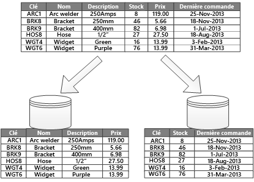

# Partitionnement des données horizontales, verticales et fonctionnelles

Dans beaucoup de solutions à grande échelle, les données sont divisées en *partitions* qui peuvent être gérées et auxquelles on peut accéder séparément. Le partitionnement peut améliorer l’extensibilité, réduire la contention et optimiser les performances. Il peut également offrir un mécanisme pour la division des données à l’aide d’un modèle d’utilisation. Par exemple, vous pouvez archiver les données plus anciennes dans un stockage de données plus économique.

Toutefois, la stratégie de partitionnement doit être choisie avec soin afin d’optimiser les avantages tout en réduisant les effets négatifs.

> [!NOTE]
> Dans cet article, le terme *partitionnement* désigne le processus de division physique des données sous forme de magasins de données distincts. Il convient de le distinguer du partitionnement de tables SQL Server, qui est un concept différent.

<!-- markdownlint-disable MD026 -->

## Pourquoi partitionner les données ?

<!-- markdownlint-enable MD026 -->

- **Améliorer l’évolutivité**. Quand vous procédez à la montée en puissance d’un système de base de données unique, celui-ci finit par atteindre une limite liée au matériel physique. Si vous divisez les données en plusieurs partitions, chacune hébergée sur un serveur distinct, vous pouvez faire évoluer le système presque indéfiniment.

- **Améliorer les performances**. Les opérations d’accès aux données présentes au sein de chaque partition interviennent sur un plus petit volume de données. Une fois correctement terminé, le partitionnement peut rendre votre système plus efficace. Les opérations qui affectent plusieurs partitions peuvent s’exécuter en parallèle.

- **Améliorer la sécurité**. Dans certains cas, vous pouvez séparer les données sensibles et non sensibles dans différentes partitions et appliquer aux données sensibles des contrôles de sécurité différents.

- **Procurer une flexibilité opérationnelle**. Le partitionnement offre de nombreuses possibilités de réglage des opérations, d’optimisation de l’efficacité de l’administration et de réduction des coûts. Par exemple, vous pouvez définir différentes stratégies de gestion, surveillance, sauvegarde et restauration et autres tâches d’administration en fonction de l’importance des données présentes dans chaque partition.

- **Faire correspondre le magasin de données au modèle d’utilisation**. Le partitionnement permet le déploiement de chaque partition sur un type de magasin de données différent, en fonction du coût et des fonctionnalités intégrées proposées par le magasin de données. Par exemple, il est possible de stocker les données binaires volumineuses dans un stockage d’objet blob et de stocker les données plus structurées dans une base de données de documents. Consultez [Choisir le magasin de données correct](../guide/technology-choices/data-store-overview.md).

- **Améliorer la disponibilité**. Diviser les données au sein de plusieurs serveurs permet d’éviter un point de défaillance unique. Lorsqu’une instance échoue, seules les données de cette partition sont indisponibles. Les opérations intervenant sur les autres partitions peuvent se poursuivre. Pour les magasins de données PaaS gérés, cette remarque est moins pertinente, car ces services ont été conçus avec une redondance intégrée.

## Concevoir des partitions

Il existe trois stratégies fréquentes de partitionnement des données :

- **Partitionnement horizontal** (souvent appelé *sharding*). Dans cette stratégie, chaque partition est un magasin de données distinct, mais toutes les partitions ont le même schéma. Chaque partition est appelée *shard* et comporte un sous-ensemble des données spécifique, par exemple, toutes les commandes d’un ensemble précis de clients.

- **Partitionnement vertical**. Dans cette stratégie, chaque partition comporte une partie des champs des éléments présents dans le magasin de données. Les champs sont divisés selon leur modèle d’utilisation. Par exemple, les champs fréquemment utilisés peuvent être placés dans une partition verticale et les champs moins fréquemment utilisés dans une autre.

- **Partitionnement fonctionnel**. Dans cette stratégie, les données sont agrégées en fonction de leur utilisation par chaque contexte limité au sein du système. Par exemple, un système d’e-commerce pourrait stocker les données de facturation dans une partition et les données relatives à l’inventaire des produits dans une autre.

Ces stratégies peuvent être combinées et nous vous recommandons de les considérer dans leur ensemble au moment de concevoir un schéma de partitionnement. Vous pouvez, par exemple, diviser les données en partitions, puis utiliser le partitionnement vertical pour ensuite sous-diviser les données au sein de chaque partition.

### Partitionnement horizontal (sharding)

La figure 1 présente un partitionnement horizontal ou sharding. Dans cet exemple, les données relatives à l’inventaire des produits sont divisées en partitions en fonction de la clé du produit. Chaque partition comporte les données relatives à une plage contiguë de clés de partition (A à G et H à Z), classées par ordre alphabétique. Le partitionnement horizontal vous permet de répartir la charge sur davantage d’ordinateurs, ce qui réduit la contention et améliore les performances.

*Figure 1 : Partitionnement horizontal des données en fonction d’une clé de partition.*

Le facteur le plus important est le choix de la clé de partitionnement. Il peut s’avérer difficile de modifier la clé une fois le système est en fonctionnement. La clé doit garantir un partitionnement des données afin de répartir la charge de travail aussi uniformément que possible au sein des partitions.

Les partitions ne doivent pas forcément avoir la même taille. Ce qui compte le plus, c’est d’équilibrer le nombre de requête. Certaines partitions peuvent être très volumineuses, mais le nombre d’accès dont dispose chaque élément est très faible. En revanche, dans d’autres partitions plus petites, chaque élément fait l’objet d’accès beaucoup plus fréquents. Il est aussi important de s’assurer qu’une partition ne dépasse pas les limites d’échelle (en termes de capacité et de ressources de traitement) du magasin de données.

Évitez de créer des partitions « à chaud » qui pourraient avoir des répercussions sur les performances et la disponibilité. Par exemple, utiliser la première lettre du nom d’un client entraîne une répartition déséquilibrée, car certaines lettres sont courantes. Hachez plutôt l’identificateur d’un client pour répartir les données de façon plus homogène entre les partitions.

Choisissez une clé de partitionnement qui limite toute exigence future de fractionnement des partitions volumineuses, de regroupement de petites partitions en partitions plus volumineuses ou de modification du schéma. Ces opérations peuvent prendre beaucoup de temps et nécessiter la mise hors connexion d’une ou plusieurs partitions pendant leur exécution.

En cas de réplication de partitions, certains réplicas peuvent parfois être maintenus en ligne pendant que d’autres sont fractionnés, fusionnés ou reconfigurés. Cependant, le système peut être contraint de limiter les opérations qui peuvent être exécutées pendant la reconfiguration. Par exemple, les données des réplicas peuvent être marquées en lecture seule afin d’éviter des incohérences de données.

Pour plus d’informations concernant le partitionnement horizontal, consultez [Modèle de partitionnement].

### Partitionnement vertical

L’utilisation la plus courante du partitionnement vertical vise à réduire les E/S et les coûts de performance associés à la recherche des éléments fréquemment utilisés. La figure 2 montre un exemple de partitionnement vertical. Dans cet exemple, les différentes propriétés d’un élément sont stockées dans des partitions différentes. L’un d’elles contient des données qui font l’objet d’accès plus fréquent, comme le nom du produit, la description et les informations tarifaires. Une autre partition contient les données d’inventaire : le total du stock et la dernière date de commande.

*Figure 2 : Partitionnement vertical des données en fonction du modèle d’utilisation.*

Dans cet exemple, l’application émet des requêtes à intervalles réguliers concernant le nom, la description et le prix du produit quand il s’agit d’afficher les détails du produit aux clients. Le total du stock et la dernière date de commande sont conservés dans une partition distincte, car ces deux éléments sont généralement utilisés ensemble.

D’autres avantages du partitionnement vertical :

- Les données relativement lentes (nom, description et prix du produit) peuvent être séparées des données plus dynamiques (niveau de stock et dernière date de commande). Les données lentes sont de bons candidats pour une application à mettre en cache en mémoire.

- Les données sensibles peuvent être stockées dans une partition différente avec les contrôles de sécurité supplémentaires.

- Le partitionnement vertical peut limiter le nombre d’accès simultanés qui est nécessaire.

Le partitionnement vertical fonctionne au niveau de l’entité au sein d’un magasin de données, en normalisant partiellement une entité pour organiser un *large* élément en un jeu d’éléments *restreints*. Il est parfaitement adapté aux magasins de données organisés en colonnes, tels que HBase et Cassandra. Si les données présentes au sein d’une collection de colonnes sont peu susceptibles d’être modifiées, vous pouvez également envisager d’utiliser des magasins organisés en colonnes dans SQL Server.

### Partitionnement fonctionnel

Lorsqu’il est possible d’identifier un contexte limité pour chaque secteur d’activité au sein d’une application, le partitionnement fonctionnel est un moyen d’améliorer les performances en matière d’isolement et d’accès aux données. Une autre utilisation fréquente du partitionnement fonctionnel consiste à séparer les données en lecture-écriture des données en lecture seule. La figure 3 présente une vue d’ensemble du partitionnement fonctionnel au sein duquel les données d’inventaire sont séparées des données relatives aux clients.

*Figure 3 : Partitionnement fonctionnel des données en fonction du contexte limité ou du sous-domaine.*

Cette stratégie de partitionnement peut contribuer à réduire la contention d’accès aux données entre les différentes parties d’un système.

## Concevoir des partitions évolutives

Il est essentiel de tenir compte de la taille et de la charge de travail de chaque partition et de les équilibrer de sorte que les données soient réparties de manière à assurer une extensibilité maximale. Cependant, vous devez également partitionner les données de sorte qu’elles ne dépassent pas les limites d’échelle d’un magasin de partitions.

Pour concevoir des partitions extensibles, procédez comme suit :

1. Analysez l’application pour comprendre les modèles d’accès aux données, telles que la taille du jeu de résultats retourné par chaque requête, la fréquence d’accès, la latence inhérente et les exigences de traitement de calcul côté serveur. Dans de nombreux cas, seules quelques entités principales nécessitent la majorité des ressources de traitement.
2. Servez-vous de cette analyse pour déterminer les objectifs d’extensibilité actuels et futurs, tels que la taille des données et la charge de travail. Répartissez ensuite les données entre les partitions pour satisfaire aux objectifs d’extensibilité. Pour le partitionnement horizontal, il est important de choisir la bonne clé de partitionnement pour s’assurer de l’homogénéité de la répartition. Pour plus d’informations, consultez [Modèle de partitionnement].
3. Assurez-vous que chaque partition possède les ressources suffisantes pour traiter les exigences d’extensibilité en matière de débit et de taille des données. En fonction du magasin de données, il peut y avoir une limite sur la quantité d’espace de stockage, la puissance de traitement ou la bande passante réseau par partition. Si les exigences sont susceptibles de dépasser ces limites, vous devez affiner votre stratégie de partitionnement ou fractionner davantage les données, possiblement en combinant deux stratégies ou plus.
4. Surveillez le système pour vérifier que les données sont réparties comme prévu et que les partitions peuvent gérer la charge. L’utilisation réelle ne correspond pas toujours aux prédictions de l’analyse. Dans ce cas, vous pouvez peut-être rééquilibrer les partitions, ou bien redéfinir certains composants du système pour obtenir l’équilibre requis.

Certains environnements cloud allouent les ressources en fonction des limites de l’infrastructure. Vérifiez que les limites sélectionnées offrent assez d’espace pour permettre toute croissance anticipée en termes de volume de données, de stockage des données, de puissance de traitement et de bande passante.

Par exemple, si vous utilisez le stockage de table Azure, le volume de requêtes pouvant être géré par une unique partition sur une période donnée est limité. (Consultez [Azure Storage Scalability and Performance Targets].) Une partition occupée peut demander plus de ressources que celles qui peuvent être gérées par une partition unique. Dans ce cas, la partition devra sans doute être repartitionnée afin de répartir la charge. Si la taille totale ou le débit de ces tables dépasse la capacité d’un compte de stockage, vous devrez sans doute créer des comptes de stockage supplémentaires et répartir les tables sur ces comptes.

## Concevoir des partitions pour garantir la performance des requêtes

La performance des requêtes peut souvent être améliorée en utilisant des jeux de données plus petits et en exécutant des requêtes parallèles. Chaque partition doit contenir une petite proportion du jeu de données entier. Cette réduction de volume peut améliorer la performance des requêtes. Cependant, le partitionnement n’est pas une alternative permettant de concevoir et de configurer une base de données de manière appropriée. Assurez-vous, par exemple, que vous disposez des index nécessaires.

Pour concevoir des partitions qui favorisent la performance des requêtes, procédez comme suit :

1. Examinez les exigences et les performances applicatives :

   - En fonction des exigences opérationnelles, identifiez les requêtes importantes qui doivent toujours être exécutées avec rapidité.
   - Surveillez le système afin d’identifier les requêtes s’exécutant lentement.
   - Rechercher les requêtes les plus fréquemment exécutées. Même si une requête unique a un coût moindre, la consommation cumulée de ressources peut être importante.

2. Partitionnez les données à l’origine du ralentissement des performances :
   - Limitez la taille de chaque partition afin que le temps de réponse aux requêtes corresponde à l’objectif.
   - Si vous utilisez le partitionnement horizontal, concevez la clé de partitionnement de sorte que l’application puisse aisément sélectionner la partition appropriée. La requête n’est alors pas contrainte de parcourir chaque partition.
   - Tenez compte de l’emplacement d’une partition. Si possible, essayez de conserver les données au sein de partitions physiquement proches des applications et utilisateurs qui y accèdent.

3. Si une entité présente des exigences en matière de débit et de performance des requêtes, utilisez le partitionnement fonctionnel en vous basant sur cette entité. Si cela ne permet toujours pas de satisfaire aux exigences, appliquez aussi un partitionnement horizontal. Dans la plupart des cas, une seule stratégie de partitionnement suffit, mais dans certains cas, il s’avère plus efficace d’associer les deux stratégies.

4. Envisagez d’exécuter des requêtes en parallèle sur plusieurs partitions pour améliorer les performances.

## Concevoir des partitions évolutives

Le fait de partitionner des données peut améliorer la disponibilité des applications en veillant à ce que l’ensemble du jeu de données ne constitue pas un point de défaillance unique et que les sous-ensembles individuels du jeu de données puissent être gérés indépendamment.

Prenez en compte les facteurs affectant la disponibilité suivants :

**Importance des données concernant les opérations d’exploitation**. Identifiez quelles données sont des informations d’entreprise essentielles, comme les transactions, et quelles données sont des données opérationnelles moins importantes, comme des fichiers journaux.

- Envisagez de stocker les données sensibles au sein de partitions hautement disponibles avec un plan de sauvegarde approprié.

- Établissez des procédures de gestion et de supervision distinctes pour les jeux de données différents.

- Placez les données présentant le même niveau d’importance dans la même partition pour qu’elles puissent être sauvegardées ensemble selon une fréquence appropriée. Par exemple, les partitions qui comportent des données de transactions doivent être sauvegardées plus fréquemment que les partitions qui comportent des informations de journalisation ou de suivi.

**Gestion des partitions individuelles**. Le fait de créer des partitions venant favoriser une gestion et une maintenance indépendantes présente plusieurs avantages. Par exemple : 

- En cas de défaillance d’une partition, elle peut être récupérée de manière indépendante, sans application accédant aux données présentes dans d’autres partitions.

- Le partitionnement des données par zone géographique permet l’exécution des tâches de maintenance planifiée à des heures creuses pour chaque emplacement. Assurez-vous que les partitions ne sont pas trop volumineuses pour empêcher l’exécution de toute maintenance planifiée au cours de cette période.

**Réplication des données importantes dans plusieurs partitions**. Cette stratégie peut améliorer la disponibilité et les performances, mais elle peut aussi présenter certains problèmes de cohérence. La synchronisation des modifications avec chaque réplica prend un certain temps. Au cours de cette période, les différentes partitions contiennent des valeurs de données différentes.

## Considérations relatives à la conception d’applications

Le partitionnement complique la conception et le développement du système. Envisagez le partitionnement comme une composante fondamentale de la conception du système, même si celui-ci ne contient au départ qu’une seule partition. Si vous utilisez le partitionnement en tant que réflexion après coup, ce sera plus difficile, car vous avez déjà un système actif à gérer :

- La logique d’accès aux données doit être modifiée.
- De grandes quantités de données existantes doivent sans doute être migrées, pour être distribuées sur les partitions
- Les utilisateurs s’attendent à pouvoir continuer à utiliser le système lors de la migration.

Dans certains cas, le partitionnement n’est pas considéré comme un élément important, le jeu de données initial étant peu volumineux et pouvant être facilement traité par un seul serveur. Cela peut concerner certaines charges de travail, mais beaucoup de systèmes commerciaux doivent évoluer à mesure que le nombre d’utilisateurs augmente.

De plus, les magasins de données volumineux ne sont pas les seuls à tirer parti du partitionnement. Par exemple, un magasin de données de petite taille peut faire l’objet d’accès de la part de centaines de clients simultanés. Le fait de partitionner les données dans une telle situation peut aider à réduire la contention et améliorer le débit.

Au moment de concevoir un schéma de partitionnement de données, tenez compte des points suivants :

**Réduisez les opérations d’accès aux données entre partitions**. Si possible, conservez les données relatives aux opérations de base de données les plus courantes dans chaque partition afin de réduire les opérations d’accès aux données entre partitions. Le fait d’interroger plusieurs partitions peut se révéler plus long que d’interroger une partition unique, mais l’optimisation des partitions d’un jeu de requêtes peut, au contraire, affecter les autres jeux de requêtes. Si vous avez besoin d’interroger plusieurs partitions, limitez la durée des requêtes en exécutant des requêtes parallèles et en agrégeant les résultats dans l’application. (Il se peut néanmoins que cette approche ne soit pas possible dans certains cas, par exemple quand le résultat d’une requête est utilisé dans la requête suivante.)

**Envisagez de répliquer les données de référence statiques.** Si les requêtes utilisent des données de référence relativement statiques, telles que des tables de codes postaux ou des listes de produits, envisagez de répliquer ces données dans toutes les partitions de façon à réduire le nombre d’opérations de recherche distinctes dans des partitions différentes. Cette approche peut aussi limiter les chances de voir les données de référence devenir un jeu de données « sensible » au trafic dense à l’échelle du système entier. Cependant, la synchronisation des modifications sur ces données de référence entraîne un coût supplémentaire.

**Réduisez les jointures de partitions croisées.** Dans la mesure du possible, réduisez les exigences en matière d’intégrité référentielle dans les partitions verticales et fonctionnelles. Dans ces schémas, l’application est en charge du maintien de l’intégrité référentielle dans les partitions. Les requêtes joignant les données de plusieurs partitions sont inefficaces, car l’application doit généralement exécuter des requêtes consécutives basées sur une clé, puis sur une clé étrangère. Envisagez plutôt de répliquer ou de dénormaliser les données pertinentes. Si vous devez joindre des partitions croisées, exécutez des requêtes parallèles sur les partitions et joignez les données dans l’application.

**Adoptez la cohérence éventuelle** :  Déterminez si une forte cohérence est un élément indispensable. Une approche courante dans les systèmes distribués consiste à mettre en place une cohérence finale. Les données de chaque partition sont mises à jour séparément, et la logique d’application vérifie que toutes les mises à jour aboutissent. De même, elle gère les incohérences qui peuvent découler de l’interrogation de données pendant l’exécution d’une opération finalement cohérente.

**Tenez compte de la façon dont les requêtes localisent la partition appropriée**. Si une requête doit parcourir toutes les partitions pour localiser les données souhaitées, cela affecte considérablement les performances, même si plusieurs requêtes en parallèle sont exécutées. Avec les stratégies de partitionnement vertical et fonctionnel, les requêtes peuvent naturellement spécifier les partitions. Le partitionnement horizontal, en revanche, peut contrarier la localisation d’un élément, car chaque partition a le même schéma. Une solution classique consiste à actualiser une carte utilisée dans la recherche de l’emplacement de la partition afin de consulter des éléments précis. Cette carte peut être implémentée dans la logique de partitionnement de l’application ou tenue à jour par le magasin de données s’il prend en charge le partitionnement transparent.

**Envisagez de rééquilibrer les partitions régulièrement**. Avec le partitionnement horizontal, le rééquilibrage des partitions peut aider à répartir les données de manière homogène en fonction de leur taille et de la charge de travail et ainsi de réduire les zones sensibles, d’optimiser la performance des requêtes et de contourner les limites de stockage physique. Il s’agit cependant d’une tâche complexe qui nécessite souvent l’utilisation d’un processus ou d’un outil personnalisé.

**Répliquez les partitions.** Si vous répliquez toutes les partitions, cela vous offre une protection supplémentaire contre les défaillances. Si une réplique connaît une défaillance, les requêtes peuvent être dirigées vers une copie de travail.

**Si vous atteignez les limites physiques d’une stratégie de partitionnement, vous devrez peut-être développer l’extensibilité à un autre niveau**. Par exemple, si le partitionnement se situe au niveau de la base de données, vous devrez peut-être localiser ou répliquer les partitions dans plusieurs bases de données. Si le partitionnement se situe déjà au niveau de la base de données et que les limitations physiques posent problème, vous serez peut-être amené à localiser ou à répliquer les partitions dans plusieurs comptes d’hébergement.

**Évitez les transactions qui accèdent à des données présentes dans plusieurs partitions**. Certains magasins de données implémentent l’intégrité et la cohérence transactionnelles pour les opérations qui modifient les données, mais seulement quand ces données se trouvent dans une même partition. Si vous devez disposer d’une prise en charge au sein de plusieurs partitions, il vous faut probablement mettre en œuvre ce mécanisme en l’intégrant à votre logique applicative, la plupart des systèmes de partitionnement ne proposant pas de prise en charge native.

Tous les magasins de données nécessitent une certaine gestion opérationnelle et une certaine surveillance. Les tâches associées peuvent aller du chargement, de sauvegarde, de la restauration et de la réorganisation des données à la vérification du fonctionnement correct et efficace du système.

Tenez compte des facteurs suivants qui affectent la gestion des opérations :

- **Implémentation des tâches opérationnelles et de gestion appropriées quand les données sont partitionnées**. Ces tâches peuvent inclure la sauvegarde et la restauration, l’archivage de données, la surveillance du système et d’autres tâches d’administration. Par exemple, la maintenance de la cohérence logique au cours des opérations de sauvegarde et de restauration peut se révéler compliquée.

- **Chargement des données dans plusieurs partitions et ajout de nouvelles données en provenance d’autres sources**. Il peut arriver que certains outils et utilitaires ne prennent pas en charge certaines opérations de données partitionnées, telles que le chargement des données dans la partition appropriée.

- **Archivage et suppression des données de façon régulière**. Pour éviter une croissance excessive des partitions, vous devez archiver et supprimer les données de façon régulière (parfois tous les mois). Il peut être nécessaire de transformer les données pour les adapter à un schéma d’archivage différent.

- **Identification des problèmes d’intégrité des données**. Envisagez d’exécuter un processus périodique pour identifier tout problème d’intégrité de données, comme des données dans une partition unique qui font référence à des informations manquantes dans une autre. Ce processus peut tenter de corriger ces problèmes automatiquement, ou, simplement générer un rapport pour une revue manuelle.

## Rééquilibrer les partitions

Étant donné que le système évolue, vous devrez peut-être ajuster le schéma de partitionnement. Par exemple, des partitions individuelles peuvent commencer à concentrer un volume de trafic disproportionné et devenir sensibles, provoquant une contention excessive. Il se peut aussi que vous ayez sous-évalué le volume des données stockées dans certaines partitions et que celles-ci atteignent les limites de leur capacité de stockage.

Certains magasins de données tels que Cosmos DB peuvent rééquilibrer automatiquement les partitions. Dans d’autres cas, le rééquilibrage correspond à une tâche administrative passant par deux étapes :

1. Définissez une nouvelle stratégie de partitionnement.

    - Quelles partitions faut-il fractionner (ou, éventuellement, combiner) ?
    - Quelle est la nouvelle clé de partition ?

2. Migrez des données à partir de l’ancien schéma de partitionnement vers le nouveau jeu de partitions.

En fonction du magasin de données, vous pourrez peut-être effectuer une migration des données entre des partitions pendant qu’elles sont en cours d’utilisation. Ce procédé est appelé *migration en ligne*. Si ce n’est pas possible, vous devrez peut-être rendre les partitions indisponibles pendant que le déplacement des données (*migration hors connexion*).

### Migration hors connexion

La migration hors connexion est généralement plus simple, car elle réduit les risques de contention. Le concept de la migration hors connexion fonctionne de la manière suivante :

1. Marquez la partition hors connexion.
2. Fractionnez/fusionnez et déplacez les données vers les nouvelles partitions.
3. Vérifier les données
4. Publiez les nouvelles partitions en ligne.
5. Supprimez l’ancienne partition.

Si vous le souhaitez, pendant l’étape 1, vous pouvez marquer une partition en lecture seule afin que les applications puissent lire les données même pendant leur déplacement.

## Migration en ligne

La migration en ligne est plus complexe à réaliser, mais entraîne moins de perturbations. Le processus est similaire à celui utilisé pour la migration hors connexion, à ceci près que la partition d’origine n’est pas mise hors connexion. En fonction de la précision du processus de migration (par exemple, élément par élément ou partition par partition), le code d’accès aux données présent dans les applications clientes devra peut-être gérer la lecture et l’écriture des données stockées dans deux emplacements : la partition d’origine et la nouvelle partition.

## Modèles associés

Les modèles de conception suivants vous concernent peut-être :

- Le [modèle de partitionnement](../patterns/sharding.md) décrit des stratégies de partitionnement de données fréquentes.

- Le [modèle de table d’index](../patterns/index-table.md) montre comment créer des index secondaires à partir des données. Cette approche permet à une application de récupérer rapidement des données à l’aide de requêtes ne faisant pas référence à la clé primaire d’une collection.

- Le [modèle de vue matérialisée](../patterns/materialized-view.md) illustre comment générer des affichages prédéfinis synthétisant les données pour prendre en charge des opérations de requêtes rapides. Cette approche peut s’avérer utile au sein d’un magasin de données partitionnées si les partitions contenant les données synthétisées sont réparties sur plusieurs sites.

## Étapes suivantes

- Découvrez les stratégies de partitionnement pour des services Azure spécifiques. Consultez [Stratégies de partitionnement de données](./data-partitioning-strategies.md)

[Azure Storage Scalability and Performance Targets]: /azure/storage/storage-scalability-targets
