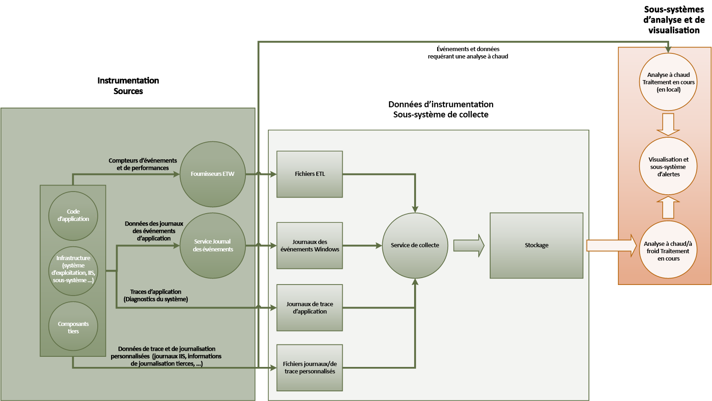
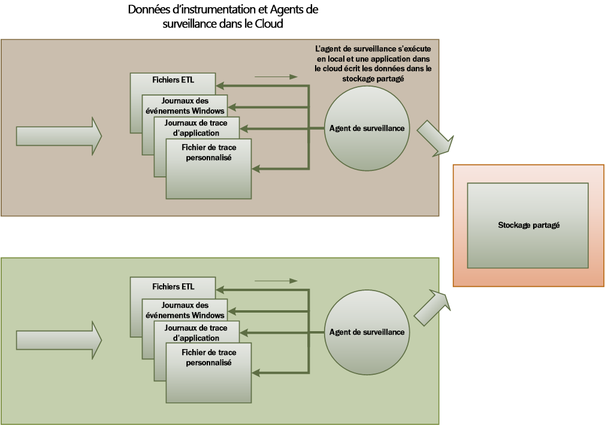
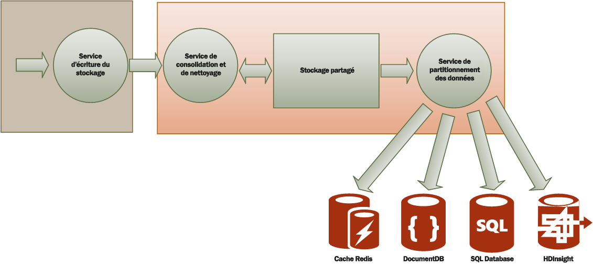

# <a name="monitoring-and-diagnostics"></a><span data-ttu-id="098f4-103">Surveillance et diagnostics</span><span class="sxs-lookup"><span data-stu-id="098f4-103">Monitoring and diagnostics</span></span>
[!INCLUDE [header](../_includes/header.md)]

<span data-ttu-id="098f4-104">Les applications et services distribués, exécutés dans le cloud sont, par leur nature, les parties complexes des logiciels comprenant de nombreux éléments mobiles.</span><span class="sxs-lookup"><span data-stu-id="098f4-104">Distributed applications and services running in the cloud are, by their nature, complex pieces of software that comprise many moving parts.</span></span> <span data-ttu-id="098f4-105">Dans un environnement de production, il est important de pouvoir contrôler la méthode avec laquelle les utilisateurs utilisent votre système, de suivre l’utilisation des ressources et généralement de surveiller l’intégrité et les performances de votre système.</span><span class="sxs-lookup"><span data-stu-id="098f4-105">In a production environment, it's important to be able to track the way in which users utilize your system, trace resource utilization, and generally monitor the health and performance of your system.</span></span> <span data-ttu-id="098f4-106">Vous pouvez utiliser ces informations comme aide au diagnostic pour détecter et corriger les problèmes, et également aider à identifier des problèmes potentiels et les empêcher de se produire.</span><span class="sxs-lookup"><span data-stu-id="098f4-106">You can use this information as a diagnostic aid to detect and correct issues, and also to help spot potential problems and prevent them from occurring.</span></span>

## <a name="monitoring-and-diagnostics-scenarios"></a><span data-ttu-id="098f4-107">Scénarios de surveillance et de diagnostic</span><span class="sxs-lookup"><span data-stu-id="098f4-107">Monitoring and diagnostics scenarios</span></span>
<span data-ttu-id="098f4-108">Vous pouvez utiliser la surveillance pour mieux comprendre le fonctionnement d’un système.</span><span class="sxs-lookup"><span data-stu-id="098f4-108">You can use monitoring to gain an insight into how well a system is functioning.</span></span> <span data-ttu-id="098f4-109">La surveillance est un élément essentiel du maintien des objectifs de qualité de service.</span><span class="sxs-lookup"><span data-stu-id="098f4-109">Monitoring is a crucial part of maintaining quality-of-service targets.</span></span> <span data-ttu-id="098f4-110">Les scénarios courants pour la collecte des données de surveillance sont les suivants :</span><span class="sxs-lookup"><span data-stu-id="098f4-110">Common scenarios for collecting monitoring data include:</span></span>

* <span data-ttu-id="098f4-111">S’assurer que le système reste sain.</span><span class="sxs-lookup"><span data-stu-id="098f4-111">Ensuring that the system remains healthy.</span></span>
* <span data-ttu-id="098f4-112">Suivre la disponibilité du système et de ses composants.</span><span class="sxs-lookup"><span data-stu-id="098f4-112">Tracking the availability of the system and its component elements.</span></span>
* <span data-ttu-id="098f4-113">Maintenir les performances pour s’assurer que le débit du système ne se dégrade pas inopinément à mesure que le volume de travail augmente.</span><span class="sxs-lookup"><span data-stu-id="098f4-113">Maintaining performance to ensure that the throughput of the system does not degrade unexpectedly as the volume of work increases.</span></span>
* <span data-ttu-id="098f4-114">Garantir que le système satisfait aux contrats de niveau de service (SLA) établis avec les clients.</span><span class="sxs-lookup"><span data-stu-id="098f4-114">Guaranteeing that the system meets any service-level agreements (SLAs) established with customers.</span></span>
* <span data-ttu-id="098f4-115">Protéger la confidentialité et la sécurité du système, des utilisateurs et de leurs données.</span><span class="sxs-lookup"><span data-stu-id="098f4-115">Protecting the privacy and security of the system, users, and their data.</span></span>
* <span data-ttu-id="098f4-116">Suivre les opérations qui sont effectuées à des fins d’audit ou de réglementation.</span><span class="sxs-lookup"><span data-stu-id="098f4-116">Tracking the operations that are performed for auditing or regulatory purposes.</span></span>
* <span data-ttu-id="098f4-117">Surveiller l’utilisation quotidienne du système et identifier les tendances qui peuvent entraîner des problèmes si elles ne sont pas traitées.</span><span class="sxs-lookup"><span data-stu-id="098f4-117">Monitoring the day-to-day usage of the system and spotting trends that might lead to problems if they're not addressed.</span></span>
* <span data-ttu-id="098f4-118">Suivre les problèmes qui surviennent, à partir d’un rapport initial via l’analyse des causes possibles, de la rectification, des mises à jour logicielles consécutives et du déploiement.</span><span class="sxs-lookup"><span data-stu-id="098f4-118">Tracking issues that occur, from initial report through to analysis of possible causes, rectification, consequent software updates, and deployment.</span></span>
* <span data-ttu-id="098f4-119">Suivre les opérations et les versions de débogage.</span><span class="sxs-lookup"><span data-stu-id="098f4-119">Tracing operations and debugging software releases.</span></span>

> [!NOTE]
> <span data-ttu-id="098f4-120">Cette liste n’est pas exhaustive.</span><span class="sxs-lookup"><span data-stu-id="098f4-120">This list is not intended to be comprehensive.</span></span> <span data-ttu-id="098f4-121">Ce document porte essentiellement sur les scénarios correspondant aux situations les plus courantes de surveillance.</span><span class="sxs-lookup"><span data-stu-id="098f4-121">This document focuses on these scenarios as the most common situations for performing monitoring.</span></span> <span data-ttu-id="098f4-122">Il peut en exister d’autres moins courantes ou propres à votre environnement.</span><span class="sxs-lookup"><span data-stu-id="098f4-122">There might be others that are less common or are specific to your environment.</span></span>
> 
> 

<span data-ttu-id="098f4-123">Les sections suivantes décrivent ces scénarios plus en détail.</span><span class="sxs-lookup"><span data-stu-id="098f4-123">The following sections describe these scenarios in more detail.</span></span> <span data-ttu-id="098f4-124">Les informations pour chaque scénario sont décrites selon le format suivant :</span><span class="sxs-lookup"><span data-stu-id="098f4-124">The information for each scenario is discussed in the following format:</span></span>

1. <span data-ttu-id="098f4-125">Une brève vue d’ensemble du scénario.</span><span class="sxs-lookup"><span data-stu-id="098f4-125">A brief overview of the scenario</span></span>
2. <span data-ttu-id="098f4-126">Les conditions requises typiques de ce scénario.</span><span class="sxs-lookup"><span data-stu-id="098f4-126">The typical requirements of this scenario</span></span>
3. <span data-ttu-id="098f4-127">Les données d’instrumentation brutes requises pour favoriser le scénario et les sources possibles de ces informations.</span><span class="sxs-lookup"><span data-stu-id="098f4-127">The raw instrumentation data that's required to support the scenario, and possible sources of this information</span></span>
4. <span data-ttu-id="098f4-128">La méthode d’analyse et d’association de ces données brutes pour générer des informations de diagnostic dignes d’intérêt.</span><span class="sxs-lookup"><span data-stu-id="098f4-128">How this raw data can be analyzed and combined to generate meaningful diagnostic information</span></span>

## <a name="health-monitoring"></a><span data-ttu-id="098f4-129">Surveillance de l’intégrité</span><span class="sxs-lookup"><span data-stu-id="098f4-129">Health monitoring</span></span>
<span data-ttu-id="098f4-130">Un système est sain s’il est en cours d’exécution et capable de traiter les demandes.</span><span class="sxs-lookup"><span data-stu-id="098f4-130">A system is healthy if it is running and capable of processing requests.</span></span> <span data-ttu-id="098f4-131">L’objectif de la surveillance de l’intégrité consiste à générer un instantané de l’intégrité actuelle du système pour vous permettre de vérifier que tous les composants du système fonctionnent comme prévu.</span><span class="sxs-lookup"><span data-stu-id="098f4-131">The purpose of health monitoring is to generate a snapshot of the current health of the system so that you can verify that all components of the system are functioning as expected.</span></span>

### <a name="requirements-for-health-monitoring"></a><span data-ttu-id="098f4-132">Conditions requises pour la surveillance de l’intégrité</span><span class="sxs-lookup"><span data-stu-id="098f4-132">Requirements for health monitoring</span></span>
<span data-ttu-id="098f4-133">Un opérateur doit être averti rapidement (en quelques secondes) si une partie du système est considérée comme défectueuse.</span><span class="sxs-lookup"><span data-stu-id="098f4-133">An operator should be alerted quickly (within a matter of seconds) if any part of the system is deemed to be unhealthy.</span></span> <span data-ttu-id="098f4-134">L’opérateur doit être en mesure de déterminer les parties du système qui fonctionnent normalement et celles qui rencontrent des problèmes.</span><span class="sxs-lookup"><span data-stu-id="098f4-134">The operator should be able to ascertain which parts of the system are functioning normally, and which parts are experiencing problems.</span></span> <span data-ttu-id="098f4-135">L’intégrité du système est mise en évidence via un système de feux de signalisation :</span><span class="sxs-lookup"><span data-stu-id="098f4-135">System health can be highlighted through a traffic-light system:</span></span>

* <span data-ttu-id="098f4-136">Un feu rouge indique un état défectueux (le système est arrêté).</span><span class="sxs-lookup"><span data-stu-id="098f4-136">Red for unhealthy (the system has stopped)</span></span>
* <span data-ttu-id="098f4-137">Un feu jaune indique un état d’intégrité partiellement normal (le système s’exécute avec des fonctionnalités réduites).</span><span class="sxs-lookup"><span data-stu-id="098f4-137">Yellow for partially healthy (the system is running with reduced functionality)</span></span>
* <span data-ttu-id="098f4-138">Un feu vert indique un état d’intégrité tout à fait normal.</span><span class="sxs-lookup"><span data-stu-id="098f4-138">Green for completely healthy</span></span>

<span data-ttu-id="098f4-139">Un système complet de surveillance de l’intégrité permet à un opérateur d’explorer le système pour afficher l’état d’intégrité des sous-systèmes et des composants.</span><span class="sxs-lookup"><span data-stu-id="098f4-139">A comprehensive health-monitoring system enables an operator to drill down through the system to view the health status of subsystems and components.</span></span> <span data-ttu-id="098f4-140">Par exemple, si l’ensemble du système est représenté comme partiellement sain, l’opérateur doit être en mesure de zoomer et de déterminer la fonctionnalité qui est actuellement indisponible.</span><span class="sxs-lookup"><span data-stu-id="098f4-140">For example, if the overall system is depicted as partially healthy, the operator should be able to zoom in and determine which functionality is currently unavailable.</span></span>

### <a name="data-sources-instrumentation-and-data-collection-requirements"></a><span data-ttu-id="098f4-141">Sources de données, instrumentation et conditions de collecte de données</span><span class="sxs-lookup"><span data-stu-id="098f4-141">Data sources, instrumentation, and data-collection requirements</span></span>
<span data-ttu-id="098f4-142">Les données brutes requises pour la surveillance de l’intégrité peuvent être générées après les opérations suivantes :</span><span class="sxs-lookup"><span data-stu-id="098f4-142">The raw data that's required to support health monitoring can be generated as a result of:</span></span>

* <span data-ttu-id="098f4-143">Le suivi de l’exécution des demandes utilisateur.</span><span class="sxs-lookup"><span data-stu-id="098f4-143">Tracing execution of user requests.</span></span> <span data-ttu-id="098f4-144">Ces informations peuvent être utilisées pour déterminer les demandes qui ont réussi, celles qui ont échoué et le temps de réponse pour chaque demande.</span><span class="sxs-lookup"><span data-stu-id="098f4-144">This information can be used to determine which requests have succeeded, which have failed, and how long each request takes.</span></span>
* <span data-ttu-id="098f4-145">La surveillance des utilisateurs synthétiques.</span><span class="sxs-lookup"><span data-stu-id="098f4-145">Synthetic user monitoring.</span></span> <span data-ttu-id="098f4-146">Ce processus simule les étapes effectuées par un utilisateur et suit une série d’étapes prédéfinie.</span><span class="sxs-lookup"><span data-stu-id="098f4-146">This process simulates the steps performed by a user and follows a predefined series of steps.</span></span> <span data-ttu-id="098f4-147">Les résultats de chaque étape doivent être capturés.</span><span class="sxs-lookup"><span data-stu-id="098f4-147">The results of each step should be captured.</span></span>
* <span data-ttu-id="098f4-148">L’enregistrement des exceptions, erreurs et avertissements.</span><span class="sxs-lookup"><span data-stu-id="098f4-148">Logging exceptions, faults, and warnings.</span></span> <span data-ttu-id="098f4-149">Ces informations peuvent être capturées en résultat du suivi des instructions intégrées dans le code d’application, et de la récupération des informations des journaux des événements des services référencés par le système.</span><span class="sxs-lookup"><span data-stu-id="098f4-149">This information can be captured as a result of trace statements embedded into the application code, as well as retrieving information from the event logs of any services that the system references.</span></span>
* <span data-ttu-id="098f4-150">La surveillance de l’intégrité de tous les services tiers utilisés par le système.</span><span class="sxs-lookup"><span data-stu-id="098f4-150">Monitoring the health of any third-party services that the system uses.</span></span> <span data-ttu-id="098f4-151">Cette surveillance peut nécessiter la récupération et l’analyse des données d’intégrité fournies par ces services.</span><span class="sxs-lookup"><span data-stu-id="098f4-151">This monitoring might require retrieving and parsing health data that these services supply.</span></span> <span data-ttu-id="098f4-152">Ces informations peuvent prendre différents formats.</span><span class="sxs-lookup"><span data-stu-id="098f4-152">This information might take a variety of formats.</span></span>
* <span data-ttu-id="098f4-153">La surveillance de point de terminaison.</span><span class="sxs-lookup"><span data-stu-id="098f4-153">Endpoint monitoring.</span></span> <span data-ttu-id="098f4-154">Ce mécanisme est décrit plus en détail dans la section « Surveillance de la disponibilité ».</span><span class="sxs-lookup"><span data-stu-id="098f4-154">This mechanism is described in more detail in the "Availability monitoring" section.</span></span>
* <span data-ttu-id="098f4-155">La collecte des informations de performances ambiantes, telles que l’utilisation du processeur d’arrière-plan ou l’activité E/S (y compris le réseau).</span><span class="sxs-lookup"><span data-stu-id="098f4-155">Collecting ambient performance information, such as background CPU utilization or I/O (including network) activity.</span></span>

### <a name="analyzing-health-data"></a><span data-ttu-id="098f4-156">Analyse des données d’intégrité</span><span class="sxs-lookup"><span data-stu-id="098f4-156">Analyzing health data</span></span>
<span data-ttu-id="098f4-157">Le principal objectif de la surveillance d’intégrité est d’indiquer rapidement si le système est en cours d’exécution.</span><span class="sxs-lookup"><span data-stu-id="098f4-157">The primary focus of health monitoring is to quickly indicate whether the system is running.</span></span> <span data-ttu-id="098f4-158">L’analyse à chaud des données immédiates peut déclencher une alerte si un composant critique est détecté comme défectueux,</span><span class="sxs-lookup"><span data-stu-id="098f4-158">Hot analysis of the immediate data can trigger an alert if a critical component is detected as unhealthy.</span></span> <span data-ttu-id="098f4-159">par exemple s’il ne parvient pas à répondre à une série consécutive de tests Ping.) L’opérateur peut prendre ensuite l’action corrective appropriée.</span><span class="sxs-lookup"><span data-stu-id="098f4-159">(It fails to respond to a consecutive series of pings, for example.) The operator can then take the appropriate corrective action.</span></span>

<span data-ttu-id="098f4-160">Un système plus avancé peut inclure un élément prédictif qui effectue une analyse à froid des charges de travail récentes et en cours.</span><span class="sxs-lookup"><span data-stu-id="098f4-160">A more advanced system might include a predictive element that performs a cold analysis over recent and current workloads.</span></span> <span data-ttu-id="098f4-161">Une telle analyse permet d’identifier des tendances et de déterminer si le système est susceptible de rester dans un état d’intégrité normal ou s’il nécessite des ressources supplémentaires.</span><span class="sxs-lookup"><span data-stu-id="098f4-161">A cold analysis can spot trends and determine whether the system is likely to remain healthy or whether the system will need additional resources.</span></span> <span data-ttu-id="098f4-162">Cet élément prédictif doit s’appuyer sur des métriques de performance critiques, par exemple :</span><span class="sxs-lookup"><span data-stu-id="098f4-162">This predictive element should be based on critical performance metrics, such as:</span></span>

* <span data-ttu-id="098f4-163">La fréquence des requêtes dirigées vers chaque service ou sous-système.</span><span class="sxs-lookup"><span data-stu-id="098f4-163">The rate of requests directed at each service or subsystem.</span></span>
* <span data-ttu-id="098f4-164">Les temps de réponse de ces requêtes.</span><span class="sxs-lookup"><span data-stu-id="098f4-164">The response times of these requests.</span></span>
* <span data-ttu-id="098f4-165">Le volume des données échangées avec chaque service.</span><span class="sxs-lookup"><span data-stu-id="098f4-165">The volume of data flowing into and out of each service.</span></span>

<span data-ttu-id="098f4-166">Si la valeur d’une métrique dépasse un seuil défini, le système peut déclencher une alerte pour permettre à un opérateur ou à la mise à l’échelle automatique (si disponible) de prendre les mesures préventives nécessaires pour maintenir l’intégrité du système.</span><span class="sxs-lookup"><span data-stu-id="098f4-166">If the value of any metric exceeds a defined threshold, the system can raise an alert to enable an operator or autoscaling (if available) to take the preventative actions necessary to maintain system health.</span></span> <span data-ttu-id="098f4-167">Ces actions peuvent impliquer l’ajout de ressources, le redémarrage d’un ou de plusieurs services défectueux, ou l’application d’une limitation aux demandes de faible priorité.</span><span class="sxs-lookup"><span data-stu-id="098f4-167">These actions might involve adding resources, restarting one or more services that are failing, or applying throttling to lower-priority requests.</span></span>

## <a name="availability-monitoring"></a><span data-ttu-id="098f4-168">Surveillance de la disponibilité</span><span class="sxs-lookup"><span data-stu-id="098f4-168">Availability monitoring</span></span>
<span data-ttu-id="098f4-169">Un système véritablement sain nécessite la disponibilité des composants et des sous-systèmes qui constituent le système.</span><span class="sxs-lookup"><span data-stu-id="098f4-169">A truly healthy system requires that the components and subsystems that compose the system are available.</span></span> <span data-ttu-id="098f4-170">La surveillance de la disponibilité est étroitement liée à la surveillance de l’intégrité.</span><span class="sxs-lookup"><span data-stu-id="098f4-170">Availability monitoring is closely related to health monitoring.</span></span> <span data-ttu-id="098f4-171">Néanmoins, alors que la surveillance de l’intégrité fournit une vue immédiate de l’intégrité actuelle du système, la surveillance de la disponibilité concerne la disponibilité du système et de ses composants afin de générer des statistiques relatives au temps d’activité du système.</span><span class="sxs-lookup"><span data-stu-id="098f4-171">But whereas health monitoring provides an immediate view of the current health of the system, availability monitoring is concerned with tracking the availability of the system and its components to generate statistics about the uptime of the system.</span></span>

<span data-ttu-id="098f4-172">Dans de nombreux systèmes, certains composants (par exemple, une base de données) sont configurés avec une redondance intégrée pour permettre un basculement rapide en cas d’erreur grave ou d’une perte de connectivité.</span><span class="sxs-lookup"><span data-stu-id="098f4-172">In many systems, some components (such as a database) are configured with built-in redundancy to permit rapid failover in the event of a serious fault or loss of connectivity.</span></span> <span data-ttu-id="098f4-173">Dans l’idéal, les utilisateurs ne doivent pas être conscients qu’une telle défaillance s’est produite,</span><span class="sxs-lookup"><span data-stu-id="098f4-173">Ideally, users should not be aware that such a failure has occurred.</span></span> <span data-ttu-id="098f4-174">mais du point de vue de la surveillance de la disponibilité, il est nécessaire de recueillir autant d’informations que possible sur ces défaillances pour en déterminer la cause et prendre les mesures correctives adéquates pour empêcher qu’elles se reproduisent.</span><span class="sxs-lookup"><span data-stu-id="098f4-174">But from an availability monitoring perspective, it's necessary to gather as much information as possible about such failures to determine the cause and take corrective actions to prevent them from recurring.</span></span>

<span data-ttu-id="098f4-175">Les données requises pour le suivi de la disponibilité peuvent dépendre de plusieurs facteurs de niveau inférieur.</span><span class="sxs-lookup"><span data-stu-id="098f4-175">The data that's required to track availability might depend on a number of lower-level factors.</span></span> <span data-ttu-id="098f4-176">Nombre de ces facteurs peuvent être propres à l’application, au système et à l’environnement.</span><span class="sxs-lookup"><span data-stu-id="098f4-176">Many of these factors might be specific to the application, system, and environment.</span></span> <span data-ttu-id="098f4-177">Un système de surveillance efficace capture les données de disponibilité qui correspondent à ces facteurs de niveau inférieur, puis les agrège afin de donner une vue d’ensemble du système.</span><span class="sxs-lookup"><span data-stu-id="098f4-177">An effective monitoring system captures the availability data that corresponds to these low-level factors and then aggregates them to give an overall picture of the system.</span></span> <span data-ttu-id="098f4-178">Par exemple, dans un système de commerce électronique, la fonctionnalité d’entreprise qui permet à un client de passer des commandes peut dépendre du référentiel dans lequel les détails de la commande sont stockés et du système de paiement qui gère les transactions monétaires pour le paiement de ces commandes.</span><span class="sxs-lookup"><span data-stu-id="098f4-178">For example, in an e-commerce system, the business functionality that enables a customer to place orders might depend on the repository where order details are stored and the payment system that handles the monetary transactions for paying for these orders.</span></span> <span data-ttu-id="098f4-179">La disponibilité de la partie du système liée à la passation des commandes est donc fonction de la disponibilité du référentiel et du sous-système de paiement.</span><span class="sxs-lookup"><span data-stu-id="098f4-179">The availability of the order-placement part of the system is therefore a function of the availability of the repository and the payment subsystem.</span></span>

### <a name="requirements-for-availability-monitoring"></a><span data-ttu-id="098f4-180">Conditions requises pour la surveillance de la disponibilité</span><span class="sxs-lookup"><span data-stu-id="098f4-180">Requirements for availability monitoring</span></span>
<span data-ttu-id="098f4-181">Un opérateur doit également être en mesure d’afficher la disponibilité historique de chaque système et sous-système et d’utiliser ces informations pour identifier les tendances susceptibles de provoquer des défaillances régulières d’un ou de plusieurs sous-systèmes.</span><span class="sxs-lookup"><span data-stu-id="098f4-181">An operator should also be able to view the historical availability of each system and subsystem, and use this information to spot any trends that might cause one or more subsystems to periodically fail.</span></span> <span data-ttu-id="098f4-182">(Les défaillances des services commencent-elles à un moment précis de la journée qui correspond aux heures de traitement de pointe ?)</span><span class="sxs-lookup"><span data-stu-id="098f4-182">(Do services start to fail at a particular time of day that corresponds to peak processing hours?)</span></span>

<span data-ttu-id="098f4-183">Une solution de surveillance doit fournir une vue immédiate et historique de la disponibilité ou de l’indisponibilité de chaque sous-système.</span><span class="sxs-lookup"><span data-stu-id="098f4-183">A monitoring solution should provide an immediate and historical view of the availability or unavailability of each subsystem.</span></span> <span data-ttu-id="098f4-184">Elle doit également être en mesure d’alerter rapidement un opérateur en cas d’échec d’un ou de plusieurs services ou si les utilisateurs ne peuvent pas se connecter aux services.</span><span class="sxs-lookup"><span data-stu-id="098f4-184">It should also be capable of quickly alerting an operator when one or more services fail or when users can't connect to services.</span></span> <span data-ttu-id="098f4-185">Il ne s’agit pas uniquement de surveiller chaque service, mais également d’examiner les actions effectuées par chaque utilisateur en cas d’échec de ces actions lorsqu’il tente de communiquer avec un service.</span><span class="sxs-lookup"><span data-stu-id="098f4-185">This is a matter of not only monitoring each service, but also examining the actions that each user performs if these actions fail when they attempt to communicate with a service.</span></span> <span data-ttu-id="098f4-186">Dans une certaine mesure, un degré de problème de connectivité est normal et peut être dû à des erreurs temporaires.</span><span class="sxs-lookup"><span data-stu-id="098f4-186">To some extent, a degree of connectivity failure is normal and might be due to transient errors.</span></span> <span data-ttu-id="098f4-187">Cependant il peut être utile d’autoriser le système à déclencher une alerte pour un nombre d’échecs de connectivité à un sous-système spécifié se produisant au cours d’une période spécifique.</span><span class="sxs-lookup"><span data-stu-id="098f4-187">But it might be useful to allow the system to raise an alert for the number of connectivity failures to a specified subsystem that occur during a specific period.</span></span>

### <a name="data-sources-instrumentation-and-data-collection-requirements"></a><span data-ttu-id="098f4-188">Sources de données, instrumentation et conditions de collecte de données</span><span class="sxs-lookup"><span data-stu-id="098f4-188">Data sources, instrumentation, and data-collection requirements</span></span>
<span data-ttu-id="098f4-189">Comme pour la surveillance de l’intégrité, les données brutes requises pour prendre en charge la surveillance de la disponibilité peuvent être générées suite à la surveillance d’utilisateurs synthétiques et à l’enregistrement de l’ensemble des exceptions, erreurs et avertissements pouvant se produire.</span><span class="sxs-lookup"><span data-stu-id="098f4-189">As with health monitoring, the raw data that's required to support availability monitoring can be generated as a result of synthetic user monitoring and logging any exceptions, faults, and warnings that might occur.</span></span> <span data-ttu-id="098f4-190">En outre, les données de disponibilité peuvent être obtenues à partir de la surveillance de point de terminaison.</span><span class="sxs-lookup"><span data-stu-id="098f4-190">In addition, availability data can be obtained from performing endpoint monitoring.</span></span> <span data-ttu-id="098f4-191">L’application peut exposer un ou plusieurs points de terminaison d’intégrité, chacun d’entre eux testant l’accès à une zone fonctionnelle du système.</span><span class="sxs-lookup"><span data-stu-id="098f4-191">The application can expose one or more health endpoints, each testing access to a functional area within the system.</span></span> <span data-ttu-id="098f4-192">Le système de surveillance peut envoyer une commande ping sur chaque point de terminaison en suivant un calendrier défini, et collecter les résultats (réussite ou échec).</span><span class="sxs-lookup"><span data-stu-id="098f4-192">The monitoring system can ping each endpoint by following a defined schedule and collect the results (success or fail).</span></span>

<span data-ttu-id="098f4-193">Tous les délais d’attente, les échecs de connectivité au réseau et les nouvelles tentatives de connexion doivent être enregistrés.</span><span class="sxs-lookup"><span data-stu-id="098f4-193">All timeouts, network connectivity failures, and connection retry attempts must be recorded.</span></span> <span data-ttu-id="098f4-194">Toutes les données doivent être horodatées.</span><span class="sxs-lookup"><span data-stu-id="098f4-194">All data should be time-stamped.</span></span>

<a name="analyzing-availability-data"></a>

### <a name="analyzing-availability-data"></a><span data-ttu-id="098f4-195">Analyse des données de disponibilité</span><span class="sxs-lookup"><span data-stu-id="098f4-195">Analyzing availability data</span></span>
<span data-ttu-id="098f4-196">Les données d’instrumentation doivent être agrégées et corrélées pour prendre en charge les types d’analyse suivants :</span><span class="sxs-lookup"><span data-stu-id="098f4-196">The instrumentation data must be aggregated and correlated to support the following types of analysis:</span></span>

* <span data-ttu-id="098f4-197">La disponibilité immédiate du système et des sous-systèmes.</span><span class="sxs-lookup"><span data-stu-id="098f4-197">The immediate availability of the system and subsystems.</span></span>
* <span data-ttu-id="098f4-198">Les taux d’échec de la disponibilité du système et des sous-systèmes.</span><span class="sxs-lookup"><span data-stu-id="098f4-198">The availability failure rates of the system and subsystems.</span></span> <span data-ttu-id="098f4-199">Dans l’idéal, un opérateur doit être en mesure de mettre en corrélation les défaillances avec des activités spécifiques : que s’est-il passé lors de l’échec du système ?</span><span class="sxs-lookup"><span data-stu-id="098f4-199">Ideally, an operator should be able to correlate failures with specific activities: what was happening when the system failed?</span></span>
* <span data-ttu-id="098f4-200">Une vue historique des taux d’échecs du système ou des sous-systèmes sur une période spécifiée et la charge sur le système (nombre de demandes utilisateur par exemple) lorsqu’une erreur s’est produite.</span><span class="sxs-lookup"><span data-stu-id="098f4-200">A historical view of failure rates of the system or any subsystems across any specified period, and the load on the system (number of user requests, for example) when a failure occurred.</span></span>
* <span data-ttu-id="098f4-201">Les raisons de l’indisponibilité du système ou des sous-systèmes.</span><span class="sxs-lookup"><span data-stu-id="098f4-201">The reasons for unavailability of the system or any subsystems.</span></span> <span data-ttu-id="098f4-202">Les raisons peuvent être par exemple les suivantes : service n’étant pas en cours d’exécution, connectivité perdue, connecté mais expiration du délai d’attente et connecté mais renvoyant des erreurs.</span><span class="sxs-lookup"><span data-stu-id="098f4-202">For example, the reasons might be service not running, connectivity lost, connected but timing out, and connected but returning errors.</span></span>

<span data-ttu-id="098f4-203">Vous pouvez calculer le pourcentage de disponibilité d’un service sur une période de temps à l’aide de la formule suivante :</span><span class="sxs-lookup"><span data-stu-id="098f4-203">You can calculate the percentage availability of a service over a period of time by using the following formula:</span></span>

```
%Availability =  ((Total Time – Total Downtime) / Total Time ) * 100
```

<span data-ttu-id="098f4-204">Cette formule est utile dans le cadre des contrats SLA.</span><span class="sxs-lookup"><span data-stu-id="098f4-204">This is useful for SLA purposes.</span></span> <span data-ttu-id="098f4-205">(La [surveillance des contrats SLA](#SLA-monitoring) est décrite en détail plus loin dans ce guide.) La définition du *temps d’arrêt* dépend du service.</span><span class="sxs-lookup"><span data-stu-id="098f4-205">([SLA monitoring](#SLA-monitoring) is described in more detail later in this guidance.) The definition of *downtime* depends on the service.</span></span> <span data-ttu-id="098f4-206">Par exemple, le service de build de Visual Studio Team Services définit les temps d’arrêt comme la période (total des minutes cumulées) pendant laquelle le service de Build n’est pas disponible.</span><span class="sxs-lookup"><span data-stu-id="098f4-206">For example, Visual Studio Team Services Build Service defines downtime as the period (total accumulated minutes) during which Build Service is unavailable.</span></span> <span data-ttu-id="098f4-207">Une minute est considérée comme indisponible si l’ensemble des requêtes HTTP continues auprès du service de build pour exécuter des opérations demandées par le client dans la minute entraînent un code d’erreur ou ne renvoient aucune réponse.</span><span class="sxs-lookup"><span data-stu-id="098f4-207">A minute is considered unavailable if all continuous HTTP requests to Build Service to perform customer-initiated operations throughout the minute either result in an error code or do not return a response.</span></span>

## <a name="performance-monitoring"></a><span data-ttu-id="098f4-208">Analyse des performances</span><span class="sxs-lookup"><span data-stu-id="098f4-208">Performance monitoring</span></span>
<span data-ttu-id="098f4-209">Comme le système est placé sous contrainte croissante (en augmentant le volume d’utilisateurs), la taille des jeux de données auxquels ces utilisateurs accèdent augmente, et l’échec d’un ou de plusieurs composants devient de plus en plus probable.</span><span class="sxs-lookup"><span data-stu-id="098f4-209">As the system is placed under more and more stress (by increasing the volume of users), the size of the datasets that these users access grows and the possibility of failure of one or more components becomes more likely.</span></span> <span data-ttu-id="098f4-210">Fréquemment, la défaillance d’un composant est précédée par une baisse des performances.</span><span class="sxs-lookup"><span data-stu-id="098f4-210">Frequently, component failure is preceded by a decrease in performance.</span></span> <span data-ttu-id="098f4-211">Si vous êtes en mesure de détecter cette baisse, vous pouvez prendre des mesures proactives pour y remédier.</span><span class="sxs-lookup"><span data-stu-id="098f4-211">If you're able detect such a decrease, you can take proactive steps to remedy the situation.</span></span>

<span data-ttu-id="098f4-212">Les performances du système dépendent de plusieurs facteurs.</span><span class="sxs-lookup"><span data-stu-id="098f4-212">System performance depends on a number of factors.</span></span> <span data-ttu-id="098f4-213">Chaque facteur est généralement mesuré via des indicateurs de performance clé (KPI) tels que le nombre de transactions de base de données par seconde ou le volume de requêtes réseau traitées avec succès dans une période spécifiée.</span><span class="sxs-lookup"><span data-stu-id="098f4-213">Each factor is typically measured through key performance indicators (KPIs), such as the number of database transactions per second or the volume of network requests that are successfully serviced in a specified time frame.</span></span> <span data-ttu-id="098f4-214">Certains de ces indicateurs peuvent être disponibles en tant que mesures de performances spécifiques, tandis que d’autres peuvent être dérivés d’une combinaison de métriques.</span><span class="sxs-lookup"><span data-stu-id="098f4-214">Some of these KPIs might be available as specific performance measures, whereas others might be derived from a combination of metrics.</span></span>

> [!NOTE]
> <span data-ttu-id="098f4-215">La détermination des bonnes ou mauvaises performances nécessite que vous compreniez le niveau de performance auquel le système doit être capable de fonctionner.</span><span class="sxs-lookup"><span data-stu-id="098f4-215">Determining poor or good performance requires that you understand the level of performance at which the system should be capable of running.</span></span> <span data-ttu-id="098f4-216">Ceci implique d’observer le système pendant qu’il fonctionne sous une charge normale et de capturer les données de chaque indicateur KPI sur une période donnée.</span><span class="sxs-lookup"><span data-stu-id="098f4-216">This requires observing the system while it's functioning under a typical load and capturing the data for each KPI over a period of time.</span></span> <span data-ttu-id="098f4-217">Cela peut impliquer de faire fonctionner le système sous une charge simulée dans un environnement de test et de collecter les données appropriées avant de déployer le système dans un environnement de production.</span><span class="sxs-lookup"><span data-stu-id="098f4-217">This might involve running the system under a simulated load in a test environment and gathering the appropriate data before deploying the system to a production environment.</span></span>
> 
> <span data-ttu-id="098f4-218">Vous devez également vous assurer que la surveillance de la performance ne devient pas une charge sur le système.</span><span class="sxs-lookup"><span data-stu-id="098f4-218">You should also ensure that monitoring for performance purposes does not become a burden on the system.</span></span> <span data-ttu-id="098f4-219">Vous pouvez ajuster dynamiquement le niveau de détail des données que le processus de surveillance des performances rassemble.</span><span class="sxs-lookup"><span data-stu-id="098f4-219">You might be able to dynamically adjust the level of detail for the data that the performance monitoring process gathers.</span></span>
> 
> 

### <a name="requirements-for-performance-monitoring"></a><span data-ttu-id="098f4-220">Conditions requises pour la surveillance des performances</span><span class="sxs-lookup"><span data-stu-id="098f4-220">Requirements for performance monitoring</span></span>
<span data-ttu-id="098f4-221">Pour examiner les performances du système, un opérateur doit généralement consulter les informations suivantes :</span><span class="sxs-lookup"><span data-stu-id="098f4-221">To examine system performance, an operator typically needs to see information that includes:</span></span>

* <span data-ttu-id="098f4-222">Les taux de réponse pour les demandes utilisateur.</span><span class="sxs-lookup"><span data-stu-id="098f4-222">The response rates for user requests.</span></span>
* <span data-ttu-id="098f4-223">Le nombre de demandes utilisateur simultanées.</span><span class="sxs-lookup"><span data-stu-id="098f4-223">The number of concurrent user requests.</span></span>
* <span data-ttu-id="098f4-224">Le volume du trafic réseau.</span><span class="sxs-lookup"><span data-stu-id="098f4-224">The volume of network traffic.</span></span>
* <span data-ttu-id="098f4-225">Les vitesses auxquelles les transactions sont terminées.</span><span class="sxs-lookup"><span data-stu-id="098f4-225">The rates at which business transactions are being completed.</span></span>
* <span data-ttu-id="098f4-226">Le temps de traitement moyen des demandes.</span><span class="sxs-lookup"><span data-stu-id="098f4-226">The average processing time for requests.</span></span>

<span data-ttu-id="098f4-227">Il peut également être utile de fournir des outils qui permettent à un opérateur de repérer des corrélations, par exemple :</span><span class="sxs-lookup"><span data-stu-id="098f4-227">It can also be helpful to provide tools that enable an operator to help spot correlations, such as:</span></span>

* <span data-ttu-id="098f4-228">Le nombre d’utilisateurs simultanés par rapport au temps de latence des requêtes (temps nécessaire au démarrage du traitement d’une requête une fois que l’utilisateur l’a envoyée).</span><span class="sxs-lookup"><span data-stu-id="098f4-228">The number of concurrent users versus request latency times (how long it takes to start processing a request after the user has sent it).</span></span>
* <span data-ttu-id="098f4-229">Le nombre d’utilisateurs simultanés par rapport au temps de réponse moyen (temps nécessaire pour effectuer une requête après le début du traitement).</span><span class="sxs-lookup"><span data-stu-id="098f4-229">The number of concurrent users versus the average response time (how long it takes to complete a request after it has started processing).</span></span>
* <span data-ttu-id="098f4-230">Le volume de demandes par rapport au nombre d’erreurs de traitement.</span><span class="sxs-lookup"><span data-stu-id="098f4-230">The volume of requests versus the number of processing errors.</span></span>

<span data-ttu-id="098f4-231">Avec ces informations fonctionnelles de haut niveau, un opérateur doit être capable d’obtenir une vue détaillée des performances de chaque composant du système.</span><span class="sxs-lookup"><span data-stu-id="098f4-231">Along with this high-level functional information, an operator should be able to obtain a detailed view of the performance for each component in the system.</span></span> <span data-ttu-id="098f4-232">Ces données sont généralement fournies via des compteurs de performances de niveau inférieur qui suivent les informations indiquées ci-dessous :</span><span class="sxs-lookup"><span data-stu-id="098f4-232">This data is typically provided through low-level performance counters that track information such as:</span></span>

* <span data-ttu-id="098f4-233">L’utilisation de la mémoire.</span><span class="sxs-lookup"><span data-stu-id="098f4-233">Memory utilization.</span></span>
* <span data-ttu-id="098f4-234">Le nombre de threads.</span><span class="sxs-lookup"><span data-stu-id="098f4-234">Number of threads.</span></span>
* <span data-ttu-id="098f4-235">Le temps de traitement du processeur.</span><span class="sxs-lookup"><span data-stu-id="098f4-235">CPU processing time.</span></span>
* <span data-ttu-id="098f4-236">La longueur de la file d’attente de la requête.</span><span class="sxs-lookup"><span data-stu-id="098f4-236">Request queue length.</span></span>
* <span data-ttu-id="098f4-237">Les taux et erreurs d’E/S disque ou réseau.</span><span class="sxs-lookup"><span data-stu-id="098f4-237">Disk or network I/O rates and errors.</span></span>
* <span data-ttu-id="098f4-238">Le nombre d’octets écrits ou lus.</span><span class="sxs-lookup"><span data-stu-id="098f4-238">Number of bytes written or read.</span></span>
* <span data-ttu-id="098f4-239">Les indicateurs d’intergiciel, tels que la longueur de la file d’attente.</span><span class="sxs-lookup"><span data-stu-id="098f4-239">Middleware indicators, such as queue length.</span></span>

<span data-ttu-id="098f4-240">Toutes les visualisations doivent permettre à un opérateur de spécifier une période de temps.</span><span class="sxs-lookup"><span data-stu-id="098f4-240">All visualizations should allow an operator to specify a time period.</span></span> <span data-ttu-id="098f4-241">Les données affichées peuvent être un instantané de la situation actuelle et/ou une vue historique des performances.</span><span class="sxs-lookup"><span data-stu-id="098f4-241">The displayed data might be a snapshot of the current situation and/or a historical view of the performance.</span></span>

<span data-ttu-id="098f4-242">Un opérateur doit être en mesure de déclencher une alerte basée sur une mesure des performances pour toute valeur spécifiée durant n’importe quel intervalle de temps spécifié.</span><span class="sxs-lookup"><span data-stu-id="098f4-242">An operator should be able to raise an alert based on any performance measure for any specified value during any specified time interval.</span></span>

### <a name="data-sources-instrumentation-and-data-collection-requirements"></a><span data-ttu-id="098f4-243">Sources de données, instrumentation et conditions de collecte de données</span><span class="sxs-lookup"><span data-stu-id="098f4-243">Data sources, instrumentation, and data-collection requirements</span></span>
<span data-ttu-id="098f4-244">Vous pouvez collecter les données de performances de haut niveau (débit, nombre d’utilisateurs simultanés, nombre de transactions commerciales, taux d’erreur, etc.) en surveillant la progression des requêtes des utilisateurs lorsqu’elles arrivent et passent par le système.</span><span class="sxs-lookup"><span data-stu-id="098f4-244">You can gather high-level performance data (throughput, number of concurrent users, number of business transactions, error rates, and so on) by monitoring the progress of users' requests as they arrive and pass through the system.</span></span> <span data-ttu-id="098f4-245">Cela implique d’incorporer des instructions de suivi à des points clés dans le code d’application ainsi que des informations de minutage.</span><span class="sxs-lookup"><span data-stu-id="098f4-245">This involves incorporating tracing statements at key points in the application code, together with timing information.</span></span> <span data-ttu-id="098f4-246">L’ensemble des erreurs, exceptions et avertissements doit être capturé avec des données suffisantes pour leur mise en corrélation avec les requêtes qui les ont générés.</span><span class="sxs-lookup"><span data-stu-id="098f4-246">All faults, exceptions, and warnings should be captured with sufficient data for correlating them with the requests that caused them.</span></span> <span data-ttu-id="098f4-247">Le journal des services IIS (Internet Information Services) est une autre source utile.</span><span class="sxs-lookup"><span data-stu-id="098f4-247">The Internet Information Services (IIS) log is another useful source.</span></span>

<span data-ttu-id="098f4-248">Vous devez également capturer, si possible, les données de performances pour les systèmes externes que l’application utilise.</span><span class="sxs-lookup"><span data-stu-id="098f4-248">If possible, you should also capture performance data for any external systems that the application uses.</span></span> <span data-ttu-id="098f4-249">Ces systèmes externes peuvent fournir leurs propres compteurs de performances ou d’autres fonctionnalités pour demander des données de performances.</span><span class="sxs-lookup"><span data-stu-id="098f4-249">These external systems might provide their own performance counters or other features for requesting performance data.</span></span> <span data-ttu-id="098f4-250">Si ce n’est pas possible, enregistrez des informations telles que l’heure de début et de fin de chaque requête adressée à un système externe, ainsi que l’état (réussite, échec ou avertissement) de l’opération.</span><span class="sxs-lookup"><span data-stu-id="098f4-250">If this is not possible, record information such as the start time and end time of each request made to an external system, together with the status (success, fail, or warning) of the operation.</span></span> <span data-ttu-id="098f4-251">Par exemple, vous pouvez utiliser une approche de type chronomètre pour chronométrer les requêtes : démarrer un minuteur au démarrage de la requête, puis l’arrêter lorsque la requête est terminée.</span><span class="sxs-lookup"><span data-stu-id="098f4-251">For example, you can use a stopwatch approach to time requests: start a timer when the request starts and then stop the timer when the request finishes.</span></span>

<span data-ttu-id="098f4-252">Les données de performances de niveau inférieur pour les composants individuels d’un système peuvent être disponibles via des fonctionnalités et des services tels que les compteurs de performances Windows et les diagnostics Microsoft Azure.</span><span class="sxs-lookup"><span data-stu-id="098f4-252">Low-level performance data for individual components in a system might be available through features and services such as Windows performance counters and Azure Diagnostics.</span></span>

### <a name="analyzing-performance-data"></a><span data-ttu-id="098f4-253">Analyse des données de performances</span><span class="sxs-lookup"><span data-stu-id="098f4-253">Analyzing performance data</span></span>
<span data-ttu-id="098f4-254">L’essentiel du travail d’analyse consiste à agréger les données de performances par type de requête utilisateur et/ou en fonction du sous-système ou du service auquel chaque requête est envoyée.</span><span class="sxs-lookup"><span data-stu-id="098f4-254">Much of the analysis work consists of aggregating performance data by user request type and/or the subsystem or service to which each request is sent.</span></span> <span data-ttu-id="098f4-255">L’ajout d’un article à un panier ou l’exécution du processus de validation dans un système de commerce électronique constituent des exemples de requête utilisateur.</span><span class="sxs-lookup"><span data-stu-id="098f4-255">An example of a user request is adding an item to a shopping cart or performing the checkout process in an e-commerce system.</span></span>

<span data-ttu-id="098f4-256">Une autre exigence commune est de synthétiser les données de performances dans les centiles sélectionnés.</span><span class="sxs-lookup"><span data-stu-id="098f4-256">Another common requirement is summarizing performance data in selected percentiles.</span></span> <span data-ttu-id="098f4-257">Par exemple, un opérateur peut déterminer les temps de réponse pour 99 %, 95 % et 70 % des requêtes.</span><span class="sxs-lookup"><span data-stu-id="098f4-257">For example, an operator might determine the response times for 99 percent of requests, 95 percent of requests, and 70 percent of requests.</span></span> <span data-ttu-id="098f4-258">Il peut exister des cibles de contrats SLA ou d’autres objectifs définis pour chaque centile.</span><span class="sxs-lookup"><span data-stu-id="098f4-258">There might be SLA targets or other goals set for each percentile.</span></span> <span data-ttu-id="098f4-259">Les résultats en cours doivent être indiqués en temps quasi réel afin de détecter les problèmes immédiats.</span><span class="sxs-lookup"><span data-stu-id="098f4-259">The ongoing results should be reported in near real time to help detect immediate issues.</span></span> <span data-ttu-id="098f4-260">Ils doivent également être agrégés sur une plus longue période à des fins statistiques.</span><span class="sxs-lookup"><span data-stu-id="098f4-260">The results should also be aggregated over the longer time for statistical purposes.</span></span>

<span data-ttu-id="098f4-261">Dans le cas de problèmes de latence ayant un impact sur les performances, un opérateur doit être rapidement en mesure d’identifier la cause du goulot d’étranglement en examinant la latence de chaque étape effectuée pour chaque requête.</span><span class="sxs-lookup"><span data-stu-id="098f4-261">In the case of latency issues affecting performance, an operator should be able to quickly identify the cause of the bottleneck by examining the latency of each step that each request performs.</span></span> <span data-ttu-id="098f4-262">Les données de performances doivent donc fournir un moyen de mettre en corrélation des mesures de performances pour chaque étape afin de les associer à une demande spécifique.</span><span class="sxs-lookup"><span data-stu-id="098f4-262">The performance data must therefore provide a means of correlating performance measures for each step to tie them to a specific request.</span></span>

<span data-ttu-id="098f4-263">Selon les spécifications de la visualisation, il peut être utile de générer et de stocker un cube de données contenant les vues des données brutes.</span><span class="sxs-lookup"><span data-stu-id="098f4-263">Depending on the visualization requirements, it might be useful to generate and store a data cube that contains views of the raw data.</span></span> <span data-ttu-id="098f4-264">Ce cube de données peut autoriser des requêtes ad hoc complexes et l’analyse des informations de performances.</span><span class="sxs-lookup"><span data-stu-id="098f4-264">This data cube can allow complex ad hoc querying and analysis of the performance information.</span></span>

## <a name="security-monitoring"></a><span data-ttu-id="098f4-265">Surveillance de la sécurité</span><span class="sxs-lookup"><span data-stu-id="098f4-265">Security monitoring</span></span>
<span data-ttu-id="098f4-266">Tous les systèmes commerciaux qui contiennent des données sensibles doivent implémenter une structure de sécurité.</span><span class="sxs-lookup"><span data-stu-id="098f4-266">All commercial systems that include sensitive data must implement a security structure.</span></span> <span data-ttu-id="098f4-267">La complexité du mécanisme de sécurité est généralement fonction de la sensibilité des données.</span><span class="sxs-lookup"><span data-stu-id="098f4-267">The complexity of the security mechanism is usually a function of the sensitivity of the data.</span></span> <span data-ttu-id="098f4-268">Dans un système qui requiert l’authentification des utilisateurs, vous devez enregistrer les éléments suivants :</span><span class="sxs-lookup"><span data-stu-id="098f4-268">In a system that requires users to be authenticated, you should record:</span></span>

* <span data-ttu-id="098f4-269">Toutes les tentatives de connexion, qu’elles échouent ou réussissent.</span><span class="sxs-lookup"><span data-stu-id="098f4-269">All sign-in attempts, whether they fail or succeed.</span></span>
* <span data-ttu-id="098f4-270">Toutes les opérations effectuées par un utilisateur authentifié et les détails de toutes les ressources auxquelles il a accédé.</span><span class="sxs-lookup"><span data-stu-id="098f4-270">All operations performed by--and the details of all resources accessed by--an authenticated user.</span></span>
* <span data-ttu-id="098f4-271">Lorsqu’un utilisateur termine une session et se déconnecte.</span><span class="sxs-lookup"><span data-stu-id="098f4-271">When a user ends a session and signs out.</span></span>

<span data-ttu-id="098f4-272">La surveillance peut aider à détecter les attaques visant le système.</span><span class="sxs-lookup"><span data-stu-id="098f4-272">Monitoring might be able to help detect attacks on the system.</span></span> <span data-ttu-id="098f4-273">Par exemple, un grand nombre de tentatives de connexion en échec peut indiquer une attaque par force brute.</span><span class="sxs-lookup"><span data-stu-id="098f4-273">For example, a large number of failed sign-in attempts might indicate a brute-force attack.</span></span> <span data-ttu-id="098f4-274">Un bond inattendu du nombre de requêtes peut être le résultat d’une attaque de déni de service distribué (DDoS).</span><span class="sxs-lookup"><span data-stu-id="098f4-274">An unexpected surge in requests might be the result of a distributed denial-of-service (DDoS) attack.</span></span> <span data-ttu-id="098f4-275">Vous devez être prêt à surveiller toutes les requêtes effectuées vers toutes les ressources indépendamment de la source de ces requêtes.</span><span class="sxs-lookup"><span data-stu-id="098f4-275">You must be prepared to monitor all requests to all resources regardless of the source of these requests.</span></span> <span data-ttu-id="098f4-276">Un système présentant un problème de connexion peut exposer accidentellement des ressources au monde extérieur sans nécessiter la connexion réelle d’un utilisateur.</span><span class="sxs-lookup"><span data-stu-id="098f4-276">A system that has a sign-in vulnerability might accidentally expose resources to the outside world without requiring a user to actually sign in.</span></span>

### <a name="requirements-for-security-monitoring"></a><span data-ttu-id="098f4-277">Conditions requises pour la surveillance de la sécurité</span><span class="sxs-lookup"><span data-stu-id="098f4-277">Requirements for security monitoring</span></span>
<span data-ttu-id="098f4-278">Les aspects les plus critiques de surveillance de la sécurité doivent rapidement permettre à un opérateur d’effectuer les actions suivantes :</span><span class="sxs-lookup"><span data-stu-id="098f4-278">The most critical aspects of security monitoring should enable an operator to quickly:</span></span>

* <span data-ttu-id="098f4-279">Détecter les tentatives d’intrusion par une entité non authentifiée.</span><span class="sxs-lookup"><span data-stu-id="098f4-279">Detect attempted intrusions by an unauthenticated entity.</span></span>
* <span data-ttu-id="098f4-280">Identifier les tentatives des entités d’effectuer des opérations sur les données auxquelles aucun accès ne leur a été accordé.</span><span class="sxs-lookup"><span data-stu-id="098f4-280">Identify attempts by entities to perform operations on data for which they have not been granted access.</span></span>
* <span data-ttu-id="098f4-281">Déterminer si tout ou partie du système subit une attaque externe ou interne.</span><span class="sxs-lookup"><span data-stu-id="098f4-281">Determine whether the system, or some part of the system, is under attack from outside or inside.</span></span> <span data-ttu-id="098f4-282">(Par exemple, un utilisateur authentifié malveillant peut tenter d’arrêter le système.)</span><span class="sxs-lookup"><span data-stu-id="098f4-282">(For example, a malicious authenticated user might be attempting to bring the system down.)</span></span>

<span data-ttu-id="098f4-283">Pour prendre en charge ces conditions, un opérateur doit être informé des éléments suivants :</span><span class="sxs-lookup"><span data-stu-id="098f4-283">To support these requirements, an operator should be notified:</span></span>

* <span data-ttu-id="098f4-284">Si un compte effectue des tentatives de connexion en échec répétées pendant une période spécifiée.</span><span class="sxs-lookup"><span data-stu-id="098f4-284">If one account makes repeated failed sign-in attempts within a specified period.</span></span>
* <span data-ttu-id="098f4-285">Si un compte authentifié tente d’accéder plusieurs fois à une ressource interdite pendant une période spécifiée.</span><span class="sxs-lookup"><span data-stu-id="098f4-285">If one authenticated account repeatedly tries to access a prohibited resource during a specified period.</span></span>
* <span data-ttu-id="098f4-286">Si un grand nombre de requêtes non authentifiées ou non autorisées ont lieu pendant une période spécifiée.</span><span class="sxs-lookup"><span data-stu-id="098f4-286">If a large number of unauthenticated or unauthorized requests occur during a specified period.</span></span>

<span data-ttu-id="098f4-287">Les informations fournies à un opérateur doivent inclure l’adresse hôte de la source correspondant à chaque requête.</span><span class="sxs-lookup"><span data-stu-id="098f4-287">The information that's provided to an operator should include the host address of the source for each request.</span></span> <span data-ttu-id="098f4-288">Si des violations de sécurité se produisent régulièrement à partir d’une plage spécifique d’adresses, ces hôtes risquent alors d’être bloqués.</span><span class="sxs-lookup"><span data-stu-id="098f4-288">If security violations regularly arise from a particular range of addresses, these hosts might be blocked.</span></span>

<span data-ttu-id="098f4-289">Une partie essentielle du maintien de la sécurité d’un système est de pouvoir détecter rapidement les actions qui s’écartent du modèle habituel.</span><span class="sxs-lookup"><span data-stu-id="098f4-289">A key part in maintaining the security of a system is being able to quickly detect actions that deviate from the usual pattern.</span></span> <span data-ttu-id="098f4-290">Des informations comme le nombre de demandes de connexion en échec et/ou réussies peuvent être affichées visuellement pour aider à détecter la présence d’un pic d’activité à un moment inhabituel.</span><span class="sxs-lookup"><span data-stu-id="098f4-290">Information such as the number of failed and/or successful sign-in requests can be displayed visually to help detect whether there is a spike in activity at an unusual time.</span></span> <span data-ttu-id="098f4-291">(Des utilisateurs se connectant à 3 h 00 et effectuant un grand nombre d’opérations alors que leur journée de travail commence à 9 h 00 en constituent un bon exemple).</span><span class="sxs-lookup"><span data-stu-id="098f4-291">(An example of this activity is users signing in at 3:00 AM and performing a large number of operations when their working day starts at 9:00 AM).</span></span> <span data-ttu-id="098f4-292">Ces informations permettent également de configurer une mise à l’échelle automatique à durée définie.</span><span class="sxs-lookup"><span data-stu-id="098f4-292">This information can also be used to help configure time-based autoscaling.</span></span> <span data-ttu-id="098f4-293">Par exemple, si un opérateur observe que de nombreux utilisateurs se connectent régulièrement à un moment précis de la journée, il peut mettre en place des services d’authentification supplémentaires pour gérer le volume de travail, puis les arrêter à la fin du pic.</span><span class="sxs-lookup"><span data-stu-id="098f4-293">For example, if an operator observes that a large number of users regularly sign in at a particular time of day, the operator can arrange to start additional authentication services to handle the volume of work, and then shut down these additional services when the peak has passed.</span></span>

### <a name="data-sources-instrumentation-and-data-collection-requirements"></a><span data-ttu-id="098f4-294">Sources de données, instrumentation et conditions de collecte de données</span><span class="sxs-lookup"><span data-stu-id="098f4-294">Data sources, instrumentation, and data-collection requirements</span></span>
<span data-ttu-id="098f4-295">La sécurité est un aspect global de la plupart des systèmes distribués.</span><span class="sxs-lookup"><span data-stu-id="098f4-295">Security is an all-encompassing aspect of most distributed systems.</span></span> <span data-ttu-id="098f4-296">Les données pertinentes sont susceptibles d’être générées en plusieurs points d’un système.</span><span class="sxs-lookup"><span data-stu-id="098f4-296">The pertinent data is likely to be generated at multiple points throughout a system.</span></span> <span data-ttu-id="098f4-297">Vous devez envisager d’adopter une approche SIEM pour rassembler les informations relatives à la sécurité résultant des événements déclenchés par l’application, l’équipement réseau, les serveurs, les pare-feu, les logiciels antivirus et d’autres éléments de prévention des intrusions.</span><span class="sxs-lookup"><span data-stu-id="098f4-297">You should consider adopting a Security Information and Event Management (SIEM) approach to gather the security-related information that results from events raised by the application, network equipment, servers, firewalls, antivirus software, and other intrusion-prevention elements.</span></span>

<span data-ttu-id="098f4-298">La surveillance de la sécurité peut intégrer des données d’outils qui ne font pas partie de votre application.</span><span class="sxs-lookup"><span data-stu-id="098f4-298">Security monitoring can incorporate data from tools that are not part of your application.</span></span> <span data-ttu-id="098f4-299">Ces outils peuvent inclure des utilitaires qui identifient les activités d’analyse de port par des agences externes ou des filtres réseau qui détectent les tentatives d’accès non authentifié à votre application et à vos données.</span><span class="sxs-lookup"><span data-stu-id="098f4-299">These tools can include utilities that identify port-scanning activities by external agencies, or network filters that detect attempts to gain unauthenticated access to your application and data.</span></span>

<span data-ttu-id="098f4-300">Dans tous les cas, les données collectées doivent permettre à un administrateur de déterminer la nature d’une attaque et de prendre les contre-mesures appropriées.</span><span class="sxs-lookup"><span data-stu-id="098f4-300">In all cases, the gathered data must enable an administrator to determine the nature of any attack and take the appropriate countermeasures.</span></span>

### <a name="analyzing-security-data"></a><span data-ttu-id="098f4-301">Analyse des données de sécurité</span><span class="sxs-lookup"><span data-stu-id="098f4-301">Analyzing security data</span></span>
<span data-ttu-id="098f4-302">Une fonctionnalité de la surveillance de la sécurité concerne la variété des sources à partir desquelles les données émanent.</span><span class="sxs-lookup"><span data-stu-id="098f4-302">A feature of security monitoring is the variety of sources from which the data arises.</span></span> <span data-ttu-id="098f4-303">Les différents formats et le niveau de détail nécessitent souvent une analyse complexe des données capturées pour les relier à un thread d’informations cohérent.</span><span class="sxs-lookup"><span data-stu-id="098f4-303">The different formats and level of detail often require complex analysis of the captured data to tie it together into a coherent thread of information.</span></span> <span data-ttu-id="098f4-304">Hormis les cas les plus simples (comme la détection d’un grand nombre de connexions en échec ou des tentatives répétées d’accès non autorisé à des ressources critiques), il peut s’avérer impossible d’effectuer un traitement automatisé complexe des données de sécurité.</span><span class="sxs-lookup"><span data-stu-id="098f4-304">Apart from the simplest of cases (such as detecting a large number of failed sign-ins, or repeated attempts to gain unauthorized access to critical resources), it might not be possible to perform any complex automated processing of security data.</span></span> <span data-ttu-id="098f4-305">Au lieu de cela, il peut être préférable d’écrire ces données horodatées, mais autrement que dans leur forme d’origine, dans un référentiel sécurisé pour permettre une analyse manuelle experte.</span><span class="sxs-lookup"><span data-stu-id="098f4-305">Instead, it might be preferable to write this data, time-stamped but otherwise in its original form, to a secure repository to allow for expert manual analysis.</span></span>

<a name="SLA-monitoring"></a>

## <a name="sla-monitoring"></a><span data-ttu-id="098f4-306">Surveillance des contrats SLA</span><span class="sxs-lookup"><span data-stu-id="098f4-306">SLA monitoring</span></span>
<span data-ttu-id="098f4-307">De nombreux systèmes commerciaux qui prennent en charge les clients payants garantissent les performances du système sous la forme de contrats SLA.</span><span class="sxs-lookup"><span data-stu-id="098f4-307">Many commercial systems that support paying customers make guarantees about the performance of the system in the form of SLAs.</span></span> <span data-ttu-id="098f4-308">Pour l’essentiel, les contrats SLA stipulent que le système peut gérer un volume de travail défini au cours d’une période convenue, sans perdre les informations critiques.</span><span class="sxs-lookup"><span data-stu-id="098f4-308">Essentially, SLAs state that the system can handle a defined volume of work within an agreed time frame and without losing critical information.</span></span> <span data-ttu-id="098f4-309">La surveillance des contrats SLA vise à garantir que le système peut respecter les contrats SLA mesurables.</span><span class="sxs-lookup"><span data-stu-id="098f4-309">SLA monitoring is concerned with ensuring that the system can meet measurable SLAs.</span></span>

> [!NOTE]
> <span data-ttu-id="098f4-310">La surveillance des contrats SLA est étroitement liée à la surveillance des performances.</span><span class="sxs-lookup"><span data-stu-id="098f4-310">SLA monitoring is closely related to performance monitoring.</span></span> <span data-ttu-id="098f4-311">Cependant, alors que la surveillance des performances s’attache à veiller à ce que le système fonctionne de manière *optimale*, la surveillance des contrats SLA est régie par une obligation contractuelle qui définit ce que le terme *optimal* signifie réellement.</span><span class="sxs-lookup"><span data-stu-id="098f4-311">But whereas performance monitoring is concerned with ensuring that the system functions *optimally*, SLA monitoring is governed by a contractual obligation that defines what *optimally* actually means.</span></span>
> 
> 

<span data-ttu-id="098f4-312">Les contrats SLA sont souvent définis en termes de :</span><span class="sxs-lookup"><span data-stu-id="098f4-312">SLAs are often defined in terms of:</span></span>

* <span data-ttu-id="098f4-313">Disponibilité générale du système.</span><span class="sxs-lookup"><span data-stu-id="098f4-313">Overall system availability.</span></span> <span data-ttu-id="098f4-314">Par exemple, une organisation peut garantir que le système sera disponible pendant 99,9 % du temps.</span><span class="sxs-lookup"><span data-stu-id="098f4-314">For example, an organization might guarantee that the system will be available for 99.9 percent of the time.</span></span> <span data-ttu-id="098f4-315">Cela revient à un temps d’arrêt inférieur ou égal à 9 heures par an, soit environ 10 minutes par semaine.</span><span class="sxs-lookup"><span data-stu-id="098f4-315">This equates to no more than 9 hours of downtime per year, or approximately 10 minutes a week.</span></span>
* <span data-ttu-id="098f4-316">Débit opérationnel.</span><span class="sxs-lookup"><span data-stu-id="098f4-316">Operational throughput.</span></span> <span data-ttu-id="098f4-317">Cet aspect est souvent exprimé en une ou plusieurs bornes hautes telles que la garantie que le système peut prendre en charge jusqu’à 100 000 requêtes utilisateur simultanées ou gérer 10 000 transactions commerciales simultanées.</span><span class="sxs-lookup"><span data-stu-id="098f4-317">This aspect is often expressed as one or more high-water marks, such as guaranteeing that the system can support up to 100,000 concurrent user requests or handle 10,000 concurrent business transactions.</span></span>
* <span data-ttu-id="098f4-318">Temps de réponse opérationnel.</span><span class="sxs-lookup"><span data-stu-id="098f4-318">Operational response time.</span></span> <span data-ttu-id="098f4-319">Le système peut également donner des garanties pour la vitesse de traitement des requêtes.</span><span class="sxs-lookup"><span data-stu-id="098f4-319">The system might also make guarantees for the rate at which requests are processed.</span></span> <span data-ttu-id="098f4-320">En voici un exemple : 99 % de toutes les transactions commerciales seront terminées en 2 secondes, et aucune transaction ne prendra plus de 10 secondes.</span><span class="sxs-lookup"><span data-stu-id="098f4-320">An example is that 99 percent of all business transactions will finish within 2 seconds, and no single transaction will take longer than 10 seconds.</span></span>

> [!NOTE]
> <span data-ttu-id="098f4-321">Certains contrats correspondant à des systèmes commerciaux peuvent également inclure des contrats SLA pour le service clientèle.</span><span class="sxs-lookup"><span data-stu-id="098f4-321">Some contracts for commercial systems might also include SLAs for customer support.</span></span> <span data-ttu-id="098f4-322">En voici un exemple : toutes les demandes d’assistance entraînent une réponse dans les 5 minutes qui suivent, et 99 % de tous les problèmes sont traités intégralement en un jour ouvré.</span><span class="sxs-lookup"><span data-stu-id="098f4-322">An example is that all help-desk requests will elicit a response within 5 minutes, and that 99 percent of all problems will be fully addressed within 1 working day.</span></span> <span data-ttu-id="098f4-323">Un [suivi des problèmes](#issue-tracking) efficace (décrit plus loin de cette section) est essentiel au respect des contrats SLA de ce type.</span><span class="sxs-lookup"><span data-stu-id="098f4-323">Effective [issue tracking](#issue-tracking) (described later in this section) is key to meeting SLAs such as these.</span></span>
> 
> 

### <a name="requirements-for-sla-monitoring"></a><span data-ttu-id="098f4-324">Conditions requises pour la surveillance des contrats SLA</span><span class="sxs-lookup"><span data-stu-id="098f4-324">Requirements for SLA monitoring</span></span>
<span data-ttu-id="098f4-325">Au niveau le plus élevé, un opérateur doit être en mesure de déterminer d’un coup d’œil si le système respecte ou non les contrats SLA adoptés.</span><span class="sxs-lookup"><span data-stu-id="098f4-325">At the highest level, an operator should be able to determine at a glance whether the system is meeting the agreed SLAs or not.</span></span> <span data-ttu-id="098f4-326">Dans le cas contraire, l’opérateur doit être à même d’explorer et d’examiner les facteurs sous-jacents afin de déterminer les raisons conduisant à des performances inférieures aux normes.</span><span class="sxs-lookup"><span data-stu-id="098f4-326">And if not, the operator should be able to drill down and examine the underlying factors to determine the reasons for substandard performance.</span></span>

<span data-ttu-id="098f4-327">Les indicateurs de niveau supérieur classiques pouvant être représentés visuellement sont les suivants :</span><span class="sxs-lookup"><span data-stu-id="098f4-327">Typical high-level indicators that can be depicted visually include:</span></span>

* <span data-ttu-id="098f4-328">Le pourcentage de disponibilité du service.</span><span class="sxs-lookup"><span data-stu-id="098f4-328">The percentage of service uptime.</span></span>
* <span data-ttu-id="098f4-329">Le débit de l’application (mesuré en matière de transactions réussies et/ou opérations par seconde).</span><span class="sxs-lookup"><span data-stu-id="098f4-329">The application throughput (measured in terms of successful transactions and/or operations per second).</span></span>
* <span data-ttu-id="098f4-330">Le nombre de demandes d’application réussies/échouées.</span><span class="sxs-lookup"><span data-stu-id="098f4-330">The number of successful/failing application requests.</span></span>
* <span data-ttu-id="098f4-331">Le nombre d’erreurs, d’exceptions et d’avertissements de l’application et du système.</span><span class="sxs-lookup"><span data-stu-id="098f4-331">The number of application and system faults, exceptions, and warnings.</span></span>

<span data-ttu-id="098f4-332">Tous ces indicateurs doivent pouvoir être filtrés par une période de temps spécifiée.</span><span class="sxs-lookup"><span data-stu-id="098f4-332">All of these indicators should be capable of being filtered by a specified period of time.</span></span>

<span data-ttu-id="098f4-333">Une application cloud sera probablement constituée de plusieurs sous-systèmes et composants.</span><span class="sxs-lookup"><span data-stu-id="098f4-333">A cloud application will likely comprise a number of subsystems and components.</span></span> <span data-ttu-id="098f4-334">Un opérateur doit être en mesure de sélectionner un indicateur de niveau supérieur et de connaître sa composition à partir de l’intégrité des éléments sous-jacents.</span><span class="sxs-lookup"><span data-stu-id="098f4-334">An operator should be able to select a high-level indicator and see how it's composed from the health of the underlying elements.</span></span> <span data-ttu-id="098f4-335">Par exemple, si le temps d’activité de l’ensemble du système tombe en dessous d’une valeur acceptable, un opérateur doit être en mesure de faire un zoom avant et d’identifier les éléments qui contribuent à cette défaillance.</span><span class="sxs-lookup"><span data-stu-id="098f4-335">For example, if the uptime of the overall system falls below an acceptable value, an operator should be able to zoom in and determine which elements are contributing to this failure.</span></span>

> [!NOTE]
> <span data-ttu-id="098f4-336">La disponibilité du système doit être définie avec précaution.</span><span class="sxs-lookup"><span data-stu-id="098f4-336">System uptime needs to be defined carefully.</span></span> <span data-ttu-id="098f4-337">Dans un système qui utilise la redondance pour garantir une disponibilité maximale, des instances individuelles d’éléments peuvent échouer, mais le système peut rester fonctionnel.</span><span class="sxs-lookup"><span data-stu-id="098f4-337">In a system that uses redundancy to ensure maximum availability, individual instances of elements might fail, but the system can remain functional.</span></span> <span data-ttu-id="098f4-338">La disponibilité du système, telle que présentée par la surveillance de l’intégrité, doit indiquer la disponibilité agrégée de chaque élément et pas nécessairement si le système s’est en réalité arrêté.</span><span class="sxs-lookup"><span data-stu-id="098f4-338">System uptime as presented by health monitoring should indicate the aggregate uptime of each element and not necessarily whether the system has actually halted.</span></span> <span data-ttu-id="098f4-339">En outre, les défaillances peuvent être isolées.</span><span class="sxs-lookup"><span data-stu-id="098f4-339">Additionally, failures might be isolated.</span></span> <span data-ttu-id="098f4-340">Par conséquent, même si un système spécifique n’est pas disponible, le reste du système peut le rester, mais avec des fonctionnalités réduites.</span><span class="sxs-lookup"><span data-stu-id="098f4-340">So even if a specific system is unavailable, the remainder of the system might remain available, although with decreased functionality.</span></span> <span data-ttu-id="098f4-341">(Dans un système de commerce électronique, une défaillance dans le système peut empêcher un client de passer des commandes, mais ce dernier peut toujours être en mesure de parcourir le catalogue de produits.)</span><span class="sxs-lookup"><span data-stu-id="098f4-341">(In an e-commerce system, a failure in the system might prevent a customer from placing orders, but the customer might still be able to browse the product catalog.)</span></span>
> 
> 

<span data-ttu-id="098f4-342">À des fins d’alerte, le système doit être en mesure de déclencher un événement si l’un des indicateurs de niveau supérieur dépasse un seuil spécifié.</span><span class="sxs-lookup"><span data-stu-id="098f4-342">For alerting purposes, the system should be able to raise an event if any of the high-level indicators exceed a specified threshold.</span></span> <span data-ttu-id="098f4-343">Les détails de niveau inférieur des différents facteurs qui composent l’indicateur de niveau supérieur doivent être disponibles en tant que données contextuelles pour le système d’alerte.</span><span class="sxs-lookup"><span data-stu-id="098f4-343">The lower-level details of the various factors that compose the high-level indicator should be available as contextual data to the alerting system.</span></span>

### <a name="data-sources-instrumentation-and-data-collection-requirements"></a><span data-ttu-id="098f4-344">Sources de données, instrumentation et conditions de collecte de données</span><span class="sxs-lookup"><span data-stu-id="098f4-344">Data sources, instrumentation, and data-collection requirements</span></span>
<span data-ttu-id="098f4-345">Les données brutes requises pour prendre en charge la surveillance des contrats SLA sont semblables à celles qui sont requises pour la surveillance des performances, ainsi qu’à certains aspects de la surveillance de l’intégrité et de la disponibilité.</span><span class="sxs-lookup"><span data-stu-id="098f4-345">The raw data that's required to support SLA monitoring is similar to the raw data that's required for performance monitoring, together with some aspects of health and availability monitoring.</span></span> <span data-ttu-id="098f4-346">(Voir ces sections pour plus de détails.) Vous pouvez capturer ces données en effectuant :</span><span class="sxs-lookup"><span data-stu-id="098f4-346">(See those sections for more details.) You can capture this data by:</span></span>

* <span data-ttu-id="098f4-347">La surveillance de point de terminaison.</span><span class="sxs-lookup"><span data-stu-id="098f4-347">Performing endpoint monitoring.</span></span>
* <span data-ttu-id="098f4-348">L’enregistrement des exceptions, erreurs et avertissements.</span><span class="sxs-lookup"><span data-stu-id="098f4-348">Logging exceptions, faults, and warnings.</span></span>
* <span data-ttu-id="098f4-349">Le suivi de l’exécution des requêtes utilisateur.</span><span class="sxs-lookup"><span data-stu-id="098f4-349">Tracing the execution of user requests.</span></span>
* <span data-ttu-id="098f4-350">La surveillance de la disponibilité des services tiers utilisés par le système.</span><span class="sxs-lookup"><span data-stu-id="098f4-350">Monitoring the availability of any third-party services that the system uses.</span></span>
* <span data-ttu-id="098f4-351">L’utilisation des métriques et des compteurs de performances.</span><span class="sxs-lookup"><span data-stu-id="098f4-351">Using performance metrics and counters.</span></span>

<span data-ttu-id="098f4-352">Toutes les données doivent être chronométrées et horodatées.</span><span class="sxs-lookup"><span data-stu-id="098f4-352">All data must be timed and time-stamped.</span></span>

### <a name="analyzing-sla-data"></a><span data-ttu-id="098f4-353">Analyse des données des contrats SLA</span><span class="sxs-lookup"><span data-stu-id="098f4-353">Analyzing SLA data</span></span>
<span data-ttu-id="098f4-354">Les données d’instrumentation doivent être agrégées pour générer une image des performances globales du système.</span><span class="sxs-lookup"><span data-stu-id="098f4-354">The instrumentation data must be aggregated to generate a picture of the overall performance of the system.</span></span> <span data-ttu-id="098f4-355">Les données agrégées doivent également prendre en charge le zoom avant pour permettre l’examen des performances des sous-systèmes sous-jacents.</span><span class="sxs-lookup"><span data-stu-id="098f4-355">Aggregated data must also support drill-down to enable examination of the performance of the underlying subsystems.</span></span> <span data-ttu-id="098f4-356">Par exemple, vous devez pouvoir :</span><span class="sxs-lookup"><span data-stu-id="098f4-356">For example, you should be able to:</span></span>

* <span data-ttu-id="098f4-357">Calculer le nombre total de requêtes utilisateur pendant une période spécifiée, et déterminer le taux de réussite et d’échec de ces requêtes.</span><span class="sxs-lookup"><span data-stu-id="098f4-357">Calculate the total number of user requests during a specified period and determine the success and failure rate of these requests.</span></span>
* <span data-ttu-id="098f4-358">Combiner les temps de réponse des demandes utilisateur pour générer une vue d’ensemble des temps de réponse.</span><span class="sxs-lookup"><span data-stu-id="098f4-358">Combine the response times of user requests to generate an overall view of system response times.</span></span>
* <span data-ttu-id="098f4-359">Analyser la progression des requêtes utilisateur pour décomposer le temps de réponse global d’une requête en temps de réponse des éléments de travail individuels de cette requête.</span><span class="sxs-lookup"><span data-stu-id="098f4-359">Analyze the progress of user requests to break down the overall response time of a request into the response times of the individual work items in that request.</span></span>  
* <span data-ttu-id="098f4-360">Déterminer la disponibilité générale du système comme pourcentage de temps d’activité pour une période spécifique.</span><span class="sxs-lookup"><span data-stu-id="098f4-360">Determine the overall availability of the system as a percentage of uptime for any specific period.</span></span>
* <span data-ttu-id="098f4-361">Analyser le pourcentage de temps de disponibilité des composants individuels et des services du système.</span><span class="sxs-lookup"><span data-stu-id="098f4-361">Analyze the percentage time availability of the individual components and services in the system.</span></span> <span data-ttu-id="098f4-362">Cela peut impliquer l’analyse des journaux générés par des services tiers.</span><span class="sxs-lookup"><span data-stu-id="098f4-362">This might involve parsing logs that third-party services have generated.</span></span>

<span data-ttu-id="098f4-363">De nombreux systèmes commerciaux doivent rapporter les chiffres réels de performances par rapport à ceux convenus dans les contrats SLA pour une période spécifiée, en général un mois.</span><span class="sxs-lookup"><span data-stu-id="098f4-363">Many commercial systems are required to report real performance figures against agreed SLAs for a specified period, typically a month.</span></span> <span data-ttu-id="098f4-364">Ces informations peuvent être utilisées pour calculer les crédits ou autres formes de remboursement si les contrats SLA ne sont pas respectés pendant cette période.</span><span class="sxs-lookup"><span data-stu-id="098f4-364">This information can be used to calculate credits or other forms of repayments for customers if the SLAs are not met during that period.</span></span> <span data-ttu-id="098f4-365">Vous pouvez calculer la disponibilité d’un service à l’aide de la technique décrite dans la section [Analyse des données de disponibilité](#analyzing-availability-data).</span><span class="sxs-lookup"><span data-stu-id="098f4-365">You can calculate availability for a service by using the technique described in the section [Analyzing availability data](#analyzing-availability-data).</span></span>

<span data-ttu-id="098f4-366">À des fins internes, une organisation peut également suivre le nombre et la nature des incidents ayant provoqué la défaillance des services.</span><span class="sxs-lookup"><span data-stu-id="098f4-366">For internal purposes, an organization might also track the number and nature of incidents that caused services to fail.</span></span> <span data-ttu-id="098f4-367">Apprendre à résoudre ces problèmes rapidement ou à les éliminer complètement contribue à réduire les temps d’arrêt et à respecter les stipulations des contrats SLA.</span><span class="sxs-lookup"><span data-stu-id="098f4-367">Learning how to resolve these issues quickly, or eliminate them completely, will help to reduce downtime and meet SLAs.</span></span>

## <a name="auditing"></a><span data-ttu-id="098f4-368">Audit</span><span class="sxs-lookup"><span data-stu-id="098f4-368">Auditing</span></span>
<span data-ttu-id="098f4-369">Selon la nature de l’application, il peut exister des réglementations statutaires ou d’autres réglementations légales qui spécifient les conditions requises pour l’audit des opérations des utilisateurs et l’enregistrement de toutes les données d’accès.</span><span class="sxs-lookup"><span data-stu-id="098f4-369">Depending on the nature of the application, there might be statutory or other legal regulations that specify requirements for auditing users' operations and recording all data access.</span></span> <span data-ttu-id="098f4-370">L’audit peut prouver l’existence de liens entre des clients et des requêtes spécifiques.</span><span class="sxs-lookup"><span data-stu-id="098f4-370">Auditing can provide evidence that links customers to specific requests.</span></span> <span data-ttu-id="098f4-371">La non-répudiation est un facteur important dans de nombreux systèmes de commerce électronique pour maintenir la confiance entre le client et l’organisation responsable de l’application ou du service.</span><span class="sxs-lookup"><span data-stu-id="098f4-371">Non-repudiation is an important factor in many e-business systems to help maintain trust be between a customer and the organization that's responsible for the application or service.</span></span>

### <a name="requirements-for-auditing"></a><span data-ttu-id="098f4-372">Conditions requises pour l’audit</span><span class="sxs-lookup"><span data-stu-id="098f4-372">Requirements for auditing</span></span>
<span data-ttu-id="098f4-373">Un analyste doit pouvoir suivre la séquence des opérations commerciales réalisées par les utilisateurs afin que vous puissiez reconstruire leurs actions.</span><span class="sxs-lookup"><span data-stu-id="098f4-373">An analyst must be able to trace the sequence of business operations that users are performing so that you can reconstruct users' actions.</span></span> <span data-ttu-id="098f4-374">Cela peut être nécessaire simplement à des fins d’enregistrement ou dans le cadre d’une investigation.</span><span class="sxs-lookup"><span data-stu-id="098f4-374">This might be necessary simply as a matter of record, or as part of a forensic investigation.</span></span>

<span data-ttu-id="098f4-375">Les informations d’audit sont très sensibles.</span><span class="sxs-lookup"><span data-stu-id="098f4-375">Audit information is highly sensitive.</span></span> <span data-ttu-id="098f4-376">Elles incluent probablement des données qui identifient les utilisateurs du système, ainsi que les tâches qu’ils effectuent.</span><span class="sxs-lookup"><span data-stu-id="098f4-376">It will likely include data that identifies the users of the system, together with the tasks that they're performing.</span></span> <span data-ttu-id="098f4-377">Pour cette raison, les informations d’audit sont, de préférence, affichées sous la forme de rapports qui sont disponibles uniquement pour les analystes approuvés plutôt que sous la forme d’un système interactif prenant en charge l’exploration des opérations graphiques.</span><span class="sxs-lookup"><span data-stu-id="098f4-377">For this reason, audit information will most likely take the form of reports that are available only to trusted analysts rather than as an interactive system that supports drill-down of graphical operations.</span></span> <span data-ttu-id="098f4-378">Un analyste doit pouvoir générer une série de rapports.</span><span class="sxs-lookup"><span data-stu-id="098f4-378">An analyst should be able to generate a range of reports.</span></span> <span data-ttu-id="098f4-379">Par exemple, les rapports peuvent répertorier toutes les activités des utilisateurs se produisant pendant une période spécifiée, détailler la chronologie de l’activité d’un seul utilisateur ou répertorier la séquence des opérations exécutées sur une ou plusieurs ressources.</span><span class="sxs-lookup"><span data-stu-id="098f4-379">For example, reports might list all users' activities occurring during a specified time frame, detail the chronology of activity for a single user, or list the sequence of operations performed against one or more resources.</span></span>

### <a name="data-sources-instrumentation-and-data-collection-requirements"></a><span data-ttu-id="098f4-380">Sources de données, instrumentation et conditions de collecte de données</span><span class="sxs-lookup"><span data-stu-id="098f4-380">Data sources, instrumentation, and data-collection requirements</span></span>
<span data-ttu-id="098f4-381">Les principales sources d’informations d’audit peuvent inclure :</span><span class="sxs-lookup"><span data-stu-id="098f4-381">The primary sources of information for auditing can include:</span></span>

* <span data-ttu-id="098f4-382">Le système de sécurité qui gère l’authentification des utilisateurs.</span><span class="sxs-lookup"><span data-stu-id="098f4-382">The security system that manages user authentication.</span></span>
* <span data-ttu-id="098f4-383">Les journaux de suivi qui enregistrent l’activité utilisateur.</span><span class="sxs-lookup"><span data-stu-id="098f4-383">Trace logs that record user activity.</span></span>
* <span data-ttu-id="098f4-384">Les journaux de sécurité qui suivent toutes les requêtes réseau identifiables et non identifiables.</span><span class="sxs-lookup"><span data-stu-id="098f4-384">Security logs that track all identifiable and unidentifiable network requests.</span></span>

<span data-ttu-id="098f4-385">Le format des données d’audit et la manière dont elles sont stockées peuvent être dictés par des exigences réglementaires.</span><span class="sxs-lookup"><span data-stu-id="098f4-385">The format of the audit data and the way in which it's stored might be driven by regulatory requirements.</span></span> <span data-ttu-id="098f4-386">Par exemple, il peut s’avérer impossible de nettoyer les données d’une quelconque façon.</span><span class="sxs-lookup"><span data-stu-id="098f4-386">For example, it might not be possible to clean the data in any way.</span></span> <span data-ttu-id="098f4-387">(Elles doivent être enregistrées dans leur format d’origine.) L’accès au référentiel dans lequel elles sont conservées doit être protégé pour empêcher toute falsification.</span><span class="sxs-lookup"><span data-stu-id="098f4-387">(It must be recorded in its original format.) Access to the repository where it's held must be protected to prevent tampering.</span></span>

### <a name="analyzing-audit-data"></a><span data-ttu-id="098f4-388">Analyse des données d’audit</span><span class="sxs-lookup"><span data-stu-id="098f4-388">Analyzing audit data</span></span>
<span data-ttu-id="098f4-389">Un analyste doit être en mesure d’accéder aux données brutes dans leur intégralité et dans leur forme d’origine.</span><span class="sxs-lookup"><span data-stu-id="098f4-389">An analyst must be able to access the raw data in its entirety, in its original form.</span></span> <span data-ttu-id="098f4-390">En plus de la nécessité de générer des rapports d’audit courants, les outils permettant d’analyser ces données sont susceptibles d’être spécialisés et maintenus à l’extérieur du système.</span><span class="sxs-lookup"><span data-stu-id="098f4-390">Aside from the requirement to generate common audit reports, the tools for analyzing this data are likely to be specialized and kept external to the system.</span></span>

## <a name="usage-monitoring"></a><span data-ttu-id="098f4-391">Surveillance de l’utilisation</span><span class="sxs-lookup"><span data-stu-id="098f4-391">Usage monitoring</span></span>
<span data-ttu-id="098f4-392">La surveillance de l’utilisation suit la manière dont les fonctionnalités et les composants d’une application sont utilisés.</span><span class="sxs-lookup"><span data-stu-id="098f4-392">Usage monitoring tracks how the features and components of an application are used.</span></span> <span data-ttu-id="098f4-393">Un opérateur peut utiliser les données collectées pour :</span><span class="sxs-lookup"><span data-stu-id="098f4-393">An operator can use the gathered data to:</span></span>

* <span data-ttu-id="098f4-394">Déterminer les fonctionnalités qui sont massivement utilisées et déterminer les zones réactives potentielles dans le système.</span><span class="sxs-lookup"><span data-stu-id="098f4-394">Determine which features are heavily used and determine any potential hotspots in the system.</span></span> <span data-ttu-id="098f4-395">Les éléments à trafic élevé peuvent tirer parti du partitionnement fonctionnel, voire de la réplication pour répartir la charge de manière plus uniforme.</span><span class="sxs-lookup"><span data-stu-id="098f4-395">High-traffic elements might benefit from functional partitioning or even replication to spread the load more evenly.</span></span> <span data-ttu-id="098f4-396">Un opérateur peut également utiliser ces informations pour déterminer les fonctionnalités rarement utilisées qui sont des candidats possibles à la suppression ou au remplacement dans une future version du système.</span><span class="sxs-lookup"><span data-stu-id="098f4-396">An operator can also use this information to ascertain which features are infrequently used and are possible candidates for retirement or replacement in a future version of the system.</span></span>
* <span data-ttu-id="098f4-397">Obtenir des informations sur les événements opérationnels du système dans le cadre d’un fonctionnement normal.</span><span class="sxs-lookup"><span data-stu-id="098f4-397">Obtain information about the operational events of the system under normal use.</span></span> <span data-ttu-id="098f4-398">Par exemple, dans un site de commerce électronique, vous pouvez enregistrer les informations statistiques sur le nombre de transactions et le volume des clients qui en sont responsables.</span><span class="sxs-lookup"><span data-stu-id="098f4-398">For example, in an e-commerce site, you can record the statistical information about the number of transactions and the volume of customers that are responsible for them.</span></span> <span data-ttu-id="098f4-399">Ces informations peuvent être utilisées pour la planification de la capacité lorsque le nombre de clients augmente.</span><span class="sxs-lookup"><span data-stu-id="098f4-399">This information can be used for capacity planning as the number of customers grows.</span></span>
* <span data-ttu-id="098f4-400">Détecter (peut-être indirectement) la satisfaction des utilisateurs grâce aux performances ou à la fonctionnalité du système.</span><span class="sxs-lookup"><span data-stu-id="098f4-400">Detect (possibly indirectly) user satisfaction with the performance or functionality of the system.</span></span> <span data-ttu-id="098f4-401">Par exemple, dans un système de commerce électronique, l’abandon régulier du panier par un grand nombre d’utilisateurs peut être dû à un problème lié à la fonctionnalité de validation.</span><span class="sxs-lookup"><span data-stu-id="098f4-401">For example, if a large number of customers in an e-commerce system regularly abandon their shopping carts, this might be due to a problem with the checkout functionality.</span></span>
* <span data-ttu-id="098f4-402">Générer des informations de facturation.</span><span class="sxs-lookup"><span data-stu-id="098f4-402">Generate billing information.</span></span> <span data-ttu-id="098f4-403">Une application commerciale ou un service mutualisé peut facturer les clients pour les ressources qu’ils utilisent.</span><span class="sxs-lookup"><span data-stu-id="098f4-403">A commercial application or multitenant service might charge customers for the resources that they use.</span></span>
* <span data-ttu-id="098f4-404">Appliquer des quotas.</span><span class="sxs-lookup"><span data-stu-id="098f4-404">Enforce quotas.</span></span> <span data-ttu-id="098f4-405">Si un utilisateur dans un système mutualisé dépasse son quota payant de temps de traitement ou d’utilisation de ressources pendant une période spécifiée, leur accès ou le traitement peuvent être limités.</span><span class="sxs-lookup"><span data-stu-id="098f4-405">If a user in a multitenant system exceeds their paid quota of processing time or resource usage during a specified period, their access can be limited or processing can be throttled.</span></span>

### <a name="requirements-for-usage-monitoring"></a><span data-ttu-id="098f4-406">Conditions requises pour la surveillance de l’utilisation</span><span class="sxs-lookup"><span data-stu-id="098f4-406">Requirements for usage monitoring</span></span>
<span data-ttu-id="098f4-407">Pour examiner l’utilisation du système, un opérateur doit généralement consulter les informations suivantes :</span><span class="sxs-lookup"><span data-stu-id="098f4-407">To examine system usage, an operator typically needs to see information that includes:</span></span>

* <span data-ttu-id="098f4-408">Le nombre de requêtes traitées par chaque sous-système et dirigées vers chaque ressource.</span><span class="sxs-lookup"><span data-stu-id="098f4-408">The number of requests that are processed by each subsystem and directed to each resource.</span></span>
* <span data-ttu-id="098f4-409">Le travail effectué par chaque utilisateur.</span><span class="sxs-lookup"><span data-stu-id="098f4-409">The work that each user is performing.</span></span>
* <span data-ttu-id="098f4-410">Le volume de stockage de données occupé par chaque utilisateur.</span><span class="sxs-lookup"><span data-stu-id="098f4-410">The volume of data storage that each user occupies.</span></span>
* <span data-ttu-id="098f4-411">Les ressources auxquelles accède chaque utilisateur.</span><span class="sxs-lookup"><span data-stu-id="098f4-411">The resources that each user is accessing.</span></span>

<span data-ttu-id="098f4-412">Un opérateur doit également être en mesure de générer des graphiques.</span><span class="sxs-lookup"><span data-stu-id="098f4-412">An operator should also be able to generate graphs.</span></span> <span data-ttu-id="098f4-413">Par exemple, un graphique peut indiquer les utilisateurs les plus gourmands en ressources ou bien les ressources ou fonctionnalités système les plus fréquemment sollicitées.</span><span class="sxs-lookup"><span data-stu-id="098f4-413">For example, a graph might display the most resource-hungry users, or the most frequently accessed resources or system features.</span></span>

### <a name="data-sources-instrumentation-and-data-collection-requirements"></a><span data-ttu-id="098f4-414">Sources de données, instrumentation et conditions de collecte de données</span><span class="sxs-lookup"><span data-stu-id="098f4-414">Data sources, instrumentation, and data-collection requirements</span></span>
<span data-ttu-id="098f4-415">Le suivi de l’utilisation peut être effectué à un niveau relativement élevé.</span><span class="sxs-lookup"><span data-stu-id="098f4-415">Usage tracking can be performed at a relatively high level.</span></span> <span data-ttu-id="098f4-416">Il peut indiquer l’heure de début et de fin de chaque requête, ainsi que la nature de la requête (lecture, écriture, etc., en fonction de la ressource en question).</span><span class="sxs-lookup"><span data-stu-id="098f4-416">It can note the start and end times of each request and the nature of the request (read, write, and so on, depending on the resource in question).</span></span> <span data-ttu-id="098f4-417">Vous pouvez obtenir ces informations en effectuant :</span><span class="sxs-lookup"><span data-stu-id="098f4-417">You can obtain this information by:</span></span>

* <span data-ttu-id="098f4-418">Le suivi des activités des utilisateurs.</span><span class="sxs-lookup"><span data-stu-id="098f4-418">Tracing user activity.</span></span>
* <span data-ttu-id="098f4-419">La capture des compteurs de performances qui mesurent l’utilisation de chaque ressource.</span><span class="sxs-lookup"><span data-stu-id="098f4-419">Capturing performance counters that measure the utilization for each resource.</span></span>
* <span data-ttu-id="098f4-420">La surveillance de la consommation des ressources par chaque utilisateur.</span><span class="sxs-lookup"><span data-stu-id="098f4-420">Monitoring the resource consumption by each user.</span></span>

<span data-ttu-id="098f4-421">Pour des raisons de mesure, vous devez également être à même de mettre en corrélation les utilisateurs et les opérations qu’ils réalisent, et d’identifier les ressources utilisées par ces opérations.</span><span class="sxs-lookup"><span data-stu-id="098f4-421">For metering purposes, you also need to be able to identify which users are responsible for performing which operations, and the resources that these operations utilize.</span></span> <span data-ttu-id="098f4-422">Les informations collectées doivent être suffisamment détaillées pour permettre une facturation précise.</span><span class="sxs-lookup"><span data-stu-id="098f4-422">The gathered information should be detailed enough to enable accurate billing.</span></span>

<a name="issue-tracking"></a>

## <a name="issue-tracking"></a><span data-ttu-id="098f4-423">suivi des problèmes</span><span class="sxs-lookup"><span data-stu-id="098f4-423">Issue tracking</span></span>
<span data-ttu-id="098f4-424">Les clients et les autres utilisateurs peuvent signaler les problèmes si des événements ou un comportement inattendus se produisent dans le système.</span><span class="sxs-lookup"><span data-stu-id="098f4-424">Customers and other users might report issues if unexpected events or behavior occurs in the system.</span></span> <span data-ttu-id="098f4-425">Le suivi des problèmes s’attache à gérer ces problèmes, à les associer à des efforts visant à résoudre tous les problèmes sous-jacents dans le système et à informer les clients des résolutions possibles.</span><span class="sxs-lookup"><span data-stu-id="098f4-425">Issue tracking is concerned with managing these issues, associating them with efforts to resolve any underlying problems in the system, and informing customers of possible resolutions.</span></span>

### <a name="requirements-for-issue-tracking"></a><span data-ttu-id="098f4-426">Conditions requises pour le suivi des problèmes</span><span class="sxs-lookup"><span data-stu-id="098f4-426">Requirements for issue tracking</span></span>
<span data-ttu-id="098f4-427">Les opérateurs effectuent souvent le suivi des problèmes à l’aide d’un système distinct qui leur permet d’enregistrer et de rapporter les détails des problèmes signalés par les utilisateurs.</span><span class="sxs-lookup"><span data-stu-id="098f4-427">Operators often perform issue tracking by using a separate system that enables them to record and report the details of problems that users report.</span></span> <span data-ttu-id="098f4-428">Ces détails peuvent inclure les tâches que l’utilisateur tentait d’effectuer, les symptômes du problème, la séquence des événements et tout message d’erreur ou d’avertissement ayant été émis.</span><span class="sxs-lookup"><span data-stu-id="098f4-428">These details can include the tasks that the user was trying to perform, symptoms of the problem, the sequence of events, and any error or warning messages that were issued.</span></span>

### <a name="data-sources-instrumentation-and-data-collection-requirements"></a><span data-ttu-id="098f4-429">Sources de données, instrumentation et conditions de collecte de données</span><span class="sxs-lookup"><span data-stu-id="098f4-429">Data sources, instrumentation, and data-collection requirements</span></span>
<span data-ttu-id="098f4-430">L’utilisateur ayant signalé le problème en premier lieu est la source de données initiale pour les données de suivi des problèmes.</span><span class="sxs-lookup"><span data-stu-id="098f4-430">The initial data source for issue-tracking data is the user who reported the issue in the first place.</span></span> <span data-ttu-id="098f4-431">Il peut être en mesure de fournir les données supplémentaires suivantes :</span><span class="sxs-lookup"><span data-stu-id="098f4-431">The user might be able to provide additional data such as:</span></span>

* <span data-ttu-id="098f4-432">Un vidage sur incident (si l’application inclut un composant qui s’exécute sur le Bureau de l’utilisateur).</span><span class="sxs-lookup"><span data-stu-id="098f4-432">A crash dump (if the application includes a component that runs on the user's desktop).</span></span>
* <span data-ttu-id="098f4-433">Un instantané d’écran.</span><span class="sxs-lookup"><span data-stu-id="098f4-433">A screen snapshot.</span></span>
* <span data-ttu-id="098f4-434">La date et l’heure auxquelles l’erreur s’est produite, ainsi que toute autre information environnementale comme l’emplacement de l’utilisateur.</span><span class="sxs-lookup"><span data-stu-id="098f4-434">The date and time when the error occurred, together with any other environmental information such as the user's location.</span></span>

<span data-ttu-id="098f4-435">Ces informations peuvent contribuer aux efforts de débogage et permettre d’établir un backlog pour les versions futures du logiciel.</span><span class="sxs-lookup"><span data-stu-id="098f4-435">This information can be used to help the debugging effort and help construct a backlog for future releases of the software.</span></span>

### <a name="analyzing-issue-tracking-data"></a><span data-ttu-id="098f4-436">Analyse des données de suivi des problèmes</span><span class="sxs-lookup"><span data-stu-id="098f4-436">Analyzing issue-tracking data</span></span>
<span data-ttu-id="098f4-437">Différents utilisateurs peuvent signaler un même problème.</span><span class="sxs-lookup"><span data-stu-id="098f4-437">Different users might report the same problem.</span></span> <span data-ttu-id="098f4-438">Le système de suivi des problèmes doit associer des rapports communs.</span><span class="sxs-lookup"><span data-stu-id="098f4-438">The issue-tracking system should associate common reports.</span></span>

<span data-ttu-id="098f4-439">La progression de l’effort de débogage doit être enregistrée dans chaque rapport de problème.</span><span class="sxs-lookup"><span data-stu-id="098f4-439">The progress of the debugging effort should be recorded against each issue report.</span></span> <span data-ttu-id="098f4-440">Lorsque le problème est résolu, le client peut être informé de la solution.</span><span class="sxs-lookup"><span data-stu-id="098f4-440">When the problem is resolved, the customer can be informed of the solution.</span></span>

<span data-ttu-id="098f4-441">Si un utilisateur signale un problème dont la solution est connue dans le système de suivi des problèmes, l’opérateur doit pouvoir indiquer immédiatement la solution à l’utilisateur.</span><span class="sxs-lookup"><span data-stu-id="098f4-441">If a user reports an issue that has a known solution in the issue-tracking system, the operator should be able to inform the user of the solution immediately.</span></span>

## <a name="tracing-operations-and-debugging-software-releases"></a><span data-ttu-id="098f4-442">Suivi des opérations et versions logicielles de débogage</span><span class="sxs-lookup"><span data-stu-id="098f4-442">Tracing operations and debugging software releases</span></span>
<span data-ttu-id="098f4-443">Lorsqu’un utilisateur signale un problème, il ne connaît bien souvent que son impact immédiat sur ses opérations.</span><span class="sxs-lookup"><span data-stu-id="098f4-443">When a user reports an issue, the user is often only aware of the immediate impact that it has on their operations.</span></span> <span data-ttu-id="098f4-444">Il peut uniquement indiquer les résultats de sa propre expérience à un opérateur chargé de la maintenance du système.</span><span class="sxs-lookup"><span data-stu-id="098f4-444">The user can only report the results of their own experience back to an operator who is responsible for maintaining the system.</span></span> <span data-ttu-id="098f4-445">Ces expériences sont généralement un symptôme visible d’un ou de plusieurs problèmes fondamentaux.</span><span class="sxs-lookup"><span data-stu-id="098f4-445">These experiences are usually just a visible symptom of one or more fundamental problems.</span></span> <span data-ttu-id="098f4-446">Dans de nombreux cas, un analyste devra examiner en détail la chronologie des opérations sous-jacentes afin d’établir la cause première du problème.</span><span class="sxs-lookup"><span data-stu-id="098f4-446">In many cases, an analyst will need to dig through the chronology of the underlying operations to establish the root cause of the problem.</span></span> <span data-ttu-id="098f4-447">Ce processus est appelé *analyse de la cause première*.</span><span class="sxs-lookup"><span data-stu-id="098f4-447">This process is called *root cause analysis*.</span></span>

> [!NOTE]
> <span data-ttu-id="098f4-448">L’analyse de la cause première peut révéler des inefficacités dans la conception d’une application.</span><span class="sxs-lookup"><span data-stu-id="098f4-448">Root cause analysis might uncover inefficiencies in the design of an application.</span></span> <span data-ttu-id="098f4-449">Dans ces situations, il peut être possible de modifier les éléments concernés et de les déployer dans le cadre d’une version ultérieure.</span><span class="sxs-lookup"><span data-stu-id="098f4-449">In these situations, it might be possible to rework the affected elements and deploy them as part of a subsequent release.</span></span> <span data-ttu-id="098f4-450">Ce processus nécessite un contrôle prudent et les composants mis à jour doivent être étroitement surveillés.</span><span class="sxs-lookup"><span data-stu-id="098f4-450">This process requires careful control, and the updated components should be monitored closely.</span></span>
> 
> 

### <a name="requirements-for-tracing-and-debugging"></a><span data-ttu-id="098f4-451">Conditions requises pour le suivi et le débogage</span><span class="sxs-lookup"><span data-stu-id="098f4-451">Requirements for tracing and debugging</span></span>
<span data-ttu-id="098f4-452">Pour le suivi d’événements inattendus et d’autres problèmes, il est essentiel que les données de surveillance fournissent suffisamment d’informations pour permettre à un analyste de retrouver l’origine de ces problèmes et de reconstruire la séquence des événements qui se sont produits.</span><span class="sxs-lookup"><span data-stu-id="098f4-452">For tracing unexpected events and other problems, it's vital that the monitoring data provides enough information to enable an analyst to trace back to the origins of these issues and reconstruct the sequence of events that occurred.</span></span> <span data-ttu-id="098f4-453">Ces informations doivent être suffisantes pour permettre à un analyste de diagnostiquer la cause première des problèmes.</span><span class="sxs-lookup"><span data-stu-id="098f4-453">This information must be sufficient to enable an analyst to diagnose the root cause of any problems.</span></span> <span data-ttu-id="098f4-454">Un développeur peut alors apporter les modifications nécessaires pour les empêcher de se reproduire.</span><span class="sxs-lookup"><span data-stu-id="098f4-454">A developer can then make the necessary modifications to prevent them from recurring.</span></span>

### <a name="data-sources-instrumentation-and-data-collection-requirements"></a><span data-ttu-id="098f4-455">Sources de données, instrumentation et conditions de collecte de données</span><span class="sxs-lookup"><span data-stu-id="098f4-455">Data sources, instrumentation, and data-collection requirements</span></span>
<span data-ttu-id="098f4-456">La résolution des problèmes peut impliquer le suivi de toutes les méthodes (et de leurs paramètres) appelées dans le cadre d’une opération de création d’une arborescence illustrant le flux logique à travers le système quand un client effectue une requête spécifique.</span><span class="sxs-lookup"><span data-stu-id="098f4-456">Troubleshooting can involve tracing all the methods (and their parameters) invoked as part of an operation to build up a tree that depicts the logical flow through the system when a customer makes a specific request.</span></span> <span data-ttu-id="098f4-457">Les exceptions et les avertissements générés par le système en raison de ce flux doivent être capturés et consignés.</span><span class="sxs-lookup"><span data-stu-id="098f4-457">Exceptions and warnings that the system generates as a result of this flow need to be captured and logged.</span></span>

<span data-ttu-id="098f4-458">Pour prendre en charge le débogage, le système peut fournir des hooks qui permettent à un opérateur de capturer les informations d’état à des moments cruciaux dans le système.</span><span class="sxs-lookup"><span data-stu-id="098f4-458">To support debugging, the system can provide hooks that enable an operator to capture state information at crucial points in the system.</span></span> <span data-ttu-id="098f4-459">Le système peut également fournir des informations étape par étape détaillées à mesure que les opérations sélectionnées progressent.</span><span class="sxs-lookup"><span data-stu-id="098f4-459">Or, the system can deliver detailed step-by-step information as selected operations progress.</span></span> <span data-ttu-id="098f4-460">La capture des données à ce niveau de détail peut imposer une charge supplémentaire sur le système et doit être un processus temporaire.</span><span class="sxs-lookup"><span data-stu-id="098f4-460">Capturing data at this level of detail can impose an additional load on the system and should be a temporary process.</span></span> <span data-ttu-id="098f4-461">Un opérateur utilise ce processus principalement lorsqu’une série d’événements très rares se produit et s’avère difficile à répliquer, ou lorsqu’une publication d’un ou de plusieurs éléments dans un système requiert une surveillance minutieuse pour s’assurer que les éléments fonctionnent comme prévu.</span><span class="sxs-lookup"><span data-stu-id="098f4-461">An operator uses this process mainly when a highly unusual series of events occurs and is difficult to replicate, or when a new release of one or more elements into a system requires careful monitoring to ensure that the elements function as expected.</span></span>

## <a name="the-monitoring-and-diagnostics-pipeline"></a><span data-ttu-id="098f4-462">Pipeline de surveillance et de diagnostic</span><span class="sxs-lookup"><span data-stu-id="098f4-462">The monitoring and diagnostics pipeline</span></span>
<span data-ttu-id="098f4-463">La surveillance d’un système distribué à grande échelle constitue une difficulté importante.</span><span class="sxs-lookup"><span data-stu-id="098f4-463">Monitoring a large-scale distributed system poses a significant challenge.</span></span> <span data-ttu-id="098f4-464">Il convient de ne pas considérer nécessairement de manière isolée chacun des scénarios décrits dans la section précédente.</span><span class="sxs-lookup"><span data-stu-id="098f4-464">Each of the scenarios described in the previous section should not necessarily be considered in isolation.</span></span> <span data-ttu-id="098f4-465">Il existera vraisemblablement un chevauchement significatif des données de surveillance et de diagnostic requises pour chaque situation, bien que ces données puissent devoir être traitées et présentées de différentes manières.</span><span class="sxs-lookup"><span data-stu-id="098f4-465">There is likely to be a significant overlap in the monitoring and diagnostic data that's required for each situation, although this data might need to be processed and presented in different ways.</span></span> <span data-ttu-id="098f4-466">Pour ces raisons, vous devez adopter une approche holistique de la surveillance et du diagnostic.</span><span class="sxs-lookup"><span data-stu-id="098f4-466">For these reasons, you should take a holistic view of monitoring and diagnostics.</span></span>

<span data-ttu-id="098f4-467">Vous pouvez envisager l’ensemble du processus de surveillance et de diagnostic comme un pipeline qui comprend les étapes présentées à la figure 1.</span><span class="sxs-lookup"><span data-stu-id="098f4-467">You can envisage the entire monitoring and diagnostics process as a pipeline that comprises the stages shown in Figure 1.</span></span>


<span data-ttu-id="098f4-469">*Figure 1 : Les étapes du pipeline de surveillance et de diagnostic*</span><span class="sxs-lookup"><span data-stu-id="098f4-469">*Figure 1. The stages in the monitoring and diagnostics pipeline*</span></span>

<span data-ttu-id="098f4-470">La figure 1 montre comment les données de surveillance et de diagnostic peuvent provenir de diverses sources de données.</span><span class="sxs-lookup"><span data-stu-id="098f4-470">Figure 1 highlights how the data for monitoring and diagnostics can come from a variety of data sources.</span></span> <span data-ttu-id="098f4-471">Les étapes d’instrumentation et de collecte portent sur l’identification des sources à partir desquelles les données doivent être capturées, la détermination des données à capturer, et la capture et la mise en forme de ces données afin de pouvoir les examiner facilement.</span><span class="sxs-lookup"><span data-stu-id="098f4-471">The instrumentation and collection stages are concerned with identifying the sources from where the data needs to be captured, determining which data to capture, how to capture it, and how to format this data so that it can be easily examined.</span></span> <span data-ttu-id="098f4-472">L’étape d’analyse et de diagnostic prend les données brutes et les utilise pour générer des informations pertinentes pouvant être utilisées par un opérateur afin de déterminer l’état du système.</span><span class="sxs-lookup"><span data-stu-id="098f4-472">The analysis/diagnosis stage takes the raw data and uses it to generate meaningful information that an operator can use to determine the state of the system.</span></span> <span data-ttu-id="098f4-473">L’opérateur peut utiliser ces informations pour prendre des décisions concernant les actions possibles à effectuer, puis réinjecter les résultats dans les étapes d’instrumentation et de collecte.</span><span class="sxs-lookup"><span data-stu-id="098f4-473">The operator can use this information to make decisions about possible actions to take, and then feed the results back into the instrumentation and collection stages.</span></span> <span data-ttu-id="098f4-474">L’étape de visualisation et d’alerte présente une vue utilisable de l’état du système.</span><span class="sxs-lookup"><span data-stu-id="098f4-474">The visualization/alerting stage phase presents a consumable view of the system state.</span></span> <span data-ttu-id="098f4-475">Elle permet d’afficher des informations en temps quasi réel à l’aide d’une série de tableaux de bord.</span><span class="sxs-lookup"><span data-stu-id="098f4-475">It can display information in near real time by using a series of dashboards.</span></span> <span data-ttu-id="098f4-476">Elle permet également de générer des rapports, des graphiques et des tableaux pour fournir une vue historique des données qui peut contribuer à l’identification des tendances à long terme.</span><span class="sxs-lookup"><span data-stu-id="098f4-476">And it can generate reports, graphs, and charts to provide a historical view of the data that can help identify long-term trends.</span></span> <span data-ttu-id="098f4-477">Si les informations montrent qu’un indicateur KPI est susceptible de dépasser les limites acceptables, cette étape peut également déclencher une alerte destinée à un opérateur.</span><span class="sxs-lookup"><span data-stu-id="098f4-477">If information indicates that a KPI is likely to exceed acceptable bounds, this stage can also trigger an alert to an operator.</span></span> <span data-ttu-id="098f4-478">Dans certains cas, une alerte peut également servir à déclencher un processus automatisé qui tente de prendre des mesures correctives, telles que la mise à l’échelle automatique.</span><span class="sxs-lookup"><span data-stu-id="098f4-478">In some cases, an alert can also be used to trigger an automated process that attempts to take corrective actions, such as autoscaling.</span></span>

<span data-ttu-id="098f4-479">Notez que ces étapes constituent un processus de flux continu dans lequel les étapes s’effectuent en parallèle.</span><span class="sxs-lookup"><span data-stu-id="098f4-479">Note that these steps constitute a continuous-flow process where the stages are happening in parallel.</span></span> <span data-ttu-id="098f4-480">Dans l’idéal, toutes les étapes doivent être configurables de manière dynamique.</span><span class="sxs-lookup"><span data-stu-id="098f4-480">Ideally, all the phases should be dynamically configurable.</span></span> <span data-ttu-id="098f4-481">À certains moments, notamment lorsqu’un système a été récemment déployé ou rencontre des problèmes, il peut être nécessaire de rassembler des données étendues plus fréquemment.</span><span class="sxs-lookup"><span data-stu-id="098f4-481">At some points, especially when a system has been newly deployed or is experiencing problems, it might be necessary to gather extended data on a more frequent basis.</span></span> <span data-ttu-id="098f4-482">À d’autres moments, il doit être possible de revenir à la capture d’un niveau de base d’informations essentielles pour vérifier que le système fonctionne correctement.</span><span class="sxs-lookup"><span data-stu-id="098f4-482">At other times, it should be possible to revert to capturing a base level of essential information to verify that the system is functioning properly.</span></span>

<span data-ttu-id="098f4-483">En outre, l’ensemble du processus de surveillance doit être considéré comme une solution dynamique et continue soumise à des ajustements et à des améliorations à la suite de commentaires.</span><span class="sxs-lookup"><span data-stu-id="098f4-483">Additionally, the entire monitoring process should be considered a live, ongoing solution that's subject to fine-tuning and improvements as a result of feedback.</span></span> <span data-ttu-id="098f4-484">Par exemple, vous pouvez commencer par mesurer de nombreux facteurs pour déterminer l’intégrité du système.</span><span class="sxs-lookup"><span data-stu-id="098f4-484">For example, you might start with measuring many factors to determine system health.</span></span> <span data-ttu-id="098f4-485">Au fil du temps, l’analyse peut entraîner un perfectionnement alors que vous ignorez les mesures qui ne sont pas pertinentes, ce qui vous permet de vous consacrer plus précisément aux données dont vous avez besoin tout en réduisant les bruits de fond.</span><span class="sxs-lookup"><span data-stu-id="098f4-485">Analysis over time might lead to a refinement as you discard measures that aren't relevant, enabling you to more precisely focus on the data that you need while minimizing background noise.</span></span>

## <a name="sources-of-monitoring-and-diagnostic-data"></a><span data-ttu-id="098f4-486">Sources des données de surveillance et de diagnostic</span><span class="sxs-lookup"><span data-stu-id="098f4-486">Sources of monitoring and diagnostic data</span></span>
<span data-ttu-id="098f4-487">Les informations utilisées par le processus de surveillance peuvent provenir de plusieurs sources, comme illustré dans la figure 1.</span><span class="sxs-lookup"><span data-stu-id="098f4-487">The information that the monitoring process uses can come from several sources, as illustrated in Figure 1.</span></span> <span data-ttu-id="098f4-488">Au niveau de l’application, les informations proviennent des journaux de suivi incorporés au code du système.</span><span class="sxs-lookup"><span data-stu-id="098f4-488">At the application level, information comes from trace logs incorporated into the code of the system.</span></span> <span data-ttu-id="098f4-489">Les développeurs doivent suivre une approche standard pour effectuer le suivi du flux de contrôle via leur code.</span><span class="sxs-lookup"><span data-stu-id="098f4-489">Developers should follow a standard approach for tracking the flow of control through their code.</span></span> <span data-ttu-id="098f4-490">Par exemple, une entrée dans une méthode peut émettre un message de suivi qui spécifie le nom de la méthode, l’heure actuelle, la valeur de chaque paramètre et toute autre information pertinente.</span><span class="sxs-lookup"><span data-stu-id="098f4-490">For example, an entry to a method can emit a trace message that specifies the name of the method, the current time, the value of each parameter, and any other pertinent information.</span></span> <span data-ttu-id="098f4-491">Enregistrer l’heure d’entrée et de sortie peut également s’avérer utile.</span><span class="sxs-lookup"><span data-stu-id="098f4-491">Recording the entry and exit times can also prove useful.</span></span>

<span data-ttu-id="098f4-492">Vous devez consigner l’ensemble des exceptions et avertissements, et veiller à conserver une trace complète des exceptions et avertissements imbriqués.</span><span class="sxs-lookup"><span data-stu-id="098f4-492">You should log all exceptions and warnings, and ensure that you retain a full trace of any nested exceptions and warnings.</span></span> <span data-ttu-id="098f4-493">Dans l’idéal, vous devez également capturer les informations permettant d’identifier l’utilisateur qui exécute le code, ainsi que les informations de corrélation d’activité (pour suivre les requêtes lorsqu’elles passent par le système).</span><span class="sxs-lookup"><span data-stu-id="098f4-493">Ideally, you should also capture information that identifies the user who is running the code, together with activity correlation information (to track requests as they pass through the system).</span></span> <span data-ttu-id="098f4-494">Vous devez également consigner les tentatives d’accès à toutes les ressources telles que les files d’attente de messages, les bases de données, les fichiers et les autres services dépendants.</span><span class="sxs-lookup"><span data-stu-id="098f4-494">And you should log attempts to access all resources such as message queues, databases, files, and other dependent services.</span></span> <span data-ttu-id="098f4-495">Ces informations peuvent être utilisées à des fins d’audit et de contrôle.</span><span class="sxs-lookup"><span data-stu-id="098f4-495">This information can be used for metering and auditing purposes.</span></span>

<span data-ttu-id="098f4-496">De nombreuses applications utilisent des bibliothèques et des infrastructures pour effectuer des tâches courantes telles que l’accès à un magasin de données ou la communication sur un réseau.</span><span class="sxs-lookup"><span data-stu-id="098f4-496">Many applications make use of libraries and frameworks to perform common tasks such as accessing a data store or communicating over a network.</span></span> <span data-ttu-id="098f4-497">Ces infrastructures peuvent être configurables pour renvoyer leurs propres messages de suivi et les informations de diagnostic brutes, comme les taux de transactions ainsi que les réussites et échecs de transmission de données.</span><span class="sxs-lookup"><span data-stu-id="098f4-497">These frameworks might be configurable to provide their own trace messages and raw diagnostic information, such as transaction rates and data transmission successes and failures.</span></span>

> [!NOTE]
> <span data-ttu-id="098f4-498">Nombre d’infrastructures modernes publient automatiquement les événements de performances et de suivi.</span><span class="sxs-lookup"><span data-stu-id="098f4-498">Many modern frameworks automatically publish performance and trace events.</span></span> <span data-ttu-id="098f4-499">La capture de ces informations dépend simplement de la mise à disposition d’un moyen de les récupérer et de les stocker où elles pourront ensuite être traitées et analysées.</span><span class="sxs-lookup"><span data-stu-id="098f4-499">Capturing this information is simply a matter of providing a means to retrieve and store it where it can be processed and analyzed.</span></span>
> 
> 

<span data-ttu-id="098f4-500">Le système d’exploitation sur lequel s’exécute l’application peut être une source d’informations de niveau inférieur à l’échelle du système, telle que les compteurs de performances qui indiquent les vitesses d’E/S, ainsi que l’utilisation de la mémoire et du processeur.</span><span class="sxs-lookup"><span data-stu-id="098f4-500">The operating system where the application is running can be a source of low-level system-wide information, such as performance counters that indicate I/O rates, memory utilization, and CPU usage.</span></span> <span data-ttu-id="098f4-501">Les erreurs du système d’exploitation (par exemple, l’impossibilité d’ouvrir un fichier correctement) peuvent également être signalées.</span><span class="sxs-lookup"><span data-stu-id="098f4-501">Operating system errors (such as the failure to open a file correctly) might also be reported.</span></span>

<span data-ttu-id="098f4-502">Vous devez également tenir compte de l’infrastructure et des composants sous-jacents sur lesquels s’exécute le système.</span><span class="sxs-lookup"><span data-stu-id="098f4-502">You should also consider the underlying infrastructure and components on which your system runs.</span></span> <span data-ttu-id="098f4-503">Les machines virtuelles, les réseaux virtuels et les services de stockage peuvent tous être des sources importantes de données de compteurs de performances au niveau de l’infrastructure et d’autres données de diagnostic.</span><span class="sxs-lookup"><span data-stu-id="098f4-503">Virtual machines, virtual networks, and storage services can all be sources of important infrastructure-level performance counters and other diagnostic data.</span></span>

<span data-ttu-id="098f4-504">Si votre application utilise d’autres services externes, tels qu’un serveur web ou un système de gestion de base de données, ces services peuvent publier leurs propres informations de suivi, journaux et compteurs de performance.</span><span class="sxs-lookup"><span data-stu-id="098f4-504">If your application uses other external services, such as a web server or database management system, these services might publish their own trace information, logs, and performance counters.</span></span> <span data-ttu-id="098f4-505">Les exemples incluent des vues de gestion dynamique SQL Server pour le suivi des opérations effectuées sur une base de données SQL Server et les journaux de suivi IIS pour l’enregistrement des requêtes adressées à un serveur web.</span><span class="sxs-lookup"><span data-stu-id="098f4-505">Examples include SQL Server Dynamic Management Views for tracking operations performed against a SQL Server database, and IIS trace logs for recording requests made to a web server.</span></span>

<span data-ttu-id="098f4-506">Comme les composants d’un système sont modifiés et que de nouvelles versions sont déployées, il est important de pouvoir attribuer des problèmes, des événements et des métriques à chaque version.</span><span class="sxs-lookup"><span data-stu-id="098f4-506">As the components of a system are modified and new versions are deployed, it's important to be able to attribute issues, events, and metrics to each version.</span></span> <span data-ttu-id="098f4-507">Ces informations doivent être liées au pipeline de version afin que les problèmes avec une version spécifique d’un composant puissent être suivis rapidement et corrigés.</span><span class="sxs-lookup"><span data-stu-id="098f4-507">This information should be tied back to the release pipeline so that problems with a specific version of a component can be tracked quickly and rectified.</span></span>

<span data-ttu-id="098f4-508">Des problèmes de sécurité peuvent se produire à tout moment dans le système.</span><span class="sxs-lookup"><span data-stu-id="098f4-508">Security issues might occur at any point in the system.</span></span> <span data-ttu-id="098f4-509">Par exemple, un utilisateur peut tenter de se connecter avec un identifiant utilisateur ou un mot de passe non valides.</span><span class="sxs-lookup"><span data-stu-id="098f4-509">For example, a user might attempt to sign in with an invalid user ID or password.</span></span> <span data-ttu-id="098f4-510">Un utilisateur authentifié peut essayer d’obtenir un accès non autorisé à une ressource</span><span class="sxs-lookup"><span data-stu-id="098f4-510">An authenticated user might try to obtain unauthorized access to a resource.</span></span> <span data-ttu-id="098f4-511">ou un utilisateur peut fournir une clé non valide ou obsolète pour accéder à des informations chiffrées.</span><span class="sxs-lookup"><span data-stu-id="098f4-511">Or a user might provide an invalid or outdated key to access encrypted information.</span></span> <span data-ttu-id="098f4-512">Des informations relatives à la sécurité pour les demandes réussies et échouées doivent toujours être consignées.</span><span class="sxs-lookup"><span data-stu-id="098f4-512">Security-related information for successful and failing requests should always be logged.</span></span>

<span data-ttu-id="098f4-513">La section [Instrumentation d’une application](#instrumenting-an-application) contient davantage de conseils sur les informations que vous devez capturer,</span><span class="sxs-lookup"><span data-stu-id="098f4-513">The section [Instrumenting an application](#instrumenting-an-application) contains more guidance on the information that you should capture.</span></span> <span data-ttu-id="098f4-514">mais vous pouvez utiliser de nombreuses stratégies pour rassembler ces informations :</span><span class="sxs-lookup"><span data-stu-id="098f4-514">But you can use a variety of strategies to gather this information:</span></span>

* <span data-ttu-id="098f4-515">**Surveillance de l’application/du système**.</span><span class="sxs-lookup"><span data-stu-id="098f4-515">**Application/system monitoring**.</span></span> <span data-ttu-id="098f4-516">Cette stratégie utilise des sources internes au sein de l’application, l’infrastructure de l’application, le système d’exploitation et l’infrastructure.</span><span class="sxs-lookup"><span data-stu-id="098f4-516">This strategy uses internal sources within the application, application frameworks, operating system, and infrastructure.</span></span> <span data-ttu-id="098f4-517">Le code de l’application peut générer ses propres données de surveillance à des points notables pendant le cycle de vie d’une requête client.</span><span class="sxs-lookup"><span data-stu-id="098f4-517">The application code can generate its own monitoring data at notable points during the lifecycle of a client request.</span></span> <span data-ttu-id="098f4-518">L’application peut inclure des instructions de suivi qui peuvent être activées ou désactivées de manière sélective selon les cas.</span><span class="sxs-lookup"><span data-stu-id="098f4-518">The application can include tracing statements that might be selectively enabled or disabled as circumstances dictate.</span></span> <span data-ttu-id="098f4-519">Il peut être également possible d’injecter des diagnostics dynamiquement à l’aide d’une infrastructure de diagnostics.</span><span class="sxs-lookup"><span data-stu-id="098f4-519">It might also be possible to inject diagnostics dynamically by using a diagnostics framework.</span></span> <span data-ttu-id="098f4-520">Ces infrastructures fournissent généralement des plug-in qui peuvent se fixer à divers points d’instrumentation de votre code et capturer les données de suivi à ces points.</span><span class="sxs-lookup"><span data-stu-id="098f4-520">These frameworks typically provide plug-ins that can attach to various instrumentation points in your code and capture trace data at these points.</span></span>
  
    <span data-ttu-id="098f4-521">En outre, votre code et/ou l’infrastructure sous-jacente peuvent déclencher des événements à des points critiques.</span><span class="sxs-lookup"><span data-stu-id="098f4-521">Additionally, your code and/or the underlying infrastructure might raise events at critical points.</span></span> <span data-ttu-id="098f4-522">Les agents de surveillance configurés pour écouter ces événements peuvent enregistrer les informations sur ces événements.</span><span class="sxs-lookup"><span data-stu-id="098f4-522">Monitoring agents that are configured to listen for these events can record the event information.</span></span>
* <span data-ttu-id="098f4-523">**Surveillance des utilisateurs réels**.</span><span class="sxs-lookup"><span data-stu-id="098f4-523">**Real user monitoring**.</span></span> <span data-ttu-id="098f4-524">Cette approche enregistre les interactions entre un utilisateur et l’application, et observe le flux de chaque demande et réponse.</span><span class="sxs-lookup"><span data-stu-id="098f4-524">This approach records the interactions between a user and the application and observes the flow of each request and response.</span></span> <span data-ttu-id="098f4-525">Ces informations peuvent avoir un objectif double : elles peuvent servir pour l’utilisation du contrôle par chaque utilisateur et pour déterminer si les utilisateurs reçoivent une qualité de service satisfaisante (par exemple, temps de réponse rapides, faible latence et erreurs minimales).</span><span class="sxs-lookup"><span data-stu-id="098f4-525">This information can have a two-fold purpose: it can be used for metering usage by each user, and it can be used to determine whether users are receiving a suitable quality of service (for example, fast response times, low latency, and minimal errors).</span></span> <span data-ttu-id="098f4-526">Vous pouvez utiliser les données capturées pour identifier les zones préoccupantes dans lesquelles les échecs se produisent le plus souvent.</span><span class="sxs-lookup"><span data-stu-id="098f4-526">You can use the captured data to identify areas of concern where failures occur most often.</span></span> <span data-ttu-id="098f4-527">Vous pouvez également les utiliser pour identifier les éléments dans lesquels le système ralentit, probablement en raison de points d’accès dans l’application ou d’une autre forme de goulot d’étranglement.</span><span class="sxs-lookup"><span data-stu-id="098f4-527">You can also use the data to identify elements where the system slows down, possibly due to hotspots in the application or some other form of bottleneck.</span></span> <span data-ttu-id="098f4-528">Si vous implémentez cette approche avec soin, il peut être possible de reconstruire les flux des utilisateurs via l’application à des fins de débogage et de test.</span><span class="sxs-lookup"><span data-stu-id="098f4-528">If you implement this approach carefully, it might be possible to reconstruct users' flows through the application for debugging and testing purposes.</span></span>
  
  > [!IMPORTANT]
  > <span data-ttu-id="098f4-529">Vous devez savoir que les données capturées en surveillant les utilisateurs réels peuvent être très sensibles, car elles peuvent contenir des éléments confidentiels.</span><span class="sxs-lookup"><span data-stu-id="098f4-529">You should consider the data that's captured by monitoring real users to be highly sensitive because it might include confidential material.</span></span> <span data-ttu-id="098f4-530">Si vous enregistrez des données capturées, stockez-les en toute sécurité.</span><span class="sxs-lookup"><span data-stu-id="098f4-530">If you save captured data, store it securely.</span></span> <span data-ttu-id="098f4-531">Si vous souhaitez utiliser les données à des fins de surveillance des performances ou de débogage, commencez par supprimer toutes les informations d’identification personnelle.</span><span class="sxs-lookup"><span data-stu-id="098f4-531">If you want to use the data for performance monitoring or debugging purposes, strip out all personally identifiable information first.</span></span>
  > 
  > 
* <span data-ttu-id="098f4-532">**Surveillance des utilisateurs synthétiques**.</span><span class="sxs-lookup"><span data-stu-id="098f4-532">**Synthetic user monitoring**.</span></span> <span data-ttu-id="098f4-533">Avec cette approche, vous écrivez votre propre client de test qui simule un utilisateur et exécute une série configurable, mais classique, d’opérations.</span><span class="sxs-lookup"><span data-stu-id="098f4-533">In this approach, you write your own test client that simulates a user and performs a configurable but typical series of operations.</span></span> <span data-ttu-id="098f4-534">Vous pouvez suivre les performances du client de test afin de déterminer l’état du système.</span><span class="sxs-lookup"><span data-stu-id="098f4-534">You can track the performance of the test client to help determine the state of the system.</span></span> <span data-ttu-id="098f4-535">Vous pouvez également utiliser plusieurs instances du client de test dans le cadre d’une opération de test de charge pour définir la réponse du système en situation de contrainte et le type de sortie de surveillance généré dans ces conditions.</span><span class="sxs-lookup"><span data-stu-id="098f4-535">You can also use multiple instances of the test client as part of a load-testing operation to establish how the system responds under stress, and what sort of monitoring output is generated under these conditions.</span></span>
  
  > [!NOTE]
  > <span data-ttu-id="098f4-536">Vous pouvez implémenter une surveillance des utilisateurs réels et synthétiques en incluant du code qui suit et chronomètre l’exécution des appels de méthode et des autres parties critiques d’une application.</span><span class="sxs-lookup"><span data-stu-id="098f4-536">You can implement real and synthetic user monitoring by including code that traces and times the execution of method calls and other critical parts of an application.</span></span>
  > 
  > 
* <span data-ttu-id="098f4-537">**Profilage**.</span><span class="sxs-lookup"><span data-stu-id="098f4-537">**Profiling**.</span></span> <span data-ttu-id="098f4-538">Cette approche est principalement destinée à la surveillance et l’amélioration des performances de l’application.</span><span class="sxs-lookup"><span data-stu-id="098f4-538">This approach is primarily targeted at monitoring and improving application performance.</span></span> <span data-ttu-id="098f4-539">Au lieu d’opérer au niveau fonctionnel de la surveillance des utilisateurs réels et synthétiques, elle capture des informations de niveau inférieur pendant l’exécution de l’application.</span><span class="sxs-lookup"><span data-stu-id="098f4-539">Rather than operating at the functional level of real and synthetic user monitoring, it captures lower-level information as the application runs.</span></span> <span data-ttu-id="098f4-540">Vous pouvez implémenter le profilage en utilisant un échantillonnage périodique de l’état d’exécution d’une application (en déterminant la partie du code exécutée par l’application à un moment donné dans le temps).</span><span class="sxs-lookup"><span data-stu-id="098f4-540">You can implement profiling by using periodic sampling of the execution state of an application (determining which piece of code that the application is running at a given point in time).</span></span> <span data-ttu-id="098f4-541">Vous pouvez également utiliser l’instrumentation qui insère des sondes dans le code aux moments importants (par exemple, au début et à la fin d’un appel de méthode) et enregistre les méthodes qui ont été appelées, l’heure des appels ainsi que leur durée.</span><span class="sxs-lookup"><span data-stu-id="098f4-541">You can also use instrumentation that inserts probes into the code at important junctures (such as the start and end of a method call) and records which methods were invoked, at what time, and how long each call took.</span></span> <span data-ttu-id="098f4-542">Vous pouvez ensuite analyser ces données pour déterminer les parties de l’application qui peuvent causer des problèmes de performances.</span><span class="sxs-lookup"><span data-stu-id="098f4-542">You can then analyze this data to determine which parts of the application might cause performance problems.</span></span>
* <span data-ttu-id="098f4-543">**Surveillance des points de terminaison**.</span><span class="sxs-lookup"><span data-stu-id="098f4-543">**Endpoint monitoring**.</span></span> <span data-ttu-id="098f4-544">Cette technique utilise un ou plusieurs points de terminaison de diagnostics exposés par l’application spécifiquement pour permettre la surveillance.</span><span class="sxs-lookup"><span data-stu-id="098f4-544">This technique uses one or more diagnostic endpoints that the application exposes specifically to enable monitoring.</span></span> <span data-ttu-id="098f4-545">Un point de terminaison fournit un chemin d’accès au code de l’application et peut renvoyer des informations sur l’intégrité du système.</span><span class="sxs-lookup"><span data-stu-id="098f4-545">An endpoint provides a pathway into the application code and can return information about the health of the system.</span></span> <span data-ttu-id="098f4-546">Des points de terminaison différents peuvent se concentrer sur divers aspects de la fonctionnalité.</span><span class="sxs-lookup"><span data-stu-id="098f4-546">Different endpoints can focus on various aspects of the functionality.</span></span> <span data-ttu-id="098f4-547">Vous pouvez écrire votre propre client de diagnostic qui envoie des demandes périodiques à ces points de terminaison et assimiler les réponses.</span><span class="sxs-lookup"><span data-stu-id="098f4-547">You can write your own diagnostics client that sends periodic requests to these endpoints and assimilate the responses.</span></span> <span data-ttu-id="098f4-548">Pour plus d’informations, consultez l’article [Modèle Surveillance de point de terminaison d’intégrité](../patterns/health-endpoint-monitoring.md).</span><span class="sxs-lookup"><span data-stu-id="098f4-548">For more information, see the [Health Endpoint Monitoring Pattern](../patterns/health-endpoint-monitoring.md).</span></span>

<span data-ttu-id="098f4-549">Pour une couverture maximale, vous devez utiliser une combinaison de ces techniques.</span><span class="sxs-lookup"><span data-stu-id="098f4-549">For maximum coverage, you should use a combination of these techniques.</span></span>

<a name="instrumenting-an-application"></a>

## <a name="instrumenting-an-application"></a><span data-ttu-id="098f4-550">Instrumentation d’une application</span><span class="sxs-lookup"><span data-stu-id="098f4-550">Instrumenting an application</span></span>
<span data-ttu-id="098f4-551">L’instrumentation est un élément essentiel du processus de surveillance.</span><span class="sxs-lookup"><span data-stu-id="098f4-551">Instrumentation is a critical part of the monitoring process.</span></span> <span data-ttu-id="098f4-552">Vous pouvez prendre des décisions judicieuses sur les performances et l’intégrité d’un système uniquement si vous capturez tout d’abord les données qui vous permettent de prendre ces décisions.</span><span class="sxs-lookup"><span data-stu-id="098f4-552">You can make meaningful decisions about the performance and health of a system only if you first capture the data that enables you to make these decisions.</span></span> <span data-ttu-id="098f4-553">Les informations que vous collectez à l’aide de l’instrumentation doivent être suffisantes pour vous permettre d’évaluer les performances, de diagnostiquer les problèmes et de prendre des décisions sans avoir besoin de vous connecter à un serveur de production distant pour effectuer manuellement le suivi (et le débogage).</span><span class="sxs-lookup"><span data-stu-id="098f4-553">The information that you gather by using instrumentation should be sufficient to enable you to assess performance, diagnose problems, and make decisions without requiring you to sign in to a remote production server to perform tracing (and debugging) manually.</span></span> <span data-ttu-id="098f4-554">Les données d’instrumentation comprennent généralement des métriques et des informations écrites dans les journaux de suivi.</span><span class="sxs-lookup"><span data-stu-id="098f4-554">Instrumentation data typically comprises metrics and information that's written to trace logs.</span></span>

<span data-ttu-id="098f4-555">Le contenu d’un journal de suivi peut être le résultat des données textuelles écrites par l’application ou des données binaires qui sont créées à la suite d’un événement de suivi (si l’application utilise Suivi d’événements pour Windows [ETW]).</span><span class="sxs-lookup"><span data-stu-id="098f4-555">The contents of a trace log can be the result of textual data that's written by the application or binary data that's created as the result of a trace event (if the application is using Event Tracing for Windows--ETW).</span></span> <span data-ttu-id="098f4-556">Il peut également être généré à partir des journaux système qui enregistrent les événements provenant des parties de l’infrastructure, un serveur web par exemple.</span><span class="sxs-lookup"><span data-stu-id="098f4-556">They can also be generated from system logs that record events arising from parts of the infrastructure, such as a web server.</span></span> <span data-ttu-id="098f4-557">Les messages textuels du journal sont souvent conçus pour être lisibles, mais ils doivent également être écrits dans un format facilement analysable par un système automatisé.</span><span class="sxs-lookup"><span data-stu-id="098f4-557">Textual log messages are often designed to be human-readable, but they should also be written in a format that enables an automated system to parse them easily.</span></span>

<span data-ttu-id="098f4-558">Vous devez également classer les journaux.</span><span class="sxs-lookup"><span data-stu-id="098f4-558">You should also categorize logs.</span></span> <span data-ttu-id="098f4-559">N’écrivez pas toutes les données de suivi dans un seul journal, mais utilisez des journaux distincts pour enregistrer la sortie de suivi des différents aspects opérationnels du système.</span><span class="sxs-lookup"><span data-stu-id="098f4-559">Don't write all trace data to a single log, but use separate logs to record the trace output from different operational aspects of the system.</span></span> <span data-ttu-id="098f4-560">Vous pouvez alors filtrer rapidement les messages du journal par lecture du journal approprié au lieu de traiter un seul fichier long.</span><span class="sxs-lookup"><span data-stu-id="098f4-560">You can then quickly filter log messages by reading from the appropriate log rather than having to process a single lengthy file.</span></span> <span data-ttu-id="098f4-561">Ne jamais consigner des informations ayant des exigences de sécurité différentes (telles que les informations d’audit et les données de débogage) dans le même journal.</span><span class="sxs-lookup"><span data-stu-id="098f4-561">Never write information that has different security requirements (such as audit information and debugging data) to the same log.</span></span>

> [!NOTE]
> <span data-ttu-id="098f4-562">Un journal peut être implémenté en tant que fichier dans le système de fichiers. Il peut également être conservé dans un autre format comme un objet blob dans le stockage d’objets blob.</span><span class="sxs-lookup"><span data-stu-id="098f4-562">A log might be implemented as a file on the file system, or it might be held in some other format, such as a blob in blob storage.</span></span> <span data-ttu-id="098f4-563">Les informations du journal peuvent également être conservées dans un stockage structuré, comme des lignes dans un tableau.</span><span class="sxs-lookup"><span data-stu-id="098f4-563">Log information might also be held in more structured storage, such as rows in a table.</span></span>
> 
> 

<span data-ttu-id="098f4-564">Généralement, les métriques sont une mesure ou un nombre d’aspects ou de ressources dans le système à un moment donné avec une ou plusieurs balises ou dimensions associées (parfois appelées *échantillon*).</span><span class="sxs-lookup"><span data-stu-id="098f4-564">Metrics will generally be a measure or count of some aspect or resource in the system at a specific time, with one or more associated tags or dimensions (sometimes called a *sample*).</span></span> <span data-ttu-id="098f4-565">Une seule instance d’une métrique n’est généralement pas utile isolément.</span><span class="sxs-lookup"><span data-stu-id="098f4-565">A single instance of a metric is usually not useful in isolation.</span></span> <span data-ttu-id="098f4-566">Les métriques doivent plutôt être capturées au fil du temps.</span><span class="sxs-lookup"><span data-stu-id="098f4-566">Instead, metrics have to be captured over time.</span></span> <span data-ttu-id="098f4-567">La question clé à examiner concerne le choix des métriques à enregistrer et la fréquence d’enregistrement.</span><span class="sxs-lookup"><span data-stu-id="098f4-567">The key issue to consider is which metrics you should record and how frequently.</span></span> <span data-ttu-id="098f4-568">Trop souvent, la génération des données pour les métriques impose une charge supplémentaire importante sur le système, alors que la capture des métriques vous fera rarement manquer les circonstances qui entraînent un événement important.</span><span class="sxs-lookup"><span data-stu-id="098f4-568">Generating data for metrics too often can impose a significant additional load on the system, whereas capturing metrics infrequently might cause you to miss the circumstances that lead to a significant event.</span></span> <span data-ttu-id="098f4-569">Cet examen varie d’une métrique à l’autre.</span><span class="sxs-lookup"><span data-stu-id="098f4-569">The considerations will vary from metric to metric.</span></span> <span data-ttu-id="098f4-570">Par exemple, l’utilisation du processeur sur un serveur peut varier considérablement d’une seconde à l’autre, mais une utilisation élevée ne devient un problème que lorsqu’elle se prolonge sur plusieurs minutes.</span><span class="sxs-lookup"><span data-stu-id="098f4-570">For example, CPU utilization on a server might vary significantly from second to second, but high utilization becomes an issue only if it's long-lived over a number of minutes.</span></span>

<a name="information-for-correlating-data"></a>

### <a name="information-for-correlating-data"></a><span data-ttu-id="098f4-571">Informations pour la corrélation des données</span><span class="sxs-lookup"><span data-stu-id="098f4-571">Information for correlating data</span></span>
<span data-ttu-id="098f4-572">Vous pouvez facilement surveiller les compteurs de performances individuels au niveau du système, capturer les métriques correspondant aux ressources et obtenir des informations de traçage d’application à partir de différents fichiers journaux.</span><span class="sxs-lookup"><span data-stu-id="098f4-572">You can easily monitor individual system-level performance counters, capture metrics for resources, and obtain application trace information from various log files.</span></span> <span data-ttu-id="098f4-573">Néanmoins, certaines formes de surveillance nécessitent la phase d’analyse et de diagnostic dans le pipeline de surveillance pour mettre en corrélation les données récupérées à partir de plusieurs sources.</span><span class="sxs-lookup"><span data-stu-id="098f4-573">But some forms of monitoring require the analysis and diagnostics stage in the monitoring pipeline to correlate the data that's retrieved from several sources.</span></span> <span data-ttu-id="098f4-574">Ces données peuvent prendre plusieurs formes dans les données brutes, et le processus d’analyse doit être fourni avec des données d’instrumentation suffisantes pour pouvoir mapper ces différentes formes.</span><span class="sxs-lookup"><span data-stu-id="098f4-574">This data might take several forms in the raw data, and the analysis process must be provided with sufficient instrumentation data to be able to map these different forms.</span></span> <span data-ttu-id="098f4-575">Par exemple, au niveau de l’infrastructure d’application, une tâche peut être identifiée par un ID de thread.</span><span class="sxs-lookup"><span data-stu-id="098f4-575">For example, at the application framework level, a task might be identified by a thread ID.</span></span> <span data-ttu-id="098f4-576">Dans une application, la même tâche peut être associée à l’identifiant de l’utilisateur qui l’effectue.</span><span class="sxs-lookup"><span data-stu-id="098f4-576">Within an application, the same work might be associated with the user ID for the user who is performing that task.</span></span>

<span data-ttu-id="098f4-577">D’autre part, un mappage 1:1 entre les threads et les requêtes utilisateur est peu probable, car les opérations asynchrones peuvent réutiliser les mêmes threads pour effectuer des opérations pour le compte de plusieurs utilisateurs.</span><span class="sxs-lookup"><span data-stu-id="098f4-577">Also, there's unlikely to be a 1:1 mapping between threads and user requests, because asynchronous operations might reuse the same threads to perform operations on behalf of more than one user.</span></span> <span data-ttu-id="098f4-578">Pour compliquer davantage les choses, une seule requête peut être gérée par plusieurs threads durant le déroulement de l’exécution dans le système.</span><span class="sxs-lookup"><span data-stu-id="098f4-578">To complicate matters further, a single request might be handled by more than one thread as execution flows through the system.</span></span> <span data-ttu-id="098f4-579">Si possible, associez chaque requête à un ID d’activité unique qui est propagé dans le système dans le contexte de la requête.</span><span class="sxs-lookup"><span data-stu-id="098f4-579">If possible, associate each request with a unique activity ID that's propagated through the system as part of the request context.</span></span> <span data-ttu-id="098f4-580">(La technique utilisée pour générer et inclure des ID d’activité dans les informations de traçage dépend de la technologie utilisée pour la capture des données de suivi).</span><span class="sxs-lookup"><span data-stu-id="098f4-580">(The technique for generating and including activity IDs in trace information depends on the technology that's used to capture the trace data.)</span></span>

<span data-ttu-id="098f4-581">Toutes les données de surveillance doivent être horodatées de la même façon.</span><span class="sxs-lookup"><span data-stu-id="098f4-581">All monitoring data should be time-stamped in the same way.</span></span> <span data-ttu-id="098f4-582">Pour des raisons de cohérence, il est nécessaire d’enregistrer toutes les dates et heures en utilisant le temps universel coordonné.</span><span class="sxs-lookup"><span data-stu-id="098f4-582">For consistency, record all dates and times by using Coordinated Universal Time.</span></span> <span data-ttu-id="098f4-583">Cela vous permettra de suivre plus facilement des séquences d’événements.</span><span class="sxs-lookup"><span data-stu-id="098f4-583">This will help you more easily trace sequences of events.</span></span>

> [!NOTE]
> <span data-ttu-id="098f4-584">Il se peut que les ordinateurs qui fonctionnent dans différents fuseaux horaires et réseaux ne soient pas synchronisés.</span><span class="sxs-lookup"><span data-stu-id="098f4-584">Computers operating in different time zones and networks might not be synchronized.</span></span> <span data-ttu-id="098f4-585">Ne dépendez pas de l’utilisation des horodatages seuls pour la mise en corrélation des données d’instrumentation qui s’étendent sur plusieurs ordinateurs.</span><span class="sxs-lookup"><span data-stu-id="098f4-585">Don't depend on using time stamps alone for correlating instrumentation data that spans multiple machines.</span></span>
> 
> 

### <a name="information-to-include-in-the-instrumentation-data"></a><span data-ttu-id="098f4-586">Informations à inclure dans les données d’instrumentation</span><span class="sxs-lookup"><span data-stu-id="098f4-586">Information to include in the instrumentation data</span></span>
<span data-ttu-id="098f4-587">Lorsque vous décidez des données d’instrumentation à collecter, tenez compte des points suivants :</span><span class="sxs-lookup"><span data-stu-id="098f4-587">Consider the following points when you're deciding which instrumentation data you need to collect:</span></span>

* <span data-ttu-id="098f4-588">Vérifiez que les informations capturées par les événements de suivi sont lisibles par l’homme et la machine.</span><span class="sxs-lookup"><span data-stu-id="098f4-588">Make sure that information captured by trace events is machine and human readable.</span></span> <span data-ttu-id="098f4-589">Adoptez des schémas clairement définis pour ces informations afin de faciliter le traitement automatisé des données des journaux entre les systèmes, et d’assurer la cohérence pour le personnel des opérations et technique qui lit les journaux.</span><span class="sxs-lookup"><span data-stu-id="098f4-589">Adopt well-defined schemas for this information to facilitate automated processing of log data across systems, and to provide consistency to operations and engineering staff reading the logs.</span></span> <span data-ttu-id="098f4-590">Inclure des informations environnementales, telles que l’environnement de déploiement, l’ordinateur sur lequel le processus s’exécute, les détails du processus et la pile des appels.</span><span class="sxs-lookup"><span data-stu-id="098f4-590">Include environmental information, such as the deployment environment, the machine on which the process is running, the details of the process, and the call stack.</span></span>  
* <span data-ttu-id="098f4-591">Activez le profilage uniquement en cas de nécessité, car il peut imposer une surcharge significative sur le système.</span><span class="sxs-lookup"><span data-stu-id="098f4-591">Enable profiling only when necessary because it can impose a significant overhead on the system.</span></span> <span data-ttu-id="098f4-592">Le profilage effectué à l’aide de l’instrumentation enregistre un événement (tel qu’un appel de méthode) chaque fois qu’il se produit, tandis que l’échantillonnage n’enregistre que les événements sélectionnés.</span><span class="sxs-lookup"><span data-stu-id="098f4-592">Profiling by using instrumentation records an event (such as a method call) every time it occurs, whereas sampling records only selected events.</span></span> <span data-ttu-id="098f4-593">La sélection peut être basée sur le temps (une fois toutes les *n* secondes) ou sur la fréquence (une fois toutes les *n* requêtes).</span><span class="sxs-lookup"><span data-stu-id="098f4-593">The selection can be time-based (once every *n* seconds), or frequency-based (once every *n* requests).</span></span> <span data-ttu-id="098f4-594">Si des événements se produisent très fréquemment, le profilage par instrumentation peut occasionner une charge trop lourde et affecter les performances globales.</span><span class="sxs-lookup"><span data-stu-id="098f4-594">If events occur very frequently, profiling by instrumentation might cause too much of a burden and itself affect overall performance.</span></span> <span data-ttu-id="098f4-595">Dans ce cas, l’approche par échantillonnage peut être préférable.</span><span class="sxs-lookup"><span data-stu-id="098f4-595">In this case, the sampling approach might be preferable.</span></span> <span data-ttu-id="098f4-596">Toutefois, si les événements se produisent peu fréquemment, l’échantillonnage risque de les manquer.</span><span class="sxs-lookup"><span data-stu-id="098f4-596">However, if the frequency of events is low, sampling might miss them.</span></span> <span data-ttu-id="098f4-597">Le cas échéant, l’instrumentation peut constituer la meilleure approche.</span><span class="sxs-lookup"><span data-stu-id="098f4-597">In this case, instrumentation might be the better approach.</span></span>
* <span data-ttu-id="098f4-598">Fournir un contexte suffisant pour permettre à un développeur ou un administrateur de déterminer la source de chaque demande.</span><span class="sxs-lookup"><span data-stu-id="098f4-598">Provide sufficient context to enable a developer or administrator to determine the source of each request.</span></span> <span data-ttu-id="098f4-599">Cela peut inclure une forme d’ID d’activité qui identifie une instance spécifique d’une requête.</span><span class="sxs-lookup"><span data-stu-id="098f4-599">This might include some form of activity ID that identifies a specific instance of a request.</span></span> <span data-ttu-id="098f4-600">Cela peut également contenir des informations qui permettent de mettre en corrélation cette activité avec le travail de calcul effectué et les ressources utilisées.</span><span class="sxs-lookup"><span data-stu-id="098f4-600">It might also include information that can be used to correlate this activity with the computational work performed and the resources used.</span></span> <span data-ttu-id="098f4-601">Notez que ce travail peut franchir les limites de processus et d’ordinateur.</span><span class="sxs-lookup"><span data-stu-id="098f4-601">Note that this work might cross process and machine boundaries.</span></span> <span data-ttu-id="098f4-602">Pour le contrôle, le contexte doit également inclure (directement ou indirectement via d’autres informations mises en corrélation) une référence au client qui a provoqué la formulation de la requête.</span><span class="sxs-lookup"><span data-stu-id="098f4-602">For metering, the context should also include (either directly or indirectly via other correlated information) a reference to the customer who caused the request to be made.</span></span> <span data-ttu-id="098f4-603">Ce contexte fournit de précieuses informations sur l’état de l’application au moment de la capture des données de surveillance.</span><span class="sxs-lookup"><span data-stu-id="098f4-603">This context provides valuable information about the application state at the time that the monitoring data was captured.</span></span>
* <span data-ttu-id="098f4-604">Enregistrer toutes les demandes, ainsi que les emplacements ou les régions à partir desquels ces demandes sont effectuées.</span><span class="sxs-lookup"><span data-stu-id="098f4-604">Record all requests, and the locations or regions from which these requests are made.</span></span> <span data-ttu-id="098f4-605">Ces informations peuvent aider à déterminer s’il existe des points d’accès propres à l’emplacement.</span><span class="sxs-lookup"><span data-stu-id="098f4-605">This information can assist in determining whether there are any location-specific hotspots.</span></span> <span data-ttu-id="098f4-606">Elles peuvent également être utiles pour déterminer s’il convient de repartitionner une application ou les données qu’elle utilise.</span><span class="sxs-lookup"><span data-stu-id="098f4-606">This information can also be useful in determining whether to repartition an application or the data that it uses.</span></span>
* <span data-ttu-id="098f4-607">Enregistrer et capturer les détails des exceptions avec soin.</span><span class="sxs-lookup"><span data-stu-id="098f4-607">Record and capture the details of exceptions carefully.</span></span> <span data-ttu-id="098f4-608">Les informations critiques de débogage sont souvent perdues à la suite d’une mauvaise gestion des exceptions.</span><span class="sxs-lookup"><span data-stu-id="098f4-608">Often, critical debug information is lost as a result of poor exception handling.</span></span> <span data-ttu-id="098f4-609">Capturez les détails complets des exceptions levées par l’application, notamment les exceptions internes et autres informations de contexte.</span><span class="sxs-lookup"><span data-stu-id="098f4-609">Capture the full details of exceptions that the application throws, including any inner exceptions and other context information.</span></span> <span data-ttu-id="098f4-610">Incluez si possible la pile des appels.</span><span class="sxs-lookup"><span data-stu-id="098f4-610">Include the call stack if possible.</span></span>
* <span data-ttu-id="098f4-611">Soyez cohérent dans les données que les différents éléments de votre application capturent, car cela peut vous permettre d’analyser les événements et de les mettre en corrélation avec les requêtes utilisateur.</span><span class="sxs-lookup"><span data-stu-id="098f4-611">Be consistent in the data that the different elements of your application capture, because this can assist in analyzing events and correlating them with user requests.</span></span> <span data-ttu-id="098f4-612">Préférez recourir à un package de journalisation complet et configurable pour collecter des informations plutôt que de dépendre de développeurs adoptant la même approche lorsqu’ils implémentent différentes parties du système.</span><span class="sxs-lookup"><span data-stu-id="098f4-612">Consider using a comprehensive and configurable logging package to gather information, rather than depending on developers to adopt the same approach as they implement different parts of the system.</span></span> <span data-ttu-id="098f4-613">Collecter les données à partir des compteurs de performance clés, tels que le volume d’E/S effectué, l’utilisation du réseau, le nombre de demandes, l’utilisation de la mémoire et du processeur.</span><span class="sxs-lookup"><span data-stu-id="098f4-613">Gather data from key performance counters, such as the volume of I/O being performed, network utilization, number of requests, memory use, and CPU utilization.</span></span> <span data-ttu-id="098f4-614">Certains services d’infrastructure peuvent fournir leurs propres compteurs de performances spécifiques, comme le nombre de connexions à une base de données, la vitesse à laquelle les transactions sont effectuées et le nombre de transactions qui réussissent ou échouent.</span><span class="sxs-lookup"><span data-stu-id="098f4-614">Some infrastructure services might provide their own specific performance counters, such as the number of connections to a database, the rate at which transactions are being performed, and the number of transactions that succeed or fail.</span></span> <span data-ttu-id="098f4-615">Les applications peuvent également définir leurs propres compteurs de performance spécifiques.</span><span class="sxs-lookup"><span data-stu-id="098f4-615">Applications might also define their own specific performance counters.</span></span>
* <span data-ttu-id="098f4-616">Consignez tous les appels effectués vers des services externes, comme les systèmes de base de données, les services web ou d’autres services au niveau du système qui font partie de l’infrastructure.</span><span class="sxs-lookup"><span data-stu-id="098f4-616">Log all calls made to external services, such as database systems, web services, or other system-level services that are part of the infrastructure.</span></span> <span data-ttu-id="098f4-617">Enregistrer les informations sur le temps nécessaire pour réaliser chaque appel et la réussite ou l’échec de l’appel.</span><span class="sxs-lookup"><span data-stu-id="098f4-617">Record information about the time taken to perform each call, and the success or failure of the call.</span></span> <span data-ttu-id="098f4-618">Si possible, capturer les informations sur toutes les nouvelles tentatives et les échecs pour toutes les erreurs temporaires se produisant.</span><span class="sxs-lookup"><span data-stu-id="098f4-618">If possible, capture information about all retry attempts and failures for any transient errors that occur.</span></span>

### <a name="ensuring-compatibility-with-telemetry-systems"></a><span data-ttu-id="098f4-619">Garantir la compatibilité avec les systèmes de télémétrie</span><span class="sxs-lookup"><span data-stu-id="098f4-619">Ensuring compatibility with telemetry systems</span></span>
<span data-ttu-id="098f4-620">Dans de nombreux cas, les informations générées par l’instrumentation le sont sous la forme d’une série d’événements, puis transmises à un système de télémétrie distinct pour le traitement et l’analyse.</span><span class="sxs-lookup"><span data-stu-id="098f4-620">In many cases, the information that instrumentation produces is generated as a series of events and passed to a separate telemetry system for processing and analysis.</span></span> <span data-ttu-id="098f4-621">Un système de télémétrie est généralement indépendant de toute application ou technologie spécifique, mais s’attend à ce que les informations respectent un format spécifique, généralement défini par un schéma.</span><span class="sxs-lookup"><span data-stu-id="098f4-621">A telemetry system is typically independent of any specific application or technology, but it expects information to follow a specific format that's usually defined by a schema.</span></span> <span data-ttu-id="098f4-622">Le schéma spécifie en fait un contrat qui définit les champs et les types de données que peut recevoir le système de télémétrie.</span><span class="sxs-lookup"><span data-stu-id="098f4-622">The schema effectively specifies a contract that defines the data fields and types that the telemetry system can ingest.</span></span> <span data-ttu-id="098f4-623">Le schéma doit être généralisé pour autoriser les données reçues à partir de diverses plates-formes et périphériques.</span><span class="sxs-lookup"><span data-stu-id="098f4-623">The schema should be generalized to allow for data arriving from a range of platforms and devices.</span></span>

<span data-ttu-id="098f4-624">Un schéma commun doit inclure les champs qui sont communs à tous les événements d’instrumentation, tels que le nom de l’événement, l’heure de l’événement, l’adresse IP de l’expéditeur et les détails nécessaires pour la mise en corrélation avec d’autres événements (par exemple un identifiant utilisateur, un ID de périphérique et un ID de l’application).</span><span class="sxs-lookup"><span data-stu-id="098f4-624">A common schema should include fields that are common to all instrumentation events, such as the event name, the event time, the IP address of the sender, and the details that are required for correlating with other events (such as a user ID, a device ID, and an application ID).</span></span> <span data-ttu-id="098f4-625">N’oubliez pas qu’un nombre quelconque de périphériques peut déclencher des événements ; le schéma ne doit donc dépendre du type de périphérique.</span><span class="sxs-lookup"><span data-stu-id="098f4-625">Remember that any number of devices might raise events, so the schema should not depend on the device type.</span></span> <span data-ttu-id="098f4-626">En outre, différents périphériques peuvent déclencher des événements pour une même application. L’application peut prendre en charge l’itinérance ou toute autre forme de distribution inter-périphériques.</span><span class="sxs-lookup"><span data-stu-id="098f4-626">Additionally, various devices might raise events for the same application; the application might support roaming or some other form of cross-device distribution.</span></span>

<span data-ttu-id="098f4-627">Le schéma peut également inclure des champs de domaine qui sont pertinents pour un scénario particulier commun entre différentes applications.</span><span class="sxs-lookup"><span data-stu-id="098f4-627">The schema might also include domain fields that are relevant to a particular scenario that's common across different applications.</span></span> <span data-ttu-id="098f4-628">Il peut s’agir d’informations sur les exceptions, sur les événements de début et de fin d’application et sur la réussite et/ou l’échec des appels d’API de service web.</span><span class="sxs-lookup"><span data-stu-id="098f4-628">This might be information about exceptions, application start and end events, and success and/or failure of web service API calls.</span></span> <span data-ttu-id="098f4-629">Toutes les applications qui utilisent le même ensemble de champs de domaine doivent émettre le même jeu d’événements, permettant de créer un ensemble de rapports et d’analyses communs.</span><span class="sxs-lookup"><span data-stu-id="098f4-629">All applications that use the same set of domain fields should emit the same set of events, enabling a set of common reports and analytics to be built.</span></span>

<span data-ttu-id="098f4-630">Enfin, un schéma peut contenir des champs personnalisés pour capturer les détails des événements propres à l’application.</span><span class="sxs-lookup"><span data-stu-id="098f4-630">Finally, a schema might contain custom fields for capturing the details of application-specific events.</span></span>

### <a name="best-practices-for-instrumenting-applications"></a><span data-ttu-id="098f4-631">Meilleures pratiques pour l’instrumentation d’applications</span><span class="sxs-lookup"><span data-stu-id="098f4-631">Best practices for instrumenting applications</span></span>
<span data-ttu-id="098f4-632">La liste suivante récapitule les meilleures pratiques pour l’instrumentation d’une application distribuée fonctionnelle dans le cloud.</span><span class="sxs-lookup"><span data-stu-id="098f4-632">The following list summarizes best practices for instrumenting a distributed application running in the cloud.</span></span>

* <span data-ttu-id="098f4-633">Faciliter la lecture et l’analyse des journaux.</span><span class="sxs-lookup"><span data-stu-id="098f4-633">Make logs easy to read and easy to parse.</span></span> <span data-ttu-id="098f4-634">Utiliser une journalisation structurée dès que possible.</span><span class="sxs-lookup"><span data-stu-id="098f4-634">Use structured logging where possible.</span></span> <span data-ttu-id="098f4-635">Être concis et descriptif dans les messages de journal.</span><span class="sxs-lookup"><span data-stu-id="098f4-635">Be concise and descriptive in log messages.</span></span>
* <span data-ttu-id="098f4-636">Dans tous les journaux, identifier la source et fournir le contexte et les informations de minutage à mesure que chaque enregistrement est écrit.</span><span class="sxs-lookup"><span data-stu-id="098f4-636">In all logs, identify the source and provide context and timing information as each log record is written.</span></span>
* <span data-ttu-id="098f4-637">Utiliser les mêmes fuseau horaire et format pour tous les horodatages.</span><span class="sxs-lookup"><span data-stu-id="098f4-637">Use the same time zone and format for all time stamps.</span></span> <span data-ttu-id="098f4-638">Cela vous aidera à mettre en corrélation des événements pour les opérations qui s’étendent sur le matériel et les services fonctionnant dans différentes régions géographiques.</span><span class="sxs-lookup"><span data-stu-id="098f4-638">This will help to correlate events for operations that span hardware and services running in different geographic regions.</span></span>
* <span data-ttu-id="098f4-639">Classer les journaux et écrire des messages dans le fichier journal approprié.</span><span class="sxs-lookup"><span data-stu-id="098f4-639">Categorize logs and write messages to the appropriate log file.</span></span>
* <span data-ttu-id="098f4-640">Ne pas divulguer d’informations sensibles sur le système ou les informations personnelles des utilisateurs.</span><span class="sxs-lookup"><span data-stu-id="098f4-640">Do not disclose sensitive information about the system or personal information about users.</span></span> <span data-ttu-id="098f4-641">Nettoyer ces informations avant qu’elles ne soient consignées, mais s’assurer que les détails pertinents sont conservés.</span><span class="sxs-lookup"><span data-stu-id="098f4-641">Scrub this information before it's logged, but ensure that the relevant details are retained.</span></span> <span data-ttu-id="098f4-642">Par exemple, supprimer l’ID et le mot de passe des chaînes de connexion des base de données, mais écrire les informations restantes dans le journal afin qu’un analyste puisse déterminer que le système accède correctement à la base de données.</span><span class="sxs-lookup"><span data-stu-id="098f4-642">For example, remove the ID and password from any database connection strings, but write the remaining information to the log so that an analyst can determine that the system is accessing the correct database.</span></span> <span data-ttu-id="098f4-643">Enregistrer toutes les exceptions critiques, mais permettre à l’administrateur d’activer et de désactiver la journalisation pour les niveaux inférieurs d’exceptions et d’avertissements.</span><span class="sxs-lookup"><span data-stu-id="098f4-643">Log all critical exceptions, but enable the administrator to turn logging on and off for lower levels of exceptions and warnings.</span></span> <span data-ttu-id="098f4-644">En outre, capturer et enregistrer toutes les informations de logique de nouvelle tentative.</span><span class="sxs-lookup"><span data-stu-id="098f4-644">Also, capture and log all retry logic information.</span></span> <span data-ttu-id="098f4-645">Ces données peuvent être utiles pour la surveillance de l’intégrité temporaire du système.</span><span class="sxs-lookup"><span data-stu-id="098f4-645">This data can be useful in monitoring the transient health of the system.</span></span>
* <span data-ttu-id="098f4-646">Suivre les appels hors processus, comme les requêtes vers des services web externes ou des bases de données.</span><span class="sxs-lookup"><span data-stu-id="098f4-646">Trace out of process calls, such as requests to external web services or databases.</span></span>
* <span data-ttu-id="098f4-647">Ne pas associer des messages de journal ayant des exigences de sécurité différentes dans un même fichier journal.</span><span class="sxs-lookup"><span data-stu-id="098f4-647">Don't mix log messages with different security requirements in the same log file.</span></span> <span data-ttu-id="098f4-648">Par exemple, ne pas écrire d’informations de débogage et d’audit dans le même journal.</span><span class="sxs-lookup"><span data-stu-id="098f4-648">For example, don't write debug and audit information to the same log.</span></span>
* <span data-ttu-id="098f4-649">À l’exception des événements d’audit, s’assurer que tous les appels de journalisation sont des opérations de type fire-and-forget qui ne bloquent pas la progression des opérations de l’entreprise.</span><span class="sxs-lookup"><span data-stu-id="098f4-649">With the exception of auditing events, make sure that all logging calls are fire-and-forget operations that do not block the progress of business operations.</span></span> <span data-ttu-id="098f4-650">Les événements d’audit sont exceptionnels, car ils sont essentiels pour l’entreprise et peuvent être classés comme un élément fondamental des opérations de l’entreprise.</span><span class="sxs-lookup"><span data-stu-id="098f4-650">Auditing events are exceptional because they are critical to the business and can be classified as a fundamental part of business operations.</span></span>
* <span data-ttu-id="098f4-651">Vérifier que la journalisation est extensible et qu’elle n’a aucune dépendance directe vis-à-vis d’une cible concrète.</span><span class="sxs-lookup"><span data-stu-id="098f4-651">Make sure that logging is extensible and does not have any direct dependencies on a concrete target.</span></span> <span data-ttu-id="098f4-652">Par exemple, plutôt que d’écrire des informations à l’aide de *System.Diagnostics.Trace*, définir une interface abstraite (telle que *ILogger*) qui expose des méthodes de journalisation et qui peut être implémentée par tout moyen approprié.</span><span class="sxs-lookup"><span data-stu-id="098f4-652">For example, rather than writing information by using *System.Diagnostics.Trace*, define an abstract interface (such as *ILogger*) that exposes logging methods and that can be implemented through any appropriate means.</span></span>
* <span data-ttu-id="098f4-653">S’assurer que la journalisation est valide et ne déclenche pas d’erreurs en cascade.</span><span class="sxs-lookup"><span data-stu-id="098f4-653">Make sure that all logging is fail-safe and never triggers any cascading errors.</span></span> <span data-ttu-id="098f4-654">La journalisation ne doit lancer aucune exception.</span><span class="sxs-lookup"><span data-stu-id="098f4-654">Logging must not throw any exceptions.</span></span>
* <span data-ttu-id="098f4-655">Traiter l’instrumentation comme un processus itératif continu et examiner régulièrement les journaux, pas uniquement en cas de problème.</span><span class="sxs-lookup"><span data-stu-id="098f4-655">Treat instrumentation as an ongoing iterative process and review logs regularly, not just when there is a problem.</span></span>

## <a name="collecting-and-storing-data"></a><span data-ttu-id="098f4-656">Collecte et stockage des données</span><span class="sxs-lookup"><span data-stu-id="098f4-656">Collecting and storing data</span></span>
<span data-ttu-id="098f4-657">La phase de collecte du processus de surveillance vise à récupérer les informations générées par l’instrumentation, à formater ces données afin de les rendre plus faciles à utiliser lors de la phase d’analyse/de diagnostic et à enregistrer les données transformées dans un stockage fiable.</span><span class="sxs-lookup"><span data-stu-id="098f4-657">The collection stage of the monitoring process is concerned with retrieving the information that instrumentation generates, formatting this data to make it easier for the analysis/diagnosis stage to consume, and saving the transformed data in reliable storage.</span></span> <span data-ttu-id="098f4-658">Les données d’instrumentation que vous collectez à partir des différentes parties d’un système distribué peuvent être conservées dans divers emplacements et avec des formats différents.</span><span class="sxs-lookup"><span data-stu-id="098f4-658">The instrumentation data that you gather from different parts of a distributed system can be held in a variety of locations and with varying formats.</span></span> <span data-ttu-id="098f4-659">Par exemple, votre code d’application peut générer des fichiers journaux de suivi et générer des données de journal des événements d’application, tandis que les compteurs de performances qui surveillent les principaux aspects de l’infrastructure utilisés par votre application peuvent être capturés via d’autres technologies.</span><span class="sxs-lookup"><span data-stu-id="098f4-659">For example, your application code might generate trace log files and generate application event log data, whereas performance counters that monitor key aspects of the infrastructure that your application uses can be captured through other technologies.</span></span> <span data-ttu-id="098f4-660">Les composants et services tiers utilisés par votre application peuvent fournir des informations d’instrumentation dans différents formats, à l’aide de fichiers de trace distincts, de stockage d’objets blob, voire d’un magasin de données personnalisé.</span><span class="sxs-lookup"><span data-stu-id="098f4-660">Any third-party components and services that your application uses might provide instrumentation information in different formats, by using separate trace files, blob storage, or even a custom data store.</span></span>

<span data-ttu-id="098f4-661">La collecte de données est souvent effectuée via un service de collecte qui peut s’exécuter de manière autonome à partir de l’application qui génère les données d’instrumentation.</span><span class="sxs-lookup"><span data-stu-id="098f4-661">Data collection is often performed through a collection service that can run autonomously from the application that generates the instrumentation data.</span></span> <span data-ttu-id="098f4-662">La figure 2 illustre un exemple de cette architecture en mettant en évidence le sous-système de collecte des données d’instrumentation.</span><span class="sxs-lookup"><span data-stu-id="098f4-662">Figure 2 illustrates an example of this architecture, highlighting the instrumentation data-collection subsystem.</span></span>



<span data-ttu-id="098f4-664">*Figure 2 : Collecte des données d’instrumentation*</span><span class="sxs-lookup"><span data-stu-id="098f4-664">*Figure 2. Collecting instrumentation data*</span></span>

<span data-ttu-id="098f4-665">Notez qu’il s’agit d’une vue simplifiée.</span><span class="sxs-lookup"><span data-stu-id="098f4-665">Note that this is a simplified view.</span></span> <span data-ttu-id="098f4-666">Le service de collecte n’est pas nécessairement un processus unique et peut comporter plusieurs parties constituantes s’exécutant sur différents ordinateurs, comme le décrivent les sections suivantes.</span><span class="sxs-lookup"><span data-stu-id="098f4-666">The collection service is not necessarily a single process and might comprise many constituent parts running on different machines, as described in the following sections.</span></span> <span data-ttu-id="098f4-667">En outre, si l’analyse de certaines données de télémétrie doit être effectuée rapidement (analyse à chaud, comme décrit dans la section [Prise en charge de l’analyse à chaud, modérée et à froid](#supporting-hot-warm-and-cold-analysis) plus loin dans ce document), des composants locaux fonctionnant en dehors du service de collecte peuvent effectuer les tâches d’analyse immédiatement.</span><span class="sxs-lookup"><span data-stu-id="098f4-667">Additionally, if the analysis of some telemetry data must be performed quickly (hot analysis, as described in the section [Supporting hot, warm, and cold analysis](#supporting-hot-warm-and-cold-analysis) later in this document), local components that operate outside the collection service might perform the analysis tasks immediately.</span></span> <span data-ttu-id="098f4-668">La figure 2 illustre cette situation pour les événements sélectionnés.</span><span class="sxs-lookup"><span data-stu-id="098f4-668">Figure 2 depicts this situation for selected events.</span></span> <span data-ttu-id="098f4-669">Les résultats du traitement analytique peuvent être envoyés directement au sous-système de visualisation et d’alerte.</span><span class="sxs-lookup"><span data-stu-id="098f4-669">After analytical processing, the results can be sent directly to the visualization and alerting subsystem.</span></span> <span data-ttu-id="098f4-670">Les données soumises aux analyses modérée ou à froid sont stockées pendant qu’elles attendent le traitement.</span><span class="sxs-lookup"><span data-stu-id="098f4-670">Data that's subjected to warm or cold analysis is held in storage while it awaits processing.</span></span>

<span data-ttu-id="098f4-671">Pour les applications et services Azure, les diagnostics Azure fournissent une solution possible de capture des données.</span><span class="sxs-lookup"><span data-stu-id="098f4-671">For Azure applications and services, Azure Diagnostics provides one possible solution for capturing data.</span></span> <span data-ttu-id="098f4-672">Les diagnostics Azure collectent des données à partir des sources suivantes pour chaque nœud de calcul, les agrègent, puis les chargent vers Azure Storage :</span><span class="sxs-lookup"><span data-stu-id="098f4-672">Azure Diagnostics gathers data from the following sources for each compute node, aggregates it, and then uploads it to Azure Storage:</span></span>

* <span data-ttu-id="098f4-673">Journaux IIS</span><span class="sxs-lookup"><span data-stu-id="098f4-673">IIS logs</span></span>
* <span data-ttu-id="098f4-674">Journaux d’échecs de demande IIS</span><span class="sxs-lookup"><span data-stu-id="098f4-674">IIS Failed Request logs</span></span>
* <span data-ttu-id="098f4-675">Journaux des événements Windows</span><span class="sxs-lookup"><span data-stu-id="098f4-675">Windows event logs</span></span>
* <span data-ttu-id="098f4-676">Compteurs de performances</span><span class="sxs-lookup"><span data-stu-id="098f4-676">Performance counters</span></span>
* <span data-ttu-id="098f4-677">Vidages sur incident</span><span class="sxs-lookup"><span data-stu-id="098f4-677">Crash dumps</span></span>
* <span data-ttu-id="098f4-678">Journaux d’infrastructure de diagnostics Azure</span><span class="sxs-lookup"><span data-stu-id="098f4-678">Azure Diagnostics infrastructure logs</span></span>  
* <span data-ttu-id="098f4-679">Journaux d'erreurs personnalisés</span><span class="sxs-lookup"><span data-stu-id="098f4-679">Custom error logs</span></span>
* <span data-ttu-id="098f4-680">.NET EventSource</span><span class="sxs-lookup"><span data-stu-id="098f4-680">.NET EventSource</span></span>
* <span data-ttu-id="098f4-681">Suivi d’événements pour Windows basé sur les manifestes</span><span class="sxs-lookup"><span data-stu-id="098f4-681">Manifest-based ETW</span></span>

<span data-ttu-id="098f4-682">Pour plus d’informations, voir l’article [Azure: Telemetry Basics and Troubleshooting](https://social.technet.microsoft.com/wiki/contents/articles/18146.windows-azure-telemetry-basics-and-troubleshooting.aspx)(Azure : Concepts de base de la télémétrie et résolution des problèmes).</span><span class="sxs-lookup"><span data-stu-id="098f4-682">For more information, see the article [Azure: Telemetry Basics and Troubleshooting](https://social.technet.microsoft.com/wiki/contents/articles/18146.windows-azure-telemetry-basics-and-troubleshooting.aspx).</span></span>

### <a name="strategies-for-collecting-instrumentation-data"></a><span data-ttu-id="098f4-683">Stratégies de collecte des données d’instrumentation</span><span class="sxs-lookup"><span data-stu-id="098f4-683">Strategies for collecting instrumentation data</span></span>
<span data-ttu-id="098f4-684">Considérant la nature évolutive du cloud et pour éviter la nécessité de récupérer manuellement les données de télémétrie de chaque nœud du système, vous devez faire en sorte que les données soient transférées vers un emplacement central et consolidé.</span><span class="sxs-lookup"><span data-stu-id="098f4-684">Considering the elastic nature of the cloud, and to avoid the necessity of manually retrieving telemetry data from every node in the system, you should arrange for the data to be transferred to a central location and consolidated.</span></span> <span data-ttu-id="098f4-685">Dans un système qui s’étend sur plusieurs centres de données, il peut être utile de commencer par collecter, consolider et stocker des données sur une base régionale, puis d’agréger les données régionales dans un système central unique.</span><span class="sxs-lookup"><span data-stu-id="098f4-685">In a system that spans multiple datacenters, it might be useful to first collect, consolidate, and store data on a region-by-region basis, and then aggregate the regional data into a single central system.</span></span>

<span data-ttu-id="098f4-686">Pour optimiser l’utilisation de la bande passante, vous pouvez choisir de transférer les données moins urgentes en blocs, en tant que lots.</span><span class="sxs-lookup"><span data-stu-id="098f4-686">To optimize the use of bandwidth, you can elect to transfer less urgent data in chunks, as batches.</span></span> <span data-ttu-id="098f4-687">Toutefois, les données de ne doivent pas être retardées indéfiniment, surtout si elles contiennent des informations soumises à une contrainte de temps.</span><span class="sxs-lookup"><span data-stu-id="098f4-687">However, the data must not be delayed indefinitely, especially if it contains time-sensitive information.</span></span>

#### <a name="pulling-and-pushing-instrumentation-data"></a><span data-ttu-id="098f4-688">*Extraction et transmission des données d’instrumentation*</span><span class="sxs-lookup"><span data-stu-id="098f4-688">*Pulling and pushing instrumentation data*</span></span>
<span data-ttu-id="098f4-689">Le sous-système de collecte des données d’instrumentation peut récupérer activement les données d’instrumentation à partir de divers journaux et d’autres sources pour chaque instance de l’application ( *modèle d’extraction*).</span><span class="sxs-lookup"><span data-stu-id="098f4-689">The instrumentation data-collection subsystem can actively retrieve instrumentation data from the various logs and other sources for each instance of the application (the *pull model*).</span></span> <span data-ttu-id="098f4-690">Il peut également servir de récepteur passif qui attend que les données soient envoyées à partir des composants qui constituent chaque instance de l’application ( *modèle d’émission*).</span><span class="sxs-lookup"><span data-stu-id="098f4-690">Or, it can act as a passive receiver that waits for the data to be sent from the components that constitute each instance of the application (the *push model*).</span></span>

<span data-ttu-id="098f4-691">Une approche de l’implémentation du modèle d’extraction consiste à utiliser des agents de surveillance s’exécutant localement avec chaque instance de l’application.</span><span class="sxs-lookup"><span data-stu-id="098f4-691">One approach to implementing the pull model is to use monitoring agents that run locally with each instance of the application.</span></span> <span data-ttu-id="098f4-692">Un agent de surveillance est un processus distinct qui récupère (extrait) régulièrement les données de télémétrie collectées au niveau du nœud local et écrit ces informations directement dans le stockage centralisé qui est partagé par toutes les instances de l’application.</span><span class="sxs-lookup"><span data-stu-id="098f4-692">A monitoring agent is a separate process that periodically retrieves (pulls) telemetry data collected at the local node and writes this information directly to centralized storage that all instances of the application share.</span></span> <span data-ttu-id="098f4-693">Il s’agit du mécanisme implémenté par les diagnostics Azure.</span><span class="sxs-lookup"><span data-stu-id="098f4-693">This is the mechanism that Azure Diagnostics implements.</span></span> <span data-ttu-id="098f4-694">Chaque instance d’un rôle web ou d’un rôle de travail Azure peut être configurée pour capturer le diagnostic et d’autres informations de traçage stockées localement.</span><span class="sxs-lookup"><span data-stu-id="098f4-694">Each instance of an Azure web or worker role can be configured to capture diagnostic and other trace information that's stored locally.</span></span> <span data-ttu-id="098f4-695">L’agent de surveillance qui s’exécute avec chaque instance copie les données spécifiées dans Azure Storage.</span><span class="sxs-lookup"><span data-stu-id="098f4-695">The monitoring agent that runs alongside each instance copies the specified data to Azure Storage.</span></span> <span data-ttu-id="098f4-696">L’article [Activation des diagnostics Azure dans Azure Cloud Services](/azure/cloud-services/cloud-services-dotnet-diagnostics) fournit plus d’informations sur ce processus.</span><span class="sxs-lookup"><span data-stu-id="098f4-696">The article [Enabling Diagnostics in Azure Cloud Services and Virtual Machines](/azure/cloud-services/cloud-services-dotnet-diagnostics) provides more details on this process.</span></span> <span data-ttu-id="098f4-697">Certains éléments comme les journaux IIS, les vidages sur incident et les journaux d’erreurs personnalisés sont écrits dans le stockage d’objets blob.</span><span class="sxs-lookup"><span data-stu-id="098f4-697">Some elements, such as IIS logs, crash dumps, and custom error logs, are written to blob storage.</span></span> <span data-ttu-id="098f4-698">Les données du journal des événements Windows, des événements ETW et des compteurs de performances sont enregistrées dans un stockage de table.</span><span class="sxs-lookup"><span data-stu-id="098f4-698">Data from the Windows event log, ETW events, and performance counters is recorded in table storage.</span></span> <span data-ttu-id="098f4-699">La figure 3 illustre ce mécanisme.</span><span class="sxs-lookup"><span data-stu-id="098f4-699">Figure 3 illustrates this mechanism.</span></span>



<span data-ttu-id="098f4-701">*Figure 3 : Utilisation d’un agent de surveillance pour extraire des informations et les écrire dans un stockage partagé*</span><span class="sxs-lookup"><span data-stu-id="098f4-701">*Figure 3. Using a monitoring agent to pull information and write to shared storage*</span></span>

> [!NOTE]
> <span data-ttu-id="098f4-702">L’utilisation d’un agent de surveillance convient idéalement à la capture des données d’instrumentation qui sont naturellement extraites d’une source de données.</span><span class="sxs-lookup"><span data-stu-id="098f4-702">Using a monitoring agent is ideally suited to capturing instrumentation data that's naturally pulled from a data source.</span></span> <span data-ttu-id="098f4-703">Les informations des vues de gestion dynamique SQL Server ou la longueur d’une file d’attente Azure Service Bus en sont un bon exemple.</span><span class="sxs-lookup"><span data-stu-id="098f4-703">An example is information from SQL Server Dynamic Management Views or the length of an Azure Service Bus queue.</span></span>
> 
> 

<span data-ttu-id="098f4-704">Il est possible d’utiliser l’approche qui vient d’être décrite pour stocker les données de télémétrie pour une application à petite échelle qui s’exécute sur un nombre limité de nœuds dans un emplacement unique.</span><span class="sxs-lookup"><span data-stu-id="098f4-704">It's feasible to use the approach just described to store telemetry data for a small-scale application running on a limited number of nodes in a single location.</span></span> <span data-ttu-id="098f4-705">Toutefois, une application cloud globale, hautement évolutive et complexe peut générer d’énormes volumes de données provenant de centaines de rôles web et de rôles de travail, de partitionnements de base de données et d’autres services.</span><span class="sxs-lookup"><span data-stu-id="098f4-705">However, a complex, highly scalable, global cloud application might generate huge volumes of data from hundreds of web and worker roles, database shards, and other services.</span></span> <span data-ttu-id="098f4-706">Ce flux de données peut facilement surcharger la bande passante d’E/S disponible avec un emplacement central unique.</span><span class="sxs-lookup"><span data-stu-id="098f4-706">This flood of data can easily overwhelm the I/O bandwidth available with a single, central location.</span></span> <span data-ttu-id="098f4-707">Par conséquent, votre solution de télémétrie doit être évolutive afin de l’empêcher de se comporter comme un goulot d’étranglement lorsque le système se développe.</span><span class="sxs-lookup"><span data-stu-id="098f4-707">Therefore, your telemetry solution must be scalable to prevent it from acting as a bottleneck as the system expands.</span></span> <span data-ttu-id="098f4-708">Dans l’idéal, votre solution doit incorporer un degré de redondance pour réduire les risques de perdre des informations de surveillance importantes (telles que les données d’audit ou de facturation) si une partie du système tombe en panne.</span><span class="sxs-lookup"><span data-stu-id="098f4-708">Ideally, your solution should incorporate a degree of redundancy to reduce the risks of losing important monitoring information (such as auditing or billing data) if part of the system fails.</span></span>

<span data-ttu-id="098f4-709">Pour résoudre ces problèmes, vous pouvez implémenter un mécanisme de mise en file d’attente, comme indiqué figure 4.</span><span class="sxs-lookup"><span data-stu-id="098f4-709">To address these issues, you can implement queuing, as shown in Figure 4.</span></span> <span data-ttu-id="098f4-710">Dans cette architecture, l’agent de surveillance local (s’il peut être configuré de manière appropriée) ou un service de collecte des données personnalisé (sinon) envoie les données vers une file d'attente.</span><span class="sxs-lookup"><span data-stu-id="098f4-710">In this architecture, the local monitoring agent (if it can be configured appropriately) or custom data-collection service (if not) posts data to a queue.</span></span> <span data-ttu-id="098f4-711">Un processus distinct s’exécutant de façon asynchrone (service d’écriture dans le stockage de la figure 4) prend les données de cette file d’attente et les écrit dans le stockage partagé.</span><span class="sxs-lookup"><span data-stu-id="098f4-711">A separate process running asynchronously (the storage writing service in Figure 4) takes the data in this queue and writes it to shared storage.</span></span> <span data-ttu-id="098f4-712">Une file d’attente de message est adaptée à ce scénario, car elle fournit la sémantique « au moins une fois » assurant qu’une fois publiées, les données mises en file d’attente ne sont pas perdues.</span><span class="sxs-lookup"><span data-stu-id="098f4-712">A message queue is suitable for this scenario because it provides "at least once" semantics that help ensure that queued data will not be lost after it's posted.</span></span> <span data-ttu-id="098f4-713">Vous pouvez implémenter le service d’écriture dans le stockage en utilisant un rôle de travail distinct.</span><span class="sxs-lookup"><span data-stu-id="098f4-713">You can implement the storage writing service by using a separate worker role.</span></span>


<span data-ttu-id="098f4-715">*Figure 4 : Utilisation d’une file d’attente pour mettre en mémoire tampon les données d’instrumentation*</span><span class="sxs-lookup"><span data-stu-id="098f4-715">*Figure 4. Using a queue to buffer instrumentation data*</span></span>

<span data-ttu-id="098f4-716">Le service de collecte des données local peut ajouter des données à une file d’attente dès leur réception.</span><span class="sxs-lookup"><span data-stu-id="098f4-716">The local data-collection service can add data to a queue immediately after it's received.</span></span> <span data-ttu-id="098f4-717">La file d’attente agit comme une mémoire tampon et le service d’écriture dans le stockage peut récupérer et écrire les données à son propre rythme.</span><span class="sxs-lookup"><span data-stu-id="098f4-717">The queue acts as a buffer, and the storage writing service can retrieve and write the data at its own pace.</span></span> <span data-ttu-id="098f4-718">Par défaut, une file d’attente fonctionne sur la base du premier entré, premier sorti.</span><span class="sxs-lookup"><span data-stu-id="098f4-718">By default, a queue operates on a first-in, first-out basis.</span></span> <span data-ttu-id="098f4-719">Cependant, vous pouvez hiérarchiser les messages pour accélérer leur avancée dans la file d’attente s’ils contiennent des données qui doivent être traitées plus rapidement.</span><span class="sxs-lookup"><span data-stu-id="098f4-719">But you can prioritize messages to accelerate them through the queue if they contain data that must be handled more quickly.</span></span> <span data-ttu-id="098f4-720">Pour plus d’informations, consultez [Priority Queue Pattern](https://msdn.microsoft.com/library/dn589794.aspx) .</span><span class="sxs-lookup"><span data-stu-id="098f4-720">For more information, see the [Priority Queue](https://msdn.microsoft.com/library/dn589794.aspx) pattern.</span></span> <span data-ttu-id="098f4-721">Vous pouvez également utiliser différents canaux (par exemple, les rubriques Service Bus) pour diriger les données vers différentes destinations en fonction de la forme de traitement analytique nécessaire.</span><span class="sxs-lookup"><span data-stu-id="098f4-721">Alternatively, you can use different channels (such as Service Bus topics) to direct data to different destinations depending on the form of analytical processing that's required.</span></span>

<span data-ttu-id="098f4-722">À des fins d’évolutivité, vous pouvez exécuter plusieurs instances du service d’écriture dans le stockage.</span><span class="sxs-lookup"><span data-stu-id="098f4-722">For scalability, you can run multiple instances of the storage writing service.</span></span> <span data-ttu-id="098f4-723">Si le volume d’événements est élevé, vous pouvez utiliser un concentrateur d’événements pour distribuer les données vers des ressources de calcul différentes pour le traitement et le stockage.</span><span class="sxs-lookup"><span data-stu-id="098f4-723">If there is a high volume of events, you can use an event hub to dispatch the data to different compute resources for processing and storage.</span></span>

<a name="consolidating-instrumentation-data"></a>

#### <a name="consolidating-instrumentation-data"></a><span data-ttu-id="098f4-724">*Consolidation des données d’instrumentation*</span><span class="sxs-lookup"><span data-stu-id="098f4-724">*Consolidating instrumentation data*</span></span>
<span data-ttu-id="098f4-725">Les données d’instrumentation récupérées par le service de collecte des données à partir d’une seule instance d’une application fournissent une vue localisée de l’intégrité et des performances de cette instance.</span><span class="sxs-lookup"><span data-stu-id="098f4-725">The instrumentation data that the data-collection service retrieves from a single instance of an application gives a localized view of the health and performance of that instance.</span></span> <span data-ttu-id="098f4-726">Pour évaluer l’intégrité globale du système, il est nécessaire de consolider certains aspects des données dans les vues locales.</span><span class="sxs-lookup"><span data-stu-id="098f4-726">To assess the overall health of the system, it's necessary to consolidate some aspects of the data in the local views.</span></span> <span data-ttu-id="098f4-727">Vous pouvez effectuer cette consolidation une fois que les données ont été stockées, mais dans certains cas, vous pouvez également la réaliser lors de la collecte des données.</span><span class="sxs-lookup"><span data-stu-id="098f4-727">You can perform this after the data has been stored, but in some cases, you can also achieve it as the data is collected.</span></span> <span data-ttu-id="098f4-728">Au lieu d’être écrites directement dans le stockage partagé, les données d’instrumentation peuvent passer par un service de consolidation de données distinct qui combine les données et agit comme un processus de filtrage et de nettoyage.</span><span class="sxs-lookup"><span data-stu-id="098f4-728">Rather than being written directly to shared storage, the instrumentation data can pass through a separate data consolidation service that combines data and acts as a filter and cleanup process.</span></span> <span data-ttu-id="098f4-729">Par exemple, les données d’instrumentation qui incluent les mêmes informations de corrélation, par exemple un ID d’activité, peuvent être fusionnées.</span><span class="sxs-lookup"><span data-stu-id="098f4-729">For example, instrumentation data that includes the same correlation information such as an activity ID can be amalgamated.</span></span> <span data-ttu-id="098f4-730">(Il est possible qu’un utilisateur démarre une opération sur un nœud, puis soit transféré vers un autre nœud en cas de défaillance du premier ou selon la configuration de l’équilibrage de charge). Ce processus peut également détecter et supprimer les données dupliquées (toujours une possibilité si le service de télémétrie utilise des files d’attente de messages pour envoyer des données d’instrumentation vers le stockage).</span><span class="sxs-lookup"><span data-stu-id="098f4-730">(It's possible that a user starts performing a business operation on one node and then gets transferred to another node in the event of node failure, or depending on how load balancing is configured.) This process can also detect and remove any duplicated data (always a possibility if the telemetry service uses message queues to push instrumentation data out to storage).</span></span> <span data-ttu-id="098f4-731">La figure 5 illustre un exemple de cette structure.</span><span class="sxs-lookup"><span data-stu-id="098f4-731">Figure 5 illustrates an example of this structure.</span></span>


<span data-ttu-id="098f4-733">*Figure 5 : Utilisation d’un service distinct pour consolider et nettoyer les données d’instrumentation*</span><span class="sxs-lookup"><span data-stu-id="098f4-733">*Figure 5. Using a separate service to consolidate and clean up instrumentation data*</span></span>

### <a name="storing-instrumentation-data"></a><span data-ttu-id="098f4-734">Stockage des données d’instrumentation</span><span class="sxs-lookup"><span data-stu-id="098f4-734">Storing instrumentation data</span></span>
<span data-ttu-id="098f4-735">Les discussions précédentes ont représenté une vue assez simple du mode de stockage des données d’instrumentation.</span><span class="sxs-lookup"><span data-stu-id="098f4-735">The previous discussions have depicted a rather simplistic view of the way in which instrumentation data is stored.</span></span> <span data-ttu-id="098f4-736">En réalité, il peut être judicieux de stocker les différents types d’informations à l’aide des technologies les plus appropriées au mode d’utilisation de chacun des types.</span><span class="sxs-lookup"><span data-stu-id="098f4-736">In reality, it can make sense to store the different types of information by using technologies that are most appropriate to the way in which each type is likely to be used.</span></span>

<span data-ttu-id="098f4-737">Par exemple, le stockage de table et le stockage d’objets blob Azure présentent certaines similitudes dans leur mode d’accès.</span><span class="sxs-lookup"><span data-stu-id="098f4-737">For example, Azure blob and table storage have some similarities in the way in which they're accessed.</span></span> <span data-ttu-id="098f4-738">Néanmoins, elles connaissent des restrictions dans les opérations que vous pouvez effectuer en les utilisant, et la granularité des données qu’elles conservent est assez différente.</span><span class="sxs-lookup"><span data-stu-id="098f4-738">But they have limitations in the operations that you can perform by using them, and the granularity of the data that they hold is quite different.</span></span> <span data-ttu-id="098f4-739">Si vous devez effectuer plusieurs opérations analytiques ou si vous avez besoin de fonctionnalités de recherche en texte intégral sur les données, il peut être plus pertinent d’utiliser le stockage de données qui fournit des fonctionnalités optimisées pour des types spécifiques de requêtes et d’accès aux données.</span><span class="sxs-lookup"><span data-stu-id="098f4-739">If you need to perform more analytical operations or require full-text search capabilities on the data, it might be more appropriate to use data storage that provides capabilities that are optimized for specific types of queries and data access.</span></span> <span data-ttu-id="098f4-740">Par exemple : </span><span class="sxs-lookup"><span data-stu-id="098f4-740">For example:</span></span>

* <span data-ttu-id="098f4-741">Les données des compteurs de performances peuvent être stockées dans une base de données SQL pour activer l’analyse ad hoc.</span><span class="sxs-lookup"><span data-stu-id="098f4-741">Performance counter data can be stored in a SQL database to enable ad hoc analysis.</span></span>
* <span data-ttu-id="098f4-742">Azure Cosmos DB peut se révéler mieux adapté au stockage des journaux de suivi.</span><span class="sxs-lookup"><span data-stu-id="098f4-742">Trace logs might be better stored in Azure Cosmos DB.</span></span>
* <span data-ttu-id="098f4-743">Les informations sur la sécurité peuvent être écrites dans HDFS.</span><span class="sxs-lookup"><span data-stu-id="098f4-743">Security information can be written to HDFS.</span></span>
* <span data-ttu-id="098f4-744">Les informations nécessitant une recherche en texte intégral peuvent être stockées via Elasticsearch (qui peut également accélérer les recherches en utilisant une indexation enrichie).</span><span class="sxs-lookup"><span data-stu-id="098f4-744">Information that requires full-text search can be stored through Elasticsearch (which can also speed searches by using rich indexing).</span></span>

<span data-ttu-id="098f4-745">Vous pouvez implémenter un service supplémentaire qui extrait régulièrement des données à partir du stockage partagé, partitionne et filtre les données en fonction de leur objectif, puis les écrit dans un ensemble approprié de magasins de données comme illustré à la figure 6.</span><span class="sxs-lookup"><span data-stu-id="098f4-745">You can implement an additional service that periodically retrieves the data from shared storage, partitions and filters the data according to its purpose, and then writes it to an appropriate set of data stores as shown in Figure 6.</span></span> <span data-ttu-id="098f4-746">Une autre approche consiste à inclure cette fonctionnalité dans le processus de consolidation et de nettoyage, et à écrire les données directement dans ces magasins à mesure qu’elles sont récupérées plutôt que de les enregistrer dans une zone de stockage partagée intermédiaire.</span><span class="sxs-lookup"><span data-stu-id="098f4-746">An alternative approach is to include this functionality in the consolidation and cleanup process and write the data directly to these stores as it's retrieved rather than saving it in an intermediate shared storage area.</span></span> <span data-ttu-id="098f4-747">Chaque approche a des avantages et des inconvénients.</span><span class="sxs-lookup"><span data-stu-id="098f4-747">Each approach has its advantages and disadvantages.</span></span> <span data-ttu-id="098f4-748">L’implémentation d’un service distinct de partitionnement réduit la charge sur le service de consolidation et de nettoyage et permet au moins que certaines données partitionnées soient régénérées si nécessaire (en fonction de la quantité de données conservées dans le stockage partagé).</span><span class="sxs-lookup"><span data-stu-id="098f4-748">Implementing a separate partitioning service lessens the load on the consolidation and cleanup service, and it enables at least some of the partitioned data to be regenerated if necessary (depending on how much data is retained in shared storage).</span></span> <span data-ttu-id="098f4-749">Toutefois, ce service consomme des ressources supplémentaires.</span><span class="sxs-lookup"><span data-stu-id="098f4-749">However, it consumes additional resources.</span></span> <span data-ttu-id="098f4-750">En outre, il peut y avoir un délai entre la réception des données d’instrumentation à partir de chaque instance d’application et la conversion de ces données en informations utilisables.</span><span class="sxs-lookup"><span data-stu-id="098f4-750">Also, there might be a delay between the receipt of instrumentation data from each application instance and the conversion of this data into actionable information.</span></span>



<span data-ttu-id="098f4-752">*Figure 6 : Partitionnement des données en fonction des exigences d’analyse et de stockage*</span><span class="sxs-lookup"><span data-stu-id="098f4-752">*Figure 6. Partitioning data according to analytical and storage requirements*</span></span>

<span data-ttu-id="098f4-753">Les mêmes données d’instrumentation peuvent servir à plus d’une fin.</span><span class="sxs-lookup"><span data-stu-id="098f4-753">The same instrumentation data might be required for more than one purpose.</span></span> <span data-ttu-id="098f4-754">Par exemple, les compteurs de performances permettent de fournir une vue historique des performances du système au fil du temps.</span><span class="sxs-lookup"><span data-stu-id="098f4-754">For example, performance counters can be used to provide a historical view of system performance over time.</span></span> <span data-ttu-id="098f4-755">Ces informations peuvent être combinées avec d’autres données d’utilisation pour générer les informations de facturation client.</span><span class="sxs-lookup"><span data-stu-id="098f4-755">This information might be combined with other usage data to generate customer billing information.</span></span> <span data-ttu-id="098f4-756">Dans ces situations, les mêmes données peuvent être envoyées à plusieurs destinations, par exemple une base de données de documents qui peut agir comme un magasin à long terme pour la conservation des informations de facturation et un magasin multidimensionnel pour la gestion des analyses des performances complexes.</span><span class="sxs-lookup"><span data-stu-id="098f4-756">In these situations, the same data might be sent to more than one destination, such as a document database that can act as a long-term store for holding billing information, and a multidimensional store for handling complex performance analytics.</span></span>

<span data-ttu-id="098f4-757">Vous devez également tenir compte du degré d’urgence de ces données.</span><span class="sxs-lookup"><span data-stu-id="098f4-757">You should also consider how urgently the data is required.</span></span> <span data-ttu-id="098f4-758">Les données qui fournissent des informations pour les alertes doivent être accessibles rapidement et doivent donc être conservées dans le stockage de données rapide, et indexées ou structurées pour optimiser les requêtes exécutées par le système d’alerte.</span><span class="sxs-lookup"><span data-stu-id="098f4-758">Data that provides information for alerting must be accessed quickly, so it should be held in fast data storage and indexed or structured to optimize the queries that the alerting system performs.</span></span> <span data-ttu-id="098f4-759">Dans certains cas, il peut être nécessaire que le service de télémétrie qui collecte les données sur chaque nœud formate et enregistre les données localement afin qu’une instance locale du système d’alerte puisse rapidement vous informer de tout problème.</span><span class="sxs-lookup"><span data-stu-id="098f4-759">In some cases, it might be necessary for the telemetry service that gathers the data on each node to format and save data locally so that a local instance of the alerting system can quickly notify you of any issues.</span></span> <span data-ttu-id="098f4-760">Les mêmes données peuvent être transmises au service d’écriture dans le stockage indiqué dans les diagrammes précédents, et stockées de façon centralisée si elles doivent également servir à d’autres fins.</span><span class="sxs-lookup"><span data-stu-id="098f4-760">The same data can be dispatched to the storage writing service shown in the previous diagrams and stored centrally if it's also required for other purposes.</span></span>

<span data-ttu-id="098f4-761">Les informations utilisées pour une analyse plus réfléchie, le reporting et l’identification des tendances historiques sont moins urgentes et peuvent être stockées d’une manière qui prend en charge l’exploration de données et les requêtes ad hoc.</span><span class="sxs-lookup"><span data-stu-id="098f4-761">Information that's used for more considered analysis, for reporting, and for spotting historical trends is less urgent and can be stored in a manner that supports data mining and ad hoc queries.</span></span> <span data-ttu-id="098f4-762">Pour plus d’informations, consultez la section [Prise en charge de l’analyse à chaud, modérée et à froid](#supporting-hot-warm-and-cold-analysis) plus loin dans ce document.</span><span class="sxs-lookup"><span data-stu-id="098f4-762">For more information, see the section [Supporting hot, warm, and cold analysis](#supporting-hot-warm-and-cold-analysis) later in this document.</span></span>

#### <a name="log-rotation-and-data-retention"></a><span data-ttu-id="098f4-763">*Rotation des journaux et conservation des données*</span><span class="sxs-lookup"><span data-stu-id="098f4-763">*Log rotation and data retention*</span></span>
<span data-ttu-id="098f4-764">L’instrumentation peut générer des volumes considérables de données.</span><span class="sxs-lookup"><span data-stu-id="098f4-764">Instrumentation can generate considerable volumes of data.</span></span> <span data-ttu-id="098f4-765">Ces données peuvent être conservées dans des emplacements différents, des fichiers journaux bruts, fichiers de suivi et autres informations capturées sur chaque nœud à la vue consolidée, nettoyée et partitionnée de ces données conservées dans le stockage partagé.</span><span class="sxs-lookup"><span data-stu-id="098f4-765">This data can be held in several places, starting with the raw log files, trace files, and other information captured at each node to the consolidated, cleaned, and partitioned view of this data held in shared storage.</span></span> <span data-ttu-id="098f4-766">Dans certains cas, une fois que les données ont été traitées et transférées, les données sources brutes d’origine peuvent être supprimées de chaque nœud.</span><span class="sxs-lookup"><span data-stu-id="098f4-766">In some cases, after the data has been processed and transferred, the original raw source data can be removed from each node.</span></span> <span data-ttu-id="098f4-767">Dans d’autres cas, il peut être nécessaire ou simplement utile d’enregistrer les informations brutes.</span><span class="sxs-lookup"><span data-stu-id="098f4-767">In other cases, it might be necessary or simply useful to save the raw information.</span></span> <span data-ttu-id="098f4-768">Par exemple, les données générées à des fins de débogage peuvent être laissées disponibles dans leur forme brute, mais peuvent être ensuite ignorées rapidement une fois que les bogues ont été corrigés.</span><span class="sxs-lookup"><span data-stu-id="098f4-768">For example, data that's generated for debugging purposes might be best left available in its raw form but can then be discarded quickly after any bugs have been rectified.</span></span>

<span data-ttu-id="098f4-769">Les données de performances ont souvent une durée de vie plus longue afin de pouvoir être utilisées à des fins d’identification des tendances de performances et de planification de la capacité.</span><span class="sxs-lookup"><span data-stu-id="098f4-769">Performance data often has a longer life so that it can be used for spotting performance trends and for capacity planning.</span></span> <span data-ttu-id="098f4-770">La vue consolidée de ces données est en général conservée en ligne pour une période limitée afin de permettre un accès rapide.</span><span class="sxs-lookup"><span data-stu-id="098f4-770">The consolidated view of this data is usually kept online for a finite period to enable fast access.</span></span> <span data-ttu-id="098f4-771">Après quoi, elle peut être archivée ou ignorée.</span><span class="sxs-lookup"><span data-stu-id="098f4-771">After that, it can be archived or discarded.</span></span> <span data-ttu-id="098f4-772">Les données collectées pour le contrôle et la facturation des clients peuvent devoir être enregistrées indéfiniment.</span><span class="sxs-lookup"><span data-stu-id="098f4-772">Data gathered for metering and billing customers might need to be saved indefinitely.</span></span> <span data-ttu-id="098f4-773">En outre, des exigences réglementaires peuvent imposer l’archivage et l’enregistrement des informations collectées à des fins d’audit et de sécurité.</span><span class="sxs-lookup"><span data-stu-id="098f4-773">Additionally, regulatory requirements might dictate that information collected for auditing and security purposes also needs to be archived and saved.</span></span> <span data-ttu-id="098f4-774">Ces données sont également sensibles et peuvent devoir être chiffrées ou protégées d’une quelconque façon pour empêcher toute falsification.</span><span class="sxs-lookup"><span data-stu-id="098f4-774">This data is also sensitive and might need to be encrypted or otherwise protected to prevent tampering.</span></span> <span data-ttu-id="098f4-775">Vous ne devez jamais enregistrer les mots de passe des utilisateurs ou d’autres informations qui peuvent être utilisées pour valider l’usurpation d’identité.</span><span class="sxs-lookup"><span data-stu-id="098f4-775">You should never record users' passwords or other information that might be used to commit identity fraud.</span></span> <span data-ttu-id="098f4-776">Ces informations doivent être supprimées des données avant leur stockage.</span><span class="sxs-lookup"><span data-stu-id="098f4-776">Such details should be scrubbed from the data before it's stored.</span></span>

#### <a name="down-sampling"></a><span data-ttu-id="098f4-777">*Sous-échantillonnage*</span><span class="sxs-lookup"><span data-stu-id="098f4-777">*Down-sampling*</span></span>
<span data-ttu-id="098f4-778">Il est souvent utile de stocker les données historiques afin de pouvoir identifier les tendances à long terme.</span><span class="sxs-lookup"><span data-stu-id="098f4-778">It's useful to store historical data so you can spot long-term trends.</span></span> <span data-ttu-id="098f4-779">Plutôt que d’enregistrer les données anciennes dans leur intégralité, il peut être possible de sous-échantillonner les données pour réduire leur résolution et les coûts de stockage.</span><span class="sxs-lookup"><span data-stu-id="098f4-779">Rather than saving old data in its entirety, it might be possible to down-sample the data to reduce its resolution and save storage costs.</span></span> <span data-ttu-id="098f4-780">Par exemple, plutôt que d’enregistrer des indicateurs de performance minute par minute, vous pouvez consolider les données antérieures à plus d’un mois pour former une vue heure par heure.</span><span class="sxs-lookup"><span data-stu-id="098f4-780">As an example, rather than saving minute-by-minute performance indicators, you can consolidate data that's more than a month old to form an hour-by-hour view.</span></span>

### <a name="best-practices-for-collecting-and-storing-logging-information"></a><span data-ttu-id="098f4-781">Meilleures pratiques pour collecter et stocker des informations de journalisation</span><span class="sxs-lookup"><span data-stu-id="098f4-781">Best practices for collecting and storing logging information</span></span>
<span data-ttu-id="098f4-782">La liste suivante récapitule les meilleures pratiques pour la capture et le stockage des informations de journalisation :</span><span class="sxs-lookup"><span data-stu-id="098f4-782">The following list summarizes best practices for capturing and storing logging information:</span></span>

* <span data-ttu-id="098f4-783">L’agent de surveillance ou le service de collecte des données doit s’exécuter comme un service hors processus et doit être simple à déployer.</span><span class="sxs-lookup"><span data-stu-id="098f4-783">The monitoring agent or data-collection service should run as an out-of-process service and should be simple to deploy.</span></span>
* <span data-ttu-id="098f4-784">Toutes les sorties de l’agent de surveillance ou du service de collecte des données doivent avoir un format non spécifique indépendant de l’ordinateur, du système d’exploitation ou du protocole réseau.</span><span class="sxs-lookup"><span data-stu-id="098f4-784">All output from the monitoring agent or data-collection service should be an agnostic format that's independent of the machine, operating system, or network protocol.</span></span> <span data-ttu-id="098f4-785">Par exemple, émettre les informations dans un format autodescriptif tels que JSON, MessagePack ou Protobuf plutôt que ETL/ETW.</span><span class="sxs-lookup"><span data-stu-id="098f4-785">For example, emit information in a self-describing format such as JSON, MessagePack, or Protobuf rather than ETL/ETW.</span></span> <span data-ttu-id="098f4-786">Utiliser un format standard permet au système de construire des pipelines de traitement ; les composants qui lisent, transforment et envoient des données au format convenu peuvent être facilement intégrés.</span><span class="sxs-lookup"><span data-stu-id="098f4-786">Using a standard format enables the system to construct processing pipelines; components that read, transform, and send data in the agreed format can be easily integrated.</span></span>
* <span data-ttu-id="098f4-787">Le processus de collecte de données et de surveillance doit être effectué en mode de prévention de défaillance et ne doit pas déclencher de conditions d’erreur en cascade.</span><span class="sxs-lookup"><span data-stu-id="098f4-787">The monitoring and data-collection process must be fail-safe and must not trigger any cascading error conditions.</span></span>
* <span data-ttu-id="098f4-788">En cas d’échec passager de l’envoi des informations à un récepteur de données, l’agent de surveillance ou le service de collecte des données doit être préparé pour réorganiser les données de télémétrie afin que les informations les plus récentes soient envoyées en premier.</span><span class="sxs-lookup"><span data-stu-id="098f4-788">In the event of a transient failure in sending information to a data sink, the monitoring agent or data-collection service should be prepared to reorder telemetry data so that the newest information is sent first.</span></span> <span data-ttu-id="098f4-789">(Le service de collecte des données ou l’agent de surveillance peut choisir de supprimer les anciennes données ou de les enregistrer localement et de les transmettre plus tard pour les mettre à jour à son entière discrétion.)</span><span class="sxs-lookup"><span data-stu-id="098f4-789">(The monitoring agent/data-collection service might elect to drop the older data, or save it locally and transmit it later to catch up, at its own discretion.)</span></span>

## <a name="analyzing-data-and-diagnosing-issues"></a><span data-ttu-id="098f4-790">Analyse des données et diagnostic des problèmes</span><span class="sxs-lookup"><span data-stu-id="098f4-790">Analyzing data and diagnosing issues</span></span>
<span data-ttu-id="098f4-791">Une partie importante du processus de surveillance et de diagnostic consiste à analyser les données collectées pour obtenir une image de l’état général du système.</span><span class="sxs-lookup"><span data-stu-id="098f4-791">An important part of the monitoring and diagnostics process is analyzing the gathered data to obtain a picture of the overall well-being of the system.</span></span> <span data-ttu-id="098f4-792">Vous devez avoir défini vos propres indicateurs KPI et les métriques de performance, et il est important de comprendre comment vous pouvez structurer les données qui ont été collectées pour répondre à vos besoins d’analyse.</span><span class="sxs-lookup"><span data-stu-id="098f4-792">You should have defined your own KPIs and performance metrics, and it's important to understand how you can structure the data that has been gathered to meet your analysis requirements.</span></span> <span data-ttu-id="098f4-793">Il est également important de comprendre comment les données capturées dans les différents fichiers de métriques et fichiers journaux sont mises en corrélation, car ces informations peuvent être importantes pour suivre une séquence d’événements et diagnostiquer les problèmes qui surviennent.</span><span class="sxs-lookup"><span data-stu-id="098f4-793">It's also important to understand how the data that's captured in different metrics and log files is correlated, because this information can be key to tracking a sequence of events and help diagnose problems that arise.</span></span>

<span data-ttu-id="098f4-794">Comme décrit dans la section [Consolidation des données d’instrumentation](#consolidating-instrumentation-data), les données correspondant à chaque partie du système sont généralement capturées localement, mais en général, elles doivent être combinées avec des données générées sur d’autres sites participant au système.</span><span class="sxs-lookup"><span data-stu-id="098f4-794">As described in the section [Consolidating instrumentation data](#consolidating-instrumentation-data), the data for each part of the system is typically captured locally, but it generally needs to be combined with data generated at other sites that participate in the system.</span></span> <span data-ttu-id="098f4-795">Ces informations nécessitent d’être corrélées avec attention pour s’assurer que les données sont combinées avec précision.</span><span class="sxs-lookup"><span data-stu-id="098f4-795">This information requires careful correlation to ensure that data is combined accurately.</span></span> <span data-ttu-id="098f4-796">Par exemple, les données d’utilisation pour une opération peuvent s’étendre sur un nœud qui héberge un site web auquel se connecte un utilisateur, un nœud qui exécute un service distinct accessible dans le cadre de cette opération et un stockage de données conservé sur un autre nœud.</span><span class="sxs-lookup"><span data-stu-id="098f4-796">For example, the usage data for an operation might span a node that hosts a website to which a user connects, a node that runs a separate service accessed as part of this operation, and data storage held on another node.</span></span> <span data-ttu-id="098f4-797">Ces informations doivent être liées entre elles pour fournir une vue d’ensemble de l’utilisation des ressources et du traitement pour l’opération.</span><span class="sxs-lookup"><span data-stu-id="098f4-797">This information needs to be tied together to provide an overall view of the resource and processing usage for the operation.</span></span> <span data-ttu-id="098f4-798">Un prétraitement et un filtrage des données peuvent se produire sur le nœud sur lequel les données sont capturées, tandis que l’agrégation et le formatage sont davantage susceptibles de se produire sur un nœud central.</span><span class="sxs-lookup"><span data-stu-id="098f4-798">Some pre-processing and filtering of data might occur on the node on which the data is captured, whereas aggregation and formatting are more likely to occur on a central node.</span></span>

<a name="supporting-hot-warm-and-cold-analysis"></a>

### <a name="supporting-hot-warm-and-cold-analysis"></a><span data-ttu-id="098f4-799">Prise en charge de l’analyse à chaud, modérée et à froid</span><span class="sxs-lookup"><span data-stu-id="098f4-799">Supporting hot, warm, and cold analysis</span></span>
<span data-ttu-id="098f4-800">L’analyse et le reformatage des données à des fins de visualisation, de reporting et d’alerte peuvent être un processus complexe qui utilise son propre ensemble de ressources.</span><span class="sxs-lookup"><span data-stu-id="098f4-800">Analyzing and reformatting data for visualization, reporting, and alerting purposes can be a complex process that consumes its own set of resources.</span></span> <span data-ttu-id="098f4-801">Certaines formes de surveillance sont prioritaires et nécessitent que l’analyse immédiate des données soit efficace.</span><span class="sxs-lookup"><span data-stu-id="098f4-801">Some forms of monitoring are time-critical and require immediate analysis of data to be effective.</span></span> <span data-ttu-id="098f4-802">C’est ce qu’on appelle *l’analyse à chaud*.</span><span class="sxs-lookup"><span data-stu-id="098f4-802">This is known as *hot analysis*.</span></span> <span data-ttu-id="098f4-803">Les exemples incluent les analyses nécessaires pour les alertes et certains aspects de la surveillance de la sécurité (comme la détection d’une attaque sur le système).</span><span class="sxs-lookup"><span data-stu-id="098f4-803">Examples include the analyses that are required for alerting and some aspects of security monitoring (such as detecting an attack on the system).</span></span> <span data-ttu-id="098f4-804">Les données requises pour ces besoins doivent être rapidement disponibles et structurées en vue d’un traitement efficace.</span><span class="sxs-lookup"><span data-stu-id="098f4-804">Data that's required for these purposes must be quickly available and structured for efficient processing.</span></span> <span data-ttu-id="098f4-805">Dans certains cas, il peut être nécessaire de déplacer le traitement de l’analyse vers les nœuds individuels où les données sont conservées.</span><span class="sxs-lookup"><span data-stu-id="098f4-805">In some cases, it might be necessary to move the analysis processing to the individual nodes where the data is held.</span></span>

<span data-ttu-id="098f4-806">D’autres formes d’analyse sont moins prioritaires et peuvent nécessiter des opérations de calcul et d’agrégation une fois les données brutes reçues.</span><span class="sxs-lookup"><span data-stu-id="098f4-806">Other forms of analysis are less time-critical and might require some computation and aggregation after the raw data has been received.</span></span> <span data-ttu-id="098f4-807">Il s’agit *d’analyse modérée*.</span><span class="sxs-lookup"><span data-stu-id="098f4-807">This is called *warm analysis*.</span></span> <span data-ttu-id="098f4-808">L’analyse des performances fait souvent partie de cette catégorie.</span><span class="sxs-lookup"><span data-stu-id="098f4-808">Performance analysis often falls into this category.</span></span> <span data-ttu-id="098f4-809">Dans ce cas, un événement de performances unique et isolé a peu de chances d’être statistiquement significatif.</span><span class="sxs-lookup"><span data-stu-id="098f4-809">In this case, an isolated, single performance event is unlikely to be statistically significant.</span></span> <span data-ttu-id="098f4-810">(Il peut être provoqué par une erreur ou un pic soudains.) Les données d’une série d’événements doivent fournir une image plus fiable des performances du système.</span><span class="sxs-lookup"><span data-stu-id="098f4-810">(It might be caused by a sudden spike or glitch.) The data from a series of events should provide a more reliable picture of system performance.</span></span>

<span data-ttu-id="098f4-811">L’analyse modérée permet également de diagnostiquer les problèmes d’intégrité.</span><span class="sxs-lookup"><span data-stu-id="098f4-811">Warm analysis can also be used to help diagnose health issues.</span></span> <span data-ttu-id="098f4-812">Un événement d’intégrité est généralement traité via une analyse à chaud et peut déclencher une alerte immédiatement.</span><span class="sxs-lookup"><span data-stu-id="098f4-812">A health event is typically processed through hot analysis and can raise an alert immediately.</span></span> <span data-ttu-id="098f4-813">Un opérateur doit être en mesure d’explorer les raisons de l’événement d’intégrité en examinant les données du chemin d’accès encore chaud.</span><span class="sxs-lookup"><span data-stu-id="098f4-813">An operator should be able to drill into the reasons for the health event by examining the data from the warm path.</span></span> <span data-ttu-id="098f4-814">Ces données doivent contenir des informations sur les événements conduisant au problème qui a provoqué l’événement d’intégrité.</span><span class="sxs-lookup"><span data-stu-id="098f4-814">This data should contain information about the events leading up to the issue that caused the health event.</span></span>

<span data-ttu-id="098f4-815">Certains types de surveillance génèrent des données à plus long terme.</span><span class="sxs-lookup"><span data-stu-id="098f4-815">Some types of monitoring generate more long-term data.</span></span> <span data-ttu-id="098f4-816">Cette analyse peut être effectuée à une date ultérieure, éventuellement selon une planification prédéfinie.</span><span class="sxs-lookup"><span data-stu-id="098f4-816">This analysis can be performed at a later date, possibly according to a predefined schedule.</span></span> <span data-ttu-id="098f4-817">Dans certains cas, l’analyse devra peut-être effectuer un filtrage complexe d’importants volumes de données capturées sur une période donnée.</span><span class="sxs-lookup"><span data-stu-id="098f4-817">In some cases, the analysis might need to perform complex filtering of large volumes of data captured over a period of time.</span></span> <span data-ttu-id="098f4-818">Il s’agit d’ *analyse à froid*.</span><span class="sxs-lookup"><span data-stu-id="098f4-818">This is called *cold analysis*.</span></span> <span data-ttu-id="098f4-819">La condition principale est de stocker en toute sécurité les données une fois qu’elles ont été capturées.</span><span class="sxs-lookup"><span data-stu-id="098f4-819">The key requirement is that the data is stored safely after it has been captured.</span></span> <span data-ttu-id="098f4-820">Par exemple, la surveillance et l’audit de l’utilisation nécessitent une image précise de l’état du système à des moments réguliers dans le temps, mais ces informations d’état n’ont pas besoin d’être disponibles immédiatement après leur collecte pour être soumises au traitement.</span><span class="sxs-lookup"><span data-stu-id="098f4-820">For example, usage monitoring and auditing require an accurate picture of the state of the system at regular points in time, but this state information does not have to be available for processing immediately after it has been gathered.</span></span>

<span data-ttu-id="098f4-821">Un opérateur peut également utiliser l’analyse à froid pour fournir les données pour l’analyse prédictive de l’intégrité.</span><span class="sxs-lookup"><span data-stu-id="098f4-821">An operator can also use cold analysis to provide the data for predictive health analysis.</span></span> <span data-ttu-id="098f4-822">Il peut collecter les informations historiques sur une période spécifiée et les utiliser conjointement avec les données d’intégrité actuelles (récupérées à partir du chemin réactif) pour identifier les tendances qui peuvent provoquer rapidement des problèmes d’intégrité.</span><span class="sxs-lookup"><span data-stu-id="098f4-822">The operator can gather historical information over a specified period and use it in conjunction with the current health data (retrieved from the hot path) to spot trends that might soon cause health issues.</span></span> <span data-ttu-id="098f4-823">Dans ces cas, il peut être nécessaire de déclencher une alerte afin que des mesures correctives puissent être prises.</span><span class="sxs-lookup"><span data-stu-id="098f4-823">In these cases, it might be necessary to raise an alert so that corrective action can be taken.</span></span>

### <a name="correlating-data"></a><span data-ttu-id="098f4-824">Corrélation des données</span><span class="sxs-lookup"><span data-stu-id="098f4-824">Correlating data</span></span>
<span data-ttu-id="098f4-825">Les données capturées par l’instrumentation peuvent fournir un instantané de l’état du système, mais l’objectif de l’analyse est de rendre ces données exploitables.</span><span class="sxs-lookup"><span data-stu-id="098f4-825">The data that instrumentation captures can provide a snapshot of the system state, but the purpose of analysis is to make this data actionable.</span></span> <span data-ttu-id="098f4-826">Par exemple : </span><span class="sxs-lookup"><span data-stu-id="098f4-826">For example:</span></span>

* <span data-ttu-id="098f4-827">Quelle est la cause d’un chargement d’E/S intense au niveau du système à un moment spécifique ?</span><span class="sxs-lookup"><span data-stu-id="098f4-827">What has caused an intense I/O loading at the system level at a specific time?</span></span>
* <span data-ttu-id="098f4-828">Est-il le résultat d’un grand nombre d’opérations de base de données ?</span><span class="sxs-lookup"><span data-stu-id="098f4-828">Is it the result of a large number of database operations?</span></span>
* <span data-ttu-id="098f4-829">A-t-il une influence sur les temps de réponse de la base de données, le nombre de transactions par seconde et les temps de réponse de l’application au même point de jonction ?</span><span class="sxs-lookup"><span data-stu-id="098f4-829">Is this reflected in the database response times, the number of transactions per second, and application response times at the same juncture?</span></span>

<span data-ttu-id="098f4-830">Dans ce cas, une mesure corrective pouvant réduire la charge peut consister à partitionner les données sur plusieurs serveurs.</span><span class="sxs-lookup"><span data-stu-id="098f4-830">If so, one remedial action that might reduce the load might be to shard the data over more servers.</span></span> <span data-ttu-id="098f4-831">Par ailleurs, des exceptions peuvent se produire suite à une erreur à un niveau quelconque du système.</span><span class="sxs-lookup"><span data-stu-id="098f4-831">In addition, exceptions can arise as a result of a fault in any level of the system.</span></span> <span data-ttu-id="098f4-832">Une exception se produisant à un niveau déclenche souvent une autre erreur au niveau supérieur.</span><span class="sxs-lookup"><span data-stu-id="098f4-832">An exception in one level often triggers another fault in the level above.</span></span>

<span data-ttu-id="098f4-833">Pour ces raisons, vous devez être en mesure d’établir une corrélation entre les différents types de données de surveillance à chaque niveau afin de produire une vue d’ensemble de l’état du système et des applications qui s’exécutent sur celui-ci.</span><span class="sxs-lookup"><span data-stu-id="098f4-833">For these reasons, you need to be able to correlate the different types of monitoring data at each level to produce an overall view of the state of the system and the applications that are running on it.</span></span> <span data-ttu-id="098f4-834">Vous pouvez ensuite utiliser ces informations pour décider si le système fonctionne de manière satisfaisante ou non, et déterminer ce qui peut être fait pour améliorer la qualité du système.</span><span class="sxs-lookup"><span data-stu-id="098f4-834">You can then use this information to make decisions about whether the system is functioning acceptably or not, and determine what can be done to improve the quality of the system.</span></span>

<span data-ttu-id="098f4-835">Comme décrit dans la section [Informations pour la corrélation des données](#information-for-correlating-data), vous devez vous assurer que les données d’instrumentation brutes incluent un contexte et des informations de l’ID d’activité suffisants pour prendre en charge les agrégations requises pour la corrélation des événements.</span><span class="sxs-lookup"><span data-stu-id="098f4-835">As described in the section [Information for correlating data](#information-for-correlating-data), you must ensure that the raw instrumentation data includes sufficient context and activity ID information to support the required aggregations for correlating events.</span></span> <span data-ttu-id="098f4-836">En outre, ces données peuvent être conservées dans différents formats, et il peut être nécessaire d’analyser ces informations pour les convertir dans un format normalisé à des fins d’analyse.</span><span class="sxs-lookup"><span data-stu-id="098f4-836">Additionally, this data might be held in different formats, and it might be necessary to parse this information to convert it into a standardized format for analysis.</span></span>

### <a name="troubleshooting-and-diagnosing-issues"></a><span data-ttu-id="098f4-837">Résolution et diagnostic des problèmes</span><span class="sxs-lookup"><span data-stu-id="098f4-837">Troubleshooting and diagnosing issues</span></span>
<span data-ttu-id="098f4-838">Le diagnostic requiert la possibilité de déterminer la cause des erreurs ou du comportement inattendu, notamment la possibilité de réaliser une analyse de la cause première.</span><span class="sxs-lookup"><span data-stu-id="098f4-838">Diagnosis requires the ability to determine the cause of faults or unexpected behavior, including performing root cause analysis.</span></span> <span data-ttu-id="098f4-839">Les informations requises sont généralement les suivantes :</span><span class="sxs-lookup"><span data-stu-id="098f4-839">The information that's required typically includes:</span></span>

* <span data-ttu-id="098f4-840">Des informations détaillées provenant des journaux d’événements et des traces pour l’ensemble du système ou pour un sous-système spécifié pendant un laps de temps spécifié.</span><span class="sxs-lookup"><span data-stu-id="098f4-840">Detailed information from event logs and traces, either for the entire system or for a specified subsystem during a specified time window.</span></span>
* <span data-ttu-id="098f4-841">Des arborescences des appels de procédure résultant des exceptions et des erreurs de tout niveau spécifié qui se produisent au sein du système ou d’un sous-système spécifié pendant une période spécifiée.</span><span class="sxs-lookup"><span data-stu-id="098f4-841">Complete stack traces resulting from exceptions and faults of any specified level that occur within the system or a specified subsystem during a specified period.</span></span>
* <span data-ttu-id="098f4-842">Des vidages sur incident pour tous les processus ayant échoué n’importe où dans le système ou pour un sous-système spécifié pendant un laps de temps spécifié.</span><span class="sxs-lookup"><span data-stu-id="098f4-842">Crash dumps for any failed processes either anywhere in the system or for a specified subsystem during a specified time window.</span></span>
* <span data-ttu-id="098f4-843">Des journaux d’activité enregistrant les opérations effectuées par tous les utilisateurs ou par les utilisateurs sélectionnés pendant une période spécifiée.</span><span class="sxs-lookup"><span data-stu-id="098f4-843">Activity logs recording the operations that are performed either by all users or for selected users during a specified period.</span></span>

<span data-ttu-id="098f4-844">L’analyse des données pour résoudre les problèmes requiert souvent une connaissance technique approfondie de l’architecture du système et des différents composants qui constituent la solution.</span><span class="sxs-lookup"><span data-stu-id="098f4-844">Analyzing data for troubleshooting purposes often requires a deep technical understanding of the system architecture and the various components that compose the solution.</span></span> <span data-ttu-id="098f4-845">Par conséquent, une large part d’intervention manuelle est souvent nécessaire pour interpréter les données, déterminer la cause des problèmes et recommander une stratégie appropriée pour les corriger.</span><span class="sxs-lookup"><span data-stu-id="098f4-845">As a result, a large degree of manual intervention is often required to interpret the data, establish the cause of problems, and recommend an appropriate strategy to correct them.</span></span> <span data-ttu-id="098f4-846">Il peut être judicieux de simplement stocker une copie de ces informations dans leur format d’origine et de les rendre disponibles en vue d’une analyse à froid par un expert.</span><span class="sxs-lookup"><span data-stu-id="098f4-846">It might be appropriate simply to store a copy of this information in its original format and make it available for cold analysis by an expert.</span></span>

## <a name="visualizing-data-and-raising-alerts"></a><span data-ttu-id="098f4-847">Visualisation des données et déclenchements des alertes</span><span class="sxs-lookup"><span data-stu-id="098f4-847">Visualizing data and raising alerts</span></span>
<span data-ttu-id="098f4-848">Un aspect important de tout système de surveillance est la possibilité de présenter les données de manière à ce qu’un opérateur puisse repérer rapidement les tendances ou les problèmes.</span><span class="sxs-lookup"><span data-stu-id="098f4-848">An important aspect of any monitoring system is the ability to present the data in such a way that an operator can quickly spot any trends or problems.</span></span> <span data-ttu-id="098f4-849">Il est également important de pouvoir informer rapidement un opérateur si un événement significatif nécessitant votre attention s’est produit.</span><span class="sxs-lookup"><span data-stu-id="098f4-849">Also important is the ability to quickly inform an operator if a significant event has occurred that might require attention.</span></span>

<span data-ttu-id="098f4-850">La présentation des données peut prendre plusieurs formes, y compris la visualisation à l’aide de tableaux de bord, d’alertes et de rapports.</span><span class="sxs-lookup"><span data-stu-id="098f4-850">Data presentation can take several forms, including visualization by using dashboards, alerting, and reporting.</span></span>

### <a name="visualization-by-using-dashboards"></a><span data-ttu-id="098f4-851">Visualisation à l’aide de tableaux de bord</span><span class="sxs-lookup"><span data-stu-id="098f4-851">Visualization by using dashboards</span></span>
<span data-ttu-id="098f4-852">La façon la plus courante de visualiser des données consiste à utiliser des tableaux de bord qui affichent des informations sous forme de tableaux, de graphiques ou d’autres illustrations.</span><span class="sxs-lookup"><span data-stu-id="098f4-852">The most common way to visualize data is to use dashboards that can display information as a series of charts, graphs, or some other illustration.</span></span> <span data-ttu-id="098f4-853">Ces éléments peuvent être paramétrés, et un analyste doit être en mesure de sélectionner les paramètres importants (par exemple, la période) correspondant à toute situation spécifique.</span><span class="sxs-lookup"><span data-stu-id="098f4-853">These items can be parameterized, and an analyst should be able to select the important parameters (such as the time period) for any specific situation.</span></span>

<span data-ttu-id="098f4-854">Les tableaux de bord peuvent être organisés de façon hiérarchique.</span><span class="sxs-lookup"><span data-stu-id="098f4-854">Dashboards can be organized hierarchically.</span></span> <span data-ttu-id="098f4-855">Les tableaux de bord de niveau supérieur donnent une vue d’ensemble de chaque aspect du système tout en permettant à un opérateur d’explorer les détails.</span><span class="sxs-lookup"><span data-stu-id="098f4-855">Top-level dashboards can give an overall view of each aspect of the system but enable an operator to drill down to the details.</span></span> <span data-ttu-id="098f4-856">Par exemple, un tableau de bord qui illustre les E/S de disque du système doit permettre à un analyste d’afficher les taux d’E/S de chaque disque individuel afin de déterminer si un ou plusieurs périphériques spécifiques sont responsables d’un volume de trafic disproportionné.</span><span class="sxs-lookup"><span data-stu-id="098f4-856">For example, a dashboard that depicts the overall disk I/O for the system should allow an analyst to view the I/O rates for each individual disk to ascertain whether one or more specific devices account for a disproportionate volume of traffic.</span></span> <span data-ttu-id="098f4-857">Dans l’idéal, le tableau de bord doit également afficher des informations connexes, telles que la source de chaque requête (utilisateur ou activité) qui génère cette E/S.</span><span class="sxs-lookup"><span data-stu-id="098f4-857">Ideally, the dashboard should also display related information, such as the source of each request (the user or activity) that's generating this I/O.</span></span> <span data-ttu-id="098f4-858">Ces informations peuvent alors servir à déterminer si (et comment) la charge doit être équitablement répartie entre les périphériques et si le système serait plus performant si plusieurs périphériques étaient ajoutés.</span><span class="sxs-lookup"><span data-stu-id="098f4-858">This information can then be used to determine whether (and how) to spread the load more evenly across devices, and whether the system would perform better if more devices were added.</span></span>

<span data-ttu-id="098f4-859">Un tableau de bord peut également utiliser un codage en couleurs ou d’autres repères visuels pour indiquer les valeurs qui apparaissent anormales ou qui sont en dehors d’une plage attendue.</span><span class="sxs-lookup"><span data-stu-id="098f4-859">A dashboard might also use color-coding or some other visual cues to indicate values that appear anomalous or that are outside an expected range.</span></span> <span data-ttu-id="098f4-860">Utilisation de l’exemple précédent :</span><span class="sxs-lookup"><span data-stu-id="098f4-860">Using the previous example:</span></span>

* <span data-ttu-id="098f4-861">Un disque indiquant un taux d’E/S proche de sa capacité maximale sur une période prolongée (un disque chaud) peut être mis en surbrillance en rouge.</span><span class="sxs-lookup"><span data-stu-id="098f4-861">A disk with an I/O rate that's approaching its maximum capacity over an extended period (a hot disk) can be highlighted in red.</span></span>
* <span data-ttu-id="098f4-862">Un disque indiquant un taux d’E/S qui s’exécute périodiquement à sa limite maximale sur de brèves périodes (un disque tiède) peut être mis en surbrillance en jaune.</span><span class="sxs-lookup"><span data-stu-id="098f4-862">A disk with an I/O rate that periodically runs at its maximum limit over short periods (a warm disk) can be highlighted in yellow.</span></span>
* <span data-ttu-id="098f4-863">Un disque présentant une utilisation normale peut s’afficher en vert.</span><span class="sxs-lookup"><span data-stu-id="098f4-863">A disk that's exhibiting normal usage can be displayed in green.</span></span>

<span data-ttu-id="098f4-864">Notez que pour être efficace, un système de tableau de bord doit incorporer les données brutes avec lesquelles travailler.</span><span class="sxs-lookup"><span data-stu-id="098f4-864">Note that for a dashboard system to work effectively, it must have the raw data to work with.</span></span> <span data-ttu-id="098f4-865">Si vous créez votre propre système de tableau de bord ou utilisez un tableau de bord développé par une autre organisation, vous devez comprendre quelles données d’instrumentation collecter, à quel niveau de granularité et comment elles doivent être formatées pour être utilisées par le tableau de bord.</span><span class="sxs-lookup"><span data-stu-id="098f4-865">If you are building your own dashboard system, or using a dashboard developed by another organization, you must understand which instrumentation data you need to collect, at what levels of granularity, and how it should be formatted for the dashboard to consume.</span></span>

<span data-ttu-id="098f4-866">Un bon tableau de bord n’affiche pas uniquement les informations, il permet également à un analyste de poser des questions ad hoc sur ces informations.</span><span class="sxs-lookup"><span data-stu-id="098f4-866">A good dashboard does not only display information, it also enables an analyst to pose ad hoc questions about that information.</span></span> <span data-ttu-id="098f4-867">Certains systèmes fournissent des outils de gestion pouvant être utilisés par un opérateur pour effectuer ces tâches et explorer les données sous-jacentes.</span><span class="sxs-lookup"><span data-stu-id="098f4-867">Some systems provide management tools that an operator can use to perform these tasks and explore the underlying data.</span></span> <span data-ttu-id="098f4-868">Vous pouvez également, en fonction du référentiel utilisé pour conserver ces informations, interroger ces données directement ou les importer dans des outils tels que Microsoft Excel pour une analyse complémentaire et le reporting.</span><span class="sxs-lookup"><span data-stu-id="098f4-868">Alternatively, depending on the repository that's used to hold this information, it might be possible to query this data directly, or import it into tools such as Microsoft Excel for further analysis and reporting.</span></span>

> [!NOTE]
> <span data-ttu-id="098f4-869">Vous devez restreindre l’accès aux tableaux de bord au personnel autorisé, car ces informations peuvent être sensibles.</span><span class="sxs-lookup"><span data-stu-id="098f4-869">You should restrict access to dashboards to authorized personnel, because this information might be commercially sensitive.</span></span> <span data-ttu-id="098f4-870">Vous devez également protéger les données sous-jacentes des tableaux de bord pour empêcher les utilisateurs de les modifier.</span><span class="sxs-lookup"><span data-stu-id="098f4-870">You should also protect the underlying data for dashboards to prevent users from changing it.</span></span>
> 
> 

### <a name="raising-alerts"></a><span data-ttu-id="098f4-871">Déclenchement d’alertes</span><span class="sxs-lookup"><span data-stu-id="098f4-871">Raising alerts</span></span>
<span data-ttu-id="098f4-872">La génération d’alerte consiste à analyser les données de surveillance et d’instrumentation, et à générer une notification si un événement significatif est détecté.</span><span class="sxs-lookup"><span data-stu-id="098f4-872">Alerting is the process of analyzing the monitoring and instrumentation data and generating a notification if a significant event is detected.</span></span>

<span data-ttu-id="098f4-873">Les alertes permettent de s’assurer que le système reste sain, réactif et sécurisé.</span><span class="sxs-lookup"><span data-stu-id="098f4-873">Alerting helps ensure that the system remains healthy, responsive, and secure.</span></span> <span data-ttu-id="098f4-874">C’est une partie importante de tout système qui donne des garanties de performances, de disponibilité et de confidentialité aux utilisateurs, et dans lequel les données peuvent devoir être traitées immédiatement.</span><span class="sxs-lookup"><span data-stu-id="098f4-874">It's an important part of any system that makes performance, availability, and privacy guarantees to the users where the data might need to be acted on immediately.</span></span> <span data-ttu-id="098f4-875">Un opérateur peut devoir être notifié de l’événement qui a déclenché l’alerte.</span><span class="sxs-lookup"><span data-stu-id="098f4-875">An operator might need to be notified of the event that triggered the alert.</span></span> <span data-ttu-id="098f4-876">La génération d’alerte peut également servir à appeler des fonctions système telles que la mise à l’échelle automatique.</span><span class="sxs-lookup"><span data-stu-id="098f4-876">Alerting can also be used to invoke system functions such as autoscaling.</span></span>

<span data-ttu-id="098f4-877">La génération d’alerte dépend généralement des données d’instrumentation suivantes :</span><span class="sxs-lookup"><span data-stu-id="098f4-877">Alerting usually depends on the following instrumentation data:</span></span>

* <span data-ttu-id="098f4-878">Événements de sécurité.</span><span class="sxs-lookup"><span data-stu-id="098f4-878">Security events.</span></span> <span data-ttu-id="098f4-879">Si les journaux d’événements indiquent que des échecs d’authentification et/ou d’autorisation répétés se produisent, le système peut être attaqué, et un opérateur doit en être informé.</span><span class="sxs-lookup"><span data-stu-id="098f4-879">If the event logs indicate that repeated authentication and/or authorization failures are occurring, the system might be under attack and an operator should be informed.</span></span>
* <span data-ttu-id="098f4-880">Mesures de performances</span><span class="sxs-lookup"><span data-stu-id="098f4-880">Performance metrics.</span></span> <span data-ttu-id="098f4-881">Le système doit répondre rapidement si une mesure de performance spécifique dépasse un seuil spécifié.</span><span class="sxs-lookup"><span data-stu-id="098f4-881">The system must quickly respond if a particular performance metric exceeds a specified threshold.</span></span>
* <span data-ttu-id="098f4-882">Informations de disponibilité.</span><span class="sxs-lookup"><span data-stu-id="098f4-882">Availability information.</span></span> <span data-ttu-id="098f4-883">Si une erreur est détectée, il peut être nécessaire de redémarrer rapidement un ou plusieurs sous-systèmes ou de basculer vers une ressource de sauvegarde.</span><span class="sxs-lookup"><span data-stu-id="098f4-883">If a fault is detected, it might be necessary to quickly restart one or more subsystems, or fail over to a backup resource.</span></span> <span data-ttu-id="098f4-884">Des erreurs répétées dans un sous-système peuvent indiquer des problèmes plus sérieux.</span><span class="sxs-lookup"><span data-stu-id="098f4-884">Repeated faults in a subsystem might indicate more serious concerns.</span></span>

<span data-ttu-id="098f4-885">Les opérateurs peuvent recevoir les informations d’alerte à l’aide de plusieurs canaux de remise comme un courrier électronique, un périphérique de radiomessagerie ou un SMS.</span><span class="sxs-lookup"><span data-stu-id="098f4-885">Operators might receive alert information by using many delivery channels such as email, a pager device, or an SMS text message.</span></span> <span data-ttu-id="098f4-886">Une alerte peut également inclure une indication du niveau de criticité d’une situation.</span><span class="sxs-lookup"><span data-stu-id="098f4-886">An alert might also include an indication of how critical a situation is.</span></span> <span data-ttu-id="098f4-887">De nombreux systèmes d’alerte prennent en charge les groupes d’abonnés, et un même ensemble d’alertes peut être envoyé à tous les opérateurs membres d’un même groupe.</span><span class="sxs-lookup"><span data-stu-id="098f4-887">Many alerting systems support subscriber groups, and all operators who are members of the same group can receive the same set of alerts.</span></span>

<span data-ttu-id="098f4-888">Un système d’alerte doit être personnalisable, et les valeurs appropriées peuvent être fournies en tant que paramètres à partir des données d’instrumentation sous-jacentes.</span><span class="sxs-lookup"><span data-stu-id="098f4-888">An alerting system should be customizable, and the appropriate values from the underlying instrumentation data can be provided as parameters.</span></span> <span data-ttu-id="098f4-889">Cette approche permet à un opérateur de filtrer les données et de se concentrer sur ces seuils ou combinaisons de valeurs qui présentent un intérêt.</span><span class="sxs-lookup"><span data-stu-id="098f4-889">This approach enables an operator to filter data and focus on those thresholds or combinations of values that are of interest.</span></span> <span data-ttu-id="098f4-890">Notez que dans certains cas, les données d’instrumentation brutes peuvent être fournies au système d’alerte.</span><span class="sxs-lookup"><span data-stu-id="098f4-890">Note that in some cases, the raw instrumentation data can be provided to the alerting system.</span></span> <span data-ttu-id="098f4-891">Dans d’autres situations, il peut être mieux approprié de fournir des données agrégées.</span><span class="sxs-lookup"><span data-stu-id="098f4-891">In other situations, it might be more appropriate to supply aggregated data.</span></span> <span data-ttu-id="098f4-892">(Par exemple, une alerte peut être déclenchée si l’utilisation du processeur pour un nœud a dépassé 90 % au cours des 10 dernières minutes.)</span><span class="sxs-lookup"><span data-stu-id="098f4-892">(For example, an alert can be triggered if the CPU utilization for a node has exceeded 90 percent over the last 10 minutes).</span></span> <span data-ttu-id="098f4-893">Les détails fournis au système d’alerte doivent également inclure toutes les informations de résumé et de contexte appropriées.</span><span class="sxs-lookup"><span data-stu-id="098f4-893">The details provided to the alerting system should also include any appropriate summary and context information.</span></span> <span data-ttu-id="098f4-894">Ces données peuvent aider à réduire la possibilité que des événements de type faux positif déclenchent une alerte.</span><span class="sxs-lookup"><span data-stu-id="098f4-894">This data can help reduce the possibility that false-positive events will trip an alert.</span></span>

### <a name="reporting"></a><span data-ttu-id="098f4-895">Reporting</span><span class="sxs-lookup"><span data-stu-id="098f4-895">Reporting</span></span>
<span data-ttu-id="098f4-896">Le reporting permet de générer une vue d’ensemble du système.</span><span class="sxs-lookup"><span data-stu-id="098f4-896">Reporting is used to generate an overall view of the system.</span></span> <span data-ttu-id="098f4-897">Il peut intégrer des données historiques en plus des informations actuelles.</span><span class="sxs-lookup"><span data-stu-id="098f4-897">It might incorporate historical data in addition to current information.</span></span> <span data-ttu-id="098f4-898">Les exigences de reporting elles-mêmes se répartissent en deux grandes catégories : reporting opérationnel et reporting de sécurité.</span><span class="sxs-lookup"><span data-stu-id="098f4-898">Reporting requirements themselves fall into two broad categories: operational reporting and security reporting.</span></span>

<span data-ttu-id="098f4-899">Le reporting opérationnel inclut généralement les aspects suivants :</span><span class="sxs-lookup"><span data-stu-id="098f4-899">Operational reporting typically includes the following aspects:</span></span>

* <span data-ttu-id="098f4-900">Agrégation des statistiques qui vous permettent de comprendre l’utilisation des ressources du système global ou des sous-systèmes spécifiés pendant un laps de temps spécifié.</span><span class="sxs-lookup"><span data-stu-id="098f4-900">Aggregating statistics that you can use to understand resource utilization of the overall system or specified subsystems during a specified time window</span></span>
* <span data-ttu-id="098f4-901">Identification des tendances de l’utilisation des ressources pour le système global ou des sous-systèmes spécifiés pendant une période spécifiée.</span><span class="sxs-lookup"><span data-stu-id="098f4-901">Identifying trends in resource usage for the overall system or specified subsystems during a specified period</span></span>
* <span data-ttu-id="098f4-902">Surveillance des exceptions qui se sont produites dans le système ou dans les sous-systèmes spécifiés pendant une période spécifiée.</span><span class="sxs-lookup"><span data-stu-id="098f4-902">Monitoring the exceptions that have occurred throughout the system or in specified subsystems during a specified period</span></span>
* <span data-ttu-id="098f4-903">Détermination de l’efficacité de l’application quant aux ressources déployées et pour savoir si le volume des ressources (et leur coût associé) peut être réduit sans avoir d’impact inutile sur les performances.</span><span class="sxs-lookup"><span data-stu-id="098f4-903">Determining the efficiency of the application in terms of the deployed resources, and understanding whether the volume of resources (and their associated cost) can be reduced without affecting performance unnecessarily</span></span>

<span data-ttu-id="098f4-904">Le reporting de sécurité vise à suivre l’utilisation du système par le client.</span><span class="sxs-lookup"><span data-stu-id="098f4-904">Security reporting is concerned with tracking customers' use of the system.</span></span> <span data-ttu-id="098f4-905">Il peut inclure les éléments suivants :</span><span class="sxs-lookup"><span data-stu-id="098f4-905">It can include:</span></span>

* <span data-ttu-id="098f4-906">Audit des opérations de l’utilisateur.</span><span class="sxs-lookup"><span data-stu-id="098f4-906">Auditing user operations.</span></span> <span data-ttu-id="098f4-907">Cela nécessite d’enregistrer les requêtes individuelles effectuées par chaque utilisateur ainsi que les dates et heures.</span><span class="sxs-lookup"><span data-stu-id="098f4-907">This requires recording the individual requests that each user performs, together with dates and times.</span></span> <span data-ttu-id="098f4-908">Les données doivent être structurées pour permettre à un administrateur de reconstruire rapidement la séquence des opérations effectuées par un utilisateur sur une période spécifiée.</span><span class="sxs-lookup"><span data-stu-id="098f4-908">The data should be structured to enable an administrator to quickly reconstruct the sequence of operations that a user performs over a specified period.</span></span>
* <span data-ttu-id="098f4-909">Suivi de l’utilisation des ressources par l’utilisateur.</span><span class="sxs-lookup"><span data-stu-id="098f4-909">Tracking resource use by user.</span></span> <span data-ttu-id="098f4-910">Cela nécessite d’enregistrer la manière dont chaque requête accède aux diverses ressources qui constituent le système, ainsi que la durée.</span><span class="sxs-lookup"><span data-stu-id="098f4-910">This requires recording how each request for a user accesses the various resources that compose the system, and for how long.</span></span> <span data-ttu-id="098f4-911">Un administrateur doit pouvoir utiliser ces données pour générer un rapport d’utilisation par utilisateur sur une période spécifiée, éventuellement à des fins de facturation.</span><span class="sxs-lookup"><span data-stu-id="098f4-911">An administrator must be able to use this data to generate a utilization report by user over a specified period, possibly for billing purposes.</span></span>

<span data-ttu-id="098f4-912">Dans de nombreux cas, les traitements par lots peuvent générer des rapports en fonction d’une planification définie.</span><span class="sxs-lookup"><span data-stu-id="098f4-912">In many cases, batch processes can generate reports according to a defined schedule.</span></span> <span data-ttu-id="098f4-913">(La latence ne constitue pas normalement un problème.) Cependant ils doivent également être disponibles pour une génération sur une base ad hoc si nécessaire.</span><span class="sxs-lookup"><span data-stu-id="098f4-913">(Latency is not normally an issue.) But they should also be available for generation on an ad hoc basis if needed.</span></span> <span data-ttu-id="098f4-914">Par exemple, si vous stockez des données dans une base de données relationnelle telle qu’une base de données SQL Azure, vous pouvez utiliser un outil tel que SQL Server Reporting Services pour extraire et formater les données et les présenter sous la forme d’un ensemble de rapports.</span><span class="sxs-lookup"><span data-stu-id="098f4-914">As an example, if you are storing data in a relational database such as Azure SQL Database, you can use a tool such as SQL Server Reporting Services to extract and format data and present it as a set of reports.</span></span>

## <a name="related-patterns-and-guidance"></a><span data-ttu-id="098f4-915">Conseils et modèles connexes</span><span class="sxs-lookup"><span data-stu-id="098f4-915">Related patterns and guidance</span></span>
* <span data-ttu-id="098f4-916">[Recommandations en matière de mise à l’échelle automatique](../best-practices/auto-scaling.md) décrit comment alléger les contraintes de gestion en réduisant le recours à un opérateur dédié à la surveillance continue des performances d’un système, ainsi qu’à l’ajout et au retrait des ressources.</span><span class="sxs-lookup"><span data-stu-id="098f4-916">[Autoscaling guidance](../best-practices/auto-scaling.md) describes how to decrease management overhead by reducing the need for an operator to continually monitor the performance of a system and make decisions about adding or removing resources.</span></span>
* <span data-ttu-id="098f4-917">[Health Endpoint Monitoring Pattern](https://msdn.microsoft.com/library/dn589789.aspx) (Modèle de surveillance des points de terminaison d’intégrité) décrit l’implémentation des contrôles fonctionnels au sein d’une application à laquelle accèdent des outils externes via des points de terminaison exposés à intervalles réguliers.</span><span class="sxs-lookup"><span data-stu-id="098f4-917">[Health Endpoint Monitoring Pattern](https://msdn.microsoft.com/library/dn589789.aspx) describes how to implement functional checks within an application that external tools can access through exposed endpoints at regular intervals.</span></span>
* <span data-ttu-id="098f4-918">[Priority Queue Pattern](https://msdn.microsoft.com/library/dn589794.aspx) (Modèle de file d’attente prioritaire) indique comment hiérarchiser les messages en file d’attente afin que les requêtes urgentes soient reçues et puissent être traitées avant les messages moins urgents.</span><span class="sxs-lookup"><span data-stu-id="098f4-918">[Priority Queue Pattern](https://msdn.microsoft.com/library/dn589794.aspx) shows how to prioritize queued messages so that urgent requests are received and can be processed before less urgent messages.</span></span>

## <a name="more-information"></a><span data-ttu-id="098f4-919">Plus d’informations</span><span class="sxs-lookup"><span data-stu-id="098f4-919">More information</span></span>
* [<span data-ttu-id="098f4-920">Analyser, diagnostiquer et dépanner Microsoft Azure Storage</span><span class="sxs-lookup"><span data-stu-id="098f4-920">Monitor, diagnose, and troubleshoot Microsoft Azure Storage</span></span>](/azure/storage/storage-monitoring-diagnosing-troubleshooting)
* [<span data-ttu-id="098f4-921">Azure: Telemetry Basics and Troubleshooting (Azure : Concepts de base de la télémétrie et résolution des problèmes)</span><span class="sxs-lookup"><span data-stu-id="098f4-921">Azure: Telemetry Basics and Troubleshooting</span></span>](https://social.technet.microsoft.com/wiki/contents/articles/18146.windows-azure-telemetry-basics-and-troubleshooting.aspx)
* [<span data-ttu-id="098f4-922">Activation de Diagnostics dans les services cloud et les machines virtuelles Azure</span><span class="sxs-lookup"><span data-stu-id="098f4-922">Enabling Diagnostics in Azure Cloud Services and Virtual Machines</span></span>](/azure/cloud-services/cloud-services-dotnet-diagnostics)
* <span data-ttu-id="098f4-923">[Cache Redis Azure](https://azure.microsoft.com/services/cache/), [Azure Cosmos DB](https://azure.microsoft.com/services/cosmos-db/) et [HDInsight](https://azure.microsoft.com/services/hdinsight/)</span><span class="sxs-lookup"><span data-stu-id="098f4-923">[Azure Redis Cache](https://azure.microsoft.com/services/cache/), [Azure Cosmos DB](https://azure.microsoft.com/services/cosmos-db/), and [HDInsight](https://azure.microsoft.com/services/hdinsight/)</span></span>
* [<span data-ttu-id="098f4-924">Utilisation des files d’attente Service Bus</span><span class="sxs-lookup"><span data-stu-id="098f4-924">How to use Service Bus queues</span></span>](/azure/service-bus-messaging/service-bus-dotnet-get-started-with-queues)
* [<span data-ttu-id="098f4-925">Business Intelligence de SQL Server dans Azure Virtual Machines</span><span class="sxs-lookup"><span data-stu-id="098f4-925">SQL Server business intelligence in Azure Virtual Machines</span></span>](/azure/virtual-machines/windows/sqlclassic/virtual-machines-windows-classic-ps-sql-bi)
* <span data-ttu-id="098f4-926">[Réception de notifications d’alerte](/azure/monitoring-and-diagnostics/insights-receive-alert-notifications) et [Suivi de l’intégrité du service](/azure/monitoring-and-diagnostics/insights-service-health)</span><span class="sxs-lookup"><span data-stu-id="098f4-926">[Receive alert notifications](/azure/monitoring-and-diagnostics/insights-receive-alert-notifications) and [Track service health](/azure/monitoring-and-diagnostics/insights-service-health)</span></span>
* [<span data-ttu-id="098f4-927">Application Insights</span><span class="sxs-lookup"><span data-stu-id="098f4-927">Application Insights</span></span>](/azure/application-insights/app-insights-overview)

