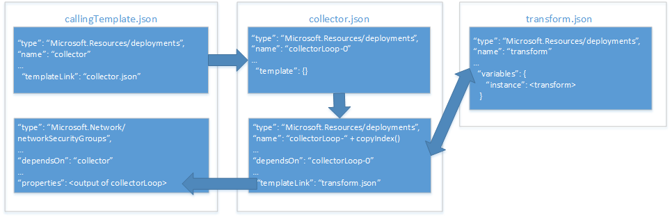

# <a name="implement-a-property-transformer-and-collector-in-an-azure-resource-manager-template"></a><span data-ttu-id="31651-103">Implémenter un transformateur et un collecteur de propriétés dans un modèle Azure Resource Manager</span><span class="sxs-lookup"><span data-stu-id="31651-103">Implement a property transformer and collector in an Azure Resource Manager template</span></span>

<span data-ttu-id="31651-104">Dans l’article [Utiliser un objet en tant que paramètre dans un modèle Azure Resource Manager][objects-as-parameters], vous avez découvert comment stocker des valeurs de propriété de ressource dans un objet et les appliquer à une ressource lors du déploiement.</span><span class="sxs-lookup"><span data-stu-id="31651-104">In [use an object as a parameter in an Azure Resource Manager template][objects-as-parameters], you learned how to store resource property values in an object and apply them to a resource during deployment.</span></span> <span data-ttu-id="31651-105">Bien que cette opération vous offre un moyen très utile de gérer vos paramètres, elle vous contraint toujours à mapper les propriétés de l’objet sur les propriétés de ressource chaque fois que vous utilisez cet objet dans votre modèle.</span><span class="sxs-lookup"><span data-stu-id="31651-105">While this is a very useful way to manage your parameters, it still requires you to map the object's properties to resource properties each time you use it in your template.</span></span>

<span data-ttu-id="31651-106">Pour contourner ce problème, vous pouvez implémenter un modèle de transformateur et de collecteur de propriétés qui itère votre tableau d’objets et le transforme en schéma JSON attendu par la ressource.</span><span class="sxs-lookup"><span data-stu-id="31651-106">To work around this, you can implement a property transform and collector template that iterates your object array and transforms it into the JSON schema expected by the resource.</span></span>

> [!IMPORTANT]
> <span data-ttu-id="31651-107">Pour utiliser cette approche, vous devez disposer d’une connaissance approfondie des modèles et fonctions Resource Manager.</span><span class="sxs-lookup"><span data-stu-id="31651-107">This approach requires that you have a deep understanding of Resource Manager templates and functions.</span></span>

<span data-ttu-id="31651-108">Examinons la façon dont nous pouvons implémenter un collecteur et un transformateur de propriétés à l’aide d’un exemple qui déploie un [Groupe de sécurité réseau (NSG)][nsg].</span><span class="sxs-lookup"><span data-stu-id="31651-108">Let's take a look at how we can implement a property collector and transformer with an example that deploys a [network security group (NSG)][nsg].</span></span> <span data-ttu-id="31651-109">Le diagramme ci-après illustre la relation entre nos modèles et nos ressources au sein de ces modèles :</span><span class="sxs-lookup"><span data-stu-id="31651-109">The diagram below shows the relationship between our templates and our resources within those templates:</span></span>



<span data-ttu-id="31651-111">Notre **modèle d’appel** inclut deux ressources :</span><span class="sxs-lookup"><span data-stu-id="31651-111">Our **calling template** includes two resources:</span></span>
* <span data-ttu-id="31651-112">un lien de modèle qui appelle notre **modèle de collecteur** ;</span><span class="sxs-lookup"><span data-stu-id="31651-112">a template link that invokes our **collector template**.</span></span>
* <span data-ttu-id="31651-113">la ressource NSG à déployer.</span><span class="sxs-lookup"><span data-stu-id="31651-113">the NSG resource to deploy.</span></span>

<span data-ttu-id="31651-114">Notre **modèle de collecteur** inclut deux ressources :</span><span class="sxs-lookup"><span data-stu-id="31651-114">Our **collector template** includes two resources:</span></span>
* <span data-ttu-id="31651-115">une ressource **ancre** ;</span><span class="sxs-lookup"><span data-stu-id="31651-115">an **anchor** resource.</span></span>
* <span data-ttu-id="31651-116">un lien de modèle qui appelle le modèle de transformateur dans une boucle de copie.</span><span class="sxs-lookup"><span data-stu-id="31651-116">a template link that invokes the transform template in a copy loop.</span></span>

<span data-ttu-id="31651-117">Notre **modèle de transformateur** ne comporte qu’une seule ressource : un modèle vide avec une variable qui transforme notre code JSON `source` en schéma JSON attendu par notre ressource NSG dans le **modèle principal**.</span><span class="sxs-lookup"><span data-stu-id="31651-117">Our **transform template** includes a single resource: an empty template with a variable that transforms our `source` JSON to the JSON schema expected by our NSG resource in the **main template**.</span></span>

## <a name="parameter-object"></a><span data-ttu-id="31651-118">Objet de paramètre</span><span class="sxs-lookup"><span data-stu-id="31651-118">Parameter object</span></span>

<span data-ttu-id="31651-119">Nous allons utiliser notre objet de paramètre `securityRules` mentionné dans l’article décrivant [l’utilisation d’un objet en tant que paramètre][objects-as-parameters].</span><span class="sxs-lookup"><span data-stu-id="31651-119">We'll be using our `securityRules` parameter object from [objects as parameters][objects-as-parameters].</span></span> <span data-ttu-id="31651-120">Notre **modèle de transformateur** transformera chaque objet du tableau `securityRules` en schéma JSON attendu par la ressource NSG dans notre **modèle d’appel**.</span><span class="sxs-lookup"><span data-stu-id="31651-120">Our **transform template** will transform each object in the `securityRules` array into the JSON schema expected by the NSG resource in our **calling template**.</span></span>

```json
{
    "$schema": "https://schema.management.azure.com/schemas/2015-01-01/deploymentParameters.json#",
    "contentVersion": "1.0.0.0",
    "parameters":{ 
      "networkSecurityGroupsSettings": {
      "value": {
          "securityRules": [
            {
              "name": "RDPAllow",
              "description": "allow RDP connections",
              "direction": "Inbound",
              "priority": 100,
              "sourceAddressPrefix": "*",
              "destinationAddressPrefix": "10.0.0.0/24",
              "sourcePortRange": "*",
              "destinationPortRange": "3389",
              "access": "Allow",
              "protocol": "Tcp"
            },
            {
              "name": "HTTPAllow",
              "description": "allow HTTP connections",
              "direction": "Inbound",
              "priority": 200,
              "sourceAddressPrefix": "*",
              "destinationAddressPrefix": "10.0.1.0/24",
              "sourcePortRange": "*",
              "destinationPortRange": "80",
              "access": "Allow",
              "protocol": "Tcp"
            }
          ]
        }
      }
    }
  }
```

<span data-ttu-id="31651-121">Commençons par examiner notre **modèle de transformateur**.</span><span class="sxs-lookup"><span data-stu-id="31651-121">Let's look at our **transform template** first.</span></span>

## <a name="transform-template"></a><span data-ttu-id="31651-122">Modèle de transformateur</span><span class="sxs-lookup"><span data-stu-id="31651-122">Transform template</span></span>

<span data-ttu-id="31651-123">Notre **modèle de transformateur** comporte deux paramètres qui sont transmis par le **modèle de collecteur** :</span><span class="sxs-lookup"><span data-stu-id="31651-123">Our **transform template** includes two parameters that are passed from the **collector template**:</span></span> 
* <span data-ttu-id="31651-124">`source` est un objet qui reçoit l’un des objets de valeur de propriété du tableau de propriétés.</span><span class="sxs-lookup"><span data-stu-id="31651-124">`source` is an object that receives one of the property value objects from the property array.</span></span> <span data-ttu-id="31651-125">Dans notre exemple, les différents objets du tableau `"securityRules"` sont transmis un par un.</span><span class="sxs-lookup"><span data-stu-id="31651-125">In our example, each object from the `"securityRules"` array will be passed in one at a time.</span></span>
* <span data-ttu-id="31651-126">`state` est un tableau qui reçoit les résultats concaténés de toutes les transformations précédentes.</span><span class="sxs-lookup"><span data-stu-id="31651-126">`state` is an array that receives the concatenated results of all the previous transforms.</span></span> <span data-ttu-id="31651-127">Il s’agit de la collection de code JSON transformé.</span><span class="sxs-lookup"><span data-stu-id="31651-127">This is the collection of transformed JSON.</span></span>

<span data-ttu-id="31651-128">Nos paramètres ressemblent à ceci :</span><span class="sxs-lookup"><span data-stu-id="31651-128">Our parameters look like this:</span></span>

```json
{
  "$schema": "https://schema.management.azure.com/schemas/2015-01-01/deploymentTemplate.json#",
  "contentVersion": "1.0.0.0",
  "parameters": {
    "source": { "type": "object" },
    "state": {
      "type": "array",
      "defaultValue": [ ]
    }
  },
```

<span data-ttu-id="31651-129">Notre modèle définit également une variable nommée `instance`.</span><span class="sxs-lookup"><span data-stu-id="31651-129">Our template also defines a variable named `instance`.</span></span> <span data-ttu-id="31651-130">Elle effectue la transformation proprement dite de notre objet `source` en schéma JSON requis :</span><span class="sxs-lookup"><span data-stu-id="31651-130">It performs the actual tranform of our `source` object into the required JSON schema:</span></span>

```json
  "variables": {
    "instance": [
      {
        "name": "[parameters('source').name]",
        "properties":{
            "description": "[parameters('source').description]",
            "protocol": "[parameters('source').protocol]",
            "sourcePortRange": "[parameters('source').sourcePortRange]",
            "destinationPortRange": "[parameters('source').destinationPortRange]",
            "sourceAddressPrefix": "[parameters('source').sourceAddressPrefix]",
            "destinationAddressPrefix": "[parameters('source').destinationAddressPrefix]",
            "access": "[parameters('source').access]",
            "priority": "[parameters('source').priority]",
            "direction": "[parameters('source').direction]"            
        }
      }
    ]

  },
```

<span data-ttu-id="31651-131">Enfin, l’élément `output` de notre modèle concatène les transformations collectées de notre paramètre `state` avec la transformation actuelle effectuée par notre variable `instance` :</span><span class="sxs-lookup"><span data-stu-id="31651-131">Finally, the `output` of our template concatenates the collected transforms of our `state` parameter with the current transform performed by our `instance` variable:</span></span>

```json
  "outputs": {
    "collection": {
      "type": "array",
      "value": "[concat(parameters('state'), variables('instance'))]"
    }
```

<span data-ttu-id="31651-132">À présent, examinons notre **modèle de collecteur** pour découvrir la façon dont il transmet nos valeurs de paramètre.</span><span class="sxs-lookup"><span data-stu-id="31651-132">Next, let's take a look at our **collector template** to see how it passes in our parameter values.</span></span>

## <a name="collector-template"></a><span data-ttu-id="31651-133">Modèle de collecteur</span><span class="sxs-lookup"><span data-stu-id="31651-133">Collector template</span></span>

<span data-ttu-id="31651-134">Notre **modèle de collecteur** comporte trois paramètres :</span><span class="sxs-lookup"><span data-stu-id="31651-134">Our **collector template** includes three parameters:</span></span>
* <span data-ttu-id="31651-135">`source` est notre tableau d’objets de paramètre complet.</span><span class="sxs-lookup"><span data-stu-id="31651-135">`source` is our complete parameter object array.</span></span> <span data-ttu-id="31651-136">Il est transmis par le **modèle d’appel**.</span><span class="sxs-lookup"><span data-stu-id="31651-136">It's passed in by the **calling template**.</span></span> <span data-ttu-id="31651-137">Il porte le même nom que le paramètre `source` dans notre **modèle de transformateur**, mais présente une différence essentielle avec ce dernier que vous avez peut-être déjà remarquée : il s’agit du tableau complet, mais nous ne transmettons au **modèle de transformateur** qu’un seul élément de ce tableau à la fois.</span><span class="sxs-lookup"><span data-stu-id="31651-137">This has the same name as the `source` parameter in our **transform template** but there is one key difference that you may have already noticed: this is the complete array, but we only pass one element of this array to the **transform template** at a time.</span></span>
* <span data-ttu-id="31651-138">`transformTemplateUri` est l’URI de notre **modèle de transformateur**.</span><span class="sxs-lookup"><span data-stu-id="31651-138">`transformTemplateUri` is the URI of our **transform template**.</span></span> <span data-ttu-id="31651-139">Nous le définissons ici sous la forme d’un paramètre pour permettre la réutilisation du modèle.</span><span class="sxs-lookup"><span data-stu-id="31651-139">We're defining it as a parameter here for template reusability.</span></span>
* <span data-ttu-id="31651-140">`state` est un tableau initialement vide que nous transmettons à notre **modèle de transformateur**.</span><span class="sxs-lookup"><span data-stu-id="31651-140">`state` is an initially empty array that we pass to our **transform template**.</span></span> <span data-ttu-id="31651-141">Il stocke la collection d’objets de paramètre transformés lorsque la boucle de copie est terminée.</span><span class="sxs-lookup"><span data-stu-id="31651-141">It stores the collection of transformed parameter objects when the copy loop is complete.</span></span>

<span data-ttu-id="31651-142">Nos paramètres ressemblent à ceci :</span><span class="sxs-lookup"><span data-stu-id="31651-142">Our parameters look like this:</span></span>

```json
  "parameters": {
    "source": { "type": "array" },
    "transformTemplateUri": { "type": "string" },
    "state": {
      "type": "array",
      "defaultValue": [ ]
    }
``` 

<span data-ttu-id="31651-143">Ensuite, nous définissons une variable nommée `count`.</span><span class="sxs-lookup"><span data-stu-id="31651-143">Next, we define a variable named `count`.</span></span> <span data-ttu-id="31651-144">Sa valeur correspond à la longueur du tableau d’objets de paramètre `source` :</span><span class="sxs-lookup"><span data-stu-id="31651-144">Its value is the length of the `source` parameter object array:</span></span>

```json
  "variables": {
    "count": "[length(parameters('source'))]"
  },
```

<span data-ttu-id="31651-145">Comme vous pouvez l’imaginer, nous l’utilisons pour le nombre d’itérations dans notre boucle de copie.</span><span class="sxs-lookup"><span data-stu-id="31651-145">As you might suspect, we use it for the number of iterations in our copy loop.</span></span>

<span data-ttu-id="31651-146">À présent, examinons nos ressources.</span><span class="sxs-lookup"><span data-stu-id="31651-146">Now let's take a look at our resources.</span></span> <span data-ttu-id="31651-147">Nous définissons deux ressources :</span><span class="sxs-lookup"><span data-stu-id="31651-147">We define two resources:</span></span>
* <span data-ttu-id="31651-148">`loop-0` est la ressource de base zéro pour notre boucle de copie.</span><span class="sxs-lookup"><span data-stu-id="31651-148">`loop-0` is the zero-based resource for our copy loop.</span></span>
* <span data-ttu-id="31651-149">`loop-` est concaténé avec le résultat de la fonction `copyIndex(1)` afin de générer pour notre ressource un nom unique basé sur l’itération, en commençant par `1`.</span><span class="sxs-lookup"><span data-stu-id="31651-149">`loop-` is concatenated with the result of the `copyIndex(1)` function to generate a unique iteration-based name for our resource, starting with `1`.</span></span>

<span data-ttu-id="31651-150">Nos ressources ressemblent à ceci :</span><span class="sxs-lookup"><span data-stu-id="31651-150">Our resources look like this:</span></span>

```json
  "resources": [
    {
      "type": "Microsoft.Resources/deployments",
      "apiVersion": "2015-01-01",
      "name": "loop-0",
      "properties": {
        "mode": "Incremental",
        "parameters": { },
        "template": {
          "$schema": "https://schema.management.azure.com/schemas/2015-01-01/deploymentTemplate.json#",
          "contentVersion": "1.0.0.0",
          "parameters": { },
          "variables": { },
          "resources": [ ],
          "outputs": {
            "collection": {
              "type": "array",
              "value": "[parameters('state')]"
            }
          }
        }
      }
    },
    {
      "type": "Microsoft.Resources/deployments",
      "apiVersion": "2015-01-01",
      "name": "[concat('loop-', copyindex(1))]",
      "copy": {
        "name": "iterator",
        "count": "[variables('count')]",
        "mode": "serial"
      },
      "dependsOn": [
        "loop-0"
      ],
      "properties": {
        "mode": "Incremental",
        "templateLink": { "uri": "[parameters('transformTemplateUri')]" },
        "parameters": {
          "source": { "value": "[parameters('source')[copyindex()]]" },
          "state": { "value": "[reference(concat('loop-', copyindex())).outputs.collection.value]" }
        }
      }
    }
  ],
```

<span data-ttu-id="31651-151">Examinons plus attentivement les paramètres que nous transmettons à notre **modèle de transformateur** dans le modèle imbriqué.</span><span class="sxs-lookup"><span data-stu-id="31651-151">Let's take a closer look at the parameters we're passing to our **transform template** in the nested template.</span></span> <span data-ttu-id="31651-152">Comme indiqué plus haut, notre paramètre `source` transmet l’objet actuel au tableau d’objets de paramètre `source`.</span><span class="sxs-lookup"><span data-stu-id="31651-152">Recall from earlier that our `source` parameter passes the current object in the `source` parameter object array.</span></span> <span data-ttu-id="31651-153">Le paramètre `state` indique l’endroit où apparaît la collection, car il utilise la sortie de l’itération précédente de notre boucle de copie &mdash; notez que la fonction `reference()` utilise la fonction `copyIndex()` sans aucun paramètre pour référencer l’élément `name` de notre objet de modèle précédemment lié &mdash;, puis transmet cette sortie à l’itération actuelle.</span><span class="sxs-lookup"><span data-stu-id="31651-153">The `state` parameter is where the collection happens, because it takes the output of the previous iteration of our copy loop&mdash;notice that the `reference()` function uses the `copyIndex()` function with no parameter to reference the `name` of our previous linked template object&mdash;and passes it to the current iteration.</span></span>

<span data-ttu-id="31651-154">Enfin, l’élément `output` de notre modèle renvoie l’élément `output` de la dernière itération de notre **modèle de transformateur** :</span><span class="sxs-lookup"><span data-stu-id="31651-154">Finally, the `output` of our template returns the `output` of the last iteration of our **transform template**:</span></span>

```json
  "outputs": {
    "result": {
      "type": "array",
      "value": "[reference(concat('loop-', variables('count'))).outputs.collection.value]"
    }
  }
```
<span data-ttu-id="31651-155">Il peut sembler illogique de renvoyer l’élément `output` de la dernière itération de notre **modèle de transformateur** à notre **modèle d’appel**, puisqu’il s’avère que nous l’avons stocké dans notre paramètre `source`.</span><span class="sxs-lookup"><span data-stu-id="31651-155">It may seem counterintuitive to return the `output` of the last iteration of our **transform template** to our **calling template** because it appeared we were storing it in our `source` parameter.</span></span> <span data-ttu-id="31651-156">Toutefois, n’oubliez pas qu’il s’agit de la dernière itération de notre **modèle de transformateur** qui stocke le tableau complet d’objets de propriété transformés, lequel correspond précisément à l’élément que nous souhaitons renvoyer.</span><span class="sxs-lookup"><span data-stu-id="31651-156">However, remember that it's the last iteration of our **transform template** that holds the complete array of transformed property objects, and that's what we want to return.</span></span>

<span data-ttu-id="31651-157">Enfin, examinons la façon dont nous pouvons appeler le **modèle de collecteur** à partir de notre **modèle d’appel**.</span><span class="sxs-lookup"><span data-stu-id="31651-157">Finally, let's take a look at how to call the **collector template** from our **calling template**.</span></span>

## <a name="calling-template"></a><span data-ttu-id="31651-158">Modèle d’appel</span><span class="sxs-lookup"><span data-stu-id="31651-158">Calling template</span></span>

<span data-ttu-id="31651-159">Notre **modèle d’appel** définit un paramètre unique nommé `networkSecurityGroupsSettings` :</span><span class="sxs-lookup"><span data-stu-id="31651-159">Our **calling template** defines a single parameter named `networkSecurityGroupsSettings`:</span></span>

```json
...
"parameters": {
    "networkSecurityGroupsSettings": {
        "type": "object"
    }
```

<span data-ttu-id="31651-160">Ensuite, notre modèle définit une seule variable nommée `collectorTemplateUri` :</span><span class="sxs-lookup"><span data-stu-id="31651-160">Next, our template defines a single variable named `collectorTemplateUri`:</span></span>

```json
"variables": {
    "collectorTemplateUri": "[uri(deployment().properties.templateLink.uri, 'collector.template.json')]"
  }
```

<span data-ttu-id="31651-161">Il s’agit évidemment de l’URI du **modèle de collecteur** qui sera utilisé par notre ressource de modèle lié :</span><span class="sxs-lookup"><span data-stu-id="31651-161">As you would expect, this is the URI for the **collector template** that will be used by our linked template resource:</span></span>

```json
{
    "apiVersion": "2015-01-01",
    "name": "collector",
    "type": "Microsoft.Resources/deployments",
    "properties": {
        "mode": "Incremental",
        "templateLink": {
            "uri": "[variables('linkedTemplateUri')]",
            "contentVersion": "1.0.0.0"
        },
        "parameters": {
            "source" : {"value": "[parameters('networkSecurityGroupsSettings').securityRules]"},
            "transformTemplateUri": { "value": "[uri(deployment().properties.templateLink.uri, 'transform.json')]"}
        }
    }
}
```

<span data-ttu-id="31651-162">Nous transmettons deux paramètres au **modèle de collecteur** :</span><span class="sxs-lookup"><span data-stu-id="31651-162">We pass two parameters to the **collector template**:</span></span>
* <span data-ttu-id="31651-163">`source` est notre tableau d’objets de propriété.</span><span class="sxs-lookup"><span data-stu-id="31651-163">`source` is our property object array.</span></span> <span data-ttu-id="31651-164">Dans notre exemple, il s’agit de notre paramètre `networkSecurityGroupsSettings`.</span><span class="sxs-lookup"><span data-stu-id="31651-164">In our example, it's our `networkSecurityGroupsSettings` parameter.</span></span>
* <span data-ttu-id="31651-165">`transformTemplateUri` est la variable que nous venons de définir avec l’URI de notre **modèle de collecteur**.</span><span class="sxs-lookup"><span data-stu-id="31651-165">`transformTemplateUri` is the variable we just defined with the URI of our **collector template**.</span></span>

<span data-ttu-id="31651-166">Enfin, notre ressource `Microsoft.Network/networkSecurityGroups` attribue directement l’élément `output` de la ressource de modèle lié `collector` à sa propriété `securityRules` :</span><span class="sxs-lookup"><span data-stu-id="31651-166">Finally, our `Microsoft.Network/networkSecurityGroups` resource directly assigns the `output` of the `collector` linked template resource to its `securityRules` property:</span></span>

```json
    {
      "apiVersion": "2015-06-15",
      "type": "Microsoft.Network/networkSecurityGroups",
      "name": "networkSecurityGroup1",
      "location": "[resourceGroup().location]",
      "properties": {
        "securityRules": "[reference('firstResource').outputs.result.value]"
      }
    }
  ],
  "outputs": {
      "instance":{
          "type": "array",
          "value": "[reference('firstResource').outputs.result.value]"
      }

  }
```

## <a name="next-steps"></a><span data-ttu-id="31651-167">Étapes suivantes</span><span class="sxs-lookup"><span data-stu-id="31651-167">Next steps</span></span>

* <span data-ttu-id="31651-168">Cette technique est implémentée dans le [projet de blocs de construction de modèle](https://github.com/mspnp/template-building-blocks) et dans les [architectures de référence Azure](/azure/architecture/reference-architectures/).</span><span class="sxs-lookup"><span data-stu-id="31651-168">This technique is implemented in the [template building blocks project](https://github.com/mspnp/template-building-blocks) and the [Azure reference architectures](/azure/architecture/reference-architectures/).</span></span> <span data-ttu-id="31651-169">Vous pouvez utiliser ces derniers pour créer votre propre architecture ou déployer l’une de nos architectures de référence.</span><span class="sxs-lookup"><span data-stu-id="31651-169">You can use these to create your own architecture or deploy one of our reference architectures.</span></span>

<!-- links -->
[objects-as-parameters]: ./objects-as-parameters.md
[resource-manager-linked-template]: /azure/azure-resource-manager/resource-group-linked-templates
[resource-manager-variables]: /azure/azure-resource-manager/resource-group-template-functions-deployment
[nsg]: /azure/virtual-network/virtual-networks-nsg
