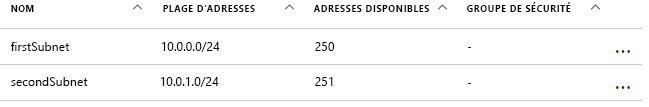
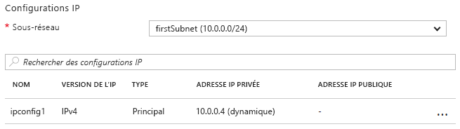

# <a name="update-a-resource-in-an-azure-resource-manager-template"></a>Mettre à jour une ressource dans un modèle Azure Resource Manager

Il existe certains scénarios dans lesquels vous devez mettre à jour une ressource pendant un déploiement. Vous pouvez rencontrer ce scénario lorsque vous ne pouvez pas spécifier toutes les propriétés d’une ressource jusqu’à ce que les autres ressources dépendantes aient été créées. Par exemple, si vous créez un pool principal pour un équilibrage de charge, vous pouvez mettre à jour les interfaces réseau (NIC) sur vos machines virtuelles pour les inclure dans le pool principal. Alors que Resource Manager prend en charge la mise à jour des ressources lors du déploiement, vous devez concevoir votre modèle correctement pour éviter les erreurs et garantir que le déploiement est traité comme une mise à jour.

Vous devez commencer par référencer la ressource une fois dans le modèle pour la créer, puis référencer la ressource à l’aide du même nom pour la mettre à jour ultérieurement. Toutefois, si deux ressources ont le même nom dans un modèle, Resource Manager lève une exception. Pour éviter cette erreur, spécifiez la ressource mise à jour dans un second modèle qui est lié ou inclus en tant que sous-modèle à l’aide du type de ressource `Microsoft.Resources/deployments`.

Ensuite, vous devez spécifier le nom de la propriété existante à modifier ou un nouveau nom de propriété à ajouter dans le modèle imbriqué. Vous devez également spécifier les propriétés initiales et leurs valeurs d’origine. Si vous ne fournissez pas les propriétés et valeurs d’origine, Resource Manager part du principe que vous souhaitez créer une nouvelle ressource et supprime la ressource initiale.

## <a name="example-template"></a>Exemple de modèle

Examinons un exemple de modèle illustrant cette approche. Notre modèle déploie un réseau virtuel nommé `firstVNet` qui comporte un sous-réseau appelé `firstSubnet`. Puis il déploie une interface de réseau virtuel nommée `nic1` et l’associe à notre sous-réseau. Ensuite, une ressource de déploiement nommée `updateVNet` inclut un modèle imbriqué qui met à jour notre ressource `firstVNet` en ajoutant un second sous-réseau appelé `secondSubnet`. 

```json
{
  "$schema": "https://schema.management.azure.com/schemas/2015-01-01/deploymentTemplate.json#",
  "contentVersion": "1.0.0.0",
  "parameters": {},
  "resources": [
      {
      "apiVersion": "2016-03-30",
      "name": "firstVNet",
      "location":"[resourceGroup().location]",
      "type": "Microsoft.Network/virtualNetworks",
      "properties": {
          "addressSpace":{"addressPrefixes": [
              "10.0.0.0/22"
          ]},
          "subnets":[              
              {
                  "name":"firstSubnet",
                  "properties":{
                    "addressPrefix":"10.0.0.0/24"
                  }
              }
            ]
      }
    },
    {
        "apiVersion": "2015-06-15",
        "type":"Microsoft.Network/networkInterfaces",
        "name":"nic1",
        "location":"[resourceGroup().location]",
        "dependsOn": [
            "firstVNet"
        ],
        "properties": {
            "ipConfigurations":[
                {
                    "name":"ipconfig1",
                    "properties": {
                        "privateIPAllocationMethod":"Dynamic",
                        "subnet": {
                            "id": "[concat(resourceId('Microsoft.Network/virtualNetworks','firstVNet'),'/subnets/firstSubnet')]"
                        }
                    }
                }
            ]
        }
    },
    {
      "apiVersion": "2015-01-01",
      "type": "Microsoft.Resources/deployments",
      "name": "updateVNet",
      "dependsOn": [
          "nic1"
      ],
      "properties": {
        "mode": "Incremental",
        "parameters": {},
        "template": {
          "$schema": "https://schema.management.azure.com/schemas/2015-01-01/deploymentTemplate.json#",
          "contentVersion": "1.0.0.0",
          "parameters": {},
          "variables": {},
          "resources": [
              {
                  "apiVersion": "2016-03-30",
                  "name": "firstVNet",
                  "location":"[resourceGroup().location]",
                  "type": "Microsoft.Network/virtualNetworks",
                  "properties": {
                      "addressSpace": "[reference('firstVNet').addressSpace]",
                      "subnets":[
                          {
                              "name":"[reference('firstVNet').subnets[0].name]",
                              "properties":{
                                  "addressPrefix":"[reference('firstVNet').subnets[0].properties.addressPrefix]"
                                  }
                          },
                          {
                              "name":"secondSubnet",
                              "properties":{
                                  "addressPrefix":"10.0.1.0/24"
                                  }
                          }
                     ]
                  }
              }
          ],
          "outputs": {}
          }
        }
    }
  ],
  "outputs": {}
}
```

Commençons par examiner l’objet de ressource relatif à notre ressource `firstVNet`. Notez que nous spécifions de nouveau les paramètres de notre ressource `firstVNet` dans un modèle imbriqué &mdash; étant donné que Resource Manager n’autorise pas l’utilisation du même nom de déploiement dans le même modèle et que les modèles imbriqués sont considérés comme des modèles distincts. En spécifiant une nouvelle fois nos valeurs pour notre ressource `firstSubnet`, nous indiquons à Resource Manager de mettre à jour la ressource existante au lieu de la supprimer et de la redéployer. Pour finir, nos nouveaux paramètres pour `secondSubnet` sont sélectionnés dans le cadre de cette mise à jour.

## <a name="try-the-template"></a>Essayer le modèle

Si vous souhaitez effectuer des tests avec ce modèle, procédez comme suit :

1.  Accédez au portail Azure, sélectionnez l’icône **+**, puis recherchez le type de ressource **déploiement de modèle** et sélectionnez-le.
2.  Accédez à la page **déploiement de modèle**, puis sélectionnez le bouton **créer**. Ce bouton ouvre le panneau **déploiement personnalisé**.
3.  Sélectionnez l’icône **éditer**.
4.  Supprimez le modèle vide.
5.  Copiez et collez l’exemple de modèle dans le volet de droite.
6.  Sélectionnez le bouton **enregistrer**.
7.  Vous revenez au volet **déploiement personnalisé**, mais cette fois-ci, certaines zones de liste déroulante apparaissent. Sélectionnez votre abonnement, créez un nouveau groupe de ressources ou utilisez un groupe de ressources existant, puis sélectionnez un emplacement. Passez en revue les Conditions générales, puis sélectionnez le bouton **J’accepte**.
8.  Sélectionnez le bouton **acheter**.

Une fois le déploiement terminé, ouvrez le groupe de ressources que vous avez spécifié dans le portail. Vous voyez un réseau virtuel nommé `firstVNet` et une interface de réseau virtuel appelée `nic1`. Cliquez sur `firstVNet`, puis sur `subnets`. Vous voyez `firstSubnet` qui a été créé à l’origine et vous voyez `secondSubnet` qui a été ajouté dans la ressource `updateVNet`. 



Ensuite, revenez au groupe de ressources, cliquez sur `nic1`, puis cliquez sur `IP configurations`. Dans la section `IP configurations`, `subnet` est défini sur `firstSubnet (10.0.0.0/24)`. 



Le `firstVNet` d’origine a été mis à jour au lieu d’être recréé. Si `firstVNet` avait été recréé, `nic1` ne serait pas être associé à `firstVNet`.

## <a name="next-steps"></a>Étapes suivantes

* Cette technique est implémentée dans le [projet de blocs de construction de modèle](https://github.com/mspnp/template-building-blocks) et dans les [architectures de référence Azure](/azure/architecture/reference-architectures/). Vous pouvez utiliser ces derniers pour créer votre propre architecture ou déployer l’une de nos architectures de référence.
