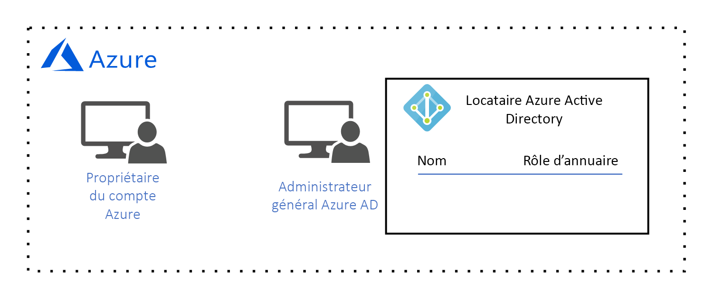

# Guide de conception de la gouvernance Azure

Ce guide de conception s’adresse au service *informatique central* de votre organisation. *Le service informatique central* est responsable de la conception et de l’implémentation de l’architecture de gouvernance cloud de votre organisation. Comme vous l’avez appris dans l’article explicatif [Qu’est-ce que la gouvernance cloud ?](governance-explainer.md), la gouvernance consiste à gérer, surveiller et contrôler en continu les ressources Azure afin d’atteindre les objectifs et de satisfaire aux exigences de votre organisation.

L’objectif de ce guide est de vous aider à découvrir le processus de conception de l’architecture de gouvernance de votre organisation en examinant un ensemble d’exigences et d’objectifs de gouvernance hypothétiques. Ensuite, nous expliquerons comment configurer les outils de gouvernance d’Azure pour y répondre. 

Dans la phase préparatoire à l’adoption, notre objectif est de déployer une charge de travail simple vers Azure. Il en résulte les exigences suivantes :
* Gestion des identités pour un seul **propriétaire de charge de travail** qui est responsable du déploiement et la gestion de la charge de travail simple. Le propriétaire de la charge de travail requiert une autorisation pour créer, lire, mettre à jour et supprimer des ressources, ainsi que pour déléguer ces droits à d’autres utilisateurs dans le système de gestion d’identité.
* Gérez toutes les ressources de la charge de travail simple en tant qu’unité de gestion unique.

## Gestion des licences Azure

Avant de commencer la conception du modèle de gouvernance, il est important de comprendre comment Azure est concédé sous licence. En effet, les comptes d’administration associés à votre licence Azure ont le plus haut niveau d’accès à toutes vos ressources Azure. Ces comptes d’administration constituent la base de votre modèle de gouvernance.  

> [!NOTE]
> Si votre organisation dispose déjà d’un [contrat entreprise Microsoft](https://www.microsoft.com/en-us/licensing/licensing-programs/enterprise.aspx) qui n’inclut pas Azure, Azure peut être ajouté en effectuant un engagement financier initial. Consultez les [licences Azure pour l’entreprise](https://azure.microsoft.com/pricing/enterprise-agreement/) pour plus d’informations. 

Lorsqu’Azure a ajouté un contrat Entreprise à votre organisation, cette dernière a été invitée à créer un **compte Azure**. Pendant le processus de création du compte, un **propriétaire de compte Azure** a été créé, ainsi qu’un locataire Azure Active Directory (Azure AD) avec un compte **d’administrateur général**. Un client Azure AD est une construction logique qui représente une instance d’Azure AD dédiée et sécurisée.

*Figure 1. Compte Azure avec responsable du compte et administrateur global Azure AD.*

## Gestion des identités

Azure utilise uniquement [Azure AD](/azure/active-directory) pour authentifier les utilisateurs et autoriser l’accès utilisateur aux ressources. Azure AD est donc notre système de gestion d’identité. L’administrateur général Azure AD a le plus haut niveau d’autorisations et peut effectuer toutes les actions liées à l’identité, y compris la création d’utilisateurs et l’attribution d’autorisations. 

Nous devons autoriser la gestion des identités pour un seul **propriétaire de charge de travail** qui est responsable du déploiement et la gestion de la charge de travail simple. Le propriétaire de la charge de travail requiert une autorisation pour créer, lire, mettre à jour et supprimer des ressources, ainsi que pour déléguer ces droits à d’autres utilisateurs dans le système de gestion d’identité.

Notre administrateur général Azure AD crée le compte du **propriétaire de la charge de travail** pour le **propriétaire de la charge de travail** :

*Figure 2. L’administrateur général Azure AD crée le compte d’utilisateur du propriétaire de la charge de travail.*

Nous ne serons en mesure d’assigner une autorisation d’accès aux ressources que lorsque cet utilisateur sera ajouté à un **abonnement**, c’est donc ce que nous allons faire dans les deux sections suivantes. 

## Étendue de la gestion des ressources

Étant donné que le nombre de ressources déployées par votre organisation augmente, la complexité de la gouvernance des ressources augmente également. Azure implémente une hiérarchie de conteneur logique pour permettre à votre organisation de gérer vos ressources dans des groupes à différents niveaux de granularité, également appelée **étendue**. 

Le niveau supérieur de l’étendue de gestion des ressources est le niveau **abonnement**. Un abonnement est créé par le **propriétaire du compte** Azure, qui établit l’engagement financier et est responsable du paiement de toutes les ressources Azure associées à l’abonnement :

*Figure 3. Le propriétaire de compte Azure crée un abonnement.*

Une fois l’abonnement créé, le **propriétaire du compte** Azure associe un client Azure AD à l’abonnement. Ce client Azure AD est utilisé pour authentifier et autoriser les utilisateurs :

*Figure 4. Le propriétaire du compte Azure associe le client Azure AD à l’abonnement.*

Vous avez peut-être remarqué qu’il n’y a actuellement aucun utilisateur associé à l’abonnement, ce qui signifie que personne n’est autorisé à gérer les ressources. En réalité, le **propriétaire du compte** est le propriétaire de l’abonnement et a l’autorisation d’agir sur une ressource dans l’abonnement. Toutefois, en pratique, le **propriétaire du compte** est probablement une personne de finances dans votre organisation et n’est pas responsable de la création, lecture, mise à jour et suppression de ressources. Ces tâches seront effectuées par le **propriétaire de la charge de travail**. Par conséquent, nous devons ajouter le **propriétaire de la charge de travail** à l’abonnement et lui attribuer des autorisations.

Dans la mesure où le **propriétaire du compte** est actuellement le seul utilisateur autorisé à ajouter le **propriétaire de la charge de travail** à l’abonnement, il doit ajouter le **propriétaire de la charge de travail** à l’abonnement :

*Figure 5. Le propriétaire du compte Azure ajoute le propriétaire de la charge de travail à l’abonnement.*

Le **propriétaire du compte** Azure accorde des autorisations au **propriétaire de la charge de travail** en assignant un rôle de [Contrôle d’accès en fonction du rôle (RBAC)](/azure/role-based-access-control/). Le rôle RBAC spécifie un ensemble d’autorisations dont le **propriétaire de la charge de travail** dispose comme type de ressource individuelle ou ensemble de types de ressources.

Notez que dans cet exemple, le **propriétaire du compte** a attribué le [rôle de **propriétaire** intégré](/azure/role-based-access-control/built-in-roles#owner) : 

*Figure 6. Le rôle de propriétaire intégré a été attribué au propriétaire de la charge de travail.*

Le rôle de **propriétaire** intégré accorde toutes les autorisations au **propriétaire de la charge de travail** pour l’étendue d’abonnement. 

> [!IMPORTANT]
> Le **propriétaire de compte** Azure est responsable de l’engagement financier associé à l’abonnement, mais le **propriétaire de la charge de travail** dispose des mêmes autorisations. Le **propriétaire du compte** doit approuver le **propriétaire de la charge de travail** pour déployer des ressources comprises dans le budget de l’abonnement.

Le niveau suivant de l’étendue de la gestion est le niveau **groupe de ressources**. Un groupe de ressources est un conteneur logique pour ressources. Les opérations appliquées au niveau du groupe de ressources s’appliquent à toutes les ressources d’un groupe. En outre, il est important de noter que les autorisations pour chaque utilisateur sont héritées du niveau supérieur suivant, sauf si elles sont explicitement modifiées dans cette portée. 

Pour illustrer ceci, nous allons examiner ce qui se passe lorsque le **propriétaire de la charge de travail** crée un groupe de ressources :

*Figure 7. Le propriétaire de la charge de travail crée un groupe de ressources et hérite du rôle de propriétaire intégré pour l’étendue du groupe de ressources.*

Là encore, le rôle de **propriétaire** intégré accorde toutes les autorisations au **propriétaire de la charge de travail** pour l’étendue du groupe de ressources. Comme indiqué précédemment, ce rôle est hérité du niveau d’abonnement. Si un rôle différent est attribué à cet utilisateur dans cette étendue, il s’applique à cette étendue uniquement.

Le niveau le plus bas de l’étendue de la gestion est le niveau **ressource**. Les opérations appliquées au niveau de la ressource s’appliquent uniquement à la ressource elle-même. Et là encore, les autorisations au niveau de la ressource sont héritées à partir de l’étendue du groupe de ressources. Par exemple, nous allons examiner ce qui se passe si le **propriétaire de la charge de travail** déploie un [réseau virtuel](/azure/virtual-network/virtual-networks-overview) dans le groupe de ressources :

*Figure 8. Le propriétaire de la charge de travail crée une ressource et hérite du rôle de propriétaire intégré pour l’étendue de la ressource.*

Le **propriétaire de la charge de travail** hérite du rôle de propriétaire au niveau de l’étendue d’une ressource, ce qui signifie que le propriétaire de la charge de travail dispose de toutes les autorisations pour le réseau virtuel. 

## Résumé

Dans cet article, vous avez appris :

* Azure utilise uniquement Azure AD pour la gestion des identités.
* Un abonnement a l’étendue la plus élevée de gestion des ressources, et chaque abonnement est associé à un client Azure AD. Seuls les utilisateurs du client Azure AD associé peuvent accéder aux ressources de l’abonnement.
* Il existe trois niveaux d’étendue de gestion des ressources : l’abonnement, le groupe de ressources et les ressources. Les autorisations sont affectées à chaque étendue à l’aide des rôles RBAC. Les rôles RBAC sont hérités à partir d’une étendue plus élevée vers une étendue inférieure.

## Étapes suivantes

Revenez à la [Vue d’ensemble des notions fondamentales de la phase d’adoption](overview.md) pour découvrir comment implémenter ce modèle de gouvernance. Ensuite, sélectionnez un type de charge de travail et découvrez comment le déployer.