# Guide de conception de la gouvernance : nouveau développement dans Azure pour plusieurs équipes

Ce guide a pour but de vous aider à comprendre comment concevoir un modèle de gouvernance des ressources dans Azure.  Nous allons passer en revue plusieurs exigences de gouvernance hypothétiques, puis étudier plusieurs exemples d’implémentation qui répondent à ces exigences. 

Les exigences sont multiples :
* Gestion des identités pour plusieurs équipes ayant besoin de différents niveaux d’accès aux ressources dans Azure. Le système de gestion des identités stocke l’identité des utilisateurs suivants :
  1. La personne de notre organisation qui détient la propriété des **abonnements**.
  2. La personne de notre organisation responsable des **ressources d’infrastructure partagée** utilisées pour connecter notre réseau local à un réseau virtuel Azure. 
  3. Deux personnes de notre organisation responsables de la gestion d’une **charge de travail**. 
* Prise en charge de plusieurs **environnements**. Comme expliqué précédemment, un environnement est un regroupement logique de ressources ayant des exigences de sécurité et de gestion similaires. Nous avons besoin de trois environnements :
  1. Un **environnement d’infrastructure partagée** qui inclut les ressources partagées par des charges de travail d’autres environnements. Par exemple, un réseau virtuel ayant un sous-réseau de passerelle qui assure la connectivité au niveau local.
  2. Un **environnement de production** associé aux stratégies de sécurité les plus restrictives. Peut inclure des charges de travail internes ou externes.
  3. Un **environnement de développement** pour les tâches de démonstration et de test. Cet environnement comporte des stratégies de sécurité, de conformité et de coût qui diffèrent de celles de l’environnement de production.
* Un **modèle d’autorisations de privilège minimal** dans lequel les utilisateurs ne disposent d’aucune autorisation par défaut. Le modèle doit prendre en charge les éléments suivants :
  * Un seul utilisateur approuvé dans l’étendue de l’abonnement, qui dispose de l’autorisation d’attribuer des droits d’accès aux ressources.
  * Chaque propriétaire de charge de travail se voit refuser l’accès aux ressources par défaut. Les droits d’accès aux ressources sont accordés explicitement par le seul utilisateur approuvé dans l’étendue de l’abonnement.
  * Accès à la gestion des ressources d’infrastructure partagée limité au propriétaire de l’infrastructure partagée.  
  * Accès à la gestion de chaque charge de travail limité au propriétaire de la charge de travail.
  * Utilisation de [rôles RBAC intégrés][rbac-built-in-roles] uniquement. Aucun rôle RBAC personnalisé.
* Suivi des coûts par nom de propriétaire de la charge de travail et/ou par environnement. 

## Gestion des identités

Avant de concevoir la gestion des identités pour notre modèle de gouvernance, il est important de comprendre les quatre aspects majeurs que cela englobe :

* Administration : processus et outils de création, de modification et de suppression des identités d’utilisateur.
* Authentification : vérification de l’identité de l’utilisateur par validation des informations d’identification (par exemple, nom d’utilisateur et mot de passe).
* Autorisation : identification des ressources auxquelles un utilisateur authentifié est autorisé à accéder ou des opérations qu’ils sont autorisés à effectuer.
* Audit : examen régulier des journaux et autres informations dans le but de détecter les problèmes de sécurité liés à l’identité de l’utilisateur. Ceci inclut la vérification des modèles d’utilisation suspects, la révision régulière des autorisations utilisateur pour en vérifier l’exactitude, ainsi que d’autres fonctions.

Azure Active Directory (AD) est le seul service d’identité approuvé par Azure. Nous allons ajouter des utilisateurs à Azure AD et l’utiliser pour toutes les fonctions répertoriées ci-dessus. Mais avant de voir comment nous allons configurer Azure AD, il est important de comprendre les comptes privilégiés qui sont utilisés pour gérer l’accès à ces services.

Lorsque votre organisation a souscrit un compte Azure, au moins un **propriétaire de compte** Azure a été affecté et un **locataire** Azure AD a été créé (sauf si un client Azure AD avait déjà été associé à l’utilisation d’autres services Microsoft, tels qu’Office 365, par votre organisation). Un **administrateur global** disposant de toutes les autorisations sur le locataire Azure AD a été associé au moment de sa création. 

Les identités utilisateur du propriétaire du compte Azure et de l’administrateur global Azure AD sont stockées dans un système d’identité hautement sécurisé géré par Microsoft. Le propriétaire du compte Azure est autorisé à créer, mettre à jour et supprimer des abonnements. Bien que l’administrateur global Azure AD soit autorisé à effectuer de nombreuses actions dans Azure AD, nous allons ici nous concentrer uniquement sur la création et la suppression d’identités d’utilisateur. 

> [!NOTE]
> Votre organisation possède peut-être déjà un locataire Azure AD si une licence Office 365 ou Intune est associée à votre compte.

Le propriétaire du compte Azure possède l’autorisation de créer, mettre à jour et supprimer des abonnements : 

*Figure 1. Compte Azure avec responsable du compte et administrateur global Azure AD.*

**L’administrateur global** Azure AD est autorisé à créer des comptes d’utilisateur :  

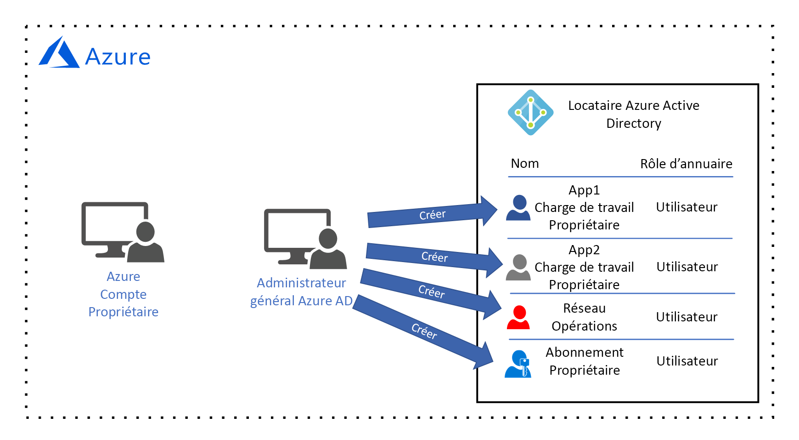
*Figure 2. L’administrateur global Azure AD crée les comptes d’utilisateur nécessaires dans le locataire.*

Les deux premiers comptes **Propriétaire de la charge de travail App1** et **Propriétaire de la charge de travail App2** sont associés à une personne de notre organisation responsable de la gestion d’une charge de travail. Le compte **Opérations réseau** est détenu par la personne responsable des ressources d’infrastructure partagée. Enfin, le compte **Propriétaire de l’abonnement** est associé à la personne responsable de la propriété des abonnements.

## Modèle d’autorisations d’accès aux ressources de privilège minimal

Maintenant que nous avons créé notre système de gestion des identités et nos comptes d’utilisateur, nous avons déterminer de quelle manière nous allons appliquer les rôles RBAC (contrôle d’accès basé sur des rôles) à chaque compte pour prendre en charge un modèle d’autorisations de privilège minimal.

Nous avons également besoin que les ressources associées à chaque charge de travail soient isolées les unes des autres, de sorte qu’aucun propriétaire d’une charge de travail donnée ne puisse disposer d’un accès administratif à toute autre charge de travail dont il n’est pas propriétaire. Nous devons par ailleurs implémenter ce modèle en utilisant uniquement des [rôles intégrés pour RBAC Azure][rbac-built-in-roles].

Chaque rôle RBAC est appliqué à l’une des trois étendues suivantes dans Azure : **abonnement**, **groupe de ressources** et **ressource** individuelle. Les rôles sont hérités à des étendues inférieures. Par exemple, si un utilisateur se voit attribuer le [rôle de propriétaire intégré][rbac-built-in-owner] au niveau de l’abonnement, ce rôle est également attribué à cet utilisateur aux niveaux du groupe de ressources et des ressources individuelles, sauf s’il est remplacé.

Par conséquent, pour créer un modèle d’accès de privilège minimal, nous devons déterminer quelles actions un type d’utilisateur en particulier est autorisé à effectuer à chacune de ces trois étendues. Imaginons par exemple que nous devons autoriser un propriétaire d’une charge de travail à gérer l’accès aux seules ressources associées à sa charge de travail, à l’exclusion de toute autre. Si nous devions affecter le [rôle de propriétaire intégré][rbac-built-in-owner] au niveau de l’abonnement, chaque propriétaire d’une charge de travail aurait accès à toutes les charges de travail.

Jetons un œil à deux exemples de modèles d’autorisation pour mieux comprendre ce concept. Dans le premier exemple, notre modèle fait confiance uniquement à l’administrateur de service pour créer des groupes de ressources. Dans le deuxième exemple, notre modèle affecte le rôle de propriétaire intégré à chaque propriétaire d’une charge de travail dans l’étendue de l’abonnement. 

Dans les deux exemples, un administrateur de services fédérés d’abonnement se voit attribuer le [rôle de propriétaire intégré][rbac-built-in-owner] dans l’étendue de l’abonnement. N’oubliez pas que le [rôle de propriétaire intégré][rbac-built-in-owner] accorde toutes les autorisations, y compris la gestion de l’accès aux ressources.
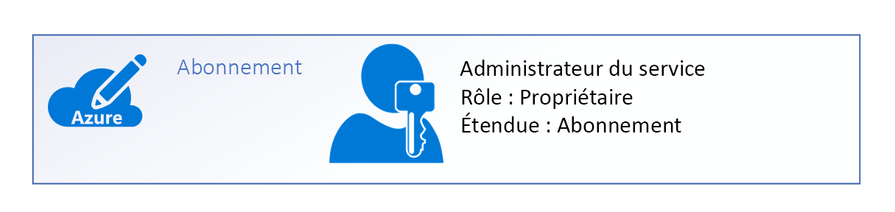
*Figure 3. Abonnement dans lequel un administrateur de services fédérés se voit attribuer le rôle de propriétaire intégré.* 

1. Dans notre premier exemple, nous avons **le propriétaire de la charge de travail A** qui ne possède aucune autorisation au niveau de l’étendue de l’abonnement ; il ne possède donc par défaut aucun droit de gestion des accès aux ressources. Cet utilisateur souhaite déployer et gérer les ressources de sa charge de travail. Il doit contacter **l’administrateur de services fédérés** pour demander la création d’un groupe de ressources.
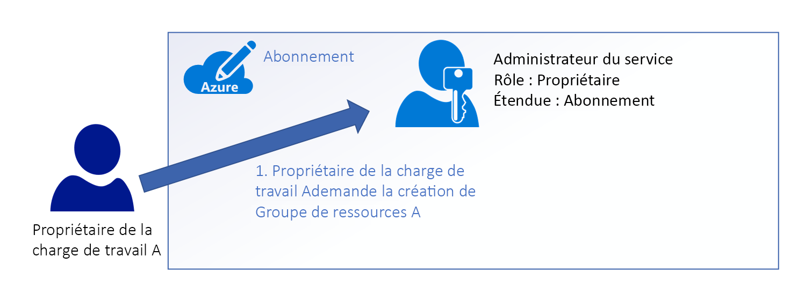  

2. **L’administrateur de services fédérés** passe en revue la demande et crée le **groupe de ressources A**. À ce stade, le **propriétaire de la charge de travail A** n’est toujours pas autorisé à faire quoi que ce soit.
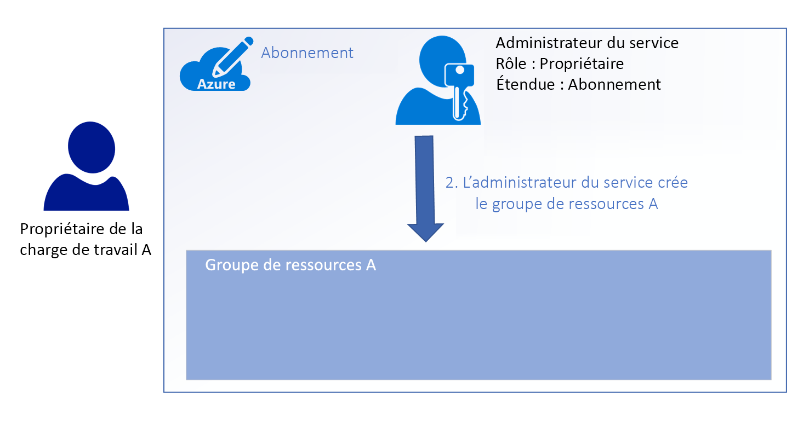

3. **L’administrateur de services fédérés** ajoute le **propriétaire de la charge de travail A** au **groupe de ressources A** et lui affecte le [rôle de contributeur intégré](/azure/role-based-access-control/built-in-roles#contributor). Le rôle de contributeur accorde toutes les autorisations sur le **groupe de ressources A**, à l’exception de la gestion des autorisations d’accès.
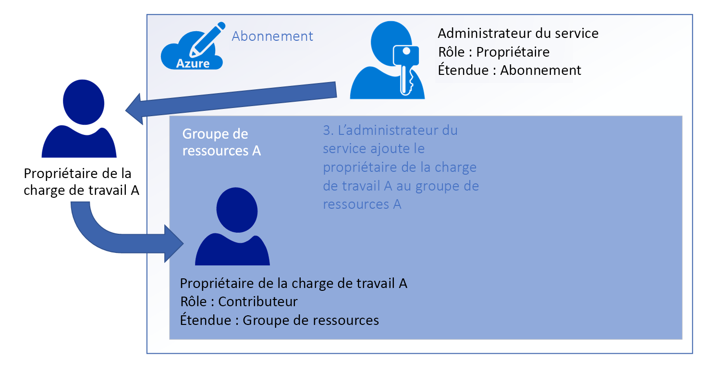

4. Supposons que le **propriétaire de la charge de travail A** ait besoin que deux membres de l’équipe puissent visualiser les données d’analyse de l’UC et du trafic réseau afin de planifier les capacités pour la charge de travail. Étant donné que le **propriétaire de la charge de travail A** dispose du rôle de contributeur, il n’est pas autorisé à ajouter un utilisateur au **groupe de ressources A**. Il doit en fait la demande à **l’administrateur de services fédérés**.
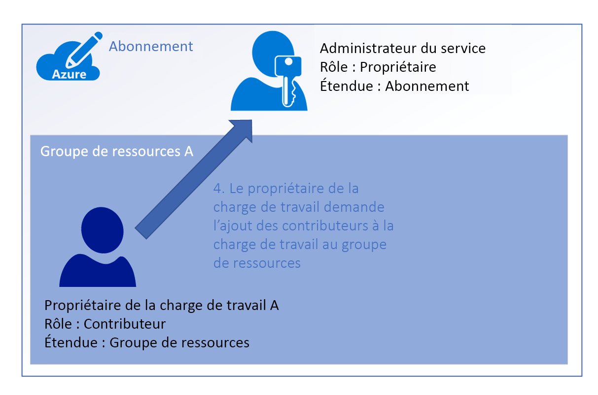

5. **L’administrateur de services fédérés** examine la demande et ajoute les deux **contributeurs de la charge de travail** au **groupe de ressources A**. Aucun de ces deux utilisateurs n’ayant besoin de l’autorisation de gérer les ressources, le [rôle de lecteur intégré](/azure/role-based-access-control/built-in-roles#contributor) leur est attribué. 
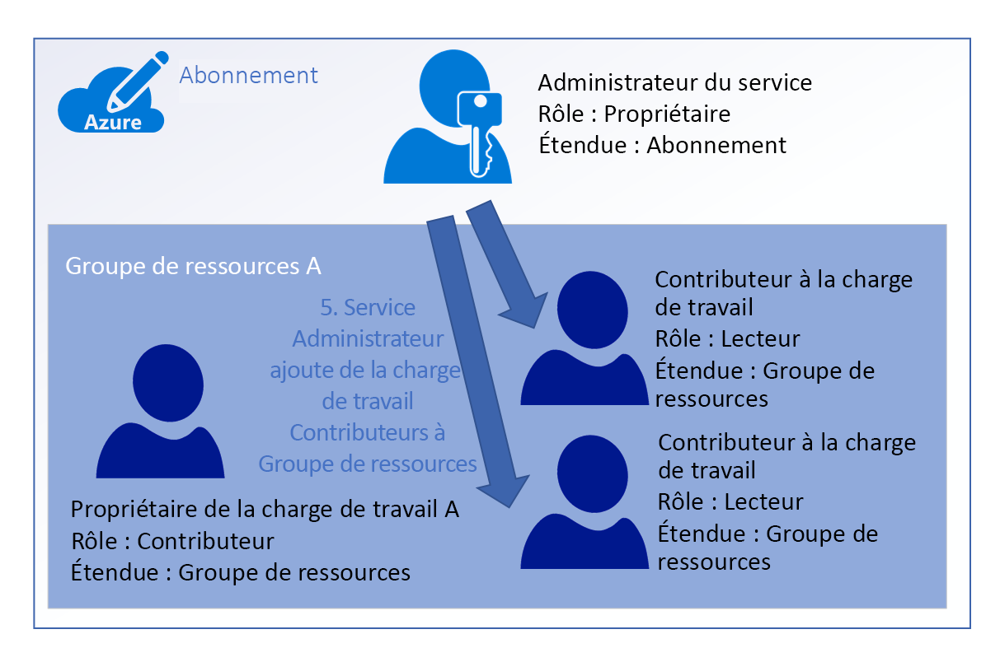

6. Le **propriétaire de la charge de travail B** a également besoin d’un groupe de ressources auquel rattacher les ressources de sa charge de travail. Comme pour le **propriétaire de la charge de travail A**, le **propriétaire de la charge de travail B** ne dispose au départ d’aucune autorisation d’exécuter une action dans l’étendue de l’abonnement. Il doit donc envoyer une demande à **l’administrateur de services fédérés**. 
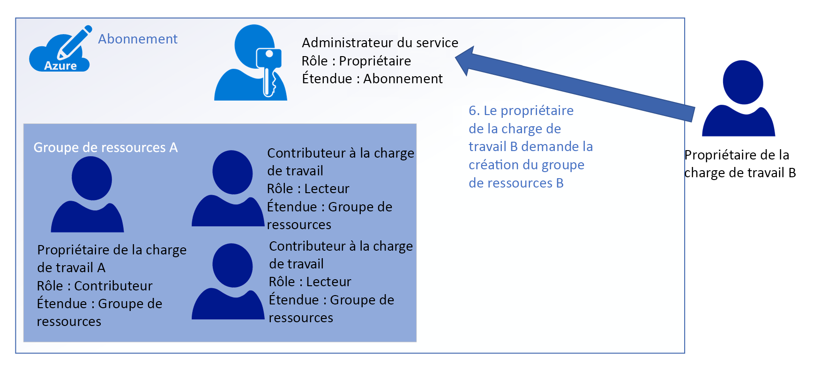

7. **L’administrateur de services fédérés** passe en revue la demande et crée le **groupe de ressources B**. 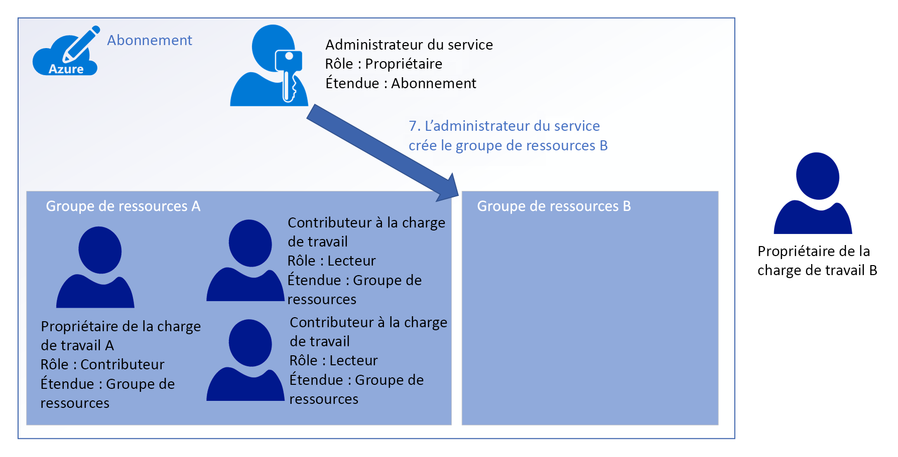

8. **L’administrateur de services fédérés** ajoute alors le **propriétaire de la charge de travail B** au **groupe de ressources B** et lui affecte le [rôle de contributeur intégré](https://docs.microsoft.com/en-us/azure/role-based-access-control/built-in-roles#contributor). 
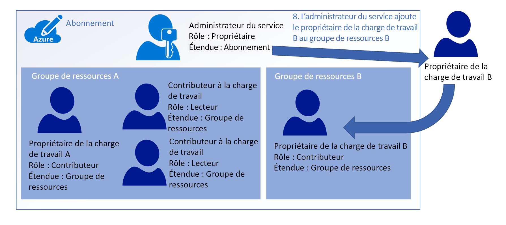

À ce stade, chacun des propriétaires de charges de travail est isolé dans son propre groupe de ressources. Ni les propriétaires de charges de travail ni les membres de leur équipe ne disposent d’un accès administratif aux ressources d’un autre groupe de ressources. 

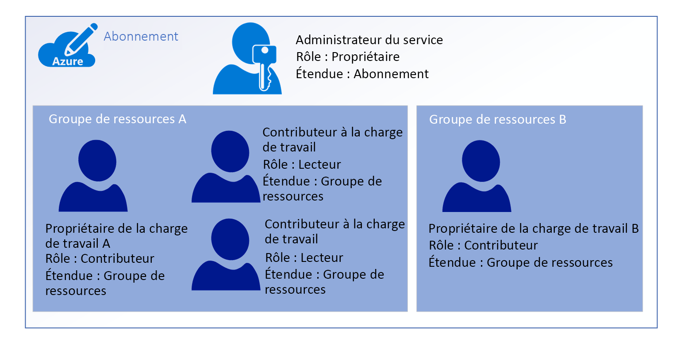
*Figure 4. Abonnement avec deux propriétaires de charges de travail isolés dans leur propre groupe de ressources.*

Ce modèle est un modèle de privilège minimal, autrement dit chaque utilisateur se voit attribuer l’autorisation adéquate dans l’étendue de gestion des ressources qui le concerne.

Mais, comme vous le voyez, chaque tâche décrite dans cet exemple a été effectuée par **l’administrateur de services fédérés**. Bien qu’il s’agisse d’un exemple simplifié qui ne pose en apparence aucun problème étant donné qu’il n’y a que deux propriétaires de charges de travail, il est facile d’imaginer les types de problèmes que cela pourrait occasionner dans une organisation de grande envergure. Par exemple, **l’administrateur de services fédérés** peut devenir un goulot d’étranglement, voir s’accumuler les demandes en souffrance et entraîner des retards.  

Examinons un deuxième exemple qui réduit le nombre de tâches confiées à **l’administrateur de services fédérés**. 

1. Dans ce modèle, le **propriétaire de la charge de travail A** dispose du [rôle de propriétaire intégré][rbac-built-in-owner] dans l’étendue de l’abonnement, ce qui lui permet de créer son propre groupe de ressources, le **groupe de ressources A**. 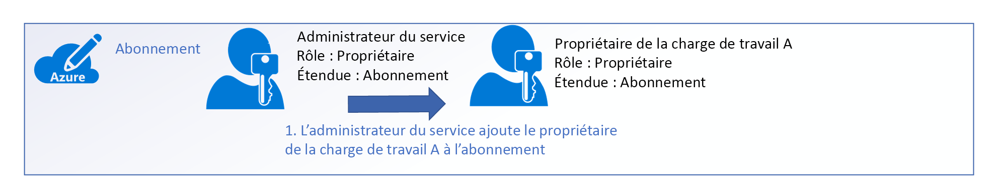

2. Une fois le **groupe de ressources A** créé, le **propriétaire de la charge de travail A** est ajouté par défaut et hérite du [rôle de propriétaire intégré][rbac-built-in-owner] à partir de l’étendue de l’abonnement.
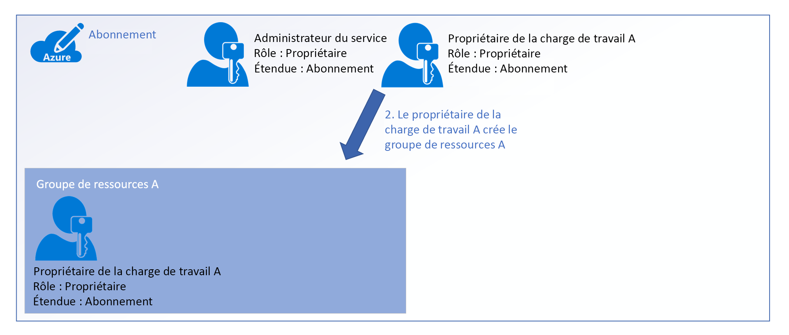

3. Le [rôle de propriétaire intégré][rbac-built-in-owner] accorde au **propriétaire de la charge de travail A** l’autorisation de gérer l’accès au groupe de ressources. Le **propriétaire de la charge de travail A** ajoute deux **contributeurs de la charge de travail** et attribue à chacun d’eux le [rôle de lecteur intégré][rbac-built-in-owner]. 
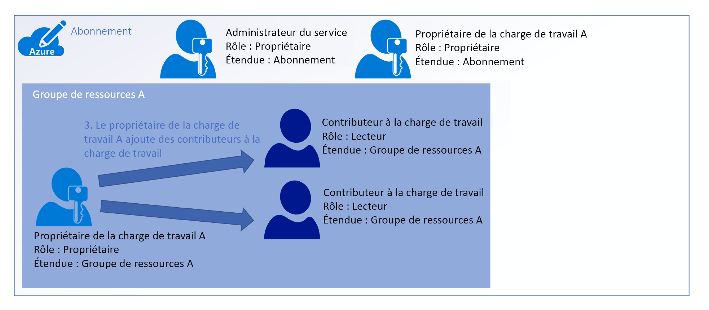

4. **L’administrateur de services fédérés** ajoute à présent le **propriétaire de la charge de travail B** à l’abonnement en lui attribuant le rôle de propriétaire intégré. 
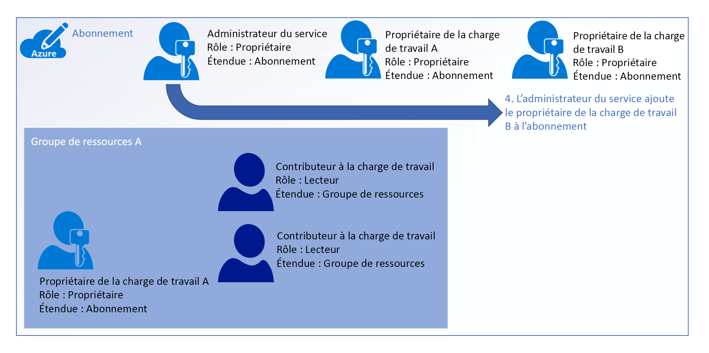

5. Le **propriétaire de la charge de travail B** crée le **groupe de ressources B** et est ajouté par défaut. Là encore, le **propriétaire de la charge de travail B** hérite du rôle de propriétaire intégré de l’étendue de l’abonnement.
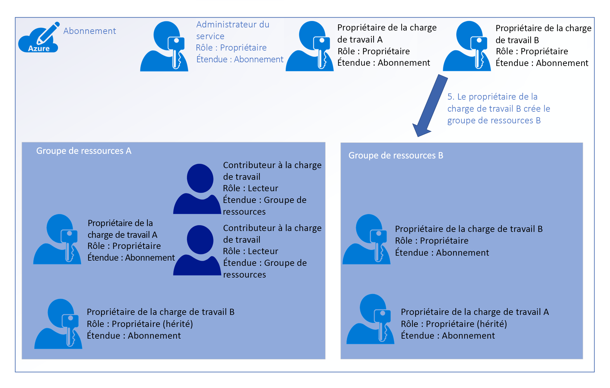

Notez que dans ce modèle, **l’administrateur de services fédérés** est moins intervenu que dans le premier exemple car l’accès administratif a été délégué à chaque propriétaire de la charge de travail.

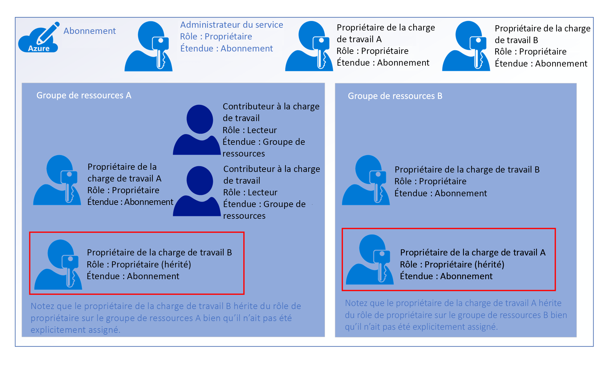
*Figure 5. Abonnement dans lequel un administrateur de services fédérés et deux propriétaires de charges de travail se voient attribuer le rôle de propriétaire intégré.*

Toutefois, étant donné que le **propriétaire de la charge de travail A** et le **propriétaire de la charge de travail B** se sont vu attribuer le rôle de propriétaire intégré dans l’étendue de l’abonnement, chacun d’eux a hérité du rôle de propriétaire intégré pour le groupe de ressources de l’autre. Cela signifie que non seulement chaque propriétaire dispose d’un accès complet aux ressources de l’autre, mais qu’il a également la possibilité de déléguer l’accès administratif aux groupes de ressources de l’autre. Par exemple, le **propriétaire de la charge de travail B** a le droit d’ajouter n’importe quel autre utilisateur au **groupe de ressources A** et peut lui attribuer le rôle de son choix, y compris le rôle de propriétaire intégré.

Si nous comparons chaque exemple à nos propres exigences, nous voyons que les deux exemples prennent en charge un seul utilisateur approuvé dans l’étendue de l’abonnement, lequel dispose de l’autorisation d’accorder des droits d’accès aux ressources à nos deux propriétaires de charges de travail. Aucun des deux propriétaires de charges de travail ne disposait par défaut d’un accès à la gestion des ressources et devait demander à **l’administrateur de services fédérés** de lui attribuer explicitement les autorisations nécessaires. En revanche, seul le premier exemple répond à notre besoin d’isoler les ressources associées à chaque charge de travail, de telle sorte qu’aucun propriétaire d’une charge de travail n’ait accès aux ressources d’une autre charge de travail.

## Modèle de gestion des ressources

Maintenant que nous avons conçu un modèle d’autorisations de privilège minimal, voyons quelques exemples pratiques d’utilisation de ces modèles de gouvernance. Souvenez-vous que nous devons prendre en charge les trois environnements suivants :
1. **Infrastructure partagée :** un seul groupe de ressources partagé par toutes les charges de travail. Il s’agit par exemple des passerelles de réseau, des pare-feu et des services de sécurité.  
2. **Développement :** plusieurs groupes de ressources représentant plusieurs charges de travail prêtes hors production. Ces ressources sont utilisées pour des tâches de démonstration ou de test et d’autres activités de développement. Ces ressources peuvent avoir un modèle de gouvernance plus souple pour renforcer l’agilité des développeurs.
3. **Production :** plusieurs groupes de ressources représentant plusieurs charges de travail de production. Ces ressources sont utilisées pour héberger les artefacts d’application privés et publics. Ces ressources sont généralement adossées à des modèles de gouvernance et de sécurité plus stricts afin de protéger les ressources, le code d’application et les données contre tout accès non autorisé.

Pour chacun de ces trois environnements, nous avons besoin de suivre les données de coût par **propriétaire de charge de travail** et/ou par **environnement**. Autrement dit, nous souhaitons connaître le coût récurrent de notre **infrastructure partagée**, les frais engagés par les personnes intervenant à la fois dans les environnements de **développement** et de **production**, ainsi que le coût global de **développement** et de **production**. 

Vous savez déjà que les ressources sont limitées à deux niveaux : **abonnement** et **groupe de ressources**. Nous devons donc d’abord déterminer de quelle manière organiser nos environnements par **abonnement**. Il existe deux possibilités : un abonnement unique ou plusieurs abonnements. 

Avant d’examiner des exemples de chacun de ces modèles, passons en revue la structure de gestion des abonnements dans Azure. 

À titre de rappel, une personne de notre organisation est responsable des abonnements et cet utilisateur possède le compte **Propriétaire de l’abonnement** dans notre locataire Azure AD. Ce compte n’est cependant pas autorisé à créer des abonnements. Seul le **Propriétaire du compte Azure** a l’autorisation de le faire : 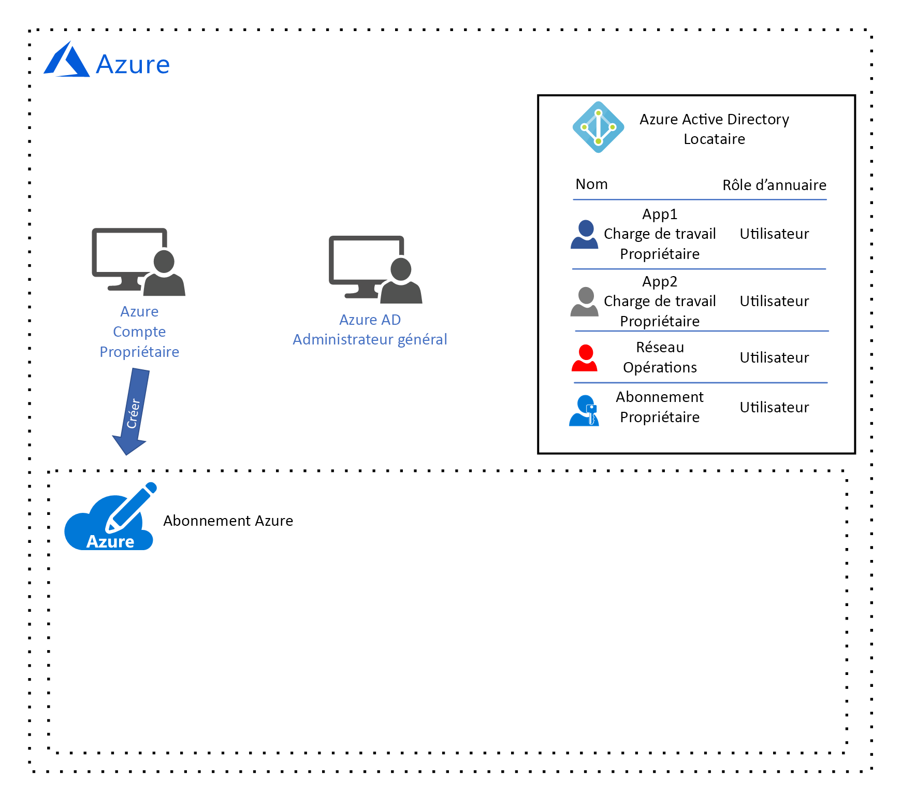
*Figure 6. Un propriétaire de compte Azure crée un abonnement.*

Une fois l’abonnement créé, le **Propriétaire du compte Azure** peut ajouter le compte **Propriétaire de l’abonnement** à l’abonnement en lui attribuant le rôle de **propriétaire** :

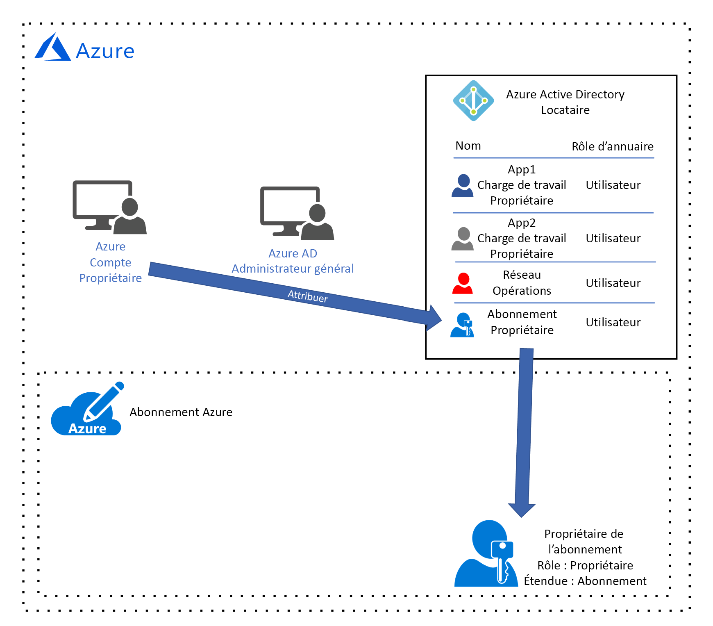
*Figure 7. Le propriétaire du compte Azure ajoute le compte d’utilisateur **Propriétaire de l’abonnement** à l’abonnement en lui attribuant le rôle de **propriétaire**.*

Le **Propriétaire de l’abonnement** peut à présent créer des **groupes de ressources** et déléguer la gestion des accès aux ressources.

Voyons tout d’abord un exemple de modèle de gestion des ressources utilisant un seul abonnement. Nous devons commencer par aligner les groupes de ressources sur les trois environnements. Deux solutions s’offrent à nous :
1. Aligner chaque environnement sur un seul groupe de ressources. Toutes les ressources de l’infrastructure partagée sont déployées sur un seul groupe de ressources de **l’infrastructure partagée**. Toutes les ressources associées aux charges de travail de développement sont déployées sur un seul groupe de ressources de **développement**. Toutes les ressources associées aux charges de travail de production sont déployées dans un seul groupe de ressources de **production** pour l’environnement de **production**. 
2. Aligner les charges de travail sur un groupe de ressources distinct, en utilisant une convention d’affectation de noms et des balises pour aligner les groupes de ressources sur chacun des trois environnements.  

Commençons par examiner la première option. Nous allons utiliser le modèle d’autorisations dont il a été question dans la section précédente, avec un seul administrateur de services fédérés d’abonnement qui crée des groupes de ressources et y ajoute des utilisateurs disposant du rôle de **contributeur** ou de **lecteur** intégré. 

1. Le premier groupe de ressources déployé représente l’environnement **d’infrastructure partagée**. Le **propriétaire de l’abonnement** crée un groupe de ressources nommé **netops-shared-rg** pour les ressources de l’infrastructure partagée. 
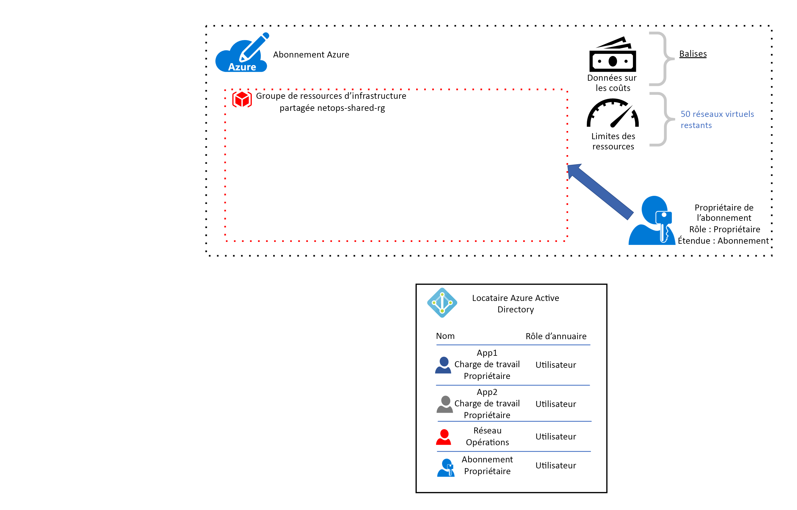
2. Le **propriétaire de l’abonnement** ajoute le compte d’utilisateur **opérations réseau** au groupe de ressources et lui affecte le rôle de **contributeur**. 
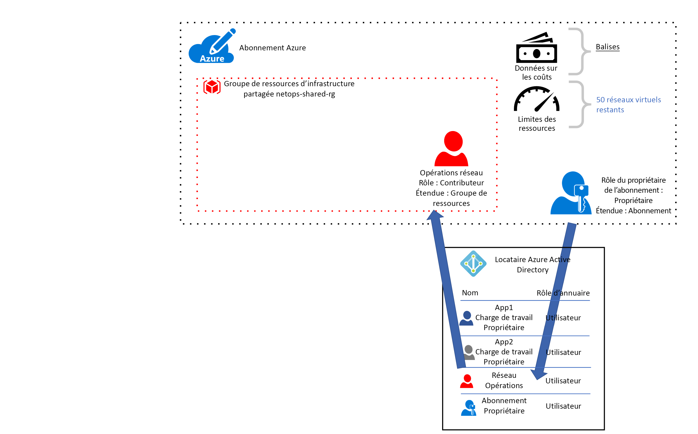
3. L’utilisateur des **opérations réseau** crée une [passerelle VPN](/azure/vpn-gateway/vpn-gateway-about-vpngateways) et la configure pour se connecter à l’appareil VPN local. L’utilisateur des **opérations réseau** applique également une paire de [balises](/azure/azure-resource-manager/resource-group-using-tags) à chacune des ressources : *environment:shared* et *managedBy:netOps*. Lorsque **l’administrateur de services fédérés d’abonnement** exporte un rapport de coûts, les coûts seront alignés sur chacune de ces balises. Cela permet à **l’administrateur de services fédérés d’abonnement** de basculer les coûts à l’aide de la balise *environment* et de la balise *managedBy*. Notez le compteur de **limites de ressources** situé en haut à droite de la figure. Chaque abonnement Azure possède des [limites de service](/azure/azure-subscription-service-limits), et pour vous aider à comprendre l’impact de ces limites, nous allons suivre la limite du réseau virtuel pour chaque abonnement. Il existe une limite par défaut de 50 réseaux virtuels par abonnement ; après avoir déployé le premier réseau virtuel, 49 sont maintenant disponibles.
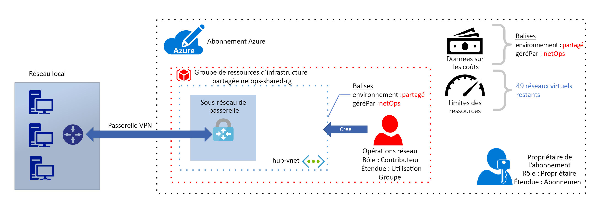
4. Deux autres groupes de ressources sont déployés ; le premier est nommé *prod-rg*. Ce groupe de ressources est aligné sur l’environnement de **production**. Le second, nommé *dev-rg*, est aligné sur l’environnement de **développement**. Toutes les ressources associées aux charges de travail de production sont déployées dans l’environnement de **production** et toutes les ressources associées aux charges de travail de développement sont déployées dans l’environnement de **développement**. Dans cet exemple, nous allons déployer uniquement deux charges de travail pour chacun de ces deux environnements afin de ne pas rencontrer les limites de service d’abonnement Azure. Notez cependant que chaque groupe de ressources est limité à 800 ressources par groupe de ressources. Par conséquent, si nous continuons d’ajouter des charges de travail à chaque groupe de ressources, nous risquons d’atteindre cette limite. 
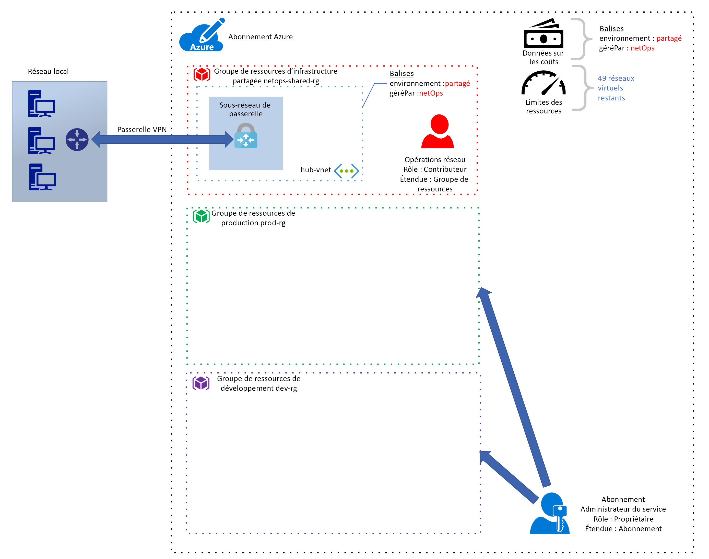
5. Le premier **propriétaire de la charge de travail** envoie une demande à **l’administrateur de services fédérés d’abonnement** et est ajouté aux groupes de ressources de l’environnement de **développement** et de l’environnement de **production** avec le rôle de **contributeur**. Comme expliqué précédemment, le rôle de **contributeur** permet à l’utilisateur d’effectuer n’importe quelle opération, sauf attribuer un rôle à un autre utilisateur. Le premier **propriétaire de la charge de travail** peut maintenant créer les ressources associées à sa charge de travail.
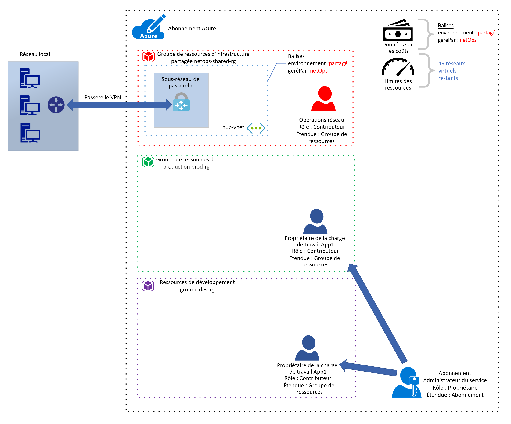
6. Le premier **propriétaire de la charge de travail** crée dans chacun des deux groupes de ressources un réseau virtuel comprenant chacun une paire de machines virtuelles. Le premier **propriétaire de la charge de travail** applique les balises *environment* et *managedBy* à toutes les ressources. Notez que le compteur de limite de service Azure indique qu’il reste désormais 47 réseaux virtuels.
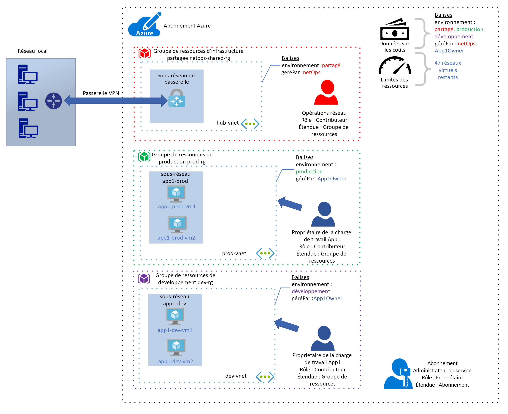
7. Aucun des réseaux virtuels ne possède de connectivité en local au moment de leur création. Dans ce type d’architecture, chaque réseau virtuel doit être appairé au *hub-vnet* dans l’environnement de **l’infrastructure partagée**. L’appariement de réseaux virtuels crée une connexion entre deux réseaux virtuels distincts et autorise le trafic réseau entre eux. Notez que cet appariement n’est pas transitif par nature. Un appariement doit être spécifié dans chacun des deux réseaux virtuels connectés, et si seulement un des réseaux virtuels spécifie un appariement, la connexion est incomplète. Pour mieux illustrer cet effet, le premier **propriétaire de la charge de travail** spécifie un appariement entre **prod-vnet** et **hub-vnet**. Le premier appariement est créé, mais aucun trafic n’est acheminé car l’appariement complémentaire entre **hub-vnet** et **prod-vnet** n’a pas encore été spécifié. Le premier **propriétaire de la charge de travail** contacte l’utilisateur des **opérations réseau** et lui demandes la connexion de cet appariement complémentaire.
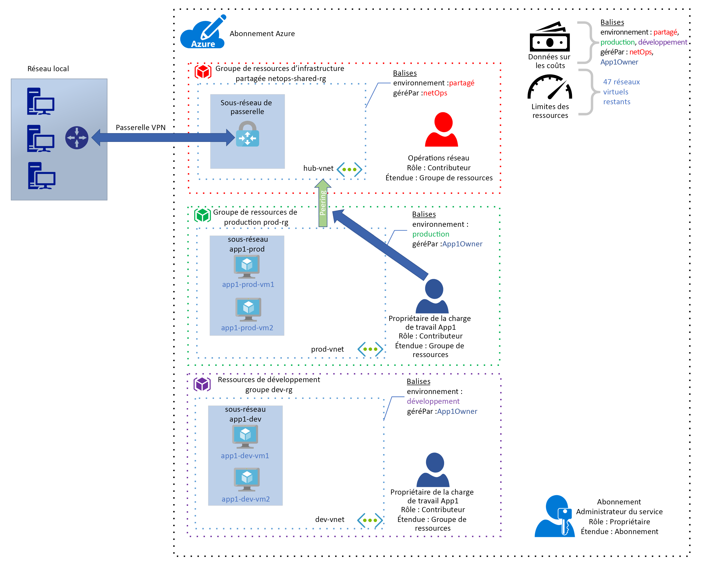
8. L’utilisateur des **opérations réseau** examine la demande, l’approuve, puis spécifie l’appariement dans les paramètres de **hub-vnet**. La connexion de l’appariement est maintenant terminée et le trafic réseau transite entre les deux réseaux virtuels.
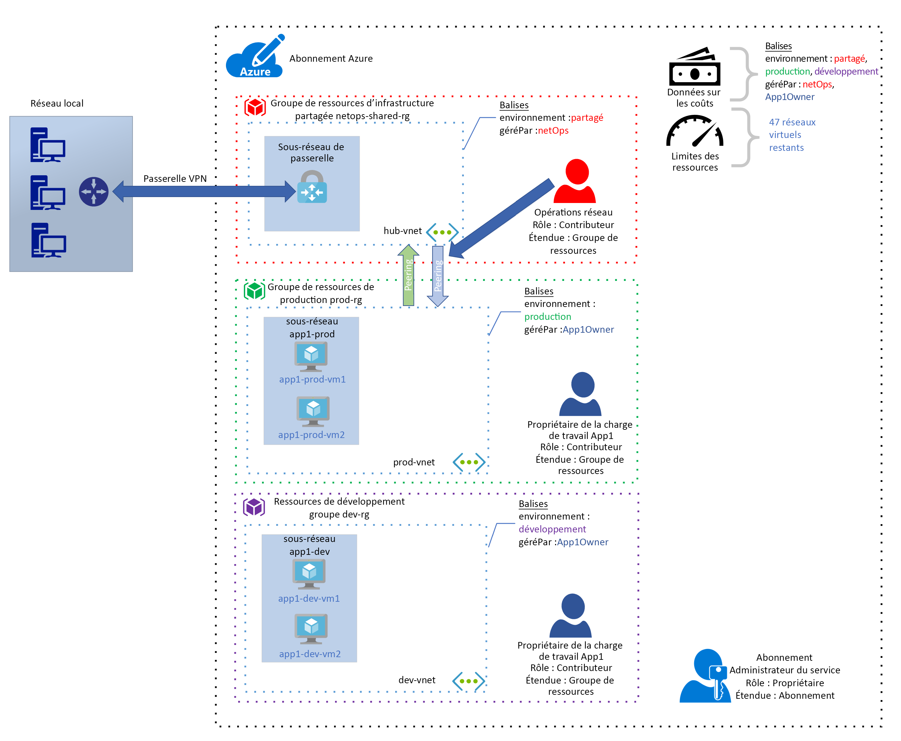
9. À présent, un deuxième **propriétaire de charge de travail** envoie une demande à **l’administrateur de services fédérés d’abonnement** et est ajouté aux groupes de ressources existants des environnements de **production** et de **développement** avec le rôle de **contributeur**. Le deuxième **propriétaire de la charge de travail** possède les mêmes autorisations sur toutes les ressources que le premier **propriétaire de la charge de travail** dans chaque groupe de ressources. 
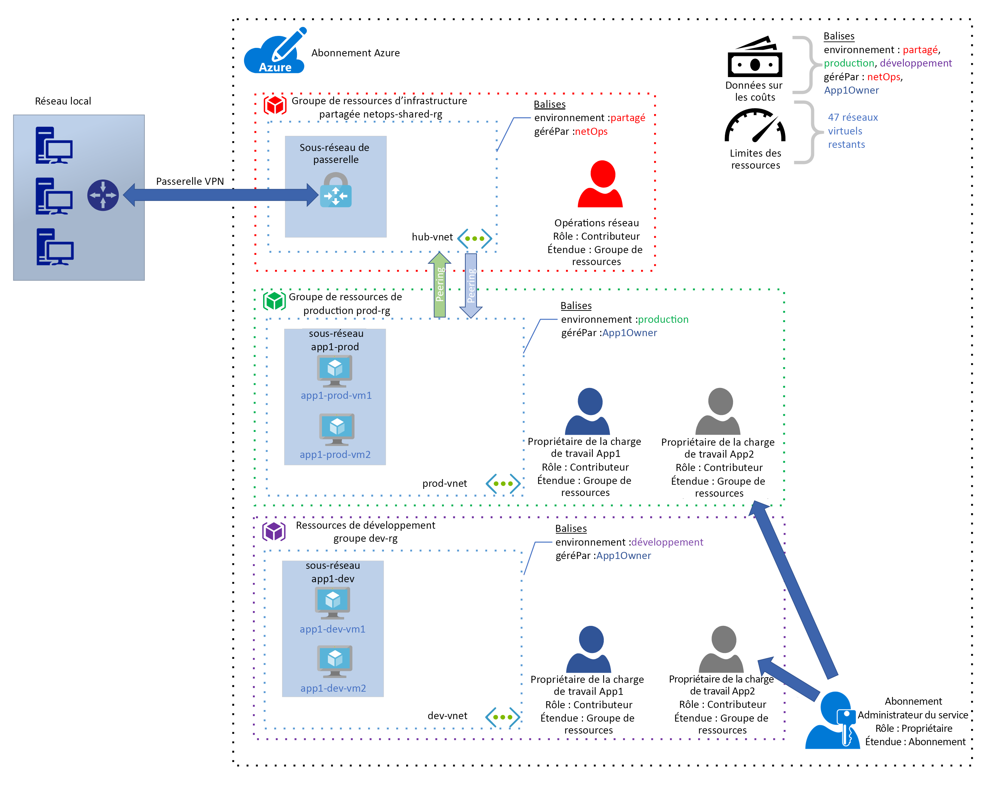
10. Le deuxième **propriétaire de la charge de travail** crée un sous-réseau dans le réseau virtuel **prod-vnet**, puis ajoute deux machines virtuelles. Le deuxième **propriétaire de la charge de travail** applique les balises *environment* et *managedBy* à chaque ressource.
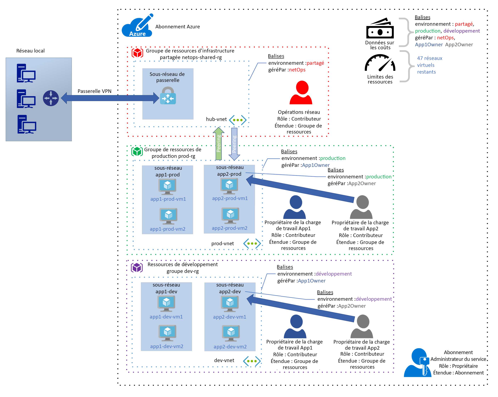 

Cet exemple de modèle de gestion de ressources nous permet de gérer nos ressources dans les trois environnements dont nous avons besoin. Les ressources de notre infrastructure partagée sont protégées, car un seul utilisateur de l’abonnement possède l’autorisation d’accéder à ces ressources. Chacun de nos propriétaires de charges de travail est en mesure d’utiliser les ressources de l’infrastructure partagée sans disposer d’autorisations particulières sur les ressources partagées proprement dites. Ce modèle de gestion ne répond pas à notre besoin d’isoler les charges de travail puisque chacun des deux **propriétaires de charges de travail** est en mesure d’accéder aux ressources associées à la charge de travail de l’autre propriétaire. 

Il existe un autre élément important à prendre en compte avec ce modèle, qui peut ne pas sembler évident de prime abord. Dans notre exemple, c’est le **propriétaire de la charge de travail app1** qui a demandé la connexion de l’appariement réseau avec le réseau virtuel **hub-vnet** afin d’obtenir une connectivité en local. L’utilisateur des **opérations réseau** a évalué cette demande compte tenu des ressources déployées avec cette charge de travail. Lorsque le **propriétaire de l’abonnement** a ajouté le **propriétaire de la charge de travail app2** avec le rôle de **contributeur**, cet utilisateur disposait des droits d’accès administratif sur toutes les ressources du groupe de ressources  **prod-rg**. 

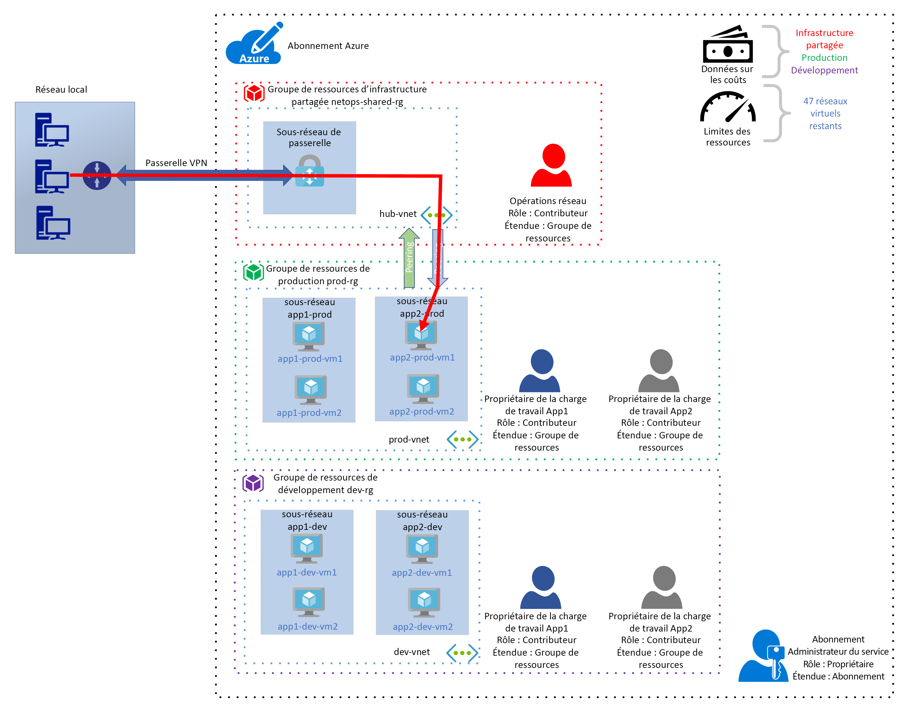

Autrement dit, le **propriétaire de la charge de travail app2** disposait de l’autorisation de déployer son propre sous-réseau avec des machines virtuelles dans le réseau virtuel **prod-vnet**. Par défaut, ces machines virtuelles ont désormais accès au réseau local. L’utilisateur des **opérations réseau** n’a pas connaissance de ces machines et n’a pas approuvé leur connectivité au niveau local.

Voyons maintenant le cas d’un abonnement unique avec plusieurs groupes de ressources pour différents environnements et charges de travail. Notez que dans l’exemple précédent, les ressources pour chaque environnement étaient facilement identifiables, car elles se trouvaient dans le même groupe de ressources. Maintenant que nous n’avons plus ce regroupement, il nous faut utiliser une convention d’affectation des noms de groupe de ressources pour bénéficier de ces fonctionnalités. 

1. Dans ce modèle, les ressources de notre **infrastructure partagée** auront toujours un groupe de ressources distinct, qui reste le même. Chaque charge de travail a besoin de deux groupes de ressources (un pour l’environnement de **développement** et un pour l’environnement de **production**). Pour la première charge de travail, le **propriétaire de l’abonnement** crée deux groupes de ressources. Le premier est nommé **app1-prod-rg**, l’autre **app1-dev-rg**. Comme indiqué précédemment, cette convention d’affectation de noms identifie les ressources comme étant associées à la première charge de travail, **app1**, et soit à l’environnement **dev** soit à l’environnement **prod**. Là encore, le propriétaire de *l’abonnement* ajoute le **propriétaire de la charge de travail app1** au groupe de ressources avec le rôle de **contributeur**.
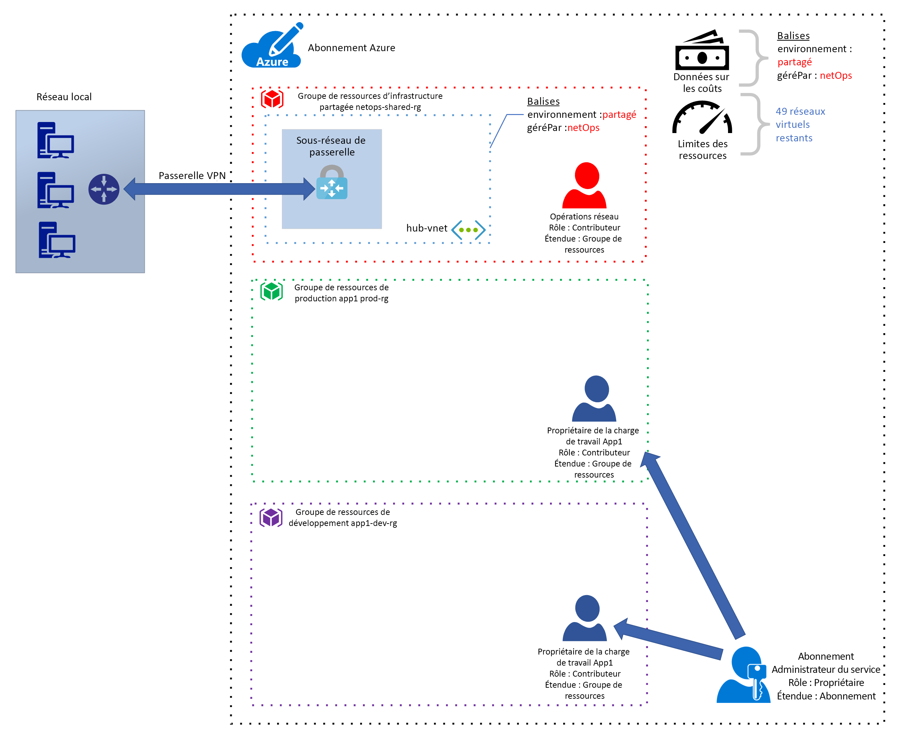
2. De la même façon que dans le premier exemple, le **propriétaire de la charge de travail app1** déploie un réseau virtuel nommé **app1-prod-vnet** dans l’environnement de **production** et un autre réseau virtuel nommé **app1-dev-vnet** dans l’environnement de **développement**. Là encore, le **propriétaire de la charge de travail app1** envoie une demande à l’utilisateur des **opérations réseau** afin de créer une connexion d’appariement. Notez que le **propriétaire de la charge de travail app1** ajoute les mêmes balises que dans le premier exemple et que le compteur de limite indique qu’il ne reste que 47 réseaux virtuels dans l’abonnement.
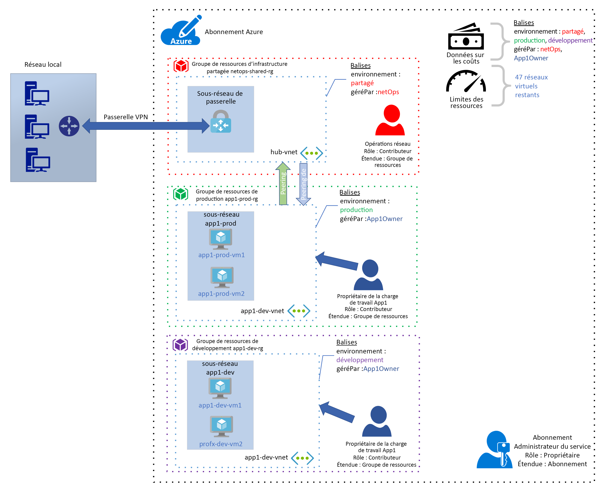
3. Le **propriétaire de l’abonnement** crée deux groupes de ressources pour le **propriétaire de la charge de travail app2**. En suivant les mêmes conventions que pour le **propriétaire de la charge de travail app1**, les groupes de ressources sont nommés **app2-prod-rg** et **app2-dev-rg**. Le **propriétaire de l’abonnement** ajoute le **propriétaire de la charge de travail app2** à chacun des groupes de ressources avec le rôle de **contributeur**.
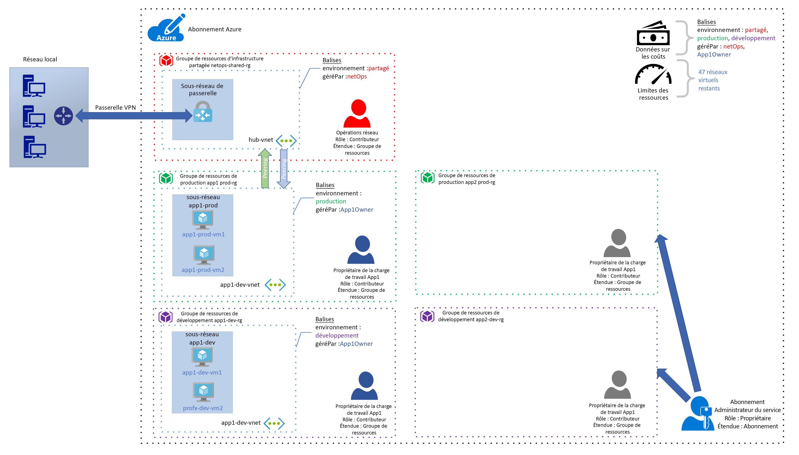
4. Le *propriétaire de la charge de travail App2* déploie des réseaux virtuels et des machines virtuelles sur les groupes de ressources en utilisant les mêmes conventions d’affectation de noms. Les balises sont ajoutées et le compteur de limite indique qu’il reste 45 réseaux virtuels dans *l’abonnement*.
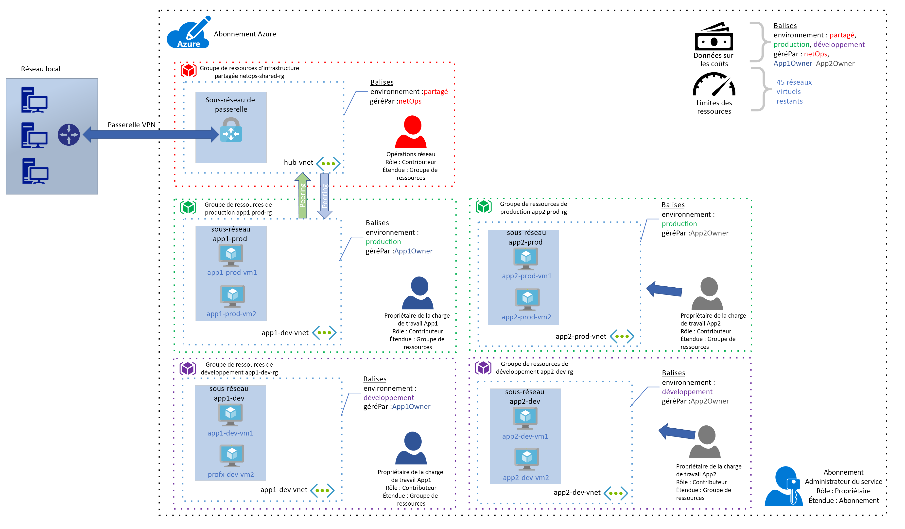
5. Le *propriétaire de la charge de travail App2* envoie une demande à l’utilisateur des *opérations réseau* pour appairer les réseaux virtuels *app2-prod-vnet* et *hub-vnet*. L’utilisateur des *opérations réseau* crée la connexion d’appariement.
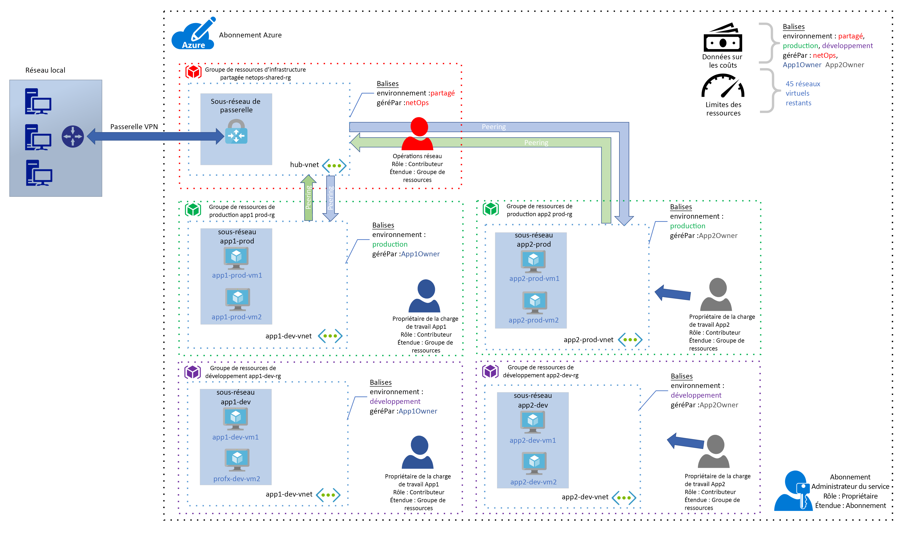

Le modèle de gestion qui en résulte est similaire au premier exemple, mais présente quelques différences majeures :
* Chacune des deux charges de travail est isolée par charge de travail et par environnement.
* Ce modèle a besoin de deux réseaux virtuels de plus que le premier exemple de modèle. Bien que cela ne fasse pas grande différence dans le cas de deux charges de travail, la limite théorique imposée au nombre de charges de travail pour ce modèle est de 24. 
* Les ressources ne sont plus regroupées dans un seul groupe de ressources pour chaque environnement. Le regroupement des ressources suppose de comprendre les conventions d’affectation de noms utilisées pour chaque environnement. 
* Chacune des connexions des réseaux virtuels appairés a été vérifiée et approuvée par l’utilisateur des *opérations réseau*.

Voyons maintenant le cas d’un modèle de gestion des ressources utilisant plusieurs abonnements. Dans ce modèle, nous allons aligner chacun des trois environnements sur un abonnement distinct : un abonnement de **services partagés**, un abonnement de **production** et un abonnement de **développement**. Les aspects à prendre en compte pour ce modèle sont similaires à deux d’un modèle qui utilise un seul abonnement, en ce sens que nous devons déterminer la manière dont nous allons aligner les groupes de ressources sur les charges de travail. Nous savons déjà que le fait de créer un groupe de ressources pour chaque charge de travail nous permettait d’isoler les charges de travail, aussi nous allons rester fidèles à ce modèle dans cet exemple.

1. Dans ce modèle, nous avons trois *abonnements* : *infrastructure partagée*, *production* et *développement*. Chacune de ces trois abonnements a besoin d’un *propriétaire de l’abonnement* ; dans notre exemple simplifié, nous allons utiliser le même compte d’utilisateur pour les trois. Les ressources de *l’infrastructure partagée* sont gérées de la même façon que pour les deux premiers exemples ci-dessus, et la première charge de travail est associée à *app1-rg* dans l’environnement de *production* et au groupe de ressources du même nom dans l’environnement de *développement*. Le *propriétaire de la charge de travail app1* est ajouté à chacun des groupes de ressources avec le rôle de *contributeur*. 
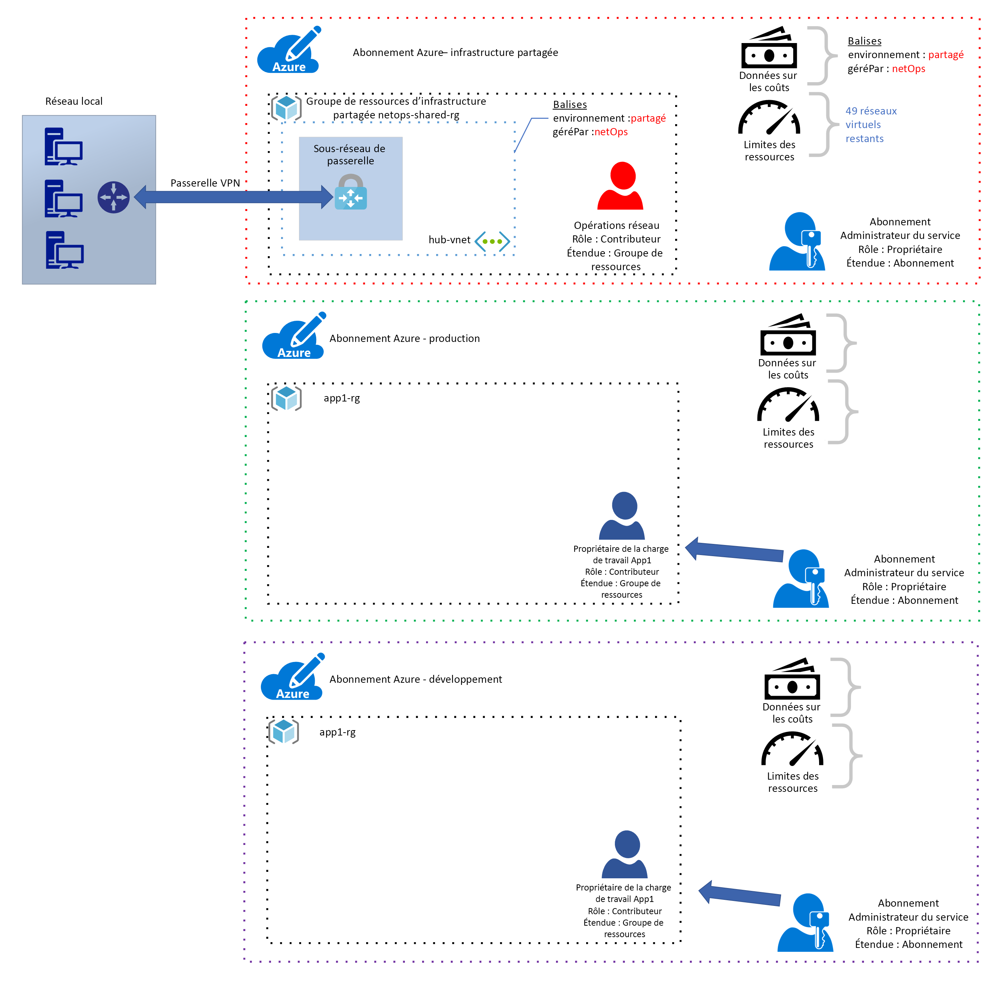
2. Comme pour les exemples précédents, le *propriétaire de la charge de travail app1* crée les ressources et demande la connexion d’appariement avec le réseau virtuel de *l’infrastructure partagée*. Le *propriétaire de la charge de travail App1* ajoute uniquement la balise *managedBy* car la balise *environment* n’est plus nécessaire. Autrement dit, les ressources pour chaque environnement sont maintenant regroupées dans le même *abonnement* et la balise *environment* est redondante. Le compteur de limite indique qu’il reste 49 réseaux virtuels.
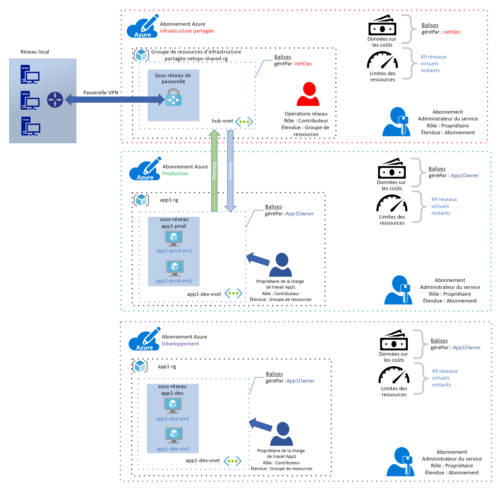
3. Pour finir, le *propriétaire de l’abonnement* répète le processus pour la deuxième charge de travail, en ajoutant les groupes de ressources avec le *propriétaire de la charge de travail app2* dans le rôle de *contributeur. Le compteur de limite pour chaque abonnement indique qu’il reste 48 réseaux virtuels. 

Ce modèle de gestion présente les mêmes avantages que ceux du deuxième exemple ci-dessus. Le problème de limitation est cependant moindre étant donné que les limites sont réparties entre deux *abonnements*. L’inconvénient est que les données de coût suivies par les balises doivent être regroupées dans les trois *abonnements*. 

En conclusion, vous pouvez choisir l’un de ces deux exemples de modèles de gestion des ressources selon la priorité de vos besoins. Si vous pensez que votre organisation n’atteindra pas les limites de service pour un seul abonnement, vous pouvez utiliser un seul abonnement avec plusieurs groupes de ressources. À l’inverse, si votre organisation prévoit de nombreuses charges de travail, le mieux est de privilégier plusieurs abonnements pour chaque environnement.

<!-- ## Summary

## Next steps -->

<!-- links -->

[rbac-built-in-owner]: /azure/role-based-access-control/built-in-roles#owner
[rbac-built-in-roles]: /azure/role-based-access-control/built-in-roles
