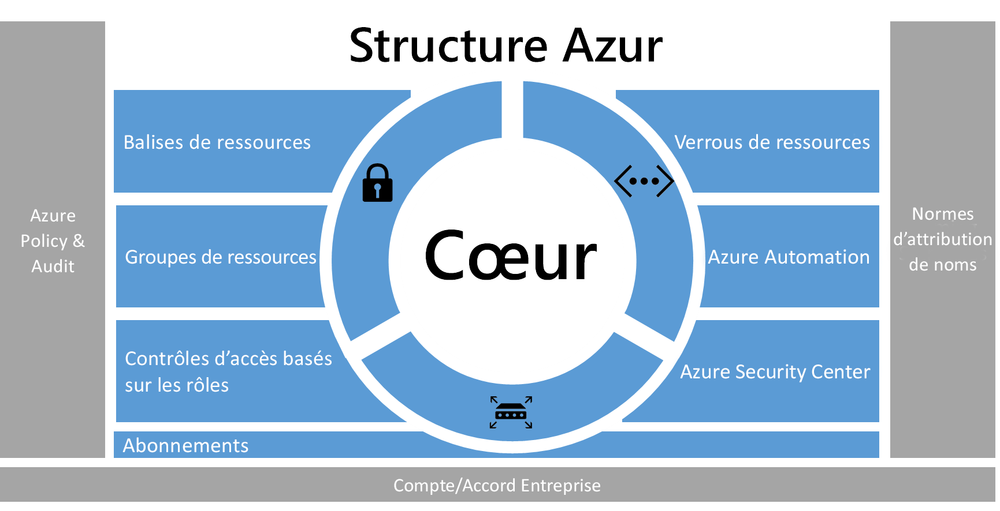
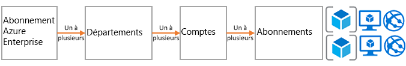
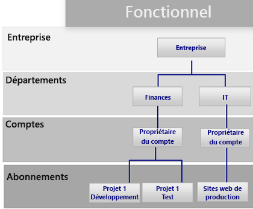
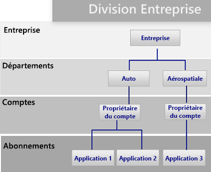
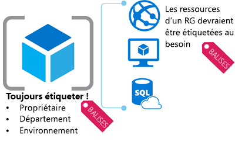
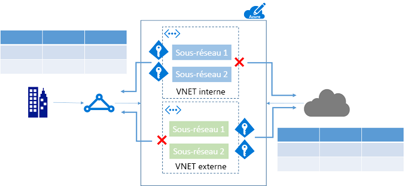

# Structure d’entreprise Azure : gouvernance normative de l’abonnementAzure enterprise scaffold - prescriptive subscription governance
Les entreprises adoptent de plus en plus le cloud public en raison de son agilité et de la flexibilité.Enterprises are increasingly adopting the public cloud for its agility and flexibility. Elles utilisent les atouts du cloud pour générer des revenus ou optimiser les ressources de l’entreprise.They are utilizing the cloud's strengths to generate revenue or optimize resources for the business. Microsoft Azure offre une multitude de services que les entreprises peuvent combiner sous forme de blocs de construction pour traiter une large gamme de charges de travail et d’applications.Microsoft Azure provides a multitude of services that enterprises can assemble like building blocks to address a wide array of workloads and applications. 

Mais il est souvent difficile de savoir par où commencer.But, knowing where to begin is often difficult. Une fois l’utilisation d’Azure décidée, certaines questions se posent fréquemment :After deciding to use Azure, a few questions commonly arise:

* « Comment respecter nos obligations légales en matière de souveraineté des données dans certains pays ? »"How do I meet our legal requirements for data sovereignty in certain countries?"
* « Comment vérifier que quelqu'un ne modifie pas par inadvertance un système critique ? »"How do I ensure that someone does not inadvertently change a critical system?"
* « Comment savoir ce que chaque ressource prend en charge afin de les comptabiliser et de les facturer avec exactitude ? »"How do I know what every resource is supporting so I can account for it and bill it back accurately?"

La perspective d’un abonnement vide sans garde-fou est décourageante.The prospect of an empty subscription with no guard rails is daunting. Elle peut même vous décourager de migrer vers Azure.This blank space can hamper your move to Azure.

Cet article fournit un point de départ aux techniciens qui leur permettra de répondre aux besoins en matière de gouvernance et de les mettre en correspondance avec le besoin de souplesse.This article provides a starting point for technical professionals to address the need for governance, and balance it with the need for agility. Il introduit le concept d’une structure d’entreprise qui guide les organisations dans l’implémentation et la gestion de leurs abonnements Azure.It introduces the concept of an enterprise scaffold that guides organizations in implementing and managing their Azure subscriptions. 

## Besoin de gouvernanceNeed for governance
Lors de la migration vers Azure, vous devez prendre en compte la gouvernance assez tôt pour garantir une utilisation efficace du cloud au sein de l’entreprise.When moving to Azure, you must address the topic of governance early to ensure the successful use of the cloud within the enterprise. Malheureusement, le temps et la bureaucratie nécessaires à la création d’un système de gouvernance complet impliquent que certaines divisions s’adressent directement à des fournisseurs sans impliquer le service informatique de l’entreprise.Unfortunately, the time and bureaucracy of creating a comprehensive governance system means some business groups go directly to vendors without involving enterprise IT. Cette approche peut exposer l’entreprise à des vulnérabilités si les ressources ne sont pas gérées correctement.This approach can leave the enterprise open to vulnerabilities if the resources are not properly managed. Les caractéristiques du cloud public (agilité, la flexibilité et tarification basée sur la consommation) sont importantes pour les groupes professionnels qui doivent répondre rapidement aux demandes des clients (internes et externes).The characteristics of the public cloud - agility, flexibility, and consumption-based pricing - are important to business groups that need to quickly meet the demands of customers (both internal and external). Mais le service informatique de l’entreprise doit s’assurer que les données et les systèmes sont efficacement protégés.But, enterprise IT needs to ensure that data and systems are effectively protected.

Dans la réalité, la structure est utilisée pour créer la base de l’architecture.In real life, scaffolding is used to create the basis of the structure. Un échafaudage trace les grandes lignes et fournit des points d’ancrage pour le montage de systèmes plus permanents.The scaffold guides the general outline, and provides anchor points for more permanent systems to be mounted. Une structure d’entreprise revient au même : il s’agit d’un ensemble de contrôles flexibles et de fonctionnalités Azure qui fournissent la structure de l’environnement et des points d’ancrage pour les services basés sur le cloud public.An enterprise scaffold is the same: a set of flexible controls and Azure capabilities that provide structure to the environment, and anchors for services built on the public cloud. Elle fournit aux constructeurs (service informatique et groupes professionnels) une base pour créer et lier de nouveaux services.It provides the builders (IT and business groups) a foundation to create and attach new services.

Elle est basée sur des pratiques que nous avons développées au cours de nos nombreuses collaborations avec des clients de tailles diverses.The scaffold is based on practices we have gathered from many engagements with clients of various sizes. Nous comptons parmi ces clients aussi bien des petites entreprises développant des solutions dans le cloud que des entreprises du Fortune 500 et des éditeurs de logiciels indépendants qui migrent et développent des solutions dans le cloud.Those clients range from small organizations developing solutions in the cloud to Fortune 500 enterprises and independent software vendors who are migrating and developing solutions in the cloud. La structure d’entreprise est spécialement conçue pour plus de flexibilité afin de prendre en charge les charges de travail informatiques traditionnelles et les charges de travail agiles, comme lorsque les développeurs créent des applications de type software-as-a-service (SaaS) basées sur des fonctionnalités Azure.The enterprise scaffold is "purpose-built" to be flexible to support both traditional IT workloads and agile workloads; such as, developers creating software-as-a-service (SaaS) applications based on Azure capabilities.

La structure d’entreprise constitue le fondement de chaque nouvel abonnement dans Azure.The enterprise scaffold is intended to be the foundation of each new subscription within Azure. Elle permet aux administrateurs de s’assurer que les charges de travail répondent à la configuration requise minimale en matière de gouvernance d’une organisation sans empêcher les groupes professionnels et les développeurs d’atteindre rapidement leurs objectifs.It enables administrators to ensure workloads meet the minimum governance requirements of an organization without preventing business groups and developers from quickly meeting their own goals.

> [!IMPORTANT]
> La gouvernance est essentielle au succès d’Azure.Governance is crucial to the success of Azure. Cet article vise l’implémentation technique d’une structure d’entreprise, mais traite uniquement de processus plus larges et de relations entre les composants.This article targets the technical implementation of an enterprise scaffold but only touches on the broader process and relationships between the components. La gouvernance de stratégies s’applique du haut vers le bas et dépend des objectifs de l’entreprise.Policy governance flows from the top down and is determined by what the business wants to achieve. Naturellement, la création d’un modèle de gouvernance pour Azure inclut des représentants du service informatique. Mais, plus important encore, elle doit également intégrer des responsables de groupes professionnels et de la gestion des risques et de la sécurité.Naturally, the creation of a governance model for Azure includes representatives from IT, but more importantly it should have strong representation from business group leaders, and security and risk management. Au final, une structure d’entreprise consiste à limiter les risques métier afin de faciliter la mission et la poursuite des objectifs d’une organisation.In the end, an enterprise scaffold is about mitigating business risk to facilitate an organization's mission and objectives.
> 
> 

L’illustration suivante décrit les composants de la structure.The following image describes the components of the scaffold. Elle est basée sur un plan englobant services, comptes et abonnements.The foundation relies on a solid plan for departments, accounts, and subscriptions. Les piliers en sont des stratégies Resource Manager et des normes d’affectation de noms fortes.The pillars consist of Resource Manager policies and strong naming standards. Le reste de la structure se base sur des fonctionnalités Azure et des fonctionnalités qui permettent de développer un environnement sécurisé et facile à gérer.The rest of the scaffold comes from core Azure capabilities and features that enable a secure and manageable environment.

> [!NOTE]
> Azure a évolué rapidement depuis son lancement en 2008.Azure has grown rapidly since its introduction in 2008. Cette croissance a conduit les ingénieurs Microsoft à repenser leur approche de la gestion et du déploiement de services.This growth required Microsoft engineering teams to rethink their approach for managing and deploying services. Le modèle Azure Resource Manager a été introduit dans 2014 et remplace le modèle de déploiement classique.The Azure Resource Manager model was introduced in 2014 and replaces the classic deployment model. Resource Manager permet aux organisations de déployer, d’organiser et de contrôler les plus facilement ressources Azure.Resource Manager enables organizations to more easily deploy, organize, and control Azure resources. Resource Manager comprend la parallélisation lors de la création de ressources pour un déploiement plus rapide de solutions complexes et interdépendantes.Resource Manager includes parallelization when creating resources for faster deployment of complex, interdependent solutions. Il inclut également un contrôle d’accès granulaire et la possibilité de baliser des ressources avec des métadonnées.It also includes granular access control, and the ability to tag resources with metadata. Microsoft vous recommande de créer des ressources par le biais du modèle Resource Manager.Microsoft recommends that you create all resources through the Resource Manager model. La structure d’entreprise est explicitement conçue pour le modèle Resource Manager.The enterprise scaffold is explicitly designed for the Resource Manager model.
> 
> 

## Définition de votre hiérarchieDefine your hierarchy
La base de la structure est l’inscription à Azure Enterprise (et au portail d’entreprise).The foundation of the scaffold is the Azure Enterprise Enrollment (and the Enterprise Portal). L’inscription d’une entreprise définit la forme et l’utilisation des services Azure en son sein et la structure de gouvernance principale.The enterprise enrollment defines the shape and use of Azure services within a company and is the core governance structure. Dans le contrat d’entreprise, les clients sont en mesure de subdiviser l’environnement en services, comptes et abonnements.Within the enterprise agreement, customers are able to further subdivide the environment into departments, accounts, and finally, subscriptions. Un abonnement Azure est l’unité de base contenant toutes les ressources.An Azure subscription is the basic unit where all resources are contained. Il définit également plusieurs limites au sein d’Azure, par exemple le nombre de cœurs, de ressources, etc.It also defines several limits within Azure, such as number of cores, resources, etc.

Chaque entreprise est différente et la hiérarchie de l’image précédente permet une grande flexibilité dans la manière dont Azure est organisé au sein de l’entreprise.Every enterprise is different and the hierarchy in the previous image allows for significant flexibility in how Azure is organized within the company. Avant d’implémenter les instructions contenues dans ce document, vous devez modéliser votre hiérarchie et comprendre l’impact sur la facturation, l’accès aux ressources et la complexité.Before implementing the guidance contained in this document, you should model your hierarchy and understand the impact on billing, resource access, and complexity.

Les trois modèles courants pour les inscriptions Azure sont :The three common patterns for Azure Enrollments are:

* Le modèle **fonctionnel**The **functional** pattern
  
    
* Le modèle **division**The **business unit** pattern 
  
    
* Le modèle **géographique**The **geographic** pattern
  
    

Vous appliquez la structure au niveau de l’abonnement pour étendre les exigences de gouvernance de l’entreprise dans l’abonnement.You apply the scaffold at the subscription level to extend the governance requirements of the enterprise into the subscription.

## Normes d’attribution de nomsNaming standards
Le premier pilier de la structure est constitué de normes d’attribution de noms.The first pillar of the scaffold is naming standards. Des normes d’attribution de noms bien conçues vous permettent d’identifier des ressources dans le portail, sur une facture et dans des scripts.Well-designed naming standards enable you to identify resources in the portal, on a bill, and within scripts. Vous disposez déjà probablement de conventions d’attribution de noms pour l’infrastructure locale.Most likely, you already have naming standards for on-premises infrastructure. Lorsque vous ajoutez Azure à votre environnement, vous devez étendre ces normes d’attribution de noms à vos ressources Azure.When adding Azure to your environment, you should extend those naming standards to your Azure resources. Les normes d’attribution de noms facilitent la gestion de l’environnement à tous les niveaux.Naming standard facilitate more efficient management of the environment at all levels.

> [!TIP]
> Pour les conventions de dénomination :For naming conventions:
> * Passez en revue et adoptez autant que possible les [modèles et pratiques recommandées](../best-practices/naming-conventions.md).Review and adopt where possible the [Patterns and Practices guidance](../best-practices/naming-conventions.md). Ce guide vous permet de déterminer une norme d’attribution de noms explicite.This guidance helps you decide on a meaningful naming standard.
> * Utilisez la casse mixte (camelCasing) pour les noms des ressources (par exemple, myResourceGroup et vnetNetworkName).Use camelCasing for names of resources (such as myResourceGroup and vnetNetworkName). Remarque : il existe certaines ressources, notamment des comptes de stockage, pour lesquelles la seule option est l’utilisation de minuscules (et aucun autre caractère spécial).Note: There are certain resources, such as storage accounts, where the only option is to use lower case (and no other special characters).
> * Envisagez d’utiliser des stratégies Azure Resource Manager (décrites dans la section suivante) pour appliquer des normes d’attribution de noms.Consider using Azure Resource Manager policies (described in the next section) to enforce naming standards.
> 
> Les conseils précédents vous aident à implémenter une convention de dénomination cohérente.The preceding tips help you implement a consistent naming convention.

## Stratégies et auditPolicies and auditing
Le deuxième pilier de la structure implique la création de [stratégies Azure](/azure/azure-policy/azure-policy-introduction) et [l’audit du journal d’activité](/azure/azure-resource-manager/resource-group-audit).The second pillar of the scaffold involves creating [Azure policies](/azure/azure-policy/azure-policy-introduction) and [auditing the activity log](/azure/azure-resource-manager/resource-group-audit). Les stratégies Resource Manager vous donnent la possibilité de gérer les risques dans Azure.Resource Manager policies provide you with the ability to manage risk in Azure. Vous pouvez définir des stratégies qui garantissent la souveraineté des données en limitant, en appliquant ou en auditant certaines actions.You can define policies that ensure data sovereignty by restricting, enforcing, or auditing certain actions. 

* La stratégie est un système **d’autorisation** par défaut.Policy is a default **allow** system. Vous contrôlez les actions en définissant et en affectant des stratégies à des ressources qui refusent ou auditent des actions sur les ressources.You control actions by defining and assigning policies to resources that deny or audit actions on resources.
* Les stratégies sont décrites par des définitions de stratégie dans un langage de définition de stratégie (conditions if-then).Policies are described by policy definitions in a policy definition language (if-then conditions).
* Vous créez des stratégies avec des fichiers au format JSON (Javascript Object Notation).You create polices with JSON (Javascript Object Notation) formatted files. Après avoir défini une stratégie, vous l’affectez à une portée particulière : abonnement, groupe de ressources ou ressource.After defining a policy, you assign it to a particular scope: subscription, resource group, or resource.

Les stratégies incluent plusieurs actions qui permettent d’adopter une approche affinée de vos scénarios.Policies have multiple actions that allow for a fine-grained approach to your scenarios. Les actions sont les suivantes :The actions are:

* **Refuser** : bloque la requête de ressource**Deny**: Blocks the resource request
* **Auditer** : autorise la requête, mais ajoute une ligne au journal d’activité (qui peut être utilisée pour fournir des alertes ou déclencher des runbooks)**Audit**: Allows the request but adds a line to the activity log (which can be used to provide alerts or to trigger runbooks)
* **Ajouter** : ajoute les informations spécifiées à la ressource.**Append**: Adds specified information to the resource. Par exemple, s’il n’existe pas de balise « CostCenter » sur une ressource, ajoutez cette balise avec une valeur par défaut.For example, if there is not a "CostCenter" tag on a resource, add that tag with a default value.

### Utilisations courantes de stratégies Resource ManagerCommon uses of Resource Manager policies
Les stratégies Azure Resource Manager sont un outil puissant dans le kit de ressources Azure.Azure Resource Manager policies are a powerful tool in the Azure toolkit. Elles vous permettent d’éviter des coûts inattendus, d’identifier un centre de coût pour les ressources par le biais d’un balisage et de vous assurer que les exigences de conformité sont satisfaites.They enable you to avoid unexpected costs, to identify a cost center for resources through tagging, and to ensure that compliancy requirements are met. Lorsque les stratégies sont combinées aux fonctionnalités d’audit intégrées, vous pouvez créer des solutions complexes et flexibles.When policies are combined with the built-in auditing features, you can fashion complex and flexible solutions. Les stratégies permettent aux entreprises de fournir les contrôles pour les charges de travail de « l’informatique traditionnelle » et « agiles », comme par exemple le développement d’applications de clients.Policies allow companies to provide controls for "Traditional IT" workloads and "Agile" workloads; such as, developing customer applications. Les modèles les plus courants pour les stratégies sont les suivants :The most common patterns we see for policies are:

* **Conformité géographique/souveraineté des données** : Azure est utilisable dans différentes régions du monde.**Geo-compliance/data sovereignty** - Azure provides regions across the world. Souvent, les entreprises souhaitent contrôler l’endroit où les ressources sont créées (si vous souhaitez garantir la souveraineté des données ou garantir que les ressources sont créées près des consommateurs finaux des ressources).Enterprises often wish to control where resources are created (whether to ensure data sovereignty or just to ensure resources are created close to the end consumers of the resources).
* **Gestion des coûts** : un abonnement Azure peut contenir des ressources de nombreux types et à différentes échelles.**Cost management** - An Azure subscription can contain resources of many types and scale. Les sociétés souhaitent souvent éviter que les abonnements standard évitent l’utilisation de ressources inutilement volumineuses, qui pourrait coûter des centaines de dollars par mois ou plus.Corporations often wish to ensure that standard subscriptions avoid using unnecessarily large resources, which can cost hundreds of dollars a month or more.
* **Gouvernance par défaut par le biais de balises nécessaires** : l’exigence de balises est l’une des fonctionnalités les plus courantes et les plus souhaitées.**Default governance through required tags** - Requiring tags is one of the most common and highly desired features. Avec les stratégies Azure Resource Manager, les entreprises sont en mesure de garantir qu’une ressource est correctement balisée.Using Azure Resource Manager Policies enterprises are able to ensure that a resource is appropriately tagged. Les balises les plus courantes sont : service, propriétaire de ressource et type d’environnement (par exemple, production, test et développement)The most common tags are: Department, Resource Owner, and Environment type (for example - production, test, development)

**Exemples****Examples**

Abonnement de type « informatique traditionnelle » pour les applications métier"Traditional IT" subscription for line-of-business applications

* Application de balises de type service et propriétaire à toutes les ressourcesEnforce Department and Owner tags on all resources
* Restriction de la création de ressources à la région Amérique du NordRestrict resource creation to the North American Region
* Restriction de la capacité à créer des machines virtuelles de série G et des clusters HDInsightRestrict the ability to create G-Series VMs and HDInsight Clusters

Environnement « Agile » pour une division de création d’applications cloud"Agile" Environment for a business unit creating cloud applications

* Pour répondre aux exigences de souveraineté des données, activez la création de ressources UNIQUEMENT dans une région spécifique.To meet data sovereignty requirements, allow the creation of resources ONLY in a specific region.
* Appliquez la balise d’environnement à toutes les ressources.Enforce Environment tag on all resources. Si une ressource est créée sans balise, ajoutez la balise **Environnement : inconnu** à la ressource.If a resource is created without a tag, append the **Environment: Unknown** tag to the resource.
* Auditez lorsque les ressources sont créées en dehors de l’Amérique du Nord, mais n’empêchez pasAudit when resources are created outside of North America but do not prevent.
* l’audit lorsque des ressources onéreuses sont créées.Audit when high-cost resources are created.

> [!TIP]
> L’utilisation la plus courante de stratégies Resource Manager sur plusieurs organisations consiste à contrôler *où* les ressources peuvent être créées et les *types* de ressources qui peuvent être créés.The most common use of Resource Manager policies across organizations is to control *where* resources can be created and *what* types of resources can be created. En plus du contrôle de *l’endroit* et du *type*, de nombreuses entreprises utilisent des stratégies pour s’assurer que les ressources ont les métadonnées appropriées pour la facturation de la consommation.In addition to providing controls on *where* and *what*, many enterprises use policies to ensure resources have the appropriate metadata to bill back for consumption. Nous vous recommandons d’appliquer des stratégies au niveau de l’abonnement pour :We recommend applying policies at the subscription level for:
> 
> * la conformité géographique/la souveraineté des données ;Geo-compliance/data sovereignty
> * la gestion des coûts ;Cost management
> * les balises nécessaires (déterminées selon les besoins métier, notamment BillTo et propriétaire de l’application).Required tags (Determined by business need, such as BillTo, Application Owner)
> 
> Vous pouvez appliquer des stratégies supplémentaires à des niveaux inférieurs de l’étendue.You can apply additional policies at lower levels of scope.
> 
> 

### Audit - que s’est-il passé ?Audit - what happened?
Pour voir la manière dont votre environnement fonctionne, vous devez auditer l’activité de l’utilisateur.To view how your environment is functioning, you need to audit user activity. La plupart des types de ressources dans Azure créent des journaux de diagnostic capables d’analyser par le biais d’un outil de journal ou dans Azure Log Analytics.Most resource types within Azure create diagnostic logs that you can analyze through a log tool or in Azure Log Analytics. Vous pouvez collecter des journaux d’activité sur plusieurs abonnements pour fournir une vue au niveau d’un service ou de l’entreprise.You can gather activity logs across multiple subscriptions to provide a departmental or enterprise view. Les enregistrements d’audit sont un outil de diagnostic important et un mécanisme essentiel pour déclencher des événements dans l’environnement Azure.Audit records are both an important diagnostic tool and a crucial mechanism to trigger events in the Azure environment.

Les journaux d’activité du Resource Manager permettent de déterminer les **opérations** qui ont eu lieu et qui les a exécutées.Activity logs from Resource Manager deployments enable you to determine the **operations** that took place and who performed them. Les journaux d’activité peuvent être collectés et agrégés à l’aide d’outils tels que Log Analytics.Activity logs can be collected and aggregated using tools like Log Analytics.

## Balises de ressourceResource tags
Comme les utilisateurs de votre organisation ajoutent des ressources à l’abonnement, il devient plus en plus important d’associer des ressources au service, au client et à l’environnement appropriés.As users in your organization add resources to the subscription, it becomes increasingly important to associate resources with the appropriate department, customer, and environment. Vous pouvez attacher des métadonnées aux ressources par le biais de [balises](/azure/azure-resource-manager/resource-group-using-tags).You can attach metadata to resources through [tags](/azure/azure-resource-manager/resource-group-using-tags). Vous utilisez des balises pour fournir des informations sur la ressource ou le propriétaire.You use tags to provide information about the resource or the owner. Les balises vous permettent non seulement d’agréger et de regrouper les ressources de différentes façons, mais également d’utiliser ces données pour les besoins de facturation interne.Tags enable you to not only aggregate and group resources in various ways, but use that data for the purposes of chargeback. Vous pouvez baliser des ressources avec jusqu'à 15 paires clé-valeur.You can tag resources with up to 15 key:value pairs. 

Les balises de ressources sont flexibles et doivent être attachées à la plupart des ressources.Resource tags are flexible and should be attached to most resources. Exemples de balises de ressources courantes :Examples of common resource tags are:

* BillToBillTo
* Service (ou unité commerciale)Department (or Business Unit)
* Environnement (production, déploiement intermédiaire, développement)Environment (Production, Stage, Development)
* Couche (couche Web, couche Application)Tier (Web Tier, Application Tier)
* Propriétaire de l’applicationApplication Owner
* ProjectNameProjectName

Pour plus d’exemples de balises, consultez la rubrique [Conventions d’affectation de noms recommandées pour les ressources Azure](../best-practices/naming-conventions.md).For more examples of tags, see [Recommended naming conventions for Azure resources](../best-practices/naming-conventions.md).

> [!TIP]
> Envisagez une stratégie qui impose de balisage pour les éléments suivants :Consider making a policy that mandates tagging for:
> 
> * Groupes de ressourcesResource groups
> * StockageStorage
> * Virtual MachinesVirtual Machines
> * Environnements de service d’applications/serveurs webApplication Service Environments/web servers
> 
> Cette stratégie de balisage identifie les métadonnées nécessaires dans vos abonnements pour l’activité, la finance, la sécurité, la gestion des risques et la gestion globale de l’environnement.This tagging strategy identifies across your subscriptions what metadata is needed for the business, finance, security, risk management, and overall management of the environment. 

## Groupe de ressourcesResource group
Resource Manager vous permet de répartir des ressources dans des groupes explicites pour la gestion, la facturation ou l’affinité naturelle.Resource Manager enables you to put resources into meaningful groups for management, billing, or natural affinity. Comme mentionné précédemment, Azure dispose de deux modèles de déploiement.As mentioned earlier, Azure has two deployment models. Dans l’ancien modèle standard, l’unité de base de gestion était l’abonnement.In the earlier Classic model, the basic unit of management was the subscription. Il était difficile de répartir des ressources au sein d’un abonnement, ce qui entraînait la création d’un grand nombre d’abonnements.It was difficult to break down resources within a subscription, which led to the creation of large numbers of subscriptions. Avec le modèle Resource Manager, des groupes de ressources ont été introduits.With the Resource Manager model, we saw the introduction of resource groups. Les groupes de ressources sont des conteneurs de ressources qui ont un cycle de vie commun ou partagent un attribut tel que « tous les serveurs SQL » ou « Application A ».Resource groups are containers of resources that have a common lifecycle or share an attribute such as "all SQL servers" or "Application A".

Les groupes de ressources ne peuvent pas être contenus les uns dans les autres et les ressources ne peuvent appartenir qu’à un groupe de ressources.Resource groups cannot be contained within each other and resources can only belong to one resource group. Vous pouvez appliquer certaines actions à toutes les ressources dans un groupe de ressources.You can apply certain actions on all resources in a resource group. Par exemple, la suppression d’un groupe de ressources supprime toutes les ressources du groupe de ressources.For example, deleting a resource group removes all resources within the resource group. En règle générale, vous placez une application complète ou un système associé dans le même groupe de ressources.Typically, you place an entire application or related system in the same resource group. Par exemple, une application à trois niveaux appelée Contoso Web Application contient le serveur web, le serveur d’applications et le serveur SQL dans le même groupe de ressources.For example, a three-tier application called Contoso Web Application would contain the web server, application server and SQL server in the same resource group.

> [!TIP]
> La façon dont vous organisez vos groupes de ressources peut aller de charges de travail de type « informatique traditionnelle » à des charges de travail de type « informatique agile » :How you organize your resource groups may vary from "Traditional IT" workloads to "Agile IT" workloads:
> 
> * Les charges de travail de type « informatique traditionnelle » sont généralement regroupées par éléments au sein du même cycle de vie, par exemple en tant qu’application."Traditional IT" workloads are most commonly grouped by items within the same lifecycle, such as an application. Le regroupement par application permet de gestion des applications individuelles.Grouping by application allows for individual application management.
> * Les charges de travail de type « agile » ont tendance à se concentrer sur les applications cloud pour les clients externes."Agile IT" workloads tend to focus on external customer-facing cloud applications. Les groupes de ressources doivent refléter les couches de déploiement (par exemple en tant que couche Web ou couche Application) et de gestion.The resource groups should reflect the layers of deployment (such as Web Tier, App Tier) and management.
> 
> Comprendre votre charge de travail vous aide à développer une stratégie de groupe de ressources.Understanding your workload helps you develop a resource group strategy.

## Contrôle d’accès en fonction du rôleRole-based access control
Vous vous demandez probablement « qui doit avoir accès aux ressources ? »You probably are asking yourself "who should have access to resources?" et « comment contrôler cet accès ? ».and "how do I control this access?" Il est crucial d’autoriser ou non l’accès au portail Azure et de contrôler l’accès aux ressources dans le portail.Allowing or disallowing access to the Azure portal, and controlling access to resources in the portal is crucial. 

Lorsqu’Azure a été initialement lancé, les contrôles d’accès à un abonnement étaient basiques : administrateur ou coadministrateur.When Azure was initially released, access controls to a subscription were basic: Administrator or Co-Administrator. L’accès à un abonnement dans le modèle classique impliquait l’accès à toutes les ressources dans le portail.Access to a subscription in the Classic model implied access to all the resources in the portal. Ce manque de contrôle précis a conduit à une prolifération d’abonnements afin de fournir un niveau de contrôle d’accès raisonnable pour une inscription Azure.This lack of fine-grained control led to the proliferation of subscriptions to provide a level of reasonable access control for an Azure Enrollment.

Cette prolifération d’abonnements n’est plus nécessaire.This proliferation of subscriptions is no longer needed. Avec un contrôle d’accès en fonction du rôle, vous pouvez affecter des utilisateurs aux rôles standard (par exemple, les rôles « lecteur » et « rédacteur » courants).With role-based access control, you can assign users to standard roles (such as common "reader" and "writer" types of roles). Vous pouvez également définir des rôles personnalisés.You can also define custom roles.

> [!TIP]
> Pour implémenter un contrôle d’accès en fonction du rôle :To implement role-based access control:
> * Connectez votre magasin d’identités d’entreprise (généralement Active Directory) à Azure Active Directory à l’aide de l’outil AD Connect.Connect your corporate identity store (most commonly Active Directory) to Azure Active Directory using the AD Connect tool.
> * Contrôlez les rôles Administrateur/Coadministrateur d’un abonnement à l’aide d’une identité gérée.Control the Admin/Co-Admin of a subscription using a managed identity. **N’** affectez pas Admin/Co-admin à un nouveau propriétaire d’abonnement.**Don't** assign Admin/Co-admin to a new subscription owner. Utilisez plutôt des rôles RBAC (contrôle d’accès en fonction du rôle) pour octroyer des droits de**propriétaire** à un groupe ou à une personne.Instead, use RBAC roles to provide **Owner** rights to a group or individual.
> * Ajoutez des utilisateurs Azure à un groupe (par exemple, les propriétaires de l’application X) dans Active Directory.Add Azure users to a group (for example, Application X Owners) in Active Directory. Utilisez le groupe synchronisé pour affecter aux membres de groupes les droits nécessaires pour gérer le groupe de ressources contenant l’application.Use the synced group to provide group members the appropriate rights to manage the resource group containing the application.
> * Suivez le principe de l’octroi des **privilèges minimum** nécessaires pour exécuter le travail prévu.Follow the principle of granting the **least privilege** required to do the expected work. Par exemple : For example:
>   * Groupe de déploiement : un groupe qui ne peut que déployer des ressources.Deployment Group: A group that is only able to deploy resources.
>   * Gestion des machines virtuelles : un groupe qui est capable de redémarrer les machines virtuelles (pour les opérations)Virtual Machine Management: A group that is able to restart VMs (for operations)
> 
> Ces conseils vous aident à gérer l’accès utilisateur au sein de votre abonnement.These tips help you manage user access across your subscription.

## Verrous de ressource AzureAzure resource locks
À mesure que votre organisation ajoute des services principaux à l’abonnement, il devient de plus en plus important de s’assurer que ces services sont disponibles afin d’éviter une interruption de service.As your organization adds core services to the subscription, it becomes increasingly important to ensure that those services are available to avoid business disruption. Les [verrous de ressource](/azure/azure-resource-manager/resource-group-lock-resources) vous permettent de limiter les opérations sur les ressources de grande valeur si leur suppression ou leur modification pourraient avoir un impact significatif sur vos applications ou votre infrastructure de cloud.[Resource locks](/azure/azure-resource-manager/resource-group-lock-resources) enable you to restrict operations on high-value resources where modifying or deleting them would have a significant impact on your applications or cloud infrastructure. Vous pouvez appliquer des verrous à un abonnement, un groupe de ressources ou une ressource.You can apply locks to a subscription, resource group, or resource. En règle générale, vous appliquez des verrous à des ressources fondamentales telles que les réseaux virtuels, les passerelles et les comptes de stockage.Typically, you apply locks to foundational resources such as virtual networks, gateways, and storage accounts. 

Les verrous de ressource prennent actuellement en charge deux valeurs : CanNotDelete et ReadOnly.Resource locks currently support two values: CanNotDelete and ReadOnly. CanNotDelete signifie que les utilisateurs (disposant des droits appropriés) peuvent toujours lire ou modifier une ressource, mais pas la supprimer.CanNotDelete means that users (with the appropriate rights) can still read or modify a resource but cannot delete it. ReadOnly signifie que les utilisateurs autorisés ne peuvent pas supprimer ou modifier une ressource.ReadOnly means that authorized users can't delete or modify a resource.

Pour créer ou supprimer des verrous de gestion, vous devez avoir accès à des actions `Microsoft.Authorization/*` ou `Microsoft.Authorization/locks/*`.To create or delete management locks, you must have access to `Microsoft.Authorization/*` or `Microsoft.Authorization/locks/*` actions.
Parmi les rôles prédéfinis, seuls les rôles Propriétaire et Administrateur de l'accès utilisateur peuvent effectuer ces actions.Of the built-in roles, only Owner and User Access Administrator are granted those actions.

> [!TIP]
> Les options de réseau principal doivent être protégées par des verrous.Core network options should be protected with locks. Une suppression accidentelle d’une passerelle ou d’un réseau VPN de site à site serait désastreuse pour un abonnement Azure.Accidental deletion of a gateway, site-to-site VPN would be disastrous to an Azure subscription. Azure ne vous permet pas de supprimer un réseau virtuel en cours d’utilisation, mais la mise en œuvre de restrictions supplémentaires est une précaution utile.Azure doesn't allow you to delete a virtual network that is in use, but applying more restrictions is a helpful precaution. 
> 
> * Réseau virtuel : CanNotDeleteVirtual Network: CanNotDelete
> * Groupe de sécurité réseau : CanNotDeleteNetwork Security Group: CanNotDelete
> * Stratégies : CanNotDeletePolicies: CanNotDelete
> 
> Les stratégies sont également essentielles à la maintenance de contrôles appropriés.Policies are also crucial to the maintenance of appropriate controls. Nous recommandons l’application d’un verrou **CanNotDelete** aux stratégies en cours d’utilisation.We recommend that you apply a **CanNotDelete** lock to polices that are in use.

## Ressources de réseau principalCore networking resources
L’accès aux ressources peut être interne (dans le réseau de l’entreprise) ou externe (par le biais d’internet).Access to resources can be either internal (within the corporation's network) or external (through the internet). Il est facile pour les utilisateurs de votre organisation de placer par inadvertance des ressources au mauvais endroit et de potentiellement les exposer à un accès malveillant.It is easy for users in your organization to inadvertently put resources in the wrong spot, and potentially open them to malicious access. Comme pour les appareils locaux, les entreprises doivent ajouter des contrôles appropriés pour s’assurer que les utilisateurs d’Azure prennent les bonnes décisions.As with on-premises devices, enterprises must add appropriate controls to ensure that Azure users make the right decisions. Pour la gouvernance de l’abonnement, nous identifions des ressources principales qui fournissent le contrôle d’accès de base.For subscription governance, we identify core resources that provide basic control of access. Les ressources principales sont constituées des éléments suivants :The core resources consist of:

* Les **réseaux virtuels** sont des objets Conteneur de sous-réseaux.**Virtual networks** are container objects for subnets. Bien qu’ils ne soient pas strictement nécessaires, ils sont souvent utilisés lors de la connexion d’applications à des ressources d’entreprise internes.Though not strictly necessary, it is often used when connecting applications to internal corporate resources.
* Les **Groupes de sécurité réseau** sont similaires à un pare-feu et fournissent des règles pour la manière dont une ressource peut « communiquer » à travers le réseau.**Network security groups** are similar to a firewall and provide rules for how a resource can "talk" over the network. Ils permettent un contrôle granulaire sur la manière dont un sous-réseau (ou une machine virtuelle) peut se connecter à Internet ou à d’autres sous-réseaux dans le même réseau virtuel, ou même si une connexion doit être établie.They provide granular control over how/if a subnet (or virtual machine) can connect to the Internet or other subnets in the same virtual network.

> [!TIP]
> Pour la mise en réseau :For networking:
> * Créez des réseaux virtuels dédiés aux charges de travail externes et aux charges de travail internes.Create virtual networks dedicated to external-facing workloads and internal-facing workloads. Cette approche réduit le risque de placement par inadvertance de machines virtuelles destinées à des charges de travail internes dans un espace externe.This approach reduces the chance of inadvertently placing virtual machines that are intended for internal workloads in an external facing space.
> * Configurez des groupes de sécurité réseau pour limiter l’accès.Configure network security groups to limit access. Au minimum, bloquez l’accès à internet depuis des réseaux virtuels internes et bloquez l’accès au réseau d’entreprise depuis des réseaux virtuels externes.At a minimum, block access to the internet from internal virtual networks, and block access to the corporate network from external virtual networks.
> 
> Ces conseils vous aident à mettre en œuvre des ressources de mise en réseau sécurisées.These tips help you implement secure networking resources.

### AutomatisationAutomation
La gestion individuelle des ressources prend du temps et sujette aux erreurs dans certaines opérations.Managing resources individually is both time-consuming and potentially error prone for certain operations. Azure fournit diverses fonctionnalités d’automatisation, notamment Azure Automation, Logic Apps et Azure Functions.Azure provides various automation capabilities including Azure Automation, Logic Apps, and Azure Functions. [Azure Automation](/azure/automation/automation-intro) permet aux administrateurs de créer et définir des runbooks afin de gérer les travaux courants de gestion des ressources.[Azure Automation](/azure/automation/automation-intro) enables administrators to create and define runbooks to handle common tasks in managing resources. Vous créez des runbooks à l’aide d’un éditeur de code PowerShell ou d’un éditeur graphique.You create runbooks by using either a PowerShell code editor or a graphical editor. Vous pouvez générer des flux de travail complexes à plusieurs étapes.You can produce complex multi-stage workflows. Azure Automation est souvent utilisé pour gérer les travaux courants telles que l’arrêt des ressources inutilisées ou la création de ressources en réponse à un déclencheur spécifique sans avoir besoin d’une intervention humaine.Azure Automation is often used to handle common tasks such as shutting down unused resources, or creating resources in response to a specific trigger without needing human intervention.

> [!TIP]
> Pour l’automatisation :For automation:
> * Créez un compte Azure Automation et passez en revue les runbooks disponibles (graphique et ligne de commande) disponibles dans la [Galerie de runbooks](/azure/automation/automation-runbook-gallery).Create an Azure Automation account and review the available runbooks (both graphical and command line) available in the [Runbook Gallery](/azure/automation/automation-runbook-gallery).
> * Importer et personnaliser des runbooks clés pour votre usage personnel.Import and customize key runbooks for your own use.
> 
> Un scénario courant consiste à démarrer/arrêter les machines virtuelles sur une planification.A common scenario is the ability to Start/Shutdown virtual machines on a schedule. Il existe des exemples de runbooks disponibles dans la galerie qui traitent ce scénario et vous apprennent à l’étendre.There are example runbooks that are available in the Gallery that both handle this scenario and teach you how to expand it.
> 
> 

## Azure Security CenterAzure Security Center
Parmi les plus grands blocages à l’adoption du cloud, on compte les préoccupations liées à la sécurité.Perhaps one of the biggest blockers to cloud adoption has been the concerns over security. Les gestionnaires des risques informatiques et les services de sécurité doivent s’assurer que les ressources dans Azure sont sécurisées.IT risk managers and security departments need to ensure that resources in Azure are secure. 

[L’Azure Security Center](/azure/security-center/security-center-intro) fournit une vue centralisée de l’état de la sécurité des ressources dans les abonnements et fournit des recommandations qui aident à empêcher la compromission des ressources.The [Azure Security Center](/azure/security-center/security-center-intro) provides a central view of the security status of resources in the subscriptions, and provides recommendations that help prevent compromised resources. Il peut autoriser des stratégies plus granulaires (par exemple, l’application de stratégies à des groupes de ressources spécifiques qui permettent à l’entreprise d’adapter sa position en fonction des risques auxquels elle est confrontée).It can enable more granular policies (for example, applying policies to specific resource groups that allow the enterprise to tailor their posture to the risk they are addressing). Enfin, l’Azure Security Center est une plateforme ouverte qui permet aux partenaires de Microsoft et aux éditeurs de logiciels indépendants de créer un logiciel qui se connecte à l’Azure Security Center pour améliorer leurs fonctionnalités.Finally, Azure Security Center is an open platform that enables Microsoft partners and independent software vendors to create software that plugs into Azure Security Center to enhance its capabilities. 

> [!TIP]
> L’Azure Security Center est activé par défaut dans chaque abonnement.Azure Security Center is enabled by default in each subscription. Toutefois, vous devez activer la collecte des données depuis des machines virtuelles pour autoriser l’Azure Security Center à installer son agent et à commencer la collecte des données.However, you must enable data collection from virtual machines to allow Azure Security Center to install its agent and begin gathering data.
> 
> 
> 
> 

## Étapes suivantesNext steps
* Maintenant que vous connaissez mieux la gouvernance des abonnements, il est temps pour voir ces recommandations dans la pratique.Now that you have learned about subscription governance, it's time to see these recommendations in practice. Voir la rubrique [Examples of implementing Azure subscription governance](subscription-governance-examples.md) (Exemples d’implémentation de la gouvernance des abonnements Azure).See [Examples of implementing Azure subscription governance](subscription-governance-examples.md).
