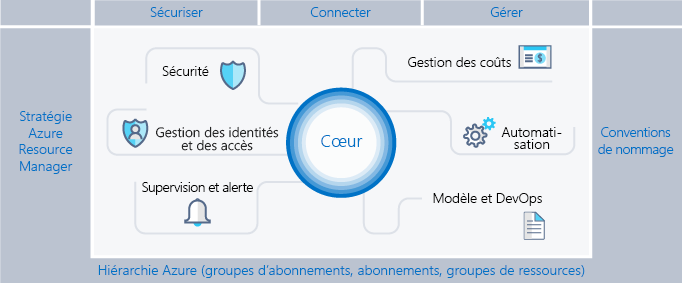
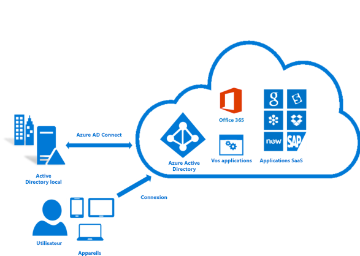
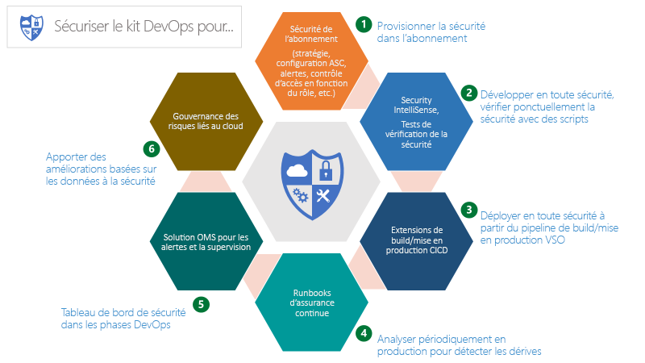
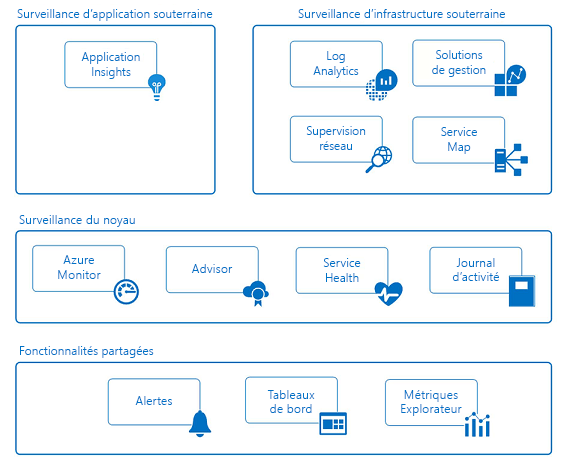

# Structure d’entreprise Azure : Gouvernance normative de l’abonnementAzure enterprise scaffold: Prescriptive subscription governance

Les entreprises adoptent de plus en plus le cloud public en raison de son agilité et de la flexibilité.Enterprises are increasingly adopting the public cloud for its agility and flexibility. Elles se servent des points forts du cloud pour générer des revenus et optimiser l’utilisation des ressources dans le cadre de leur activité.They utilize the cloud's strengths to generate revenue and optimize resource usage for the business. Microsoft Azure offre une multitude de services et de fonctionnalités que les entreprises assemblent comme des modules pour gérer un large éventail de charges de travail et d’applications.Microsoft Azure provides a multitude of services and capabilities that enterprises assemble like building blocks to address a wide array of workloads and applications.

Décider d’utiliser Microsoft Azure n’est que la première étape pour bénéficier de l’avantage du cloud.Deciding to use Microsoft Azure is only the first step to achieving the benefit of the cloud. La deuxième étape consiste à comprendre comment l’entreprise peut utiliser Azure efficacement et identifier les fonctionnalités de base qui doivent être présentes pour répondre à certaines questions comme :The second step is understanding how the enterprise can effectively use Azure and identify the baseline capabilities that need to be in place to address questions like:

* « Je suis inquiet au sujet de la souveraineté des données ; comment puis-je m’assurer que mes données et systèmes répondent à notre réglementation ? »"I'm concerned about data sovereignty; how can I ensure that my data and systems meet our regulatory requirements?"
* « Comment savoir ce que chaque ressource prend en charge afin de les comptabiliser et de les facturer avec exactitude ? »"How do I know what every resource is supporting so I can account for it and bill it back accurately?"
* « Je veux m’assurer que tout ce que nous déployons ou faisons dans le cloud public le soit d’abord dans un souci de sécurité ; comment faire pour faciliter cela ? »"I want to make sure that everything we deploy or do in the public cloud starts with the mindset of security first, how do I help facilitate that?"

La perspective d’un abonnement vide sans garde-fou est décourageante.The prospect of an empty subscription with no guard rails is daunting. Elle peut même vous décourager de migrer vers Azure.This blank space can hamper your move to Azure.

Cet article offre aux techniciens un point de départ qui leur permettra de répondre aux besoins de gouvernance et de les mettre en balance avec les besoins d’agilité.This article provides a starting point for technical professionals to address the need for governance and balance it with the need for agility. Il présente le concept d’une structure d’entreprise qui guide les organisations dans l’implémentation et la gestion sécurisées de leurs environnements Azure.It introduces the concept of an enterprise scaffold that guides organizations in implementing and managing their Azure environments in a secure way. Il fixe le cadre pour développer des contrôles efficaces et efficients.It provides the framework to develop effective and efficient controls.

## Besoin de gouvernanceNeed for governance

Lors de la migration vers Azure, vous devez prendre en compte la gouvernance assez tôt pour garantir une utilisation efficace du cloud au sein de l’entreprise.When moving to Azure, you must address the topic of governance early to ensure the successful use of the cloud within the enterprise. Hélas, compte tenu du temps et de la bureaucratie que nécessite la création d’un système de gouvernance complet, certaines divisions en appellent directement à des fournisseurs sans passer par le service informatique de l’entreprise.Unfortunately, the time and bureaucracy of creating a comprehensive governance system means some business groups go directly to providers without involving enterprise IT. Cette approche peut exposer l’entreprise à des risques si les ressources ne sont pas gérées correctement.This approach can leave the enterprise open to compromise if the resources are not properly managed. Les caractéristiques du cloud public (agilité, la flexibilité et tarification basée sur la consommation) sont importantes pour les groupes professionnels qui doivent répondre rapidement aux demandes des clients (internes et externes).The characteristics of the public cloud - agility, flexibility, and consumption-based pricing - are important to business groups that need to quickly meet the demands of customers (both internal and external). Mais le service informatique de l’entreprise doit s’assurer que les données et les systèmes sont efficacement protégés.But, enterprise IT needs to ensure that data and systems are effectively protected.

Dans la construction, la structure sert de fondations.When creating a building, scaffolding is used to create the basis of a structure. La structure trace les grandes lignes et fournit des points d’ancrage pour le montage de systèmes plus permanents.The scaffold guides the general outline and provides anchor points for more permanent systems to be mounted. Une structure d’entreprise revient au même : il s’agit d’un ensemble de contrôles flexibles et de fonctionnalités Azure qui fournissent la structure de l’environnement et des points d’ancrage pour les services basés sur le cloud public.An enterprise scaffold is the same: a set of flexible controls and Azure capabilities that provide structure to the environment, and anchors for services built on the public cloud. Elle fournit aux constructeurs (groupes informatiques et commerciaux) une assise pour créer et lier de nouveaux services en gardant à l’esprit la rapidité de livraison.It provides the builders (IT and business groups) a foundation to create and attach new services keeping speed of delivery in mind.

Elle est basée sur des pratiques que nous avons développées au cours de nos nombreuses collaborations avec des clients de tailles diverses.The scaffold is based on practices we have gathered from many engagements with clients of various sizes. Nous comptons parmi ces clients aussi bien des petites entreprises développant des solutions dans le cloud que de grandes multinationales et des éditeurs de logiciels indépendants qui migrent des charges de travail et développent des solutions cloud natives.Those clients range from small organizations developing solutions in the cloud to large multi-national enterprises and independent software vendors who are migrating workloads and developing cloud-native solutions. La structure d’entreprise a été spécialement conçue pour offrir une flexibilité permettant de prendre en charge les charges de travail informatiques traditionnelles et les charges de travail agiles, comme quand les développeurs créent des applications SaaS (software-as-a-service) basées sur les fonctionnalités de la plateforme Azure.The enterprise scaffold is "purpose-built" to be flexible to support both traditional IT workloads and agile workloads; such as, developers creating software-as-a-service (SaaS) applications based on Azure platform capabilities.

La structure d’entreprise constitue le fondement de chaque nouvel abonnement dans Azure.The enterprise scaffold is intended to be the foundation of each new subscription within Azure. Elle permet aux administrateurs de s’assurer que les charges de travail répondent à la configuration requise minimale en matière de gouvernance d’une organisation sans empêcher les groupes professionnels et les développeurs d’atteindre rapidement leurs objectifs.It enables administrators to ensure workloads meet the minimum governance requirements of an organization without preventing business groups and developers from quickly meeting their own goals. Notre expérience montre qu’elle a pour effet non pas d’empêcher la croissance du cloud public, mais de l’accélérer considérablement.Our experience shows that this greatly speeds, rather than impedes, public cloud growth.

> [!NOTE]
> Microsoft a publié en préversion une nouvelle fonctionnalité appelée [Azure Blueprints](/azure/governance/blueprints/overview) qui vous permet d’empaqueter, gérer et déployer images, modèles, stratégies et autres scripts courants dans les abonnements et les groupes d’administration.Microsoft has released into preview a new capability called [Azure Blueprints](/azure/governance/blueprints/overview) that will enable you to package, manage, and deploy common images, templates, policies, and scripts across subscriptions and management groups. Cette fonctionnalité est le trait d’union entre l’objectif de la structure en tant que modèle de référence et le déploiement de ce modèle dans votre organisation.This capability is the bridge between the scaffold's purpose as reference model and deploying that model to your organization.
>
L’illustration suivante présente les composants de la structure.The following image shows the components of the scaffold. Celle-ci est basée sur un plan solide de la hiérarchie de gestion et des abonnements.The foundation relies on a solid plan for the management hierarchy and subscriptions. Les piliers en sont des stratégies Resource Manager et des normes d’affectation de noms fortes.The pillars consist of Resource Manager policies and strong naming standards. Le reste de la structure est constitué des fonctionnalités Azure de base qui habilitent et connectent un environnement sécurisé et facile à gérer.The rest of the scaffold are core Azure capabilities and features that enable and connect a secure and manageable environment.

## Définition de votre hiérarchieDefine your hierarchy

La structure a pour assise la hiérarchie et la relation de l’Accord de Mise en Œuvre Entreprise Azure à travers les abonnements et les groupes de ressources.The foundation of the scaffold is the hierarchy and relationship of the Azure Enterprise Enrollment through to subscriptions and resource groups. L’Accord de Mise en Œuvre Entreprise définit la forme et l’utilisation des services Azure au sein de votre entreprise d’un point de vue conceptuel.The enterprise enrollment defines the shape and use of Azure services within your company from a contractual point of view. Dans le cadre du Contrat Entreprise, vous pouvez subdiviser l’environnement en services, en comptes et finalement en abonnements et en groupes de ressources à l’image de la structure de votre organisation.Within the enterprise agreement, you can further subdivide the environment into departments, accounts, and finally, subscriptions and resource groups to match your organization's structure.

Un abonnement Azure est l’unité de base contenant toutes les ressources.An Azure subscription is the basic unit where all resources are contained. Il définit aussi plusieurs limites au sein d’Azure, comme le nombre de cœurs, de réseaux virtuels et d’autres ressources.It also defines several limits within Azure, such as number of cores, virtual networks and other resources. Les groupes de ressources Azure servent à affiner le modèle d’abonnement et permettent un regroupement plus naturel des ressources.Azure Resource Groups are used to further refine the subscription model and enable a more natural grouping of resources.

Chaque entreprise est différente et la hiérarchie représentée dans l’illustration ci-dessus autorise une grande flexibilité quant à la façon dont Azure est organisé au sein de votre entreprise.Every enterprise is different and the hierarchy in the above image allows for significant flexibility in how Azure is organized within your company. La modélisation de votre hiérarchie en fonction des besoins de votre entreprise en matière de facturation, de gestion des ressources et d’accès à celles-ci constitue la première &mdash; et la plus importante &mdash; des décisions à prendre au moment de se lancer dans le cloud public.Modeling your hierarchy to reflect the needs of your company for billing, resource management, and resource access is the first &mdash; and most important &mdash; decision you make when starting in the public cloud.

### Services et comptesDepartments and Accounts

Les trois modèles courants pour les inscriptions Azure sont :The three common patterns for Azure Enrollments are:

* Le modèle **fonctionnel**The **functional** pattern

    
* Le modèle **division**The **business unit** pattern

    
* Le modèle **géographique**The **geographic** pattern

    

Bien que chacun de ces modèles ait sa place, le modèle **division** est de plus en plus adopté pour sa souplesse quand il s’agit de modéliser le modèle de coût d’une organisation et de représenter l’étendue du contrôle.Though each of these patterns has its place, the **business unit** pattern is increasingly being adopted for its flexibility in modeling an organization's cost model as well as reflecting span of control. Le groupe Microsoft Core Engineering and Operations a créé un sous-ensemble du modèle **division** qui s’avère très efficace (niveaux **Fédéral**, **État** et **Local**).Microsoft Core Engineering and Operations group has created a sub-set of the **business unit** pattern that is very effective, modeled on **Federal**, **State**, and **Local**. (Pour plus d’informations, consultez [Organizing subscriptions and resource groups within the Enterprise](https://azure.microsoft.com/blog/organizing-subscriptions-and-resource-groups-within-the-enterprise/).)(For more information, see [Organizing subscriptions and resource groups within the Enterprise](https://azure.microsoft.com/blog/organizing-subscriptions-and-resource-groups-within-the-enterprise/).)

### Groupes d'administrationManagement Groups

Microsoft a récemment rendu publique une nouvelle façon de modéliser votre hiérarchie : [Groupes d’administration Azure](/azure/azure-resource-manager/management-groups-overview).Microsoft has recently released a new way of modeling your hierarchy: [Azure management groups](/azure/azure-resource-manager/management-groups-overview). Les groupes d’administration sont bien plus flexibles que les services et les comptes et peuvent être imbriqués sur six niveaux.Management groups are much more flexible than departments and accounts and can be nested up to six levels. Les groupes d’administration vous permettent de créer une hiérarchie distincte de votre hiérarchie de facturation, seulement dans une optique de gestion efficace des ressources.Management groups allow you to create a hierarchy that is separate from your billing hierarchy, solely for efficient management of resources. Les groupes d’administration permettent de reproduire une hiérarchie de facturation et c’est ce par quoi les entreprises commencent souvent.Management groups can mirror your billing hierarchy and often enterprises start that way. Cependant, la puissance des groupes d’administration se manifeste quand ils sont utilisés pour modéliser l’organisation dans laquelle des abonnements associés &mdash; qu’ils se trouvent où non dans la hiérarchie de facturation &mdash; sont regroupés avec la nécessité de leur attribuer des rôles communs, ainsi que des stratégies et des initiatives.However, the power of management groups is when you use them to model your organization where related subscriptions &mdash; regardless where they are in the billing hierarchy &mdash; are grouped together and need common roles assigned as well as policies and initiatives. Quelques exemples :A few examples:

* **Production/hors production**.**Production/Non-Production**. Certaines entreprises créent des groupes d’administration pour identifier leurs abonnements production et hors production.Some enterprises create management groups to identify their production and non-production subscriptions. Les groupes d’administration permettent à ces clients de gérer plus facilement les rôles et les stratégies. Par exemple, si un abonnement hors production peut octroyer aux développeurs un accès « contributeur », en production, ils ne bénéficie que d’un accès « lecteur ».Management groups allow these customers to more easily manage roles and policies, for example: non-production subscription may allow developers "contributor" access, but in production, they have only "reader" access.
* **Services internes/services externe**.**Internal Services/External Services**. À l’instar des abonnements production/hors production, les entreprises ont souvent des exigences, des stratégies et des rôles différents pour les services internes et les services externes (destinés aux clients).Much like Production/Non-Production, enterprises often have different requirements, policies and roles for internal services vs external (customer facing) services.

Des groupes d’administration bien pensés constituent, avec une stratégie et des initiatives Azure, l’élément central d’une gouvernance efficace d’Azure.Well thought out management groups are, along with Azure Policy and Initiatives the backbone of efficient governance of Azure.

### AbonnementsSubscriptions

Quand vous êtes amené à prendre des décisions concernant vos services et comptes (ou groupes d’administration), votre objectif premier est de diviser votre environnement Azure à l’image de votre organisation.When deciding on your Departments and Accounts (or management groups), you are primarily looking at how you're dividing up your Azure environment to match your organization. Or, vos décisions les plus importantes sont celles qui ont trait aux abonnements ; elles ont un impact sur la sécurité, la scalabilité et la facturation.Subscriptions, however, are where the real work happens and your decisions here impact security, scalability and billing.  De nombreuses organisations se servent des modèles suivants de guides :Many organizations look at the following patterns as their guides:

* **Application/Service** : Les abonnements représentent une application ou un service (portefeuille d’applications).**Application/Service**: Subscriptions represent an application or a service (portfolio of applications)
* **Cycle de vie** : Les abonnements représentent le cycle de vie d’un service, par exemple Production ou Développement.**Lifecycle**: Subscriptions represent a lifecycle of a service, such as Production or Development.
* **Service** : Les abonnements représentent les services de l’organisation.**Department**: Subscriptions represent departments in the organization.

Les deux premiers modèles sont les plus couramment utilisés et sont fortement recommandés.The first two patterns are the most commonly used, and both are highly recommended. L’approche Cycle de vie convient pour la plupart des organisations.The Lifecycle approach is appropriate for most organizations. Dans ce cas, la recommandation générale est d’utiliser deux abonnements de base,In this case, the general recommendation is to use two base subscriptions. « Production » et « Hors production », puis d’utiliser des groupes de ressources pour segmenter davantage les environnements."Production" and "Non-Production," and then use resource groups to break out the environments further.

### Groupes de ressourcesResource groups

Azure Resource Manager vous permet de placer les ressources dans des groupes explicites pour la gestion, la facturation ou l’affinité naturelle.Azure Resource Manager enables you to put resources into meaningful groups for management, billing, or natural affinity. Les groupes de ressources sont des conteneurs de ressources qui ont un cycle de vie commun ou partagent un attribut comme, par exemple, « tous les serveurs SQL » ou « Application A ».Resource groups are containers of resources that have a common life cycle or share an attribute such as "all SQL servers" or "Application A".

Les groupes de ressources ne peuvent pas être imbriqués et les ressources ne peuvent appartenir qu’à un seul groupe de ressources.Resource groups can't be nested, and resources can only belong to one resource group. Certaines actions peuvent agir sur toutes les ressources contenues dans un groupe de ressources.Some actions can act on all resources in a resource group. Par exemple, la suppression d’un groupe de ressources supprime toutes les ressources du groupe de ressources.For example, deleting a resource group removes all resources within the resource group. Comme pour les abonnements, il existe des modèles communs quand il s’agit de créer des groupes de ressources, qui vont des charges de travail « Informatique traditionnelle » aux charges de travail de type « Informatique agile » :Like subscriptions, there are common patterns when creating resource groups and will vary from "Traditional IT" workloads to "Agile IT" workloads:

* Les charges de travail de type « informatique traditionnelle » sont généralement regroupées par éléments au sein d’un même cycle de vie, par exemple une application."Traditional IT" workloads are most commonly grouped by items within the same life cycle, such as an application. Le regroupement par application permet de gestion des applications individuelles.Grouping by application allows for individual application management.
* Les charges de travail de type « agile » ont tendance à se concentrer sur les applications cloud pour les clients externes."Agile IT" workloads tend to focus on external customer-facing cloud applications. Les groupes de ressources reflètent souvent les couches de déploiement (comme les couches Web et Application) et de gestion.The resource groups often reflect the layers of deployment (such as Web Tier, App Tier) and management.

> [!NOTE]
> Comprendre votre charge de travail vous aide à développer une stratégie de groupe de ressources.Understanding your workload helps you develop a resource group strategy. Ces modèles peuvent être combinés et associés.These patterns can be mixed and matched. Par exemple, la présence d’un groupe de ressources de services partagés dans le même abonnement que les groupe de ressources « Agile ».For example, a shared services resource group in the same subscription as "Agile" resource groups.

## Normes d’attribution de nomsNaming standards

Le premier pilier de la structure est une norme d’attribution de noms cohérente.The first pillar of the scaffold is a consistent naming standard. Des normes d’attribution de noms bien conçues vous permettent d’identifier des ressources dans le portail, sur une facture et dans des scripts.Well-designed naming standards enable you to identify resources in the portal, on a bill, and within scripts. Vous disposez déjà probablement de conventions d’attribution de noms pour l’infrastructure locale.You likely already have existing naming standards for on-premises infrastructure. Lorsque vous ajoutez Azure à votre environnement, vous devez étendre ces normes d’attribution de noms à vos ressources Azure.When adding Azure to your environment, you should extend those naming standards to your Azure resources.

> [!TIP]
> Pour les conventions de dénomination :For naming conventions:
> * Passez en revue et adoptez autant que possible les [modèles et pratiques recommandées](https://docs.microsoft.com/en-us/azure/architecture/best-practices/naming-conventions).Review and adopt where possible the [Patterns and Practices guidance](https://docs.microsoft.com/en-us/azure/architecture/best-practices/naming-conventions). Ces recommandations vous aident à choisir une norme d’attribution de noms explicite et fournissent de nombreux exemples.This guidance helps you decide on a meaningful naming standard and provides extensive examples.
> * Utilisation de stratégies Resource Manager pour appliquer des normes d’affectation de nomsUsing Resource Manager Policies to help enforce naming standards
>
>Ne perdez pas de vue qu’il est difficile de changer les noms par la suite et que les quelques minutes passées ici vous éviterons des problèmes plus tard.Remember that it's difficult to change names later, so a few minutes now will save you trouble later.

Vos normes d’affectation de noms doivent viser les ressources les plus utilisées et recherchées.Concentrate your naming standards on those resources that are more commonly used and searched for.  Par exemple, tous les groupes de ressources doivent suivre une norme bien définie par souci de clarté.For example, all resource groups should follow a strong standard for clarity.

### Balises de ressourceResource Tags

Les balises de ressource sont en parfaite adéquation avec les normes d’affectation de noms.Resource tags are tightly aligned with naming standards. Plus vous ajoutez des ressources aux abonnement, plus il est important de les classer logiquement pour les besoins de la facturation, de la gestion et de l’exploitation.As resources are added to subscriptions, it becomes increasingly important to logically categorize them for billing, management, and operational purposes. Pour plus d’informations, consultez [Organisation des ressources Azure à l’aide de balises](https://docs.microsoft.com/en-us/azure/azure-resource-manager/resource-group-using-tags).For more information, see [Use tags to organize your Azure Resource](https://docs.microsoft.com/en-us/azure/azure-resource-manager/resource-group-using-tags).

> [!IMPORTANT]
> Les balises peuvent contenir des informations personnelles et être visées par les dispositions du RGPD.Tags can contain personal information and may fall under the regulations of GDPR. Planifiez soigneusement la gestion de vos balises.Plan for management of your tags carefully. Si vous êtes en quête d’informations générales sur le RGPD, consultez la section RGPD du [portail Service Trust](https://servicetrust.microsoft.com/ViewPage/GDPRGetStarted).If you're looking for general info about GDPR, see the GDPR section of the [Service Trust Portal](https://servicetrust.microsoft.com/ViewPage/GDPRGetStarted).

Au-delà de la facturation et de la gestion, les balises sont utilisées de diverses manières.Tags are used in many ways beyond billing and management. Elles sont souvent employées dans le cadre de l’automation (consultez la section ultérieure).They are often used as part of automation (see later section). Cet aspect doit être pris en considération en amont au risque de provoquer des conflits.This can cause conflicts if not considered up front. Il est recommandé d’identifier toutes les balises courantes au niveau de l’entreprise (par exemple, ApplicationOwner, CostCenter) et de les appliquer systématiquement au moment de déployer les ressources à l’aide de l’automation.The recommended practice is to identify all the common tags at the enterprise level (such as ApplicationOwner, CostCenter) and apply them consistently when deploying resources using automation.

## Stratégie et initiatives AzureAzure Policy and Initiatives

Le deuxième pilier de la structure consiste à utiliser une [stratégie et des initiatives Azure](/azure/azure-policy/azure-policy-introduction) pour gérer les risques en appliquant des règles (avec des effets) sur les ressources et les services de vos abonnements.The second pillar of the scaffold involves using [Azure Policy and Initiatives](/azure/azure-policy/azure-policy-introduction) to manage risk by enforcing rules (with effects) over the resources and services in your subscriptions. Les initiatives Azure sont des collections de stratégies visant à atteindre un objectif unique.Azure Initiatives are collections of policies that are designed to achieve a single goal. Une stratégie et des initiatives Azure sont alors affectées à une étendue de ressources pour commencer la mise en œuvre des stratégies spécifiques.Azure policy and initiatives are then assigned to a resource scope to begin enforcement of the particular policies.

La stratégie et les initiatives Azure sont encore plus efficaces quand elles sont associées aux groupes d’administration mentionnés précédemment.Azure Policy and Initiatives are even more powerful when used with the management groups mentioned earlier. Les groupes d’administration permettent d’affecter une initiative ou une stratégie à tout un ensemble d’abonnements.Management groups enable the assignment of an initiative or policy to an entire set of subscriptions.

### Utilisations courantes de stratégies Resource ManagerCommon uses of Resource Manager policies

Les stratégies et les initiatives Azure représentent un outil puissant dans le kit de ressources Azure.Azure policies and initiatives are a powerful tool in the Azure toolkit. Les stratégies permettent aux entreprises de fournir des contrôles pour les charges de travail de type « Informatique traditionnelle » et ainsi d’apporter aux applications métier la stabilité dont elles ont besoin tout en autorisant aussi les charges de travail de type « Agile ». Cela permet, par exemple, de développer des applications client sans exposer l’entreprise à des risques supplémentaires.Policies allow companies to provide controls for "Traditional IT" workloads that enable the stability that is needed for LOB applications while also allowing "Agile" workloads; such as, developing customer applications without opening up the enterprise to additional risk. Les modèles les plus courants pour les stratégies sont les suivants :The most common patterns we see for policies are:

* **Conformité géographique/souveraineté des données**.**Geo-compliance/data sovereignty**. Azure dispose d’une liste de régions dans le monde qui ne cesse de s’allonger.Azure has an ever-growing list of regions across the world. Les entreprises doivent souvent faire en sorte que les ressources situées dans une étendue particulière restent dans une région géographique pour répondre à des exigences réglementaires.Enterprises often need to ensure that resources in a particular scope remain in a geographic region to address regulatory requirements.
* **Éviter une exposition publique des serveurs**.**Avoid exposing servers publicly**. Une stratégie Azure peut interdire le déploiement de certains types de ressources.Azure policy can prohibit the deployment of certain resources types. Il est fréquent par exemple de créer une stratégie pour interdire la création d’une adresse IP publique dans une étendue particulière et ainsi éviter d’exposer involontairement un serveur sur Internet.A common use is to create a policy to deny the creation of a public IP within a particular scope, avoiding un-intended exposure of a server to the internet.
* **Gestion des coûts et métadonnées**.**Cost Management and Metadata**. Les balises de ressource sont souvent utilisées pour ajouter des données de facturation importantes aux ressources et groupes de ressources comme CostCenter, Owner, etc.Resource tags are often used to add important billing data to resources and resource groups such as CostCenter, Owner and more. Ces balises sont extrêmement utiles pour une facturation et une gestion des ressources précises.These tags are invaluable for accurate billing and management of resources. Les stratégies peuvent imposer l’application de balises de ressource à toutes les ressources déployées, ce qui en facilite la gestion.Policies can enforce the application of resources tags to all deployed resource, making it easier to manage.

### Usages courants des initiativesCommon uses of initiatives

L’introduction des initiatives a permis aux entreprises de regrouper les stratégies logiques et de les suivre dans leur globalité.The introduction of initiatives provided enterprises a way to group logical policies together and track as a whole. Les initiatives permettent à l’entreprise de mieux répondre aux besoins des charges de travail de type « agile » et « traditionnelle ».Initiatives further support the enterprise to address the needs of both "agile" and "traditional" workloads. Les initiatives sont parfois utilisées de façon très créative, mais voici les usages les plus courants :We have seen very creative uses of initiatives, but commonly we see:

* **Habilitation de la supervision dans Azure Security Center**.**Enable monitoring in Azure Security Center**. Il s’agit d’une initiative par défaut dans Azure Policy qui illustre parfaitement ce qu’est une initiative.This is a default initiative in the Azure Policy and an excellent example of what initiative are. Elle habilite les stratégies qui identifient les bases de données SQL non chiffrées, les vulnérabilités des machines virtuelles et des besoins plus courants liés à la sécurité.It enables policies that identify un-encrypted SQL databases, VM vulnerabilities and more common security related needs.
* **Initiative spécifique de nature réglementaire**.**Regulatory specific initiative**. Les entreprises regroupent souvent les stratégies courantes dans une exigence réglementaire (comme HIPAA) de sorte que les contrôles et la conformité vis-à-vis de ces contrôles soient suivis avec efficacité.Enterprises often group policies common to a regulatory requirement (such as HIPAA) so that controls and compliancy to those controls are tracked efficiently.
* **Types de ressources et références SKU**.**Resource Types & SKUs**. La création d’une initiative qui limite les types de ressources et les références SKU pouvant être déployés peut aider à contrôler les coûts et à garantir à votre organisation qu’elle déploie uniquement des ressources que votre équipe peut prendre en charge compte tenu de ses compétences et de ses procédures.Creating an initiative that restricts the types of resources that can be deployed as well as the SKUs that can be deployed can help to control costs and ensure your organization is only deploying resources that your team have the skillset and procedures to support.

> [!TIP]
> Nous vous recommandons de toujours utiliser des définitions d’initiative plutôt que des définitions de stratégie.We recommend you always use initiative definitions instead of policy definitions. Après avoir affecté une initiative à une étendue, comme un abonnement ou un groupe d’administration, vous pouvez facilement ajouter une autre stratégie à l’initiative sans avoir à modifier les affectations.After assigning an initiative to a scope, such as subscription or management group, you can easily add another policy to the initiative without having to change any assignments. Il est ainsi bien plus facile de comprendre ce qui est appliqué et de suivre la conformité.This makes understanding what is applied and tracking compliance far easier.

### Affectations de stratégies et d’initiativesPolicy and Initiative assignments

Après avoir créé des stratégies et les avoir regroupées sous forme d’initiatives logiques, vous devez affecter la stratégie à une étendue, qu’il s’agisse d’un groupe d’administration, d’un abonnement ou même d’un groupe de ressources.After the creation of policies and grouping them into logical initiatives you must assign the policy to a scope, whether it is a management group, a subscription or even a resource group. Les affectations vous permettent aussi d’exclure une sous-étendue de l’affectation d’une stratégie.Assignments allow you to also exclude a sub-scope from the assignment of a policy. Par exemple, si vous interdisez la création d’adresses IP publiques au sein d’un abonnement, vous pouvez créer une affectation en excluant un groupe de ressources connecté à votre zone DMZ protégée.For example, if you deny the creation of public IPs within a subscription, you could create an assignment with an exclusion for a resource group connected to your protected DMZ.

Vous trouverez dans ce dépôt [GitHub](https://github.com/Azure/azure-policy) plusieurs exemples de stratégies qui montrent comment une stratégie et des initiatives peuvent être appliquées à diverses ressources dans Azure.You will find several Policy examples that show how Policy and Initiatives can be applied to various resources within Azure on this [GitHub](https://github.com/Azure/azure-policy) repository.

## Gestion de l’identité et de l’accèsIdentity and access management

Quand vous vous lancez dans le cloud public, vous devez en premier lieu vous poser les questions suivantes : « qui doit avoir accès aux ressources ? »One of the first, and most crucial, questions you ask yourself when starting with the public cloud is "who should have access to resources?" et « comment contrôler cet accès ? ».and "how do I control this access?" Pour assurer la réussite et la sécurité à long terme de vos ressources dans le cloud, il est indispensable d’autoriser ou d’interdire l’accès au portail Azure et de contrôler l’accès aux ressources dans le portail.Allowing or disallowing access to the Azure portal, and controlling access to resources in the portal is critical to the long term success and safety of your assets in the cloud.

Pour sécuriser l’accès à vos ressources, vous devez configurer d’abord votre fournisseur d’identité, puis les rôles et l’accès.To accomplish the task of securing access to your resources you will first configure your identity provider and then configure Roles and access. Azure Active Directory (Azure AD), connecté à votre instance Active Directory locale, est la pierre angulaire d’Azure Identity.Azure Active Directory (Azure AD), connected to your on-premises Active Directory, is the foundation of Azure Identity. Ceci dit, Azure AD n’est *pas* Active Directory et il est important que vous compreniez ce qu’est un locataire Azure AD et comment il est lié votre inscription Azure.That said, Azure AD is *not* Active Directory and it's important to understand what an Azure AD tenant is and how it relates to your Azure enrollment.  Consultez les [informations](../getting-started/azure-resource-access.md) disponibles pour acquérir des bases solides sur Azure AD et AD.Review the available [information](../getting-started/azure-resource-access.md) to gain a solid foundation on Azure AD and AD. Pour connecter et synchroniser votre instance Active Directory à Azure AD, installez et configurez l’[outil AD Connect](/azure/active-directory/connect/active-directory-aadconnect) localement.To connect and synchronize your Active Directory to Azure AD, install and configure the [AD Connect tool](/azure/active-directory/connect/active-directory-aadconnect) on-premises.

Quand Azure a été initialement lancé, les contrôles d’accès à un abonnement étaient élémentaires : Administrateur ou coadministrateur.When Azure was initially released, access controls to a subscription were basic: Administrator or Co-Administrator. L’accès à un abonnement dans le modèle classique impliquait l’accès à toutes les ressources dans le portail.Access to a subscription in the Classic model implied access to all the resources in the portal. Ce manque de contrôle précis a conduit à une prolifération d’abonnements afin de fournir un niveau de contrôle d’accès raisonnable pour une inscription Azure.This lack of fine-grained control led to the proliferation of subscriptions to provide a level of reasonable access control for an Azure Enrollment. Cette prolifération d’abonnements n’est plus nécessaire.This proliferation of subscriptions is no longer needed. Le contrôle d’accès en fonction du rôle (RBAC) vous permet d’affecter les utilisateurs à des rôles standard qui offrent un accès courant, tel que « propriétaire », « collaborateur » ou « lecteur ». Vous pouvez même créer vos propres rôles.With role-based access control (RBAC), you can assign users to standard roles that provide common access such as "owner", "contributor" or "reader" or even create your own roles

Lorsque vous implémentez l’accès en fonction du rôle, vous avez tout intérêt à suivre les recommandations suivantes :When implementing role-based access, the following are highly recommended:

* Veillez sur l’administrateur/coadministrateur d’un abonnement, car ces rôles ont des autorisations étendues.Control the Administrator/Co-Administrator of a subscription as these roles have extensive permissions. Seul le propriétaire de l’abonnement doit être ajouté comme coadministrateur s’il doit gérer des déploiements Azure Classic.You only need to add the Subscription Owner as a Co-administrator if they need to managed Azure Classic deployments.

* Utilisez des groupes d’administration pour attribuer des [rôles](/azure/azure-resource-manager/management-groups-overview#management-group-access) dans plusieurs abonnements et éviter d’avoir à les gérer au niveau de l’abonnement.Use Management Groups to assign [roles](/azure/azure-resource-manager/management-groups-overview#management-group-access) across multiple subscriptions and reduce the burden of managing them at the subscription level.
* Ajoutez des utilisateurs Azure à un groupe (par exemple, les propriétaires de l’application X) dans Active Directory.Add Azure users to a group (for example, Application X Owners) in Active Directory. Utilisez le groupe synchronisé pour affecter aux membres de groupes les droits nécessaires pour gérer le groupe de ressources contenant l’application.Use the synced group to provide group members the appropriate rights to manage the resource group containing the application.
* Suivez le principe de l’octroi des **privilèges minimum** nécessaires pour exécuter le travail prévu.Follow the principle of granting the **least privilege** required to do the expected work.

> [!IMPORTANT]
>Envisagez d’utiliser les fonctionnalités [Azure AD Privileged Identity Management](/azure/active-directory/privileged-identity-management/pim-configure), Azure [Multi-Factor Authentication](/azure/active-directory/authentication/howto-mfa-getstarted) et l’[accès conditionnel](/azure/active-directory/active-directory-conditional-access-azure-portal) pour améliorer la sécurité et la visibilité des actions d’administration dans vos abonnements Azure.Consider using [Azure AD Privileged Identity Management](/azure/active-directory/privileged-identity-management/pim-configure), Azure [Multi-Factor Authentication](/azure/active-directory/authentication/howto-mfa-getstarted) and [Conditional Access](/azure/active-directory/active-directory-conditional-access-azure-portal) capabilities to provide better security and more visibility to administrative actions across your Azure subscriptions. Ces fonctionnalités sont celles d’une licence Azure AD Premium valide (selon le cas) et visent à mieux sécuriser et gérer votre identité.These capabilities come from a valid Azure AD Premium license (depending on the feature) to further secure and manage your identity. Azure AD PIM permet un accès administratif « juste-à-temps » avec le workflow d’approbation, ainsi qu’un audit complet des activations et des activités d’administrateur.Azure AD PIM enables "Just-in-Time" administrative access with approval workflow, as well as a full audit of administrator activations and activities. Azure MFA est une autre fonctionnalité critique qui permet une vérification en deux étapes pour se connecter au portail Azure.Azure MFA is another critical capability and enables two-step verification for login to the Azure portal. En l’associant aux contrôles d’accès conditionnel, vous pouvez gérer efficacement vos risques de compromission.When combined with Conditional Access Controls you can effectively manage your risk of compromise.

L’une des meilleures stratégies d’atténuation des risques que vous puissiez adopter et qui devrait être considérée comme obligatoire pour chaque déploiement consiste à planifier et à préparer vos contrôles d’identité et d’accès et à suivre les bonnes pratiques de gestion des identités Azure ([lien](/azure/security/azure-security-identity-management-best-practices)).Planning and preparing for your identity and access controls and following Azure Identity Management best practice ([link](/azure/security/azure-security-identity-management-best-practices)) is one of the best risk mitigation strategies that you can employ and should be considered mandatory for every deployment.

## SécuritéSecurity

Les inquiétudes vis-à-vis de la sécurité constituent traditionnellement l’un des principaux obstacles à l’adoption du cloud.One of the biggest blockers to cloud adoption traditionally has been concerns over security. Les gestionnaires du risque informatique et les services de sécurité ont besoin de vérifier que les ressources dans Azure sont protégées et sécurisées par défaut.IT risk managers and security departments need to ensure that resources in Azure are protected and secure by default. Azure offre un certain nombre de fonctionnalités qui permettent de protéger les ressources et de détecter/empêcher les menaces qui pèsent sur ces ressources.Azure provides a number of capabilities that you can leverage to protect resources and detect/prevent threats against those resources.

### Azure Security CenterAzure Security Center

Outre des fonctionnalités de protection avancée contre les menaces, [Azure Security Center](/azure/security-center/security-center-intro) offre une vue unifiée de l’état de la sécurité des ressources dans votre environnement.The [Azure Security Center](/azure/security-center/security-center-intro) provides a unified view of the security status of resources across your environment in addition to advanced threat protection. Azure Security Center est une plateforme ouverte qui permet aux partenaires de Microsoft de créer des logiciels qui s’y connectent et améliorent ses fonctionnalités.Azure Security Center is an open platform that enables Microsoft partners to create software that plugs into and enhance its capabilities. Les fonctionnalités de base d’Azure Security Center (niveau gratuit) évaluent votre sécurité et vous donnent des conseils pour l’améliorer.The baseline capabilities of Azure Security Center (free tier) provides assessment and recommendations that will enhance your security posture. Aux niveaux payants, vous bénéficiez d’autres fonctionnalités appréciables comme l’accès administrateur juste-à-temps et les contrôles d’application adaptatifs (mise en liste verte).Its paid tiers enable additional and valuable capabilities such as Just In Time admin access and adaptive application controls (whitelisting).

> [!TIP]
>Azure Security Center est un outil très puissant qui est constamment amélioré avec l’ajout de nouvelles fonctionnalités pour vous permettre de détecter les menaces et de protéger votre entreprise.Azure security center is a very powerful tool that is constantly being enhanced and incorporating new capabilities you can leverage to detect threats and protect your enterprise. Il est fortement recommandé de toujours activer ASC.It is highly recommended to always enable ASC.

### Verrous de ressource AzureAzure resource locks

Plus votre organisation ajoute des services de base aux abonnements, plus il est important d’éviter une interruption de service.As your organization adds core services to subscriptions it becomes increasingly important to avoid business disruption. Un type d’interruption que nous observons souvent est la conséquence inattendue de la suppression accidentelle de ressources par des scripts et des outils utilisés avec un abonnement Azure.One type of disruption that we often see is unintended consequences of scripts and tools working against an Azure subscription deleting resources mistakenly. Les [verrous de ressource](/azure/azure-resource-manager/resource-group-lock-resources) vous permettent de limiter les opérations sur les ressources importantes au cas où leur suppression ou leur modification aurait un impact significatif.[Resource Locks](/azure/azure-resource-manager/resource-group-lock-resources) enable you to restrict operations on high-value resources where modifying or deleting them would have a significant impact. Les verrous peuvent s’appliquer à un abonnement, un groupe de ressources ou même des ressources individuelles.Locks are applied to a subscription, resource group, or even individual resources. Le cas d’utilisation courant consiste à appliquer des verrous aux ressources fondamentales que sont les réseaux virtuels, les passerelles, les groupes de sécurité réseau et les comptes de stockage de clés.The common use case is to apply locks to foundational resources such as virtual networks, gateways, network security groups and key storage accounts.

### Kit de ressources DevOps sécuriséSecure DevOps Toolkit

Le kit DevOps sécurisé (AzSK) est une collection de scripts, d’outils, d’extensions, d’automations et autres éléments qui a été créée à l’origine par la propre équipe informatique de Microsoft et publiée en OpenSource via Github ([lien](https://github.com/azsk/DevOpsKit-docs)).The "Secure DevOps Kit for Azure" (AzSK) is a collection of scripts, tools, extensions, automations, etc. originally created by Microsoft's own IT Team and released in OpenSource via Github ([link](https://github.com/azsk/DevOpsKit-docs)). AzSK répond aux besoins de sécurité de bout en bout des abonnements et des ressources pour les équipes qui ont recours à une automation étendue et qui intègrent graduellement la sécurité dans des flux de travail DevOps natifs, favorisant ainsi la sécurisation des tâches DevOps dans les 6 domaines suivants :AzSK caters to the end to end Azure subscription and resource security needs for teams using extensive automation and smoothly integrating security into native dev ops workflows helping accomplish secure dev ops with these 6 focus areas:

* Sécurisation de l’abonnementSecure the subscription
* Sécurisation du développementEnable secure development
* Intégration de la sécurité dans l’intégration et le déploiement en continuIntegrate security into CICD
* Assurance continueContinuous Assurance
* Génération d’alertes et supervisionAlerting & Monitoring
* Gouvernance des risques du cloudCloud Risk Governance

AzSK est un ensemble complet d’outils, de scripts et d’informations qui représente une part importante d’un plan de gouvernance Azure complet. Il est essentiel de l’incorporer dans votre structure de façon à aider votre organisation à atteindre ses objectifs en matière de gestion du risque.The AzSK is a rich set of tools, scripts and information that are an important part of a full Azure governance plan and incorporating this into your scaffold is crucial to supporting your organizations risk management goals

### Azure Update ManagementAzure Update Management

L’une des mesures clés que vous pouvez prendre pour assurer la sécurité de votre environnement est de veiller à ce que vos serveurs soient corrigés avec les dernières mises à jour.One of the key tasks you can do to keep your environment safe is ensure that your servers are patched with the latest updates. Bien que de nombreux outils permettent d’assurer cette tâche, Azure met à disposition la solution [Azure Update Management](/azure/automation/automation-update-management) pour gérer l’identification et le déploiement des correctifs critiques du système d’exploitation.While there are many tools to accomplish this, Azure provides the [Azure Update Management](/azure/automation/automation-update-management) solution to address the identification and rollout of critical OS patches.  Cette solution s’appuie sur Azure Automation, dont il est question dans la section [Automatiser](#automate), plus loin dans ce guide.It makes use of Azure Automation (which is covered in the [Automate](#automate) section, later in this guide.

## Supervision et génération d’alertesMonitor and alerts

La collecte et l’analyse des données de télémétrie, qui donnent des indications sur les activités, les performances, l’intégrité et la disponibilité des services que vous utilisez dans tous vos abonnements Azure, sont essentielles à la gestion proactive de vos applications et de votre infrastructure et représentent une nécessité incontournable pour chaque abonnement Azure.Collecting and analyzing telemetry that provides line of sight into the activities, performance metrics, health and availability of the services you are using across all of your Azure subscriptions is critical to proactively manage your applications and infrastructure and is a foundational need of every Azure subscription. Chaque service Azure émet des données de télémétrie qui prennent la forme de journaux d’activité, de métriques et de journaux de diagnostic.Every Azure service emits telemetry in the form of Activity Logs, Metrics and Diagnostic Logs.

* Les **journaux d’activité** décrivent toutes les opérations effectuées sur les ressources de vos abonnements.**Activity Logs** describe all operations performed on resources in your subscriptions
* Les **métriques** sont des informations numériques émises par une ressource qui décrivent les performances et l’intégrité de cette ressource.**Metrics** are numerical information emitted from within a resource that describe the performance and health of a resource
* Les **journaux de diagnostic** sont émis par un service Azure et fournissent des informations complètes et fréquentes sur le fonctionnement de ce service.**Diagnostic Logs** are emitted by an Azure service and provide rich, frequent data about the operation of that service.

Ces informations peuvent être visualisées et traitées à plusieurs niveaux et sont constamment améliorées.This information can be viewed and acted upon at multiple levels and are continually being improved. Azure propose des fonctionnalités **partagées**, **principales** et **approfondies** destinées à superviser les ressources Azure via les services présentés dans le schéma ci-dessous.Azure provides **shared**, **core** and **deep** monitoring capabilities of Azure resources through the services outlined in the diagram below.

### Fonctionnalités partagéesShared capabilities

* **Alertes** : Vous pouvez collecter chaque journal, événement et métrique auprès des ressources Azure, mais s’il n’est pas possible d’être notifié de l’existence de conditions et d’actions critiques, ces données peuvent uniquement être utilisées à des fins historiques et forensiques.**Alerts**: You can collect every log, event and metric from Azure resources, but without the ability to be notified of critical conditions and act, this data is only useful for historic purposes and forensics. Les alertes Azure vous notifient de façon proactive de l’existence de conditions que vous définissez dans toutes vos applications et votre infrastructure.Azure Alerts proactively notify you of conditions you define across all your applications and infrastructure. Vous créez des règles d’alerte pour les journaux, les événements et les métriques qui utilisent des groupes d’actions afin de notifier des ensembles de destinataires.You create alert rules across logs, events and metrics that use action groups to notify sets of recipients. Les groupes d’actions permettent aussi d’automatiser les corrections en utilisant des actions externes comme des webhooks pour exécuter des runbooks Azure Automation et Azure Functions.Action groups also provide the ability to automate remediation using external actions such as webhooks to run Azure Automation runbooks and Azure Functions.

* **Tableaux de bord** : Les tableaux de bord vous permettent d’agréger les vues de supervision et de combiner les données dans l’ensemble des ressources et des abonnements pour vous donner un aperçu de la télémétrie des ressources Azure à l’échelle de l’entreprise.**Dashboards**: Dashboards enable you to aggregate monitoring views and combine data across resources and subscriptions to give you an enterprise-wide view into the telemetry of Azure resources. Vous pouvez créer et configurer vos propres vues et les partager avec d’autres utilisateurs.You can create and configure your own views and share them with others. Par exemple, vous pouvez créer un tableau de bord constitué de plusieurs vignettes pour les différents administrateurs de base de données afin de fournir des informations dans tous les services de base de données Azure, notamment Azure SQL DB, Azure DDB pour PostgreSQL et Azure DB pour MySQL.For example, you could create a dashboard consisting of various tiles for DBAs to provide information across all Azure database services, including Azure SQL DB, Azure DB for PostgreSQL and Azure DB for MySQL.

* **Metrics Explorer** : Les métriques sont des valeurs numériques générées par les ressources Azure (par exemple % CPU, E/S de disque) qui fournissent des insights sur le fonctionnement et les performances de vos ressources.**Metrics Explorer**: Metrics are numerical values generated by Azure resources (e.g. % CPU, Disk I/O, that provide insight into the operation and performance of your resources. En utilisant Metrics Explorer, vous pouvez définir et envoyer les métriques qui vous intéressent à Log Analytics à des fins d’agrégation et d’analyse.By using Metrics Explorer you can define and send the metrics in which you are interested to Log Analytics for aggregation and analysis.

### Analyse principaleCore monitoring

* **Azure Monitor** : Azure Monitor est le service de plateforme principal qui fournit une seule source de supervision des ressources Azure.**Azure Monitor**: Azure Monitor is the core platform service that provides a single source for monitoring Azure resources. L’interface Azure Monitor du portail Azure offre un point d’accès centralisé à toutes les fonctionnalités de supervision d’Azure, notamment aux fonctionnalités de supervision approfondies d’Application Insights, de Log Analytics, de la supervision réseau, des solutions de gestion et de Service Map.The Azure Portal interface of Azure Monitor provides a centralized jump off point for all the monitoring features across Azure including the deep monitoring capabilities of Application Insights, Log Analytics, Network Monitoring, Management Solutions and Service Maps. Avec Azure Monitor, vous pouvez visualiser, interroger, acheminer, archiver et agir sur les métriques et les journaux issus des ressources Azure à l’échelle de votre domaine cloud.With Azure Monitor you can visualize, query, route, archive and act on the metrics and logs coming from Azure resources across your entire cloud estate. Outre le portail, vous pouvez récupérer les données par l’intermédiaire des applets de commande PowerShell Monitor, de l’interface de ligne de commande multiplateforme ou des API REST Azure Monitor.In addition to the portal you can retrieve data through the Monitor PowerShell Cmdlets, Cross Platform CLI or the Azure Monitor REST APIs.

* **Azure Advisor** : Azure Advisor supervise constamment les données de télémétrie de tous vos abonnements et environnements. Il fournit des suggestions sur les bonnes pratiques permettant d’optimiser vos ressources Azure pour faire des économies et améliorer les performances, la sécurité et la disponibilité des ressources qui composent vos applications.**Azure Advisor**: Azure Advisor constantly monitors telemetry across your subscriptions and environments and provides recommendations on best practices on how to optimize your Azure resources to save money and improve performance, security and availability of the resources that make up your applications.

* **Service Health** : Azure Service Health identifie les problèmes liés aux services Azure qui peuvent avoir un impact sur vos applications et vous aide à définir des fenêtres de maintenance planifiées.**Service Health**: Azure Service Health identifies any issues with Azure Services that may impact your applications as well as assists you in planning for scheduled maintenance windows.

* **Journal d’activité** : Le journal d’activité décrit toutes les opérations effectuées sur les ressources de votre abonnement.**Activity Log**: The Activity Log describes all operations on resources in your subscriptions. Il fournit une piste d’audit pour déterminer le « quoi », « qui, » et « quand » des opérations de création, de mise à jour et de suppression des ressources.It provides an audit trail to determine the 'what', 'who', and 'when' of any create, update, delete operation on resources. Les événements du journal d’activité sont stockés dans la plateforme et peuvent faire l’objet d’une requête pendant 90 jours.Activity Log events are stored in the platform and are available to query for 90 days. Vous pouvez intégrer les journaux d’activité à Log Analytics sur des périodes de rétention plus longues et pour des interrogations et des analyses plus approfondies sur diverses ressources.You can ingest Activity Logs into Log Analytics for longer retention periods and deeper querying and analysis across multiple resources.

### Analyse approfondie des applicationsDeep application monitoring

* **Application Insights** : Application Insights vous permet de collecter des données de télémétrie spécifiques à des applications, et de superviser les performances, la disponibilité et l’utilisation de ces applications dans le cloud ou localement**Application Insights**: Application Insights enables you to collect application specific telemetry and monitor the performance, availability and usage of applications in the cloud or on-premises. en instrumentant votre application avec des SDK pris en charge pour plusieurs langages, dont .NET, JavaScript, JAVA, Node.js, Ruby et Python.By instrumenting your application with supported SDKs for multiple languages including .NET, JavaScript, JAVA, Node.js, Ruby and Python. Les événements Application Insights sont intégrés dans le même magasin de données Log Analytics qui prend en charge la supervision de l’infrastructure et de la sécurité pour vous permettre de mettre en corrélation et d’agréger les événements dans le temps via un langage de requête élaboré.Application Insights events are ingested into the same Log Analytics data store that supports infrastructure and security monitoring to enable you to correlate and aggregate events over time through a rich query language.

### Analyse approfondie des infrastructuresDeep infrastructure monitoring

* **Log Analytics** : Log Analytics joue un rôle central dans la supervision Azure en collectant des données de télémétrie et d’autres données auprès de diverses sources et en fournissant un langage de requête et un moteur d’analytique qui vous donnent des insights sur le fonctionnement de vos applications et ressources.**Log Analytics**: Log Analytics plays a central role in Azure monitoring by collecting telemetry and other data from a variety of sources and providing a query language and analytics engine that gives you insights into the operation of your applications and resources. Vous pouvez interagir directement avec les données Log Analytics via des recherches dans les journaux et des vues hautement performantes ou utiliser les outils d’analyse d’autres services Azure qui stockent leurs données dans Log Analytics, comme Application Insights ou Azure Security Center.You can either interact directly with Log Analytics data through highly performant log searches and views, or you may use analysis tools in other Azure services that store their data in Log Analytics such as Application Insights or Azure Security Center.

* **Supervision réseau** : Les services de supervision réseau d’Azure vous permettent d’obtenir des insights sur le flux de trafic, les performances, la sécurité, la connectivité et les goulots d’étranglement du réseau.**Network Monitoring**: Azure's network monitoring services enable you to gain insight into network traffic flow, performance, security, connectivity and bottlenecks. Une conception réseau bien planifiée doit inclure la configuration des services de supervision réseau comme Network Watcher et le Moniteur ExpressRoute.A well-planned network design should include configuring Azure network monitoring services such as Network Watcher and ExpressRoute Monitor.

* **Solutions de gestion** : Les solutions de gestion sont des jeux empaquetés de logique, d’insights et de requêtes Log Analytics prédéfinies pour une application ou un service.**Management Solutions**: Management solutions are packaged sets of logic, insights and pre-defined Log Analytics queries for an application or service. Elles utilisent Log Analytics comme base de stockage et d’analyse des données d’événement.They rely on Log Analytics as the foundation to store and analyze event data. La supervision des conteneurs et l’analytique Azure SQL Database sont des exemples de solutions de gestion.Sample management solutions include monitoring containers and Azure SQL Database analytics.

* **Service Map** : Service Map offre une vue graphique de vos composants d’infrastructure, de leurs processus et de leurs interdépendances vis-à-vis d’autres ordinateurs et processus externes.**Service Map**: Service Map provides a graphical view into your infrastructure components, their processes and interdependencies on other computers and external processes. Il intègre les événements, les données de performances et les solutions de gestion dans Log Analytics.It integrates events, performance data and management solutions in Log Analytics.

> [!TIP]
> Avant de créer des alertes individuelles, créez et tenez à jour un ensemble de groupes d’actions partagés qui puisse être utilisé dans toutes les alertes Azure.Before creating individual alerts, create and maintain a set of shared Action Groups that can be used across Azure Alerts. Vous pourrez ainsi gérer de façon centralisée le cycle de vie de vos listes de destinataires, les méthodes de remise de notifications (e-mail, numéros de téléphone SMS) et les webhooks ciblant des actions externes (runbooks Azure Automation, Azure Functions / Logic Apps, ITSM).This will enable you to centrally maintain the lifecycle of your recipient lists, notification delivery methods (email, SMS phone numbers) and webhooks to external actions (Azure Automation runbooks, Azure Functions / Logic Apps, ITSM).

## la gestion des coûts ;Cost management

Un des changements majeurs auxquels vous serez confronté en passant d’un cloud local au cloud public est le passage de dépenses d’investissement (acheter du matériel) à des dépenses d’exploitation (payer pour le service que vous utilisez).One of the major changes that you will face when you move from on-premises cloud to the public cloud is the switch from capital expenditure (buying hardware) to operating expenditure (paying for service as you use it). Le passage de dépenses d’investissement à des dépenses d’exploitation s’accompagne aussi de la nécessité de gérer plus scrupuleusement les coûts.This switch from CAPEX to OPEX also brings the need to more carefully manage your costs. L’avantage du cloud est que vous pouvez agir foncièrement et positivement sur le coût d’un service que vous utilisez simplement en le désactivant (ou en le redimensionnant) quand vous n’en avez pas besoin.The benefit of the cloud is that you can fundamentally and positively impact the cost of a service you use by merely turning it off (or resizing) when it's not needed. La gestion délibérée des coûts dans le cloud est une pratique recommandée à laquelle les clients expérimentés s’adonnent quotidiennement.Deliberately managing your costs in the cloud is a recommended practice and one that mature customers do daily.

Microsoft met à votre disposition plusieurs outils pour examiner, suivre et gérer les coûts.Microsoft provides a several tools for you to be able to visual, track and manage your costs. Nous vous proposons aussi un ensemble complet d’API pour vous permettre de personnaliser la gestion des coûts et de l’intégrer à vos propres outils et tableaux de bord.We also provide a full set of APIs to enable you to customize and integrate cost management into your own tools and dashboards. Ces outils sont plus ou moins regroupés dans deux catégories : Fonctionnalités du Portail Azure et fonctionnalités externesThese tools are loosely grouped into: Azure Portal Capabilities and external capabilities

### Fonctionnalités du portail AzureAzure Portal capabilities

Il s’agit d’outils destinés à fournir des informations instantanées sur les coûts et à vous permettre de pendre des mesures.These are tools to provide you instant information on cost as well as the ability to take actions

* **Coût des ressources d’abonnement** : Située dans le portail, la vue [Analyse des coûts Azure](/azure/cost-management/overview) vous donne un aperçu rapide de vos coûts ainsi que des informations sur les dépenses quotidiennes par ressource ou groupe de ressources.**Subscription Resource Cost**: Located in The Portal, the [Azure Cost Analysis](/azure/cost-management/overview) view provides a quick look at your costs and information on daily spend by resource or resource group.
* **Azure Cost Management** : Ce produit est le résultat du rachat de Cloudyn par Microsoft. Il vous permet de gérer et d’analyser vos dépenses Azure et ce que vous dépensez auprès d’autres fournisseurs de clouds publics.**Azure Cost Management**: This product is the result of the purchase of Cloudyn by Microsoft and allows you to manage and analyze your Azure spend as well what you spend on other Public Cloud providers. Il existe des niveaux gratuits et payants, offrant un grande quantité de fonctionnalités, comme indiqué dans la [présentation](/azure/cost-management/overview).There are both free and paid tiers, with a great wealth of capabilities as seen in the [overview](/azure/cost-management/overview).
* **Azure Budgets et groupes d’actions** : jusqu’à récemment, la détermination du coût d’un service et les réponses à y apporter étaient un exercice plutôt manuel.**Azure Budgets and Action Groups** Knowing what somethings costs and doing something about it until recently has been more of a manual exercise. Avec l’introduction d’Azure Budgets et de ses API, il est désormais possible de créer des actions (comme dans [cet](https://channel9.msdn.com/Shows/Azure-Friday/Managing-costs-with-the-Azure-Budgets-API-and-Action-Groups) exemple) quand les coûts atteignent un seuil.With the introduction of Azure Budgets and its APIs, it's now possible to create actions (as seen in [this](https://channel9.msdn.com/Shows/Azure-Friday/Managing-costs-with-the-Azure-Budgets-API-and-Action-Groups) example) when costs hit a threshold. Par exemple, arrêter un groupe de ressources de « test » dès qu’il atteint 100 % de son budget ou [autre exemple].For example, shutting down a "test" resource group when it hits 100% of its budget, or [another example].
* **Azure Advisor** : connaître le coût d’un service est une chose, savoir exploiter ces informations en est une autre.**Azure Advisor** Knowing what something costs is only half the battle; the other half is knowing what to do with that information. [Azure Advisor](/azure/advisor/advisor-overview) vous fait des suggestions quant aux mesures à prendre pour réaliser des économies, améliorer la fiabilité ou même accroître la sécurité.[Azure Advisor](/azure/advisor/advisor-overview) provides you recommendations on actions to take to save money, improve reliability or even increase security.

### Outils de gestion des coûts externesExternal cost management tools

* **Power BI Azure Consumption Insights**.**PowerBI Azure Consumption Insights**. Vous souhaitez créer vos propres visualisations pour votre organisation ?Do you want to create your own visualizations for your organization? Dans ce cas, le pack de contenu Azure Consumption Insights pour Power BI est l’outil qu’il vous faut.If so, then the Azure Consumption Insights content pack for PowerBI is your tool of choice. Avec ce pack de contenu et PowerBI, vous pouvez créer des visualisations personnalisées de façon à représenter votre organisation, à effectuer une analyse plus approfondie des coûts et à ajouter d’autres sources de données pour enrichir ces visualisations.Using this content pack and PowerBI you can create custom visualizations to represent your organization, do deeper analysis on costs and add in other data sources for further enrichment.

* **API de consommation**.**Consumption API**. Les [API de consommation](/rest/api/consumption/) vous donnent accès par programmation à des données de coûts et d’utilisation, ainsi qu’à des informations sur les budgets, les instances réservées et les frais de marketplace.The [consumption APIs](/rest/api/consumption/) give you programmatic access to cost and usage data in addition to information on budgets, reserved instances and marketplace charges. Seuls les Accord de Mise en Œuvre Entreprise et certains abonnements directs web ont accès à ces API. Cependant, celles-ci vous permettent d’intégrer vos données de coûts dans vos propres outils et entrepôts de données.These APIs are accessible only for Enterprise Enrollments and some Web Direct subscriptions however they give you the ability to integrate your cost data into your own tools and data warehouses. Vous pouvez aussi accéder à ces API à l’aide d’Azure CLI, comme indiqué [ici](/cli/azure/consumption?view=azure-cli-latest).You can also access these APIs by using the Azure CLI, seen [here](/cli/azure/consumption?view=azure-cli-latest).

Les clients qui utilisent le cloud depuis longtemps et qui sont des utilisateurs « matures » suivent un certain nombre de pratiques que nous recommandons fortement.When we look across customers who have used the cloud for a long time and are "mature" in their use, we see a number of highly recommended practices

* **Supervision active des coûts**.**Actively monitor costs**. Les organisations qui ont une certaine expérience d’Azure supervisent constamment les coûts et prennent des mesures quand cela s’avère nécessaire.Organizations that are mature Azure users constantly monitor costs and take actions when needed. Certaines organisations emploient même des personnes pour effectuer des analyses et suggérer des changements dans l’utilisation, des postes qui sont largement rentabilisés la première fois qu’elles découvrent qu’un cluster HDInsight inutilisé s’exécute depuis des mois.Some organizations even dedicate people to do analysis and suggest changes to usage, and these people more than pay for themselves the first time they find an unused HDInsight cluster that's been running for months.
* **Utilisation d’instances réservées**.**Use Reserved Instances**. Un autre principe clé pour gérer les coûts dans le cloud est d’utiliser l’outil adéquat.Another key tenant for managing costs in the cloud is to use the right tool for the job. Si vous avez une machine virtuelle IaaS qui doit rester active 24h/24, 7j/7, vous pouvez réalisez des économies significatives en utilisant une instance réservée.If you have an IaaS VM that must stay on 24x7, then using a Reserved Instance will save you significant money. Trouver le juste équilibre entre automatiser l’arrêt des machines virtuelles et utiliser des instances réservées demande de l’expérience et de l’analyse.Finding the right balance between automating the shutdown of VMs and using RIs takes experience and analysis.
* **Utiliser l’automation efficacement** : Un grand nombre de charges de travail n’ont pas besoin de s’exécuter tous les jours.**Use automation effectively**: Many workloads do not need to be running every day. Rien que le fait de désactiver une machine virtuelle pendant 4 heures tous les jours peut vous faire économiser 15 % sur vos coûts.Even turning off a VM for a 4-hour period every day can save you 15% of your cost. L’automation est vite rentabilisée.Automation will pay for itself quickly.
* **Utiliser des étiquettes de ressource pour une meilleure visibilité** : Comme indiqué ailleurs dans ce document, l’utilisation d’étiquettes de ressource permet de mieux analyser les coûts.**Use resource tags for visibility**: As mentioned elsewhere in this document, using resource tags will allow for better analysis of costs.

La gestion des coûts est une discipline essentielle à une exécution efficace et efficiente d’un cloud public.Cost management is a discipline that is core to the effective and efficient running of a public cloud. Les entreprises qui réussissent sont celles qui parviennent à maîtriser leurs coûts et à les aligner sur leur demande effective, pas celles qui achètent trop et qui espèrent que la demande viendra.Enterprises that achieve success will be able to control their costs and match them to their actual demand as opposed to overbuying and hoping demand comes.

## AutomatisationAutomate

Parmi les organisations qui font appel à des fournisseurs de cloud, ce qui distingue celles qui sont matures des autres est le niveau d’automation qu’elles incorporent.One of the many capabilities that differentiates the maturity of organizations using cloud providers is the level of automation that they have incorporated.  L’automation est un processus sans fin et un domaine dans lequel votre organisation doit investir du temps et des ressources à mesure qu’elle migre dans le cloud.Automation is a never-ending process and as your organization moves to the cloud it is any area that you need to invest resources and time in building.  L’automation permet notamment un déploiement cohérent des ressources (en lien direct avec un autre concept de structure de base, Modèles et DevOps) en vue de corriger les problèmes.Automation serves many purposes including consistent rollout of resources (where it ties directly to another core scaffold concept, Templates & DevOps) to the remediation of issues.  L’automation est le « tissu conjonctif » de la structure Azure qui relie chacune des parties entre elles.Automation is the "connective tissue" of the Azure scaffold and links each area together.

Pour développer cette capacité, vous avez le choix entre une large palette d’outils, qu’il s’agisse d’outils internes comme Azure Automation, Event Grid et Azure CLI ou de l’un des nombreux outils tiers disponibles comme Terraform, Jenkins, Chef et Puppet (pour ne citer que ceux-la).There are a number of tools that are available as you build out this capability, from first party tools such as Azure Automation, EventGrid and AzureCLI to an extensive amount of third party tools such as Terraform, Jenkins, Chef, and Puppet (to name a few). La capacité de vos équipes d’opérations à automatiser est subordonnée à l’utilisation d’Azure Automation, d’Event Grid et d’Azure Cloud Shell :Core to your operations team ability to automate are Azure Automation, Event Grid and the Azure Cloud Shell:

* **Azure Automation** : Cette fonctionnalité cloud vous permet de créer des runbooks (dans PowerShell ou Python) et d’automatiser les processus, de configurer les ressources et même d’appliquer des correctifs.**Azure Automation**: Is a cloud-based capability that allows to you author Runbooks (in either PowerShell or Python) and allows you automate processes, configure resources, and even apply patches.  [Azure Automation](/azure/automation/automation-intro) propose un ensemble complet de fonctionnalités multiplateformes qui sont indispensables à votre déploiement, mais elles sont trop nombreuses pour être présentées ici en détail.[Azure Automation](/azure/automation/automation-intro) has an extensive set of cross platform capabilities that are integral to your deployment but are too extensive to be covered in depth here.
* **Event Grid** : ce [service](/azure/event-grid) est un système de routage d’événements entièrement géré qui vous permet de réagir aux événements qui se produisent dans votre environnement Azure.**Event Grid**: this [service](/azure/event-grid) is a fully-managed event routing system that let's you react to events within your Azure environment. Si l’automation est le tissu conjonctif des organisations cloud matures, Event Grid est le tissu conjonctif d’une automation efficace.Like Automation is the connective tissue of mature cloud organizations, Event Grid is the connective tissue of good automation. Avec Event Grid, vous pouvez créer une action serverless simple pour envoyer un e-mail à un administrateur chaque fois qu’une ressource est créée et journaliser cette ressource dans une base de données.Using Event Grid, you can create a simple, serverless, action to send an email to an administrator whenever a new resource is created and log that resource in a database. Ce même Event Grid peut envoyer une notification quand une ressource est supprimée et supprimer l’élément de la base de données.That same Event Grid can notify when a resource is deleted and remove the item from the database.
* **Azure Cloud Shell** : il s’agit d’un [interpréteur de commandes](/azure/cloud-shell/overview) interactif basé sur navigateur qui permet de gérer les ressources dans Azure.**Azure Cloud Shell**: is an interactive, browser-based [shell](/azure/cloud-shell/overview) for managing resources in Azure. Il fournit un environnement complet pour PowerShell ou Bash qui se lance si nécessaire (et est géré automatiquement), si bien que vous disposez d’un environnement cohérent à partir duquel exécuter vos scripts.It provides a complete environment for either PowerShell or Bash that is launched as needed (and maintained for you) so that you have a consistent environment from which to run your scripts. Azure Cloud Shell vous donne accès à d’autres outils clés (déjà installés) pour automatiser votre environnement, notamment [Azure CLI](/cli/azure/get-started-with-azure-cli?view=azure-cli-latest), [Terraform](/azure/virtual-machines/linux/terraform-install-configure) et une liste croissante d’autres [outils](https://azure.microsoft.com/updates/cloud-shell-new-cli-tools-and-font-size-selection/) destinés à gérer conteneurs, bases de données (sqlcmd) et bien plus encore.The Azure Cloud Shell provides access to additional key tools -already installed-- to automate your environment including [Azure CLI](/cli/azure/get-started-with-azure-cli?view=azure-cli-latest), [Terraform](/azure/virtual-machines/linux/terraform-install-configure) and a growing list of additional [tools](https://azure.microsoft.com/updates/cloud-shell-new-cli-tools-and-font-size-selection/) to manage containers, databases (sqlcmd) and more.

L’automation est une tâche à temps plein qui deviendra rapidement l’une des tâches opérationnelles les plus importantes au sein de votre équipe cloud.Automation is a full-time job and it will rapidly become one of the most important operational tasks within your cloud team. Les organisations qui misent en priorité sur l’automation sont celles qui tirent le meilleur parti d’Azure :Organizations that take the approach of "automate first" have greater success in using Azure:

* Gestion des coûts : recherche active d’opportunités et création d’automation pour redimensionner les ressources, les faire monter/descendre en puissance et désactiver les ressources non utilisées.Managing costs: actively seeking opportunities and creating automation to re-size resources, scale-up/down and turn off unused resources.
* Flexibilité opérationnelle : en utilisant l’automation (avec des modèles et DevOps), vous bénéficiez d’un niveau de répétabilité qui accroît la disponibilité, améliore la sécurité et permet à votre équipe de se concentrer sur la résolution des problèmes métier.Operational flexibility: through the use of automation (along with Templates and DevOps) you gain a level of repeatability that increases availability, increases security and enables your team to focus on solving business problems.

## Modèles et DevOpsTemplates and DevOps

Comme nous l’avons souligné dans la section Automatiser, votre objectif en tant qu’organisation doit être de provisionner les ressources à l’aide de scripts et de modèles sous contrôle de code source et de limiter la configuration interactive de vos environnements.As highlighted in the Automate section, your goal as an organization should be to provision resources through source-controlled templates and scripts and to minimize interactive configuration of your environments. Cette approche d’« infrastructure en tant que code » couplée à un processus DevOps rigoureux pour le déploiement continu peut assurer la cohérence et réduire la dérive dans vos environnements.This approach of "infrastructure as code" along with a disciplined DevOps process for continuous deployment can ensure consistency and reduce drift across your environments. Pratiquement toutes les ressources Azure peuvent être déployées à l’aide de [modèles JSON Azure Resource Manager (ARM)](/azure/azure-resource-manager/resource-group-template-deploy) en combinaison avec PowerShell ou l’interface CLI multiplateforme d’Azure et des outils comme Terraform de Hashicorp (qui bénéficie d’une prise en charge de premier ordre et qui est intégré à Azure Cloud Shell).Almost every Azure resource is deployable through [Azure Resource Manager (ARM) JSON templates](/azure/azure-resource-manager/resource-group-template-deploy) in conjunction with PowerShell or the Azure cross platform CLI and tools such as Terraform from Hashicorp (which has first class support and integrated into the Azure Cloud Shell).

Certains articles comme [celui-ci](https://blogs.msdn.microsoft.com/mvpawardprogram/2018/05/01/azure-resource-manager/) font un excellent exposé sur les bonnes pratiques et les enseignements tirés de la mise en œuvre d’une approche DevOps sur des modèles ARM avec la chaîne d’outils [Azure DevOps](/azure/devops/user-guide/?view=vsts).Article such as [this one](https://blogs.msdn.microsoft.com/mvpawardprogram/2018/05/01/azure-resource-manager/) provide an excellent discussion on best practices and lessons learned in applying a DevOps approach to ARM templates with the [Azure DevOps](/azure/devops/user-guide/?view=vsts) tool chain. Prenez le temps de développer un ensemble de modèles en fonction des besoins spécifiques de votre organisation, ainsi que des pipelines de livraison continue avec les chaînes d’outils DevOps (Azure DevOps, Jenkins, Bamboo, Teamcity, Concourse), en particulier pour vos environnements de production et d’assurance qualité.Take the time and effort to develop a core set of templates specific to your organization's requirements, and to develop continuous delivery pipelines with DevOps tool chains (Azure DevOps, Jenkins, Bamboo, Teamcity, Concourse), especially for your production and QA environments. Il existe une grande bibliothèque de [modèles de démarrage rapide Azure](https://github.com/Azure/azure-quickstart-templates) sur GitHub qui peuvent vous servir de point de départ pour les modèles, et vous pouvez rapidement créer des pipelines de livraison basés sur le cloud avec Azure DevOps.There is a large library of [Azure Quick Start templates](https://github.com/Azure/azure-quickstart-templates) on GitHub that you can use as a starting point for templates, and you can quickly create cloud-based delivery pipelines with Azure DevOps.

En guise de bonne pratique pour les abonnements de production ou les groupes de ressources, votre objectif doit être d’utiliser la sécurité RBAC pour interdire les utilisateurs interactifs par défaut et d’utiliser des pipelines de livraison continue automatisés basés sur des principaux de service pour provisionner toutes les ressources et livrer tout le code d’application.As a best practice for production subscriptions or resource groups, your goal should be utilizing RBAC security to disallow interactive users by default and utilizing automated continuous delivery pipelines based on service principals to provision all resources and deliver all application code. Aucun administrateur ou développeur ne doit toucher au portail Azure pour configurer les ressources de manière interactive.No admin or developer should touch the Azure Portal to interactively configure resources. Ce niveau de DevOps demande un effort concerté et utilise tous les concepts de la structure Azure. Par ailleurs, il fournit un environnement cohérent et plus sécurisé qui répondra aux besoins de votre organisation à mesure qu’elle se développera.This level of DevOps takes a concerted effort and utilizes all the concepts of the Azure scaffold and provides a consistent and more secure environment that will meet your organizations to grow scale.

> [!TIP]
> Pour concevoir et développer des modèles ARM complexes, utilisez des [modèles liés](/azure/azure-resource-manager/resource-group-linked-templates) de façon à organiser et à refactoriser les relations de ressources complexes à partir de fichiers JSON monolithiques.When designing and developing complex ARM templates, use [linked templates](/azure/azure-resource-manager/resource-group-linked-templates) to organize and refactor complex resource relationships from monolithic JSON files. Cela vous permettra de gérer les ressources individuellement et vos modèles gagneront en lisibilité, testabilité et réutilisabilité.This will enable you to manage resources individually and make your templates more readable, testable and reusable.

Azure est un fournisseur de cloud hyperscale et quand vous faites passer votre organisation de l’univers des serveurs locaux au cloud, l’adoption des concepts utilisés par les fournisseurs de cloud et les applications SaaS permet à votre organisation de répondre bien plus efficacement aux besoins métier.Azure is a hyper scale cloud provider and as you move your organization from the world of on-premises servers to the cloud, utilizing the same concepts that cloud providers and SaaS applications use will provide your organization to react to the needs of the business in vastly more efficient way.

## Réseau principalCore network

La composante finale du modèle de référence de structure Azure est essentielle à la façon dont votre organisation accède à Azure de manière sécurisée.The final component of the Azure scaffold reference model is core to how your organization accesses Azure, in a secure manner. L’accès aux ressources peut être interne (dans le réseau de l’entreprise) ou externe (par le biais d’internet).Access to resources can be either internal (within the corporation's network) or external (through the internet). Il est facile pour les utilisateurs de votre organisation de placer par inadvertance des ressources au mauvais endroit et de potentiellement les exposer à un accès malveillant.It is easy for users in your organization to inadvertently put resources in the wrong spot, and potentially open them to malicious access. Comme pour les appareils locaux, les entreprises doivent ajouter des contrôles appropriés pour s’assurer que les utilisateurs d’Azure prennent les bonnes décisions.As with on-premises devices, enterprises must add appropriate controls to ensure that Azure users make the right decisions. Pour la gouvernance de l’abonnement, nous identifions des ressources principales qui fournissent le contrôle d’accès de base.For subscription governance, we identify core resources that provide basic control of access. Les ressources principales sont constituées des éléments suivants :The core resources consist of:

* Les **réseaux virtuels** sont des objets Conteneur de sous-réseaux.**Virtual networks** are container objects for subnets. Bien qu’ils ne soient pas strictement nécessaires, ils sont souvent utilisés lors de la connexion d’applications à des ressources d’entreprise internes.Though not strictly necessary, it is often used when connecting applications to internal corporate resources.
* Les **itinéraires définis par l’utilisateur** vous permettent de manipuler la table de routage au sein d’un sous-réseau, ce qui vous permet d’envoyer le trafic par l’intermédiaire d’une appliance virtuelle réseau ou à une passerelle distante sur un réseau virtuel appairé.**User Defined Routes** allow you to manipulate the route table within a subnet enabling you to send traffic through a network virtual appliance or to a remote gateway on a peered virtual network.
* L’**appairage de réseaux virtuels** vous permet de connecter plusieurs réseaux virtuels Azure sans interruption, de créer des conceptions Hub & Spoke plus complexes ou des réseaux de services partagés.**Virtual Network Peering** enables you to seamlessly connect two or more Azure virtual networks, creating more complex hub & spoke designs or shared services networks.
* **Points de terminaison de service**.**Service Endpoints**. Par le passé, les services PaaS s’appuyaient sur différentes méthodes pour sécuriser l’accès aux ressources des réseaux virtuels.In the past, PaaS services relied on different methods to secure access to those resources from your virtual networks. Les points de terminaison de service vous permettent de sécuriser l’accès aux services PaaS activés à partir UNIQUEMENT de points de terminaison connectés, ce qui améliore la sécurité globale.Service endpoints allow you to secure access to enabled PaaS services from ONLY connected endpoints, increasing overall security.
* Les **groupes de sécurité** constituent un ensemble complet de règles qui vous permettent d’autoriser ou de refuser le trafic entrant et sortant des ressources Azure.**Security groups** are an extensive set of rules which provide you the ability to allow or deny inbound and outbound traffic to/from Azure Resources. Les [groupes de sécurité](/azure/virtual-network/security-overview) sont constitués de règles de sécurité, qui peuvent être enrichis avec des **balises de service** (qui définissent des services Azure courants comme AzureKeyVault, Sql, etc.) et des **groupes d’applications** (qui définissent la structure d’application comme WebServers, AppServers, etc.)[Security Groups](/azure/virtual-network/security-overview) consist of Security Rules, which can be augmented with **Service Tags** (which define common Azure services such as AzureKeyVault, Sql and others) and **Application Groups** (which define and application structure, such as WebServers, AppServers and such)

> [!TIP]
> Vous pouvez utiliser des balises de service et des groupes d’applications dans vos groupes de sécurité réseau non seulement pour améliorer la lisibilité de vos règles, ce qui est essentiel pour en comprendre l’impact, mais aussi pour permettre une micro-segmentation efficace au sein d’un sous-réseau plus vaste, ce qui réduit la prolifération et améliore la flexibilité.Use Service tags and Application groups in your network security groups to not only enhance the readability of your rules -which is crucial to understanding impact- but also to enable effective micro-segmentation within a larger subnet, reducing sprawl and increasing flexibility.

### Centre de données virtuelVirtual Data Center

Azure met à votre disposition à la fois des fonctionnalités internes et des fonctionnalités tierces issues de notre vaste réseau de partenaires qui vous permettent d’avoir une posture de sécurité efficace.Azure provides you both internal capabilities and third-party capabilities from our extensive partner network that enable you to have an effective security stance. Plus important encore, Microsoft communique les bonnes pratiques et des recommandations via le [centre de données virtuel Azure](/azure/architecture/vdc/networking-virtual-datacenter).More importantly, Microsoft provides best practices and guidance in the form of the [Azure Virtual Data Center](/azure/architecture/vdc/networking-virtual-datacenter). Quand vous passez d’une charge de travail unique à plusieurs charges de travail qui exploitent des fonctionnalités hybrides, les recommandations du centre de données virtuel vous indiquent comment mettre en place un réseau flexible capable de croître en même temps que vos charges de travail Azure.As you move from a single workload to multiple workloads which leverage hybrid capabilities, the VDC guidance will provide you with "recipe" to enable a flexible, network that will grow as your workloads in Azure grow.  

## Étapes suivantesNext steps

La gouvernance est essentielle au succès d’Azure.Governance is crucial to the success of Azure. Cet article vise l’implémentation technique d’une structure d’entreprise, mais traite uniquement de processus plus larges et de relations entre les composants.This article targets the technical implementation of an enterprise scaffold but only touches on the broader process and relationships between the components. La gouvernance de stratégies s’applique du haut vers le bas et dépend des objectifs de l’entreprise.Policy governance flows from the top down and is determined by what the business wants to achieve. Naturellement, la création d’un modèle de gouvernance pour Azure inclut des représentants du service informatique. Mais, plus important encore, elle doit également intégrer des responsables de groupes professionnels et de la gestion des risques et de la sécurité.Naturally, the creation of a governance model for Azure includes representatives from IT, but more importantly it should have strong representation from business group leaders, and security and risk management. Au final, une structure d’entreprise consiste à limiter les risques métier afin de faciliter la mission et la poursuite des objectifs d’une organisation.In the end, an enterprise scaffold is about mitigating business risk to facilitate an organization's mission and objectives

Maintenant que vous connaissez mieux la gouvernance des abonnements, il est temps pour voir ces recommandations dans la pratique.Now that you have learned about subscription governance, it's time to see these recommendations in practice. Voir la rubrique [Examples of implementing Azure subscription governance](azure-scaffold-examples.md) (Exemples d’implémentation de la gouvernance des abonnements Azure).See [Examples of implementing Azure subscription governance](azure-scaffold-examples.md).
