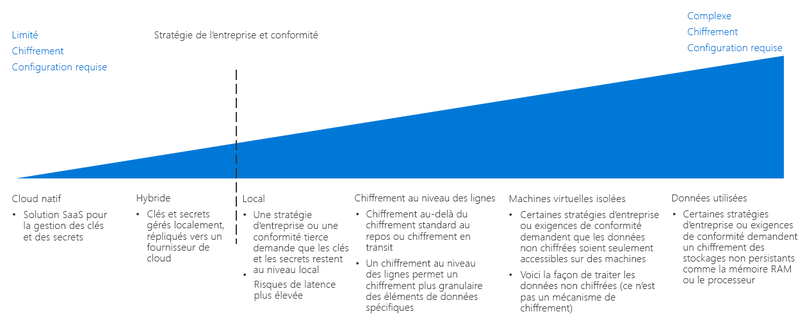

# Guide de décision concernant le chiffrement

Le chiffrement des données permet de les protéger de tout accès non autorisé. Une stratégie de chiffrement correctement implémentée fournit des couches de sécurité supplémentaires pour vos charges de travail basées sur le cloud, et les protège des pirates et autres utilisateurs non autorisés, aussi bien externes qu’internes à votre organisation et à vos réseaux.

Même s’il est généralement souhaitable de chiffrer ses ressources, cela peut augmenter la latence et l’utilisation globale des ressources. Pour les charges de travail exigeantes, il est essentiel de trouver le bon équilibre entre performances et chiffrement.

Passer à : [Gestion des clés](#key-management) | [Chiffrement des données](#data-encryption) | [En savoir plus](#learn-more)

Lorsque vous choisissez une stratégie de chiffrement cloud, le point d’inflexion se concentre sur la stratégie d’entreprise et sur les exigences de conformité.

Dans un environnement cloud, il existe plusieurs façons d’implémenter le chiffrement, dont les coûts et le niveau de complexité varient. Lorsque vous planifiez une stratégie de chiffrement, la stratégie d’entreprise et les exigences de conformité tierces constituent les principaux éléments à prendre en compte. La plupart des solutions cloud fournissent des mécanismes standards pour le chiffrement des données, qu’elles soient au repos ou en transit. Toutefois, pour les stratégies et les exigences de conformité qui demandent un contrôle plus strict, telles que les secrets standardisés et la gestion de clés, le chiffrement des données en cours d’utilisation ou le chiffrement de certaines données, vous aurez probablement besoin d’implémenter une solution complexe.

## Gestion des clés

Les systèmes modernes de gestion des clés doivent prendre en charge le stockage des clés à l’aide de modules de sécurité matériels (HSM) pour une protection renforcée. Par conséquent, un système de gestion des clés est essentiel pour que votre organisation puisse créer et stocker des clés de chiffrement, des mots de passe importants, des chaînes de connexion et autres informations confidentielles de type informatique.

Si vous planifiez une migration vers le cloud, le tableau suivant vous explique comment stocker et gérer des clés de chiffrement, des certificats et des secrets qui sont critiques pour la création de déploiements cloud sécurisés et faciles à gérer :

| Question | Natif cloud | Hybride | Local |
|---------------------------------------------------------------------------------------------------------------------------------------|--------------|--------|-------------|
| Manque-t-il un système centralisé de gestion des secrets et des clés à votre organisation ?                                                                    | Oui          | Non      | Non           |
| Devrez-vous restreindre la création de clés et de secrets sur les appareils locaux lors de l’utilisation de ces clés dans le cloud ? | Non            | Oui    | Non           |
| Votre organisation a-t-elle mis en place des règles ou des stratégies qui empêchent le stockage hors site des clés et des secrets ?                | Non            | Non      | Oui         |

### Cloud natif

Avec la gestion native des clés dans le cloud, l’ensemble des clés et des secrets sont générés, gérés et stockés dans un coffre du cloud. Cette approche simplifie de nombreuses tâches informatiques liées à la gestion des clés.

Conditions nécessaires à la gestion native des clés dans le cloud : L’utilisation d’un système natif de gestion des clés dans le cloud suppose que :

- Vous faites confiance à la solution cloud de gestion des clés pour créer, gérer et héberger les secrets et les clés de votre organisation.
- Vous avez activé l’ensemble des applications et des services locaux qui ont besoin des services de chiffrement ou des secrets pour accéder au système de gestion des clés dans le cloud.

### Hybride (Bring Your Own Key, BYOK)

Avec l’approche de type BYOK (Bring Your Own Key), vous générez des clés sur du matériel HSM dédié au sein de votre environnement local, puis vous transférez les clés vers un système sécurisé de gestion des clés dans le cloud, que vous pouvez utiliser avec les ressources cloud.

Conditions nécessaires à la gestion hybride des clés : L’utilisation d’un système hybride de gestion des clés suppose que :

- Vous faites confiance à l’infrastructure sous-jacente de sécurité et de contrôle d’accès de la plateforme cloud pour héberger et utiliser vos clés et vos secrets.
- Vous êtes obligé, par une stratégie réglementaire ou organisationnelle, de créer et de gérer les secrets et les clés de votre organisation localement.

### Locale (Hold Your Own Key, HYOK)

Dans certains scénarios, une stratégie réglementaire ou des raisons techniques peuvent vous empêcher de stocker les clés dans un système de gestion des clés fourni par un service cloud public. Dans ce cas, vous devez conserver les clés sur du matériel local et provisionner un mécanisme pour permettre aux ressources cloud d’accéder à ces clés à des fins de chiffrement. Notez que l’approche HYOK (Hold Your Own Key) peut ne pas être compatible avec tous les services cloud.

Conditions nécessaires à la gestion locale des clés : L’utilisation d’un système local de gestion des clés suppose que :

- Vous êtes obligé, par une stratégie réglementaire ou organisationnelle, de créer, de gérer et d’héberger les secrets et les clés de votre organisation localement.
- L’ensemble des applications et des services locaux qui ont besoin des services de chiffrement ou des secrets sont en mesure d’accéder au système local de gestion des clés.

## Chiffrement des données

Lorsque vous planifiez votre stratégie de chiffrement, vous devez prendre en compte les besoins de chiffrement des différents états de données :

| État des données | Données |
|-----|-----|
| Données en transit | Trafic réseau interne, connexions Internet, connexions entre centres de données ou réseaux virtuels |
| Données au repos    | Bases de données, fichiers, disques virtuels, stockage PaaS |
| Données en cours d’utilisation     | Données chargées dans la mémoire RAM ou dans les caches processeur |

### Données en transit

Les données en transit sont des données qui sont déplacées d’une ressource interne à une autre, d’un centre de données à un autre, vers des réseaux externes ou sur Internet.

Le chiffrement des données en transit est généralement obtenu en exigeant les protocoles SSL/TLS pour le trafic. Le trafic qui transite entre vos ressources hébergées dans le cloud et un réseau externe ou l’Internet public doit toujours être chiffré. Par défaut, les ressources PaaS appliquent également un chiffrement SSL/TLS pour le trafic. Il revient à l’équipe chargée de l’adoption du cloud ainsi qu’au propriétaire de la charge de travail d’appliquer ou non le chiffrement du trafic entre les ressources IaaS hébergées sur vos réseaux virtuels. Un tel chiffrement est généralement recommandé.

**Conditions nécessaires au chiffrement des données en transit**. L’implémentation correcte des stratégies de chiffrement des données en transit suppose que :

- Tous les points de terminaison accessibles publiquement dans votre environnement cloud communiquent avec l’Internet public via les protocoles SSL/TLS.
- Vous utilisez des protocoles VPN chiffrés lorsque vous connectez des réseaux cloud à un réseau local ou autre réseau externe via l’Internet public.
- Vous utilisez un VPN ou une autre appliance de chiffrement locale associée au VPN virtuel correspondant ou à une appliance de chiffrement déployée sur votre réseau cloud, lorsque vous connectez des réseaux cloud à des réseaux locaux ou autres réseaux externes à l’aide d’une connexion WAN dédiée, telle qu’une connexion ExpressRoute.
- Vous chiffrez tout le trafic entre les ressources de votre réseau virtuel si vous disposez de données sensibles qui ne doivent pas être incluses dans les journaux de trafic ou autres rapports de diagnostics que le personnel informatique peut consulter.

### Données au repos

Les données au repos correspondent aux données qui ne sont ni déplacées ni traitées, y compris des fichiers, des bases de données, des disques de machine virtuelle, des comptes de stockage PaaS ou autres ressources similaires. Le chiffrement des données stockées protège les appareils virtuels contre tout accès non autorisé provenant d’une intrusion réseau externe, d’utilisateurs internes non autorisés ou de publications accidentelles.

Les ressources de stockage PaaS et de base de données appliquent généralement le chiffrement par défaut. Vous pouvez sécuriser les ressources virtuelles IaaS par le biais du chiffrement du disque virtuel, à l’aide des clés de chiffrement qui sont stockées dans votre système de gestion des clés.

Le chiffrement des données au repos englobe également des techniques plus avancées de chiffrement des bases de données, comme le chiffrement au niveau des colonnes et des lignes, qui permet de contrôler plus précisément les données à sécuriser.

Ce sont vos exigences globales concernant les stratégies et la conformité, la sensibilité des données stockées ainsi que les exigences de performances de vos charges de travail qui déterminent quelles ressources doivent être chiffrées.

**Conditions nécessaires au chiffrement des données au repos**. Le chiffrement des données au repos suppose que :

- Vous stockez des données qui ne sont pas destinées à une utilisation publique.
- Vos charges de travail peuvent accepter la latence supplémentaire liée au chiffrement du disque.

### Données en cours d’utilisation

Le chiffrement des données en cours d’utilisation implique la sécurisation des données dans un stockage non permanent, comme le cache RAM ou le cache processeur. Il implique également l’utilisation de technologies telles que le chiffrement de l’intégralité de la mémoire, et de technologies d’enclave, telles qu’Intel Secure Guard Extensions (SGX). Cela comprend également des techniques de chiffrement, telles que le chiffrement homomorphe, qui peut être utilisé pour créer des environnements d’exécution sécurisés et approuvés.

**Conditions nécessaires au chiffrement des données en cours d’utilisation**. Le chiffrement des données en cours d’utilisation suppose que :

- Vous êtes obligé de séparer la propriété des données de la plateforme cloud sous-jacente de façon permanente, même au niveau de la RAM et du processeur.

## En savoir plus

Pour plus d’informations sur le chiffrement et la gestion des clés dans la plateforme Azure, consultez les rubriques suivantes.

- [Vue d’ensemble du chiffrement Azure](/azure/security/security-azure-encryption-overview). Description détaillée de la façon dont Azure utilise le chiffrement pour sécuriser les données au repos et les données en transit.
- [Azure Key Vault](/azure/key-vault/key-vault-overview). Key Vault est le principal système de gestion des clés qui permet de stocker et de gérer des clés de chiffrement, des secrets et des certificats dans Azure.
- [Informatique confidentielle dans Azure](/solutions/confidential-compute). L’informatique confidentielle d’Azure fournit des outils et des technologies pour créer des environnements d’exécution approuvés ou d’autres mécanismes de chiffrement permettant de sécuriser les données en cours d’utilisation.

## Étapes suivantes

Découvrez comment les réseaux à définition logicielle fournissent des fonctionnalités de réseau virtualisé pour les déploiements dans le cloud.

> [!div class="nextstepaction"]
> [Quel modèle de réseau à définition logicielle convient le mieux à mon déploiement ?](../software-defined-network/overview.md)
