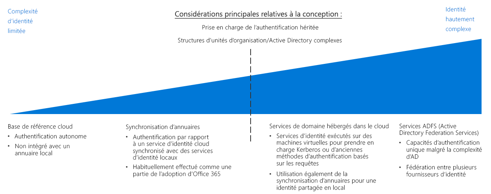

# Guide de décision concernant l’identitéIdentity decision guide

Dans tous les environnements (local, hybride ou cloud uniquement), le service informatique doit contrôler les administrateurs, les utilisateurs et les groupes qui ont accès aux ressources.In any environment, whether on-premises, hybrid, or cloud-only, IT needs to control which administrators, users, and groups have access to resources. Les services de gestion des identités et des accès (IAM) vous permettent de gérer le contrôle des accès dans le cloud.Identity and access management (IAM) services enable you to manage access control in the cloud.

Passer à : [Déterminer les exigences d’intégration des identités](#determine-identity-integration-requirements) | [Cloud natif](#cloud-baseline) | [Synchronisation d’annuaires](#directory-synchronization) | [Services de domaines hébergés dans le cloud](#cloud-hosted-domain-services) | [Active Directory Federation Services](#active-directory-federation-services) | [Évolution de l’intégration des identités](#evolving-identity-integration) | [En savoir plus](#learn-more)Jump to: [Determine Identity Integration Requirements](#determine-identity-integration-requirements) | [Cloud native](#cloud-baseline) | [Directory Synchronization](#directory-synchronization) | [Cloud hosted domain services](#cloud-hosted-domain-services) | [Active Directory Federation Services](#active-directory-federation-services) | [Evolving identity integration](#evolving-identity-integration) | [Learn more](#learn-more)

Plusieurs méthodes permettent de gérer les identités dans un environnement cloud. Leur coût et leur complexité sont variables.There are several ways to manage identity in a cloud environment, which vary in cost and complexity. Le niveau d’intégration requis avec votre infrastructure d’identité sur site existante est un facteur clé dans la structuration de vos services d’identité cloud.A key factor in structuring your cloud-based identity services is the level of integration required with your existing on-premises identity infrastructure.

Les solutions d’identité software as a service (SaaS) basées dans le cloud fournissent un niveau de base pour contrôler les accès et gérer les identités relatives aux ressources cloud.Cloud-based software as a service (SaaS) identity solutions provide a base level of access control and identity management for cloud resources. Toutefois, si l’infrastructure Active Directory (AD) de votre organisation présente une structure en forêt complexe ou des unités d’organisation personnalisées, il se peut que vos charges de travail basées sur le cloud nécessitent la duplication d’annuaire vers le cloud pour bénéficier d’un ensemble d’identités, de groupes et de rôles cohérent entre vos environnements en local et cloud.However, if your organization's Active Directory (AD) infrastructure has a complex forest structure or customized organizational units (OUs), your cloud-based workloads may require directory replication to the cloud for a consistent set of identities, groups, and roles between your on-premises and cloud environments. Si la duplication d’annuaire est requise pour une solution globale, cela peut entraîner une plus grande complexité.If directory replication is required for a global solution, complexity can increase significantly. En outre, pour garantir la prise en charge des applications qui dépendent de mécanismes d’authentification héritée, il se peut que vous deviez déployer des services de domaine dans le cloud.Additionally, support for applications dependent on legacy authentication mechanisms may require the deployment of domain services in the cloud.

## Déterminer les exigences d’intégration des identitésDetermine identity integration requirements

| QuestionQuestion | Base de référence cloudCloud baseline | Synchronisation de répertoiresDirectory synchronization | Services de domaines hébergés dans le cloudCloud-hosted Domain Services | Services de fédération AD FSAD Federation Services |
|------|------|------|------|------|
| À l’heure actuelle, vous manque-t-il un service d’annuaire local ?Do you currently lack an on-premises directory service? | OUIYes | Non No | Non No | Non No |
| Vos charges de travail doivent-elles s’authentifier auprès des services d’identité locaux ?Do your workloads need to authenticate against on-premises identity services? | Non No | OUIYes | Non No | Non No |
| Vos charges de travail dépendent-elles des mécanismes d’authentification hérités, tels NTLM ou Kerberos ?Do your workloads depend on legacy authentication mechanisms, such as Kerberos or NTLM? | Non No | Non No | OUIYes | Non No |
| L’intégration entre le service d’identité local et celui sur le cloud est-elle impossible ?Is integration between cloud and on-premises identity services impossible? | Non No | Non No | OUIYes | Non No |
| Avez-vous besoin de l’authentification unique auprès de plusieurs fournisseurs d’identité ?Do you require single sign-on across multiple identity providers? | Non No | Non No | Non No | OUIYes |

Dans le cadre de la planification de votre migration vers Azure, vous devez déterminer la meilleure méthode pour intégrer votre gestion des identités et les services d’identité cloud.As part of planning your migration to Azure, you will need to determine how best to integrate your existing identity management and cloud identity services. Les paragraphes suivants illustrent des scénarios d’intégration courants.The following are common integration scenarios.

### Base de référence cloudCloud baseline

Les plateformes de cloud public proposent un système IAM natif permettant d’accorder l’accès des utilisateurs et des groupes aux fonctionnalités d’administration.Public cloud platforms provide a native IAM system for granting users and groups access to management features. Si votre organisation ne dispose pas de solution d’identité locale notable et que vous prévoyez de migrer des charges de travail afin qu’elles soient compatibles avec les mécanismes d’authentification basés sur le cloud, vous devez créer votre infrastructure d’identité à l’aide d’un service d’identité cloud natif.If your organization lacks a significant on-premises identity solution, and you plan on migrating workloads to be compatible with cloud-based authentication mechanisms, you should build your identity infrastructure using a cloud-native identity service.

**Hypothèses relatives à la base de référence cloud**.**Cloud baseline assumptions**. L’utilisation d’une infrastructure d’identité cloud native (uniquement) implique les hypothèses suivantes :Using a purely cloud-native identity infrastructure assumes the following:

- Vos ressources basées sur le cloud ne peuvent présenter aucune dépendance avec les services d’annuaire locaux ni les serveurs Active Directory, ou bien les charges de travail doivent être modifiées pour supprimer ces dépendances.Your cloud-based resources will not have dependencies on on-premises directory services or Active Directory servers, or workloads can be modified to remove those dependencies your.
- Les charges de travail d’application ou de service qui sont en cours de migration doivent prendre en charge les mécanismes d’authentification compatibles avec les fournisseurs d’identité cloud ou bien elles peuvent être modifiées facilement pour les prendre en charge.The application or service workloads being migrated either support authentication mechanisms compatible with cloud identity providers or can be modified easily to support them. Les fournisseurs d’identité cloud natifs s’appuient sur des mécanismes d’authentification prêts à l’emploi (SAML, OAuth et OpenID Connect, par exemple).Cloud native identity providers rely on internet-ready authentication mechanisms such as SAML, OAuth, and OpenID Connect. Il se peut que les charges de travail existantes qui dépendent de méthodes d’authentification héritées et qui utilisent des protocoles tels que NTLM ou Kerberos doivent être refactorisées avant de migrer vers le cloud.Existing workloads that depend on legacy authentication methods using protocols such as Kerberos or NTLM may need to be refactored before migrating to the cloud.

> [!TIP]
> La plupart des services d’identité cloud natifs ne remplacent pas complètement les répertoires locaux traditionnels.Most cloud-native identity services are not full replacements for traditional on-premises directories. Il se peut que les fonctionnalités de répertoire (gestion de l’ordinateur ou stratégie de groupe, par exemple) ne soient pas disponibles sans passer par des outils ou des services supplémentaires.Directory features such as computer management or group policy may not be available without using additional tools or services.

En migrant complètement vos services d’identité vers un fournisseur cloud, vous éliminez le besoin de maintenir votre propre infrastructure d’identité et simplifiez considérablement votre gestion informatique.Completely migrating your identity services to a cloud-based provider eliminates the need to maintain your own identity infrastructure, significantly simplifying your IT management.

### Synchronisation de répertoiresDirectory synchronization

Pour les organisations qui disposent déjà d’une infrastructure d’identité, la synchronisation d’annuaires est souvent la meilleure solution pour conserver la gestion des accès et des utilisateurs existante tout en bénéficiant des capacités IAM requises pour gérer les ressources cloud.For organizations with an existing identity infrastructure, directory synchronization is often the best solution for preserving existing user and access management while providing the required IAM capabilities for managing cloud resources. Ce processus permet de dupliquer les informations d’annuaire entre le cloud et les environnements locaux en continu, ce qui permet l’authentification unique (SSO) des utilisateurs et la mise en œuvre d’un système d’identité, de rôle et d’autorisation cohérent dans toute l’organisation.This process continuously replicates directory information between the cloud and on-premises environments, allowing single sign-on (SSO) for users and a consistent identity, role, and permission system across your entire organization.

Remarque : Les organisations qui ont adopté Office 365 ont peut-être déjà implémenté [la synchronisation d’annuaires](/office365/enterprise/set-up-directory-synchronization) entre leur infrastructure locale Active Directory et Azure Active Directory.Note: Organizations that have adopted Office 365 may have already implemented [directory synchronization](/office365/enterprise/set-up-directory-synchronization) between their on-premises Active Directory infrastructure and Azure Active Directory.

**Hypothèses relatives à la synchronisation d’annuaires**.**Directory synchronization assumptions**. L’utilisation d’une solution d’identité synchronisée implique les hypothèses suivantes :Using a synchronized identity solution assumes the following:

- Vous devez maintenir un ensemble commun de comptes utilisateur et de groupes entre le cloud et votre infrastructure informatique locale.You need to maintain a common set of user accounts and groups across your cloud and on-premises IT infrastructure.
- Vos services d’identité locaux prennent en charge la réplication avec votre fournisseur d’identité cloud.Your on-premises identity services support replication with your cloud identity provider.
- Vous avez besoin de mécanismes d’authentification unique SSO pour les utilisateurs qui accèdent à des fournisseurs d’identité sur le cloud et en local.You require SSO mechanisms for users accessing cloud and on-premises identity providers.

> [!TIP]
> Toutes les charges de travail basées sur le cloud et dépendantes de mécanismes d’authentification hérités non pris en charge par les services d’identité basés sur le cloud (comme Azure AD) doivent rester connectées aux services de domaine locaux ou aux serveurs virtuels dans l’environnement cloud qui fournit ces services.Any cloud-based workloads that depend on legacy authentication mechanisms that are not supported by cloud-based identity services like Azure AD will still require either connectivity to on-premises domain services or virtual servers in the cloud environment providing these services. L’utilisation de services d’identité locaux introduit également des dépendances de connectivité entre les réseaux cloud et locaux.Using on-premises identity services also introduces dependencies on connectivity between the cloud and on-premises networks.

### Services de domaines hébergés dans le cloudCloud-hosted domain services

Si vous disposez de charges de travail qui dépendent d’authentification par revendication à l’aide de protocoles hérités (Kerberos ou NTLM, par exemple), et qu’il est impossible de refactoriser ces charges de travail pour accepter des protocoles d’authentification modernes (tels que SAML, OAuth et OpenID Connect), vous devrez peut-être migrer certains de vos services de domaine vers le cloud dans le cadre de votre déploiement cloud.If you have workloads that depend on claims-based authentication using legacy protocols such as Kerberos or NTLM, and those workloads cannot be refactored to accept modern authentication protocols such as SAML or OAuth and OpenID Connect, you may need to migrate some of your domain services to the cloud as part of your cloud deployment.

Ce type de déploiement implique de déployer des machines virtuelles exécutant Active Directory dans vos réseaux virtuels basés sur le cloud pour fournir des services de domaine aux ressources dans le cloud.This type of deployment involves deploying virtual machines running Active Directory in your cloud-based virtual networks to provide domain services for resources in the cloud. Toutes les applications et services existants qui migrent vers votre réseau cloud doivent être en mesure d’utiliser ces serveurs d’annuaires hébergés dans le cloud seulement avec quelques modifications mineures.Any existing applications and services migrating to your cloud network should be able to use of these cloud-hosted directory servers with minor modifications.

Il se peut que vos services de domaine et de répertoires existants soient toujours utilisés dans votre environnement local.It's likely that your existing directories and domain services will continue to be used in your on-premises environment. Dans ce scénario, nous vous recommandons d’utiliser également la synchronisation d’annuaires pour fournir un ensemble d’utilisateurs et de rôles commun dans les environnements cloud et local.In this scenario, it's recommended that you also use directory synchronization to provide a common set of users and roles in both the cloud and on-premises environments.

**Hypothèses relatives aux services de domaines hébergés dans le cloud**.**Cloud hosted domain services assumptions**. L’exécution d’une migration de répertoire implique les hypothèses suivantes :Performing a directory migration assumes the following:

- Vos charges de travail dépendent de l’authentification par revendication à l’aide de protocoles tels que Kerberos ou NTLM.Your workloads depend on claims-based authentication using protocols like Kerberos or NTLM.
- Vos machines virtuelles de charge de travail doivent être jointes au domaine afin d’assurer la gestion ou l’application des objectifs stratégiques de groupe Active Directory.Your workload virtual machines need to be domain-joined for management or application of Active Directory group policy purposes.

> [!TIP]
> La migration de répertoire associée à des services de domaine hébergés dans le cloud offre une grande souplesse lors de la migration des charges de travail existantes. Toutefois, l’hébergement de machines virtuelles dans votre réseau virtuel cloud (pour fournir ces services) augmente la complexité de vos tâches d’administration informatique.While a directory migration coupled with cloud-hosted domain services provides great flexibility when migrating existing workloads, hosting virtual machines within your cloud virtual network to provide these services does increase the complexity of your IT management tasks. Au fur et à mesure que votre expérience de migration cloud gagne en maturité, examinez les besoins de maintenance à long terme associés à l’hébergement de ces serveurs.As your cloud migration experience matures, examine the long-term maintenance requirements of hosting these servers. Déterminez si la refactorisation des charges de travail existantes pour les rendre compatibles avec les fournisseurs d’identité cloud (comme Azure Active Directory) peut réduire les besoins de ces serveurs hébergés dans le cloud.Consider whether refactoring existing workloads for compatibility with cloud identity providers such as Azure Active Directory can reduce the need for these cloud-hosted servers.

### Services de fédération Active Directory (AD FS)Active Directory Federation Services

La fédération des identités établit des relations d’approbation entre plusieurs systèmes de gestion des identités afin de permettre l’authentification et des fonctionnalités d’autorisation communes.Identity federation establishes trust relationships across multiple identity management systems to allow common authentication and authorization capabilities. Vous pouvez ensuite prendre en charge les fonctionnalités d’authentification unique sur plusieurs domaines dans votre organisation ou les systèmes d’identité gérés par vos clients ou partenaires commerciaux.You can then support single sign-on capabilities across multiple domains within your organization or identity systems managed by your customers or business partners.

Azure AD prend en charge la fédération de domaines Active Directory locaux à l’aide d’[Active Directory Federation Services](/azure/active-directory/hybrid/how-to-connect-fed-whatis) (AD FS).Azure AD supports federation of on-premises Active Directory domains using [Active Directory Federation Services](/azure/active-directory/hybrid/how-to-connect-fed-whatis) (AD FS). Consultez l’architecture de référence [Extension d’AD FS vers Azure](../../../reference-architectures/identity/adfs.md) pour en savoir plus sur l’implémentation dans Azure.See the reference architecture [Extend AD FS to Azure](../../../reference-architectures/identity/adfs.md) to see how this can be implemented in Azure.

## Évolution de l’intégration des identitésEvolving identity integration

L’intégration des identités est un processus itératif.Identity integration is an iterative process. Dans un premier temps, il se peut que vous souhaitiez débuter par une solution cloud native avec un petit ensemble d’utilisateurs et de rôles correspondants pour un déploiement initial.You may want to start with a cloud native solution with a small set of users and corresponding roles for an initial deployment. Votre migration gagnant en maturité, vous envisagez d’adopter un modèle fédéré ou d’effectuer une migration de répertoire complète de vos services d’identité locaux vers le cloud.As your migration matures, consider adopting a federated model or performing a full directory migration of your on-premises identity services to the cloud. Réétudiez votre stratégie d’identité dans chaque itération du processus de migration.Revisit your identity strategy in every iteration of your migration process.

## En savoir plusLearn more

Pour plus d’informations sur les services d’identité de la plateforme Azure, consultez la rubrique suivante.See the following for more information about identity services on the Azure platform.

- [Azure AD](https://azure.microsoft.com/services/active-directory).[Azure AD](https://azure.microsoft.com/services/active-directory). Azure AD fournit un service d’identité basé sur le cloud.Azure AD provides cloud-based identity services. Il vous permet de gérer l’accès à vos ressources Azure et de contrôler la gestion des identités, l’inscription des appareils, l’approvisionnement des utilisateurs, le contrôle de l’accès aux applications et la protection des données.It allows you to manage access to your Azure resources and control identity management, device registration, user provisioning, application access control, and data protection.
- [Azure AD Connect](/azure/active-directory/hybrid/whatis-hybrid-identity).[Azure AD Connect](/azure/active-directory/hybrid/whatis-hybrid-identity). L’outil Azure AD Connect vous permet de connecter des instances Azure AD avec vos solutions de gestion des identités existantes, en autorisant la synchronisation de votre répertoire existant avec le cloud.The Azure AD Connect tool allows you to connect Azure AD instances with your existing identity management solutions, allowing synchronization of your existing directory in the cloud.
- [Contrôle d’accès en fonction du rôle](/azure/role-based-access-control/overview) (RBAC).[Role-based access control](/azure/role-based-access-control/overview) (RBAC). Azure AD fournit le contrôle des accès en fonction du rôle pour gérer efficacement et en toute sécurité l’accès aux ressources dans le plan de gestion.Azure AD provides RBAC to efficiently and securely manage access to resources in the management plane. Les travaux et les responsabilités sont classés par rôle, et les utilisateurs sont assignés à ces rôles.Jobs and responsibilities are organized into roles, and users are assigned to these roles. Le RBAC vous permet de contrôler les utilisateurs qui ont accès à une ressource, ainsi que les actions qu’ils peuvent effectuer sur cette ressource.RBAC allows you to control who has access to a resource along with which actions a user can perform on that resource.
- [Azure AD Privileged Identity Management](/azure/active-directory/privileged-identity-management/pim-configure) (PIM).[Azure AD Privileged Identity Management](/azure/active-directory/privileged-identity-management/pim-configure) (PIM). PIM réduit le temps d’exposition des privilèges d’accès aux ressources et augmente votre visibilité en matière d’utilisation grâce à des rapports et des alertes.PIM lowers the exposure time of resource access privileges and increases your visibility into their use through reports and alerts. PIM autorise les utilisateurs à utiliser ces privilèges uniquement pendant une période précise (juste-à-temps (JIT)), ou en leur attribuant des privilèges pour une plus courte durée après laquelle ces privilèges sont automatiquement révoqués.It limits users to taking on their privileges "just in time" (JIT), or by assigning privileges for a shorter duration, after which privileges are revoked automatically.
- [Intégrer des domaines Active Directory locaux avec Azure Active Directory](../../../reference-architectures/identity/azure-ad.md).[Integrate on-premises Active Directory domains with Azure Active Directory](../../../reference-architectures/identity/azure-ad.md). Cette architecture de référence fournit un exemple de synchronisation d’annuaires entre des domaines Active Directory locaux et Azure AD.This reference architecture provides an example of directory synchronization between on-premises Active Directory domains and Azure AD.
- [Étendre Active Directory Domain Services (AD DS) à Azure](../../../reference-architectures/identity/adds-extend-domain.md).[Extend Active Directory Domain Services (AD DS) to Azure.](../../../reference-architectures/identity/adds-extend-domain.md) Cette architecture de référence fournit un exemple de déploiement de serveurs AD DS pour étendre les services de domaine aux ressources basées sur le cloud.This reference architecture provides an example of deploying AD DS servers to extend domain services to cloud-based resources.
- [Étendre les services de fédération Active Directory (AD FS) à Azure](../../../reference-architectures/identity/adfs.md).[Extend Active Directory Federation Services (AD FS) to Azure](../../../reference-architectures/identity/adfs.md). Cette architecture de référence configure Active Directory Federation Services (ADFS) afin d’effectuer l’authentification fédérée et l’autorisation auprès de votre répertoire Azure AD.This reference architecture configures Active Directory Federation Services (AD FS) to perform federated authentication and authorization with your Azure AD directory.

## Étapes suivantesNext steps

Découvrez comment implémenter l’application des stratégies dans le cloud.Learn how to implement policy enforcement in the cloud.

> [!div class="nextstepaction"]
> [Application de stratégiesPolicy enforcement](../policy-enforcement/overview.md)
