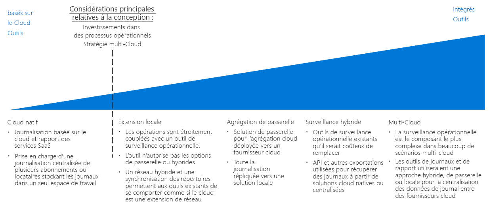

# Guide de décision sur la journalisation et création de rapports

Toutes les organisations ont besoin de mécanismes leur permettant d’avertir les équipes informatiques en cas de problèmes de performances, de temps de fonctionnement et de sécurité avant qu’ils ne s’aggravent. Une stratégie de supervision efficace vous permet d’analyser les performances individuelles des composants qui constituent vos charges de travail et votre infrastructure réseau. Dans le cas d’une migration de cloud public, il est essentiel d’intégrer la journalisation et la création de rapports à vos systèmes de supervision existants, et d’informer le personnel informatique approprié des événements et métriques importants. De cette manière, vous vous assurez que votre organisation atteint ses objectifs de conformité en termes de temps de fonctionnement, de sécurité et de stratégies.

Passer à : [Planification de votre infrastructure de supervision](#planning-your-monitoring-infrastructure) | [Cloud natif](#cloud-native) | [Extension locale](#on-premises-extension) | [Agrégation de passerelle](#gateway-aggregation) | [Supervision hybride (locale)](#hybrid-monitoring-on-premises) | [Supervision hybride (basée sur le cloud)](#hybrid-monitoring-cloud-based) | [Multi-cloud](#multi-cloud) | [En savoir plus](#learn-more)

Le point d’inflexion lors de la définition d’une stratégie d’identité cloud se base principalement sur les investissements que votre organisation a déjà faits dans les processus opérationnels et, dans une certaine mesure, sur les exigences à prendre en charge dans une stratégie multi-cloud.

Il existe plusieurs façons de journaliser et de créer des rapports sur les activités dans le cloud. Le cloud natif et la journalisation centralisée sont deux options SaaS (software as a service) courantes, qui se fondent sur la conception de l’abonnement et le nombre d’abonnements.

## Planification de l’infrastructure de supervision

Lors de la planification de votre déploiement, vous devez penser à l’emplacement où seront stockées vos données de journalisation, et à la manière dont vous intégrerez les rapports et les services de supervision basés sur le cloud à vos processus et outils existants.

| Question | Cloud natif | Extension locale | Supervision hybride | Agrégation de passerelle |
|-----|-----|-----|-----|-----|
| Vous disposez déjà d’une infrastructure de supervision locale ? | Non  | OUI | OUI |  Non  |
| Avez-vous des exigences qui empêchent le stockage des données de journal dans des emplacements de stockage externes ? | Non  | OUI | Non  | Non  |
| Avez-vous besoin d’intégrer la supervision cloud à des systèmes locaux ? | Non  | Non  | OUI | Non  |
Avez-vous besoin de traiter ou filtrer les données de télémétrie avant de les envoyer à vos systèmes de supervision ? | Non  | Non  | Non  | OUI |

### Cloud natif

Si votre organisation ne dispose pas à l’heure actuelle de systèmes de création de rapports et de journalisation établis, ou si votre déploiement cloud planifié n’a pas besoin d’être intégré à des systèmes de supervision locaux existants ou externes, le plus simple est d’opter pour une solution SaaS cloud native.

Dans ce scénario, les données de journal sont enregistrées et stockées dans le même environnement cloud que votre charge de travail, tandis que les outils de journalisation et création de rapports qui traitent les informations et les mettent en évidence auprès du personnel informatique font partie de la plateforme cloud.

Les solutions de journalisation cloud natives peuvent être implémentées ad hoc par abonnement ou par charge de travail pour les déploiements plus petits ou expérimentaux. Par ailleurs, elles sont organisées de manière centralisée afin de superviser les données de journal de l’ensemble de votre parc cloud.

**Postulats concernant le caractère natif dans le cloud**. Les postulats suivants sont admis lorsque l’on utilise un système de création de rapports et de journalisation cloud natif :

- Vous n’avez pas besoin d’intégrer les données de journal de vos charges de travail cloud dans vos systèmes locaux existants.
- Vous n’utilisez pas vos systèmes de création de rapports basés sur le cloud pour superviser les systèmes locaux.

### Extension locale

Si vous devez intégrer la télémétrie cloud à des systèmes locaux incompatibles avec la création de rapports et la journalisation hybrides, ou si vous devez prendre en charge la migration d’applications et de services en minimisant le plus possible le redéveloppement, vous devrez déployer des agents de supervision sur les machines virtuelles. Ainsi, les données de journal seront envoyées directement à vos systèmes locaux, au lieu d’être stockées dans l’environnement cloud.

Pour que cette approche soit possible, vos ressources cloud doivent être en mesure de communiquer directement avec vos systèmes locaux via une [mise en réseau hybride](../software-defined-network/hybrid.md) et des [services de domaine hébergés sur le cloud](../identity/overview.md#cloud-hosted-domain-services). Une fois cela mis en place, le réseau virtuel cloud fonctionne comme une extension de l’environnement local. Par conséquent, vos charges de travail hébergées sur le cloud peuvent communiquer directement avec votre système de création de rapports et de journalisation local.

Cette approche s’appuie sur les investissements que vous avez déjà faits dans les outils de supervision, et modifie de manière limitée les applications et services déployés sur le cloud. Cette approche est souvent la plus rapide pour prendre en charge la supervision lors d’une migration lift-and-shift. En revanche, elle ne permet pas de capturer les données de journal produites par les ressources PaaS et SaaS basées sur le cloud. De même, elle omet tous les journaux liés aux machines virtuelles et générés par la plateforme cloud en elle-même, comme l’état des machines virtuelles. Par conséquent, ce modèle doit servir de solution temporaire en attendant qu’une solution de supervision hybride plus complète soit implémentée.

Postulats concernant le caractère local :

- Vous devez conserver vos données de journal uniquement dans votre environnement local, que ce soit en raison d’exigences techniques ou d’exigences stratégiques ou réglementaires.
- Vos systèmes locaux ne prennent pas en charge les solutions de journalisation et création de rapports hybrides ni les solutions d’agrégation de passerelle.
- Vos applications basées sur le cloud peuvent envoyer la télémétrie directement à vos systèmes de journalisation et agents de supervision locaux. Ces derniers effectuent un envoi local, qui peut être déployé sur les machines virtuelles de charge de travail.
- Vos charges de travail ne sont pas dépendantes de services PaaS ou SaaS, qui requièrent une journalisation et une création de rapports basées sur le cloud.

### Agrégation de passerelle

Si la quantité de données de télémétrie basées sur le cloud est très volumineuse ou si les systèmes de supervision locaux existants ont besoin de modifier les données de journal avant de pouvoir les traiter, un service d’[agrégation de passerelle](../../../patterns/gateway-aggregation.md) de données journal peut être requis.

Un service de passerelle est déployé sur votre fournisseur de cloud. Ensuite, les applications et les services appropriés sont configurés de manière à ce qu’ils envoient les données de télémétrie à la passerelle au lieu du système de journalisation par défaut. Suite à cela, la passerelle peut traiter les données : elle agrège des données, les combine et les formate selon les besoins avant de les envoyer à votre système de supervision qui les ingère et les analyse.

En outre, une passerelle peut être utilisée pour agréger et prétraiter des liaisons de données de télémétrie pour les systèmes cloud natifs et hybrides.

Postulats concernant l’agrégation de passerelle :

- Vous vous attendez à des niveaux très élevés de données de télémétrie depuis vos services et applications basés sur le cloud.
- Vous devez formater ou optimiser vos données de télémétrie avant de les envoyer à vos systèmes de supervision.
- Vos systèmes de supervision disposent d’API ou d’autres mécanismes disponibles pour ingérer les données de journal après leur traitement par la passerelle.

### Supervision hybride (locale)

Une solution de supervision hybride combine les données de journal de vos ressources locales et cloud. De cette manière, elle peut vous fournir une vue intégrée de l’état opérationnel de votre parc informatique.

Si vous avez déjà investi dans des systèmes de supervision locaux qu’il serait difficile ou coûteux de remplacer, vous pouvez intégrer la télémétrie de vos charges de travail cloud à vos solutions de supervision locales existantes. Dans un système de supervision local hybride, les données de télémétrie locales continuent d’utiliser le système de supervision local existant. Les données de télémétrie basées sur le cloud peuvent être directement envoyées au système de supervision cloud ou elles peuvent être stockées dans le cloud avec vos charges de travail. Ensuite, elles sont compilées et ingérées par le système local à intervalles réguliers.

**Postulats concernant la supervision hybride locale**. Les postulats suivants sont admis lorsque l’on utilise un système de création de rapports et de journalisation local pour la supervision hybride :

- Vous devez utiliser des systèmes de création de rapports locaux existants pour superviser les charges de travail cloud.
- Vous devez rester propriétaire des données de journal locales.
- Vos systèmes de gestion locaux disposent d’API ou d’autres mécanismes disponibles pour ingérer les données de journal venant de systèmes basés sur le cloud.

> [!TIP]
> En prenant en compte la nature itérative de la migration cloud, il est probable de passer d’une supervision cloud native et locale à une approche hybride partielle. Veillez à ce que les modifications de votre architecture de supervision soient alignées sur vos processus opérationnels et informatiques globaux.

### Supervision hybride (basée sur le cloud)

Si vous n’avez pas un besoin essentiel de maintenir un système de supervision local, ou si vous voulez remplacer les systèmes de supervision locaux par une solution SaaS, vous pouvez également choisir d’intégrer des données de journal locales à un système de supervision centralisé basé sur le cloud.

Ce scénario est une mise en miroir de l’approche centrée locale : les charges de travail utilisent leur mécanisme de journalisation cloud par défaut, tandis que les applications et services locaux soit envoient le répertoire de télémétrie au système de journalisation basé sur le cloud, soit agrègent les données pour qu’elles soient ingérées par le système cloud à intervalles réguliers. Le système de supervision basé sur le cloud vous sert ensuite de système principal de création de rapports et de supervision pour l’ensemble de votre parc informatique.

Postulats concernant la supervision hybride basée sur le cloud : Les postulats suivants sont admis lorsque l’on utilise un système de création de rapports et de journalisation basé sur le cloud pour la supervision hybride :

- Vous n’êtes pas dépendant des systèmes de supervision locaux existants.
- Vos charges de travail n’imposent pas d’exigences stratégiques ou réglementaires quant au stockage des données de journal en local.
- Vos systèmes de supervision basés sur le cloud disposent d’API ou d’autres mécanismes disponibles pour ingérer les données de journal venant de services et d’applications locaux.

### Multi-cloud

L’intégration des capacités de journalisation et de création de rapports sur l’ensemble d’une plateforme multi-cloud peut être compliquée. Les services offerts d’une plateforme à une autre ne sont pas directement comparables, et les capacités de journalisation et de télémétrie fournies par ces services sont également différentes.
La prise en charge de la journalisation multi-cloud requiert souvent d’avoir recours à des services de passerelle. Ces derniers traitent les données de journal et les convertissent en un format courant, avant de les envoyer à une solution de journalisation hybride.

## En savoir plus

[Azure Monitor](/azure/azure-monitor/overview) est le service de supervision et de création de rapports par défaut pour Azure. Elle fournit :

- Une plateforme unifiée servant à collecter la télémétrie d’application, la télémétrie d’hôte (par exemple, les machines virtuelles), les métriques de conteneur, les métriques de plateforme Azure et les journaux des événements.
- Visualisation, requêtes, alertes et outils d’analyse. Ce service peut fournir des insights sur les machines virtuelles, les systèmes d’exploitation invités, les réseaux virtuels et les événements d’application de charge de travail.
- Les [API REST](/azure/monitoring-and-diagnostics/monitoring-rest-api-walkthrough) pour l’intégration à des services externes et pour l’automatisation des services de supervision et d’alerte
- [Intégration](/azure/monitoring-and-diagnostics/monitoring-partners) avec de nombreux fournisseurs tiers connus.
