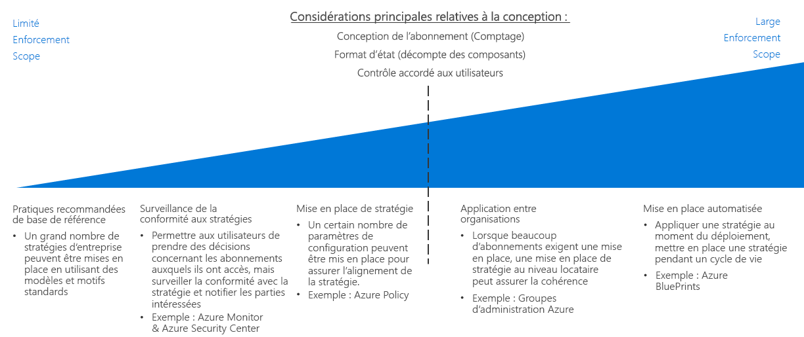

# Guide de décision pour l’application de la stratégie

Définir une stratégie n’est efficace que s’il existe un moyen de l’appliquer au sein de l’organisation. Un aspect clé de la planification de toute migration vers le cloud est la détermination de la meilleure façon de combiner les outils fournis par la plateforme cloud avec vos processus informatiques existants afin d’optimiser la conformité de la stratégie pour l’ensemble de vos ressources cloud.

Passer à : [Pratiques recommandées pour la ligne de base](#baseline-recommended-practices) | [Surveillance de la conformité à la stratégie](#policy-compliance-monitoring) | [Application de la stratégie](#policy-enforcement) | [Stratégie à l’échelle de l’organisation](#cross-organization-policy) | [Application automatisée](#automated-enforcement)

À mesure que vos ressources cloud croissent, vous serez confronté à un besoin correspondant de maintenir et d’appliquer une stratégie à un éventail plus vaste de ressources, d’abonnements et de locataires. Plus vous avez de ressources, plus vos mécanismes d’exécution doivent être complexes pour garantir une adhésion constante à la stratégie et une détection rapide des violations. Les mécanismes d’application de la stratégie fournis par la plateforme au niveau des ressources ou des abonnements sont généralement suffisants pour les déploiements cloud de petite taille, tandis que les déploiements de plus grande taille peuvent nécessiter de recourir à des mécanismes plus sophistiqués impliquant des normes de déploiement, le regroupement et l’organisation des ressources, ainsi que l’intégration de l’application de la stratégie avec vos systèmes de journalisation et de génération de rapports.

Le point d’inflexion clé lors du choix de la complexité de votre stratégie d’application de la stratégie est principalement axé sur le nombre d’abonnements ou de locataires que votre [abonnement](../subscriptions/overview.md) requiert. La quantité de contrôle accordé aux différents rôles d’utilisateur au sein de vos ressources cloud peut également influencer ces décisions.

## Pratiques recommandées pour la ligne de base

Pour un abonnement unique et des déploiements cloud simples, de nombreuses stratégies d’entreprise peuvent être appliquées à l’aide de fonctionnalités natives sur la plupart des plateformes cloud. Même à ce niveau relativement faible de complexité de déploiement, l’utilisation cohérente des modèles évoqués dans les [guides de décision](../overview.md) du Framework d’adoption du cloud peut aider à établir un niveau de ligne de base de conformité à la stratégie.

Par exemple : 

- Des [modèles de déploiement](../resource-consistency/overview.md) peuvent approvisionner des ressources avec une structure et une configuration normalisées.
- Des [normes de marquage et de nommage](../resource-tagging/overview.md) peuvent vous aider à organiser vos opérations et à répondre aux exigences comptables et commerciales.
- Des restrictions de gestion du trafic et de réseau peuvent être implémentées via une [mise en réseau définie par logiciel](../software-defined-network/overview.md).
- Un [contrôle d’accès en fonction du rôle](../identity/overview.md) peut sécuriser et isoler vos ressources cloud.

Commencez la planification de l’application de votre stratégie cloud en examinant comment les modèles standard décrits dans ces guides peuvent vous aider à répondre aux besoins de votre organisation.

## Surveillance de la conformité à la stratégie

Un autre facteur clé, même pour des déploiements cloud relativement petits, est la possibilité de vérifier que les applications et services cloud sont conformes à la stratégie de l’organisation, en avertissant rapidement les parties responsables si une ressource devient non conforme. La [journalisation et la génération de rapports](../log-and-report/overview.md) sur l’état de conformité des charges de travail cloud constituent un aspect essentiel d’une stratégie d’application de stratégie d’entreprise.

À mesure que vos ressources cloud augmentent, des outils supplémentaires tels qu’[Azure Security Center](/azure/security-center/) peuvent offrir une sécurité intégrée et une détection des menaces, et vous aider à appliquer une gestion centralisée de la stratégie ainsi qu’à générer des alertes pour vos ressources cloud et locales.

## Application de la stratégie

Vous pouvez également appliquer des paramètres de configuration et des règles de création de ressources au niveau de l’abonnement pour vous aider à garantir l’alignement de la stratégie.

[Azure Policy](/azure/governance/policy/overview) est un service Azure pour la création, l’assignation et la gestion des stratégies. Ces stratégies appliquent différentes règles et effets sur vos ressources, qui restent donc conformes aux normes et aux contrats de niveau de service de l’entreprise. Azure Policy évalue vos ressources afin d’épingler toute non-conformité avec les stratégies assignée. Par exemple, vous pouvez limiter la taille de référence SKU des machines virtuelles dans votre environnement. Une fois la stratégie correspondante implémentée, la conformité des ressources nouvelles et existantes est évaluée. Avec une stratégie appropriée, les ressources existantes peuvent être mises en conformité.

## Stratégie à l’échelle de l’organisation

À mesure que vos ressources cloud croissent en s’étendant à de nombreux abonnements nécessitant une application, vous devez vous concentrer sur une stratégie d’application à l’échelle du locataire afin de garantir la cohérence de la stratégie.

Votre [abonnement](../subscriptions/overview.md) devra représenter la stratégie car celle-ci a trait à la structure de votre organisation. En plus de vous aider à prendre en charge une organisation complexe au sein de votre abonnement, des [groupes d’administration Azure](../subscriptions/overview.md#management-groups) peuvent être utilisés pour assigner des règles Azure Policy à plusieurs abonnements.

## Application automatisée

Si les modèles de déploiement normalisés sont efficaces à petite échelle, la solution [Azure Blueprints](/azure/governance/blueprints/overview) permet un approvisionnement et une orchestration de déploiement normalisés à grande échelle de solutions Azure. Les charges de travail de plusieurs abonnements peuvent être déployées avec des paramètres de stratégie cohérents pour toutes les ressources créées.

Pour des environnements informatiques intégrant des ressources cloud et locales, il se peut que vous deviez utiliser des systèmes de journalisation et de génération de rapports pour offrir des fonctionnalités de surveillance hybrides. Vos systèmes de surveillance opérationnelle tiers ou personnalisées peuvent offrir des fonctionnalités d’application de stratégie supplémentaires. Pour des ressources cloud complexes, envisagez comment intégrer au mieux ces systèmes avec vos ressources cloud.

## Étapes suivantes

Découvrir comment la cohérence des ressources est utilisée pour organiser et normaliser des déploiements cloud afin de prendre en charge des objectifs d’abonnement et de gouvernance.

> [!div class="nextstepaction"]
> [Cohérence des ressources](../resource-consistency/overview.md)
