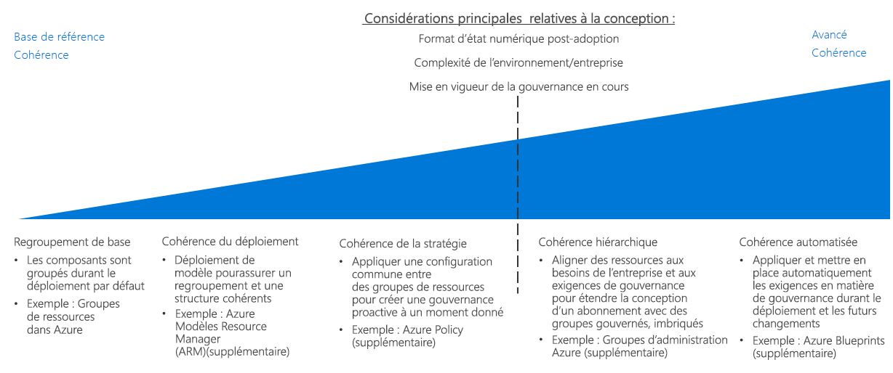

# Framework d’adoption du cloud : Guide de décision pour la cohérence des ressourcesCAF: Resource consistency decision guide

La [conception d’abonnement](../subscriptions/overview.md) Azure définit la façon dont vous organisez vos ressources cloud par rapport à la structure globale de votre organisation.Azure [subscription design](../subscriptions/overview.md) defines how you organize your cloud assets in relation to your organization's overall structure. De plus, l’intégration de vos normes de gestion informatique existantes et de vos stratégies organisationnelles dépend de la façon dont vous déployez et organisez les ressources cloud au sein d’un abonnement.In addition, integrating your existing IT management standards and your organizational policies depends on how you deploy and organize cloud resources within a subscription.

Les outils disponibles pour mettre en œuvre le déploiement, le regroupement et la gestion de vos ressources varient selon la plateforme cloud utilisée.The tools available to implement your resource deployment, grouping, and management designs vary by cloud platform. En général, chaque solution comprend les fonctionnalités suivantes :In general, each solution includes the following features:

- Mécanisme de regroupement logique sous le niveau de l’abonnement ou du compte.A logical grouping mechanism below the subscription or account level.
- Possibilité de déployer les ressources par programmation avec des API.The ability to deploy resources programmatically with APIs.
- Modèles permettant de créer des déploiements standardisés.Templates for creating standardized deployments.
- Possibilité de déployer des règles de stratégie au niveau de l’abonnement, du compte et du regroupement des ressources.The ability to deploy policy rules at the subscription, account, and resource grouping levels.

Passer à : [Regroupement de base](#basic-grouping) | [Cohérence de déploiement](#deployment-consistency) | [Cohérence de stratégie](#policy-consistency) | [Cohérence hiérarchique](#hierarchical-consistency) | [Cohérence automatisée](#automated-consistency)Jump to: [Basic grouping](#basic-grouping) | [Deployment consistency](#deployment-consistency) | [Policy consistency](#policy-consistency) | [Hierarchical consistency](#hierarchical-consistency) | [Automated consistency](#automated-consistency)

Les décisions de déploiement et de regroupement des ressources sont principalement motivées par les facteurs suivants : la taille du parc numérique après la migration, la complexité métier ou environnementale qui ne s’intègre pas parfaitement dans vos approches de conception d’abonnement existantes, ou la nécessité de renforcer la gouvernance au fil du temps après le déploiement des ressources.Resource deployment and grouping decisions are primarily driven by these factors: post-migration digital estate size, business or environmental complexity that doesn't fit neatly within your existing subscription design approaches, or the need to enforce governance over time after resources have been deployed. Les conceptions de regroupement des ressources plus avancées exigent un effort accru pour assurer un regroupement précis, ce qui se traduit par une augmentation du temps consacré à la gestion et au suivi des changements.More advanced resource grouping designs require an increased effort to ensure accurate grouping, and this results in an increase in the time spent on change management and tracking.

## Regroupement de baseBasic grouping

Dans Azure, les [groupes de ressources](/azure/azure-resource-manager/resource-group-overview#resource-groups) sont un mécanisme d’organisation des ressources de base permettant de regrouper logiquement les ressources dans un abonnement.In Azure, [resource groups](/azure/azure-resource-manager/resource-group-overview#resource-groups) are a core resource organization mechanism to logically group resources within a subscription.

Les groupes de ressources servent de conteneurs pour les ressources ayant un cycle de vie commun ou des contraintes de gestion partagées telles que les exigences en matière de stratégie ou de contrôle d’accès en fonction du rôle (RBAC).Resource groups act as containers for resources with a common lifecycle or shared management constraints such as policy or role-based access control (RBAC) requirements. Les groupes de ressources ne peuvent pas être imbriqués et les ressources ne peuvent appartenir qu’à un seul groupe de ressources.Resource groups can't be nested, and resources can only belong to one resource group. Certaines actions peuvent agir sur toutes les ressources contenues dans un groupe de ressources.Some actions can act on all resources in a resource group. Par exemple, la suppression d’un groupe de ressources supprime toutes les ressources dans ce groupe.For example, deleting a resource group removes all resources within that group. Il existe des modèles communs lors de la création de groupes de ressources, généralement répartis en deux catégories :There are common patterns when creating resource groups, commonly divided into two categories:

- Charges de travail informatiques traditionnelles : Elles sont le plus souvent regroupés par éléments au sein d’un même cycle de vie, comme une application.Traditional IT workloads: Most often grouped by items within the same lifecycle, such as an application. Le regroupement par application permet de gestion des applications individuelles.Grouping by application allows for individual application management.
- Charges de travail informatiques de type agile : Elles se concentrent sur les applications cloud pour les clients externes.Agile IT workloads: Focus on external customer-facing cloud applications. Ces groupes de ressources reflètent souvent les couches fonctionnelles de déploiement (comme la couche web ou la couche application) et de gestion.These resource groups often reflect the functional layers of deployment (such as web tier or app tier) and management.

## Cohérence du déploiementDeployment consistency

S’appuyant sur le mécanisme de regroupement des ressources de base, la plupart des plateformes cloud offrent un système permettant d’utiliser des modèles de déploiement de vos ressources dans l’environnement cloud.Building on top of the base resource grouping mechanism, most cloud platforms provide a system for using templates to deploy your resources to the cloud environment. Vous pouvez utiliser des modèles pour créer une organisation et des conventions de nommage cohérentes lors du déploiement des charges de travail, en appliquant ces aspects de la conception du déploiement et de la gestion de vos ressources.You can use templates to create consistent organization and naming conventions when deploying workloads, enforcing those aspects of your resource deployment and management design.

Les [modèles Azure Resource Manager](/azure/azure-resource-manager/resource-group-overview#template-deployment) vous permettent de déployer vos ressources de façon répétée et cohérente en utilisant une configuration prédéterminée et une structure de groupes de ressources.[Azure Resource Manager templates](/azure/azure-resource-manager/resource-group-overview#template-deployment) allow you to repeatedly deploy your resources in a consistent state using a predetermined configuration and resource group structure. Les modèles Resource Manager vous aident à définir un ensemble de standards qui serviront de base à vos déploiements.Resource Manager templates help you define a set of standards as a basis for your deployments.

Par exemple, vous pouvez disposer d’un modèle standard pour déployer une charge de travail de serveur web qui contient deux machines virtuelles en tant que serveurs web combinés avec un équilibreur de charge gérant le trafic entre les serveurs.For example, you can have a standard template for deploying a web server workload that contains two virtual machines as web servers combined with a load balancer to manage traffic between the servers. Vous pouvez ensuite réutiliser ce modèle pour créer des déploiements structurellement identiques chaque fois qu’une nouvelle charge de travail de serveur web est nécessaire, en ne modifiant que le nom du déploiement et les adresses IP concernées.You can then reuse this template to create structurally identical deployments whenever a new web server workload is needed, only changing the deployment name and IP addresses involved.

Notez que vous pouvez également déployer ces modèles à l’aide d’un programme et les intégrer à vos systèmes de CI/CD.Note that you can also programmatically deploy these templates and integrate them with your CI/CD systems.

## Stratégie de cohérencePolicy consistency

Pour s’assurer que les stratégies de gouvernance sont appliquées lors de la création des ressources, une partie de la conception du regroupement des ressources implique l’utilisation d’une configuration commune lors du déploiement des ressources.To ensure that governance policies are applied when resources are created, part of resource grouping design involves using a common configuration when deploying resources.

En combinant des groupes de ressources et des modèles Resource Manager standardisés, vous pouvez appliquer des standards pour les paramètres requis dans un déploiement et les règles [Azure Policy](/azure/governance/policy/overview) appliquées à chaque ressource ou groupe de ressources.By combining resource groups and standardized Resource Manager templates, you can enforce standards for what settings are required in a deployment and what [Azure Policy](/azure/governance/policy/overview) rules are applied to each resource group or resource.

Par exemple, l’une de vos exigences est que toutes les machines virtuelles déployées dans votre abonnement doivent se connecter à un sous-réseau commun géré par votre équipe informatique centrale.For example, you may have a requirement that all virtual machines deployed within your subscription connect to a common subnet managed by your central IT team. Vous pouvez créer un modèle standard pour le déploiement des machines virtuelles de charge de travail qui créerait un groupe de ressources distinct pour la charge de travail et y déploierait les machines virtuelles requises.You can create a standard template for deploying workload VMs which would create a separate resource group for the workload and deploy the required VMs there. Ce groupe de ressources disposerait d’une règle de stratégie permettant uniquement de joindre les interfaces réseau du groupe de ressources au sous-réseau partagé.This resource group would have a policy rule to only allow network interfaces within the resource group to be joined to the shared subnet.

La section [Application de stratégie](../policy-enforcement/overview.md) fournit une discussion approfondie sur la mise en œuvre de vos décisions stratégiques dans le cadre d’un déploiement cloud.For a more in-depth discussion of enforcing your policy decisions within a cloud deployment, see [Policy enforcement](../policy-enforcement/overview.md).

## Cohérence hiérarchiqueHierarchical consistency

Au fur et à mesure que la taille de votre investissement cloud augmente, vous aurez peut-être des exigences de gouvernance plus complexes que celles qui peuvent être prises en charge par la hiérarchie Entreprise/Service/Compte /Abonnement de l’accord Entreprise Azure.As the size of your cloud estate grows, you may need to support more complicated governance requirements than can be supported using the Azure Enterprise Agreement's Enterprise/Department/Account/Subscription hierarchy. Les groupes de ressources vous permettent de prendre en charge des niveaux hiérarchiques supplémentaires au sein de votre organisation, en appliquant les règles Azure Policy et les contrôles d’accès au niveau d’un groupe de ressources.Resource groups allows you to support additional levels of hierarchy within your organization, applying Azure Policy rules and access controls at a resource group level.

Les [groupes d’administration Azure](../subscriptions/overview.md#management-groups) peuvent prendre en charge des structures organisationnelles plus complexes en superposant une hiérarchie alternative à la structure de votre accord entreprise.[Azure management groups](../subscriptions/overview.md#management-groups) can support more complicated organizational structures by overlaying an alternative hierarchy on top of your enterprise agreement's structure. Cela permet aux abonnements et aux ressources qu’ils contiennent de prendre en charge les mécanismes de contrôle d’accès et d’implémentation des stratégies organisés en fonction des exigences organisationnelles de votre entreprise.This allows subscriptions, and the resources they contain, to support access control and policy enforcement mechanisms organized to match your business organizational requirements.

## Cohérence automatiséeAutomated consistency

Pour les grands déploiements cloud, la gouvernance mondiale devient à la fois plus importante et plus complexe.For large cloud deployments, global governance becomes both more important and more complex. Il est essentiel d’appliquer et de faire respecter automatiquement les exigences de gouvernance lors du déploiement des ressources, ainsi que de répondre aux exigences mises à jour pour les déploiements existants.It is crucial to automatically apply and enforce governance requirements when deploying resources, as well as meet updated requirements for existing deployments.

[Azure Blueprints](/azure/governance/blueprints/overview) donnent les moyens aux organisations de supporter la gouvernance globale des vastes domaines cloud dans Azure.[Azure Blueprints](/azure/governance/blueprints/overview) enable organizations to support global governance of large cloud estates in Azure. Les blueprints vont au-delà des fonctionnalités fournies par les modèles standard Azure Resource Manager pour créer des orchestrations de déploiement complètes capables de déployer des ressources et d’appliquer des règles de stratégie.Blueprints move beyond the capabilities provided by standard Azure Resource Manager templates to create complete deployment orchestrations capable of deploying resources and applying policy rules. Les blueprints prennent en charge le contrôle de versions et permettent d’appliquer des mises à jour à tous les abonnements dans lesquels le blueprint a été utilisé. Ils permettent également de bloquer les abonnements déployés pour éviter la création et la modification non autorisées des ressources.Blueprints supports versioning, the ability to make apply updates to all subscriptions where the blueprint was used, and the ability to lock down deployed subscriptions to avoid the unauthorized creation and modification of resources.

Ces packages de déploiement permettent aux équipes informatiques et de développement de déployer rapidement de nouvelles charges de travail et des ressources réseau conformes à l’évolution des exigences des stratégies de l’entreprise.These deployment packages allow IT and development teams to rapidly deploy new workloads and networking assets that comply with changing organizational policy requirements. Les blueprints peuvent également être intégrés dans les pipelines de CI/CD afin d’appliquer les normes de gouvernance révisées aux déploiements au fur et à mesure de leur mise à jour.Blueprints can also be integrated into CI/CD pipelines to apply revised governance standards to deployments as they are updated.

## Étapes suivantesNext steps

Découvrez comment le nommage et le balisage des ressources sont utilisés pour mieux organiser et gérer vos ressources cloud.Learn how resource naming and tagging are used to further organize and manage your cloud resources.

> [!div class="nextstepaction"]
> [Nommage et marquage des ressourcesResource naming and tagging](../resource-tagging/overview.md)
