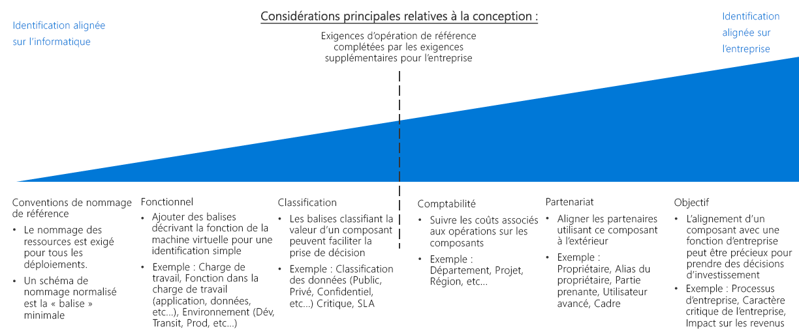

# Guide de décision concernant l’organisation et l’étiquetage des ressources

L’organisation des ressources cloud est l’une des tâches les plus importantes du service informatique, sauf si vos déploiements sont très simples. L’organisation de vos ressources remplit trois objectifs principaux :

- **Gestion des ressources**. Votre équipe informatique devra trouver rapidement les ressources associées aux charges de travail, aux environnements, aux groupes de propriété ou autres informations importantes. L’organisation des ressources est essentielle à l’affectation des rôles organisationnels et aux autorisations d’accès pour la gestion des ressources.
- **Opérations**. En plus de faciliter la gestion des ressources pour le personnel informatique, un bon modèle organisationnel vous permet de tirer parti de l’automatisation dans le cadre de la création de ressources, de la supervision des opérations et de la création de processus DevOps.
- **Comptabilité**. Pour informer les groupes métier de leur consommation de ressources cloud, le service informatique doit d’abord connaître les ressources qui sont utilisées par les charges de travail et les différentes équipes. Pour prendre en charge les approches telles que la facturation de type chargeback/showback, les ressources cloud doivent être organisées de manière à refléter leur propriété et leur utilisation.

## Guide de décision concernant l’étiquetage

Passer à : [Conventions de nommage des bases de référence](#baseline-naming-conventions) | [Modèles d’étiquetage des ressources](#resource-tagging-patterns) | [Stratégie de nommage et d’étiquetage](#naming-and-tagging-policy) | [En savoir plus](#learn-more)

Votre approche d’étiquetage peut être simple ou complexe, et mettre l’accent aussi bien sur l’aide apportée au personnel informatique chargé de gérer les charges de travail cloud, que sur l’intégration des informations relatives à tous les aspects de l’entreprise.

Un étiquetage aligné sur l’informatique simplifie la supervision des ressources ainsi que la prise de décisions de gestion basées sur les fonctionnalités et la classification.

L’étiquetage des schémas qui incluent également des stratégies non liées à l’informatique peut nécessiter plus de temps pour créer des normes d’étiquetage qui reflètent les intérêts métier, et pour conserver ces normes. Toutefois, le résultat de ce processus est un système d’étiquetage qui permet de mieux prendre en compte les coûts ainsi que la valeur des ressources informatiques. Le fait d’associer la valeur d’une ressource à son coût d’exploitation est l’une des premières étapes permettant de modifier la façon dont votre organisation perçoit l’informatique en tant que centre de coûts.

## Conventions de nommage des bases de référence

Une convention de nommage standardisée constitue le point de départ de l’organisation de vos ressources hébergées dans le cloud. Un système de nommage correctement structuré vous permet d’identifier rapidement les ressources à des fins de gestion et de comptabilité. Si vous disposez déjà de conventions de nommage informatiques dans d’autres services de votre organisation, déterminez si les conventions de nommage des ressources cloud doivent s’aligner sur ces conventions ou si vous devez établir des standards distincts pour le cloud.

Notez également que les [exigences de nommage](../../../best-practices/naming-conventions.md#naming-rules-and-restrictions) varient selon le type de ressource Azure. Vos conventions de nommage doivent être compatibles avec ces exigences de nommage.

## Modèles d’étiquetage des ressources

Pour obtenir une organisation plus sophistiquée que celle fournie par une convention de nommage cohérente seule, les plateformes cloud permettent d’étiqueter les ressources.

Les *étiquettes* sont des éléments de métadonnées qui sont associés aux ressources. Les étiquettes sont constituées de paires de chaînes clé/valeur. Il vous revient de choisir les valeurs à inclure dans ces paires. Toutefois, l’application d’un ensemble cohérent d’étiquettes globales, faisant partie d’une stratégie de nommage et d’étiquetage complète, constitue un élément essentiel des stratégies globales de gouvernance.

Voici quelques exemples de modèles d’étiquetage courants :

<!-- markdownlint-disable MD033 -->

| Type d’étiquette | Exemples | Description |
|-----|-----|-----|
| Fonctionnelle            | app = catalogsearch1  tier = web  webserver = apache env = prod  env = staging  env = dev                 | Permet d’attribuer une catégorie aux ressources par rapport à leur rôle au sein d’une charge de travail, à l’environnement dans lequel elles ont été déployées, ou par rapport à d’autres fonctionnalités ou détails opérationnels.                                 |
| Classification        | confidentiality=private sla = 24hours                                 | Classifie une ressource selon son utilisation et les stratégies qui y sont appliquées                               |
| Comptabilité            | department = finance  project = catalogsearch  region = northamerica | Permet à la ressource d’être associée à des groupes d’une organisation à des fins de facturation |
| Partenariat           | owner = jsmith  contactalias = catsearchowners stakeholders = user1;user2;user3                        | Fournit des informations sur la façon dont les utilisateurs (en dehors de l’équipe informatique) sont liés à la ressource ou affectés par celle-ci.                      |
| Objectif               | businessprocess=support businessimpact=moderate revenueimpact=high   | Aligne les ressources sur les fonctions métier pour mieux prendre en charge les décisions relatives aux investissements  |

<!-- markdownlint-enable MD033 -->

## Nommage et étiquetage des ressources

Votre stratégie de nommage et d’étiquetage va évoluer au fil du temps. Cependant, il est essentiel de déterminer vos principales priorités organisationnelles dès le début de votre migration vers le cloud. Dans le cadre de votre processus de planification, étudiez attentivement les questions suivantes :

- Quelle est la meilleure façon d’intégrer vos stratégies de nommage et d’étiquetage aux stratégies de nommage et aux stratégies organisationnelles qui existent dans votre organisation ?
- Allez-vous implémenter un système de comptabilité de type chargeback/showback ? Comment sont représentés vos services, vos groupes métier et vos équipes dans cette structure organisationnelle ?
- Quelles informations d’étiquetage sont nécessaires pour toutes les ressources ? Quelles informations d’étiquetage reviendra-t-il à chaque équipe d’implémenter ou non ?
- L’étiquetage doit-il présenter des informations telles que les exigences de conformité réglementaire pour une ressource ? Qu’en est-il des détails opérationnels tels que les exigences de disponibilité, la planification des mises à jour correctives et les exigences de sécurité ?

## En savoir plus

Pour plus d’informations sur le nommage et l’étiquetage dans Azure, consultez :

- [Conventions d’affectation de noms pour les ressources Azure](../../../best-practices/naming-conventions.md). Reportez-vous aux instructions de ce site Azure Cloud Fundamentals pour connaître les conventions de nommage recommandées pour les ressources Azure.
- [Organisation des ressources Azure à l’aide d’étiquettes](/azure/azure-resource-manager/resource-group-using-tags?toc=/azure/billing/TOC.json). Dans Azure, vous pouvez appliquer des étiquettes au niveau des groupes de ressources et au niveau des ressources, ce qui vous permet de choisir le niveau de granularité des rapports comptables en fonction des étiquettes appliquées.

## Étapes suivantes

Découvrez comment le chiffrement est utilisé pour sécuriser les données dans les environnements cloud.

> [!div class="nextstepaction"]
> [Chiffrement](../encryption/overview.md)
