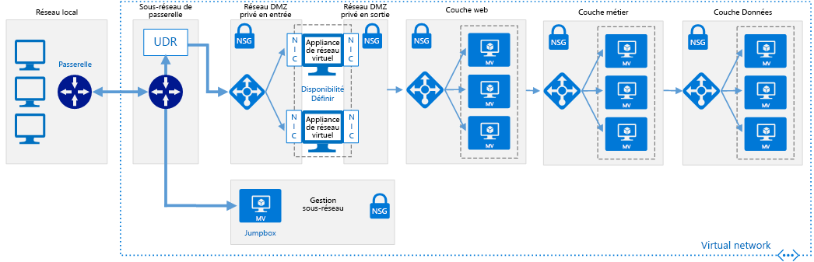

# Réseaux à définition logicielle : Zone DMZ cloudSoftware Defined Networks: Cloud DMZ

L’architecture de réseau DMZ cloud permet un accès limité entre vos réseaux locaux et ceux basés sur le cloud en utilisant un réseau privé virtuel (VPN) pour les connecter.The Cloud DMZ network architecture allows limited access between your on-premises and cloud-based networks, using a virtual private network (VPN) to connect the networks. Une zone démilitarisée (DMZ) est déployée dans le cloud afin de sécuriser l’accès au réseau local à partir des ressources cloud.A DMZ is deployed in the cloud to secure access to the on-premises network from cloud-based resources.

Cette architecture est conçue pour prendre en charge les scénarios dans lesquels votre organisation souhaite commencer à intégrer les charges de travail basées sur le cloud avec celles en local, mais qu’elle ne dispose pas de stratégies de sécurité cloud suffisamment matures ou qu’elle n’a pas acquis de connexion WAN dédiée sécurisée entre les deux environnements.This architecture is designed to support scenarios where your organization wants to start integrating cloud-based workloads with on-premises workloads but may not have fully matured cloud security policies or acquired a secure dedicated WAN connection between the two environments. Par conséquent, les réseaux cloud doivent être traités en tant que zone démilitarisée (DMZ) afin de garantir la sécurité des services locaux.As a result, cloud networks should be treated like a demilitarized zone to ensure on-premises services are secure.

La DMZ déploie des appliances virtuelles réseau (NVA) pour implémenter des fonctionnalités de sécurité telles que des pare-feu et l’inspection des paquets.The DMZ deploys network virtual appliances (NVAs) to implement security functionality such as firewalls and packet inspection. Le trafic circulant entre les services et applications basés sur le cloud et ceux en local doit passer par la DMZ où il est audité.Traffic passing between on-premises and cloud-based applications or services must pass through the DMZ where it can be audited. Les connexions VPN et les règles qui autorisent le trafic via le réseau DMZ sont strictement contrôlées par les équipes de sécurité informatique.VPN connections and the rules determining what traffic is allowed through the DMZ network are strictly controlled by IT security teams.

## Hypothèses relatives à la zone démilitarisée cloudCloud DMZ assumptions

Le déploiement d’une zone démilitarisée cloud implique les hypothèses suivantes :Deploying a Cloud DMZ assumes the following:

- Vos équipes de sécurité n’ont pas complètement aligné les exigences et les stratégies de sécurité locales et celles basées sur le cloud.Your security teams have not fully aligned on-premises and cloud-based security requirements and policies.
- Vos charges de travail cloud nécessitent un accès limité aux services hébergés sur vos réseaux locaux ou tiers, ou vos utilisateurs ou applications locaux doivent bénéficier d’un accès limité aux ressources hébergées dans le cloud.Your cloud-based workloads require limited access to services hosted on your on-premises or third-party networks, or your users or applications in your on-premises environment need limited access to cloud-hosted resources.
- L’implémentation d’une connexion VPN entre vos réseaux locaux et le fournisseur de cloud n’est pas empêchée par une stratégie d’entreprise, des exigences réglementaires ou des problèmes de compatibilité technique.Implementing a VPN connection between your on-premises networks and cloud provider is not prevented by corporate policy, regulatory requirements, or technical compatibility issues.
- Vos charges de travail ne nécessitent pas plusieurs abonnements pour contourner les limites de ressources d’abonnement, ou elles impliquent plusieurs abonnements mais ne nécessitent pas de gestion centrale de la connectivité ou des services partagés utilisés par les ressources réparties sur plusieurs abonnements.Your workloads either do not require multiple subscriptions to bypass subscription resource limits, or they involve multiple subscriptions but don't require central management of connectivity or shared services used by resources spread across multiple subscriptions.

Lors de l’examen de l’implémentation d’une architecture de réseau virtuel DMZ cloud, votre équipe chargée de l’adoption du cloud doit prendre en compte les problèmes suivants :Your Cloud Adoption team should consider the following issues when looking at implementing a Cloud DMZ virtual networking architecture:

- La connexion de réseaux locaux avec des réseaux cloud augmente la complexité de vos exigences de sécurité.Connecting on-premises networks with cloud networks increases the complexity of your security requirements. Même si la connexion entre les réseaux cloud et l’environnement local est sécurisée, vous devez toujours veiller à la sécurité des ressources cloud.Even though the connection between cloud networks and the on-premises environment are secured, you still need to ensure cloud resources are secured.
- L’architecture DMZ cloud sert souvent de tremplin, pendant que la sécurité de la connectivité est renforcée et que la stratégie de sécurité est alignée entre les réseaux locaux et cloud, ce qui permet une plus large adoption de l’architecture de mise en réseau hybride à grande échelle.The Cloud DMZ architecture is commonly used as a stepping stone while connectivity is further secured and security policy aligned between on-premises and cloud networks, allowing a broader adoption of a full-scale hybrid networking architecture.

## En savoir plusLearn more

Pour plus d’informations sur l’implémentation d’une zone démilitarisée cloud dans la plateforme Azure, consultez la rubrique suivante.See the following for more information about the implementing a Cloud DMZ in the Azure platform.

- [Implémenter une zone DMZ entre Azure et votre centre de données local](../../../reference-architectures/dmz/secure-vnet-hybrid.md).[Implement a DMZ between Azure and your on-premises datacenter](../../../reference-architectures/dmz/secure-vnet-hybrid.md). Cet article explique comment implémenter une architecture réseau hybride sécurisée dans Azure.This article discusses how to implement a secure hybrid network architecture in Azure.
