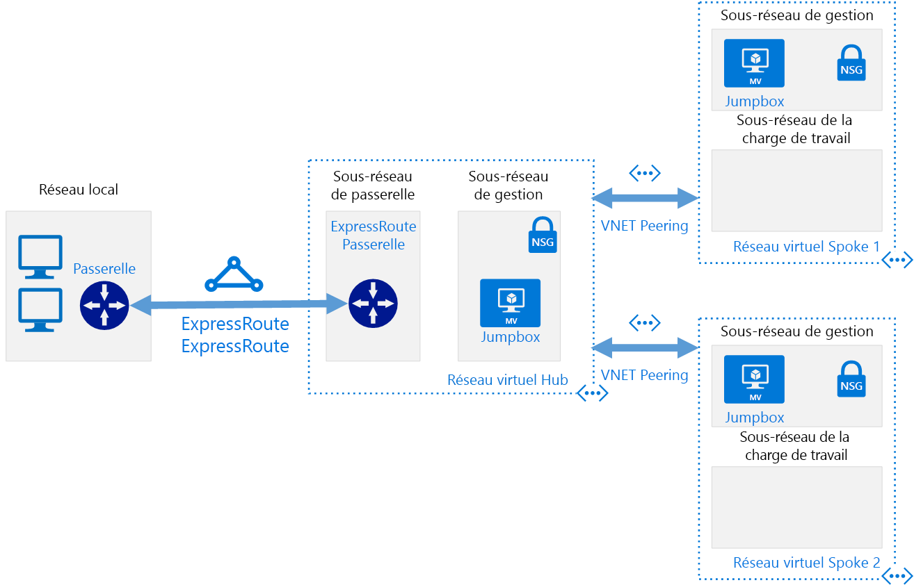

# Réseaux à définition logicielle : Hub-and-SpokeSoftware Defined Networks: Hub and Spoke

Avec le modèle de mise en réseau hub-and-spoke, vous pouvez organiser votre infrastructure de réseau cloud basée sur Azure en plusieurs réseaux virtuels connectés.The hub and spoke networking model organizes your Azure-based cloud network infrastructure into multiple connected virtual networks. Ce modèle vous permet de gérer plus efficacement les exigences courantes en matière de communication ou de sécurité et de faire face aux potentielles limitations des abonnements.This model allows you to more efficiently manage common communication or security requirements and deal with potential subscription limitations.

Dans le modèle hub-and-spoke, le *hub* est un réseau virtuel qui joue le rôle d’emplacement central pour gérer la connectivité externe et les services d’hébergement qui sont utilisés par plusieurs charges de travail.In the hub and spoke model, the *hub* is a virtual network that acts as a central location for managing external connectivity and hosting services used by multiple workloads. Le terme *spokes* (rayons) désigne des réseaux virtuels qui hébergent des charges de travail et se connectent au hub central à l’aide du [peering de réseaux virtuels](/virtual-network/virtual-network-peering-overview).The *spokes* are virtual networks that host workloads and connect to the central hub through [virtual network peering](/virtual-network/virtual-network-peering-overview).

L’intégralité du trafic qui entre ou sort des réseaux spoke pour la charge de travail est acheminée via le réseau hub. Le trafic peut alors être routé, examiné ou géré par les règles ou processus informatiques centralisés.All traffic passing in or out of the workload spoke networks is routed through the hub network where it can be routed, inspected, or otherwise managed by centrally managed IT rules or processes.

Ce modèle vise à résoudre les problèmes suivants :This model aims to address the following issues:

- Réduction des coûts et amélioration de la gestion :Cost savings and management efficiency. En centralisant les services qui peuvent être partagés par plusieurs charges de travail (comme les appliances virtuelles réseau et les serveurs DNS) en un seul endroit, le service informatique est capable de réduire la redondance des ressources et les efforts de gestion sur plusieurs charges de travail.Centralizing services that can be shared by multiple workloads, such as network virtual appliances (NVAs) and DNS servers, in a single location allows IT to minimize redundant resources and management effort across multiple workloads.
- Dépassement des limites des abonnements :Overcoming subscriptions limits. Pour exécuter les charges de travail volumineuses dans le cloud, il se peut que vous ayez besoin d’utiliser davantage de ressources que le quota autorisé par un abonnement Azure unique (consultez les [limites d’abonnement](/azure/azure-subscription-service-limits)).Large cloud-based workloads may require the use of more resources than are allowed within a single Azure subscription (see [subscription limits](/azure/azure-subscription-service-limits)). Vous avez la possibilité de dépasser ces limites en appairant des réseaux virtuels de charge de travail issus de différents abonnements à un hub central.Peering workload virtual networks from different subscriptions to a central hub can overcome these limits.
- Séparation des problèmes :Separation of concerns. Vous avez la possibilité de déployer des charges de travail individuelles entre les équipes informatiques centrales et celles dédiées aux charges de travail.The ability to deploy individual workloads between central IT teams and workloads teams.

Le schéma suivant présente un exemple d’architecture hub-and-spoke comprenant une connectivité hybride centralisée.The following diagram shows an example hub and spoke architecture including centrally managed hybrid connectivity.

L’architecture hub-and-spoke est souvent utilisée parallèlement à l’architecture de mise en réseau hybride, en fournissant une connexion centralisée à votre environnement local partagé entre plusieurs charges de travail.The hub and spoke architecture is often used alongside the hybrid networking architecture, providing a centrally managed connection to your on-premises environment shared between multiple workloads. Dans ce scénario, l’intégralité du trafic qui transite entre les charges de travail et le site local passe par le hub où il peut être géré et sécurisé.In this scenario, all traffic traveling between the workloads and on-premises passes through the hub where it can be managed and secured.

## Hypothèses relatives à hub-and-spokeHub and spoke assumptions

L’implémentation d’une architecture de mise en réseau virtuel hub-and-spoke suppose les hypothèses suivantes :Implementing a hub and spoke virtual networking architecture assumes the following:

- Vos déploiements cloud impliquent des charges de travail hébergées dans des environnements de travail distincts (développement, test et production, par exemple) qui s’appuient sur un ensemble de services communs tels qu’un DNS ou des services d’annuaire.Your cloud deployments will involve workloads hosted in separate working environments, such as development, test, and production, that all rely on a set of common services such as DNS or directory services.
- Vos charges de travail n’ont pas besoin de communiquer entre elles, mais elles disposent de communications externes communes et d’exigences de services partagées.Your workloads do not need to communicate with each other but have common external communications and shared services requirements.
- Vos charges de travail nécessitent davantage de ressources que celles disponibles dans un seul abonnement Azure.Your workloads require more resources than are available within a single Azure subscription.
- Vous devez accorder des droits d’administration délégués aux équipes dédiées aux charges de travail pour leurs propres ressources, tout en conservant le contrôle central de sécurité sur la connectivité externe.You need to provide workload teams with delegated management rights over their own resources while maintaining central security control over external connectivity.

## Modèle hub-and-spoke mondialGlobal hub and spoke

Les architectures hub-and-spoke sont généralement implémentées avec des réseaux virtuels déployés dans la même région Azure afin de réduire la latence entre les réseaux.Hub and spoke architectures are commonly implemented with virtual networks deployed to the same Azure Region to minimize latency between networks. Toutefois, il se peut que les grandes organisations d’envergure mondiale doivent déployer des charges de travail dans plusieurs régions à des fins de disponibilité, de récupération d’urgence ou de respect des exigences réglementaires.However, large organizations with global reach may need to deploy workloads across multiple regions for availability, disaster recovery, or regulatory requirements. Grâce à l’utilisation du [peering de réseau virtuel mondial](/azure/virtual-network/virtual-network-peering-overview), le modèle hub-and-spoke peut étendre la gestion centralisée et le partage de services entre plusieurs régions pour répondre aux charges de travail réparties dans le monde entier.Through the use of Azure [global virtual network peering](/azure/virtual-network/virtual-network-peering-overview), the hub and spoke model can extend centralized management and shared services across regions to support workloads distributed across the world.

## En savoir plusLearn more

Pour obtenir des exemples illustrant l’implémentation des réseaux hub-and-spoke dans Azure, consultez les rubriques suivantes sur le site des architectures de référence Azure :For examples of how to implement hub and spoke networks on Azure, see the following examples on the Azure Reference Architectures site:

- [Implémenter une topologie de réseau hub-and-spoke dans AzureImplement a hub-spoke network topology in Azure](../../../reference-architectures/hybrid-networking/hub-spoke.md)
- [Implémenter une topologie de réseau hub-and-spoke avec des services partagés dans AzureImplement a hub-spoke network topology with shared services in Azure](../../../reference-architectures/hybrid-networking/shared-services.md)
