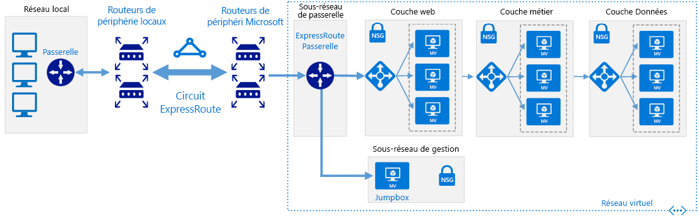

# Réseaux à définition logicielle : Réseau hybrideSoftware Defined Networks: Hybrid network

L’architecture réseau cloud hybride permet aux réseaux virtuels d’accéder à vos ressources et services locaux, et inversement, en utilisant une connexion WAN dédiée telle qu’ExpressRoute ou une autre méthode de connexion permettant de connecter directement les réseaux.The hybrid cloud network architecture allows virtual networks to access your on-premises resources and services and vice versa, using a Dedicated WAN connection such as ExpressRoute or other connection method to directly connect the networks.

S’appuyant sur l’architecture réseau virtuel native du cloud, un réseau virtuel hybride est isolé lors de sa création.Building on the cloud native virtual network architecture, a hybrid virtual network is isolated when initially created. L’ajout de connectivité à l’environnement locale ouvre l’accès au réseau local et à partir de celui-ci. Cependant, tous les autres ressources ciblant le trafic entrant dans le réseau virtuel doivent être autorisées explicitement.Adding connectivity to the on-premises environment grants access to and from the on-premises network, although all other inbound traffic targeting resources in the virtual network need to be explicitly allowed. Vous pouvez sécuriser la connexion à l’aide de dispositifs de pare-feu virtuel et de règles d’acheminement pour limiter l’accès, ou spécifier les services accessibles entre les deux réseaux en utilisant des fonctionnalités de routage natif cloud ou en déployant des appliances virtuelles réseau pour gérer le trafic.You can secure the connection using virtual firewall devices and routing rules to limit access or you can specify exactly what services can be accessed between the two networks using cloud-native routing features or deploying network virtual appliances (NVAs) to manage traffic.

Bien que l’architecture réseau hybride prenne en charge les connexions VPN, des connexions WAN dédiées telles qu’ExpressRoute sont généralement préférées en raison de leurs performances supérieures et de leur sécurité accrue.Although the hybrid networking architecture supports VPN connections, dedicated WAN connections like ExpressRoute are generally preferred due to higher performance and increased security.

## Postulats concernant le caractère hybrideHybrid assumptions

Le déploiement d’un réseau virtuel hybride suppose ce qui suit :Deploying a hybrid virtual network assumes the following:

- Vos équipes de sécurité informatique ont harmonisé les stratégies de sécurité réseau locale et cloud pour s’assurer que des réseaux virtuels cloud puissent être approuvés pour communiquer directement avec des systèmes locaux.Your IT security teams have aligned on-premises and cloud-based network security policy to ensure cloud-based virtual networks can be trusted to communicated directly with on-premises systems.
- Vos charges de travail cloud nécessitent un accès au stockage, aux applications et aux services hébergés sur vos réseaux locaux ou tiers, ou vos utilisateurs ou applications locaux doivent avoir accès aux ressources hébergées dans le cloud.Your cloud-based workloads require access to storage, applications, and services hosted on your on-premises or third-party networks, or your users or applications in your on-premises need access to cloud-hosted resources.
- Vous devez migrer les applications et services existants qui dépendent de ressources locales, mais vous ne voulez pas utiliser les ressources en redéveloppement pour supprimer ces dépendances.You need to migrate existing applications and services that depend on on-premises resources, but don't want to expend the resources on redevelopment to remove those dependencies.
- L’implémentation d’un VPN ou d’une connexion WAN dédiée entre vos réseaux locaux et le fournisseur de cloud n’est pas empêchée par une stratégie d’entreprise, des exigences réglementaires ou des problèmes de compatibilité technique.Implementing a VPN or dedicated WAN connection between your on-premises networks and cloud provider is not prevented by corporate policy, regulatory requirements, or technical compatibility issues.
- Vos charges de travail ne nécessitent pas plusieurs abonnements pour contourner les limites de ressources d’abonnement, OU vos charges de travail impliquent plusieurs abonnements mais ne nécessitent pas de gestion centrale de la connectivité ou des services partagés utilisés par des ressources réparties sur plusieurs abonnements.Your workloads either do not require multiple subscriptions to bypass subscription resource limits, OR your workloads involve multiple subscriptions but do not require central management of connectivity or shared services used by resources spread across multiple subscriptions.

Lors de l’examen de l’implémentation d’une architecture de réseau virtuel hybride, votre équipe chargée de l’adoption du cloud doit prendre en compte les problèmes suivants :Your Cloud Adoption team should consider the following issues when looking at implementing a hybrid virtual networking architecture:

- La connexion de réseaux locaux avec des réseaux cloud augmente la complexité de vos exigences de sécurité.Connecting on-premises networks with cloud networks increases the complexity of your security requirements. Les deux réseaux doivent être protégés contre les vulnérabilités externes et les accès non autorisés des deux côtés de l’environnement hybride.Both networks need to be secured against external vulnerabilities and unauthorized access from both sides of the hybrid environment.
- Une mise à l’échelle du nombre et de la taille des charges de travail à l’intérieur d’un environnement cloud hybride peut ajouter une complexité considérable à la gestion du routage et du trafic.Scaling the number and size of workloads within a hybrid cloud environment can add significant complexity to routing and traffic management.
- Vous devez développer des stratégies de gestion et de contrôle d’accès compatibles pour maintenir la cohérence de la gouvernance dans l’ensemble de votre organisation.You will need to develop compatible management and access control policies to maintain consistent governance throughout your organization.

## En savoir plusLearn more

Pour plus d’informations sur la mise en réseau hybride dans la plateforme Azure, consultez la rubrique suivante.See the following for more information about hybrid networking in the Azure platform.

- [Architecture de référence de réseau hybride](../../../reference-architectures/hybrid-networking/expressroute.md).[Hybrid network reference architecture](../../../reference-architectures/hybrid-networking/expressroute.md). Les réseaux virtuels hybrides Azure utilisent un circuit ExpressRoute ou un VPN Azure pour connecter votre réseau virtuel aux ressources informatiques hébergées existantes autres qu’Azure de votre organisation.Azure hybrid virtual networks use either an ExpressRoute circuit or Azure VPN to connect your virtual network with your organization's existing non-Azure hosted IT assets. Cet article décrit les options pour la création d’un réseau hybride dans Azure.This article discusses the options for creating a hybrid network in Azure.
