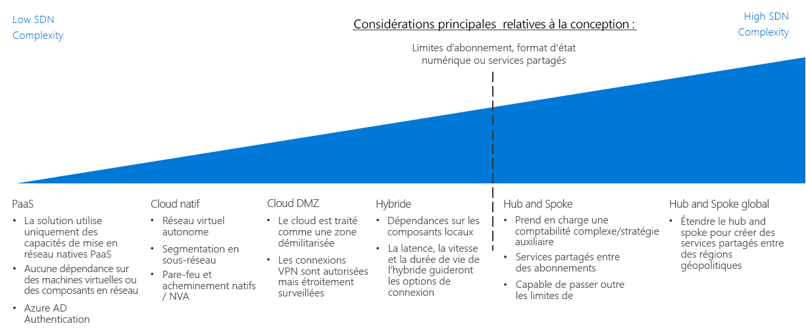

# Framework d’adoption du cloud : Guide de décision concernant le SDN (Software Defined Network)CAF: Software Defined Network decision guide

La mise en réseau définie par logiciel (ou SDN, pour Software Defined Networking) est une architecture réseau conçue pour permettre une fonctionnalité réseau virtualisée qui peut être gérée, configurée et modifiée de manière centralisée par logiciel.Software Defined Networking (SDN) is a network architecture designed to allow virtualized networking functionality that can be centrally managed, configured, and modified through software. Le SDN fournit une couche d’abstraction sur l’infrastructure de réseau physique et permet l’équivalent virtualisé des routeurs physiques, pare-feu et autres matériels réseau que l’on trouve dans un réseau sur site.SDN provides an abstraction layer over the physical networking infrastructure, and enables the virtualized equivalent to physical routers, firewalls, and other networking hardware you would find in an on-premises network.

SDN permet au personnel informatique de configurer et de déployer des structures et des capacités réseau qui prennent en charge les besoins de charge de travail à l’aide de ressources virtualisées.SDN allows IT staff to configure and deploy network structures and capabilities that support workload needs using virtualized resources. La souplesse de la gestion des déploiements par logiciel permet de modifier rapidement les ressources réseau et de prendre en charge les modèles de déploiement à la fois agiles et traditionnels.The flexibility of software-based deployment management enables rapid modification of networking resources and allows the ability to support both agile and traditional deployment models. Les réseaux virtualisés créés avec la technologie SDN sont essentiels à la création de réseaux sécurisés sur une plate-forme de cloud public.Virtualized networks created with SDN technology are critical to creating secure networks on a public cloud platform.

## Guide de décision concernant la mise en réseauNetworking decision guide

Passer à : [PaaS uniquement](paas-only.md) | [Natif cloud](cloud-native.md) | | [Zone DMZ cloud](cloud-dmz.md) [Hybride](hybrid.md) | [Modèle hub-and-spoke](hub-spoke.md) | [En savoir plus](#learn-more)Jump to: [PaaS Only](paas-only.md) | [Cloud native](cloud-native.md) | | [Cloud DMZ](cloud-dmz.md) [Hybrid](hybrid.md) | [Hub/Spoke model](hub-spoke.md) | [Learn more](#learn-more)

Le SDN fournit plusieurs options avec différents degrés de complexité et de tarification.SDN provides several options with varying degrees of pricing and complexity. Le guide de découverte ci-dessus fournit une référence pour personnaliser rapidement ces options afin de s’aligner au mieux sur des stratégies commerciales et technologiques spécifiques.The above discovery guide provides a reference to quickly personalize these options to best align with specific business and technology strategies.

Le point d’inflexion de ce guide dépend de plusieurs décisions clés que votre équipe Cloud Strategy a prises avant de prendre des décisions sur l’architecture réseau.The inflection point in this guide depends on several key decisions that your Cloud Strategy team have made before making decisions about networking architecture. Les plus importantes sont les décisions concernant votre [Définition de la succession numérique](../../digital-estate/overview.md) et [Conception de l’abonnement](../subscriptions/overview.md). (ce qui peut également nécessiter des données provenant de décisions prises dans le cadre de votre comptabilité dans le cloud et de vos stratégies sur les marchés mondiaux).Most important among these are decisions involving your [Digital Estate definition](../../digital-estate/overview.md) and [Subscription Design](../subscriptions/overview.md) (which may also require inputs from decisions made related to your cloud accounting and global markets strategies).

Les petits déploiements dans une seule région de moins de 1 000 VM sont moins susceptibles d’être affectés de façon significative par ce point d’inflexion.Small, single region deployments of less than 1,000 VMs are less likely to be significantly affected by this inflection point. Inversement, des efforts d’adoption importants avec plus de 1 000 machines virtuelles, de multiples unités commerciales ou de multiples marchés géostratégies pourraient être considérablement affectés par votre décision SDN et ce point d’inflexion clé.Conversely, large adoption efforts with more than 1,000 VMs, multiple business units, or multiple geo-politic markets, could be substantially affected by your SDN decision and this key inflection point.

## Choisir les bonnes architectures de réseaux virtuelsChoosing the right virtual networking architectures

Cette section développe le guide de décision pour vous aider à choisir les bonnes architectures de réseau virtuel.This section expands on the decision guide to help you choose the right virtual networking architectures.

Il existe de nombreuses façons de mettre en œuvre les technologies SDN pour créer des réseaux virtuels cloud.There are many ways to implement SDN technologies to create cloud-based virtual networks. La façon dont vous structurez les réseaux virtuels utilisés dans votre migration et la façon dont ces réseaux interagissent avec votre infrastructure informatique existante dépendra d’une combinaison des exigences en matière de charge de travail et de gouvernance.How you structure the virtual networks used in your migration and how those networks interact with your existing IT infrastructure will depend on a combination of the workload requirements and your governance requirements.

Lors de la planification de l’architecture de réseau virtuel ou de la combinaison d’architectures à prendre en compte lors de la planification de votre migration vers le Cloud, prenez en compte les questions suivantes pour déterminer ce qui convient à votre entreprise :When planning which virtual networking architecture or combination of architectures to consider when planning your cloud migration, consider the following questions to help determine what's right for your organization:

| QuestionQuestion | PaaS uniquementPaaS Only | Natif cloudCloud Native | Zone DMZ cloudCloud DMZ | HybrideHybrid | Hub-and-SpokeHub and Spoke |
|-----|-----|-----|-----|-----|-----|
| Votre charge de travail utilisera-t-elle uniquement les services PaaS ? Ses besoins en capacités réseau seront-ils supérieurs à celles fournies par les services eux-mêmes ?Will your workload only use PaaS services and not require networking capabilities beyond those provided by the services themselves? | OUIYes | Non No | Non No | Non No | Non No |
| Votre charge de travail nécessite-t-elle une intégration avec des applications sur site ?Does your workload require integration with on-premises applications? | Non No | Non No | OUIYes | OUIYes | OUIYes |
| Avez-vous établi des stratégies de sécurité avancées et une connectivité sécurisée entre vos locaux et vos réseaux cloud ?Have you established mature security policies and secure connectivity between your on-premises and cloud networks? | Non No | Non No | Non No | OUIYes | OUIYes |
| Votre charge de travail nécessite-t-elle des services d’authentification non pris en charge par les services d’identité cloud, ou avez-vous besoin d’un accès direct aux contrôleurs de domaine locaux ?Does your workload require authentication services not supported through cloud identity services, or do you need direct access to on-premises domain controllers? | Non No | Non No | Non No | OUIYes | OUIYes |
| Devrez-vous déployer et gérer un grand nombre de machines virtuelles et de charges de travail ?Will you need to deploy and manage a large number of VMs and workloads? | Non No | Non No | Non No | Non No | OUIYes |
| Devrez-vous fournir une gestion centralisée et une connectivité locale tout en déléguant le contrôle des ressources à des équipes de travail individuelles ?Will you need to provide centralized management and on-premises connectivity while delegating control over resources to individual workload teams? | Non No | Non No | Non No | Non No | OUIYes |

## Architectures de réseaux virtuelsVirtual networking architectures

En savoir plus sur les principales architectures réseau définies par le logiciel :Learn more about the primary software defined networking architectures:

- [**PaaS uniquement**](paas-only.md) : Les produits PaaS (Platform as a Service) prennent en charge un ensemble limité de fonctions réseau intégrées et peuvent ne pas nécessiter un réseau défini explicitement par un logiciel pour répondre aux exigences de charge de travail.[**PaaS Only**](paas-only.md): Platform as a service (PaaS) products support a limited set of built-in networking features and may not require an explicitly defined software defined network to support workload requirements.
- [**Natif cloud**](cloud-native.md) : Un réseau virtuel natif du cloud est l’architecture réseau par défaut définie par le logiciel lors du déploiement de ressources sur une plate-forme cloud.[**Cloud Native**](cloud-native.md): A cloud native virtual network is the default software defined networking architecture when deploying resources to a cloud platform.
- [**Zone DMZ cloud**](cloud-dmz.md) : Fournit une connectivité limitée entre vos locaux et le réseau cloud qui est sécurisé par la mise en œuvre d’une zone démilitarisée sur l’environnement cloud.[**Cloud DMZ**](cloud-dmz.md): Provides limited connectivity between your on-premises and cloud network which is secured through the implementation of a demilitarized zone on the cloud environment.
- [**Hybride**](hybrid.md) : L’architecture de réseau cloud hybride permet aux réseaux virtuels d’accéder à vos ressources sur site et vice versa.[**Hybrid**](hybrid.md): The hybrid cloud network architecture allows virtual networks to access your on-premises resources and vice versa.
- [**Hub-and-spoke**](hub-spoke.md) : L’architecture hub-and-spoke vous permet de gérer de manière centralisée la connectivité externe et les services partagés, d’isoler les charges de travail individuelles et de surmonter les limites d’abonnement potentielles.[**Hub and Spoke**](hub-spoke.md): The hub and spoke architecture allows you to centrally manage external connectivity and shared services, isolate individual workloads, and overcome potential subscription limits.

## En savoir plusLearn more

Pour plus d’informations sur la mise en réseau définie par logiciel (ou SDN, pour Software-Defined Networking) dans la plateforme Azure, consultez la rubrique suivante.See the following for more information about software defined networking in the Azure platform.

- [Réseau virtuel Azure](/azure/virtual-network/virtual-networks-overview) :[Azure Virtual Network](/azure/virtual-network/virtual-networks-overview). sur Azure, la capacité fondamentale du SDN est fournie par un réseau virtuel Azure, qui agit comme un cloud analogue aux réseaux physiques locaux.On Azure, the core SDN capability is provided by Azure Virtual Network, which acts as a cloud analog to physical on-premises networks. Les réseaux virtuels servent également de limite d’isolement par défaut entre les ressources de la plate-forme.Virtual networks also act as a default isolation boundary between resources on the platform.
- [Bonnes pratiques en matière de sécurité des réseaux Azure](/azure/security/azure-security-network-security-best-practices) :[Azure Network Security Best Practices](/azure/security/azure-security-network-security-best-practices). suggestions de l’équipe Azure Security sur la façon de configurer vos réseaux virtuels pour minimiser les vulnérabilités de sécurité.Recommendations from the Azure Security team on how to configure your virtual networks to minimize security vulnerabilities.

## Étapes suivantesNext steps

Découvrez comment les équipes opérationnelles utilisent les journaux, la surveillance et la création de rapports pour gérer la conformité des charges de travail dans le cloud en matière d’intégrité et de stratégie.Learn how logs, monitoring, and reporting are used by operations teams to manage the health and policy compliance of cloud workloads.

> [!div class="nextstepaction"]
> [Journaux et rapportsLogs and Reporting](../log-and-report/overview.md)
