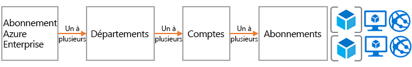
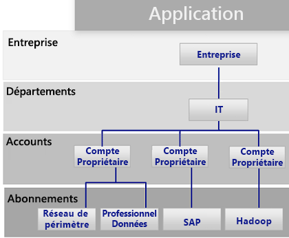
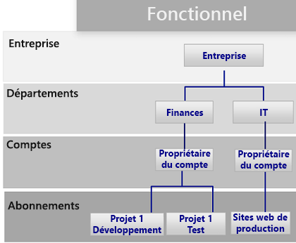
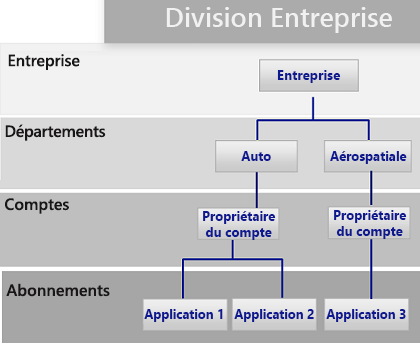
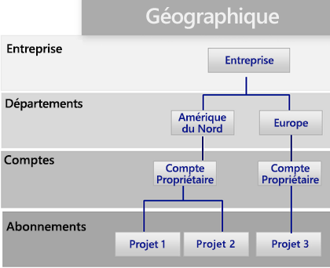

# Guide de décision concernant les abonnementsSubscription decision guide

Toutes les plateformes cloud sont basées sur un modèle de propriété de base qui fournit de nombreuses options de facturation et de gestion des ressources.All cloud platforms are based on a core ownership model that provides organizations with numerous billing and resource management options. La structure qu’utilise Azure est différente de celle des autres fournisseurs cloud, car elle comprend diverses options de prise en charge concernant la hiérarchie organisationnelle et la propriété groupée des abonnements.The structure that Azure uses is different from other cloud providers because it includes various support options for organizational hierarchy and grouped subscription ownership. En général, il y a une personne qui est responsable de la facturation et une autre qui est désignée comme propriétaire principal pour la gestion des ressources.Regardless, there is generally one individual responsible for billing and another who is assigned as the top-level owner for managing resources.

Passer à : [Conception d’abonnements et contrats Entreprise Azure](#subscriptions-design-and-azure-enterprise-agreements) | [Modèles de conception d’abonnements](#subscription-design-patterns) | [Groupes d’administration](#management-groups) | [Organisation au niveau de l’abonnement](#organization-at-the-subscription-level)Jump to: [Subscriptions design and Azure Enterprise Agreements](#subscriptions-design-and-azure-enterprise-agreements) | [Subscription design patterns](#subscription-design-patterns) | [Management groups](#management-groups) | [Organization at the subscription level](#organization-at-the-subscription-level)

La conception d’abonnements est l’une des stratégies les plus couramment utilisées par les entreprises pour établir une structure ou organiser les ressources lors de l’adoption du cloud.Subscription design is one of the most common strategies that companies use to establish a structure or organize assets during cloud adoption.

**Hiérarchie d’abonnement** : Un *abonnement* est une collection logique de services Azure (comme des machines virtuelles, des bases de données SQL, des services d’applications ou des conteneurs).**Subscription hierarchy**: A *subscription* is a logical collection of Azure services (such as virtual machines, SQL DB, App Services, or containers). Dans Azure, chaque ressource est déployée dans un seul abonnement,Each asset in Azure is deployed to a single subscription. et cet abonnement n’appartient qu’à un seul *compte*.Each subscription is then owned by one *account*. Ce compte est un compte d’utilisateur (ou, de préférence, un compte de service) qui fournit l’accès aux fonctionnalités de facturation et d’administration dans l’abonnement.This account is a user account (or preferably a service account) that provides billing and administrative access across a subscription. Pour les clients qui se sont engagés à utiliser une certaine quantité de stockage Azure par le biais d’un contrat Entreprise (EA), un autre niveau de contrôle appelé *département* est ajouté.For customers who have made a commitment to use a specific amount of Azure through an Enterprise Agreement (EA), another level of control called a *department* is added. Dans le portail EA, vous pouvez utiliser les abonnements, les comptes et les services pour créer une hiérarchie à des fins de facturation et de gestion.In the EA portal, subscription, accounts, and departments can be used to create a hierarchy for billing and management purposes.

La complexité des abonnements varie selon leur conception.The complexity of subscription designs varies. Les décisions relatives à la stratégie de conception ont des points d’inflexion uniques, puisqu’elles prennent en compte généralement les contraintes liées à l’entreprise et à l’informatique.Decisions regarding a design strategy have unique inflection points, as they typically involve both business and IT constraints. Avant de prendre des décisions d’ordre technique, les architectes informatiques et les preneurs de décisions collaborent avec les parties prenantes et l’équipe chargée des stratégies cloud pour connaître l’approche de gestion des comptes cloud qui est souhaitée, les pratiques de contrôle de gestion de vos unités commerciales ainsi que les besoins de votre organisation concernant le marché international.Before making technical decisions, IT architects and decision makers should work with the business stakeholders and the cloud strategy team to understand the desired cloud accounting approach, cost accounting practices within your business units, and global market needs for your organization.

**Point d’inflexion** : Dans l’image ci-dessus, la ligne en pointillés représente le point d’inflexion qui existe entre les modèles simples et complexes de conception des abonnements.**Inflection point**: The dashed line in the image above references an inflection point between simple and more complex patterns for subscription design. D’autres décisions techniques peuvent avoir un impact significatif sur la conception des abonnements, comme les décisions basées sur la taille du patrimoine numérique par rapport aux limites d’abonnement Azure, aux stratégies d’isolement et de ségrégation des données, ainsi que par rapport aux divisions opérationnelles informatiques.Additional technical decision points based on digital estate size versus Azure subscription limits, isolation and segregation policies, and IT operational divisions usually have a significant effect on subscription design.

**Autres points à considérer** : Une chose importante à noter lorsque vous sélectionnez une conception d’abonnement est que les abonnements ne constituent pas le seul moyen de regrouper des ressources ou des déploiements.**Other considerations**: An important thing to note when selecting a subscription design is that subscriptions aren’t the only way to group resources or deployments. Les abonnements ont été créés dans les tout débuts d’Azure, et sont donc limités par certaines solutions Azure plus anciennes comme Azure Service Manager.Subscriptions were created in the early days of Azure, as such they have limitations related to previous Azure solutions like Azure Service Manager.

La structure des déploiements, l’automatisation et les nouvelles approches relatives au regroupement des ressources peuvent affecter la conception des abonnements de votre structure.Deployment structure, automation, and new approaches to grouping resources can affect your structure subscription design. Avant de finaliser une conception d’abonnement, réfléchissez à la façon dont la [cohérence des ressources](../resource-consistency/overview.md) peut influencer votre choix.Before finalizing a subscription design, consider how [resource consistency](../resource-consistency/overview.md) decisions might influence your design choices. Par exemple, une grande entreprise multinationale peut d’abord envisager un modèle complexe pour sa gestion des abonnements.For example, a large multinational organization might initially consider a complex pattern for subscription management. Toutefois, cette même entreprise pourra obtenir de plus grands bénéfices avec un modèle d’unité commerciale plus simple et une hiérarchie de groupes d’administration.However, that same company might realize greater benefits with a simpler business unit pattern by adding a management group hierarchy.

## Création d’abonnements et contrats Entreprise AzureSubscriptions design and Azure Enterprise agreements

Tous les abonnements Azure sont associés à un compte, qui est lui-même connecté à la facturation et au contrôle d’accès de niveau supérieur de chaque abonnement.All Azure subscriptions are associated with one account, which is connected to billing and top-level access control for each subscription. Un même compte peut comprendre plusieurs abonnements et peut fournir des fonctionnalités de base pour l’organisation des abonnements.A single account can own multiple subscriptions and can provide a base level of subscriptions organization.

Pour les déploiements Azure de petite échelle, votre domaine cloud peut se composer d’un seul abonnement ou d’une petite collection d’abonnements.For small Azure deployments, a single subscription or a small collection of subscriptions may compose your entire cloud estate. Toutefois, les déploiements à plus grande échelle Azure peuvent nécessiter de s’étendre sur plusieurs abonnements afin de prendre en charge la structure de votre organisation et de contourner les [limites et quotas relatifs aux abonnements](/azure/azure-subscription-service-limits).However, large Azure deployments likely need to span multiple subscriptions to support your organizational structure and bypass [subscription quotas and limits](/azure/azure-subscription-service-limits).

Chaque contrat Entreprise Azure fournit des fonctionnalités supplémentaires permettant d’organiser les abonnements, et est inclus dans les hiérarchies qui reflètent les priorités de votre organisation.Each Azure Enterprise Agreement provides a further ability to organize subscriptions, and accounts into hierarchies that reflect your organizational priorities. Votre Accord de Mise en Œuvre Entreprise définit la forme et l’utilisation des services Azure au sein de votre entreprise d’un point de vue contractuel.Your organizational enterprise enrollment defines the shape and use of Azure services within your company from a contractual point of view. Dans chaque contrat Entreprise, vous pouvez subdiviser l’environnement en services, en comptes et en abonnements, pour qu’il corresponde à la structure de votre organisation.Within each enterprise agreement, you can further subdivide the environment into departments, accounts, and subscriptions to match your organization's structure.

## Modèles de conception des abonnementsSubscription design patterns

Chaque entreprise est différente.Every enterprise is different. Par conséquent, la hiérarchie de comptes, services et abonnements qui est activée dans l’ensemble du contrat Entreprise Azure permet une grande flexibilité dans la façon dont Azure est organisé.Therefore, the department/account/subscription hierarchy enabled throughout an Azure Enterprise Agreement allows for significant flexibility in how Azure is organized. La modélisation de votre hiérarchie selon les besoins de votre entreprise au niveau de la facturation, de la gestion des ressources et de l’accès aux ressources constitue la première et la plus importante des décisions à prendre avant de se lancer dans le cloud public.Modeling your organization's hierarchy to reflect the needs of your company for billing, resource management, and resource access is the first, and most important, decision that you make when starting in the public cloud.

Les modèles d’abonnement suivants reflètent une augmentation globale de la complexité de la conception des abonnements, permettant de prendre en charge les priorités potentielles de l’organisation :The following subscription patterns reflect a general increase in subscription design complexity to support potential organizational priorities:

### Abonnement uniqueSingle subscription

Un seul abonnement par compte peut s’avérer suffisant pour les organisations qui doivent déployer un petit nombre de ressources hébergées dans le cloud.A single subscription per account may suffice for organizations that need to deploy a small number of cloud-hosted assets. C’est souvent le premier modèle d’abonnement que vous implémentez au début de votre adoption du cloud, car il vous permet d’effectuer des déploiements de petite échelle à des fins d’expérimentation ou de preuve de concept, afin d’explorer les fonctionnalités d’une plateforme cloud.This is often the first subscription pattern you implement when beginning your cloud adoption process, allowing small-scale experimental or proof of concept deployments to explore the capabilities of a cloud platform.

Toutefois, il peut y avoir des limitations techniques quant au nombre de ressources qu’un même abonnement peut prendre en charge.However, there can be technical limitations to the number of resources that a single subscription will support. À mesure que grandit votre domaine cloud, vous pouvez également vouloir prendre en charge l’organisation de vos ressources afin de mieux organiser les stratégies et le contrôle d’accès, par rapport à ce que permet l’utilisation d’un seul abonnement.As the size of your cloud estate grows, you may likely want to also support organizing your resources to better organize policies and access control in a manner not supported with a single subscription.

### Modèle de catégorie d’applicationApplication category pattern

La nécessité de plusieurs abonnements devient de plus en plus probable à mesure que grandit l’empreinte cloud de votre organisation.As the size of an organization's cloud footprint grows, the use of multiple subscriptions becomes increasingly likely. Dans ce scénario, les abonnements sont généralement créés pour prendre en charge des applications qui comportent des différences fondamentales concernant la criticité métier, les exigences de conformité, les contrôles d’accès ou les besoins en protection des données.In this scenario, subscriptions are generally created to support applications that have fundamental differences in business criticality, compliance requirements, access controls, or data protection needs. Les abonnements et les comptes qui prennent en charge ces catégories d’application sont tous organisés dans un même département qui est détenu et administré par le personnel informatique.The subscriptions and accounts supporting these application categories are all organized under a single department which is owned and administered by central IT operations staff.

Chaque organisation classe ses applications différemment, souvent en séparant les abonnements en fonction des applications ou des services, ou en suivant des archétypes d’application.Each organization will choose to categorize applications differently, often separating subscriptions based on specific applications or services or along the lines of application archetypes. Les charges de travail qui peuvent justifier l’utilisation d’un abonnement séparé dans ce modèle sont les suivantes :Workloads that might justify a separate subscription under this pattern include:

- Applications expérimentales ou à faible risqueExperimental or low-risk applications
- Applications comportant des données protégéesApplications with protected data
- Charges de travail stratégiquesMission-critical workloads
- Applications soumises à des exigences réglementaires (HIPAA ou FedRAMP)Applications subject to regulatory requirements (such as HIPAA or FedRAMP)
- Charges de travail par lotsBatch workloads
- Charges de travail de Big data comme HadoopBig data workloads such as Hadoop
- Charges de travail conteneurisées utilisant des orchestrateurs de déploiement comme KubernetesContainerized workloads using deployment orchestrators such as Kubernetes
- Charges de travail d’analytiqueAnalytics workloads

Ce modèle prend en charge plusieurs propriétaires de comptes responsables de charges de travail spécifiques.This pattern supports multiple accounts owners responsible for specific workloads. Étant donné qu’il ne dispose pas d’une structure très complexe au niveau Département de la hiérarchie du contrat Entreprise, ce modèle ne nécessite pas l’implémentation d’un contrat Entreprise Azure.As it lacks a more complex structure at the department level of the enterprise agreement hierarchy, this pattern does not require an Azure Enterprise Agreement to implement.

### Modèle fonctionnelFunctional pattern

Ce modèle organise les abonnements et les comptes selon les fonctions, telles que la finance, les ventes ou le support informatique, en utilisant la hiérarchie Entreprise/Service/Compte/Abonnement fournie aux clients du contrat Entreprise Azure.This pattern organizes subscriptions and accounts along functional lines, such as finance, sales, or IT support, using the Enterprise/Department/Account/subscription hierarchy provided to Azure enterprise agreement customers.

### Modèle d’unité commercialeBusiness unit pattern

Ce modèle regroupe les abonnements et les comptes en fonction de la catégorie Pertes et profits, de l’unité commerciale, de la division, du centre de profit ou d’une structure métier similaire, à l’aide de la hiérarchie du contrat Entreprise Azure.This pattern groups subscriptions and accounts based on profit and loss category, business unit, division, profit center, or similar business structure using the Azure Enterprise Agreement hierarchy.

### Modèle géographiqueGeographic pattern

Pour les organisations internationales, ce modèle regroupe les abonnements et les comptes en fonction des zones géographiques en utilisant la hiérarchie du contrat Entreprise Azure.For organizations with global operations, this pattern groups subscriptions and accounts based on geographic regions using the Azure Enterprise Agreement hierarchy.

### Modèles mixtesMixed patterns

Hiérarchie Entreprise/Service/Compte/Abonnement.enterprise/department/account/subscriptions hierarchy. Toutefois, vous pouvez combiner des modèles, comme le modèle géographique et le modèle d’unité commerciale, pour répondre aux structures plus complexes de facturation et d’organisation de votre entreprise.However, you can combine patterns such as geographic region and business unit to reflect more complex billing and organizational structures within your company. De plus, votre [conception de la cohérence des ressources](../resource-consistency/overview.md) peut étendre davantage la gouvernance et la structure organisationnelle de votre conception d’abonnement.In addition, your [resource consistency design](../resource-consistency/overview.md) can further extend the governance and organizational structure of your subscription design.

Les groupes d’administration, comme nous allons le voir dans la section suivante, peuvent aider à la prise en charge de structures organisationnelles plus complexes.Management groups, as discussed in the following section, can help support more complicated organizational structures.

Les groupes d’administration, qui sont abordés dans la section suivante, peuvent aider à la prise en charge de structures organisationnelles plus complexes.Management groups, discussed in the following section, can help support more complicated organizational structures.

## Groupes d’administrationManagement groups

En plus de la structure du département et de l’organisation qui est fournie via les contrats Entreprise, les [groupes d’administration Azure](/azure/governance/management-groups/index) offrent davantage de flexibilité pour organiser les stratégies, le contrôle d’accès et la conformité dans plusieurs abonnements.In addition to the department and organization structure provided through Enterprise Agreements, [Azure management groups](/azure/governance/management-groups/index) offer additional flexibility for organizing policy, access control, and compliance across multiple subscriptions. Les groupes d’administration prennent en charge jusqu’à six niveaux d’imbrication, ce qui vous permet de créer une hiérarchie séparée de celle de la facturation.Management groups can be nested up to six levels, allowing you to create a hierarchy that is separate from your billing hierarchy. Cela peut être utilisé uniquement pour une gestion efficace des ressources.This can be solely for efficient management of resources.

Les groupes d’administration permettent de reproduire une hiérarchie de facturation et c’est ce par quoi les entreprises commencent souvent.Management groups can mirror your billing hierarchy, and often enterprises start that way. Cependant, la puissance des groupes d’administration se manifeste quand ils sont utilisés pour modéliser l’organisation dans laquelle des abonnements associés, qu’ils se trouvent ou non dans la hiérarchie de facturation, sont regroupés avec la nécessité de leur attribuer des rôles communs ainsi que des stratégies et des initiatives.However, the power of management groups is when you use them to model your organization where related subscriptions &mdash; regardless of where they are in the billing hierarchy &mdash; are grouped together and need common roles assigned along with policies and initiatives.

Voici quelques exemples :Examples include:

- Production/Hors production : Certaines entreprises créent des groupes d’administration pour identifier leurs abonnements production et hors production.Production/non-production: Some enterprises create management groups to identify their production and non-production subscriptions. Les groupes d’administration permettent à ces clients de gérer plus facilement les rôles et les stratégies. Par exemple, si un abonnement hors production peut octroyer aux développeurs un accès « contributeur », en production, ils ne bénéficie que d’un accès « lecteur ».Management groups allow these customers to more easily manage roles and policies, for example: non-production subscription may allow developers "contributor" access, but in production, they have only "reader" access.
- Services internes/Services externes : À l’instar des abonnements de production/hors production, les entreprises ont souvent des exigences, des stratégies et des rôles différents pour les services internes et les services externes (destinés aux clients).Internal services/external services: Much like production/non-production, enterprises often have different requirements, policies, and roles for internal services versus external customer-facing services.

## Organisation au niveau de l’abonnementOrganization at the subscription level

Quand vous êtes amené à prendre des décisions concernant vos départements et vos comptes (ou groupes d’administration), votre objectif premier est de diviser votre environnement Azure à l’image de votre organisation.When determining your departments and accounts (or management groups), you will primarily need to decide how you're going to divide your Azure environment to match your organization. Or, vos décisions les plus importantes sont celles qui ont trait aux abonnements, car elles ont un impact sur la sécurité, la scalabilité et la facturation.However, subscriptions are where the real work happens, and these decisions will impact security, scalability, and billing.

Aidez-vous des modèles suivants :Consider the following patterns as guides:

- **Application/Service** : Les abonnements représentent une application ou un service (portefeuille d’applications).**Application/service**: Subscriptions represent an application or a service (portfolio of applications).

- **Cycle de vie** : Les abonnements représentent le cycle de vie d’un service, par exemple Production ou Développement.**Lifecycle**: Subscriptions represent a lifecycle of a service, such as production or development.

- **Service** : Les abonnements représentent les services de l’organisation.**Department**: Subscriptions represent departments in the organization.

Les deux premiers modèles sont les plus couramment utilisés et sont fortement recommandés.The first two patterns are the most commonly used and are both highly recommended. L’approche Cycle de vie convient pour la plupart des organisations.The lifecycle approach is appropriate for most organizations. Dans ce cas, la recommandation générale consiste à utiliser les deux abonnements de base (Production et Hors production), puis à utiliser les groupes de ressources permettant de fragmenter encore davantage les environnements.In this case, the general recommendation is to use two base subscriptions: production and non-production, and then use resource groups to break out the environments further.

Pour obtenir une description générale de la façon dont les abonnements et les ressources Azure sont utilisés pour regrouper et gérer les ressources, consultez [Gestion des accès aux ressources dans Azure](../../getting-started/azure-resource-access.md).For a general description of how Azure subscriptions and resource groups are used to group and manage resources, see [Resource access management in Azure](../../getting-started/azure-resource-access.md).

## Étapes suivantesNext steps

Découvrez comment les services d’identité sont utilisés pour le contrôle d’accès et la gestion dans le cloud.Learn how identity services are used for access control and management in the cloud.

> [!div class="nextstepaction"]
> [IdentitéIdentity](../identity/overview.md)
