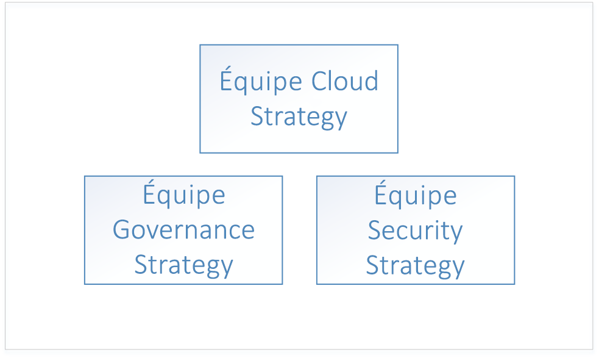
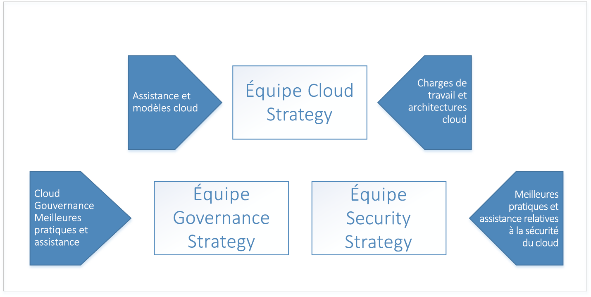
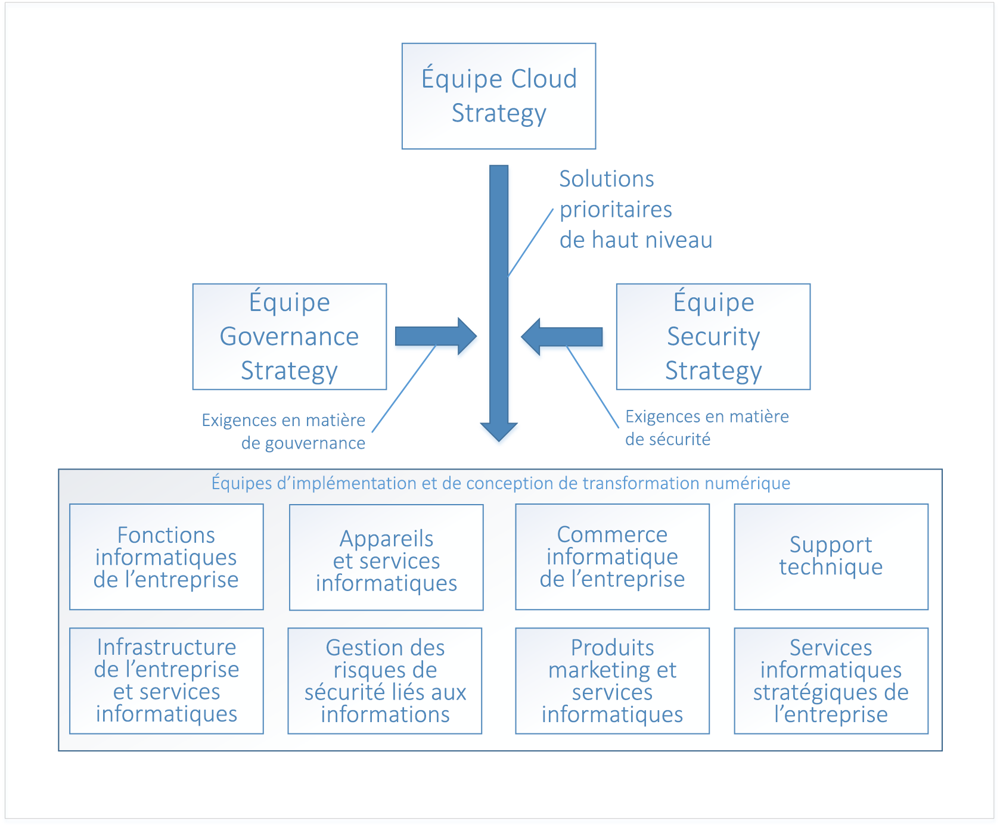

# Adoption du cloud d’entreprise : Prise en mainEnterprise Cloud Adoption: Getting started 

La **transformation numérique** vers le cloud computing implique de passer d’un fonctionnement local à un fonctionnement dans le cloud.The **digital transformation** to cloud computing represents a shift from operating on-premises to operating in the cloud. Ce changement induit de nouvelles méthodes de gestion d’une entreprise. Par exemple, la transformation numérique implique de passer de dépenses en capital pour les logiciels et les matériels de centre de données à des dépenses d’exploitation pour l’utilisation des ressources cloud.This shift includes new ways of doing business - for example, the digital transformation shifts from capital expenditures for software and datacenter hardware to operating expenditures for usage of cloud resources. 

## Transformation numérique : processusDigital transformation: process

Pour réussir son adoption du cloud, une entreprise doit préparer son organisation, son personnel et ses processus à cette transformation numérique.To be successful in adopting the cloud, an enterprise must prepare its organization, people, and processes to be ready for this digital transformation. Chaque structure organisationnelle d’entreprise étant différente, aucune approche en matière de préparation organisationnelle ne conviendra à tout le monde.Every enterprise's organizational structure is different, so there is no one-size-fits-all approach to organizational readiness. Ce document décrit les principales étapes que votre entreprise peut suivre pour se préparer.This document outlines the high-level steps your enterprise can take to get ready. Votre organisation devra prendre le temps d’élaborer un plan détaillé pour réaliser chacune des étapes répertoriées.Your organization will have to spend time developing a detailed plan to accomplish each of the listed steps.

Voici le principal processus à suivre pour la transformation numérique :The high-level process for the digital transformation is:

1. Constituez une équipe de stratégie cloud.Create a cloud strategy team. Cette équipe est responsable du pilotage de la transformation numérique.This team is responsible for leading the digital transformation. À ce stade, il est également important de constituer une équipe dédiée à la gouvernance et une équipe dédiée à la sécurité pour la transformation numérique.It's also important at this stage to form a governance team and a security team for the digital transformation.
2. Les membres de l’équipe de stratégie cloud apprennent ce qui est nouveau et différent au sujet des technologies cloud.Members of the cloud strategy team learn what's new and different about cloud technologies.  
3. L’équipe de stratégie cloud prépare l’entreprise en créant l’analyse de cas pour la transformation numérique ; elle énumère tous les écarts actuels de la stratégie métier et détermine les principales solutions pour les supprimer.The cloud strategy team prepares the enterprise by building the business case for digital transformation - enumerates all the current gaps in business strategy and determines the high-level solutions to eliminate them.
4. Alignez les solutions principales avec des groupes métier.Align high-level solutions with business groups. Identifiez les parties prenantes dans chaque groupe métier pour être en possession de la conception et de l’implémentation de chaque solution.Identify stakeholders in each business group to own the design and implementation for each solution.
5. Convertissez les rôles, compétences et processus existants pour inclure des rôles, compétences et processus cloud.Translate existing roles, skills and process to include cloud roles, skills, and process.  
<!--6. Develop processes for operating in the cloud to make solutions more robust in terms of availability, resiliency, and security. 
7. Optimize solutions for performance, scalability, and cost efficiency.-->

## Étape 1 : Constituer une équipe de stratégie cloudStep 1: create a cloud strategy team

La première étape de la transformation numérique de votre entreprise est de faire appel à des leaders métier de toute l’organisation pour constituer une équipe de stratégie cloud.The first step in your enterprise's digital transformation is engaging business leaders from across the organization to create a cloud strategy team (CST). Cette équipe rassemble des responsables métier issus des départements des finances, des infrastructures informatiques et des groupes d’applications.This team consists of business leaders from finance, IT infrastructure, and application groups. Ces équipes peuvent apporter leurs compétences pour la phase d’expérimentation et d’analyse cloud.These teams can help with the cloud analysis and experimentation phase.

Par exemple, une équipe de stratégie cloud peut être pilotée par le directeur technique et être composée de membres de l’équipe d’architecture d’entreprise, du département de finance et d’informatique, de techniciens experts issus de divers groupes d’applications informatiques (ressources humaines, finance, etc.) et de responsables d’équipes de mise en réseau, de sécurité et d’infrastructure.For instance, a Cloud Strategy Team could be driven by the CTO and consist of members of the enterprise architecture team, IT finance, senior technologists from various IT applications groups (HR, finance, and so on), and leaders from the infrastructure, security, and networking teams.  

Il est également important de former deux autres équipes principales : une équipe dédiée à la gouvernance et une équipe dédiée à la sécurité.It's also important to form two other high-level teams: a governance team, and a security team. Ces équipes sont responsables de la conception, de l’implémentation et de l’audit en cours des stratégies de sécurité et de la gouvernance de l’entreprise.These teams are responsible for designing, implementing, and the ongoing audit of the enterprise's governance and security policies. L’équipe dédiée à la gouvernance a besoin de membres ayant travaillé dans les domaines de la protection des ressources, de la gestion des coûts, de la stratégie de groupe et autres sujets associés.The governance team requires members that have worked with asset protection, cost management, group policy and related topics. L’équipe dédiée à la sécurité requiert des membres qui connaissent bien les normes de sécurité actuelles du secteur, ainsi que les exigences de sécurité de l’entreprise.The security team requires members that are well versed in current industry security standards as well as the enterprise's security requirements.

L’équipe dédiée à la gouvernance est responsable de la conception et de l’implémentation du modèle de gouvernance de l’entreprise dans le cloud, ainsi que du déploiement et du maintien des ressources d’infrastructure partagée qui font partie de la transformation numérique.The governance team is responsible for designing and implementing the enterprise's governance model in the cloud, as well as deploying and maintaining the shared infrastructure assets that are part of the digital transformation. Ces ressources incluent les ressources cloud, logicielles et matérielles nécessaires pour connecter le réseau local au réseau virtuel dans le cloud.These assets include hardware, software, and cloud resources necessary to connect the on-premises network to virtual networking in the cloud.

L’équipe dédiée à la sécurité est responsable de la conception et de l’implémentation de la stratégie de sécurité de l’entreprise dans le cloud et collabore étroitement avec l’équipe dédiée à la gouvernance.The security team is responsible for designing and implementing the enterprise's security policy in the cloud, working closely with the governance team. L’équipe dédiée à la sécurité possède l’extension de la limite de sécurité du réseau local pour inclure le réseau virtuel dans le cloud.The security team owns the extension of the security boundary of the on-premises network to include virtual networking in the cloud. Cela peut consister à posséder et maintenir les pare-feu entrants et sortants sur le réseau virtuel cloud, ainsi qu’à garantir que la stratégie et les outils empêchent le déploiement des ressources non autorisées.This may take the form of owning and maintaining the inbound and outbound firewalls on the cloud virtual network as well as ensuring that tools and policy prevent the deployment of unauthorized resources.

## Étape 2 : Découvrir les nouveautés dans le cloudStep 2: learn what's new in the cloud
 
L’étape suivante de la transformation numérique de votre entreprise implique que les membres de l’équipe de stratégie cloud apprennent comment la technologie cloud va changer la méthode de gestion de l’entreprise.The next step in your enterprise's digital transformation is for the members of the cloud strategy team to learn about how cloud technology will change the way the enterprise does business. Il s’agit de préparer et de planifier les changements qui vont affecter votre activité, votre personnel et vos technologies.This is preparation and planning for the changes to your business, people, and technology. Il est essentiel que les membres de l’équipe de stratégie cloud comprennent les nouveautés et les différences entre un environnement cloud et un environnement local.It's important for the members of the cloud strategy team to understand what's new and different in the cloud as compared to on-premises.

Pour comprendre le cloud, il faut commencer par se pencher sur le [fonctionnement d’Azure](what-is-azure.md) en général.The starting point for understanding the cloud is learning [how Azure works](what-is-azure.md) at a high level. Ensuite, étudiez les bases de [la gouvernance dans Azure](what-is-governance.md) en préparation de la [compréhension de la gestion des accès aux ressources](azure-resource-access.md).Next, learn about the basics of [governance in Azure](what-is-governance.md) in preparation for [understanding resource access management](azure-resource-access.md).

Pour en apprendre davantage, l’équipe dédiée à la gouvernance doit passer en revue les guides de conception et les concepts dans la section sur la gouvernance de la table des matières.For advanced learning, the governance team should review the concepts and design guides in the governance section of the table of contents. Les sections portant sur l’infrastructure et les charges de travail sont utiles pour en savoir plus sur les architectures et charges de travail classiques dans le cloud.The infrastructure and workloads sections are useful for learning about typical architectures and workloads in the cloud.

## Étape 3 : Identifier les écarts dans la stratégie métierStep 3: identify gaps in business strategy

L’étape suivante s’adresse à l’équipe de stratégie cloud : elle doit énumérer les problèmes métier qui nécessitent une solution de transformation numérique.The next step is for the cloud strategy team to enumerate the business problems that require a digital transformation solution. Par exemple, une entreprise peut avoir un centre de données local existant avec un matériel en fin de vie qui doit être remplacé.For example, an enterprise may have an existing on-premises data center with end-of-life hardware that requires replacement. Dans un autre exemple, une entreprise peut rencontrer des difficultés pour commercialiser des fonctionnalités et services nouveaux et être en retard sur la concurrence.In another example, an enterprise may be experiencing difficulty with time-to-market for new features and services and may be falling behind to competition. Ces écarts représentent les *objectifs* de la transformation numérique de votre entreprise.These gaps represent the *goals* of your enterprise's digital transformation.

Ils peuvent être classés dans les catégories suivantes :Gaps in business strategy can be classified into the following categories:

|CatégorieCategory|DescriptionDescription|
|-----|-----|
|la gestion des coûts ;Cost management|Représente un écart dans la façon dont l’entreprise paie pour la technologie.Represents a gap in the way the Enterprise pays for technology.|
|GouvernanceGovernance|Représente un écart dans les processus utilisés par l’entreprise pour protéger ses ressources d’une utilisation incorrecte qui peut entraîner des surcoûts, des problèmes de sécurité ou des problèmes de conformité.Represents a gap in the processes used by the Enterprise to protect its assets from improper usage that might result in cost overruns, security issues, or compliance issues. | 
|ConformitéCompliance|Représente un écart dans la façon dont l’entreprise respecte ses processus et stratégies internes, ainsi que les normes, réglementations et lois externes.Represents a gap in the way the enterprise adheres to its own internal processes and policies as well as external laws, regulations, and standards. |
|SécuritéSecurity|Représente un écart dans la façon dont l’entreprise protège ses ressources de données et technologies des menaces externes.Represents a gap in the way the enterprise protects its technology and data assets from external threats. |
|Gouvernance des donnéesData governance|Représente un écart dans la façon dont une entreprise gère ses données, notamment les données client.Represents a gap in the way an enterprise manages its data, especially customer data. Par exemple, le nouveau Règlement général sur la protection des données (RGPD) de l’Union européenne contient des exigences strictes en matière de protection des données client qui peuvent nécessiter de nouveaux matériels et logiciels.For example, new General Data Protection Regulation (GDPR) in the European Union has strict requirements for the protection of customer data that may require new hardware and software.|    

Une fois que votre entreprise a classé tous les écarts de stratégie métier dans ces catégories, l’étape suivante consiste à identifier une solution principale pour chaque problème.Once your enterprise has classified all business strategy gaps into these categories, the next step is to determine a high-level solution for each problem.

Le tableau suivant fournit plusieurs exemples :The following table illustrates several examples:

|Écart de stratégie métierBusiness strategy gap|Catégorie &nbsp; &nbsp; &nbsp; &nbsp; &nbsp;Category &nbsp; &nbsp; &nbsp; &nbsp; &nbsp;|Solution &nbsp;&nbsp;&nbsp;&nbsp;&nbsp;&nbsp;&nbsp;&nbsp;&nbsp;&nbsp;&nbsp;&nbsp;&nbsp;&nbsp;Solution &nbsp;&nbsp;&nbsp;&nbsp;&nbsp;&nbsp;&nbsp;&nbsp;&nbsp;&nbsp;&nbsp;&nbsp;&nbsp;&nbsp;|
|-----|-----|-----|
| Des services actuellement hébergés en local rencontrent des problèmes de disponibilité, de résilience et d’extensibilité pendant les pics de demande, ce qui représente environ 10 %de l’utilisation.Services currently hosted on-premises experience issues with availability, resiliency, and scalability during time of peak demand, which is approximately ten percent of usage. Des serveurs du centre de données local sont en fin de vie.Servers in on-premises datacenter are end-of-life. Le département informatique de l’entreprise recommande l’achat de nouveaux matériels locaux pour le centre de données avec des spécifications pour gérer les pics de demande.Enterprise IT recommends purchasing new on-premises hardware for datacenter with specifications to handle peak demand.| la gestion des coûts ;Cost management | Migrez les charges de travail locales existantes affectées vers des ressources évolutives dans le cloud, en payant uniquement pour l’utilisation.Migrate affected existing on-premises workloads to scalable resources in the cloud, paying for usage only. |
| Des réglementations et lois de gestion des données externes exigent que l’entreprise respecte un ensemble de contrôles standard qui nécessitent le chiffrement des données au repos, et donc de nouveaux matériels et logiciels.External data management laws and regulations require the enterprise to adhere to set of standard controls that require encryption of data at rest, requiring new hardware and software. | Gouvernance des donnéesData governance | Migrez les données vers Azure Storage Service Encryption pour les données au repos.Move data to Azure storage service encryption for data at rest. |
| Des services hébergés dans un centre de données local ont été confrontés à des attaques par déni de service distribué (DDoS) sur les services accessibles au public.Services hosted in on-premises datacenter been experiencing distributed denial of service (DDoS) attacks on public-facing services. Les attaques sont difficiles à atténuer et nécessitent de nouveaux matériels, logiciels et personnels de sécurité pour être traitées de manière efficace.The attacks are difficult to mitigate and require new hardware, software, and security personnel to deal with effectively. | SécuritéSecurity | Migrez les services vers Azure et profitez de la protection DDoS Azure.Migrate services to Azure, and take advantage of Azure DDoS protection.|

Une fois tous les écarts de la stratégie métier énumérés et les solutions principales déterminées, classez la liste par ordre de priorité.When all of the gaps in business strategy have been enumerated and high-level solutions have been determined, prioritize the list. Pour ce faire, vous pouvez aligner les écarts de la stratégie métier avec les objectifs à court et long termes de l’entreprise pour chaque catégorie.The list can be prioritized by aligning the business strategy gaps with the enterprise's short and long-term goals in each category. Par exemple, si l’entreprise a un objectif à court terme de réduction des dépenses informatiques des deux prochains trimestres, les écarts métiers dans la catégorie *Gestion des coûts* peuvent être classés par ordre de priorité en se basant sur les économies prévues associées à chacun des écarts.For example, if the enterprise has a short-term goal to reduce IT spend in the next two fiscal quarters, the business gaps in the *cost management* category may be prioritized by the projected cost saving associated with each.

À l’issue de ce processus, vous obtenez une liste classée des solutions principales alignées avec les catégories métier.The output of this process is a stack-ranked list of high-level solutions aligned with business categories. 

## Étape 4 : Aligner les solutions principales avec des groupes métier pour concevoir des solutionsStep 4: align high-level solutions with business groups to design solutions 

Maintenant que les objectifs de la transformation numérique ont été énumérés, classés par ordre de priorité et que des solutions principales ont été proposées, l’étape suivante pour l’équipe de stratégie cloud consiste à aligner chaque solution principale avec les équipes d’implémentation et de conception de chaque groupe métier.Now that the goals of the digital transformation have been enumerated, prioritized, and high-level solutions proposed, the next step is for the cloud strategy team to align each of the high-level solutions with design and implementation teams in each of the business groups. 

Les équipes récupèrent les listes classées par ordre de priorité et étudient une à une les solutions principales pour concevoir chaque solution.The teams take the prioritized lists and work through each high-level solution to design each solution. Le processus de conception implique la spécification d’une nouvelle infrastructure et de nouvelles charges de travail.The design process will involve the specification of new infrastructure and new workloads. Des modifications peuvent être appliquées aux rôles des personnes et aux processus qu’elles suivent.There may also be changes to the roles of the people and the processes they follow. À ce stade, il est aussi primordial que chaque équipe de conception fasse appel aux équipes dédiées à la sécurité et à la gouvernance pour examiner chaque conception.It's also extremely important at this stage for each of the design teams to include both the governance and security teams for review of each design. Toutes les conceptions doivent respecter les stratégies et procédures définies par les équipes dédiées à la sécurité et à la gouvernance, et ces dernières doivent participer à l’approbation finale de chaque conception.Each design must fall within with the policies and procedures defined by the governance and security teams, and these teams must be included in the final sign off of each design.

La conception de chaque solution n’est pas une tâche anodine, et à mesure de la création des conceptions, celles-ci doivent être imaginées dans le contexte des autres conceptions de solutions des autres équipes.The design of each solution is a non-trivial task and as designs are created, must be considered in context with other solution designs from other teams. Par exemple, si plusieurs des conceptions entraînent la migration de services et d’applications locaux existants vers le cloud, il peut s’avérer plus efficace de les regrouper et de concevoir une stratégie de migration globale.For example, if several of the designs result in a migration of existing on-premises applications and services to the cloud, it may be more efficient to group these together and design an overall migration strategy. Dans un autre exemple, il peut être impossible de migrer certains services et applications locaux existants, et la solution pourrait être de les remplacer par un nouveau développement ou des services tiers.In another example, it may not be possible to migrate some existing on-premises applications and services and the solution may be to replace them with either new development or third-party services. Dans ce cas, il peut être plus efficace de les regrouper et de déterminer de quelle façon ils se chevauchent pour identifier si un service tiers peut être utilisé pour plusieurs solutions.In this case, it may be more efficient to group these together and determine the overlap between them to determine if a third-party service can be used for more than one solution.

Une fois la conception de la solution terminée, l’équipe passe à la phase d’implémentation de chaque conception.Once the design of the solution is complete, the team moves on to the implementation phase for each design. La phase d’implémentation de chaque conception de solution peut être effectuée via des processus de gestion de projets standard.The implementation phase for each solution design can be run using standard project management processes.

## Étape 5 : Convertir les rôles, compétences et processus existants pour le cloudStep 5: translate existing roles, skills, and process for the cloud

Lors de chaque phase évolutive de l’histoire du secteur informatique, les changements les plus notables sont souvent observés au niveau des rôles du personnel.At each evolutionary phase during the history of the IT industry, the most notable industry changes are often marked by changes in staff roles. Pendant la transition des mainframes au modèle client/serveur, le rôle de l’opérateur informatique a largement disparu, remplacé par celui de l’administrateur système.During the transition from mainframes to the client/server model, the role of the computer operator largely disappeared, replaced by the system administrator. À l’arrivée de la virtualisation, la demande en personnel travaillant avec des serveurs physiques a diminué, remplacée par un besoin en spécialistes de la virtualisation.When the age of virtualization arrived, the requirement for individuals working with physical servers diminished, replaced with a need for virtualization specialists. De même, à mesure que les institutions passent au cloud computing, les rôles vont probablement changer.Similarly, as institutions shift to cloud computing, roles will likely change again. Par exemple, les spécialistes de centres de données peuvent être remplacés par des analystes financiers du cloud.For example, datacenter specialists might be replaced with cloud financial analysts. Même dans les cas où l’intitulé des postes informatiques n’a pas changé, les rôles de travail quotidien ont considérablement évolué.Even in cases where IT job titles have not changed, the daily work roles have evolved significantly. 

Les membres du personnel informatique peuvent s’inquiéter quant à leur poste et rôle quand ils se rendent compte qu’un ensemble de compétences différent est nécessaire pour prendre en charge les solutions cloud.IT staff members may feel anxious about their roles and positions as they realize that a different set of skills is needed for the support of cloud solutions. Mais les employés agiles qui découvrent et explorent les nouvelles technologies cloud n’ont pas à ressentir cette peur.But agile employees who explore and learn new cloud technologies don’t need to have that fear. Ils peuvent piloter l’adoption des services cloud et aider l’organisation à comprendre et appréhender les changements associés.They can lead the adoption of cloud services and help the organization understand and embrace the associated changes. 

### Recueil des préoccupationsCapturing concerns

Lors de la transformation numérique, chaque équipe doit recueillir les préoccupations que le personnel peut avoir.During the digital transformation, each team should capture any staff concerns as they arise. Au cours de cette opération, identifiez les aspects suivants :When capturing concerns, identify the following: 
* Le type de préoccupation.The type of concern. Par exemple, les employés peuvent être réfractaires aux changements apportés à leurs tâches suite à la transformation numérique.For example, workers may be resistant to the changes in job duties that accompany the digital transformation.
* L’impact de la préoccupation si elle n’est pas traitée.The impact of the concern if it is not addressed. Par exemple, le fait d’être réfractaire à la transformation numérique peut entraîner un ralentissement des employés pour effectuer les changements nécessaires.For example, resistance to the digital transformation may be result in workers being slow to execute the changes necessary. 
* Le domaine compétent pour traiter la préoccupation.The area equipped to address the concern. Par exemple, si les employés du département informatique sont réticents à acquérir de nouvelles compétences, le domaine des parties prenantes informatiques est le plus compétent pour traiter cette préoccupation.For example, if workers in the IT department are reluctant to acquire new skills, the IT stakeholder's area is best equipped to address this concern. Identifier le domaine peut être simple pour certains problèmes, et dans ce genre de situation, vous avez peut-être besoin de faire remonter l’information à la direction.Identifying the area may be clear for some concerns, and in these cases you may need to escalate to executive leadership. 

### Identifier les écartsIdentify gaps

Un autre aspect de l’étude des problèmes liés à la transformation numérique de votre entreprise est l’identification des **écarts**.Another aspect of working through the issues with your enterprise's digital transformation is identifying **gaps**. Un écart est un rôle, une compétence ou un processus requis pour votre transformation numérique qui n’existe actuellement pas dans votre entreprise.A gap is a role, skill, or process required for your digital transformation that does not currently exist in your enterprise. 

Commencez en énumérant les nouvelles responsabilités qui accompagnent la transformation numérique, en mettant l’accent sur les nouvelles responsabilités et les responsabilités actuelles à supprimer.Begin by enumerating the new responsibilities that accompany the digital transformation, with an emphasis on new responsibilities and current responsibilities to be retired. Identifiez le domaine qui s’aligne sur chaque responsabilité.Identify the area that is aligned with each responsibility. Pour les nouvelles responsabilités, déterminez à quel point elles sont alignées avec le domaine.For new responsibilities, determine how closely aligned it is with the area. Certaines responsabilités peuvent s’étendre sur plusieurs domaines, et cela représente une opportunité d’alignement meilleur qui doit être collectée en tant que préoccupation.Some responsibilities may span several areas, and this represents an opportunity for better alignment that should be captured as a concern. Dans le cas où aucun domaine responsable ne peut être identifié, recueillez cela comme un écart.In the case where no area is identified as being responsible, capture this as a gap.

Ensuite, identifiez les compétences nécessaires pour prendre en charge la responsabilité.Next, identify the skills necessary to support the responsibility. Déterminez si votre entreprise possède des ressources existantes avec ces compétences.Determine if your enterprise has existing resources with these skills. En l’absence de ressources existantes, déterminez quels programmes de formation ou recrutements sont nécessaires.If there are no existing resources, determine what training programs or talent acquisition is necessary. Déterminez l’intervalle de temps durant lequel la responsabilité doit être prise pour respecter le calendrier de votre transformation numérique.Determine the time frame by which the responsibility must be supported to keep your digital transformation on track.

Enfin, identifiez les rôles qui mettront en pratique ces compétences.Finally, identify the roles that will execute these skills. Certains de vos effectifs existants assureront une partie du rôle, et dans d’autres cas, un nouveau rôle pourra être nécessaire.Some of your existing workforce will assume parts of the role, and in other cases an entirely new role may be necessary. 

### Collaborer avec les équipesPartner across teams

Les compétences nécessaires pour combler les écarts dans la transformation numérique de votre organisation ne se cantonneront généralement pas à un seul rôle, ni à un seul département.The skills necessary to fill the gaps in your organization's digital transformation will typically not be confined to a single role, or even a single department. Les compétences ont des liens et des dépendances qui peuvent s’étendre à un ou plusieurs rôles, et ces rôles peuvent exister dans divers départements.Skills will have relationships and dependencies that can span a single role or multiple roles, and those roles may exist in several departments. Par exemple, un propriétaire de charge de travail peut avoir besoin qu’une personne ayant un rôle informatique approvisionne des ressources principales comme des groupes de ressources et des abonnements.For example, a workload owner may require someone in an IT role to provision core resources such as subscriptions and resource groups.

Ces dépendances représentent les nouveaux processus que votre organisation implémente pour gérer le flux de travail entre les rôles.These dependencies represent new processes that your organization implements to manage the workflow between roles. Dans l’exemple ci-dessus, il existe différents types de processus pouvant prendre en charge la relation entre le propriétaire de la charge de travail et le rôle informatique.In the above example, there are several different types of process that can support the relationship between the workload owner and the IT role. Par exemple, un outil de flux de travail peut être créé pour gérer le processus, ou un simple modèle d’e-mail peut être utilisé.For example, a workflow tool can be created to manage the process, or, a simple email template can be used.

Suivez ces dépendances et notez les processus qui les prendront en charge, et indiquez si le processus existe actuellement ou non.Track these dependencies and make note of the processes that will support them, and whether or not the process currently exists. Pour les processus qui nécessitent des outils, assurez-vous que la chronologie pour le déploiement de ceux-ci s’aligne sur la planification de la transformation numérique globale.For process that require tooling, ensure that the timeline for deploying any tools aligns with the overall digital transformation schedule.

## Étapes suivantesNext steps

La transformation numérique est un processus itératif, et avec chaque itération, les équipes impliquées deviendront plus efficaces.The digital transformation is an iterative process, and with each iteration the teams involved will become more efficient. 

> [!div class="nextstepaction"]
> [Comprendre le fonctionnement d’AzureUnderstand how Azure works](what-is-azure.md)