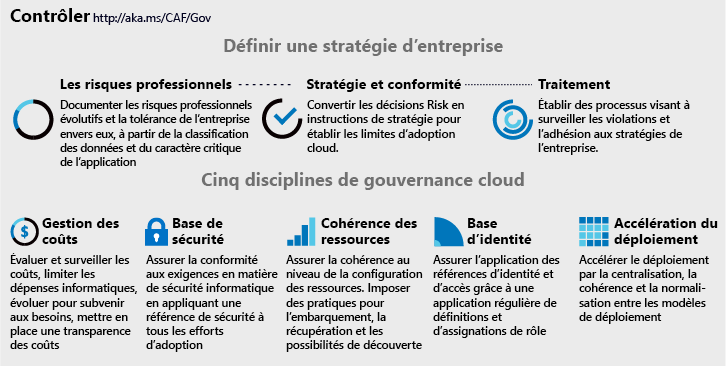

# Les cinq disciplines de la gouvernance cloud

<!-- markdownlint-disable MD033 -->

<ul class="panelContent cardsI">
<li style="display: flex; flex-direction: column;">
    

        

            

                

Toute modification apportée à des processus métier ou à des plates-formes technologiques présente un risque. Les équipes de gouvernance cloud, dont les membres sont parfois appelés les gardiens du cloud, sont chargées de minimiser ces risques tout en évitant d’interrompre l’adoption et l’innovation.  Le modèle de gouvernance du framework d'adoption du cloud guide ces décisions (indépendamment de la plateforme cloud choisie) en se concentrant sur le <a href="#corporate-policy">développement d'une stratégie d’entreprise</a> et les <a href="#disciplines-of-cloud-governance">disciplines de gouvernance cloud</a>. Les <a href="#actionable-journeys">guides de conception actionnables</a> illustrent ce modèle qui utilise des services Azure. Cet article fait office de page d'accueil pour les cinq disciplines du modèle de gouvernance CAF.
                

            

        

    

</li>
<li style="display: flex; flex-direction: column;">
    <a href="../_images/operational-transformation-govern-highres.png" style="display: flex; flex-direction: column; flex: 1 0 auto;">
        

            

                

                    

 
<i>Figure 1 : Visuel de la stratégie d’entreprise et les cinq disciplines de la gouvernance cloud</i>
                    

                

            

        

    </a>
</li>
</ul>

<!-- markdownlint-enable MD033 -->

## Disciplines de gouvernance cloud

Chaque fournisseur de cloud utilise des disciplines de gouvernance cloud communes, qui peuvent faire office de guide pour connaître les stratégies et aligner les chaînes d’outils. Ces disciplines orientent les décisions en matière de niveau d'automatisation et de mise en œuvre de la stratégie d’entreprise entre fournisseurs de cloud.

<!-- markdownlint-disable MD033 -->

<ul class="panelContent cardsA">
<li style="display: flex; flex-direction: column;">
    <a href="./cost-management/overview.md" style="display: flex; flex-direction: column; flex: 1 0 auto;">
        

            

                

                    

                        

                            
                        

                    

                    

                        <h3>Cost Management</h3>
                        
Les coûts constituent une préoccupation majeure pour les utilisateurs du cloud. Développez des stratégies de contrôle des coûts pour toutes les plateformes cloud.

                    

                

            

        

    </a>
</li>
<li style="display: flex; flex-direction: column;">
    <a href="./security-baseline/overview.md" style="display: flex; flex-direction: column; flex: 1 0 auto;">
        

            

                

                    

                        

                            
                        

                    

                    

                        <h3>Base de référence de la sécurité</h3>
                        
La sécurité est un sujet complexe et propre à chaque entreprise. Une fois les exigences de sécurité définies, les stratégies de gouvernance cloud sont appliquées aux configurations réseau, données et ressources.

                    

                

            

        

    </a>
</li>
<li style="display: flex; flex-direction: column;">
    <a href="./identity-baseline/overview.md" style="display: flex; flex-direction: column; flex: 1 0 auto;">
        

            

                

                    

                        

                            
                        

                    

                    

                        <h3>Base de référence des identités</h3>
                        
En matière d'application des exigences d'identité, les incohérences peuvent augmenter le risque de violation. La discipline Base de référence des identités se concentre sur les moyens de veiller à ce que l'identité soit appliquée de manière cohérente à toutes les tâches d'adoption du cloud.

                    

                

            

        

    </a>
</li>
<li style="display: flex; flex-direction: column;">
    <a href="./resource-consistency/overview.md" style="display: flex; flex-direction: column; flex: 1 0 auto;">
        

            

                

                    

                        

                            
                        

                    

                    

                        <h3>Cohérence des ressources</h3>
                        
Les opérations cloud dépendent d'une configuration cohérente des ressources. Les outils de gouvernance permettent de configurer de manière cohérente les ressources afin d'atténuer les risques d'intégration, de détectabilité et de récupération.

                    

                

            

        

    </a>
</li>
<li style="display: flex; flex-direction: column;">
    <a href="./deployment-acceleration/overview.md" style="display: flex; flex-direction: column; flex: 1 0 auto;">
        

            

                

                    

                        

                            
                        

                    

                    

                        <h3>Accélération du déploiement</h3>
                        
La centralisation, la standardisation et la cohérence des approches de déploiement et de configuration améliorent les pratiques de gouvernance. Lorsqu'elles sont proposées via des outils de gouvernance cloud, elles créent un facteur cloud qui permet d'accélérer les activités de déploiement.

                    

                

            

        

    </a>
</li>
</ul>

<!-- markdownlint-enable MD033 -->
