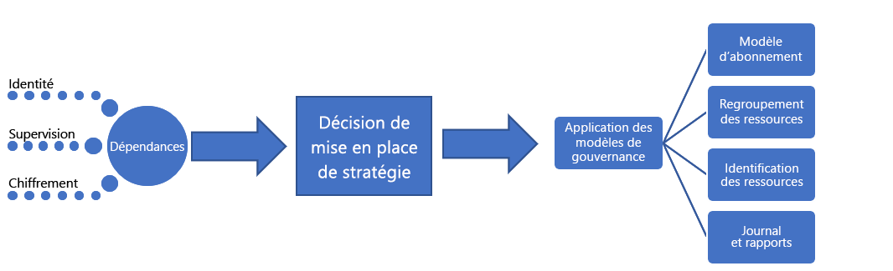

# Grandes entreprises : Bonne pratique, explication

Ce parcours de gouvernance commence par un ensemble de [stratégies d’entreprise](./initial-corporate-policy.md) initiales. Ces stratégies permettent de définir un produit minimum viable (MVP) pour la gouvernance. Ce MVP reflète les [meilleures pratiques](./overview.md).

Dans cet article, nous allons parler des stratégies de haut niveau qui sont nécessaires à la création d’un MVP de gouvernance. Au cœur d’un MVP de gouvernance se trouve la discipline : [Accélération du déploiement](../../deployment-acceleration/overview.md). À ce stade, les outils et modèles qui sont appliqués permettent les évolutions incrémentielles nécessaires pour étendre la gouvernance à l’avenir.

## MVP de gouvernance (base d’adoption du cloud)

Grâce à quelques principes simples et à des outils de gouvernance basés sur le cloud, il est possible d’adopter rapidement la gouvernance et une stratégie d’entreprise. Voici la première des trois disciplines de gouvernance à aborder lors d’un processus de gouvernance. Chaque discipline sera détaillée dans cet article.

Pour établir le point de départ, cet article traite des stratégies de haut niveau derrière la base de référence des identités, la base de référence de la sécurité et l’accélération du déploiement. Ces stratégies sont requises pour créer un MVP de gouvernance, qui serve de base pour l’ensemble du processus d’adoption.

## Processus d’implémentation

L’implémentation du MVP de gouvernance dépend de l’identité, de la sécurité et de la mise en réseau. Une fois les dépendances résolues, l’équipe de gouvernance cloud fait des choix sur certains aspects de gouvernance. Les décisions prises par l’équipe de gouvernance cloud et les équipes d’aide sont implémentées via un seul package de ressources d’application.

Cette implémentation peut également être décrite à l’aide d’une simple check-list :

1. Sollicitez des décisions concernant les principales dépendances : identité, réseau et chiffrement.
2. Déterminez le modèle à utiliser lors de l’application des stratégies d’entreprise.
3. Déterminer les modèles de gouvernance appropriée pour la cohérence de la ressource, le balisage des ressources et les disciplines de journalisation et création de rapports.
4. Implémentez les outils de gouvernance alignés sur le modèle d’application de stratégie choisi, dans le but d’appliquer des décisions dépendantes et des décisions de gouvernance.

[!INCLUDE [implementation-process](../../../../../includes/cloud-adoption/governance/implementation-process.md)]

## Application de modèles définis par la gouvernance

L’équipe de gouvernance cloud est responsable des décisions et implémentations suivantes. Beaucoup ont besoin du travail d’autres équipes, mais l’équipe de gouvernance cloud devrait être à la fois maître des décisions et de l’implémentation. Les sections suivantes indiquent les décisions prises pour ce cas d’usage, et les détails pour chacune de ces décisions.

### Modèle d’abonnement

Le modèle **mixte** a été choisi pour les abonnements Azure.

- Comme les nouvelles requêtes pour des ressources Azure augmentent, un « Département » doit être établi pour chacune des grandes unités commerciales dans chaque géographie opérationnelle. Dans chacun de ces départements, des « abonnements » doivent être créés pour chaque archétype d’application.
- Un archétype d’application est un moyen de regrouper des applications dont les besoins sont similaires. Voici quelques exemples communs : Applications avec des données protégées, applications régies (telles que HIPAA ou FedRAMP), applications à faible risque, applications avec des dépendances locales, SAP ou autres grands système dans Azure ou applications qui étendent localement SAP ou des grands systèmes. Chaque organisation a ses propres besoins, en fonction des classifications de données et des types d’applications qui alimentent l’entreprise. Le mappage des dépendances de l’investissement numérique peut aider à définir les archétypes d’application dans une organisation.
- Une convention d’affectation de noms commune doit être convenue dans le cadre de la conception de l’abonnement, en tenant compte des deux points précédents.

### Cohérence des ressources

La **Cohérence hiérarchique** a été choisie en tant que modèle de cohérence des ressources.

- Des groupes de ressources doivent être créés pour chaque application. Des groupes d’administration doivent être créés pour chaque archétype d’application. La stratégie Azure Policy doit être appliquée à tous les abonnements du groupe d’administration associé.
- Dans le cadre du processus de déploiement, les modèles Cohérence des ressources doivent être stockés dans le contrôle du code source pour toutes les ressources.
- Chaque groupe de ressources doit s’aligner sur une charge de travail ou une application spécifique.
- La hiérarchie du groupe d’administration Azure doit représenter la responsabilité de facturation et la propriété d’application à l’aide des groupes imbriqués.
- L’implémentation à grande échelle de la stratégie Azure Policy peut dépasser les échéances fixées par l’équipe et ne pas présenter un intérêt tangible pour le moment. Toutefois, une stratégie simple par défaut doit être créée et appliquée à chaque groupe de ressources, afin de faire appliquer les premières instructions de la stratégie de gouvernance cloud. Cette stratégie est censée définir l’implémentation d’exigences précises en matière de gouvernance. Ces implémentations peuvent ensuite être appliquées à toutes les ressources déployées.

### Identification des ressources

Le modèle **Comptabilité** a été choisi pour l’identification des ressources.

- Les ressources déployées doivent être balisées avec des valeurs pour les éléments ci-après : Département/Unité de facturation, Géographie, Classification des données, Caractère critique, SLA, Environnement, Archétype d’application, Application et Propriétaire d’application.
- Ces valeurs ainsi que le groupe d’administration et l’abonnement Azure, associés à une ressource déployée, orientent les décisions en matière de gouvernance, opérations et sécurité.

### Journalisation et création de rapports

À ce stade, un modèle **Hybride** de journalisation et de création de rapports est suggéré, mais pas requis par les équipes de développement.

- Pour le moment, aucune exigence en matière de gouvernance n’a été établie pour les points de données spécifiques qui doivent être collectés à des fins de journalisation et de création de rapports. Il s’agit d’un élément spécifique (qui doit être considéré comme un anti-modèle) à ce scénario fictif. Les normes de journalisation doivent être définies et appliquées dès que possible.
- Une analyse supplémentaire est nécessaire avant de publier les données protégées ou les charges de travail critiques.
- Avant de prendre en charge les données protégées ou les charges de travail critiques, la solution de supervision opérationnelle, qui existe déjà en local, doit avoir accès à l’espace de travail utilisé pour la journalisation. Les applications doivent répondre aux exigences de sécurité et de journalisation associées à l’utilisation du locataire, si l’application doit être conforme à un SLA défini.

## Évolution des processus de gouvernance

Certaines instructions de stratégie ne peuvent pas ou ne doivent pas être contrôlées par des outils automatisés. D’autres stratégies nécessitent que les équipes en charge de la base de référence locale des identités et de la sécurité informatique fassent des efforts réguliers. L’équipe de la gouvernance cloud doit surveiller les processus suivants pour implémenter les huit dernières instructions de stratégie :

**Modifications de la stratégie d’entreprise** : L’équipe de gouvernance cloud apporte des modifications à la conception du MVP de gouvernance afin d’adopter les nouvelles stratégies. L’avantage du MVP de gouvernance est qu’il permet l’application automatique des nouvelles stratégies.

**Accélération de l’adoption** : L’équipe de gouvernance cloud a passé en revue les scripts de déploiement au sein de plusieurs équipes. Elle gère un ensemble de scripts qui servent de modèles de déploiement. Ces modèles peuvent être utilisés par les équipes d’adoption du cloud et des DevOps pour définir plus rapidement les déploiements. Chaque script contient les exigences nécessaires à l’application des stratégies de gouvernance. Aucun effort supplémentaire des ingénieurs d’adoption du cloud n’est nécessaire. En tant que conservatrice de ces scripts, l’équipe de gouvernance cloud peut implémenter plus rapidement des changements de stratégie. En outre, elle est considérée comme une force d’accélération de l’adoption. Il est ainsi possible d’obtenir des déploiements cohérents sans avoir à imposer une adhésion stricte.

**Formation technique** : L’équipe de gouvernance cloud propose des sessions de formation bimensuelles et a créé deux vidéos pour les ingénieurs. Ces ressources aident les ingénieurs à se familiariser rapidement avec la culture de la gouvernance et avec l’exécution des déploiements. L’équipe ajoute des ressources de formation qui mettent en évidence la différence entre les déploiements en production et les autres, afin que les ingénieurs comprennent l’impact des nouvelles stratégies sur l’adoption du cloud. Il est ainsi possible d’obtenir des déploiements cohérents sans avoir à imposer une adhésion stricte.

**Planification de déploiement** : Avant de déployer n’importe quel élément multimédia contenant des données protégées, l’équipe de gouvernance du Cloud sera chargé de la vérification des scripts de déploiement pour valider l’alignement de gouvernance. Les équipes existantes dont les déploiements ont déjà été approuvés feront l’objet d’un audit à l’aide d’outils de programmation.

**Audit et création de rapports mensuels** : Chaque mois, l’équipe de gouvernance cloud effectue un audit de tous les déploiements cloud afin de valider l’adéquation continue à la stratégie. Lorsque des écarts sont identifiés, ils sont documentés et partagés avec les équipes d’adoption du cloud. Lorsque l’implémentation ne risque pas d’entraîner une interruption des activités ou une fuite de données, les stratégies sont automatiquement implémentées. À la fin de l’audit, l’équipe de gouvernance cloud compile un rapport pour l’équipe de la stratégie cloud et chaque équipe d’adoption du cloud afin de communiquer sur l’adhésion générale des parties prenantes à la stratégie. Le rapport est également conservé à des fins d’audit et juridiques.

**Révision de la stratégie trimestrielle** : Chaque trimestre, l’équipe de gouvernance cloud et l’équipe de la stratégie cloud examinent les résultats de l’audit et proposent que des modifications soient apportées à la stratégie de l’entreprise. La plupart de ces suggestions sont le résultat d’améliorations continues et de l’observation des modèles d’utilisation. Les modifications de stratégie approuvées sont intégrées à l’outil de gouvernance au cours des cycles d’audit ultérieurs.

## Autres modèles

Si l’un des modèles choisis dans ce parcours de gouvernance ne correspond pas aux exigences du lecteur, chaque modèle possède une solution de rechange :

- [Modèles de chiffrement](../../../decision-guides/encryption/overview.md)
- [Modèles d’identité](../../../decision-guides/identity/overview.md)
- [Modèles de journalisation et de création de rapports](../../../decision-guides/log-and-report/overview.md)
- [Modèles d’implémentation de stratégie](../../../decision-guides/policy-enforcement/overview.md)
- [Modèles de cohérence des ressources](../../../decision-guides/resource-consistency/overview.md)
- [Modèles d’étiquetage des ressources](../../../decision-guides/resource-tagging/overview.md)
- [Modèles SDN (Software Defined Network)](../../../decision-guides/software-defined-network/overview.md)
- [Modèles de conception des abonnements](../../../decision-guides/subscriptions/overview.md)

## Étapes suivantes

Une fois ce guide implémenté, chaque équipe d’adoption du cloud peut s’appuyer sur une base de gouvernance solide. L’équipe de gouvernance cloud travaille en parallèle à la mise à jour continue des stratégies d’entreprise et des disciplines de gouvernance.

Les deux équipes utilisent les indicateurs de tolérance pour identifier la prochaine évolution nécessaire pour continuer à soutenir l’adoption du cloud. La prochaine étape pour l’entreprise dans ce parcours est de faire évoluer sa base de référence de gouvernance. Elle pourra ainsi prendre en charge les applications avec des exigences d’authentification multifacteur (MFA) héritées ou tierces.

> [!div class="nextstepaction"]
> [Évolution de la base de référence des identités](./identity-baseline-evolution.md)
