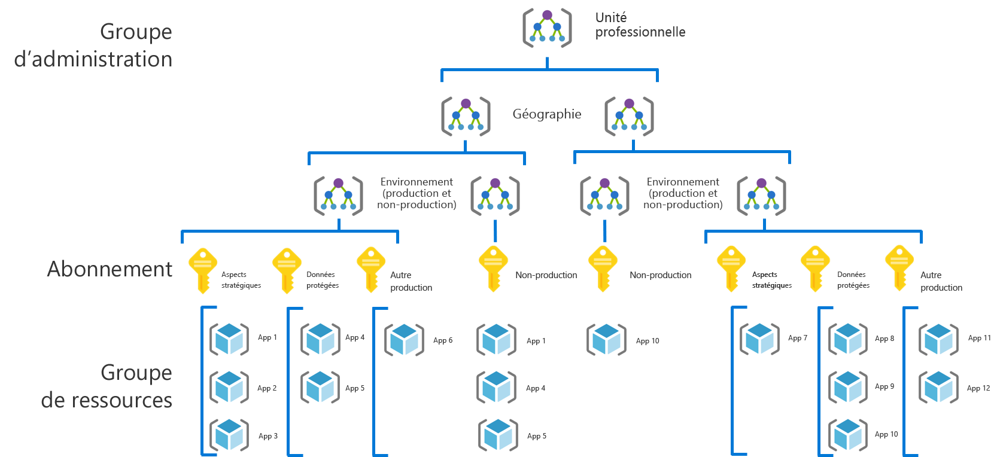
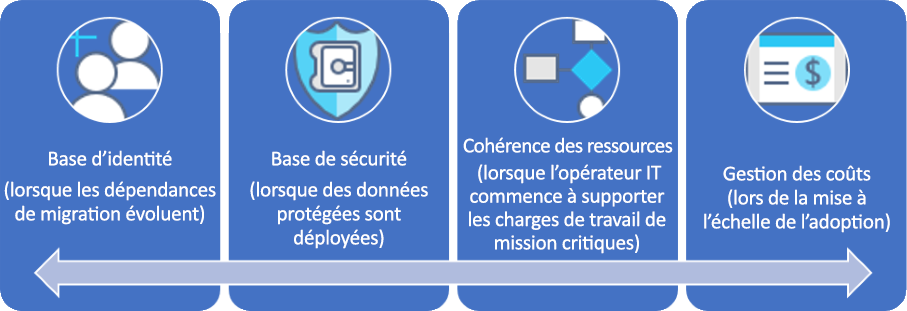

# Framework d’adoption du cloud : Parcours de gouvernance pour les grandes entreprisesCAF: Large enterprise governance journey

## Présentation des meilleures pratiquesBest practice overview

Ce parcours de gouvernance suit les expériences d’une entreprise fictive à différents stades de maturité.This governance journey follows the experiences of a fictional company through various stages of governance maturity. Il est basé sur le parcours de clients réels.It is based on real customer journeys. Les meilleures pratiques recommandées se fondent sur les contraintes et les besoins de l’entreprise fictive.The suggested best practices are based on the constraints and needs of the fictional company.

Comme point de départ rapide, cette présentation définit un produit minimum viable (MVP) pour la gouvernance, basé sur les meilleures pratiques.As a quick starting point, this overview defines a minimum viable product (MVP) for governance based on best practices. Elle fournit également des liens vers des évolutions de gouvernance, qui ajoutent des meilleures pratiques à mesure que de nouveaux risques métier et techniques émergent.It also provides links to some governance evolutions that add further best practices as new business or technical risks emerge.

> [!WARNING]
> Ce MVP est un point de départ de base, qui se fonde sur un ensemble de postulats.This MVP is a baseline starting point, based on a set of assumptions. Même cet ensemble minimal de meilleures pratiques se fonde sur des stratégies d’entreprise, qui sont axées sur des risques métier et des tolérances aux risques uniques.Even this minimal set of best practices is based on corporate policies driven by unique business risks and risk tolerances. Pour déterminer si ces postulats s’appliquent à vous, lisez la [plus longue description](./narrative.md) qui suit cet article.To see if these assumptions apply to you, read the [longer narrative](./narrative.md) that follows this article.

### Meilleures pratiques de gouvernanceGovernance best practice

Ces meilleures pratiques servent de bases sur lesquelles une organisation peut s’appuyer pour ajouter de manière cohérente et rapide des protections de gouvernance à plusieurs abonnements Azure.This best practice serves as a foundation that an organization can use to quickly and consistently add governance guardrails across multiple Azure subscriptions.

### Organisation des ressourcesResource organization

Le schéma suivant montre la hiérarchie MVP de gouvernance pour organiser les ressources.The following diagram shows the governance MVP hierarchy for organizing resources.

Chaque application doit être déployée dans la zone appropriée du groupe d’administration, de l’abonnement et de la hiérarchie des groupes de ressources.Every application should be deployed in the proper area of the management group, subscription, and resource group hierarchy. Lors de la planification du déploiement, l’équipe de gouvernance cloud crée les nœuds nécessaires dans la hiérarchie pour donner aux équipes d’adoption du cloud les moyens d’agir.During deployment planning, the Cloud Governance team will create the necessary nodes in the hierarchy to empower the cloud adoption teams.

1. Un groupe de gestion pour chaque unité commerciale avec une hiérarchie détaillée qui reflète la géographie puis le type d’environnement (Production, Non-Production).A management group for each business unit with a detailed hierarchy that reflects geography then environment type (Production, Non-Production).
2. Un abonnement pour chaque combinaison unique d’unité commerciale, de géographie, d’environnement et de « Catégorisation d’applications ».A subscription for each unique combination of business unit, geography, environment, and "Application Categorization."
3. Un groupe de ressources séparé pour chaque application.A separate resource group for each application.
4. Une nomenclature cohérente doit être appliquée à chaque niveau de cette hiérarchie de regroupement.Consistent nomenclature should be applied at each level of this grouping hierarchy.

Ces modèles laissent de l’espace pour la croissance sans compliquer la hiérarchie inutilement.These patterns provide room for growth without complicating the hierarchy unnecessarily.

[!INCLUDE [governance-of-resources](../../../../../includes/cloud-adoption/governance/governance-of-resources.md)]

## Évolutions de la gouvernanceGovernance evolutions

Une fois que ce MVP a été déployé, des couches supplémentaires de gouvernance peuvent être rapidement intégrées à l’environnement.Once this MVP has been deployed, additional layers of governance can be quickly incorporated into the environment. Voici quelques méthodes permettant de faire évoluer le MVP afin de répondre aux besoins spécifiques de l’entreprise :Here are some ways to evolve the MVP to meet specific business needs:

- [Base de référence de sécurité pour les données protégéesSecurity Baseline for protected data](./security-baseline-evolution.md)
- [Configurations des ressources pour les applications critiquesResource configurations for mission-critical applications](./resource-consistency-evolution.md)
- [Contrôles pour la gestion des coûtsControls for Cost Management](./cost-management-evolution.md)
- [Contrôles pour l’évolution multi-cloudControls for multi-cloud evolution](./multi-cloud-evolution.md)

<!-- markdownlint-disable MD026 -->

## Concrètement, que font les meilleures pratiques ?What does this best practice do?

Dans le MVP, les pratiques et les outils venant de la discipline [Accélération du déploiement](../../deployment-acceleration/overview.md) ont été conçus pour appliquer rapidement la stratégie d’entreprise.In the MVP, practices and tools from the [Deployment Acceleration](../../deployment-acceleration/overview.md) discipline are established to quickly apply corporate policy. Plus précisément, le MVP utilise Azure Blueprints, Azure Policy et les groupes d’administration Azure pour appliquer quelques stratégies d’entreprise basiques, comme le définit le scénario pour cette entreprise fictive.In particular, the MVP uses Azure Blueprints, Azure Policy, and Azure management groups to apply a few basic corporate policies, as defined in the narrative for this fictional company. Ces stratégies d’entreprise sont appliquées à l’aide de modèles Azure Resource Manager et de stratégies Azure afin d’établir une petite base de référence pour l’identité et la sécurité.Those corporate policies are applied using Azure Resource Manager templates and Azure policies to establish a very small baseline for identity and security.

## Évolution des meilleures pratiquesEvolving the best practice

Au fil du temps, ce MVP de gouvernance servira à faire évoluer les pratiques de gouvernance.Over time, this governance MVP will be used to evolve the governance practices. À mesure que le processus d’adoption avance, les risques métier augmentent.As adoption advances, business risk grows. Différentes disciplines au sein du modèle de framework d’adoption du cloud évolueront pour atténuer ces risques.Various disciplines within the CAF governance model will evolve to mitigate those risks. D’autres articles de cette série traitent de l’évolution de la stratégie d’entreprise et de son impact sur l’entreprise fictive.Later articles in this series discuss the evolution of corporate policy affecting the fictional company. Ces évolutions se produisent dans trois disciplines :These evolutions happen across three disciplines:

- Base de référence des identités, à mesure que la migration des dépendances évolue dans le scénarioIdentity Baseline, as migration dependencies evolve in the narrative
- La gestion des coûts, à mesure que l’adoption avance.Cost Management, as adoption scales.
- La base de référence de la sécurité, à mesure que les données protégées sont déployées.Security Baseline, as protected data is deployed.
- La cohérence des ressources, à mesure que les opérations informatiques commencent à gérer les charges de travail critiques.Resource Consistency, as IT Operations begins supporting mission-critical workloads.

## Étapes suivantesNext steps

Maintenant que vous connaissez le MVP de gouvernance et que vous avez une idée des évolutions de gouvernance à suivre, lisez le scénario correspondant pour en savoir plus.Now that you’re familiar with the governance MVP and have an idea of the governance evolutions to follow, read the supporting narrative for additional context.

> [!div class="nextstepaction"]
> [Lire le scénario correspondantRead the supporting narrative](./narrative.md)
