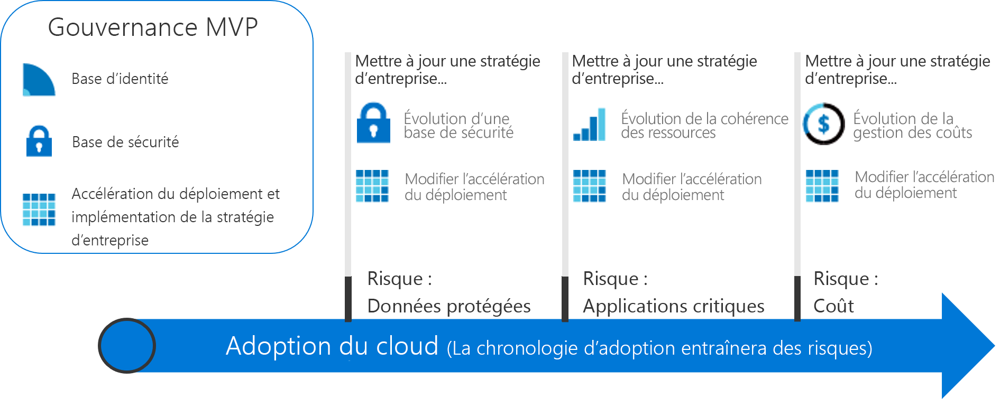

# Parcours de gouvernance actionnables

Les parcours de gouvernance de cette section illustrent l’approche incrémentielle du modèle de gouvernance du framework d’adoption du cloud. Vous pouvez établir une plateforme de gouvernance agile capable de s’adapter aux besoins de n’importe quel scénario de gouvernance cloud.

## Découvrir et adopter les meilleures pratiques en matière de gouvernance cloud

Pour choisir un mode d’adoption du cloud, choisissez l’un des parcours suivants. Chaque parcours décrit une série de bonnes pratiques qui reposent sur un ensemble d’expériences client fictives. Avant de choisir l’une des bonnes pratiques, nous recommandons aux utilisateurs qui ne connaissent pas l’approche incrémentielle du modèle de gouvernance du framework d’adoption du cloud de lire d’abord l’introduction ci-dessous qui porte sur la théorie de gouvernance à haut niveau.

<!-- markdownlint-disable MD033 -->

<ul class="panelContent cardsZ">
<li style="display: flex; flex-direction: column;">
    <a href="./small-to-medium-enterprise/overview.md" style="display: flex; flex-direction: column; flex: 1 0 auto;">
        

            

                

                    

                        <h3>Petites et moyennes entreprises</h3>
                        
Parcours de gouvernance destiné aux entreprises possédant moins de cinq centres de données et gérant les coûts par le biais d’un modèle central informatique ou de récupération des données de facturation.

                    

                

            

        

    </a>
</li>
<li style="display: flex; flex-direction: column;">
    <a href="./large-enterprise/overview.md" style="display: flex; flex-direction: column; flex: 1 0 auto;">
        

            

                

                    

                        <h3>Grandes entreprises</h3>
                        
Parcours de gouvernance destiné aux entreprises possédant plus de cinq centres de données et gérant les coûts sur plusieurs unités commerciales.

                    

                

            

        

    </a>
</li>
</ul>

<!-- markdownlint-enable MD033 -->

## Approche incrémentielle sur la gouvernance cloud

L’adoption du cloud est un cheminement, non un objectif. Ce parcours est jalonné d’étapes cruciales et d’avantages commerciaux tangibles. Toutefois, lorsqu’une entreprise entame son parcours d’adoption du cloud, elle sait rarement quel sera son état final. La gouvernance cloud permet de mettre en place un rail de sécurité pour l’entreprise tout au long de son parcours.

Ces parcours de gouvernance décrivent les expériences d’entreprises fictives. Ils s’appuient cependant sur les parcours de clients réels. Chaque parcours suit le client dans les aspects qui touchent à la gouvernance du passage au cloud.

### Établir un état final

Lorsque la fin d’un parcours n’est pas définie, on parle d’errance. Il est important d’élaborer une vision globale de l’état final avant d’entreprendre la première étape. L’infographie suivante sert de référence pour ébaucher un état final. Il ne constitue pas votre point de départ, mais montre une destination potentielle.

Le modèle de gouvernance du framework d’adoption du cloud identifie certains domaines clés tout au long du parcours. Chaque domaine est associé à différents types de risques que l’entreprise doit prendre en compte à mesure qu’elle adopte des services cloud. Dans ce framework, le parcours de gouvernance identifie certaines actions requises par l’équipe de gouvernance cloud. Chaque principe du modèle de gouvernance du framework d’adoption du cloud est décrit plus en détail. En général, ils incluent les éléments suivants :

**Stratégies d’entreprise**. Les stratégies d’entreprises stimulent la gouvernance cloud. Le parcours de gouvernance porte sur des aspects spécifiques de la stratégie d’entreprise :

- Risques commerciaux : Identification et compréhension des risques pour l’entreprise.
- Stratégie et conformité : Conversion des risques en instructions stratégiques intégrant des exigences de conformité.
- Processus : Respect des stratégies élaborées.

**Cinq disciplines de gouvernance cloud**. Ces disciplines soutiennent les stratégies d’entreprise. Chaque discipline protège l’entreprise contre certains pièges potentiels :

- Cost Management
- Base de référence de la sécurité
- Cohérence des ressources
- Base de référence des identités
- Accélération du déploiement

Au fond, les stratégies d’entreprise font figure de système d’avertissement qui détecte les potentiels problèmes. Les disciplines aident l’entreprise à réduire les risques et forment une sorte de « glissière de sécurité ».

### Parvenir à l’état final

Comme les exigences de gouvernance évoluent tout au long du parcours d’adoption cloud, il est nécessaire d’adopter une approche différente face à la gouvernance. Les entreprises ne peuvent plus espérer qu’une petite équipe sécurise et jalonne chaque processus *avant de se lancer et de mettre en œuvre une première étape*. Des résultats commerciaux rapides et réguliers sont attendus. La gouvernance informatique doit également évoluer rapidement et suivre le rythme des exigences opérationnelles afin de rester pertinente lors du passage au cloud et d’éviter le phénomène « d’informatique fantôme ».

L’approche de **gouvernance incrémentielle** permet de prendre toute la mesure de ces caractéristiques. La gouvernance incrémentielle repose sur un petit ensemble de stratégies d’entreprise, de processus et d’outils qui visent à établir une base solide pour le passage au cloud et sa gouvernance. Cette base est appelée un **produit minimum viable** (MVP, minimum viable product). Grâce au produit minimum viable, l’équipe responsable peut intégrer rapidement la gouvernance aux implémentations tout au long du cycle d’adoption du cloud. Un produit minimum viable peut être établi à tout moment pendant ce processus. Toutefois, il est conseillé d’adopter un produit minimum viable le plus tôt possible.

Lorsqu’elle est capable de répondre rapidement à l’évolution des risques, l’équipe de gouvernance cloud peut alors s’impliquer dans d’autres domaines. L’équipe de gouvernance cloud peut jouer le rôle d’éclaireur auprès de l’équipe de stratégie cloud, en devançant les équipes chargées de l’adoption du cloud et en s’éloignant des sentiers battus afin de mettre rapidement en place des mesures de sécurité permettant d’atténuer les risques associés aux plans d’adoption. Ces couches de gouvernance juste-à-temps sont des **évolutions de gouvernance**. Grâce à cette approche, la stratégie de gouvernance prend une longueur d’avance sur les équipes chargées de l’adoption du cloud.

Le diagramme suivant illustre un produit minimum viable de gouvernance simple et trois évolutions de gouvernance. Au cours des évolutions, des stratégies d’entreprise supplémentaires sont définies afin d’atténuer les nouveaux risques. La discipline Accélération du déploiement applique ensuite ces modifications à chaque déploiement.

> [!NOTE]
> La gouvernance ne remplace pas les fonctions clés telles que la sécurité, la mise en réseau, l’identité, la finance, le DevOps ou les opérations. Tout au long du processus, les interactions et dépendances avec les membres de chaque fonction sont nombreuses. Ces membres doivent être inclus dans l’équipe de gouvernance coud afin d’accélérer la prise de décisions et la mise en œuvre d’actions.

## Choix d’un parcours de gouvernance

Les différents parcours montrent comment implémenter un produit minimum viable de la gouvernance. Ensuite, chaque parcours indique comment l’équipe de gouvernance cloud peut travailler au-devant des équipes chargées de l’adoption du cloud en tant que partenaire afin d’accélérer le passage au cloud. Le modèle de gouvernance du frameword d’adoption du cloud guide l’application de la gouvernance à partir de ses fondements et tout au long des évolutions postérieures.

Pour entamer un parcours de gouvernance, choisissez l’une des deux options ci-dessous. Les options s’appuient sur des expériences client synthétisées. Les titres évoquent la taille de l’entreprise pour faciliter votre navigation. Toutefois, il se peut que la décision du lecteur soit plus complexe. Les tableaux suivants dressent la liste des différences entre ces deux options :

> [!NOTE]
> Il est peu probable que les parcours correspondent totalement à votre situation. Choisissez le parcours qui s’en rapproche le plus et utilisez-le comme point de départ. Tout au long du parcours, vous trouverez des informations supplémentaires afin de vous aider à personnaliser vos décisions et ainsi satisfaire certains critères spécifiques.

### Caractéristiques de l’entreprise

|                                            | Petites et moyennes entreprises                                                                              | Grandes entreprises                                                                                               |
|--------------------------------------------|---------------------------------------------------------------------------------------------------------|----------------------------------------------------------------------------------------------------------------|
| Zone (pays ou région géopolitique) | Les clients ou le personnel se trouvent majoritairement dans une seule zone.                                                      | Les clients ou le personnel sont répartis sur plusieurs zones.                                                              |
| Unités commerciales affectées                    | Unité commerciale unique                                                                                    | Unités commerciales multiples                                                                                        |
| Budget informatique                                  | Budget informatique unique                                                                                        | Budget alloué à différentes unités commerciales                                                                         |
| Investissements informatiques                             | Les frais liés aux dépenses d’investissement (CapEx) sont planifiés annuellement et couvrent généralement uniquement la maintenance de base. | Les frais liés aux dépenses d’investissement (CapEx) sont planifiés annuellement et incluent souvent la maintenance ainsi qu’un cycle de renouvellement de 3 à 5 ans. |

### État actuel avant l’adoption de la gouvernance cloud

|                                             | Petites et moyennes entreprises                                                                               | Grandes entreprises                                                                                                          |
|---------------------------------------------|----------------------------------------------------------------------------------------------------------|---------------------------------------------------------------------------------------------------------------------------|
| Centre de données ou fournisseurs d’hébergement tiers | Moins de cinq centres de données                                                                                  | Plus de cinq centres de données                                                                                                   |
| Mise en réseau                                  | Aucun réseau étendu ou 1&ndash;2 fournisseurs de réseau étendu                                                                             | Réseau complexe ou réseau étendu global                                                                                             |
| Identité                                    | Forêt unique et domaine unique. Aucune exigence relative à l’authentification par revendication ou aux appareils à authentification multifacteur tiers. | Complexe, forêts et domaines multiples. Les applications requièrent l’authentification par revendication ou des appareils à authentification multifacteur tiers. |

### État futur souhaité après passage à la gouvernance cloud

|                                              | Petites et moyennes entreprises                                                                        | Grandes entreprises                                                                                        |
|----------------------------------------------|---------------------------------------------------------------------------------------------------|---------------------------------------------------------------------------------------------------------|
| Gestion des coûts – comptabilité cloud           | Modèle de récupération des données de facturation. Facturation informatique centralisée.                                                | Modèle de rétrofacturation. La facturation peut être répartie en fonction de l’approvisionnement informatique.                                  |
| Ligne de base de sécurité – données protégées           | Données financières de l’entreprise et adresse IP. Données client limitées. Aucune exigence en matière de conformité des tiers.     | Plusieurs ensembles de données financières et d’informations d’identification personnelle des clients. Conformité des tiers à envisager. |
| Cohérence des ressources – applications stratégiques | Les pannes sont désagréables, mais n’entraînent pas de conséquences financières graves. Les opérations informatiques existantes sont relativement immatures. | Les pannes ont défini des impacts financiers et sont surveillées. Les opérations informatiques sont établies et matures.         |

Ces deux parcours représentent deux expériences extrêmes de clients qui investissent dans la gouvernance cloud. Pour la plupart des entreprises, ces deux scénarios s’entremêlent. Une fois que vous avez passé le parcours en revue, utilisez le modèle de gouvernance du framework d’adoption du cloud pour amorcer la conversation de gouvernance et modifier les parcours de référence pour mieux répondre à vos besoins.

## Étapes suivantes

Choisissez l’un de ces parcours :

> [!div class="nextstepaction"]
> [Parcours de gouvernance pour les petites et moyennes entreprises](./small-to-medium-enterprise/overview.md)
>
> [Parcours de gouvernance pour les grandes entreprises](./large-enterprise/overview.md)
