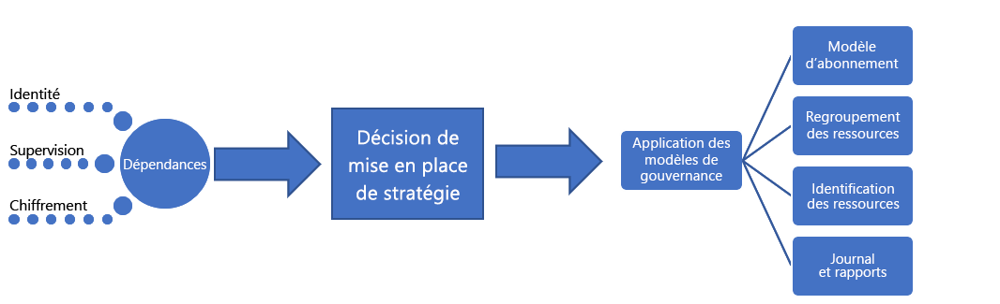

# Petite ou moyenne entreprise : Bonne pratique, explicationSmall-to-medium enterprise: Best practice explained

Ce parcours de gouvernance commence par un ensemble de [stratégies d’entreprise](./initial-corporate-policy.md) initiales.The governance journey starts with a set of initial [corporate policies](./initial-corporate-policy.md). Ces stratégies permettent de définir un produit minimum viable (MVP) pour la gouvernance reflétant les [meilleures pratiques](./overview.md).These policies are used to establish a governance MVP that reflects [best practices](./overview.md).

Dans cet article, nous allons parler des stratégies de haut niveau qui sont nécessaires pour créer un MVP de gouvernance.In this article, we discuss the high-level strategies that are required to create a governance MVP. Au cœur d’un MVP de gouvernance se trouve la discipline : [Accélération du déploiement](../../deployment-acceleration/overview.md).The core of the governance MVP is the [Deployment Acceleration](../../deployment-acceleration/overview.md) discipline. À ce stade, les outils et modèles qui sont appliqués permettent les évolutions incrémentielles nécessaires pour étendre la gouvernance à l’avenir.The tools and patterns applied at this stage will enable the incremental evolutions needed to expand governance in the future.

## MVP de gouvernance (base d’adoption du cloud)Governance MVP (Cloud Adoption Foundation)

Grâce à quelques principes simples et à des outils de gouvernance basés sur le cloud, il est possible d’adopter rapidement la gouvernance et une stratégie d’entreprise.Rapid adoption of governance and corporate policy is achievable, thanks to a few simple principles and cloud-based governance tooling. Voici la première des trois disciplines de gouvernance à aborder lors d’un processus de gouvernance.These are the first of the three Cloud Governance Disciplines to approach in any governance process. Chaque discipline sera détaillée dans cet article.Each will be expanded upon in this article.

Pour établir le point de départ, cet article traite des stratégies de haut niveau derrière la base de référence des identités, la base de référence de la sécurité et l’accélération du déploiement. Ces stratégies sont requises pour créer un MVP de gouvernance, qui serve de base pour l’ensemble du processus d’adoption.To establish the starting point, this article will discuss the high-level strategies behind Identity Baseline, Security Baseline, and Deployment Acceleration that are required to create a governance MVP, which will serve as the foundation for all adoption.

## Processus d’implémentationImplementation process

L’implémentation du MVP de gouvernance dépend de l’identité, de la sécurité et de la mise en réseau.The implementation of the governance MVP has dependencies on Identity, Security, and Networking. Une fois les dépendances résolues, l’équipe de gouvernance cloud fait des choix sur certains aspects de gouvernance.Once the dependencies are resolved, the Cloud Governance team will decide a few aspects of governance. Les décisions prises par l’équipe de gouvernance cloud et les équipes d’aide sont implémentées via un seul package de ressources d’application.The decisions from the Cloud Governance team and from supporting teams will be implemented through a single package of enforcement assets.

Cette implémentation peut également être décrite à l’aide d’une simple check-list :This implementation can also be described using a simple checklist:

1. Sollicitez des décisions concernant les principales dépendances : identité, réseau et chiffrement.Solicit decisions regarding core dependencies: Identity, Network, and Encryption.
2. Déterminez le modèle à utiliser lors de l’application des stratégies d’entreprise.Determine the pattern to be used during corporate policy enforcement.
3. Déterminez les modèles de gouvernance appropriés pour les disciplines suivantes : cohérence des ressources, identification des ressources et création de rapports.Determine the appropriate governance patterns for the Resource Consistency, Resource Tagging, and Loging and Reporting disciplines.
4. Implémentez les outils de gouvernance alignés sur le modèle d’application de stratégie choisi, dans le but d’appliquer des décisions dépendantes et des décisions de gouvernance.Implement the governance tools aligned to the chosen policy enforcement pattern to apply the dependent decisions and governance decisions.

[!INCLUDE [implementation-process](../../../../../includes/cloud-adoption/governance/implementation-process.md)]

## Application de modèles définis par la gouvernanceApplication of governance-defined patterns

L’équipe de gouvernance cloud est responsable des décisions et implémentations suivantes.The Cloud Governance team is responsible for the following decisions and implementations. Beaucoup ont besoin du travail d’autres équipes, mais l’équipe de gouvernance cloud devrait être à la fois maître des décisions et de l’implémentation.Many require inputs from other teams, but the Cloud Governance team is likely to own both the decision and the implementation. Les sections suivantes indiquent les décisions prises pour ce cas d’usage, et décrit chacune d’elles.The following sections outline the decisions made for this use case and details of each decision.

### Modèle d’abonnementSubscription model

Le modèle **Catégorie d’application** a été choisi pour les abonnements Azure.The **Application Category** pattern has been chosen for Azure subscriptions.

- Un archétype d’application est un moyen de regrouper des applications dont les besoins sont similaires.An application archetype is a way to group applications with similar needs. Voici quelques exemples communs : Applications avec des données protégées, applications régies (telles que HIPAA ou FedRAMP), applications à faible risque, applications avec des dépendances locales, SAP ou autres grands système dans Azure ou applications qui étendent localement SAP ou des grands systèmes.Common examples include: Applications with protected data, governed applications (such as HIPAA or FedRAMP), low- risk applications, applications with on-premises dependencies, SAP or other mainframes in Azure, or applications that extend on-premises SAP or mainframes. Ces archétypes sont propres à chaque organisation, en fonction des classifications de données et des types d’applications qui alimentent l’entreprise.These archetypes are unique per organization, based on data classifications and the types of applications that power the business. Le mappage des dépendances de l’investissement numérique peut aider à définir les archétypes d’application dans une organisation.Dependency mapping of the digital estate can aid in defining the application archetypes in an organization.
- Il est peu probable que les département doivent intervenir dans ce processus.Departments are not likely to be required given the current focus. Les déploiements sont en principe limités au sein d’une même unité de facturation.Deployments are expected to be constrained within a single billing unit. Au stade de l’adoption, il se peut même qu’il n’y ait pas de contrat entreprise pour centraliser la facturation.At the stage of adoption, there may not even be an enterprise agreement to centralize billing. Il est probable que ce niveau d’adoption soit géré par un seul abonnement Azure avec paiement à l’utilisation.It's likely that this level of adoption is being managed by a single pay-as-you-go Azure subscription.
- Indépendamment de l’utilisation du portail EA ou de l’existence d’un contrat entreprise, un modèle d’abonnement doit quand même être défini et convenu afin de minimiser le nombre de demandes administratives ne portant pas sur la facturation.Regardless of the use of the EA Portal or the existence of an enterprise agreement, a subscription model should still be defined and agreed upon to minimize administrative overheard beyond just billing.
- Dans le modèle **Catégorie d’application**, des abonnements sont créés pour chaque archétype d’application.In the **Application Category** pattern, subscriptions are created for each application archetype. Chaque abonnement appartient à un compte d’environnement (développement, test et production).Each subscription belongs to an account per environment (Development, Test, and Production).
- Une convention d’affectation de noms commune doit être convenue dans le cadre de la conception de l’abonnement, en tenant compte des deux points précédents.A common naming convention should be agreed on as part of the subscription design, based on the previous two points.

### Cohérence des ressourcesResource Consistency

Le modèle **Cohérence du déploiement** a été choisi en tant que Cohérence des ressources.The **Deployment Consistency** pattern has been chosen as a Resource Consistency.

- Des groupes de ressources sont créés pour chaque application.Resource groups are created for each application. Des groupes d’administration sont créés pour chaque archétype d’application.Management groups are created for each application archetype. La stratégie Azure doit être appliquée à tous les abonnements du groupe d’administration associé.Azure Policy should be applied to all subscriptions from the associated management group.
- Dans le cadre du processus de déploiement, les modèles Cohérence des ressources Azure doivent être stockés dans le contrôle du code source pour le groupe de ressources.As part of the deployment process, Azure Resource Consistency templates for the resource group should be stored in source control.
- Chaque groupe de ressources est associé à une charge de travail ou à une application spécifique.Each resource group is associated with a specific workload or application.
- Les groupes d’administration Azure permettent de mettre à jour les modèles de gouvernance au fur et à mesure que la stratégie de l’entreprise évolue.Azure management groups enable updating governance designs as corporate policy matures.
- La mise en œuvre à grande échelle de la stratégie Azure peut dépasser les échéances fixées par l’équipe et ne pas présenter un intérêt tangible pour le moment.Extensive implementation of Azure Policy could exceed the team’s time commitments and may not provide a great deal of value at this time. Toutefois, une stratégie simple par défaut doit être créée et appliquée à chaque groupe de gestion pour faire respecter le faible nombre d’instructions portant sur la gouvernance cloud.However, a simple default policy should be created and applied to each management group to enforce the small number of current cloud governance policy statements. Cette stratégie est censée définir l’implémentation d’exigences précises en matière de gouvernance.This policy will define the implementation of specific governance requirements. Ces implémentations peuvent ensuite être appliquées à toutes les ressources déployées.Those implementations can then be applied across all deployed assets.

### Identification des ressourcesResource tagging

Le modèle **Classification** du balisage a été choisi comme modèle pour le balisage des ressources.The **Classification** pattern to tagging has been chosen as a model for resource tagging.

- Les ressources déployées doivent être étiquetées avec les valeurs suivantes : Classification des données, Caractère critique, SLA et Environnement.Deployed assets should be tagged with the following values: Data Classification, Criticality, SLA, and Environment.
- Ces quatre valeurs guideront la gouvernance, les opérations et les décisions en matière de sécurité.These four values will drive governance, operations, and security decisions.
- Si cette démarche de gouvernance est implémentée pour une unité opérationnelle ou une équipe au sein d’une grande entreprise, le balisage doit également inclure des métadonnées pour l’unité de facturation.If this governance journey is being implemented for a business unit or team within a larger corporation, tagging should also include metadata for the billing unit.

### Journalisation et création de rapportsLogging and reporting

À ce stade, un modèle **Natif cloud** de journalisation et de création de rapports est suggéré mais ne requiert pas d’équipe de développement.At this point, a **Cloud Native** pattern to logging and reporting is suggested but not required of any development team.

- Aucune exigence en matière de gouvernance n’a été établie sur les données à collecter à des fins de journalisation ou de création de rapports.No governance requirements have been set regarding the data to be collected for logging or reporting purposes.
- Une analyse supplémentaire est nécessaire avant de publier les données protégées ou les charges de travail critiques.Additional analysis will be needed before releasing any protected data or mission-critical workloads.

## Évolution des processus de gouvernanceEvolution of governance processes

Avec l’évolution de la gouvernance, certaines instructions de stratégie ne peuvent ou ne doivent pas être contrôlés par des outils automatisés.As governance evolves, some policy statements can’t or shouldn’t be controlled by automated tooling. D’autres stratégies donnent lieu à des efforts de la part de l’équipe de sécurité informatique et de l’équipe de gestion des identités localement au fil du temps.Other policies will result in effort by the IT Security team and the on-premises Identity Management team over time. Pour aider à atténuer les nouveaux risques au fur et à mesure qu’ils surviennent, l’équipe de gouvernance cloud supervise les processus suivants.To help mitigate new risks as they arise, the Cloud Governance team will oversee the following processes.

**Accélération de l’adoption** : L’équipe de gouvernance cloud a passé en revue les scripts de déploiement au sein de plusieurs équipes.**Adoption acceleration**: The Cloud Governance team has been reviewing deployment scripts across multiple teams. Celles-ci gèrent un ensemble de scripts qui servent de modèles de déploiement.They maintain a set of scripts that serve as deployment templates. Ces modèles sont utilisés par les équipes d’adoption du cloud et des DevOps pour définir plus rapidement les déploiements.Those templates are used by the cloud adoption and DevOps teams to define deployments more quickly. Chacun de ces scripts contient les exigences nécessaires à l’implémentation d’un certain nombre de stratégies de gouvernance, sans effort supplémentaire de la part des ingénieurs chargés de l’adoption du cloud.Each of those scripts contains the necessary requirements to enforce a number of governance policies, with no additional effort from cloud adoption engineers. En tant que conservatrice de ces scripts, l’équipe de gouvernance cloud peut implémenter plus rapidement des changements de stratégie.As the curators of these scripts, the Cloud Governance team can more quickly implement policy changes. En raison de la conservation des scripts, l’équipe de gouvernance cloud est considérée comme une source d’accélération de l’adoption.As a result of script curation, the Cloud Governance team is seen as a source of adoption acceleration. Cela permet d’uniformiser les déploiements sans forcer l’adhésion de façon stricte.This creates consistency among deployments, without strictly forcing adherence.

**Formation technique** : L’équipe de gouvernance propose des sessions de formation bimensuelles et a créé deux vidéos pour les ingénieurs.**Engineer training**: The Cloud Governance team offers bi-monthly training sessions and has created two videos for engineers. Ces documents forment rapidement les ingénieurs à la culture de gouvernance et aux opérations réalisées pendant les déploiements.These materials help engineers quickly learn the governance culture and how things are done during deployments. L’équipe ajoute des ressources de formation qui mettent en évidence entre les déploiements en production et les autres, afin que les ingénieurs comprennent l’impact des nouvelles stratégies sur l’adoption du cloud.The team is adding training assets that show the difference between production and non-production deployments, so that engineers will understand how the new policies will affect adoption. Cela permet d’uniformiser les déploiements sans forcer l’adhésion de façon stricte.This creates consistency among deployments, without strictly forcing adherence.

**Planification de déploiement** : Avant de déployer toute ressources contenant des données protégées, l’équipe de gouvernance du cloud examine les scripts de déploiement pour valider l’adéquation de la ressource à la gouvernance.**Deployment planning**: Before deploying any asset containing protected data, the Cloud Governance team will review deployment scripts to validate governance alignment. Les équipes existantes dont les déploiements ont déjà été approuvés feront l’objet d’un audit à l’aide d’outils de programmation.Existing teams with previously approved deployments will be audited using programmatic tooling.

**Audit et création de rapports mensuels** : Chaque mois, l’équipe de gouvernance du cloud effectue un audit de tous les déploiements cloud afin de valider l’adéquation continue à la stratégie.**Monthly audit and reporting**: Each month, the Cloud Governance team runs an audit of all cloud deployments to validate continued alignment to policy. Lorsque des écarts sont identifiés, ils sont documentés et partagés avec les équipes d’adoption du cloud.When deviations are discovered, they are documented and shared with the cloud adoption teams. Lorsque l’implémentation ne risque pas d’entraîner une interruption des activités ou une fuite de données, les stratégies sont automatiquement implémentées.When enforcement doesn't risk a business interruption or data leak, the policies are automatically enforced. À la fin de l’audit, l’équipe de gouvernance du cloud compile un rapport pour l’équipe de la stratégie cloud et chaque équipe d’adoption du cloud afin de communiquer sur l’adhésion générale des parties prenantes à la stratégie.At the end of the audit, the Cloud Governance team compiles a report for the Cloud Strategy team and each cloud adoption team to communicate overall adherence to policy. Le rapport est également conservé à des fins d’audit et juridiques.The report is also stored for auditing and legal purposes.

**Révision de la planification trimestrielle** : Chaque trimestre, l’équipe de gouvernance du cloud et l’équipe de la stratégie cloud examinent les résultats de l’audit et proposent que des modifications soient apportés à la stratégie de l’entreprise.**Quarterly policy review**: Each quarter, the Cloud Governance team and the Cloud Strategy team will review audit results and suggest changes to corporate policy. La plupart de ces suggestions sont le résultat d’améliorations continues et de l’observation des modèles d’utilisation.Many of those suggestions are the result of continuous improvements and the observation of usage patterns. Les modifications de stratégie approuvées sont intégrées à l’outil de gouvernance au cours des cycles d’audit ultérieurs.Approved policy changes are integrated into governance tooling during subsequent audit cycles.

## Autres modèlesAlternative patterns

Si l’un des modèles choisis dans ce parcours de gouvernance ne correspond pas aux exigences du lecteur, chaque modèle possède une solution de rechange :If any of the patterns selected in this governance journey don't align with the reader's requirements, alternatives to each pattern are available:

- [Modèles de chiffrementEncryption patterns](../../../decision-guides/encryption/overview.md)
- [Modèles d’identitéIdentity patterns](../../../decision-guides/identity/overview.md)
- [Modèles de journalisation et de création de rapportsLogging and Reporting patterns](../../../decision-guides/log-and-report/overview.md)
- [Modèles d’implémentation de stratégiePolicy Enforcement patterns](../../../decision-guides/policy-enforcement/overview.md)
- [Modèles de cohérence des ressourcesResource Consistency patterns](../../../decision-guides/resource-consistency/overview.md)
- [Modèles d’étiquetage des ressourcesResource Tagging patterns](../../../decision-guides/resource-tagging/overview.md)
- [Modèles SDN (Software Defined Network)Software Defined Network patterns](../../../decision-guides/software-defined-network/overview.md)
- [Modèles de conception des abonnementsSubscription Design patterns](../../../decision-guides/subscriptions/overview.md)

## Étapes suivantesNext steps

Une fois ce guide implémenté, chaque équipe d’adoption du cloud peut s’appuyer sur une base de gouvernance solide.Once this guide is implemented, each cloud adoption team can go forth with a sound governance foundation. L’équipe de gouvernance du Cloud travaille en parallèle à la mise à jour continue des stratégies d’entreprise et des disciplines de gouvernance.The Cloud Governance team will work in parallel to continuously update the corporate policies and governance disciplines.

Les deux équipes utilisent les indicateurs de tolérance pour identifier la prochaine évolution nécessaire pour continuer à soutenir l’adoption du cloud.The two teams will use the tolerance indicators to identify the next evolution needed to continue supporting cloud adoption. Pour l’entreprise fictive dans ce cheminement, l’étape suivante consiste à faire évoluer la base de référence de sécurité en vue du transfert des données protégées vers le cloud.For the fictional company in this journey, the next step is evolving the Security Baseline to support moving protected data to the cloud.

> [!div class="nextstepaction"]
> [Évolution de la base de référence de la sécuritéSecurity Baseline evolution](./security-baseline-evolution.md)