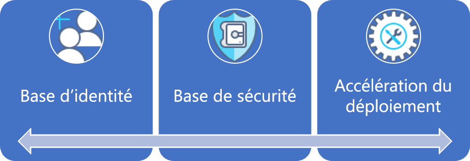

# Petites et moyennes entreprises : Bonne pratique, explication

Ce parcours de gouvernance commence par un ensemble de [stratégies d’entreprise](./initial-corporate-policy.md) initiales. Ces stratégies permettent de définir un produit minimum viable (MVP) pour la gouvernance reflétant les [meilleures pratiques](./overview.md).

Dans cet article, nous allons parler des stratégies de haut niveau qui sont nécessaires pour créer un MVP de gouvernance. Au cœur d’un MVP de gouvernance se trouve la discipline : [Accélération du déploiement](../../deployment-acceleration/overview.md). À ce stade, les outils et modèles qui sont appliqués permettent les évolutions incrémentielles nécessaires pour étendre la gouvernance à l’avenir.

## MVP de gouvernance (base d’adoption du cloud)

Grâce à quelques principes simples et à des outils de gouvernance basés sur le cloud, il est possible d’adopter rapidement la gouvernance et une stratégie d’entreprise. Voici les trois premiers disciplines approche dans n’importe quel processus de gouvernance. Chaque discipline sera détaillée dans cet article.

Pour établir le point de départ, cet article traite des stratégies de haut niveau derrière la base de référence des identités, la base de référence de la sécurité et l’accélération du déploiement. Ces stratégies sont requises pour créer un MVP de gouvernance, qui serve de base pour l’ensemble du processus d’adoption.

## Processus d’implémentation

L’implémentation du MVP de gouvernance dépend de l’identité, de la sécurité et de la mise en réseau. Une fois les dépendances résolues, l’équipe de gouvernance cloud fait des choix sur certains aspects de gouvernance. Les décisions prises par l’équipe de gouvernance cloud et les équipes d’aide sont implémentées via un seul package de ressources d’application.

Cette implémentation peut également être décrite à l’aide d’une simple check-list :

1. Sollicitez des décisions concernant les principales dépendances : identité, réseau et chiffrement.
2. Déterminez le modèle à utiliser lors de l’application des stratégies d’entreprise.
3. Déterminer les modèles de gouvernance appropriée pour la cohérence de la ressource, le balisage des ressources et les disciplines de journalisation et création de rapports.
4. Implémentez les outils de gouvernance alignés sur le modèle d’application de stratégie choisi, dans le but d’appliquer des décisions dépendantes et des décisions de gouvernance.

[!INCLUDE [implementation-process](../../../../../includes/cloud-adoption/governance/implementation-process.md)]

## Application de modèles définis par la gouvernance

L’équipe de gouvernance cloud est responsable des décisions et implémentations suivantes. Beaucoup ont besoin du travail d’autres équipes, mais l’équipe de gouvernance cloud devrait être à la fois maître des décisions et de l’implémentation. Les sections suivantes indiquent les décisions prises pour ce cas d’usage, et décrit chacune d’elles.

### Modèle d’abonnement

Le modèle **Catégorie d’application** a été choisi pour les abonnements Azure.

- Un archétype d’application est un moyen de regrouper des applications dont les besoins sont similaires. Voici quelques exemples communs : Applications avec des données protégées, applications régies (telles que HIPAA ou FedRAMP), applications à faible risque, applications avec des dépendances locales, SAP ou autres grands système dans Azure ou applications qui étendent localement SAP ou des grands systèmes. Ces archétypes sont propres à chaque organisation, en fonction des classifications de données et des types d’applications qui alimentent l’entreprise. Le mappage des dépendances de l’investissement numérique peut aider à définir les archétypes d’application dans une organisation.
- Il est peu probable que les département doivent intervenir dans ce processus. Les déploiements sont en principe limités au sein d’une même unité de facturation. Au stade de l’adoption, il se peut même qu’il n’y ait pas de contrat entreprise pour centraliser la facturation. Il est probable que ce niveau d’adoption soit géré par un seul abonnement Azure avec paiement à l’utilisation.
- Indépendamment de l’utilisation du portail EA ou de l’existence d’un contrat entreprise, un modèle d’abonnement doit quand même être défini et convenu afin de minimiser le nombre de demandes administratives ne portant pas sur la facturation.
- Dans le modèle **Catégorie d’application**, des abonnements sont créés pour chaque archétype d’application. Chaque abonnement appartient à un compte d’environnement (développement, test et production).
- Une convention d’affectation de noms commune doit être convenue dans le cadre de la conception de l’abonnement, en tenant compte des deux points précédents.

### Cohérence des ressources

Le modèle **Cohérence du déploiement** a été choisi en tant que Cohérence des ressources.

- Des groupes de ressources sont créés pour chaque application. Des groupes d’administration sont créés pour chaque archétype d’application. La stratégie Azure doit être appliquée à tous les abonnements du groupe d’administration associé.
- Dans le cadre du processus de déploiement, les modèles Cohérence des ressources Azure doivent être stockés dans le contrôle du code source pour le groupe de ressources.
- Chaque groupe de ressources est associé à une charge de travail ou à une application spécifique.
- Les groupes d’administration Azure permettent de mettre à jour les modèles de gouvernance au fur et à mesure que la stratégie de l’entreprise évolue.
- La mise en œuvre à grande échelle de la stratégie Azure peut dépasser les échéances fixées par l’équipe et ne pas présenter un intérêt tangible pour le moment. Toutefois, une stratégie simple par défaut doit être créée et appliquée à chaque groupe de gestion pour faire respecter le faible nombre d’instructions portant sur la gouvernance cloud. Cette stratégie est censée définir l’implémentation d’exigences précises en matière de gouvernance. Ces implémentations peuvent ensuite être appliquées à toutes les ressources déployées.

### Identification des ressources

Le modèle **Classification** du balisage a été choisi comme modèle pour le balisage des ressources.

- Les ressources déployées doivent être étiquetées avec les valeurs suivantes : Classification des données, Caractère critique, SLA et Environnement.
- Ces quatre valeurs guideront la gouvernance, les opérations et les décisions en matière de sécurité.
- Si cette démarche de gouvernance est implémentée pour une unité opérationnelle ou une équipe au sein d’une grande entreprise, le balisage doit également inclure des métadonnées pour l’unité de facturation.

### Journalisation et création de rapports

À ce stade, un modèle **Natif cloud** de journalisation et de création de rapports est suggéré mais ne requiert pas d’équipe de développement.

- Aucune exigence en matière de gouvernance n’a été établie sur les données à collecter à des fins de journalisation ou de création de rapports.
- Une analyse supplémentaire est nécessaire avant de publier les données protégées ou les charges de travail critiques.

## Évolution des processus de gouvernance

Avec l’évolution de la gouvernance, certaines instructions de stratégie ne peuvent ou ne doivent pas être contrôlés par des outils automatisés. D’autres stratégies donnent lieu à des efforts de la part de l’équipe de sécurité informatique et de l’équipe de gestion des identités localement au fil du temps. Pour aider à atténuer les nouveaux risques au fur et à mesure qu’ils surviennent, l’équipe de gouvernance cloud supervise les processus suivants.

**Accélération de l’adoption** : L’équipe de gouvernance cloud a passé en revue les scripts de déploiement au sein de plusieurs équipes. Celles-ci gèrent un ensemble de scripts qui servent de modèles de déploiement. Ces modèles sont utilisés par les équipes d’adoption du cloud et des DevOps pour définir plus rapidement les déploiements. Chacun de ces scripts contient les exigences nécessaires à l’implémentation d’un certain nombre de stratégies de gouvernance, sans effort supplémentaire de la part des ingénieurs chargés de l’adoption du cloud. En tant que conservatrice de ces scripts, l’équipe de gouvernance cloud peut implémenter plus rapidement des changements de stratégie. En raison de la conservation des scripts, l’équipe de gouvernance cloud est considérée comme une source d’accélération de l’adoption. Cela permet d’uniformiser les déploiements sans forcer l’adhésion de façon stricte.

**Formation technique** : L’équipe de gouvernance propose des sessions de formation bimensuelles et a créé deux vidéos pour les ingénieurs. Ces documents forment rapidement les ingénieurs à la culture de gouvernance et aux opérations réalisées pendant les déploiements. L’équipe ajoute des ressources de formation qui mettent en évidence entre les déploiements en production et les autres, afin que les ingénieurs comprennent l’impact des nouvelles stratégies sur l’adoption du cloud. Cela permet d’uniformiser les déploiements sans forcer l’adhésion de façon stricte.

**Planification de déploiement** : Avant de déployer toute ressources contenant des données protégées, l’équipe de gouvernance du cloud examine les scripts de déploiement pour valider l’adéquation de la ressource à la gouvernance. Les équipes existantes dont les déploiements ont déjà été approuvés feront l’objet d’un audit à l’aide d’outils de programmation.

**Audit et création de rapports mensuels** : Chaque mois, l’équipe de gouvernance du cloud effectue un audit de tous les déploiements cloud afin de valider l’adéquation continue à la stratégie. Lorsque des écarts sont identifiés, ils sont documentés et partagés avec les équipes d’adoption du cloud. Lorsque l’implémentation ne risque pas d’entraîner une interruption des activités ou une fuite de données, les stratégies sont automatiquement implémentées. À la fin de l’audit, l’équipe de gouvernance cloud compile un rapport pour l’équipe de la stratégie cloud et chaque équipe d’adoption du cloud afin de communiquer sur l’adhésion générale des parties prenantes à la stratégie. Le rapport est également conservé à des fins d’audit et juridiques.

**Révision de la planification trimestrielle** : Chaque trimestre, l’équipe de gouvernance du cloud et l’équipe de la stratégie cloud examinent les résultats de l’audit et proposent que des modifications soient apportés à la stratégie de l’entreprise. La plupart de ces suggestions sont le résultat d’améliorations continues et de l’observation des modèles d’utilisation. Les modifications de stratégie approuvées sont intégrées à l’outil de gouvernance au cours des cycles d’audit ultérieurs.

## Autres modèles

Si l’un des modèles choisis dans ce parcours de gouvernance ne correspond pas aux exigences du lecteur, chaque modèle possède une solution de rechange :

- [Modèles de chiffrement](../../../decision-guides/encryption/overview.md)
- [Modèles d’identité](../../../decision-guides/identity/overview.md)
- [Modèles de journalisation et de création de rapports](../../../decision-guides/log-and-report/overview.md)
- [Modèles d’implémentation de stratégie](../../../decision-guides/policy-enforcement/overview.md)
- [Modèles de cohérence des ressources](../../../decision-guides/resource-consistency/overview.md)
- [Modèles d’étiquetage des ressources](../../../decision-guides/resource-tagging/overview.md)
- [Modèles SDN (Software Defined Network)](../../../decision-guides/software-defined-network/overview.md)
- [Modèles de conception des abonnements](../../../decision-guides/subscriptions/overview.md)

## Étapes suivantes

Une fois ce guide implémenté, chaque équipe d’adoption du cloud peut s’appuyer sur une base de gouvernance solide. L’équipe de gouvernance du Cloud travaille en parallèle à la mise à jour continue des stratégies d’entreprise et des disciplines de gouvernance.

Les deux équipes utilisent les indicateurs de tolérance pour identifier la prochaine évolution nécessaire pour continuer à soutenir l’adoption du cloud. Pour l’entreprise fictive dans ce cheminement, l’étape suivante consiste à faire évoluer la base de référence de sécurité en vue du transfert des données protégées vers le cloud.

> [!div class="nextstepaction"]
> [Évolution de la base de référence de la sécurité](./security-baseline-evolution.md)