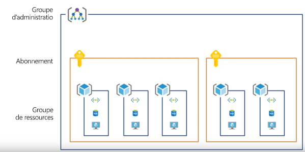
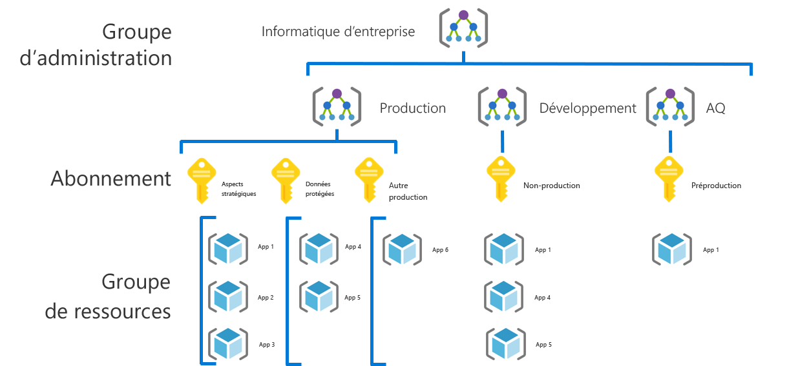
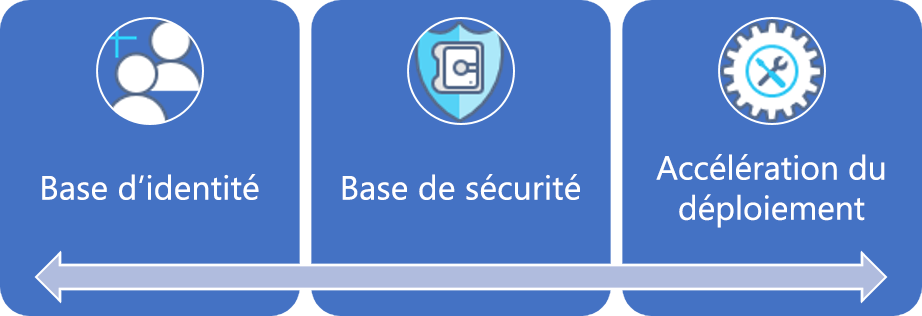
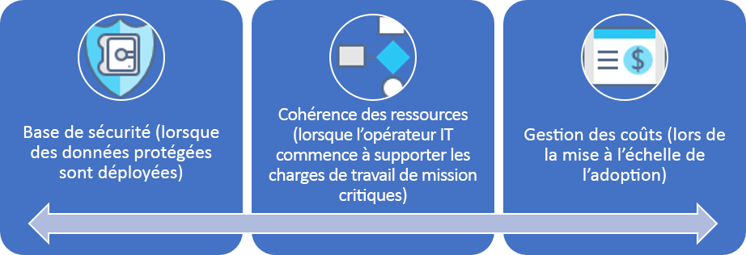

# Parcours de gouvernance pour les petites et moyennes entreprises

## Présentation des meilleures pratiques

Ce parcours de gouvernance suit les expériences d’une entreprise fictive à différents stades de maturité. Il est basé sur le parcours de clients réels. Les meilleures pratiques recommandées se fondent sur les contraintes et les besoins de l’entreprise fictive.

Comme point de départ rapide, cette présentation définit un produit minimum viable (MVP) pour la gouvernance, basé sur les meilleures pratiques. Elle fournit également des liens vers des évolutions de gouvernance, qui ajoutent des meilleures pratiques à mesure que de nouveaux risques métier et techniques émergent.

> [!WARNING]
> Ce MVP est un point de départ de base, qui se fonde sur un ensemble de postulats. Même cet ensemble minimal de meilleures pratiques se fonde sur des stratégies d’entreprise, qui sont axées sur des risques métier et des tolérances aux risques uniques. Pour déterminer si ces postulats s’appliquent à vous, lisez la [plus longue description](./narrative.md) qui suit cet article.

## Meilleures pratiques de gouvernance

Ces meilleures pratiques servent de bases sur lesquelles une organisation peut s’appuyer pour ajouter de manière cohérente et rapide des protections de gouvernance à plusieurs abonnements Azure.

### Organisation des ressources

Le schéma suivant montre la hiérarchie MVP de gouvernance pour organiser les ressources.

Chaque application doit être déployée dans la zone appropriée du groupe d’administration, de l’abonnement et de la hiérarchie des groupes de ressources. Lors de la planification du déploiement, l’équipe de gouvernance cloud crée les nœuds nécessaires dans la hiérarchie pour donner aux équipes d’adoption du cloud les moyens d’agir.  

1. Un groupe d’administration pour chaque type d’environnement (par exemple, Production, Développement et Test).
2. Un abonnement pour chaque « catégorisation d’application ».
3. Un groupe de ressources séparé pour chaque application.
4. Une nomenclature cohérente doit être appliquée à chaque niveau de cette hiérarchie de regroupement.

Voici un exemple de modèle utilisé :

Ces modèles laissent de l’espace pour la croissance sans compliquer la hiérarchie inutilement.

[!INCLUDE [governance-of-resources](../../../../../includes/cloud-adoption/governance/governance-of-resources.md)]

## Évolutions de la gouvernance

Une fois que ce MVP a été déployé, des couches supplémentaires de gouvernance peuvent être rapidement intégrées à l’environnement. Voici quelques méthodes permettant de faire évoluer le MVP afin de répondre aux besoins spécifiques de l’entreprise :

- [Base de référence de sécurité pour les données protégées](./security-baseline-evolution.md)
- [Configurations des ressources pour les applications critiques](./resource-consistency-evolution.md)
- [Contrôles pour la gestion des coûts](./cost-management-evolution.md)
- [Contrôles pour l’évolution multi-cloud](./multi-cloud-evolution.md)

<!-- markdownlint-disable MD026 -->

## Concrètement, que font les meilleures pratiques ?

Dans le MVP, les pratiques et les outils venant de la discipline [Accélération du déploiement](../../deployment-acceleration/overview.md) ont été conçus pour appliquer rapidement la stratégie d’entreprise. Plus précisément, le MVP utilise Azure Blueprints, Azure Policy et les groupes d’administration Azure pour appliquer quelques stratégies d’entreprise basiques, comme le définit le scénario pour cette entreprise fictive. Ces stratégies d’entreprise sont appliquées à l’aide de modèles Resource Manager et de stratégies Azure afin d’établir une petite base de référence pour l’identité et la sécurité.

## Évolution des meilleures pratiques

Au fil du temps, ce MVP de gouvernance servira à faire évoluer les pratiques de gouvernance. À mesure que le processus d’adoption avance, les risques métier augmentent. Différentes disciplines au sein du modèle de framework d’adoption du cloud évolueront pour atténuer ces risques. D’autres articles de cette série traitent de l’évolution de la stratégie d’entreprise et de son impact sur l’entreprise fictive. Ces évolutions se produisent dans trois disciplines :

- La gestion des coûts, à mesure que l’adoption avance.
- La base de référence de la sécurité, à mesure que les données protégées sont déployées.
- La cohérence des ressources, à mesure que les opérations informatiques commencent à gérer les charges de travail critiques.

## Étapes suivantes

Maintenant que vous connaissez le MVP de gouvernance et que vous avez une idée des évolutions de gouvernance à suivre, lisez le scénario correspondant pour en savoir plus.

> [!div class="nextstepaction"]
> [Lire le scénario correspondant](./narrative.md)
