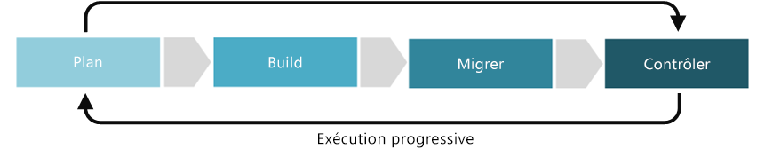

# Amélioration de la discipline Base de référence de la sécuritéSecurity Baseline discipline improvement

La discipline Base de référence de la sécurité se concentre sur l'établissement de stratégies qui protègent le réseau, les ressources et, plus important encore, les données qui résideront sur la solution d'un fournisseur de services cloud.The Security Baseline discipline focuses on ways of establishing policies that protect the network, assets, and most importantly the data that will reside on a Cloud Provider's solution. Parmi les cinq disciplines de la gouvernance cloud, la discipline Base de référence de la sécurité inclut la classification du parc numérique et des données.Within the five disciplines of Cloud Governance, Security Baseline includes classification of the digital estate and data. Elle inclut également la documentation relative aux risques, à la tolérance métier et aux stratégies d'atténuation associées à la sécurité des données, des ressources et du réseau.It also includes documentation of risks, business tolerance, and mitigation strategies associated with the security of the data, assets, and network. D'un point de vue technique, cela englobe également la participation aux décisions concernant le [chiffrement](../../decision-guides/encryption/overview.md), la [configuration réseau requise](../../decision-guides/software-defined-network/overview.md), les [stratégies d'identités hybrides](../../decision-guides/identity/overview.md) et les [processus](compliance-processes.md) utilisés pour développer les stratégies Base de référence de la sécurité du cloud.From a technical perspective, this also includes involvement in decisions regarding [encryption](../../decision-guides/encryption/overview.md), [network requirements](../../decision-guides/software-defined-network/overview.md), [hybrid identity strategies](../../decision-guides/identity/overview.md), and the [processes](compliance-processes.md) used to develop cloud Security Baseline policies.

Cet article décrit certaines tâches potentielles que votre entreprise peut entreprendre pour mieux développer et faire mûrir la discipline de Base de référence de la sécurité.This article outlines some potential tasks your company can engage in to better develop and mature the Security Baseline discipline. Ces tâches peuvent être décomposées en phases de planification, de construction, d'adoption et d'exploitation de l'implémentation d'une solution cloud, qui sont ensuite répétées pour permettre le développement d'une [approche incrémentielle de la gouvernance cloud](../journeys/overview.md#an-incremental-approach-to-cloud-governance).These tasks can be broken down into planning, building, adopting, and operating phases of implementing a cloud solution, which are then iterated on allowing the development of an [incremental approach to cloud governance](../journeys/overview.md#an-incremental-approach-to-cloud-governance).

*Figure 1 : Phases d’adoption de l’approche incrémentielle de la gouvernance cloud.**Figure 1. Adoption phases of the incremental approach to cloud governance.*

Il est impossible pour un même document de prendre en compte les exigences de toutes les organisations.It's impossible for any one document to account for the requirements of all businesses. Par conséquent, cet article présente des exemples d’activités minimales et potentielles suggérés pour chaque phase du processus de maturation de la gouvernance.As such, this article outlines suggested minimum and potential example activities for each phase of the governance maturation process. L'objectif initial de ces activités est de vous aider à créer un [MVP de stratégie](../journeys/overview.md#an-incremental-approach-to-cloud-governance) et à établir une infrastructure pour une évolution de stratégie incrémentielle.The initial objective of these activities is to help you build a [Policy MVP](../journeys/overview.md#an-incremental-approach-to-cloud-governance) and establish a framework for incremental policy evolution. Votre équipe de gouvernance cloud devra décider combien investir dans ces activités pour améliorer vos fonctionnalités de gouvernance de Base de référence de la sécurité.Your Cloud Governance team will need to decide how much to invest in these activities to improve your Security Baseline governance capabilities.

> [!CAUTION]
> Les activités minimales ou potentielles décrites dans cet article ne sont pas alignées sur des stratégies d'entreprise spécifiques ou des exigences de conformité de tiers.Neither the minimum or potential activities outlined in this article are aligned to specific corporate policies or third party compliance requirements. Ces conseils visent à favoriser les échanges qui conduiront à un alignement des deux exigences avec un modèle de gouvernance cloud.This guidance is designed to help facilitate the conversations that will lead to alignment of both requirements with a cloud governance model.

## Planification et préparationPlanning and readiness

Cette phase de maturité de la gouvernance comble le fossé entre les résultats opérationnels et les stratégies concrètes.This phase of governance maturity bridges the divide between business outcomes and actionable strategies. Au cours de ce processus, l’équipe de direction définit des métriques spécifiques, les mappe au patrimoine numérique, et commence à planifier l’effort global de migration.During this process, the leadership team defines specific metrics, maps those metrics to the digital estate, and begins planning the overall migration effort.

**Activités minimales suggérées :****Minimum suggested activities:**

- Évaluez les options de votre [chaîne d'outils Base de référence de la sécurité](toolchain.md).Evaluate your [Security Baseline toolchain](toolchain.md) options.
- Élaborez un brouillon des instructions relatives à l'architecture et distribuez ce document aux principales parties prenantes.Develop a draft Architecture Guidelines document and distribute to key stakeholders.
- Formez et impliquez les personnes et les équipes concernées par le développement des instructions relatives à l'architecture.Educate and involve the people and teams affected by the development of architecture guidelines.
- Ajoutez des tâches de sécurité classées par ordre de priorité à votre backlog de migration.Add prioritized security tasks to your migration backlog.

**Activités potentielles :****Potential activities:**

- Définissez un schéma de classification des données.Define a data classification schema.
- Menez un processus de planification du parc numérique pour dresser l'inventaire des ressources informatiques qui alimentent actuellement vos processus métier et les opérations associées.Conduct a digital estate planning process to inventory the current IT assets powering your business processes and supporting operations.
- Menez une [révision des stratégies](../../governance/policy-compliance/what-is-a-cloud-policy-review.md) pour entamer le processus de modernisation des stratégies de sécurité informatique existantes, et définissez des stratégies MVP pour répondre aux risques connus.Conduct a [policy review](../../governance/policy-compliance/what-is-a-cloud-policy-review.md) to begin the process of modernizing existing corporate IT security policies, and define MVP policies addressing known risks.
- Passez en revue les consignes de sécurité de votre plateforme cloud.Review your cloud platform's security guidelines. Pour Azure, vous les trouverez sur la [Plateforme d'approbation de services Microsoft](https://www.microsoft.com/trustcenter/stp/default.aspx).For Azure these can be found in the [Microsoft Service Trust Platform](https://www.microsoft.com/trustcenter/stp/default.aspx).
- Déterminez si votre stratégie Base de référence de la sécurité inclut un [Cycle de vie de développement de la sécurité](https://www.microsoft.com/securityengineering/sdl/).Determine whether your Security Baseline policy includes a [Security Development Lifecycle](https://www.microsoft.com/securityengineering/sdl/).
- Évaluez les risques métier liés au réseau, aux données et aux ressources en fonction des trois versions suivantes et déterminez la tolérance de votre organisation vis-à-vis de ces risques.Evaluate network, data, and asset-related business risks based on the next one to three releases, and gauge your organization's tolerance for those risks.
- Consultez le rapport Microsoft consacré aux [principales tendances en matière de cybersécurité](https://www.microsoft.com/security/operations/security-intelligence-report) pour obtenir un aperçu du paysage de la sécurité actuel.Review Microsoft's [top trends in cybersecurity](https://www.microsoft.com/security/operations/security-intelligence-report) report to get an overview of the current security landscape.
- Envisagez de développer un rôle [Security DevOps](https://www.microsoft.com/en-us/securityengineering/devsecops) au sein de votre organisation.Consider developing a [Security DevOps](https://www.microsoft.com/en-us/securityengineering/devsecops) role in your organization.

<!-- "en-us" location is required for the URL above. -->

## Génération et prédéploiementBuild and pre-deployment

Un certain nombre de conditions techniques et non techniques sont requises pour migrer un environnement correctement.A number of technical and nontechnical prerequisites are required to successful migrate an environment. Ce processus se concentre sur les décisions, l’état de préparation et l’infrastructure de base qui permettent une migration.This process focuses on the decisions, readiness, and core infrastructure that proceeds a migration.

**Activités minimales suggérées :****Minimum suggested activities:**

- Implémentez votre [chaîne d'outils Base de référence de la sécurité](toolchain.md) en la déployant dans le cadre d'une phase de prédéploiement.Implement your [Security Baseline toolchain](toolchain.md) by rolling out in a pre-deployment phase.
- Mettez à jour les instructions relatives à l'architecture et distribuez le document aux principales parties prenantes.Update the Architecture Guidelines document and distribute to key stakeholders.
- Implémentez des tâches de sécurité sur votre backlog de migration classé par ordre de priorité.Implement security tasks on your prioritized migration backlog.
- Développez une documentation et des ressources pédagogiques, des communications de sensibilisation, des incitations et d'autres programmes afin d'encourager l'adoption par les utilisateurs.Develop educational materials and documentation, awareness communications, incentives, and other programs to help drive user adoption.

**Activités potentielles :****Potential activities:**

- Déterminez la stratégie de [chiffrement](../../decision-guides/encryption/overview.md) de votre organisation pour les données hébergées dans le cloud.Determine your organization's [encryption](../../decision-guides/encryption/overview.md) strategy for cloud-hosted data.
- Évaluez la stratégie d'[identité](../../decision-guides/identity/overview.md) de votre déploiement cloud.Evaluate your cloud deployment's [identity](../../decision-guides/identity/overview.md) strategy. Déterminez comment votre solution d'identité basée sur le cloud coexistera avec les fournisseurs d'identité locaux ou s'intégrera à ceux-ci.Determine how your cloud-based identity solution will coexist or integrate with on-premises identity providers.
- Déterminez les stratégies de délimitation du réseau pour la conception de votre [réseau à définition logicielle](../../decision-guides/software-defined-network/overview.md) afin de bénéficier de capacités de mise en réseau sécurisées et virtualisées.Determine network boundary policies for your [Software Defined Networking (SDN)](../../decision-guides/software-defined-network/overview.md) design to ensure secure virtualized networking capabilities.
- Évaluez les stratégies d'[accès à privilège minimum](/azure/active-directory/users-groups-roles/roles-delegate-by-task) de votre organisation et utilisez des rôles basés sur des tâches pour fournir un accès à des ressources spécifiques.Evaluate your organization's [least privilege access](/azure/active-directory/users-groups-roles/roles-delegate-by-task) policies, and use task-based roles to provide access to specific resources.
- Appliquez des mécanismes de sécurité et de supervision à tous les services cloud et à toutes les machines virtuelles.Apply security and monitoring mechanisms to for all cloud services and virtual machines.
- Si possible, automatisez les [stratégies de sécurité](../../decision-guides/policy-enforcement/overview.md).Automate [security policies](../../decision-guides/policy-enforcement/overview.md) where possible.
- Passez en revue votre stratégie Base de référence de la sécurité et déterminez si vous devez modifier vos plans en fonction des meilleures pratiques, comme celles décrites dans le [Cycle de vie de développement de la sécurité](https://www.microsoft.com/securityengineering/sdl/).Review your Security Baseline policy and determine if you need to modify your plans according to best practices guidance such as those outlined in the [Security Development Lifecycle](https://www.microsoft.com/securityengineering/sdl/).

## Adoption et migrationAdopt and migrate

La migration est un processus incrémentiel qui porte essentiellement sur le déplacement, le test et l’adoption d’applications ou de charges de travail dans un patrimoine numérique.Migration is an incremental process that focuses on the movement, testing, and adoption of applications or workloads in an existing digital estate.

**Activités minimales suggérées :****Minimum suggested activities:**

- Migrez votre [chaîne d'outils Base de référence de la sécurité](toolchain.md) de la phase de prédéploiement vers la phase de production.Migrate your [Security Baseline toolchain](toolchain.md) from pre-deployment to production.
- Mettez à jour les instructions relatives à l'architecture et distribuez le document aux principales parties prenantes.Update the Architecture Guidelines document and distribute to key stakeholders.
- Développez une documentation et des ressources pédagogiques, des communications de sensibilisation, des incitations et d'autres programmes afin d'encourager l'adoption par les utilisateurs.Develop educational materials and documentation, awareness communications, incentives, and other programs to help drive user adoption

**Activités potentielles :****Potential activities:**

- Consultez les dernières informations relatives à la Base de référence de la sécurité et aux menaces pour identifier tout nouveau risque.Review the latest Security Baseline and threat information to identify any new business risks.
- Évaluez la tolérance de votre organisation pour faire face aux nouveaux risques liés à la sécurité.Gauge your organization's tolerance to handle new security risks that may arise.
- Identifiez les écarts par rapport la stratégie et procédez à des corrections.Identify deviations from policy, and enforce corrections.
- Ajustez la sécurité et l'automatisation du contrôle d'accès afin d'assurer une conformité maximale avec la stratégie.Adjust security and access control automation to ensure maximum policy compliance.  
- Vérifiez que les meilleures pratiques définies pendant les phases de génération/prédéploiement sont correctement mises en œuvre.Validate that the best practices defined during the Build / Pre-deployment phases are properly executed.
- Passez en revue vos stratégies d'accès à privilège minimum et ajustez les contrôles d'accès pour optimiser la sécurité.Review your least privilege access policies and adjust access controls to maximize security.
- Testez votre chaîne d'outils Base de référence de la sécurité sur vos charges de travail pour identifier et résoudre les vulnérabilités éventuelles.Test your Security Baseline toolchain against your workloads to identify and resolve any vulnerabilities.

## Exploitation et post-implémentationOperate and post-implementation

Une fois la transformation terminée, la gouvernance et les opérations doivent perdurer tout au long du cycle de vie naturel d’une application ou d’une charge de travail.Once the transformation is complete, governance and operations must live on for the natural lifecycle of an application or workload. Cette phase de maturité de la gouvernance est centrée sur les activités qui interviennent généralement après l’implémentation de la solution et le début de stabilisation du cycle de transformation.This phase of governance maturity focuses on the activities that commonly come after the solution is implemented and the transformation cycle begins to stabilize.

**Activités minimales suggérées :****Minimum suggested activities:**

- Validez et/ou affinez votre [chaîne d'outils Base de référence de la sécurité](toolchain.md).Validate and/or refine your [Security Baseline toolchain](toolchain.md).
- Personnalisez les notifications et les rapports pour vous avertir des problèmes de sécurité potentiels.Customize notifications and reports to alert you of potential security issues.
- Affinez les instructions relatives à l'architecture pour guider les futurs processus d'adoption.Refine the Architecture Guidelines to guide future adoption processes.
- Communiquez avec les équipes concernées et formez-les régulièrement pour vous assurer de leur adhésion continue aux instructions relatives à l'architecture.Communicate and educate the affected teams periodically to ensure ongoing adherence to architecture guidelines.

**Activités potentielles :****Potential activities:**

- Découvrez des modèles et comportements pour vos charges de travail, et configurez vos outils de supervision et de création de rapports de manière à identifier et à vous avertir des activités, accès ou utilisations anormaux des ressources.Discover patterns and behavior for your workloads and configure your monitoring and reporting tools to identify and notify you of any abnormal activity, access, or resource usage.
- Mettez continuellement à jour vos stratégies de supervision et de création de rapports pour détecter les dernières vulnérabilités et attaques.Continuously update your monitoring and reporting policies to detect the latest vulnerabilities, exploits, and attacks.
- Mettez des procédures en place pour arrêter rapidement les accès non autorisés et désactiver les ressources susceptibles d'avoir été compromises par un attaquant.Have procedures in place to quickly stop unauthorized access and disable resources that may have been compromised by an attacker.
- Passez régulièrement en revue les meilleures pratiques de sécurité et, si possible, appliquez les recommandations à votre stratégie de sécurité ainsi qu'à vos fonctionnalités d'automatisation et de supervision.Regularly review the latest security best practices and apply recommendations to your security policy, automation, and monitoring capabilities where possible.

## Étapes suivantesNext steps

Maintenant que vous vous êtes familiarisé avec le concept de gouvernance de la sécurité dans le cloud, découvrez les [consignes de sécurité et les meilleures pratiques fournies par Microsoft](azure-security-guidance.md) pour Azure.Now that you understand the concept of cloud security governance, move on to learn more about [what security and best practices guidance Microsoft provides](azure-security-guidance.md) for Azure.

> [!div class="nextstepaction"]
> [En savoir plus sur les consignes de sécurité relatives à Azure](azure-security-guidance.md)
> [Présentation d'Azure Security](/azure/security/azure-security)
> [En savoir plus sur la journalisation, la création de rapports et la supervision](../../decision-guides/log-and-report/overview.md)[Learn about security guidance for Azure](azure-security-guidance.md)
[Introduction to Azure Security](/azure/security/azure-security)
[Learn about logging, reporting, and monitoring](../../decision-guides/log-and-report/overview.md)
