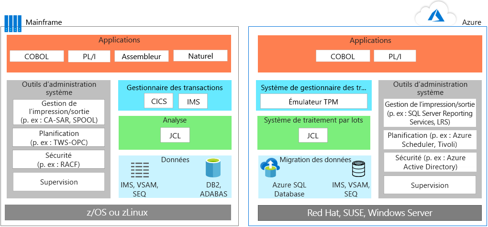
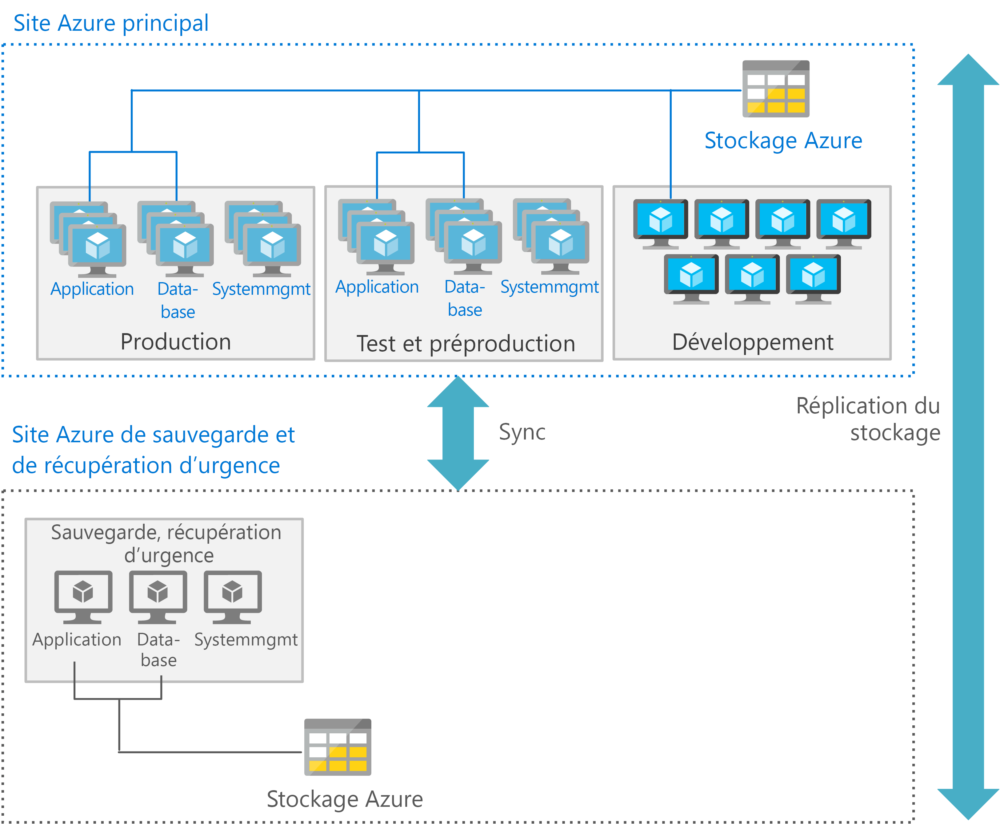

# Migration d’applications d’un environnement mainframeMainframe application migration

Quand elles entreprennent de migrer des applications d’un environnement mainframe vers Azure, la plupart des équipes informatiques adoptent une approche pragmatique : elles réutilisent le maximum de ressources possible, puis elles débutent un déploiement échelonné où certaines applications sont réécrites ou remplacées.When migrating applications from mainframe environments to Azure, most teams follow a pragmatic approach: reuse wherever and whenever possible, and then start a phased deployment where applications are rewritten or replaced.

La migration d’applications engage généralement une ou plusieurs des stratégies suivantes :Application migration typically involves one or more of the following strategies:

- Réhébergement : vous pouvez déplacer le code, les programmes et les applications existants de l’environnement mainframe, et ensuite recompiler le code à exécuter dans un émulateur de mainframe qui est hébergé dans une instance cloud.Rehost: You can move existing code, programs, and applications from the mainframe, and then recompile the code to run in a mainframe emulator hosted in a cloud instance. En règle générale, avec cette approche, vous commencez par déplacer les applications vers un émulateur dans le cloud, puis vous migrez la base de données vers une base de données dans le cloud.This approach typically starts with moving applications to a cloud-based emulator, and then migrating the database to a cloud-based database. Cette approche nécessite certaines opérations d’ingénierie et de refactorisation ainsi que des conversions de données et de fichiers.Some engineering and refactoring are required along with data and file conversions.

    Vous pouvez aussi faire appel à un fournisseur d’hébergement traditionnel.Alternatively, you can rehost using a traditional hosting provider. L’un des avantages majeurs du cloud est l’externalisation de la gestion de l’infrastructure.One of the principal benefits of the cloud is outsourcing infrastructure management. Vous pouvez trouver un fournisseur de centre de données qui hébergera vos charges de travail de mainframe pour vous.You can find a datacenter provider that will host your mainframe workloads for you. Ce modèle peut vous faire gagner du temps, réduire votre dépendance à l’égard des fournisseurs et diminuer vos coûts intermédiaires.This model may buy time, reduce vendor lock in, and produce interim cost savings.

- Mise hors service : toutes les applications devenues inutiles doivent être mises hors service avant la migration.Retire: All applications that are no longer needed should be retired before migration.

- Rebuild : certaines organisations choisissent de réécrire entièrement les programmes à l’aide de techniques modernes.Rebuild: Some organizations choose to completely rewrite programs using modern techniques. Cette approche est moins courante que l’approche « lift-and-shift », car elle s’avère plus chère et plus complexe.Given the added cost and complexity of this approach, it’s not as common as a lift-and-shift approach. Après ce type de migration, il est souvent judicieux de commencer à remplacer des modules et du code en s’aidant de moteurs de transformation de code.Often after this type of migration, it makes sense to begin replacing modules and code using code transformation engines.

- Remplacez : cette approche remplace les fonctionnalités du mainframe par des options équivalentes dans le cloud.Replace: This approach replaces mainframe functionality with equivalent features in the cloud. SaaS (software as a service) est une option disponible : elle utilise une solution créée spécifiquement pour répondre à un besoin de l’entreprise, comme la finance, les ressources humaines, la fabrication ou la planification des ressources métier.Software as a service (SaaS) is one option, which is using a solution created specifically for an enterprise concern, such as finance, human resources, manufacturing, or enterprise resource planning. En outre, il existe maintenant de nombreuses applications métier capables de résoudre des problématiques qui étaient auparavant gérées par des solutions mainframe personnalisées.In addition, many industry-specific apps are now available to solve problems that custom mainframe solutions used to previously solve.

Vous devez commencer par planifier les charges de travail que vous souhaitez migrer en priorité, puis déterminer les prérequis pour déplacer les ressources associées (les applications, les codes base hérités et les bases de données).You should consider starting by planning those workloads that you want to initially migrate, and then determine those requirements for moving associated applications, legacy codebases, and databases.

## Émulation de mainframe dans AzureMainframe emulation in Azure

Les services cloud Azure peuvent émuler des environnements mainframe traditionnels, ce qui vous permet de réutiliser des applications et du code mainframe existants.Azure cloud services can emulate traditional mainframe environments, enabling you to reuse existing mainframe code and applications. Les composants serveur communs que vous pouvez émuler incluent les systèmes de traitement transactionnel en ligne (OLTP), de traitement par lots et d’ingestion des données.Common server components that you can emulate include online transaction processing (OLTP), batch, and data ingestion systems.

### Systèmes OLTPOLTP systems

Beaucoup d’environnements mainframe comprennent des systèmes OLTP qui traitent des milliers ou des millions de mises à jour pour le compte d’innombrables utilisateurs.Many mainframes have OLTP systems that process thousands or millions of updates for huge numbers of users. Ces applications utilisent souvent des logiciels de traitement transactionnel et de gestion des formulaires/de l’écran, tels qu’un système de contrôle des informations client (CICS), un système de gestion des informations (IMS) et un processeur d’interface de terminal (TIP).These applications often use transaction processing and screen-form handling software, such as customer information control system (CICS), information management systes (IMS), and terminal interface processor (TIP).

Quand des applications OLTP sont migrées vers Azure, des émulateurs pour les moniteurs transactionnels (TP) de mainframe peuvent s’exécuter en tant qu’IaaS sur des machines virtuelles Azure.When moving OLTP applications to Azure, emulators for mainframe transaction processing (TP) monitors are available to run as infrastructure as a service (IaaS) using virtual machines (VMs) on Azure. La fonctionnalité de saisie de formulaires et de gestion de l’écran peut également être implémentée par des serveurs web.The screen handling and form functionality can also be implemented by web servers. Il est possible de combiner cette approche avec des API de base de données, comme ADO (ActiveX Data Objects), ODBC (Open Database Connectivity) et JDBC (Java Database Connectivity) pour l’accès aux données et les transactions.This approach can be combined with database APIs, such as ActiveX data object (ADO), open database connectivity (ODBC), and Java database connectivity (JDBC) for data access and transactions.

### Mises à jour par lots avec des contraintes de tempsTime-constrained batch updates

Beaucoup de systèmes mainframe effectuent mensuellement ou annuellement les mises à jour de millions d’enregistrements de compte, en particulier ceux utilisés dans les banques, les compagnies d’assurance et les organismes publics.Many mainframe systems perform monthly or annual updates of millions of account records, such as those used in banking, insurance, and government. Les ordinateurs mainframe gèrent ces types de charges de travail en offrant des systèmes de gestion des données à haut débit.Mainframes handle these types of workloads by offering high-throughput data handling systems. Les traitements par lots sur ces ordinateurs s’effectuent généralement en série par nature et leur performance dépend du débit IOPS (entrées/sorties par seconde) assuré par le mainframe principal.Mainframes batch jobs are typically serial in nature and depend on the input/output operations per second (IOPS) provided by the mainframe backbone for performance.

Les environnements de traitement par lots dans le cloud utilisent le calcul parallèle et des réseaux à haut débit pour améliorer les performances.Cloud-based batch environments use parallel compute and high-speed networks for performance. Azure propose plusieurs options de calcul, de stockage et de mise en réseau qui vous aident à optimiser les performances du traitement par lots.If you need to optimize batch performance, Azure provides various compute, storage, and networking options.

### Systèmes d’ingestion des donnéesData ingestion systems

Les ordinateurs mainframe ingèrent de grandes quantités de données qui leur sont transmises pour traitement par les solutions des services commerciaux, financiers, de fabrication, etc.Mainframes ingest large batches of data from retail, financial services, manufacturing, and other solutions for processing. Avec Azure, vous pouvez utiliser des utilitaires en ligne de commande simples, comme [AzCopy](/azure/storage/common/storage-use-azcopy), pour copier des données vers et depuis l’emplacement de stockage.With Azure, you can use simple command-line utilities such as [AzCopy](/azure/storage/common/storage-use-azcopy) for copying data to and from storage location. Vous pouvez également utiliser le service [Azure Data Factory](/azure/data-factory/introduction), qui ingère des données provenant de magasins de données disparates pour vous permettre de créer et planifier des workflows basés sur des données.You can also use the [Azure Data Factory](/azure/data-factory/introduction) service, enabling you to ingest data from disparate data stores to create and schedule data-driven workflows.

En plus des environnements d’émulation, Azure fournit des services PaaS (platform as a service) et d’analytique qui contribuent à optimiser les environnements mainframe existants.In addition to emulation environments, Azure provides platform as a service (PaaS) and analytics services that can enhance existing mainframe environments.

## Migrer des charges de travail OLTP vers AzureMigrate OLTP workloads to Azure

L’approche « lift-and-shift » est l’option sans code qui vous permet de migrer rapidement des applications existantes vers Azure.The lift-and-shift approach is the no code option for quickly migrating existing applications to Azure. Chaque application est migrée en l’état, ce qui offre les avantages du cloud sans les risques ni les coûts liés aux modifications de code.Each application is migrated as is, which provides the benefits of the cloud without the risks or costs of making code changes. Cette approche est possible quand vous utilisez un émulateur pour les moniteurs TP de mainframe sur Azure.Using an emulator for mainframe transaction processing (TP) monitors on Azure supports this approach.

Les moniteurs TP sont proposés par différents fournisseurs et s’exécutent sur des machines virtuelles, une option IaaS (infrastructure as a service) disponible sur Azure.TP monitors are available from various vendors and run on virtual machines, an infrastructure as a service (IaaS) option on Azure. Les diagrammes suivants avant/après illustrent la migration d’une application en ligne adossée au système SGBD IBM DB2 sur un ordinateur mainframe IBM z/OS.The following before and after diagrams show a migration of an online application backed by IBM DB2, a relational database management system (DBMS), on an IBM z/OS mainframe. Le système DB2 pour z/OS utilise des fichiers VSAM (Virtual Storage Access Method) pour stocker les données et des fichiers plats ISAM (Indexed Sequential Access Method).DB2 for z/OS uses virtual storage access method (VSAM) files to store the data and Indexed Sequential Access Method (ISAM) for flat files. Cette architecture utilise également le système CICS pour la supervision des transactions.This architecture also uses CICS for transaction monitoring.

Sur Azure, les environnements d’émulation sont utilisés pour exécuter le gestionnaire TP et les traitements par lots basés sur JCL.On Azure, emulation environments are used to run the TP manager and the batch jobs that use JCL. Dans la couche Données, DB2 est remplacé par [Azure SQL Database](/azure/sql-database/sql-database-technical-overview), mais il est également possible d’utiliser Microsoft SQL Server, DB2 LUW ou Oracle Database.In the data tier, DB2 is replaced by [Azure SQL Database](/azure/sql-database/sql-database-technical-overview), although Microsoft SQL Server, DB2 LUW, or Oracle Database can also be used. Un émulateur prend en charge IMS, VSAM et SEQ.An emulator supports IMS, VSAM, and SEQ. Les outils de gestion du système mainframe sont remplacés par des services Azure et par des logiciels d’autres fournisseurs, qui s’exécutent sur des machines virtuelles.The mainframe’s system management tools are replaced by Azure services, and software from other vendors, that run in VMs.

La fonctionnalité de saisie de formulaires et de gestion de l’écran est généralement implémentée par des serveurs web, éventuellement combinés avec des API de base de données, comme ADO, ODBC et JDBC pour l’accès aux données et les transactions.The screen handling and form entry functionality is commonly implemented using web servers, which can be combined with database APIs, such as ADO, ODBC, and JDBC for data access and transactions. Le choix exact des composants IaaS Azure à utiliser dépend de votre système d’exploitation.The exact line-up of Azure IaaS components to use depends on the operating system you prefer. Par exemple : For example:

- Machines virtuelles Windows : Internet Information Server (IIS), avec ASP.NET pour la gestion de l’écran et la logique métier.Windows–based VMs: Internet Information Server (IIS) along with ASP.NET for the screen handling and business logic. Utilisez ADO.NET pour les transactions et l’accès aux données.Use ADO.NET for data access and transactions.

- Machines virtuelles Linux : serveurs d’applications basés sur Java, par exemple, Apache Tomcat pour la gestion de l’écran et les fonctionnalités métier basées sur Java.Linux–based VMs: The Java-based application servers that are available, such as Apache Tomcat for screen handling and Java-based business functionality. Utilisez JDBC pour les transactions et l’accès aux données.Use JDBC for data access and transactions.

## Migrer des charges de travail par lots vers AzureMigrate batch workloads to Azure

Les opérations par lots dans Azure diffèrent de l’environnement de traitement par lots classique sur les ordinateurs mainframe.Batch operations in Azure differ from the typical batch environment on mainframes. Les traitements par lots sur ces ordinateurs s’effectuent généralement en série par nature et leur performance dépend du débit IOPS assuré par le mainframe principal.Mainframe batch jobs are typically serial in nature and depend on the IOPS provided by the mainframe backbone for performance. Les environnements de traitement par lots dans le cloud utilisent le calcul parallèle et des réseaux à haut débit pour améliorer les performances.Cloud-based batch environments use parallel computing and high-speed networks for performance.

Pour optimiser les performances des traitements par lots à l’aide d’Azure, vous pouvez utiliser les options de [calcul](/azure/virtual-machines/windows/overview), de [stockage](/azure/storage/blobs/storage-blobs-introduction), de [mise en réseau](https://azure.microsoft.com/blog/maximize-your-vm-s-performance-with-accelerated-networking-now-generally-available-for-both-windows-and-linux/) et de [supervision](/azure/azure-monitor/overview) comme suit.To optimize batch performance using Azure, consider the [compute](/azure/virtual-machines/windows/overview), [storage](/azure/storage/blobs/storage-blobs-introduction), [networking](https://azure.microsoft.com/blog/maximize-your-vm-s-performance-with-accelerated-networking-now-generally-available-for-both-windows-and-linux/), and [monitoring](/azure/azure-monitor/overview) options as follows.

### CalculCompute

Utilisez :Use:

- Utilisez des machines virtuelles avec la fréquence d’horloge la plus élevée.VMs with the highest clock speed. Les applications mainframe sont souvent monothread et les processeurs mainframe ont une fréquence d’horloge très élevée.Mainframe applications are often single-threaded and mainframe CPUs have a very high clock speed.

- Utilisez des machines virtuelles avec une grande capacité de mémoire pour permettre la mise en cache des données et des applications des zones de travail.VMs with large memory capacity to allow caching of data and application work areas.

- Utilisez des machines virtuelles avec des processeurs virtuels à très haute densité pour tirer pleinement parti du traitement multithread, si l’application prend en charge les threads multiples.VMs with higher density vCPUs to take advantage of multi-threaded processing if the application supports multiple threads.

- Utilisez le traitement parallèle (Azure facilite le scale-out pour ce type de traitement) afin d’augmenter la puissance de calcul disponible au moment d’un traitement par lots.Parallel processing, as Azure easily scales out for parallel processing, delivering more compute power for a batch run.

### StockageStorage

Utilisez :Use:

- Utilisez [Azure SSD Premium](/azure/virtual-machines/windows/premium-storage) ou [Azure SSD Ultra](/azure/virtual-machines/windows/disks-ultra-ssd) pour bénéficier d’un débit IOPS maximal.[Azure Premium SSD](/azure/virtual-machines/windows/premium-storage) or [Azure Ultra SSD](/azure/virtual-machines/windows/disks-ultra-ssd) for maximum available IOPS.

- Utilisez l’entrelacement sur plusieurs disques pour augmenter le débit IOPS par taille de stockage.Striping with multiple disks for more IOPS per storage size.

- Partitionnez le stockage afin de répartir les E/S entre plusieurs dispositifs de stockage Azure.Partitioning for storage to spread IO over multiple Azure storage devices.

### Mise en réseauNetworking

- Activez l’[accélération réseau Azure](/azure/virtual-network/create-vm-accelerated-networking-powershell) pour réduire la latence.Use [Azure Accelerated Networking](/azure/virtual-network/create-vm-accelerated-networking-powershell) to minimize latency.

### SurveillanceMonitoring

- Utilisez des outils de supervision, [Azure Monitor](/azure/azure-monitor/overview), [Azure Application Insights](/azure/application-insights/app-insights-overview) et même les journaux Azure afin d’aider les administrateurs à identifier les surcharges de performances liées aux traitements par lots et à éliminer les goulots d’étranglement.Use monitoring tools, [Azure Monitor](/azure/azure-monitor/overview), [Azure Application Insights](/azure/application-insights/app-insights-overview), and even the Azure logs enable administrators to monitor any over performance of batch runs and help eliminate bottlenecks.

## Migrer des environnements de développementMigrate development environments

Les architectures distribuées du cloud s’appuient sur différents ensembles d’outils de développement qui offrent les avantages des pratiques et des langages de programmation modernes.The cloud’s distributed architectures rely on a different set of development tools that provide the advantage of modern practices and programming languages. Pour faciliter cette transition, vous pouvez utiliser un environnement de développement avec d’autres outils conçus pour émuler les environnements IBM z/OS.To ease this transition, you can use a development environment with other tools that are designed to emulate IBM z/OS environments. La liste suivante présente les options proposées par Microsoft et d’autres fournisseurs :The following list shows options from Microsoft and other vendors:

| ComposantComponent        | Options AzureAzure Options                                                                                                                                  |
|------------------|---------------------------------------------------------------------------------------------------------------------------------------------------|
| z/OSz/OS             | Windows, Linux ou UNIXWindows, Linux, or UNIX                                                                                                                      |
| CICSCICS             | Services Azure proposés par Micro Focus, Oracle, GT Software (Fujitsu), TmaxSoft, Raincode et NTT Data, ou réécriture à l’aide de KubernetesAzure services offered by Micro Focus, Oracle, GT Software (Fujitsu), TmaxSoft, Raincode, and NTT Data, or rewrite using Kubernetes |
| IMSIMS              | Services Azure proposés par Micro Focus et OracleAzure services offered by Micro Focus and Oracle                                                                                  |
| AssemblerAssembler        | Services Azure proposés par Raincode et TmaxSoft ; ou COBOL, C ou Java, ou mappage aux fonctions du système d’exploitationAzure services from Raincode and TmaxSoft; or COBOL, C, or Java, or map to operating system functions               |
| JCLJCL              | JCL, PowerShell ou autres outils de scriptJCL, PowerShell, or other scripting tools                                                                                                   |
| COBOLCOBOL            | COBOL, C ou JavaCOBOL, C, or Java                                                                                                                            |
| NaturalNatural          | Naturel, COBOL, C ou JavaNatural, COBOL, C, or Java                                                                                                                  |
| FORTRAN et PL/IFORTRAN and PL/I | FORTRAN, PL/I, COBOL, C ou JavaFORTRAN, PL/I, COBOL, C, or Java                                                                                                           |
| REXX et PL/IREXX and PL/I    | REXX, PowerShell ou autres outils de scriptREXX, PowerShell, or other scripting tools                                                                                                  |

## Migrer des données et des bases de donnéesMigrate databases and data

La migration d’application implique généralement le réhébergement de la couche Données.Application migration usually involves rehosting the data tier. Vous pouvez migrer facilement des bases de données SQL Server, open source et d’autres bases de données relationnelles vers des solutions entièrement managées sur Azure, comme [Azure SQL Database Managed Instance](/azure/sql-database/sql-database-managed-instance), [Azure Database pour PostgreSQL](/azure/postgresql/overview) et [Azure Database pour MySQL](/azure/mysql/overview) avec [Azure Database Migration Service](/azure/dms/dms-overview).You can migrate SQL Server, open-source, and other relational databases to fully-managed solutions on Azure, such as [Azure SQL Database Managed Instance](/azure/sql-database/sql-database-managed-instance), [Azure Database Service for PostgreSQL](/azure/postgresql/overview), and [Azure Database for MySQL](/azure/mysql/overview) with [Azure Database Migration Service](/azure/dms/dms-overview).

Par exemple, vous pouvez effectuer la migration si la couche Données de mainframe utilise :For example, you can migrate if the mainframe data tier uses:

- IBM DB2 ou une base de données IMS. Utilisez Azure SQL Database, SQL Server, DB2 LUW ou Oracle Database sur Azure.IBM DB2 or an IMS database, use Azure SQL database, SQL Server, DB2 LUW, or Oracle Database on Azure.

- Des fichiers VSAM et autres fichiers plats. Utilisez des fichiers plats ISAM (Indexed Sequential Access Method) pour Azure SQL, SQL Server, DB2 LUW ou Oracle.VSAM and other flat files, use Indexed Sequential Access Method (ISAM) flat files for Azure SQL, SQL Server, DB2 LUW, or Oracle.

- Des groupes de données de génération (GDG). Migrez vers des fichiers sur Azure qui utilisent une convention de nommage et des extensions de nom de fichier offrant les mêmes fonctionnalités que les GDG.Generation Date Groups (GDGs), migrate to files on Azure that use a naming convention and filename extensions that provide similar functionality to GDGs.

La couche Données IBM comprend plusieurs composants clés que vous devez également migrer.The IBM data tier includes several key components that you must also migrate. Par exemple, quand vous migrez une base de données, vous migrez en même temps une collection de données stockées dans des pools, chacun d’eux contenant des dbextents, qui sont des jeux de données VSAM z/OS.For example, when you migrate a database, you also migrate a collection of data contained in pools, each containing dbextents, which are z/OS VSAM data sets. Votre migration doit inclure le répertoire qui identifie les emplacements des données dans les pools de stockage.Your migration must include the directory that identifies data locations in the storage pools. De plus, votre plan de migration doit prendre en compte le journal de base de données, qui contient un enregistrement des opérations effectuées sur la base de données.Also, your migration plan must consider the database log, which contains a record of operations performed on the database. Une base de données peut avoir un, deux (double ou autre) ou quatre journaux (doubles et autres).A database can have one, two (dual or alternate), or four (dual and alternate) logs.

La migration de la base de données inclut également les composants ci-dessous :Database migration also includes these components:

- Gestionnaire de base de données : il fournit l’accès aux données dans la base de données.Database manager: Provides access to data in the database. Le gestionnaire de base de données s’exécute dans sa propre partition dans un environnement z/OS.The database manager runs in its own partition in a z/OS environment.

- Demandeur d’applications : il accepte les demandes des applications avant de les passer à un serveur d’applications.Application requester: Accepts requests from applications before passing them to an application server.

- Adaptateur de ressources en ligne : il inclut les composants du demandeur d’applications à utiliser dans les transactions CICS.Online resource adapter: Includes application requester components for use in CICS transactions.

- Adaptateur de ressources par lots : il implémente les composants du demandeur d’applications pour les applications par lots dans z/OS.Batch resource adapter: Implements application requester components for z/OS batch applications.

- Interactive SQL (ISQL) : il s’exécute comme une interface et une application CICS pour permettre aux utilisateurs d’entrer des instructions SQL ou des commandes d’opérateur.Interactive SQL (ISQL): Runs as a CICS application and interface enabling users to enter SQL statements or operator commands.

- Application CICS : elle s’exécute sous le contrôle de CICS, en utilisant les sources de données et les ressources disponibles dans CICS.CICS application: Runs under the control of CICS, using available resources and data sources in CICS.

- Application par lots : elle exécute un processus logique sans communication interactive avec les utilisateurs pour produire des mises à jour de données en bloc ou générer des rapports à partir d’une base de données, par exemple.Batch application: Runs process logic without interactive communication with users to, for example, produce bulk data updates or generate reports from a database.

## Optimiser la mise à l’échelle et le débit pour AzureOptimize scale and throughput for Azure

D’une manière générale, les systèmes mainframe montent en puissance tandis que le cloud monte en charge. Pour optimiser la mise à l’échelle et le débit des applications de style mainframe qui s’exécutent sur Azure, il est important de bien comprendre de quelle façon les systèmes mainframe peuvent séparer et isoler les applications.Generally speaking, mainframes scale up, while the cloud scales out. To optimize scale and throughput of mainframe-style applications running on Azure, it is important that you understand at how mainframes can separate and isolate applications. Un système mainframe z/OS utilise une fonctionnalité de partitions logiques appelée LPAR pour isoler et gérer les ressources dont a besoin une application spécifique sur une instance unique.A z/OS mainframe uses a feature called Logical Partitions (LPARS) to isolate and manage the resources for a specific application on a single instance.

Par exemple, un système mainframe peut utiliser une partition logique (LPAR) pour une région CICS et les programmes COBOL associés, et une partition LPAR séparée pour DB2.For example, a mainframe might use one logical partition (LPAR) for a CICS region with associated COBOL programs, and a separate LPAR for DB2. Des partitions LPAR supplémentaires sont souvent utilisées pour les environnements de développement, de test et de préproduction.Additional LPARs are often used for the development, testing, and staging environments.

Sur Azure, il est plus courant d’utiliser des machines virtuelles séparées à la place.On Azure, it’s more common to use separate VMs to serve this purpose. Une architecture Azure déploie généralement des machines virtuelles pour la couche Application, un groupe séparé de machines virtuelles pour la couche Données, un autre groupe pour le développement, et ainsi de suite.Azure architectures typically deploy VMs for the application tier, a separate set of VMs for the data tier, another set for development, and so on. Chaque niveau de traitement peut alors être optimisé en déployant le type de machines virtuelles et de fonctionnalités le plus adapté à l’environnement existant.Each tier of processing can be optimized using the most suitable type of VMs and  features for that environment.

De plus, chaque niveau peut fournir des services de reprise d’activité après sinistre.In addition, each tier can also provide appropriate disaster recovery services. Par exemple, les machines virtuelles de base de données et de production peuvent nécessiter une reprise d’activité à chaud, alors que les machines virtuelles de développement et de test prennent en charge une reprise d’activité à froid.For example, production and database VMs might require a hot or warm recovery, while the development and testing VMs support a cold recovery.

La figure suivante illustre un déploiement Azure possible avec un site principal et un site secondaire.The following figure shows a possible Azure deployment using a primary and a secondary site. Dans le site principal, les machines virtuelles de test, de préproduction et de production sont déployées avec une haute disponibilité.In the primary site, the production, preproduction, and testing VMs are deployed with high availability. Le site secondaire est utilisé pour la sauvegarde et pour la reprise d’activité après sinistre.The secondary site is for backup and disaster recovery.

## Effectuer une migration intermédiaire de l’ordinateur mainframe vers AzurePerform a staged mainframe to Azure

Le processus de déplacement des solutions d’un ordinateur mainframe vers Azure peut comprendre une migration *intermédiaire*, qui consiste à déplacer certaines applications en priorité et à conserver les applications restantes sur l’ordinateur mainframe de façon temporaire ou permanente.Moving solutions from a mainframe to Azure may involve a *staged* migration, whereby some applications are moved first, and others remain on the mainframe temporarily or permanently. Cette approche nécessite généralement des systèmes qui permettent aux applications et aux bases de données d’interagir entre l’ordinateur mainframe et Azure.This approach typically requires systems that allow applications and databases to interoperate between the mainframe and Azure.

Un scénario courant consiste à déplacer une application vers Azure, mais en conservant sur l’ordinateur mainframe toutes les données dont a besoin l’application.A common scenario is to move an application to Azure while keeping the data used by the application on the mainframe. Un logiciel spécifique est utilisé pour que les applications sur Azure puissent accéder aux données à partir de l’ordinateur mainframe.Specific software is used to enable the applications on Azure to access data from the mainframe. Heureusement, il existe un large éventail de solutions qui permettent l’intégration entre Azure et les environnements mainframe existants, la prise en charge de scénarios hybrides et la migration progressive.Fortunately, a wide range of solutions provide integration between Azure and existing mainframe environments, support for hybrid scenarios, and migration over time. Les partenaires Microsoft, les éditeurs de logiciels indépendants et les intégrateurs système peuvent vous aider dans votre démarche.Microsoft partners, independent software vendors, and system integrators can help you on your journey.

[Microsoft Host Integration Server](/host-integration-server) (HIS) est l’une des solutions disponibles. Elle fournit l’architecture de base de données relationnelle distribuée (DRDA) requise par les applications dans Azure pour accéder aux données dans DB2 conservées sur l’ordinateur mainframe.One option is [Microsoft Host Integration Server](/host-integration-server) (HIS), a solution that provides the distributed relational database architecture (DRDA) required for applications in Azure to access data in DB2 that remains on the mainframe. Il existe d’autres options pour l’intégration entre les environnements mainframe et Azure, parmi lesquelles les solutions fournies par IBM, Attunity et Codit, entre autres, ainsi que des solutions open source.Other options for mainframe-to-Azure integration include solutions from IBM, Attunity, Codit, other vendors, and open source options.

## Solutions de partenairesPartner solutions

Si vous envisagez d’effectuer une migration de mainframe, le réseau de partenaires est là pour vous aider.If you are considering a mainframe migration, the partner ecosystem is available to assist you.

Azure fournit une infrastructure fiable, hautement disponible et évolutive pour les systèmes qui s’exécutent sur des ordinateurs mainframe.Azure provides a proven, highly available, and scalable infrastructure for systems that currently run on mainframes. Certaines charges de travail peuvent être migrées assez facilement.Some workloads can be migrated with relative ease. D’autres charges de travail qui dépendent de logiciels système hérités, tels que CICS et IMS, peuvent être réhébergées à l’aide de solutions de partenaires, en attendant d’être migrées progressivement vers Azure.Other workloads that depend on legacy system software, such as CICS and IMS, can be rehosted using partner solutions and migrated to Azure over time. Quel que soit votre choix, Microsoft et ses partenaires sont à votre disposition pour vous aider à optimiser votre environnement pour Azure tout en maintenant le même niveau de fonctionnalités logicielles de votre système mainframe existant.Regardless of the choice you make, Microsoft and our partners are available to assist you in optimizing for Azure while maintaining mainframe system software functionality.

Pour obtenir des conseils détaillés sur le choix d’une solution de partenaire, consultez [Platform Modernization Alliance](https://www.platformmodernization.org/pages/mainframe.aspx).For detailed guidance about choosing a partner solution, refer to the [Platform Modernization Alliance](https://www.platformmodernization.org/pages/mainframe.aspx).

## En savoir plusLearn more

Pour plus d’informations, consultez les ressources suivantes :For more information, see the following resources:

- [Prise en main d’AzureGet started with Azure](/azure)

- [Platform Modernization Alliance : Migration d’ordinateurs mainframePlatform Modernization Alliance: Mainframe migration](https://www.platformmodernization.org/pages/mainframe.aspx)

- [Déployer IBM DB2 pureScale sur AzureDeploy IBM DB2 pureScale on Azure](https://azure.microsoft.com/resources/deploy-ibm-db2-purescale-on-azure)

- [Documentation Host Integration Server (HIS)Host Integration Server (HIS) documentation](/host-integration-server)
