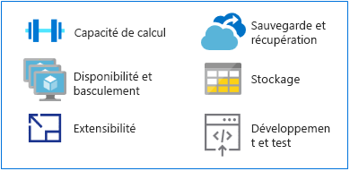

# Assurer la transition d’ordinateurs mainframe vers AzureMake the switch from mainframes to Azure

Plateforme alternative permettant l’exécution d’applications mainframe classiques, Azure offre des capacités de stockage et de calcul hyperscale dans un environnement à haute disponibilité.As an alternative platform for running traditional mainframe applications, Azure offers hyperscale compute and storage in a high availability environment. Vous bénéficiez de la valeur et de l’agilité d’une plateforme cloud moderne sans les coûts associés à un environnement mainframe.You get the value and agility of a modern, cloud-based platform without the costs associated with a mainframe environment.

Cette section fournit des recommandations techniques pour assurer la transition d’une plateforme mainframe vers Azure.This section provides technical guidance for making the switch from a mainframe platform to Azure.

## MIPS contre processeurs virtuelsMIPS vs. vCPUs

Il n’existe pas de formule de mappage universelle qui permette de déterminer le nombre de processeurs virtuels nécessaires pour exécuter des charges de travail mainframe.There is no universal mapping formula that exists for determining the amount of virtual central processing units (vCPUs) needed to run mainframe workloads. Cependant, la métrique MIPS (million d’instructions par seconde) est souvent mappée en processeurs virtuels sur Azure.However, the metric of a million instructions per second (MIPS) is often mapped to vCPUs on Azure. La métrique MIPS mesure la puissance de calcul globale d’un ordinateur mainframe en fournissant une valeur constante du nombre de cycles par seconde pour une machine donnée.MIPS measures the overall compute power of a mainframe by providing a constant value of the number of cycles per second for a given machine.

Si les besoins d’une petite organisation peuvent être inférieurs à 500 MIPS, une grande organisation aura généralement besoin de plus de 5 000 MIPS.A small organization might require less than 500 MIPS, while a large organization typically uses more than 5,000 MIPS. Si l’on considère qu’un MIPS coûte 1 000 dollars, une grande organisation devra donc dépenser environ 5 millions de dollars par an pour déployer une infrastructure de 5 000 MIPS.At $1,000 per single MIPS, a large organization spends approximately $5 million annually to deploy a 5,000-MIPS infrastructure. Le coût estimé annuel d’un déploiement Azure type de cette envergure représente environ un dixième du coût d’une infrastructure MIPS.The annual cost estimate for a typical Azure deployment of this scale is approximately one-tenth the cost of a MIPS infrastructure. Pour plus de détails, consultez le tableau 4 du livre blanc intitulé [Demystifying Mainframe-to-Azure Migration](https://azure.microsoft.com/resources/demystifying-mainframe-to-azure-migration).For details, see Table 4 in the [Demystifying Mainframe-to-Azure Migration](https://azure.microsoft.com/resources/demystifying-mainframe-to-azure-migration) white paper.

Un calcul précis des MIPS ramené en nombre de processeurs virtuels avec Azure dépend du type de processeur virtuel et de la charge de travail que vous exécutez.An accurate calculation of MIPS to vCPUs with Azure depends on the type of vCPU and the exact workload you are running. Cependant, certaines études comparatives constituent une bonne base pour estimer le nombre et le type de processeurs virtuels dont vous aurez besoin.However, benchmark studies provide a good basis for estimating the number and type of vCPUs you will need. Dernièrement, un [benchmark HPE zREF](https://h20195.www2.hpe.com/v2/getpdf.aspx/4aa4-2452enw.pdf) a livré les estimations suivantes :A recent [HPE zREF benchmark](https://h20195.www2.hpe.com/v2/getpdf.aspx/4aa4-2452enw.pdf) provides the following estimates:

- 288 MIPS par cœur Intel s’exécutant sur des serveurs HP Proliant pour des travaux (CICS) en ligne.288 MIPS per Intel-based core running on HP Proliant servers for online (CICS) jobs.

- 170 MIPS par cœur Intel pour des programmes de traitement par lots COBOL.170 MIPS per Intel core for COBOL batch jobs.

Ce guide donne une estimation de 200 MIPS par processeur virtuel pour le traitement en ligne et de 100 MIPS par processeur virtuel pour le traitement par lots.This guide estimates 200 MIPS per vCPU for online processing and 100 MIPS per vCPU for batch processing.

> [!NOTE]
> Ces estimations sont susceptibles d’évoluer à mesure que de nouvelles séries de machines virtuelles sont mises à disposition dans Azure.These estimates are subject to change as new virtual machine (VM) series become available in Azure.

## Haute disponibilité et basculementHigh availability and failover

Les systèmes mainframe offrent souvent un taux de disponibilité à cinq 9 (99,999 %) quand le couplage mainframe et Parallel Sysplex sont utilisés.Mainframe systems often offer five 9s availability (99.999 percent) when mainframe coupling and Parallel Sysplex are used. Pourtant, les opérateurs système ont toujours besoin de prévoir des temps d’arrêt pour la maintenance et les chargements de programmes initiaux.Yet system operators still need to schedule downtime for maintenance and initial program loads (IPLs). Le taux de disponibilité réel est proche de deux ou trois 9, à l’égal des serveurs Intel haut de gamme.The actual availability approaches two or three 9s, on par with high end, Intel-based servers.

Par comparaison, Azure s’engage à travers des contrats de niveau de service (SLA) sur une disponibilité par défaut à plusieurs 9, optimisée par la réplication locale ou géographique des services.By comparison, Azure offers commitment-based service level agreements (SLAs), where multiple 9s availability is the default, optimized with local or geo-based replication of services.

Azure offre des garanties de disponibilité supplémentaires en répliquant les données à partir de plusieurs dispositifs de stockage, que ce soit localement ou dans d’autres régions géographiques.Azure provides additional availability by replicating data from multiple storage devices, either locally or in other geographic regions. En cas de défaillance sur Azure, les ressources de calcul peuvent accéder aux données répliquées au niveau local ou régional.In the event of an Azure-based failure, compute resources can access the replicated data on either the local or regional level.

Si vous utilisez des ressources PaaS (« platform as a service ») Azure, comme [Azure SQL Database](/azure/sql-database/sql-database-technical-overview) et [Azure Cosmos Database](/azure/cosmos-db/introduction), Azure peut gérer automatiquement les basculements.When you use Azure platform as a service (PaaS) resources, such as [Azure SQL Database](/azure/sql-database/sql-database-technical-overview) and [Azure Cosmos Database](/azure/cosmos-db/introduction), Azure can automatically handle failovers. Si vous utilisez Azure IaaS (infrastructure as a service), le basculement s’appuie sur des fonctionnalités système spécifiques, comme les fonctionnalités SQL Server AlwaysOn, des instances de clustering de basculement et des groupes de disponibilité.When you use Azure infrastructure as a service (IaaS), failover relies on specific system functionality, such as SQL Server AlwaysOn features, failover clustering instances, and availability groups.

## ScalabilitéScalability

En règle générale, les ordinateurs mainframe procèdent à un scale-up, tandis que les environnements cloud procèdent à un scale-out. Le scale-out des ordinateurs mainframe est possible moyennant une fonctionnalité de couplage, mais les coûts élevés en matériel et stockage font du scale-out une opération très onéreuse sur un ordinateur mainframe.Mainframes typically scale up, while cloud environments scale out. Mainframes can scale out with the use of a coupling facility (CF), but the high costs of hardware and storage makes mainframes very expensive to scale out.

De plus, une fonctionnalité de couplage effectue un calcul fortement couplé, alors que les fonctionnalités de scale-out d’Azure le sont faiblement.In addition, a CF offers tightly coupled compute, whereas the scale-out features of Azure are loosely coupled. Le cloud peut procéder à un scale-up ou un scale-down pour répondre aux besoins spécifiques des utilisateurs. La puissance de calcul, le stockage et les services sont alors mis à l’échelle à la demande selon un modèle de facturation basée sur l’utilisation.The cloud can scale up or down to match exact user specifications, with compute power, storage, and services scaling on demand under a usage-based billing model.

## Sauvegarde et récupérationBackup and recovery

Les clients dotés d’un ordinateur mainframe gèrent généralement des sites de récupération d’urgence ou font appel à un fournisseur de services mainframe indépendant pour les situations d’urgence.Mainframe customers typically maintain disaster recovery sites or make use or an independent mainframe provider for disaster contingencies. La synchronisation avec un site de récupération d’urgence s’effectue habituellement via des copies de données hors connexion.Synchronization with a disaster recovery site is usually done through offline copies of data. Dans les deux cas, les coûts sont élevés.Both options incur high costs.

Quoique très coûteuse, la géoredondance automatisée est aussi disponible via la fonctionnalité de couplage mainframe. Elle est généralement réservée aux systèmes stratégiques.Automated geo-redundancy is also available through the mainframe coupling facility, albeit at great expense, and is usually reserved for mission-critical systems. En revanche, Azure propose des options de [sauvegarde](/azure/backup/backup-introduction-to-azure-backup), de [récupération](/azure/site-recovery/site-recovery-overview) et de [redondance](/azure/storage/common/storage-redundancy) économiques et faciles à implémenter au niveau local ou régional ou via la géoredondance.In contrast, Azure has easy-to-implement and cost-effective options for [backup](/azure/backup/backup-introduction-to-azure-backup), [recovery](/azure/site-recovery/site-recovery-overview), and [redundancy](/azure/storage/common/storage-redundancy) at local or regional levels, or via geo-redundancy.

## StockageStorage

Pour bien comprendre le fonctionnement des ordinateurs mainframe, il convient de démêler plusieurs termes qui se chevauchent.Part of understanding how mainframes work involves decoding various overlapping terms. Par exemple, le stockage central, la mémoire réelle, le stockage réel et le stockage principal renvoient tous à un dispositif de stockage relié directement au processeur mainframe.For example, central storage, real memory, real storage, and main storage all generally refer to storage attached directly to the mainframe processor.

Le matériel mainframe se compose de processeurs et de bien d’autres dispositifs, notamment des dispositifs de stockage à accès direct (DASD), des lecteurs de bande magnétique et plusieurs types de consoles utilisateur.Mainframe hardware includes processors and many other devices, such as direct access storage devices (DASDs), magnetic tape drives, and several types of user consoles. Les bandes et les dispositifs DASD sont utilisés par les fonctions système et les programmes utilisateur.Tapes and DASDs are used for system functions and by user programs.

Il existe différents types de dispositif de stockage physique pour les ordinateurs mainframe, à savoir :Types of physical storage for mainframes include:

- Stockage central : situé directement sur le processeur mainframe, il est aussi connu sous le nom de processeur ou de stockage réel.Central storage: Located directly on the mainframe processor, this is also known as processor or real storage.

- Stockage auxiliaire : indépendant de l’ordinateur mainframe, ce type de stockage englobe le stockage sur dispositif DASD et est également appelé stockage de pagination.Auxiliary storage: Located separately from the mainframe, this type includes storage on DASDs and is also known as paging storage.

Le cloud offre tout un choix d’options flexibles et scalables, et vous ne paierez que les options dont vous avez besoin.The cloud offers a range of flexible, scalable options, and you will pay only for those options that you need. [Stockage Azure](/azure/storage/common/storage-introduction) offre un magasin d’objets hautement scalable pour les objets de données, un service de système de fichiers pour le cloud, un magasin de messagerie fiable et un magasin NoSQL.[Azure Storage](/azure/storage/common/storage-introduction) offers a massively scalable object store for data objects, a file system service for the cloud, a reliable messaging store, and a NoSQL store. Les machines virtuelles bénéficient d’un stockage sur disque sécurisé et persistant grâce à des disques managés et non managés.For VMs, managed and unmanaged disks provide persistent, secure disk storage.

## Développement et test sur ordinateur mainframeMainframe development and testing

L’un des principaux éléments moteurs des projets de migration d’ordinateur mainframe est l’aspect changeant du développement d’applications.A major driver in mainframe migration projects is the changing face of application development. Les organisations souhaitent un environnement de développement plus agile et plus réactif aux besoins métier.Organizations want their development environment to be more agile and responsive to business needs.

En général, les ordinateurs mainframe disposent de partitions logiques distinctes (LPAR) pour le développement et le test, par exemple QA et LPAR intermédiaires.Mainframes typically have separate logical partitions (LPARs) for development and testing, such as QA and staging LPARs. Les solutions de développement mainframe se composent de compilateurs (COBOL, PL/I, Assembler) et d’éditeurs.Mainframe development solutions include compilers (COBOL, PL/I, Assembler) and editors. La solution la plus répandue est ISPF (Interactive System Productivity Facility). Elle est conçue pour le système d’exploitation z/OS qui s’exécute sur des ordinateurs mainframe IBM.The most common is the Interactive System Productivity Facility (ISPF) for the z/OS operating system that runs on IBM mainframes. On peut également citer RPF (ROSCOE Programming Facility) et les outils Computer Associates que sont CA Librarian et CA-Panvalet.Others include ROSCOE Programming Facility (RPF) and Computer Associates tools, such as CA Librarian and CA-Panvalet.

Sachant qu’il existe des compilateurs et des environnements d’émulation pour les plateformes x86, le développement et le test font le plus souvent partie des premières charges de travail à être migrées d’un ordinateur mainframe vers Azure.Emulation environments and compilers are available on x86 platforms, so development and testing can typically be among the first workloads to migrate from a mainframe to Azure. La disponibilité et l’utilisation généralisée d’[outils DevOps dans Azure](https://azure.microsoft.com/solutions/devops/) ont pour effet d’accélérer la migration des environnements de développement et de test.The availability and widespread use of [DevOps tools in Azure](https://azure.microsoft.com/solutions/devops/) is accelerating the migration of development and testing environments.

Dès que vous aurez développé et testé une solution sur Azure et qu’elle sera prête à être déployée sur l’ordinateur mainframe, vous devrez copier le code sur l’ordinateur mainframe et le compiler sur ce dernier.When solutions are developed and tested on Azure and are ready for deployment to the mainframe, you will need to copy the code to the mainframe and compile it there.

## Étapes suivantesNext steps

> [!div class="nextstepaction"]
> [Migration d’applications mainframeMainframe application migration](application-strategies.md)
