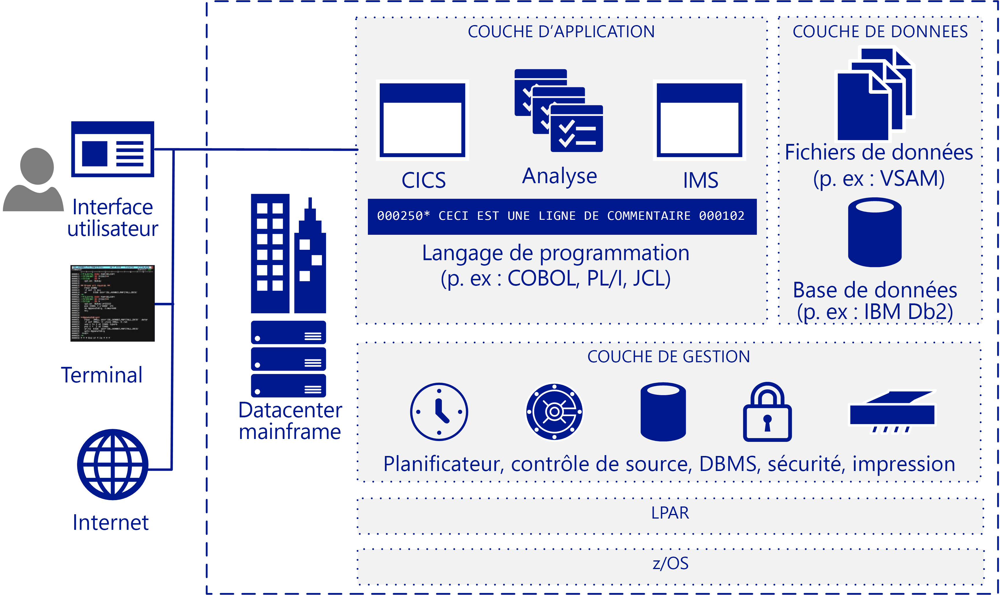

# Vue d’ensemble de la migration d’ordinateurs mainframeMainframe migration overview

De nombreuses entreprises et organisations ont beaucoup à gagner lorsqu’elles migrent tout ou partie de leurs charges de travail, applications et bases de données mainframe vers le cloud.Many companies and organizations benefit from moving some or all their mainframe workloads, applications, and databases to the cloud. Azure offre des fonctionnalités de type mainframe à l’échelle du cloud, sans les inconvénients des ordinateurs mainframe.Azure provides mainframe-like features at cloud scale without many of the drawbacks associated with mainframes.

En général, le terme mainframe désigne un système informatique volumineux, mais la majorité des ordinateurs mainframe actuellement déployés sont des serveurs IBM System Z ou des systèmes IBM compatibles avec les connecteurs et exécutant MVS, DOS, VSE, OS/390 ou z/OS.The term mainframe generally refers to a large computer system, but the vast majority currently of mainframes deployed are IBM System Z servers or IBM plug-compatible systems running MVS, DOS, VSE, OS/390, or z/OS. Les systèmes mainframe sont toujours utilisés dans de nombreux secteurs d’activité afin d’exécuter des systèmes d’informations vitales. Ils ont leur place dans des scénarios très spécifiques, tels que les grands environnements informatiques intensifs traitant des volumes transactionnels élevés.Mainframe systems continue to be used in many industries to run vital information systems, and they have a place in highly-specific scenarios, such as large, high-volume, transaction intensive IT environments.

La migration vers le cloud permet aux entreprises de moderniser leur infrastructure.Migrating to the cloud enables companies to modernize their infrastructure. Avec les services cloud, vous pouvez proposer des applications mainframe, et la valeur qu’elles offrent, sous forme de charge de travail dès que votre organisation en a besoin.With cloud services you can make mainframe applications, and the value that they provide, available as a workload whenever your organization needs it. De nombreuses charges de travail peuvent être transférées vers Azure suite à quelques modifications mineures du code (mettre à jour le nom des bases de données, par exemple).Many workloads can be transferred to Azure with only minor code changes, such as updating the names of databases. Vous pouvez migrer des charges de travail plus complexes à l’aide d’une approche en phases.You can migrate more complex workloads using a phased approach.

La plupart des entreprises classées au Fortune 500 exécutent déjà leurs charges de travail critiques sur Azure.Most Fortune 500 companies are already running Azure for their critical workloads. Les avantages financiers significatifs qu’offre Azure motivent de nombreux projets de migration.Azure's significant bottom-line incentives motivate many migration projects. En général, les entreprises commencent par migrer les charges de travail de développement et de test vers Azure, puis enchaînent avec les services DevOps, la messagerie et la récupération d’urgence en tant que service.Companies typically move development and test workloads to Azure first, followed by DevOps, email, and disaster recovery as a service.

## Public concernéIntended audience

Ce guide s’adresse à vous si vous envisagez une migration ou l’ajout de services cloud optionnels à votre environnement informatique.If you’re considering a migration or the addition of cloud services as an option for your IT environment, this guide is for you.

Ces conseils aident les organisations informatiques à se lancer dans la conversation de migration.This guidance helps IT organizations start the migration conversation. Il se peut que vous connaissiez mieux Azure et les infrastructures basées sur le cloud que les ordinateurs mainframe. Ce guide commence donc par présenter le fonctionnement des ordinateurs mainframe avant d’aborder les différentes stratégies permettant d’identifier les éléments à migrer et les étapes de migration.You may be more familiar with Azure and cloud-based infrastructures than you are with mainframes, so this guide starts with an overview of how mainframes work, and continues with various strategies for determining what and how to migrate.

## Architecture mainframeMainframe architecture

Les ordinateurs mainframe ont été conçus à la fin des années 1950 en tant que serveurs de montée en puissance pour exécuter un grand nombre de transactions en ligne et le traitement par lots.In the late 1950s, mainframes were designed as scale-up servers to run high-volume online transactions and batch processing. C’est pourquoi les ordinateurs mainframe disposent de logiciels pour les formulaires de transactions en ligne (parfois appelées les écrans verts) et de systèmes d’entrée/sortie hautes performances pour traiter des lots.Because of this, mainframes have software for online transaction forms (sometimes called green screens) and high-performance I/O systems for processing batch runs.

Les ordinateurs mainframe ont la réputation d’être extrêmement fiables et disponibles, et sont connus pour leur capacité à exécuter des transactions en ligne et des traitements par lots très volumineux.Mainframes have a reputation for high reliability and availability, and are known for their ability to run huge online transactions and batch jobs. Une transaction provient d’un élément de traitement initié par une demande unique, généralement générée par un utilisateur sur un terminal.A transaction results from a piece of processing initiated by a single request, typically from a user at a terminal. Les transactions peuvent également provenir de plusieurs sources, y compris des pages web, des stations de travail à distance et des applications dans d’autres systèmes d’information.Transactions can also come from multiple other sources, including web pages, remote workstations, and applications from other information systems. Une transaction peut également être déclenchée automatiquement à une heure donnée, comme le montre l’illustration suivante.A transaction can also be triggered automatically at a predefined time as the following figure shows.

Une architecture mainframe IBM classique inclut généralement ces composants :A typical IBM mainframe architecture includes these common components:

- **Systèmes frontaux :** Les utilisateurs peuvent initier des transactions à partir de terminaux, de pages web ou de stations de travail à distance.**Front-end systems:** Users can initiate transactions from terminals, web pages, or remote workstations. Les applications mainframe affichent souvent des interfaces utilisateur personnalisées qui peuvent être conservées après la migration vers Azure.Mainframe applications often have custom user interfaces that can be preserved after migration to Azure. Les émulateurs de terminaux sont toujours utilisés pour accéder aux applications mainframe. Ils sont également appelés des terminaux à écran vert.Terminal emulators are still used to access mainframe applications, and are also called green-screen terminals.

- **Couche Application :** Les ordinateurs mainframe incluent généralement un système de contrôle des informations client (CICS), une suite de gestion des transactions majeure pour ordinateurs mainframe IBM z/OS (souvent utilisée avec IBM Information Management System, IMS) et un gestionnaire de transactions utilisant les messages.**Application tier:** Mainframes typically include a customer information control system (CICS), a leading transaction management suite for the IBM z/OS mainframe that is often used with IBM Information Management System (IMS), a message-based transaction manager. Les systèmes de traitement par lots gèrent les mises à jour de données à débit élevé pour de gros volumes d’enregistrements de compte.Batch systems handle high-throughput data updates for large volumes of account records.

- **Code :** Les langages de programmation utilisés par les ordinateurs mainframe incluent COBOL, Fortran, PL/I et Natural.**Code:** Programming languages used by mainframes include COBOL, Fortran, PL/I, and Natural. Job control language (JCL) est utilisé pour travailler avec z/OS.Job control language (JCL) is used to work with z/OS.

- **Couche Base de données :** Le système de gestion de base de données relationnelle (SGBDR) courant pour z/OS est IBM DD2.**Database tier:** A common relational database management system (DBMS) for z/OS is IBM DD2. Il gère des structures de données appelées *dbspaces*, qui contiennent une ou plusieurs tables et sont affectées à des pools de stockage d’ensembles de données physiques appelés *dbextents*.It manages data structures called *dbspaces* that contain one or more tables and are assigned to storage pools of physical data sets called *dbextents*. Il existe deux composants majeurs des bases de données : le répertoire qui identifie les emplacements des données dans les pools de stockage et le journal qui contient un enregistrement des opérations effectuées sur la base de données.Two important database components are the directory that identifies data locations in the storage pools, and the log that contains a record of operations performed on the database. Différents formats de fichiers plats sont pris en charge pour les données.Various flat-file data formats are supported. Le système DB2 pour z/OS utilise généralement des jeux de données avec la méthode VSAM (Virtual Storage Access Method) pour stocker les données.DB2 for z/OS typically uses virtual storage access method (VSAM) datasets to store the data.

- **Niveau Gestion :** Les ordinateurs mainframe IBM comportent des logiciels de planification tels que TWS-OPC, des outils de gestion des impressions et des sorties (comme CA-SAR et SPOOL) et un système de contrôle du code source.**Management tier:** IBM mainframes include scheduling software such as TWS-OPC, tools for print and output management such as CA-SAR and SPOOL, and a source control system for code. Le contrôle des accès sécurisé pour z/OS est géré par la fonctionnalité de contrôle des accès aux ressources (RACF).Secure access control for z/OS is handled by resource access control facility (RACF). Un gestionnaire de bases de données fournit l’accès aux données dans la base de données et s’exécute dans sa propre partition dans un environnement z/OS.A database manager provides access to data in the database and runs in its own partition in a z/OS environment.

- **Partition logique (LPAR) :** Les partitions logiques (LPAR) sont utilisées pour diviser les ressources de calcul.**LPAR:** Logical partitions, or LPARs, are used to divide compute resources. Un ordinateur mainframe physique est divisé en plusieurs partitions logiques.A physical mainframe is partitioned into multiple LPARs.

- **z/OS :** Un système d’exploitation 64 bits est couramment utilisé pour les ordinateurs mainframe IBM.**z/OS:** A 64-bit operating system that is most commonly used for IBM mainframes.

Les systèmes IBM utilisent un moniteur transactionnel (comme CICS) pour effectuer le suivi de tous les aspects des transactions commerciales et les gérer.IBM systems use a transaction monitor such as CICS to track and manage all aspects of a business transaction. CICS gère le partage des ressources, l’intégrité des données et les priorités d’exécution.CICS manages the sharing of resources, the integrity of data, and prioritization of execution. CICS autorise les utilisateurs, alloue les ressources et transmet les requêtes de base de données issues de l’application vers un gestionnaire de bases de données comme IBM DB2.CICS authorizes users, allocates resources, and passes database requests by the application to a database manager, such as IBM DB2.

Pour une configuration plus précise, CICS est couramment utilisé avec IMS/TM (anciennement IMS/Data Communications ou IMS/DC).For more precise tuning, CICS is commonly used with IMS/TM (formerly IMS/Data Communications or IMS/DC). IMS a été conçu pour réduire la redondance des données en conservant une copie unique des données.IMS was designed to reduce data redundancy by maintaining a single copy of the data. Cet outil jour le rôle de moniteur transactionnel dans CICS en maintenant un état tout au long du processus et en enregistrant des fonctions d’entreprise dans un magasin de données.It complements CICS as a transaction monitor by maintaining state throughout the process and recording business functions in a data store.

## Opérations mainframeMainframe operations

Voici quelques opérations mainframe classiques :The following are typical mainframe operations:

- **En ligne :** Les charges de travail incluent le traitement transactionnel, la gestion des bases de données et les connexions.**Online:** Workloads include transaction processing, database management, and connections. Elles sont souvent implémentées à l’aide d’IBM DB2, de CICS et des connecteurs z/OS.They are often implemented using IBM DB2, CICS, and z/OS connectors.

- **Par lots :** Les travaux sont exécutés sans intervention de l’utilisateur, et suivent généralement des intervalles réguliers (chaque matin, par exemple).**Batch:** Jobs run without user interaction, typically on a regular schedule such as every weekday morning. Les traitements par lots peuvent être exécutés sur des systèmes Windows ou Linux à l’aide d’un émulateur JCL, tels les logiciels Micro Focus Enterprise Server ou BMC Control-M.Batch jobs can be run on systems based on Windows or Linux by using a JCL emulator such as Micro Focus Enterprise Server or BMC Control-M software.

- **Job control language (JCL) :** JCL spécifie les ressources nécessaires pour traiter des tâches par lots.**Job control language (JCL):** Specify resources needed to process batch jobs. JCL communique ces informations à z/OS via un ensemble d’instructions de contrôle du travail.JCL conveys this information to z/OS through a set of job control statements. Le langage JCL de base contient six instructions types : JOB, ASSGN, DLBL, EXTENT, LIBDEF et EXEC.Basic JCL contains six types of statements: JOB, ASSGN, DLBL, EXTENT, LIBDEF, and EXEC. Un travail peut contenir plusieurs instructions EXEC (étapes), et chaque étape peut contenir plusieurs instructions LIBDEF, ASSGN, DLBL et EXTENT.A job can contain several EXEC statements (steps), and each step could have several LIBDEF, ASSGN, DLBL, and EXTENT statements.

- **Chargement du programme initial :**  Cette opération fait référence au chargement d’une copie du système d’exploitation à partir d’un disque vers le stockage réel d’un processeur où elle est exécutée.**Initial program load (IPL):**  Refers to loading a copy of the operating system from disk into a processor’s real storage and running it. Les chargements du programme initial sont utiles pour récupérer après les temps d’arrêt.IPLs are used to recover from downtime. Le chargement du programme initial correspond au démarrage du système d’exploitation sur les machines virtuelles Windows ou Linux.An IPL is like booting the operating system on Windows or Linux VMs.

## Étapes suivantesNext steps

> [!div class="nextstepaction"]
> [Mythes et réalitésMyths and facts](myths-and-facts.md)
