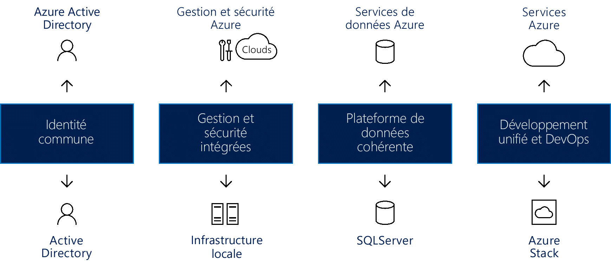

# Créer une cohérence de cloud hybride

Cet article vous guide dans les approches générales pour la création de la cohérence de cloud hybride.

Les modèles de déploiement hybrides pendant la migration peuvent réduire les risques et contribuer à une transition fluide d’infrastructure. Les plateformes cloud offrent le meilleur niveau de flexibilité quand il s’agit des processus métier. De nombreuses organisations hésitent à passer au cloud et préfèrent conserver un contrôle total sur les données les plus sensibles. Malheureusement, les serveurs locaux ne permettent pas le même taux d’innovation que le cloud. Une solution de cloud hybride vous permet de profiter des avantages des deux systèmes : la vitesse des innovations du cloud ET le confort de la gestion locale.

## Intégrer la cohérence de cloud hybride

L’utilisation d’une solution de cloud hybride permet aux organisations d’adapter l’échelle des ressources de calcul. Elle élimine aussi la nécessité de consentir des investissements conséquents pour gérer de brefs pics de demande. Quand des changements dans vos activités impliquent de libérer des ressources locales pour céder la place à des données ou applications plus sensibles, il est plus simple, plus rapide et moins coûteux de déprovisionner des ressources cloud. Vous payez uniquement pour les ressources que votre organisation utilise temporairement, au lieu de devoir acheter et gérer des ressources supplémentaires. Cela réduit la quantité d’équipements qui pourraient rester inutilisés pendant de longues périodes. Le cloud computing hybride est une plateforme offrant le meilleur des deux mondes : les avantages du cloud computing (flexibilité, scalabilité et rentabilité), et une exposition minimale des données.

*Figure 1. Création de la cohérence de cloud hybride entre identité, gestion, sécurité, données, développement et DevOps*

Une solution de cloud hybride véritable doit fournir quatre composants, chacun d’eux apportant des avantages significatifs, notamment :

- Identité commune pour les applications cloud et locales : Cela améliore la productivité des utilisateurs en leur fournissant l’authentification unique (SSO) pour se connecter à toutes leurs applications. Elle garantit également la cohérence quand les applications et utilisateurs franchissent les limites du réseau/cloud.
- Sécurité et gestion intégrées dans l’ensemble de votre cloud hybride : Vous disposez ainsi d’un moyen cohésif de superviser, gérer et sécuriser l’environnement, avec une visibilité et un contrôle accrus.
- Plateforme de données cohérente pour le centre de données et le cloud : Cela crée une portabilité des données, combinée avec un accès transparent aux services de données en local et dans le cloud pour connaître plus en détail toutes les sources de données.
- Développement unifié et DevOps dans les centres de données cloud et locaux : Cela vous permet de déplacer des applications entre les deux environnements en fonction des besoins, ce qui améliore la productivité des développeurs, car les deux emplacements ont désormais le même environnement de développement.
  
Voici quelques exemples de ces composants d’un point de vue Azure :

- Azure Active Directory (Azure AD), qui fonctionne avec Azure AD en local pour fournir une identité commune à tous les utilisateurs. L’authentification unique en local et via le cloud permet aux utilisateurs d’accéder facilement et en toute sécurité aux applications et ressources dont ils ont besoin. Les administrateurs peuvent gérer les contrôles de sécurité et de gouvernance pour que les utilisateurs puissent accéder à ce dont ils ont besoin, avec la possibilité d’adapter ces autorisations sans affecter l’expérience utilisateur.
- Azure fournit des services de sécurité et gestion intégrées pour les infrastructures locales et dans le cloud qui incluent un ensemble intégré d’outils pour la supervision, la configuration et la protection des clouds hybrides. Cette approche de bout en bout de la gestion concerne plus particulièrement les défis du monde réel auxquels font face les organisations qui envisagent une solution de cloud hybride.
- Le cloud hybride Azure fournit des outils courants qui garantissent un accès sécurisé à toutes les données, efficacement et en toute transparence. Les services de données Azure s’associent à Microsoft SQL Server pour créer une plateforme de données cohérente. Un modèle de cloud hybride cohérent permet aux utilisateurs de travailler avec des données opérationnelles et analytiques, en fournissant les mêmes services en local et dans le cloud pour l’entreposage de données, l’analyse de données et la visualisation de données.
- Les services cloud Microsoft Azure, associés à Microsoft Azure Stack en local, fournissent un développement unifié et DevOps. La cohérence dans le cloud et en local signifie que votre équipe DevOps peut créer des applications qui s’exécutent dans un environnement et peut facilement déployer sur l’emplacement approprié. Vous pouvez aussi réutiliser les modèles dans la solution hybride, ce qui peut grandement simplifier les processus DevOps.

## Azure Stack dans un environnement cloud hybride

Microsoft Azure Stack est une solution de cloud hybride qui permet aux organisations d’exécuter des services Azure cohérents dans leur centre de données, en fournissant une expérience simplifiée de développement, de gestion et de sécurité, qui est cohérente avec les services cloud publics Azure. Azure Stack est une extension d’Azure, ce qui vous permet d’exécuter des services Azure à partir de vos environnements locaux et de passer au cloud Azure si nécessaire.

Azure Stack vous permet de déployer et d’exploiter à la fois IaaS et PaaS en utilisant les mêmes outils et en offrant la même expérience que le cloud public Azure. La gestion d’Azure Stack, via le portail de l’interface utilisateur web ou PowerShell, a une apparence cohérente pour les administrateurs informatiques et les utilisateurs finaux auprès d’Azure.

Azure et Azure Stack déverrouillent de nouveaux cas d’utilisation hybrides pour les applications orientées client et métier internes, notamment :

- **Solutions edge et déconnectées**. Les clients peuvent répondre aux besoins de latence et de connectivité en traitant les données localement dans Azure Stack, puis en les agrégeant dans Azure pour une analytique plus poussée, avec une logique d’application commune. De nombreux clients sont intéressés par ce scénario de périphérie entre différents contextes, notamment les ateliers, bateaux de croisière et puits de mine.
- **Applications cloud conformes à diverses réglementations**. Les clients peuvent développer et déployer des applications dans Azure, en profitant de l’entière flexibilité de déployer localement sur Azure Stack pour répondre aux exigences réglementaires ou stratégiques, sans modification du code. Les exemples d’applications fournis à titre d’illustration incluent l’audit global, les rapports financiers, les opérations de change, les jeux en ligne et les notes de frais. Les clients cherchent parfois à déployer des instances différentes de la même application sur Azure ou Azure Stack, selon les exigences techniques et professionnelles. Même si Azure satisfait à la plupart des exigences, Azure Stack complète l’approche de déploiement si nécessaire.
- **Modèle d’application cloud en local**. Les clients peuvent utiliser les services web Azure, les conteneurs ainsi que les architectures serverless et de microservice pour mettre à jour et étendre des applications existantes ou en créer. Vous pouvez utiliser des processus DevOps cohérents sur Azure dans le cloud et sur Azure Stack en local. Il existe un intérêt croissant pour la modernisation des applications, notamment des applications stratégiques de base.

Vous disposez de deux options pour déployer Azure Stack :

- **Systèmes intégrés Azure Stack**. Les systèmes intégrés Azure Stack sont disponibles par le biais d’un partenariat entre Microsoft et des fournisseurs de matériel partenaires, qui aboutit à la création d’une solution combinant innovation cloud et simplicité de gestion. Azure Stack étant proposé en tant que système intégré de matériels et de logiciels, vous bénéficiez de la flexibilité et du contrôle adéquats, tout en adoptant l’innovation propre au cloud. Les systèmes intégrés Azure Stack présentent une taille comprise entre 4 et 12 nœuds et sont pris en charge conjointement par le fournisseur de matériel partenaire et Microsoft. Utilisez des systèmes intégrés Azure Stack pour autoriser de nouveaux scénarios pour vos charges de travail de production.
- **Kit de développement Azure Stack**. Le Kit de développement Microsoft Azure Stack est un déploiement à un seul nœud d’Azure Stack qui vous permet de découvrir et d’évaluer Azure Stack. Vous pouvez également utiliser le kit comme environnement de développement, où vous pouvez développer à l’aide d’API et d’outils cohérents avec Azure. Le Kit de développement Azure Stack n’est pas destiné à être utilisé en tant qu’environnement de production.

## Écosystème cloud Azure Stack

Vous pouvez accélérer les initiatives Azure Stack en tirant parti de l’écosystème Azure complet :

- Azure garantit que la plupart des applications et services certifiés pour Azure fonctionnent sur Azure Stack. Plusieurs éditeurs de logiciels indépendants &mdash;notamment Bitnami, Docker, Kemp Technologies, Pivotal Cloud Foundry, Red Hat Enterprise Linux et SUSE Linux &mdash; étendent leurs solutions sur Azure Stack.
- Vous pouvez décider qu’Azure Stack doit être fourni et utilisé comme un service complètement managé. Plusieurs partenaires &mdash; notamment Tieto, Yourhosting, Revera, Pulsant et NTT &mdash; recevront des offres de services managés sur Azure et Azure Stack sous peu. Ces partenaires ont apporté des services managés pour Azure via le programme des fournisseurs de solutions cloud (fournisseurs de cloud) et étendent désormais leurs offres pour inclure des solutions hybrides.
- Comme exemple de solution cloud hybride de bout en bout et complètement managée, Avanade propose une offre tout-en-un qui inclut des services de transformation cloud, des logiciels, une infrastructure, l’installation et la configuration ainsi que des services managés en cours pour que les clients puissent consommer Azure Stack comme ils utilisent Azure aujourd’hui.
- Les intégrateurs de systèmes peuvent aider à accélérer les initiatives de modernisation des applications en créant des solutions Azure de bout en bout pour les clients. Ils apportent des compétences Azure approfondies, une connaissance du domaine et du secteur ainsi qu’une expertise des processus (par exemple, DevOps). Chaque cloud Azure Stack est une opportunité pour un intégrateur de systèmes de concevoir la solution, de mener et d’influencer le déploiement du système, de personnaliser les fonctionnalités incluses et de fournir des activités opérationnelles. Cela inclut des intégrateurs de systèmes comme Avanade, DXC, Dell EMC Services, InFront Consulting Group, HPE Pointnext et Pricewaterhouse Coopers (PwC).
