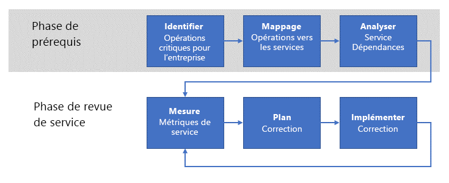

# Mettre en place une évaluation de l’adéquation opérationnelleEstablishing an operational fitness review

Lorsque votre entreprise commence à exploiter des charges de travail dans Azure, il lui faut établir un processus **d’évaluation de l’adéquation opérationnelle** pour lister, implémenter et vérifier de manière itérative les exigences **non fonctionnelles** de ces charges de travail.As your enterprise begins to operate workloads in Azure, the next step is to establish an **operational fitness review** process to enumerate, implement, and iteratively review the **non-functional** requirements for these workloads. Ces exigences _non fonctionnelles_ sont liées au comportement opérationnel attendu du service._Non-functional_ requirements are related to the expected operational behavior of the service. Il existe cinq catégories essentielles d’exigences non fonctionnelles, nommées [piliers de la qualité logicielle](../../guide/pillars.md) : l’extensibilité, la disponibilité, la résilience (y compris la continuité d’activité et la reprise d’activité), la gestion et la sécurité.There are five essential categories of non-functional requirements referred to as the [pillars of software quality](../../guide/pillars.md): scalability, availability, resiliency (including business continuity and disaster recovery), management, and security. L’objectif d’un processus d’évaluation de l’adéquation opérationnelle est de vérifier que les charges de travail critiques répondent aux attentes de votre entreprise en ce qui concerne les piliers de la qualité.The purpose of an operational fitness review process is ensuring that your mission-critical workloads meet the expectations of your business with respect to the quality pillars.

Votre entreprise doit donc procéder à un processus d’évaluation de l’adéquation opérationnelle pour bien comprendre les problèmes liés à l’exécution de la charge de travail dans un environnement de production, trouver comment corriger les problèmes, puis les résoudre.For this reason,  your enterprise should undertake an operational fitness review process to fully understand the issues that result from running the workload in a production environment, determine how to remediate the issues, then resolve them. Cet article décrit un processus d’évaluation de l’adéquation opérationnelle de haut niveau qui pourra permettre à votre entreprise d’atteindre cet objectif.This article outlines a high-level operational fitness review process that your enterprise can use to achieve this goal.

## L’adéquation opérationnelle chez MicrosoftOperational fitness at Microsoft

Le développement de la plateforme Azure a dès le départ constitué un projet de développement et d’intégration continus, entrepris par de nombreuses équipes Microsoft.From the outset, the development of the Azure platform has been a continuous development and integration project undertaken by many teams across Microsoft. Il serait très difficile de garantir la qualité et la cohérence d’un projet de la taille et de la complexité d’Azure sans un processus robuste permettant de lister et d’implémenter régulièrement les exigences non fonctionnelles fondamentales.It would be very difficult to ensure quality and consistency for a project of Azure's size and complexity without a robust process for enumerating and implementing the fundamental non-functional requirements on a regular basis.

Les processus suivis par Microsoft constituent la base de ceux qui sont décrits dans ce document.These processes followed by Microsoft form the basis for those outlined in this document.

## L’identification du problèmeUnderstanding the problem

Comme vous l’avez appris dans [Bien démarrer](../../cloud-adoption/getting-started/overview.md), la première étape de la transformation numérique d’une entreprise consiste à identifier les problèmes métier à résoudre avec l’adoption d’Azure.As you learned in [Getting started](../../cloud-adoption/getting-started/overview.md), the first step in an enterprise's digital transformation is identifying the business problems to be solved by adopting Azure. La suivante vise à trouver une solution de haut niveau au problème, comme la migration d’une charge de travail vers le cloud, ou l’adaptation d’un service local existant aux fonctionnalités cloud.The next step is to determine a high-level solution to the problem, such as migrating a workload to the cloud, or adapting an existing on-premises service to include cloud functionality. Enfin, la solution est conçue et implémentée.Finally, the solution is designed and implemented.

Pendant ce processus, l’accent est souvent mis sur les _fonctions_ du service.During this process, the focus is often on the _features_ of the service. Autrement dit, il existe un ensemble d’exigences _fonctionnelles_ souhaitées pour que le service fonctionne.That is, there are a set of desired _functional_ requirements for the service to perform. Prenons par exemple un service de livraison de produits. Plusieurs fonctions sont nécessaires : déterminer les lieux de départ et de destination du produit, assurer son suivi au cours de la livraison, envoyer des notifications aux clients, etc.For example, a product delivery service requires features for determining the source and destination locations of the product, tracking the product during delivery, customer notifications, and others.

Les exigences _non fonctionnelles_, elles, se rapportent à des propriétés comme la [disponibilité](../../checklist/availability.md), la [résilience](../../resiliency/index.md), et [l’extensibilité](../../checklist/scalability.md) du service.In contrast, the _non-functional_ requirements relate to properties such as the service's [availability](../../checklist/availability.md), [resiliency](../../resiliency/index.md), and [scalability](../../checklist/scalability.md). Ces propriétés diffèrent des exigences fonctionnelles, car elles n’affectent pas directement les fonctions finales du service.These properties differ from the functional requirements because they do not directly affect the final function of any particular feature in the service. En revanche, elles touchent aux _performances_ et à la _continuité_ du service.However, these non-functional requirements are related to the _performance_ and _continuity_ of the service.

Certaines exigences non fonctionnelles peuvent être spécifiées par un contrat de niveau de service (SLA).Some non-functional requirements can be specified in terms of a service level agreement (SLA). Par exemple, en ce qui concerne la continuité du service, on peut exprimer l’exigence de disponibilité sous forme de pourcentage, comme **disponible 99,99 % du temps**.For example, with regard to service continuity, an availability requirement for the service can be expressed as a percentage such as **available 99.99% of the time**. D’autres exigences non fonctionnelles sont plus difficiles à définir et susceptibles de changer en fonction de l’évolution des besoins de production.Other non-functional requirements may be more difficult to define and may change as production needs evolve. Par exemple, un service aux consommateurs risque de se retrouver face à des exigences de débit imprévues après une forte hausse de popularité.For example, a consumer-facing service might start facing unanticipated throughput requirements after a surge of popularity.

![REMARQUE] La définition des exigences de résilience ainsi que l’explication des concepts de RPO, de RTO, de SLA et autres sont abordées plus en détail dans [Concevoir des applications résilientes pour Azure](../../resiliency/index.md#define-your-availability-requirements).![NOTE] Defining the requirements for resiliency, including explanations of RPO, RTO, SLA, and related concepts, are explored in more depth in [Designing resilient applications for Azure](../../resiliency/index.md#define-your-availability-requirements).

## Le processus d’évaluation de l’adéquation opérationnelleOperational fitness review process

Pour préserver les performances et assurer la continuité des services de l’entreprise, la clé est d’implémenter un processus _d’évaluation de l’adéquation opérationnelle_.The key to maintaining the performance and continuity of an enterprise's services is to implement an _operational fitness review_ process.

À haut niveau, le processus se compose de deux phases.At a high level, the process has two phases. Dans la phase des prérequis sont établies les exigences, qui sont ensuite mises en correspondance avec les services de soutien.In the prerequisites phase, the requirements are established and mapped to supporting services. Cette phase se produit peu fréquemment, peut-être une fois par an ou à l’introduction de nouvelles opérations.This occurs less frequently; perhaps annually or when new operations are introduced. Le résultat de la phase des prérequis est utilisé dans la phase des flux.The output of the prerequisites phase is used in the flow phase. Cette dernière est plus fréquente ; nous vous recommandons une périodicité mensuelle.The flow phase occurs more frequently; we recommend monthly.

### La phase des prérequisPrerequisites phase

Les étapes de cette phase visent à capturer les exigences associées à une évaluation régulière des services importants.The steps in this phase are intended to capture the necessary requirements for conducting a regular review of the important services.

- **Identifier les opérations d’entreprise critiques**.**Identify critical business operations**. Identifiez les opérations stratégiques de l’entreprise.Identify the enterprise's mission-critical business operations. Les opérations d’entreprise sont indépendantes des fonctions de service de soutien.Business operations are independent from any supporting service functionality. En d’autres termes, elles représentent les activités réelles que doit effectuer l’entreprise et sont portées par un ensemble de services informatiques.In other words, business operations represent the actual activities that the business needs to perform and are supported by a set of IT services. Le terme **stratégique** (ou **critique pour l’entreprise**), reflète un impact très important pour l’entreprise si l’opération est entravée.The term **mission-critical** (or **business critical**) reflects a severe impact to the business if the operation is impeded. Prenons l’exemple d’un détaillant en ligne et de deux de ses opérations d’entreprise : « permettre à un client d’ajouter un article au panier » ou « traiter un paiement par carte de crédit ».For example, an online retailer may have a business operation such as "enable a customer to add an item to a shopping cart" or "process a credit card payment". Si l’une des deux échouait, les clients ne pourraient pas mener à bien les transactions et l’entreprise ne réaliserait pas de ventes.If either of these operations were to fail, a customer would be unable to complete the transaction and the enterprise would fail to realize sales.

- **Faire correspondre les opérations aux services**.**Map operations to services**. Faites correspondre ces opérations d’entreprise aux services de soutien associés.Map these business operations to the services that support them. Dans l’exemple du panier ci-dessus, plusieurs services peuvent être concernés : un service de gestion des stocks, un service de panier d’achat, etc.In the above shopping cart example, several services may be involved: an inventory stock management service, a shopping cart service, and others. Dans l’exemple précédent de paiement par carte de crédit, un service de paiement local est susceptible d’interagir avec un service tiers de traitement des paiements.In the credit card payment example above, an on-premises payment service may interact with a third-party payment processing service.

- **Analyser les dépendances entre les services**.**Analyze service dependencies**. La plupart des opérations d’entreprise impliquent une orchestration entre plusieurs services de soutien.Most business operations require orchestration between multiple supporting services. Il est important de comprendre les dépendances entre les services et le flux de transactions critiques à travers ces services.It is important to understand the dependences between the services and the flow of mission-critical transactions through these services. Examinez également les dépendances entre les services locaux et les services Azure.You should also consider the dependencies between on-premises services and Azure services. Dans l’exemple du panier d’achat, le service de gestion des stocks peut être hébergé en local et ingérer des données d’entrée émises par les employés dans un entrepôt physique, ou bien stocker des données dans un service Azure comme le [Stockage Azure](/azure/storage/common/storage-introduction) ou une base de données comme [Azure Cosmos DB](/azure/cosmos-db/introduction).In the shopping cart example, the inventory stock management service may be hosted on-premises and ingest data input by employees from a physical warehouse, but it may store data in an Azure service such as [Azure storage](/azure/storage/common/storage-introduction) or a database such as [Azure Cosmos DB](/azure/cosmos-db/introduction).

À partir de ces activités est produite une série **d’indicateurs de tableau de bord** pour les opérations de service.An output from these activities is a set of **scorecard metrics** for service operations. Ces métriques sont classées en fonction des critères non fonctionnels, comme la disponibilité, l’extensibilité et la récupération d’urgence,The metrics are categorized in terms of non-functional criteria such as availability, scalability, and disaster recovery. que le service doit respecter d’un point de vue opérationnel.Scorecard metrics express the criteria that the service is expected to meet operationally. Elles sont exprimées à un niveau de granularité adapté à l’opération de service, quel qu’il soit.These metrics can be expressed at any level of granularity that is appropriate for the service operation.

Le tableau de bord doit être exprimé en termes simples pour faciliter la discussion entre les responsables des résultats d’entreprise et les ingénieurs.The scorecard should be expressed in simple terms to facilitate meaningful discussion between the business owners and engineering. Par exemple, un indicateur d’évolutivité peut apparaître en _vert_ si les critères souhaités sont remplis, en _jaune_ si ce n’est pas le cas mais qu’une correction planifiée est activement en cours d’implémentation, et en _rouge_ en cas d’échec sans plan ni mesures.For example, a scalability scorecard metric could be expressed as _green_ for performing at the desired criteria, _yellow_ for failing to meet the desired criteria but actively implementing a planned remediation, and _red_ for failing to meet the desired criteria with no plan or action.

Il est important de souligner que ces métriques doivent refléter directement les besoins de l’entreprise.It is important to emphasize that these metrics should directly reflect business needs.

### La phase d’évaluation des servicesService review phase

La phase d’évaluation des services est essentielle au processus d’évaluation de l’adéquation opérationnelle.The service review phase is core of the operational fitness review process.

- **Mettre en place des métriques de service**.**Measure service metrics**. Les indicateurs de tableau de bord permettent d’effectuer le monitoring des services pour vérifier qu’ils répondent aux attentes de l’entreprise.Using the scorecard metrics, the services should be monitored to ensure that they meet the business expectations. Cette surveillance est donc essentielle.This means that service monitoring is essential. Si vous n’êtes pas en mesure d’assurer le monitoring d’un ensemble de services en regard des exigences non fonctionnelles, les indicateurs de tableau de bord correspondants doivent être considérés comme rouges.If you are not able to monitor a set of services with respect to the non-functional requirements, then the corresponding scorecard metrics should be considered red. La première étape pour y remédier consiste à implémenter le monitoring du service en question.In this case, the first step for remediation is to implement the appropriate service monitoring. Par exemple, si l’entreprise attend d’un service qu’il fonctionne avec une disponibilité de 99,99 %, mais qu’aucune télémétrie de production n’est en place pour la mesurer, partez du principe que vous ne répondez pas à cette exigence.For example, if the business expects a service to operate with 99.99% availability, but there is no production telemetry in place to measure the availability, you should assume that you're not meeting the requirement.

- **Prévoir des mesures de correction**.**Plan remediation**. Pour chaque opération de service dont les métriques se situent sous le seuil admissible, calculez ce que coûterait une correction du service permettant d’y remédier.For each service operation with metrics that fall below an acceptable threshold, determine the cost of remediating the service to bring operation to an acceptable metric. Si ce coût est supérieur au revenu attendu du service, prenez en compte les coûts non tangibles comme l’expérience utilisateur.If the cost of remediating the service is greater than the expected revenue generation of the service, move on to consider the non-tangible costs such as customer experience. Par exemple, si les clients ont des difficultés à passer une commande à l’aide du service, ils risquent de choisir un concurrent à la place.For example, if customers have difficulty placing a successful order using the service, they may choose a competitor instead.

- **Implémenter la correction**.**Implement remediation**. Dès que les responsables des résultats d’entreprise et les ingénieurs se sont mis d’accord sur un plan, celui-ci doit être implémenté.After the business owners and engineering converge on a plan, it should be implemented. L’état de l’implémentation doit être signalé à chaque fois que les indicateurs de tableau de bord sont examinés.The status of the implementation should be reported whenever scorecard metrics are reviewed.

Ce processus est itératif. Dans l’idéal, l’entreprise doit avoir une équipe responsable dédiée.This process is iterative, and ideally your enterprise should have a team dedicated to owning it. Des réunions régulières doivent être organisées pour examiner les projets de correction existants, lancer l’évaluation de base des nouvelles charges de travail et effectuer le suivi du tableau de bord global de l’entreprise.This team should meet regularly to review existing remediation projects, kick off the fundamentals review of new workloads, and track the enterprise's overall scorecard. L’équipe doit avoir l’autorité nécessaire pour demander des comptes aux équipes de correction qui ne respectent pas les métriques ou affichent des retards.The team should have the authority to ensure accountability for remediation teams that are behind schedule or fail to meet metrics.

## La structure de l’équipe chargée de l’évaluation de l’adéquation opérationnelleStructure of the operational fitness review team

L’équipe d’évaluation de l’adéquation opérationnelle se compose des rôles suivants :The operational fitness review team is composed of the following roles:

1. **Responsable des résultats d’entreprise (Business Owner)**.**Business owner**. Source de connaissances sur l’entreprise, il identifie et hiérarchise les opérations « critiques » pour l’entreprise.This role provides knowledge of the business to identify and prioritize each mission-critical business operation. Il compare également le coût de prévention à l’impact sur l’entreprise et prend la décision finale concernant les mesures de correction à appliquer.This role also compares the mitigation cost to the business impact and drives the final decision on remediation.

2. **Conseiller d’entreprise (Business Advocate)**.**Business advocate**. Il est chargé de décomposer les opérations d’entreprise en différentes parties correspondant à une infrastructure et des services cloud et locaux.This role is responsible for breaking down business operations into discreet parts and mapping those parts to on-premises and cloud services and infrastructure. Une connaissance approfondie des technologies associées à chaque opération est nécessaire.The role requires deep knowledge of the technology associated with each business operation.

3. **Responsable de l’ingénierie (Engineering Owner)**.**Engineering owner**. Il est chargé d’implémenter les services associés à l’opération d’entreprise.This role is responsible for implementating the services associated with the business operation. Ils peuvent participer à la conception, à la mise en œuvre et au déploiement de solutions à des problèmes liés aux exigences non fonctionnelles et révélés par l’équipe d’évaluation de l’adéquation opérationnelle.These individuals may participate in the design, implementation, and deployment of any solutions for solving non-functional requirement issues uncovered by the operational fitness review team.

4. **Responsable des services (Service Owner)**.**Service owner**. Il est responsable du fonctionnement des applications et des services de l’entreprise.This role is responsible for operating the business's applications and services. Ils collectent des données de journalisation et d’utilisation de ces applications et services,These individuals collect logging and usage data for these applications and services. qui servent à identifier les problèmes et à vérifier les correctifs une fois déployés.This data is used both to identify issues and verify fixes once deployed.

## Les réunions d’évaluation de l’adéquation opérationnelleOperational fitness review meeting

Nous recommandons d’organiser des réunions régulières au sein de l’équipe d’évaluation de l’adéquation opérationnelle.We recommend that your operational fitness review team meet on a regular basis. Elle peut par exemple se réunir tous les mois et envoyer à la direction un rapport trimestriel sur l’état et les métriques.For example, the could team meet on a monthly cadence and report status and metrics to senior leadership on a quarterly basis.

Les détails du processus et des réunions doivent être parfaitement adaptés à vos besoins.The details of the process and meeting should be adapted to fit your specific needs. Nous recommandons les tâches suivantes pour commencer :We recommend the following tasks as a starting point:

1. Le responsable des résultats d’entreprise et le conseiller d’entreprise listent et déterminent les exigences non fonctionnelles de chaque opération d’entreprise, avec la participation des responsables de l’ingénierie et des services.The business owner and business advocate enumerate and determine the non-functional requirements for each business operation, with input from the engineering and service owners. La priorité des opérations d’entreprise déjà identifiées est examinée et vérifiée.For business operations that have been previously identified, the priority is reviewed and verified. Pour ce qui est des nouvelles opérations, une priorité leur est attribuée dans la liste existante.For new business operations, a priority in the existing list is assigned.

2. Les responsables de l’ingénierie et des services font correspondre **l’état actuel** des opérations d’entreprise aux services cloud et locaux associés :The engineering and service owners map the **current state** of business operations to the corresponding on-premises and cloud services. la liste des composants de chaque service est orientée sous la forme d’une arborescence des dépendances.The mapping is composed of a list of the components in each service, oriented as a dependency tree. Une fois la liste et l’arborescence générées, il convient de déterminer les **chemins critiques** dans l’arborescence.Once the list and dependency tree are generated, the **critical paths** through the tree are determined.

3. Les responsables de l’ingénierie et des services évaluent l’état actuel de la journalisation et du monitoring opérationnels des services listés à l’étape précédente.The engineering and service owners review the current state of operational logging and monitoring for the services listed in the previous step. Il est essentiel que la journalisation et le monitoring soient robustes et suffisants pour identifier les composants de service qui contribuent au non-respect des exigences non fonctionnelles.Robust logging and monitoring are critical, in order to identify service components that contribute to failuring to meet non-functional requirements. Sinon, il faut créer et mettre en œuvre un plan permettant de les mettre en place.If sufficient logging and monitoring are not in place, a plan must be created and implemented to put them in place.

4. Des indicateurs de tableau de bord sont créés pour les nouvelles opérations d’entreprise.Scorecard metrics are created for new business operation. Ce tableau de bord se compose de la liste des composants constitutifs de chacun des services identifiés à l’étape 2, alignés sur les exigences non fonctionnelles, et de métriques représentant la manière dont les composants respectent ces exigences.The scorecard is composed of the list of constituent components for each service identified in step 2, aligned with the non-functional requirements and a metric representing how well the component meets the requirement.

5. Lorsqu’un composant constitutif ne parvient pas à répondre aux exigences non fonctionnelles, une solution de haut niveau est conçue et un responsable de l’ingénierie désigné.For those constituent components that fail to meet non-functional requirements, a high-level solution is designed and an engineering owner is assigned. Le responsable des résultats d’entreprise et le conseiller d’entreprise doivent alors établir un budget pour le travail de correction, en fonction du revenu attendu de l’opération d’entreprise.At this point, the business owner and business advocate should establish a budget for the remediation work, based on the expected revenue of the business operation.

6. Enfin, le travail de correction en cours est soumis à une évaluation.Finally, a review is conducted of the ongoing remediation work. Chacun des indicateurs de tableau de bord du travail en cours est comparé à la métrique attendue.Each of the scorecard metrics for work in progress is reviewed against the expected metrics. Dans le cas des composants constitutifs qui satisfont aux indicateurs, le responsable des services présente les données de journalisation et de monitoring pour confirmer le respect de la métrique.For constituent components that are meeting metrics, the service owner presents logging and monitoring data to confirm that the metric is met. Dans les autres cas, chaque responsable de l’ingénierie explique les problèmes en cause et les nouvelles conceptions permettant d’y remédier.For those constituent components that are not meeting metrics, each engineering owner explains the issues that are preventing metrics from being reached and any new designs for remediation.

## Ressources recommandéesRecommended resources

- [Piliers de la qualité logicielle](../../guide/pillars.md).[Pillars of software quality](../../guide/pillars.md).
    Cette section du guide d’architecture des applications Azure décrit les cinq piliers de la qualité logicielle : scalabilité, disponibilité, résilience, gestion et sécurité.This section of the Azure Application Architecture guide describes the five pillars of software quality: Scalability, availability, resiliency, management, and security.
- [Dix principes de conception pour les applications Azure](../../guide/design-principles/index.md).[Ten design principles for Azure applications](../../guide/design-principles/index.md).
    Cette section du guide d’architecture des applications Azure présente un ensemble de principes de conception visant à rendre les applications plus évolutives, plus résilientes et plus faciles à gérer.This section of the Azure Application Architecture guide discusses a set of design principles to make your application more scalable, resilient, and manageable.
- [Concevoir des applications résilientes pour Azure](../../resiliency/index.md).[Designing resilient applications for Azure](../../resiliency/index.md).
    Ce guide commence par une définition du terme « résilience » et des concepts associés.This guide starts with a definition of the term resiliency and related concepts. Il décrit ensuite un processus pour atteindre une résilience, à l’aide d’une approche structurée pendant la durée de vie d’une application, depuis la conception et l’implémentation jusqu’au déploiement et aux opérations.Then it describes a process for achieving resiliency, using a structured approach over the lifetime of an application, from design and implementation to deployment and operations.
- [Modèles de conception cloud](../../patterns/index.md).[Cloud Design Patterns](../../patterns/index.md).
    Ces modèles de conception sont utiles aux équipes d’ingénieurs qui souhaitent créer des applications selon les piliers de la qualité logicielle.These design patterns are useful for engineering teams when building applications on the pillars of software quality.
