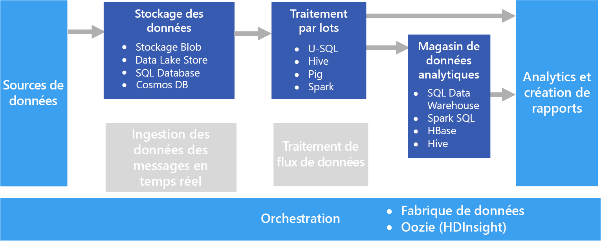

# Traitement par lotsBatch processing

L’un des scénarios les plus courants pour le Big Data est le traitement par lots de données au repos.A common big data scenario is batch processing of data at rest. Dans ce cas de figure, la source de données est chargé dans le stockage de données, soit par l’application de la source elle-même, soit par un workflow d’orchestration.In this scenario, the source data is loaded into data storage, either by the source application itself or by an orchestration workflow. Les données sont alors traitées sur place par une tâche parallélisée, qui peut également être lancée par le workflow d’orchestration.The data is then processed in-place by a parallelized job, which can also be initiated by the orchestration workflow. Le traitement peut passer par plusieurs étapes itératives avant que les résultats transformés ne soient chargés dans un magasin de données analytiques, qui peut être interrogé par des composants d’analytique et de création de rapports.The processing may include multiple iterative steps before the transformed results are loaded into an analytical data store, which can be queried by analytics and reporting components.

Par exemple, les journaux provenant d’un serveur web peuvent être copiés dans un dossier, puis traités pendant la nuit pour générer les rapports quotidiens d’activités web.For example, the logs from a web server might be copied to a folder and then processed overnight to generate daily reports of web activity.

## Quand utiliser cette solutionWhen to use this solution

Le traitement par lots est utilisé dans différents scénarios, qui vont des transformations de données simples à un pipeline ETL (extraction, transformation et chargement) plus complet.Batch processing is used in a variety of scenarios, from simple data transformations to a more complete ETL (extract-transform-load) pipeline. Dans un contexte de Big Data, le traitement par lots peut fonctionner sur des jeux de données très volumineux, pour lesquels le calcul prend beaucoup de temps.In a big data context, batch processing may operate over very large data sets, where the computation takes significant time. (Voir par exemple [Architecture lambda](../big-data/index.md#lambda-architecture).) En général, il aboutit à une exploration interactive plus poussée, fournit des données modélisables pour le Machine Learning ou écrit les données dans un magasin de données optimisé pour l’analytique et la visualisation.(For example, see [Lambda architecture](../big-data/index.md#lambda-architecture).) Batch processing typically leads to further interactive exploration, provides the modeling-ready data for machine learning, or writes the data to a data store that is optimized for analytics and visualization.

Il peut s’agir par exemple de transformer un grand ensemble de fichiers CSV ou JSON plats et semi-structurées dans un format schématisé et structuré afin de pousser plus loin les requêtes.One example of batch processing is transforming a large set of flat, semi-structured CSV or JSON files into a schematized and structured format that is ready for further querying. La plupart du temps, les données sont converties d’un format brut utilisé pour l’ingestion (par exemple, CSV) dans un format binaire, plus performant pour l’interrogation, car stockant les données en colonnes et fournissant souvent des index et des statistiques incluses sur les données.Typically the data is converted from the raw formats used for ingestion (such as CSV) into binary formats that are more performant for querying because they store data in a columnar format, and often provide indexes and inline statistics about the data.

## DéfisChallenges

- **Encodage et format de données**.**Data format and encoding**. Certains des problèmes plus difficiles à déboguer se produisent lorsque les fichiers utilisent un encodage ou un format inattendu.Some of the most difficult issues to debug happen when files use an unexpected format or encoding. Par exemple, les fichiers sources peuvent utiliser un mélange d’encodage UTF-16 et UTF-8, ou comporter des caractères ou des délimiteurs inattendus (espace au lieu de tabulation).For example, source files might use a mix of UTF-16 and UTF-8 encoding, or contain unexpected delimiters (space versus tab), or include unexpected characters. On peut également citer l’exemple de champs de texte contenant des tabulations, des espaces ou des virgules qui sont interprétés comme des délimiteurs.Another common example is text fields that contain tabs, spaces, or commas that are interpreted as delimiters. La logique de chargement et d’analyse des données doit être suffisamment souple pour détecter et gérer ces problèmes.Data loading and parsing logic must be flexible enough to detect and handle these issues.

- **Orchestration de tranches horaires**.**Orchestrating time slices.** Les données sources sont souvent placées dans une arborescence de dossiers qui reflète les fenêtres de traitement, organisées par année, par mois, par jour, par heure, etc.Often source data is placed in a folder hierarchy that reflects processing windows, organized by year, month, day, hour, and so on. Dans certains cas, les données peuvent arrivent en retard.In some cases, data may arrive late. Supposons par exemple que, à cause d’une défaillance sur un serveur web, les journaux du 7 mars ne se retrouvent pas dans le dossier de traitement avant le 9 mars.For example, suppose that a web server fails, and the logs for March 7th don't end up in the folder for processing until March 9th. Sont-elles simplement ignorées du fait de leur retard ?Are they just ignored because they're too late? La logique de traitement en aval est-elle capable de gérer les enregistrements non ordonnés ?Can the downstream processing logic handle out-of-order records?

## ArchitectureArchitecture

Une architecture de traitement par lots comporte les éléments logiques suivants, illustrés dans le diagramme ci-dessus.A batch processing architecture has the following logical components, shown in the diagram above.

- **Stockage des données**.**Data storage.** En général, un magasin de fichiers distribués pouvant servir de référentiel pour de gros volumes de fichiers dans différents formats.Typically a distributed file store that can serve as a repository for high volumes of large files in various formats. Ce type de magasin est communément appelé lac de données.Generically, this kind of store is often referred to as a data lake. 

- **Traitement par lots**.**Batch processing.** En raison des gros volumes en jeu dans le Big Data, les solutions doivent gérer les fichiers de données en appliquant des traitements par lots de longue durée pour filtrer, agréger et, plus généralement, préparer les données à des fins d’analyse.The high-volume nature of big data often means that solutions must process data files using long-running batch jobs to filter, aggregate, and otherwise prepare the data for analysis. Généralement, ces travaux impliquent la lecture des fichiers source, leur traitement et l’écriture de la sortie dans de nouveaux fichiers.Usually these jobs involve reading source files, processing them, and writing the output to new files. 

- **Magasin de données analytiques**.**Analytical data store.** De nombreuses solutions Big Data sont conçues pour préparer les données à des fins d’analyse, puis fournir les données traitées dans un format structuré et interrogeable à l’aide d’outils d’analyse.Many big data solutions are designed to prepare data for analysis and then serve the processed data in a structured format that can be queried using analytical tools. 

- **Analyse et rapports**.**Analysis and reporting.** La plupart des solutions Big Data ont pour but de fournir des informations sur les données par le biais de l’analyse et des rapports.The goal of most big data solutions is to provide insights into the data through analysis and reporting. 

- **Orchestration**.**Orchestration.** Avec le traitement par lots, une orchestration est en général nécessaire pour migrer ou copier les données dans les couches de stockage, de traitement, de magasin de données analytiques et de création de rapports.With batch processing, typically some orchestration is required to migrate or copy the data into your data storage, batch processing, analytical data store, and reporting layers.

## Choix de technologieTechnology choices

Les technologies suivantes sont recommandées pour les solutions de traitement par lots dans Azure.The following technologies are recommended choices for batch processing solutions in Azure.

### Stockage des donnéesData storage

- **Conteneurs Azure Storage Blob**.**Azure Storage Blob Containers**. De nombreux processus d’entreprise Azure utilisent déjà le Stockage Blob Azure, ce qui en fait un bon choix pour un magasin de Big Data.Many existing Azure business processes already make use of Azure blob storage, making this a good choice for a big data store.
- **Azure Data Lake Store**.**Azure Data Lake Store**. Azure Data Lake Store offre un stockage quasiment illimité pour des fichiers de toutes tailles, ainsi que des options de sécurité étendues, ce qui en fait un bon choix pour les solutions de Big Data à très grande échelle qui nécessitent un magasin centralisé de données de formats hétérogènes.Azure Data Lake Store offers virtually unlimited storage for any size of file, and extensive security options, making it a good choice for extremely large-scale big data solutions that require a centralized store for data in heterogeneous formats.

Pour plus d’informations, consultez la page [Stockage de données](../technology-choices/data-storage.md).For more information, see [Data storage](../technology-choices/data-storage.md).

### Traitement par lotsBatch processing

- **U-SQL**.**U-SQL**. U-SQL est le langage de traitement des requêtes utilisé par Azure Data Lake Analytics.U-SQL is the query processing language used by Azure Data Lake Analytics. Il combine la nature déclarative de SQL avec l’extensibilité procédurale de C#, et tire parti du parallélisme pour permettre un traitement efficace des données à très grande échelle.It combines the declarative nature of SQL with the procedural extensibility of C#, and takes advantage of parallelism to enable efficient processing of data at massive scale.
- **Hive**.**Hive**. Hive est un langage de type SQL pris en charge dans la plupart des distributions Hadoop, y compris HDInsight.Hive is a SQL-like language that is supported in most Hadoop distributions, including HDInsight. Il permet de traiter des données provenant de n’importe quel magasin compatible HDFS, notamment le Stockage Blob Azure et Azure Data Lake Store.It can be used to process data from any HDFS-compatible store, including Azure blob storage and Azure Data Lake Store.
- **Pig**.**Pig**. Pig est un langage de traitement du Big Data déclaratif utilisé dans de nombreuses distributions Hadoop, notamment HDInsight.Pig is a declarative big data processing language used in many Hadoop distributions, including HDInsight. Il est particulièrement utile pour traiter des données non structurées ou semi-structurées.It is particularly useful for processing data that is unstructured or semi-structured.
- **Spark**.**Spark**. Le moteur Spark prend en charge les programmes de traitement par lots écrits dans différents langages, notamment Python, Java et Scala.The Spark engine supports batch processing programs written in a range of languages, including Java, Scala, and Python. Il utilise une architecture distribuée pour traiter les données en parallèle sur plusieurs nœuds de travail.Spark uses a distributed architecture to process data in parallel across multiple worker nodes.

Pour plus d’informations, consultez la section [Traitement par lots](../technology-choices/batch-processing.md).For more information, see [Batch processing](../technology-choices/batch-processing.md).

### Magasin de données analytiquesAnalytical data store

- **SQL Data Warehouse**.**SQL Data Warehouse**. Azure SQL Data Warehouse est un service géré fondé sur les technologies de base de données SQL Server et optimisé pour prendre en charge les grosses charges de travail d’entreposage de données.Azure SQL Data Warehouse is a managed service based on SQL Server database technologies and optimized to support large-scale data warehousing workloads.
- **Spark SQL**.**Spark SQL**. Spark SQL est une API qui repose sur Spark et prend en charge la création de trames de données et de tables interrogeables avec la syntaxe SQL.Spark SQL is an API built on Spark that supports the creation of dataframes and tables that can be queried using SQL syntax.
- **HBase**.**HBase**. HBase est un magasin NoSQL à faible latence qui permet d’interroger des données structurées et semi-structurées d’une manière souple et très performante.HBase is a low-latency NoSQL store that offers a high-performance, flexible option for querying structured and semi-structured data.
- **Hive**.**Hive**. En plus d’être utile pour le traitement par lots, Hive offre une architecture de base de données semblable d’un point de vue conceptuel à celle d’un système de gestion de base de données relationnelle classique.In addition to being useful for batch processing, Hive offers a database architecture that is conceptually similar to that of a typical relational database management system. Grâce aux améliorations apportées aux performances des requêtes Hive par des innovations comme le moteur Tez et l’initiative Stinger, les tables Hive représentent des sources efficaces pour les requêtes analytiques dans certains scénarios.Improvements in Hive query performance through innovations like the Tez engine and Stinger initiative mean that Hive tables can be used effectively as sources for analytical queries in some scenarios.

Pour plus d’informations, consultez la section [Magasins de données analytiques](../technology-choices/analytical-data-stores.md).For more information, see [Analytical data stores](../technology-choices/analytical-data-stores.md).

### Analytique et création de rapportsAnalytics and reporting

- **Azure Analysis Services**.**Azure Analysis Services**. De nombreuses solutions de Big Data émulent des architectures d’informatique décisionnelle d’entreprise classiques en intégrant un modèle de données OLAP (traitement analytique en ligne) centralisé (communément appelé cube) qui peut servir de base aux rapports, aux tableaux de bord et à l’analyse interactive par permutation d'axes.Many big data solutions emulate traditional enterprise business intelligence architectures by including a centralized online analytical processing (OLAP) data model (often referred to as a cube) on which reports, dashboards, and interactive “slice and dice” analysis can be based. Azure Analysis Services prend en charge la création de modèles tabulaires pour répondre à ce besoin.Azure Analysis Services supports the creation of tabular models to meet this need.
- **Power BI**.**Power BI**. Power BI permet aux analystes de données de créer des visualisations de données interactives sur la base de modèles de données dans un modèle OLAP ou directement à partir d’un magasin de données analytiques.Power BI enables data analysts to create interactive data visualizations based on data models in an OLAP model or directly from an analytical data store.
- **Microsoft Excel**.**Microsoft Excel**. Microsoft Excel est l’une des applications logicielles les plus largement utilisées dans le monde ; elle offre un large éventail de fonctionnalités d’analyse et de visualisation de données.Microsoft Excel is one of the most widely used software applications in the world, and offers a wealth of data analysis and visualization capabilities. Les analystes de données peuvent se servir d’Excel pour générer des modèles de données de documents à partir de magasins de données analytiques, ou pour récupérer des données provenant de modèles de données OLAP dans des graphiques et des tableaux croisés dynamiques interactifs.Data analysts can use Excel to build document data models from analytical data stores, or to retrieve data from OLAP data models into interactive PivotTables and charts.

Pour plus d'informations, consultez la section [Analytique et création de rapports](../technology-choices/analysis-visualizations-reporting.md).For more information, see [Analytics and reporting](../technology-choices/analysis-visualizations-reporting.md).

### OrchestrationOrchestration

- **Azure Data Factory**.**Azure Data Factory**. Les pipelines Azure Data Factory peuvent servir à définir une séquence d’activités, planifiée pour des fenêtres temporelles périodiques.Azure Data Factory pipelines can be used to define a sequence of activities, scheduled for recurring temporal windows. Ces activités peuvent lancer des opérations de copie de données ainsi que des tâches Hive, Pig, MapReduce ou Spark dans des clusters HDInsight à la demande ; des tâches U-SQL dans Azure Date Lake Analytics ; et des procédures stockées dans Azure SQL Data Warehouse ou Azure SQL Database.These activities can initiate data copy operations as well as Hive, Pig, MapReduce, or Spark jobs in on-demand HDInsight clusters; U-SQL jobs in Azure Date Lake Analytics; and stored procedures in Azure SQL Data Warehouse or Azure SQL Database.
- **Oozie** et **Sqoop**.**Oozie** and **Sqoop**. Oozie est un moteur d’automatisation des tâches pour l’écosystème Apache Hadoop qui permet de lancer des opérations de copie de données, ainsi que des tâches Hive, Pig et MapReduce pour traiter les données, et Sqoop pour les copier entre des bases de données HDFS et SQL.Oozie is a job automation engine for the Apache Hadoop ecosystem and can be used to initiate data copy operations as well as Hive, Pig, and MapReduce jobs to process data and Sqoop jobs to copy data between HDFS and SQL databases.

Pour plus d’informations, consultez la section [Orchestration de pipelines](../technology-choices/pipeline-orchestration-data-movement.md).For more information, see [Pipeline orchestration](../technology-choices/pipeline-orchestration-data-movement.md)
