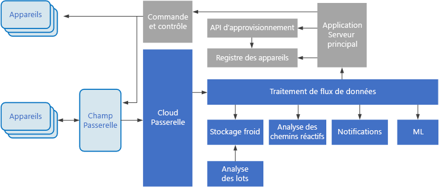

# Architectures de Big Data

Une architecture Big Data est conçue pour gérer l’ingestion, le traitement et l’analyse de données trop volumineuses ou complexes pour les systèmes de base de données traditionnels. Le seuil à partir duquel les organisations basculent dans le domaine Big Data varie selon les capacités des utilisateurs et leurs outils. Pour certaines, ce seuil est fixé à plusieurs centaines de gigaoctets de données, tandis que pour d’autres, il s’agit de centaines de téraoctets. L’amélioration des outils de gestion du Big Data redéfinit la notion même de Big Data. Ce terme est de plus en plus associé à la valeur que vous pouvez tirer de vos jeux de données via une analytique avancée, plutôt qu’à la taille stricte des données, bien que dans ce cas, ces données ont tendance à être très volumineuses.

Au fil des années, le paysage des données a changé. Ce que vous pouvez faire, ou supposer pouvoir faire, avec les données a évolué. Le coût du stockage a considérablement diminué, tandis que les méthodes de collecte de ces données ne cessent de se multiplier. Certaines données affluent à un rythme très soutenu et nécessitent une collecte et une observation permanentes. D’autres données affluent plus lentement, mais sont très volumineuses, et se présentent souvent sous la forme d’un historique couvrant plusieurs dizaines d’années de données. Vous pouvez être confronté à un problème d’analytique avancé, ou qui nécessite un apprentissage automatique. Tels sont les défis que les architectures Big Data tentent de résoudre.

Les solutions Big Data impliquent généralement un ou plusieurs des types de charges de travail suivants :

* Traitement par lots des sources Big Data au repos.
* Traitement en temps réel des Big Data en mouvement.
* Exploration interactive des Big Data.
* Analyse prédictive et apprentissage machine.

Utilisez des architectures Big Data lorsque vous devez :

* Stocker et traiter des données dans des volumes trop vastes pour une base de données traditionnelle.
* Transformer des données non structurées en vue d’une analyse et de la création de rapports.
* Capturer, traiter et analyser des flux de données indépendants en temps réel ou avec une faible latence.

## Composants d’une architecture Big Data

Le diagramme suivant montre les composants logiques qui constituent une architecture Big Data. Certaines solutions individuelles ne contiennent pas tous les éléments de ce diagramme.

 

La plupart des architectures Big Data incluent tout ou partie des composants suivants :

* **Sources de données**. Toutes les solutions Big Data reposent sur une ou plusieurs sources de données. Voici quelques exemples :

    * Magasins de données d’application, tels que des bases de données relationnelles.
    * Fichiers statiques produits par les applications, tels que les fichiers journaux de serveur web.
    * Sources de données en temps réel, tels que les appareils IoT.

* **Stockage des données**. Les données destinées aux opérations de traitement par lots sont généralement stockées dans un magasin de fichiers distribués, qui peut contenir de vastes volumes de fichiers volumineux dans divers formats. Ce type de magasin est souvent appelé « *lac de données* ». Les options pour l’implémentation de ce stockage incluent des conteneurs Azure Data Lake Store ou les conteneurs blob dans le stockage Azure.

* **Traitement par lots**. Étant donné que les jeux de données sont trop lourds, une solution Big Data doit souvent traiter les fichiers de données à l’aide de traitements par lots à longue durée d’exécution pour filtrer, agréger et préparer les données en vue de l’analyse. Généralement, ces travaux impliquent la lecture des fichiers source, leur traitement et l’écriture de la sortie dans de nouveaux fichiers. Les options incluent l’exécution de travaux U-SQL dans Azure Data Lake Analytics, à l’aide de travaux personnalisés de mappage/réduction, Pig ou Hive dans un cluster HDInsight Hadoop ou à l’aide des programmes Java, Scala ou Python dans un cluster HDInsight Spark.

* **Ingestion de messages en temps réel**. Si la solution inclut des sources en temps réel, l’architecture doit inclure un moyen pour capturer et stocker des messages en temps réel pour le traitement de flux de données. Il peut s’agir d’un simple magasin de données, où les messages entrants sont déposés dans un dossier en vue du traitement. Toutefois, de nombreuses solutions besoin d’un magasin d’ingestion des messages qui agit comme une mémoire tampon pour les messages et qui prend en charge un traitement de montée en puissance, une remise fiable et d’autres sémantiques de files d’attente de message. Cette partie d’une architecture de diffusion est communément appelée mise en mémoire tampon du flux. Les options incluent Azure Event Hubs, Azure IoT Hub et Kafka.

* **Traitement de flux**. Après avoir capturé les messages en temps réel, la solution doit les traiter en filtrant, en agrégeant et, plus généralement, en préparant les données pour l’analyse. Les données de flux traitées sont ensuite écrites dans un récepteur de sortie. Azure Stream Analytics fournit un service de traitement de flux managé reposant sur des requêtes SQL à l’exécution permanente qui fonctionnent sur les flux de données indépendants. Vous pouvez également utiliser des technologies de flux Apache open source comme Storm et Spark dans un cluster HDInsight.

* **Magasin de données analytique**. De nombreuses solutions Big Data préparent les données pour l’analyse, puis fournissent les données traitées dans un format structuré qui peut être interrogé à l’aide des outils d’analyse. Le magasin de données analytique utilisé pour répondre à ces requêtes peut être un entrepôt de données relationnelles de type Kimball, comme indiqué dans les solutions décisionnelles (BI) plus traditionnelles. Les données peuvent également être présentées via une technologie NoSQL à faible latence, telle que HBase, ou via une base de données Hive interactif qui fournit une abstraction de métadonnées sur les fichiers de données dans le magasin de données distribuées. Azure SQL Data Warehouse fournit un service managé pour l’entreposage cloud des données à grande échelle. HDInsight prend en charge les formats Hive interactif, HBase et Spark SQL, qui peuvent également servir à préparer les données en vue de l’analyse.

* **Analyse et rapports**. La plupart des solutions Big Data ont pour but de fournir des informations sur les données par le biais de l’analyse et des rapports. Pour permettre aux utilisateurs d’analyser les données, l’architecture peut inclure une couche de modélisation des données, comme un cube OLAP multidimensionnel ou un modèle de données tabulaire dans Azure Analysis Services. Elle peut également prendre en charge le décisionnel libre-service, en utilisant les technologies de modélisation et de visualisation de Microsoft Power BI ou Microsoft Excel. L’analyse et les rapports peuvent aussi prendre la forme d’une exploration interactive des données par les scientifiques de données ou les analystes de données. Pour ces scénarios, plusieurs services Azure prennent en charge les blocs-notes analytiques, tels que Jupyter, ce qui permet à ces utilisateurs de tirer parti de leurs connaissances avec Python ou R. Pour l’exploration de données à grande échelle, vous pouvez utiliser Microsoft R Server seul ou avec Spark.

* **Orchestration**. La plupart des solutions Big Data consistent en des opérations de traitement de données répétées, encapsulées dans des workflows, qui transforment les données source, déplacent les données entre plusieurs sources et récepteurs, chargent les données traitées dans un magasin de données analytique, ou envoient les résultats directement à un rapport ou à un tableau de bord. Pour automatiser ces workflows, vous pouvez utiliser une technologie d’orchestration telle qu’Azure Data Factory ou Apache Oozie avec Sqoop.

## Architecture lambda

Lorsque vous utilisez des jeux de données très volumineux, l'exécution des requêtes des clients peut prendre beaucoup de temps. Ces requêtes ne peuvent pas être effectuées en temps réel et nécessitent souvent des algorithmes comme [MapReduce](https://en.wikipedia.org/wiki/MapReduce), qui s’exécutent en parallèle sur l’ensemble du jeu de données. Les résultats sont ensuite stockés séparément des données brutes et utilisés à des fins d’interrogation.

L’inconvénient de cette approche est qu’elle entraîne une latence &mdash; si le traitement dure quelques heures, une requête peut donc retourner des résultats datant de plusieurs heures. Dans l’idéal, vous devez obtenir des résultats en temps réel (malgré une certaine perte de précision) et combiner ces résultats avec ceux de l’analyse en mode batch.

**L’architecture lambda**, proposée pour la première fois par Nathan Marz, résout ce problème en créant deux chemins d’accès aux flux de données. Toutes les données entrantes dans le système transitent par ces deux chemins d’accès :

* une **couche de traitement par lots** (chemin à froid) stocke toutes les données entrantes dans leur forme brute et effectue un traitement par lots de ces données. Le résultat de ce traitement est stocké sous forme d’une **vue de traitement par lots**.

* Une **couche vitesse** (chemin réactif) analyse les données en temps réel. Cette couche est conçue pour une faible latence, au détriment de la précision.

La couche de traitement par lots alimente une **couche service** qui indexe la vue de traitement par lots pour améliorer l’interrogation. La couche vitesse met à jour de la couche service avec les mises à jour incrémentielles basées sur les données les plus récentes.

Les données qui circulent dans le chemin réactif sont limitées par les conditions de latence imposées par la couche vitesse, afin de garantir un traitement aussi rapide que possible. Souvent, cela nécessite d’accepter une certaine perte de précision afin d’obtenir les données aussi rapidement que possible. Par exemple, imaginons un scénario IoT où un grand nombre de capteurs de température transmettent des données de télémétrie. La couche vitesse permet de traiter les données entrantes dans une fenêtre temporelle coulissante. 

En revanche, les données qui transitent par le chemin à froid ne sont pas soumises aux mêmes exigences de faible latence. Cela permet d’obtenir un calcul plus précis sur plusieurs jeux de données volumineux, une tâche qui peut prendre beaucoup de temps. 

Pour finir, le chemin relatif et le chemin à froid convergent au niveau de l’application cliente analytique. Si le client a besoin d’afficher en temps opportun des données potentiellement moins précises en temps réel, il obtiendra son résultat avec le chemin réactif. Sinon, il devra sélectionner les résultats avec le chemin à froid pour obtenir des données plus précises mais à un moment moins opportun. En d’autres termes, le chemin réactif offre des données dans une fenêtre temporelle relativement restreinte, après laquelle les résultats peuvent être mis à jour avec des données plus précises grâce au chemin à froid.

Les données brutes stockées au niveau de la couche de traitement par lots sont immuables. Les données entrantes sont toujours ajoutées aux données existantes, et les données précédentes ne sont jamais remplacées. Toute modification apportée à la valeur d’une donnée particulière est stockée comme un nouvel enregistrement d’événement horodaté. Cela permet un recalcul à n’importe quel point dans le temps dans tout l’historique des données collectées. La possibilité de recalculer la vue de traitement par lots à partir de données brutes d’origine est importante car elle permet de créer de nouvelles vues à mesure que le système évolue. 

## Architecture kappa

Un inconvénient de l’architecture lambda est sa complexité. La logique de traitement apparaît en deux emplacements différents &mdash; le chemin réactif et le chemin à froid &mdash; avec différentes infrastructures. Cela double la logique de calcul et la complexité de la gestion de l’architecture pour ces deux chemins.

**L’architecture kappa** a été proposée par Jay Kreps comme alternative à l’architecture lambda. Elle vise les mêmes objectifs de base que l’architecture lambda, mais avec une différence importante : toutes les données transitent via un chemin unique en utilisant un système de traitement de flux. 

Il existe certaines similarités avec la couche de traitement par lots de l’architecture lambda, dans la mesure où les données des événements restent immuables et sont collectées dans leur totalité et non comme un sous-ensemble. Les données sont reçues sous forme d’un flux d’événements dans un journal unifié, distribué et tolérance aux pannes. Ces événements sont classés, et l’état actuel d’un événement change uniquement lorsqu’un nouvel événement est ajouté. Comme pour la couche vitesse de l’architecture lambda, tout le traitement des événements est effectué sur le flux d’entrée et perdure sous forme d’une vue en temps réel. 

Si vous avez besoin de recalculer la totalité du jeu de données (comparable à ce que fait la couche de traitement par lots dans l’architecture lambda), il vous suffit de relancer le flux, généralement en utilisant un parallélisme pour effectuer le calcul en temps opportun.

## Internet des objets (IoT)

D’un point de vue pratique, Internet des objets (IoT) représente n’importe quel appareil connecté à Internet. Cela inclut votre PC, téléphone mobile, montre connectée, thermostat intelligent, réfrigérateur connecté, véhicule connecté, les appareils de surveillance cardiaque et tout autre appareil qui se connecte à Internet et échange des données. Le nombre d’appareils connectés augmente chaque jour, tout comme la quantité de données collectées à partir de ceux-ci. Souvent, ces données sont collectées dans des environnements à fortes contraintes, parfois à latence élevée. Dans d’autres cas, les données sont envoyées à partir d’environnements à faible latence par des milliers voire des millions d’appareils, ce qui nécessite de recevoir rapidement les données et de les traiter en conséquence. Ainsi, une planification appropriée est requise pour gérer ces contraintes et ces conditions spécifiques.

Les architectures basées sur les événements sont des éléments essentiels dans les solutions IoT. Le diagramme suivant présente une architecture logique possible pour IoT. Le diagramme met en avant les composants de diffusion d’événements de l’architecture.

La **passerelle cloud** ingère les événements d’appareils à la limite du cloud en utilisant un système de messagerie fiable et à faible latence.

Les appareils peuvent envoyer les événements directement à la passerelle cloud ou via une **passerelle de champ**. Une passerelle de champ est un appareil ou un logiciel spécialisé, généralement colocalisée avec les appareils, qui reçoit les événements et les transfère à la passerelle cloud. La passerelle de champ peut aussi prétraiter les événements d’appareils bruts, remplissant des fonctions de filtrage, d’agrégation ou de transformation de protocole.

Après ingestion, les événements transitent par un ou plusieurs **processeurs de flux** qui peuvent acheminer les données (par exemple, vers le stockage) ou procéder à l’analytique et autres traitements.

Voici quelques types de traitement courants. (Cette liste n’est certainement pas exhaustive.)

- Écriture de données d’événement dans un stockage froid pour archivage ou traitement analytique par lots.

- Analytique de séquence à chaud (« hot path analytics »), avec une analyse du flux d’événements en (quasi) temps réel, pour détecter les anomalies, reconnaître les modèles dans des fenêtres de temps glissantes ou déclencher des alertes quand une condition spécifique est rencontrée dans le flux. 

- Gestion de types de messages d’appareils non liés à la télémétrie, tels que les notifications et les alarmes. 

- Apprentissage automatique.

Les cadres gris représentent les composants d’un système IoT qui ne sont pas directement liés à la diffusion d’événements, mais qui sont inclus ici par souci d’exhaustivité.

- Le **registre d’appareils** est une base de données qui recense les appareils provisionnés, avec notamment leur ID et les métadonnées associées usuelles, telles que l’emplacement.

- L’**API de provisionnement** est une interface externe commune pour provisionner et inscrire de nouveaux appareils.

- Certaines solutions IoT autorisent l’envoi de **messages de commande et de contrôle** aux appareils.

Services Azure appropriés :

- [Azure IoT Hub](https://azure.microsoft.com/services/iot-hub/)
- [Azure Event Hubs](https://azure.microsoft.com/services/event-hubs/)
- [Azure Stream Analytics](https://azure.microsoft.com/services/stream-analytics/)  

En savoir plus sur IoT sur Azure en consultant la section [Architecture de référence Azure IoT](https://azure.microsoft.com/updates/microsoft-azure-iot-reference-architecture-available/).

