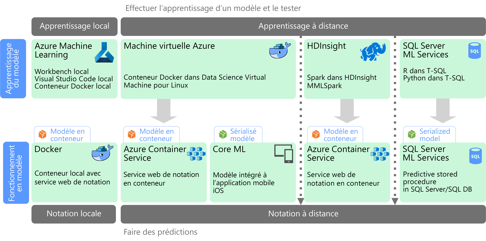

# Machine Learning à l’échelleMachine learning at scale

Machine Learning (ML) est une technique utilisée pour l’apprentissage des modèles prédictifs basé sur des algorithmes mathématiques.Machine learning (ML) is a technique used to train predictive models based on mathematical algorithms. Machine Learning analyse les relations entre les champs de données pour prédire des valeurs inconnues.Machine learning analyzes the relationships between data fields to predict unknown values.

La création et le déploiement d’un modèle Machine Learning constituent un processus itératif :Creating and deploying a machine learning model is an iterative process:

* Les scientifiques de données explorent les données sources pour déterminer les relations entre les *fonctionnalités* et les *étiquettes* prédites.Data scientists explore the source data to determine relationships between *features* and predicted *labels*.
* Les scientifiques de données forment et valident des modèles à l’aide d’algorithmes appropriés afin de rechercher le modèle optimal pour la prédiction.The data scientists train and validate models based on appropriate algorithms to find the optimal model for prediction.
* Le modèle optimal est déployé en production, en tant que service web ou autre fonction encapsulée.The optimal model is deployed into production, as a web service or some other encapsulated function.
* Lorsque de nouvelles données sont collectées, le modèle est régulièrement reformé pour améliorer son efficacité.As new data is collected, the model is periodically retrained to improve its effectiveness.

Machine Learning à l’échelle traite deux problèmes d’évolutivité différents.Machine learning at scale addresses two different scalability concerns. Le premier est l’apprentissage d’un modèle sur des jeux de données volumineux qui nécessitent les fonctionnalités de montée en puissance (scale-out) d’un cluster à former.The first is training a model against large data sets that require the scale-out capabilities of a cluster to train. Le deuxième est l’opérationnisme du modèle formé d’une façon qui peut évoluer pour répondre aux demandes des applications qui le consomme.The second centers is operationalizating the learned model in a way that can scale to meet the demands of the applications that consume it. En général, cela est accompli en déployant les fonctionnalités prédictives en tant que service web qui peut ensuite être monté en puissance.Typically this is accomplished by deploying the predictive capabilities as a web service that can then be scaled out.

Machine Learning à l’échelle présente l’avantage qu’il peut produire des fonctionnalités prédictives, puissantes, car les modèles plus efficaces résultent généralement de davantage de données.Machine learning at scale has the benefit that it can produce powerful, predictive capabilities because better models typically result from more data. Une fois qu’un modèle est formé, il peut être déployé en tant que service web sans état, très performant, capable de monter en puissance.Once a model is trained, it can be deployed as a stateless, highly-performant, scale-out web service. 

## Préparation et formation du modèleModel preparation and training

Pendant la phase de préparation et de formation du modèle, les scientifiques de données explorent les données de manière interactive à l’aide de langages tels que Python et R pour :During the model preparation and training phase, data scientists explore the data interactively using languages like Python and R to:

* Extraire des exemples à partir d’entrepôts de données volumineux.Extract samples from high volume data stores.
* Rechercher et traiter les valeurs hors norme, les doublons et les valeurs manquantes pour nettoyer les données.Find and treat outliers, duplicates, and missing values to clean the data.
* Déterminer les corrélations et les relations dans les données via l’analyse statistique et la visualisation.Determine correlations and relationships in the data through statistical analysis and visualization.
* Générer de nouvelles fonctionnalités calculées qui améliorent la prévisibilité des relations statistiques.Generate new calculated features that improve the predictiveness of statistical relationships.
* Former des modèles ML à l’aide d’algorithmes prédictifs.Train ML models based on predictive algorithms.
* Valider les modèles formés à l’aide de données retenues pendant la formation.Validate trained models using data that was withheld during training.

Pour prendre en charge cette phase d’analyse interactive et de modélisation, la plateforme de données doit permettre aux scientifiques de données d’explorer les données à l’aide de divers outils.To support this interactive analysis and modeling phase, the data platform must enable data scientists to explore data using a variety of tools. En outre, l’apprentissage d’un modèle Machine Learning complexe peut nécessiter le traitement intensif de grands volumes de données, donc il est essentiel de disposer de ressources suffisantes pour la montée en puissance de l’apprentissage du modèle.Additionally, the training of a complex machine learning model can require a lot of intensive processing of high volumes of data, so sufficient resources for scaling out the model training is essential.

## Déploiement et consommation du modèleModel deployment and consumption

Lorsqu’un modèle est prêt à être déployé, il peut être encapsulé en tant que service web et déployé sur le cloud, dans un appareil de périphérie ou au sein d’un environnement d’exécution ML d’entreprise.When a model is ready to be deployed, it can be encapsulated as a web service and deployed in the cloud, to an edge device, or within an enterprise ML execution environment. Ce processus de déploiement est appelé opérationnalisme.This deployment process is referred to as operationalization.

## DéfisChallenges

Machine Learning à l’échelle présente quelques défis :Machine learning at scale produces a few challenges:

- Vous avez généralement besoin d’une grande quantité de données pour former un modèle, en particulier pour les modèles d’apprentissage profond.You typically need a lot of data to train a model, especially for deep learning models.
- Vous devez préparer ces jeux de données volumineux avant même de pouvoir commencer à former votre modèle.You need to prepare these big data sets before you can even begin training your model.
- La phase de formation du modèle doit accéder aux magasins de données volumineux.The model training phase must access the big data stores. Il est courant d’effectuer l’apprentissage du modèle à l’aide du même cluster de données volumineux, comme Spark, que celui utilisé pour la préparation des données.It's common to perform the model training using the same big data cluster, such as Spark, that is used for data preparation. 
- Pour les scénarios comme l’apprentissage profond, vous aurez non seulement besoin d’un cluster qui peut fournir la montée en puissance sur des unités centrales, mais votre cluster devra aussi se composer de nœuds GPU.For scenarios such as deep learning, not only will you need a cluster that can provide you scale out on CPUs, but your cluster will need to consist of GPU-enabled nodes.

## Machine Learning à l’échelle dans AzureMachine learning at scale in Azure

Avant de choisir les services ML à utiliser pour l’apprentissage et l’opérationnalisme, vous devez vous demander si vous avez besoin de former un modèle ou si un modèle prédéfini peut répondre à vos besoins.Before deciding which ML services to use in training and operationalization, consider whether you need to train a model at all, or if a prebuilt model can meet your requirements. Dans de nombreux cas, l’utilisation d’un modèle prédéfini consiste simplement à appeler un service web ou à utiliser une bibliothèque ML pour charger un modèle existant.In many cases, using a prebuilt model is just a matter of calling a web service or using an ML library to load an existing model. Certaines options incluent :Some options include: 

- Utiliser les services web fournis par Microsoft Cognitive Services.Use the web services provided by Microsoft Cognitive Services.
- Utiliser les modèles de réseau neuronal préformés fournis par Cognitive Toolkit.Use the pretrained neural network models provided by Cognitive Toolkit.
- Incorporer les modèles sérialisés fournis par Core ML pour les applications iOS.Embed the serialized models provided by Core ML for an iOS apps. 

Si un modèle prédéfini ne correspond pas à vos données ou à votre scénario, les options Azure incluent Azure Machine Learning, HDInsight avec Spark MLlib et MMLSpark, Cognitive Toolkit et SQL Machine Learning Services.If a prebuilt model does not fit your data or your scenario, options in Azure include Azure Machine Learning, HDInsight with Spark MLlib and MMLSpark, Cognitive Toolkit, and SQL Machine Learning Services. Si vous décidez d’utiliser un modèle personnalisé, vous devez créer un pipeline qui inclut l’apprentissage et l’opérationnalisme du modèle.If you decide to use a custom model, you must design a pipeline that includes model training and operationalization. 

Pour obtenir la liste des choix technologiques pour ML dans Azure, consultez les rubriques suivantes :For a list of technology choices for ML in Azure, see the following topics:

- [Sélectionner une technologie Cognitive ServicesChoosing a cognitive services technology](../technology-choices/cognitive-services.md)
- [Sélectionner une technologie Machine LearningChoosing a machine learning technology](../technology-choices/data-science-and-machine-learning.md)
- [Choisir une technologie de traitement du langage naturelChoosing a natural language processing technology](../technology-choices/natural-language-processing.md)
