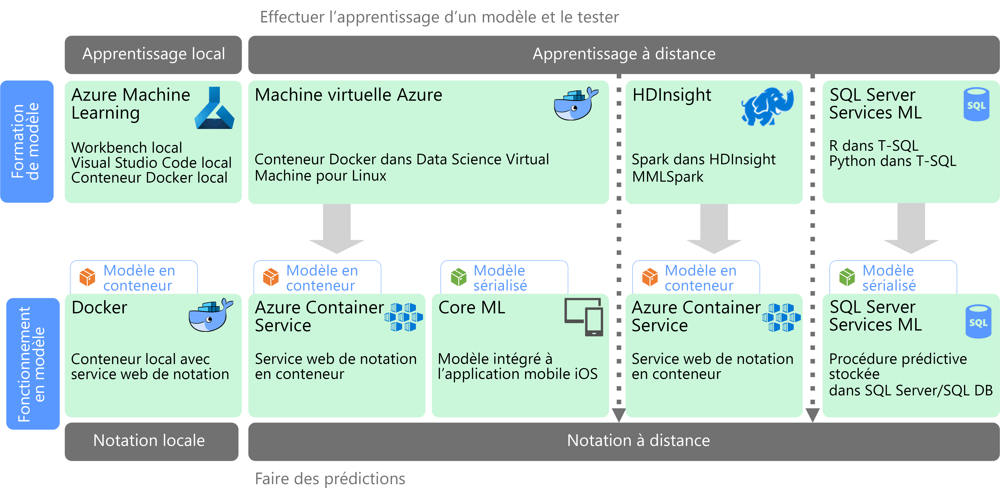

# Machine Learning à grande échelle

Le Machine Learning (ML) est une technique utilisée pour entraîner des modèles prédictifs en se basant sur des algorithmes mathématiques. Le Machine Learning analyse les relations entre les champs de données pour prédire des valeurs inconnues.

La création et le déploiement d’un modèle Machine Learning constituent un processus itératif :

* Les scientifiques des données explorent les données sources pour déterminer les relations entre les *caractéristiques* et les *étiquettes* prédites.
* Les scientifiques des données entraînent et valident des modèles à l’aide d’algorithmes appropriés afin de rechercher le modèle optimal pour la prédiction.
* Le modèle optimal est déployé en production, en tant que service web ou autre fonction encapsulée.
* Lorsque de nouvelles données sont collectées, le modèle est régulièrement réentraîné pour améliorer son efficacité.

Le Machine Learning à grande échelle traite deux problèmes de scalabilité différents. Le premier est l’entraînement d’un modèle sur des jeux de données volumineux qui nécessitent les fonctionnalités de scale-out d’un cluster à entraîner. Le deuxième est l’opérationnalisation du modèle entraîné d’une façon qui peut évoluer pour répondre aux demandes des applications qui le consomme. En général, cela est accompli en déployant les fonctionnalités prédictives en tant que service web qui peut ensuite être monté en puissance.

Le Machine Learning à grande échelle présente l’avantage qu’il peut produire des fonctionnalités prédictives, puissantes, car les modèles plus efficaces résultent généralement de davantage de données. Une fois qu’un modèle est entraîné, il peut être déployé en tant que service web de scale-out sans état très performant. 

## Préparation et entraînement des modèles

Pendant la phase de préparation et d’entraînement des modèles, les scientifiques des données explorent les données de manière interactive à l’aide de langages tels que Python et R pour :

* Extraire des exemples à partir d’entrepôts de données volumineux.
* Rechercher et traiter les valeurs hors norme, les doublons et les valeurs manquantes pour nettoyer les données.
* Déterminer les corrélations et les relations dans les données via l’analyse statistique et la visualisation.
* Générer de nouvelles fonctionnalités calculées qui améliorent la prévisibilité des relations statistiques.
* Entraîner des modèles ML à l’aide d’algorithmes prédictifs.
* Valider les modèles entraînés à l’aide de données retenues pendant l’entraînement.

Pour prendre en charge cette phase d’analyse interactive et de modélisation, la plateforme de données doit permettre aux scientifiques des données d’explorer les données à l’aide de divers outils. De plus, l’entraînement d’un modèle Machine Learning complexe peut nécessiter le traitement intensif de grands volumes de données, donc il est essentiel de disposer de ressources suffisantes pour le scale-out de l’entrainement du modèle.

## Déploiement et consommation du modèle

Lorsqu’un modèle est prêt à être déployé, il peut être encapsulé en tant que service web et déployé sur le cloud, dans un appareil de périphérie ou au sein d’un environnement d’exécution ML d’entreprise. Ce processus de déploiement est appelé opérationnalisation.

## Défis

Le Machine Learning à l’échelle présente quelques défis :

- Vous avez généralement besoin d’une grande quantité de données pour entraîner un modèle, en particulier pour les modèles d’apprentissage profond.
- Vous devez préparer ces jeux de données volumineux avant même de pouvoir commencer à entraîner votre modèle.
- La phase d’entraînement du modèle doit accéder aux magasins de données volumineux. Il est courant d’effectuer l’entraînement du modèle à l’aide du même cluster de données volumineux, comme Spark, que celui utilisé pour la préparation des données. 
- Pour les scénarios comme l’apprentissage profond, vous aurez non seulement besoin d’un cluster qui peut fournir un scale-out sur les GPU, mais aussi d’un cluster composé de nœuds GPU.

## Machine Learning à grande échelle dans Azure

Avant de choisir les services ML à utiliser pour l’entraînement et l’opérationnalisation, vous devez vous demander si vous avez besoin d’entraîner un modèle ou si un modèle prédéfini peut répondre à vos besoins. Dans de nombreux cas, l’utilisation d’un modèle prédéfini consiste simplement à appeler un service web ou à utiliser une bibliothèque ML pour charger un modèle existant. Certaines options incluent : 

- Utiliser les services web fournis par Microsoft Cognitive Services.
- Utiliser les modèles de réseau neuronal préentraînés fournis par Cognitive Toolkit.
- Incorporer les modèles sérialisés fournis par Core ML pour les applications iOS. 

Si un modèle prédéfini ne correspond pas à vos données ou à votre scénario, les options Azure incluent Azure Machine Learning, HDInsight avec Spark MLlib et MMLSpark, Azure Databricks, Cognitive Toolkit et SQL Machine Learning Services. Si vous décidez d’utiliser un modèle personnalisé, vous devez créer un pipeline qui inclut l’entraînement et l’opérationnalisation du modèle. 

Pour obtenir la liste des choix technologiques pour ML dans Azure, consultez les rubriques suivantes :

- [Sélectionner une technologie Cognitive Services](../technology-choices/cognitive-services.md)
- [Sélectionner une technologie Machine Learning](../technology-choices/data-science-and-machine-learning.md)
- [Choisir une technologie de traitement du langage naturel](../technology-choices/natural-language-processing.md)

## Étapes suivantes

Les architectures de référence suivantes présentent des scénarios de Machine Learning dans Azure :

- [Scoring par lots dans Azure pour les modèles d’apprentissage profond](../../reference-architectures/ai/batch-scoring-deep-learning.md)
- [Scoring en temps réel des modèles Python Scikit-Learn et Apprentissage profond sur Azure](../../reference-architectures/ai/realtime-scoring-python.md)