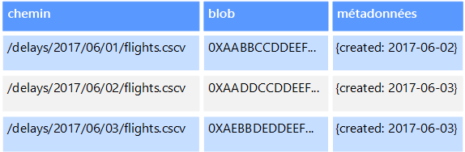
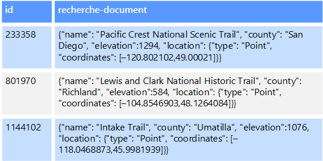

# Données non relationnelles et NoSQL

Une *base de données non relationnelle* est une base de données qui n’utilise pas le schéma tabulaire sous forme de lignes et de colonnes présent dans la plupart des systèmes de base de données plus traditionnels. Au lieu de cela, les bases de données non relationnelles utilisent un modèle de stockage qui est optimisé pour les exigences spécifiques du type des données stockées. Par exemple, les données peuvent être stockées sous forme de paires clé/valeur simples, de documents JSON ou de graphe comprenant des arêtes et des sommets. 

Tous ces magasins de données ont en commun qu’ils n’utilisent pas un [modèle relationnel](../relational-data/index.md). En outre, ils ont tendance à être plus précis dans le type de données pris en charge et la façon dont les données peuvent être interrogées. Par exemple, les magasins de données de séries chronologiques sont optimisés pour les requêtes sur des séquences de données temporelles, tandis que les magasins de données de graphes sont optimisés pour explorer les relations pondérées entre des entités. Aucun des deux formats n’est adapté à la tâche de gestion des données transactionnelles. 

Le terme *NoSQL* fait référence à des magasins de données qui n’utilisent pas SQL pour les requêtes et qui, à la place, utilisent d’autres langages de programmation et constructions pour interroger les données. Dans la pratique, « NoSQL » signifie « base de données non relationnelle », même si la plupart de ces bases de données prennent en charge les requêtes SQL compatibles. Toutefois, la stratégie d’exécution de requête sous-jacente est généralement très différente de la façon dont un SGBDR traditionnel exécute la même requête SQL.

Les sections suivantes décrivent les principales catégories d’une base de données non relationnelle ou NoSQL.

## Magasins de données de documents
Un magasin de données de documents gère un ensemble de champs de type chaîne nommés et de valeurs de données d’objet dans une entité appelée un *document*. En règle générale, ces magasins de données stockent des données sous la forme de documents JSON. Chaque valeur de champ peut être un élément scalaire, comme un nombre, ou un élément composé, comme une liste ou une collection parent-enfant. Les données dans les champs d’un document peuvent être encodées de différentes façons, notamment XML, YAML, JSON, BSON ou même stockées comme du texte brut. Les champs dans les documents sont exposés au système de gestion de stockage, permettant à une application d’interroger et de filtrer des données en utilisant les valeurs de ces champs.  

En règle générale, un document contient la totalité des données pour une entité. Les éléments constituant une entité sont spécifiques à l’application. Par exemple, une entité peut contenir les détails d’un client, d’une commande ou une combinaison des deux. Un seul document peut contenir des informations réparties sur plusieurs tables relationnelles dans un système de gestion de base de données relationnelle (SGBDR). Un magasin de documents ne demande pas que tous les documents possèdent la même structure. Cette approche de forme libre offre une grande flexibilité. Par exemple, les applications peuvent stocker des données différentes dans des documents selon les changements d’exigence de l’entreprise.  

  

L’application peut récupérer des documents à l’aide de la clé de document. Il s’agit d’un identificateur unique pour le document, souvent haché, pour aider à répartir les données uniformément. Certaines bases de données de documents créent automatiquement la clé de document. D’autres permettent de spécifier un attribut du document pour l’utiliser comme clé. L’application peut également interroger des documents en fonction de la valeur d’un ou plusieurs champs. Certaines bases de données de documents prennent en charge l’indexation pour faciliter la recherche rapide de documents basée sur un ou plusieurs champs indexés.  

Plusieurs bases de données de documents prennent en charge les mises à jour sur place, permettant à une application de modifier les valeurs des champs spécifiques dans un document sans réécrire la totalité du document. Les opérations de lecture et d’écriture sur plusieurs champs dans un seul document sont généralement atomiques.

Service Azure approprié :  

- [Azure Cosmos DB](https://azure.microsoft.com/services/cosmos-db/)

## Magasins de données de colonnes
Un magasin de données de colonnes ou de familles de colonnes organise les données en lignes et colonnes. Dans sa forme la plus simple, un magasin de données de familles de colonnes peut sembler, au moins sur le plan conceptuel, très similaire à une base de données relationnelle. La puissance d’une base de données de familles de colonnes se trouve dans son approche dénormalisée pour la structuration des données éparses, qui découle de l’approche en colonnes pour stocker les données.  

Vous pouvez considérer un magasin de données de familles de colonnes comme contenant des données tabulaires avec des lignes et des colonnes, mais les colonnes sont divisées en groupes nommés familles de colonnes. Chaque famille de colonnes conserve un ensemble de colonnes logiquement liées entre elles et généralement récupérées ou manipulées en tant qu’unité. Les autres données accessibles séparément peuvent être stockées dans des familles de colonnes distinctes. Dans une famille de colonnes, de nouvelles colonnes peuvent être ajoutées dynamiquement, et des lignes peuvent être incomplètes (autrement dit, une ligne n’a pas besoin d’avoir une valeur pour chaque colonne). 

Le diagramme suivant montre un exemple avec deux familles de colonnes, `Identity` et `Contact Info`. Les données d’une même entité ont la même clé de ligne dans chaque famille de colonnes. Cette structure, où les lignes pour un objet donné dans une famille de colonnes peuvent être modifiées dynamiquement, constitue un avantage important de l’approche par famille de colonnes, rendant cette forme de magasin de données hautement adaptée pour le stockage des données avec des schémas différents.

Contrairement à un magasin de clés/valeurs ou une base de données de documents, la plupart des bases de données de familles de colonnes stockent physiquement les données dans l’ordre des clés, plutôt qu’en calculant un hachage. La clé de ligne est considérée comme l’index primaire et permet un accès basé sur clé via une clé spécifique ou une plage de clés. Certaines nombreuses implémentations permettent de créer des index secondaires sur des colonnes spécifiques dans une famille de colonnes. Les index secondaires vous permettent de récupérer des données à partir de la valeur des colonnes, au lieu d’utiliser la clé de ligne.

Sur le disque, toutes les colonnes d’une famille de colonnes sont stockées dans le même fichier, avec un certain nombre de lignes dans chaque fichier. Pour les jeux de données volumineux, cette approche crée un gain de performances en réduisant la quantité de données qui doivent être lues à partir du disque lorsque seules quelques colonnes sont interrogées conjointement à la fois. 

Les opérations de lecture et d’écriture pour une ligne sont généralement atomiques avec une famille de colonnes unique, même si certaines implémentations permettent l’atomicité sur la ligne entière, couvrant alors plusieurs familles de colonne.

Service Azure approprié :  

- [HBase dans HDInsight](/azure/hdinsight/hdinsight-hbase-overview)

## Magasins de données de clés/valeurs
Un magasin de clés/valeurs est essentiellement une table de hachage volumineuse. Vous associez chaque valeur de données à une clé unique, le magasin de clés/valeurs utilise cette clé pour stocker les données à l’aide d’une fonction de hachage appropriée. La fonction de hachage est sélectionnée pour offrir une répartition des clés hachées sur le stockage de données.

La plupart des magasins de clés/valeurs prennent uniquement en charge les opérations simples de requête, d’insertion et de suppression. Pour modifier une valeur (partiellement ou entièrement), une application doit remplacer les données existantes pour la valeur entière. Dans la plupart des implémentations, la lecture ou écriture d’une valeur unique est une opération atomique. Si la valeur est grande, l’écriture peut prendre un certain temps.

Une application peut stocker des données arbitraires en tant qu’ensemble de valeurs, bien que certains magasins de clés/valeurs imposent des limites sur la taille maximale des valeurs. Les valeurs stockées sont opaques pour le logiciel de système de stockage. Toutes les informations de schéma doivent être fournies et interprétées par l’application. Fondamentalement, les valeurs sont des objets BLOB et le magasin de clés/valeurs récupère ou stocke simplement la valeur par clé.

Les magasins de clés/valeurs sont optimisés pour les applications effectuant des recherches simples à l’aide de la valeur de la clé, ou d’une plage de clés, mais sont moins adaptés aux systèmes qui doivent interroger des données entre différentes tables de clés/valeurs, comme la jointure de données entre plusieurs tables. 

Les magasins de clés/valeurs ne sont pas optimisés pour les scénarios où la requête ou le filtrage par des valeurs autres que la clé est plus importante que les recherches basées uniquement sur les clés. Par exemple, avec une base de données relationnelle, vous pouvez rechercher un enregistrement à l’aide d’une clause WHERE pour filtrer les colonnes non-clés, mais généralement les magasins de clés/valeurs ne disposent pas de ce type de fonctionnalité de recherche pour les valeurs, ou s’ils en disposent, la fonctionnalité requiert une analyse lente de toutes les valeurs.

Un magasin de clés/valeurs unique peut être extrêmement évolutif, étant donné qu’il peut facilement distribuer des données entre plusieurs nœuds sur des machines distinctes.

Services Azure appropriés :  
- [API Table d’Azure Cosmos DB](/azure/cosmos-db/table-introduction)  
- [Cache Redis Azure](https://azure.microsoft.com/services/cache/)  
- [Stockage Table Azure](https://azure.microsoft.com/services/storage/tables/)

## Magasins de données de graphes
Un magasin de données de graphes gère deux types d’informations, les nœuds et les bords. Les nœuds représentent des entités et les bords définissent les relations entre ces entités. Les nœuds et les bords peuvent avoir des propriétés fournissant des informations sur ce nœud ou ce bord, semblables aux colonnes dans une table. Les bords peuvent également avoir un sens indiquant la nature de la relation.  

Un magasin de données de graphes vise à permettre à une application d’effectuer efficacement des requêtes parcourant le réseau de nœuds de bords et d’analyser les relations entre des entités. Le diagramme suivant montre la structure de données du personnel d’une entreprise sous forme de graphe. Les entités sont les employés et les services, les bords indiquent les relations hiérarchiques et le service de chaque employé. Dans ce graphique, les flèches sur les bords indiquent le sens des relations.

Cette structure simplifie l’exécution de requêtes telles que « Trouver tous les employés qui rendent compte directement ou indirectement à Sarah » ou « Qui travaille dans le même service que John ? » Pour les graphiques de grande taille avec un grand nombre d’entités et de relations, vous pouvez effectuer des analyses très complexes en un temps record. Plusieurs bases de données de graphiques fournissent un langage de requête que vous pouvez utiliser pour parcourir efficacement un réseau de relations.  

Service Azure approprié :  
- [API Graph Azure Cosmos DB](/azure/cosmos-db/graph-introduction)  

## Magasin de données de séries chronologiques
Les données de séries chronologiques sont des ensembles de valeurs organisées par l’heure, et un magasin de données de séries chronologiques est optimisé pour ce type de données. Les magasins de données de séries chronologiques doivent prendre en charge un très grand nombre d’écritures, étant donné qu’ils collectent généralement d’importantes quantités de données en temps réel à partir d’un grand nombre de sources. Les magasins de données de séries chronologiques sont optimisés pour le stockage des données de télémétrie. Les scénarios incluent des capteurs IoT ou des compteurs de l’application ou du système. Les mises à jour sont rares, et les suppressions sont souvent réalisées par des opérations en bloc.

Bien que les enregistrements écrits dans une base de données de séries chronologiques soient généralement petits, il existe souvent un grand nombre d’enregistrements, et la taille totale des données peut croître rapidement. Les données de séries chronologiques stockent également les données en désordre et en retard, l’indexation automatique des points de données et les optimisations pour les requêtes décrites en termes de fenêtres de temps. Cette dernière fonctionnalité permet aux requêtes de s’exécuter sur des millions de points de données et plusieurs flux de données rapidement, afin de prendre en charge les visualisations de série chronologique, qui est une façon courante dont les données de série chronologique sont consommées. 

Pour plus d’informations, consultez [Solutions de la série chronologique](../scenarios/time-series.md)

Service Azure approprié :  
- [Azure Time Series Insights](https://azure.microsoft.com/services/time-series-insights/)  
- [OpenTSDB avec HBase sur HDInsight](/azure/hdinsight/hdinsight-hbase-overview)

## Magasins de données d’objet
Les magasins de données d’objet sont optimisés pour le stockage et la récupération d’objets binaires volumineux ou d’objets blob (images, fichiers texte, flux vidéo et audio, objets de données d’application et documents de grande taille, images de disque de machine virtuelle). Un objet est composé des données stockées, de métadonnées et d’un ID unique pour accéder à l’objet. Les magasins d’objets sont conçus pour prendre en charge les fichiers qui sont individuellement très volumineux et pour fournir une grande quantité d’espace de stockage afin de gérer tous les fichiers.  

Certains magasins de données d’objet répliquent un objet blob donné entre plusieurs nœuds de serveur, ce qui permet des lectures rapides en parallèle. Ceci permet ensuite l’interrogation avec montée en puissance des données contenues dans des fichiers volumineux, car plusieurs processus, généralement exécutés sur des serveurs différents, peuvent interroger le fichier de données volumineux simultanément.

Le partage de fichiers réseau constitue un cas particulier en termes de magasins de données d’objet. L’utilisation de partages de fichiers permet d’accéder à des fichiers via un réseau à l’aide de protocoles réseau standard, comme SMB. Compte tenu de la sécurité et des mécanismes de contrôle d’accès simultanés, un tel partage de données peut permettre aux services distribués de fournir un accès de données hautement évolutif pour effectuer des opérations de base et de bas niveau telles que des requêtes simples de lecture et d’écriture.

Service Azure approprié :   

- [Stockage Blob Azure](https://azure.microsoft.com/services/storage/blobs/)  
- [Azure Data Lake Store](https://azure.microsoft.com/services/data-lake-store/)  
- [Stockage Fichier Azure](https://azure.microsoft.com/services/storage/files/)  

## Magasins de données d’index externe

Les magasins de données d’index externe fournissent la possibilité de rechercher des informations contenues dans d’autres magasins de données et services. Un index externe agit comme un index secondaire pour tout magasin de données, et peut être utilisé pour indexer des volumes importants de données et fournir un accès à ces index quasiment en temps réel. 

Par exemple, vous pouvez avoir des fichiers texte stockés dans un système de fichiers. La recherche d’un fichier par son chemin d’accès est rapide, mais la recherche en fonction du contenu du fichier nécessite une analyse de tous les fichiers, une opération lente. Un index externe vous permet de créer des index de recherche secondaires et de rechercher rapidement le chemin d’accès aux fichiers qui correspondent à vos critères. Un autre exemple d’application d’un index externe concerne les magasins de clés/valeurs qui indexent uniquement en fonction de la clé. Vous pouvez créer un index secondaire basé sur les valeurs dans les données et rechercher rapidement la clé qui identifie de façon unique chaque élément mis en correspondance. 

Les index sont créés par l’exécution d’un processus d’indexation. L’indexation peut être effectuée à l’aide d’un modèle Pull d’extraction, déclenché par le magasin de données, ou à l’aide d’un modèle Push d’émission, initié par le code de l’application. Les index peuvent être multidimensionnels et peuvent prendre en charge les recherches en texte libre sur de grands volumes de données de texte. 

Les magasins de données d’index externe sont souvent utilisés pour prendre en charge la recherche en texte intégral et recherche basée sur le web. Dans ces cas, la recherche peut être exacte ou approximative. Une recherche approximative trouve les documents correspondant à un ensemble de conditions et calcule leur niveau de correspondance. Certains index externes prennent également en charge l’analyse linguistique qui peut retourner des correspondances basées sur des synonymes, les expansions de genre (par exemple, faire correspondre « dogs » à « pets ») et la recherche de radical (par exemple, la recherche de « run » correspond également à « ran » et « running »). 

Service Azure approprié :  

- [Azure Search](https://azure.microsoft.com/services/search/)

## Exigences standard
Les magasins de données non relationnels utilisent souvent une architecture de stockage différente de celle utilisée par les bases de données relationnelles. Plus précisément, ils ont tendance à n’avoir aucun schéma fixe. En outre, ils ont tendance à ne pas prendre en charge les transactions, ou à limiter la portée des transactions, et ils ne comprennent pas en général d’index secondaires pour des raisons d’évolutivité.

La liste suivante compare la configuration requise pour chaque magasin de données non relationnel :

| Prérequis | Données de document | Données de familles de colonnes | Données de clés/valeurs | Données de graphes | 
| --- | --- | --- | --- | --- | 
| Normalisation | Dénormalisé | Dénormalisé | Dénormalisé | Normalisé | 
| Schéma | Schéma lors de la lecture | Familles de colonnes définies lors de l’écriture, schéma de colonne lors de la lecture | Schéma lors de la lecture | Schéma lors de la lecture | 
| Cohérence (sur transactions simultanées) | Cohérence ajustable, garanties au niveau du document | Famille de colonnes&ndash;garanties de niveau | Garanties de niveau clé | Garanties de niveau graphe 
| Atomicité (étendue de transaction) | Collection | Table | Table | Graph | 
| Stratégie de verrouillage | Optimiste (verrouillage libre) | Pessimiste (verrous de ligne) | Optimiste (ETag) | 
| Modèle d’accès | Accès aléatoire | Agrégats sur données hautes/larges | Accès aléatoire | Accès aléatoire |
| Indexation | Index primaires et secondaires | Index primaires et secondaires | Index primaire uniquement | Index primaires et secondaires | 
| Forme des données | Document | Tabulaire avec familles de colonnes contenant des colonnes | Clé et valeur | Graphe contenant des bords et des sommets | 
| Partiellement alloué | OUI | OUI | OUI | Non  | 
| Large (un grand nombre de colonnes et d’attributs) | OUI | OUI | Non  | Non  |  
| Taille de donnée | Petite (Ko) à moyenne (faible Mo) | Moyenne (Mo) à grande (faible Go) | Petite (Ko) | Petite (Ko) | 
| Échelle maximale globale | Très grande (Po) | Très grande (Po) | Très grande (Po) | Grande (To) | 

| Prérequis | Données de séries chronologiques | Données d’objet | Données d’index externe |
| --- | --- | --- | --- |
| Normalisation | Normalisé | Dénormalisé | Dénormalisé |
| Schéma | Schéma lors de la lecture | Schéma lors de la lecture | Schéma lors de l’écriture | 
| Cohérence (sur transactions simultanées) | N/A | N/A | N/A | 
| Atomicité (étendue de transaction) | N/A | Object | N/A |
| Stratégie de verrouillage | N/A | Pessimiste (verrous de blob) | N/A |
| Modèle d’accès | Agrégation et accès aléatoire | Accès séquentiel | Accès aléatoire | 
| Indexation | Index primaires et secondaires | Index primaire uniquement | N/A |
| Forme des données | Tabulaire | Blob et métadonnées | Document |
| Partiellement alloué | Non  | N/A | Non  | 
| Large (un grand nombre de colonnes et d’attributs) |  Non  | OUI | OUI |  
| Taille de donnée | Petite (Ko) | Grande (Go) à très grande (To) | Petite (Ko) |
| Échelle maximale globale | Grande (faible To)  | Très grande (Po) | Grande (faible To) | 

