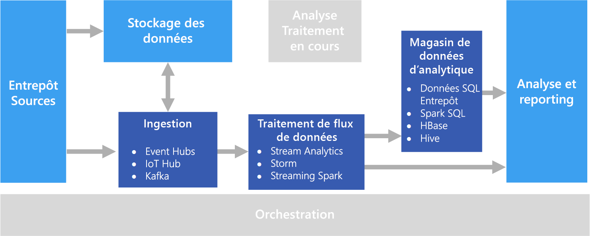

# Traitement en temps réel

Le traitement en temps réel concerne les flux de données capturés en temps réel et traités avec une latence minimale pour générer des réponses automatisées ou des rapports en temps réel (ou en quasi-temps réel). Par exemple, une solution de contrôle du trafic en temps réel pourrait utiliser des données de capteur pour détecter des pics de trafic. Ces données permettraient de mettre à jour dynamiquement une carte montrant les embouteillages, ou mettre en place automatiquement des voies réservées aux véhicules à occupation multiple ou d’autres systèmes de gestion du trafic.

Le traitement en temps réel se définit comme le traitement d’un flux non borné de données d’entrée, avec des critères de latence très stricts pour le traitement &mdash; en millisecondes ou en secondes. En général, ces données entrantes arrivent dans un format non structuré ou semi-structuré, par exemple, JSON, et ont les mêmes exigences de traitement que le [traitement par lots](./batch-processing.md), mais avec des temps de réponse plus courts pour gérer la consommation en temps réel.

Les données traitées sont souvent écrites dans un magasin de données analytiques, optimisé pour l’analytique et la visualisation. Elles peuvent également être transférées directement dans la couche d’analytique et de création de rapports à des fins d’analyse, d’informatique décisionnelle et de visualisation de tableaux de bord en temps réel.

## Défis

L’une des grandes difficultés des solutions de traitement en temps réel est d’ingérer, de traiter et de stocker les messages en temps réel, en particulier pour les grands volumes. Le traitement doit être effectué de manière à ne pas bloquer le pipeline d’ingestion. Le magasin de données doit prendre en charge de gros volumes d’écritures. Il existe une autre problématique : la capacité à effectuer des actions rapidement à partir des données, par exemple, à générer des alertes en temps réel ou à présenter les données dans un tableau de bord en temps réel (ou en quasi-temps réel).

## Architecture

Une architecture de traitement en temps réel comporte les composants logiques suivants.

- **Ingestion de messages en temps réel**. L’architecture doit prévoir un moyen de capturer et de stocker les messages en temps réel, qui seront exploités par un consommateur de traitement des flux de données. Dans les cas de base, ce service peut être implémenté comme un magasin de données simple au sein duquel les nouveaux messages sont déposés dans un dossier. Mais la solution requiert souvent un répartiteur de messages, comme Azure Event Hubs, qui fonctionne comme un tampon pour les messages. Il doit prendre en charge le traitement avec montée en charge et la distribution fiable.

- **Traitement des flux de données**. Après avoir capturé les messages en temps réel, la solution doit les traiter en filtrant, en agrégeant et, plus généralement, en préparant les données pour l’analyse.

- **Magasin de données analytiques**. De nombreuses solutions Big Data sont conçues pour préparer les données à des fins d’analyse, puis fournir les données traitées dans un format structuré et interrogeable à l’aide d’outils d’analyse. 

- **Analyse et rapports**. La plupart des solutions Big Data ont pour but de fournir des informations sur les données par le biais de l’analyse et des rapports. 

## Choix de technologie

Les technologies suivantes sont recommandées pour les solutions de traitement en temps réel dans Azure.

### Ingestion de messages en temps réel

- **Azure Event Hubs**. Azure Event Hubs est une solution de mise en file d’attente des messages permettant d’ingérer des millions de messages d’événements par seconde. Ces données capturées peuvent être traitées par de nombreux clients en parallèle.
- **Azure IoT Hub**. Azure IoT Hub assure une communication bidirectionnelle entre les appareils connectés à Internet, et propose une file d’attente de messages évolutive capable de gérer des millions d’appareils connectés simultanément.
- **Apache Kafka**. Kafka est une application open source de traitement des flux de données et de mise en file d’attente des messages capable de traiter jusqu’à plusieurs millions de messages par seconde, en provenance de différents producteurs, et de les acheminer vers plusieurs consommateurs. Kafka est disponible dans Azure sous la forme d’un type de cluster HDInsight.

Pour plus d’informations, consultez la page [Ingestion de messages en temps réel](../technology-choices/real-time-ingestion.md).

### Stockage des données

- **Conteneurs Azure Storage Blob** ou **Azure Data Lake Store**. Les données entrantes en temps réel sont généralement capturées dans un répartiteur de messages (voir ci-dessus), mais, dans certains cas, il peut être judicieux de surveiller l’apparition de nouveaux fichiers dans un dossier pour les traiter au fil de leur création ou de leur mise à jour. Par ailleurs, de nombreuses solutions de traitement en temps réel combinent des données de diffusion en continu avec des données de référence statiques, qui peuvent être stockées dans un magasin de fichiers. Enfin, le stockage de fichiers peut servir de destination de sortie pour les données en temps réel capturées à des fins d’archivage, ou en vue de traitements par lots supplémentaires dans une [architecture lambda](../big-data/index.md#lambda-architecture).

Pour plus d’informations, consultez la page [Stockage de données](../technology-choices/data-storage.md).

### Traitement des flux de données

- **Azure Stream Analytics**. Azure Stream Analytics peut exécuter des requêtes perpétuelles sur un flux de données non borné. Ces requêtes consomment des flux de données provenant de répartiteurs de messages ou de stockage, filtrent et agrègent les données en fonction de fenêtres temporelles, et écrivent les résultats dans des récepteurs tels que des systèmes de stockage ou des bases de données, ou directement dans des rapports Power BI. Stream Analytics utilise un langage de requête SQL qui prend en charge des constructions géospatiales et temporelles, et peut être étendu via JavaScript.
- **Storm**. Apache Storm est une infrastructure open source de traitement des flux de données qui utilise une topologie Spout et Bolt pour consommer, traiter et générer les résultats à partir de sources de données de diffusion en continu et en temps réel. Il est possible de configurer Storm dans un cluster Azure HDInsight, et d’implémenter une topologie en Java ou en C#.
- **Spark Streaming**. Apache Spark est une plateforme distribuée open source pour le traitement général des données. Elle comprend l’API Spark Streaming, qui permet d’écrire du code dans n’importe quel langage Spark pris en charge, notamment Java, Scala et Python. Spark 2.0 a introduit l’API Spark Structured Streaming, qui propose un modèle de programmation plus simple et plus cohérent. Spark 2.0 est disponible dans un cluster Azure HDInsight.

Pour plus d’informations, consultez la page [Traitement des flux de données](../technology-choices/stream-processing.md).

### Magasin de données analytiques

- **SQL Data Warehouse**, **HBase**, **Spark** ou **Hive**. Il est possible de stocker les données traitées en temps réel dans une base de données relationnelle comme Azure SQL Data Warehouse, un magasin NoSQL comme HBase, ou en tant que fichiers dans un système de stockage distribué permettant de définir et d’interroger des tables Spark ou Hive.

Pour plus d’informations, consultez la section [Magasins de données analytiques](../technology-choices/analytical-data-stores.md).

### Analytique et création de rapports

- **Azure Analysis Services**, **Power BI** et **Microsoft Excel**. Les données traitées en temps réel qui sont stockées dans un magasin de données analytiques peuvent servir pour les analyses et les rapports historiques de la même façon que des données traitées par lots. Par ailleurs, Power BI permet de publier des visualisations et des rapports en temps réel (ou en quasi-temps réel) à partir de sources de données analytiques si la latence est suffisamment faible, ou, dans certains cas, directement à partir de la sortie de traitement des flux de données.

Pour plus d'informations, consultez la section [Analytique et création de rapports](../technology-choices/analysis-visualizations-reporting.md).

Dans une solution entièrement en temps réel, la majeure partie de l’orchestration est gérée par les composants d’ingestion de messages et de traitement des flux de données. Toutefois, dans une architecture lambda qui combine le traitement par lots et le traitement en temps réel, il vous faudra peut-être utiliser une infrastructure d’orchestration comme Azure Data Factory ou Apache Oozie et Sqoop pour gérer les workflows de traitement par lots des données capturées en temps réel.

## Étapes suivantes

L’architecture de référence suivante présente un pipeline de traitement de flux de bout en bout :

- [Traitement de flux avec Azure Stream Analytics](../../reference-architectures/data/stream-processing-stream-analytics.md)