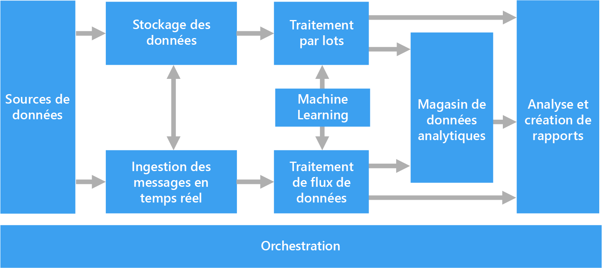
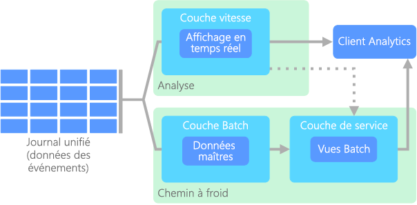
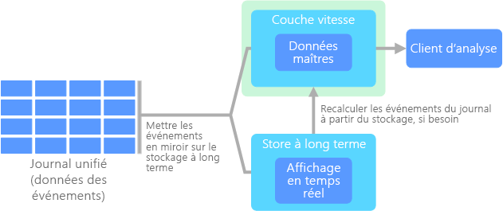

# Architectures de Big DataBig data architectures

Une architecture Big Data est conçue pour gérer l’ingestion, le traitement et l’analyse de données trop volumineuses ou complexes pour les systèmes de base de données traditionnels.A big data architecture is designed to handle the ingestion, processing, and analysis of data that is too large or complex for traditional database systems. Le seuil à partir duquel les organisations basculent dans le domaine Big Data varie selon les capacités des utilisateurs et leurs outils.The threshold at which organizations enter into the big data realm differs, depending on the capabilities of the users and their tools. Pour certaines, ce seuil est fixé à plusieurs centaines de gigaoctets de données, tandis que pour d’autres, il s’agit de centaines de téraoctets.For some, it can mean hundreds of gigabytes of data, while for others it means hundreds of terabytes. L’amélioration des outils de gestion du Big Data redéfinit la notion même de Big Data.As tools for working with big data sets advance, so does the meaning of big data. Ce terme est de plus en plus associé à la valeur que vous pouvez tirer de vos jeux de données via une analytique avancée, plutôt qu’à la taille stricte des données, bien que dans ce cas, ces données ont tendance à être très volumineuses.More and more, this term relates to the value you can extract from your data sets through advanced analytics, rather than strictly the size of the data, although in these cases they tend to be quite large.

Au fil des années, le paysage des données a changé.Over the years, the data landscape has changed. Ce que vous pouvez faire, ou supposer pouvoir faire, avec les données a évolué.What you can do, or are expected to do, with data has changed. Le coût du stockage a considérablement diminué, tandis que les méthodes de collecte de ces données ne cessent de se multiplier.The cost of storage has fallen dramatically, while the means by which data is collected keeps growing. Certaines données affluent à un rythme très soutenu et nécessitent une collecte et une observation permanentes.Some data arrives at a rapid pace, constantly demanding to be collected and observed. D’autres données affluent plus lentement, mais sont très volumineuses, et se présentent souvent sous la forme d’un historique couvrant plusieurs dizaines d’années de données.Other data arrives more slowly, but in very large chunks, often in the form of decades of historical data. Vous pouvez être confronté à un problème d’analytique avancé, ou qui nécessite un apprentissage automatique.You might be facing an advanced analytics problem, or one that requires machine learning. Tels sont les défis que les architectures Big Data tentent de résoudre.These are challenges that big data architectures seek to solve.

Les solutions Big Data impliquent généralement un ou plusieurs des types de charges de travail suivants :Big data solutions typically involve one or more of the following types of workload:

* Traitement par lots des sources Big Data au repos.Batch processing of big data sources at rest.
* Traitement en temps réel des Big Data en mouvement.Real-time processing of big data in motion.
* Exploration interactive des Big Data.Interactive exploration of big data.
* Analyse prédictive et apprentissage machine.Predictive analytics and machine learning.

Utilisez des architectures Big Data lorsque vous devez :Consider big data architectures when you need to:

* Stocker et traiter des données dans des volumes trop vastes pour une base de données traditionnelle.Store and process data in volumes too large for a traditional database.
* Transformer des données non structurées en vue d’une analyse et de la création de rapports.Transform unstructured data for analysis and reporting.
* Capturer, traiter et analyser des flux de données indépendants en temps réel ou avec une faible latence.Capture, process, and analyze unbounded streams of data in real time, or with low latency.

## Composants d’une architecture Big DataComponents of a big data architecture

Le diagramme suivant montre les composants logiques qui constituent une architecture Big Data.The following diagram shows the logical components that fit into a big data architecture. Certaines solutions individuelles ne contiennent pas tous les éléments de ce diagramme.Individual solutions may not contain every item in this diagram.

 

La plupart des architectures Big Data incluent tout ou partie des composants suivants :Most big data architectures include some or all of the following components:

* **Sources de données**.**Data sources**. Toutes les solutions Big Data reposent sur une ou plusieurs sources de données.All big data solutions start with one or more data sources. Voici quelques exemples :Examples include:

    * Magasins de données d’application, tels que des bases de données relationnelles.Application data stores, such as relational databases.
    * Fichiers statiques produits par les applications, tels que les fichiers journaux de serveur web.Static files produced by applications, such as web server log files.
    * Sources de données en temps réel, tels que les appareils IoT.Real-time data sources, such as IoT devices.

* **Stockage des données**.**Data storage**. Les données destinées aux opérations de traitement par lots sont généralement stockées dans un magasin de fichiers distribués, qui peut contenir de vastes volumes de fichiers volumineux dans divers formats.Data for batch processing operations is typically stored in a distributed file store that can hold high volumes of large files in various formats. Ce type de magasin est souvent appelé « *lac de données* ».This kind of store is often called a *data lake*. Les options pour l’implémentation de ce stockage incluent des conteneurs Azure Data Lake Store ou les conteneurs blob dans le stockage Azure.Options for implementing this storage include Azure Data Lake Store or blob containers in Azure Storage.

* **Traitement par lots**.**Batch processing**. Étant donné que les jeux de données sont trop lourds, une solution Big Data doit souvent traiter les fichiers de données à l’aide de traitements par lots à longue durée d’exécution pour filtrer, agréger et préparer les données en vue de l’analyse.Because the data sets are so large, often a big data solution must process data files using long-running batch jobs to filter, aggregate, and otherwise prepare the data for analysis. Généralement, ces travaux impliquent la lecture des fichiers source, leur traitement et l’écriture de la sortie dans de nouveaux fichiers.Usually these jobs involve reading source files, processing them, and writing the output to new files. Les options incluent l’exécution de travaux U-SQL dans Azure Data Lake Analytics, à l’aide de travaux personnalisés de mappage/réduction, Pig ou Hive dans un cluster HDInsight Hadoop ou à l’aide des programmes Java, Scala ou Python dans un cluster HDInsight Spark.Options include running U-SQL jobs in Azure Data Lake Analytics, using Hive, Pig, or custom Map/Reduce jobs in an HDInsight Hadoop cluster, or using Java, Scala, or Python programs in an HDInsight Spark cluster.

* **Ingestion de messages en temps réel**.**Real-time message ingestion**. Si la solution inclut des sources en temps réel, l’architecture doit inclure un moyen pour capturer et stocker des messages en temps réel pour le traitement de flux de données.If the solution includes real-time sources, the architecture must include a way to capture and store real-time messages for stream processing. Il peut s’agir d’un simple magasin de données, où les messages entrants sont déposés dans un dossier en vue du traitement.This might be a simple data store, where incoming messages are dropped into a folder for processing. Toutefois, de nombreuses solutions besoin d’un magasin d’ingestion des messages qui agit comme une mémoire tampon pour les messages et qui prend en charge un traitement de montée en puissance, une remise fiable et d’autres sémantiques de files d’attente de message.However, many solutions need a message ingestion store to act as a buffer for messages, and to support scale-out processing, reliable delivery, and other message queuing semantics. Cette partie d’une architecture de diffusion est communément appelée mise en mémoire tampon du flux.This portion of a streaming architecture is often referred to as stream buffering. Les options incluent Azure Event Hubs, Azure IoT Hub et Kafka.Options include Azure Event Hubs, Azure IoT Hub, and Kafka.

* **Traitement de flux**.**Stream processing**. Après avoir capturé les messages en temps réel, la solution doit les traiter en filtrant, en agrégeant et, plus généralement, en préparant les données pour l’analyse.After capturing real-time messages, the solution must process them by filtering, aggregating, and otherwise preparing the data for analysis. Les données de flux traitées sont ensuite écrites dans un récepteur de sortie.The processed stream data is then written to an output sink. Azure Stream Analytics fournit un service de traitement de flux managé reposant sur des requêtes SQL à l’exécution permanente qui fonctionnent sur les flux de données indépendants.Azure Stream Analytics provides a managed stream processing service based on perpetually running SQL queries that operate on unbounded streams. Vous pouvez également utiliser des technologies de flux Apache open source comme Storm et Spark dans un cluster HDInsight.You can also use open source Apache streaming technologies like Storm and Spark Streaming in an HDInsight cluster.

* **Magasin de données analytique**.**Analytical data store**. De nombreuses solutions Big Data préparent les données pour l’analyse, puis fournissent les données traitées dans un format structuré qui peut être interrogé à l’aide des outils d’analyse.Many big data solutions prepare data for analysis and then serve the processed data in a structured format that can be queried using analytical tools. Le magasin de données analytique utilisé pour répondre à ces requêtes peut être un entrepôt de données relationnelles de type Kimball, comme indiqué dans les solutions décisionnelles (BI) plus traditionnelles.The analytical data store used to serve these queries can be a Kimball-style relational data warehouse, as seen in most traditional business intelligence (BI) solutions. Les données peuvent également être présentées via une technologie NoSQL à faible latence, telle que HBase, ou via une base de données Hive interactif qui fournit une abstraction de métadonnées sur les fichiers de données dans le magasin de données distribuées.Alternatively, the data could be presented through a low-latency NoSQL technology such as HBase, or an interactive Hive database that provides a metadata abstraction over data files in the distributed data store. Azure SQL Data Warehouse fournit un service managé pour l’entreposage cloud des données à grande échelle.Azure SQL Data Warehouse provides a managed service for large-scale, cloud-based data warehousing. HDInsight prend en charge les formats Hive interactif, HBase et Spark SQL, qui peuvent également servir à préparer les données en vue de l’analyse.HDInsight supports Interactive Hive, HBase, and Spark SQL, which can also be used to serve data for analysis.

* **Analyse et rapports**.**Analysis and reporting**. La plupart des solutions Big Data ont pour but de fournir des informations sur les données par le biais de l’analyse et des rapports.The goal of most big data solutions is to provide insights into the data through analysis and reporting. Pour permettre aux utilisateurs d’analyser les données, l’architecture peut inclure une couche de modélisation des données, comme un cube OLAP multidimensionnel ou un modèle de données tabulaire dans Azure Analysis Services.To empower users to analyze the data, the architecture may include a data modeling layer, such as a multidimensional OLAP cube or tabular data model in Azure Analysis Services. Elle peut également prendre en charge le décisionnel libre-service, en utilisant les technologies de modélisation et de visualisation de Microsoft Power BI ou Microsoft Excel.It might also support self-service BI, using the modeling and visualization technologies in Microsoft Power BI or Microsoft Excel. L’analyse et les rapports peuvent aussi prendre la forme d’une exploration interactive des données par les scientifiques de données ou les analystes de données.Analysis and reporting can also take the form of interactive data exploration by data scientists or data analysts. Pour ces scénarios, plusieurs services Azure prennent en charge les blocs-notes analytiques, tels que Jupyter, ce qui permet à ces utilisateurs de tirer parti de leurs connaissances avec Python ou R. Pour l’exploration de données à grande échelle, vous pouvez utiliser Microsoft R Server seul ou avec Spark.For these scenarios, many Azure services support analytical notebooks, such as Jupyter, enabling these users to leverage their existing skills with Python or R. For large-scale data exploration, you can use Microsoft R Server, either standalone or with Spark.

* **Orchestration**.**Orchestration**. La plupart des solutions Big Data consistent en des opérations de traitement de données répétées, encapsulées dans des workflows, qui transforment les données source, déplacent les données entre plusieurs sources et récepteurs, chargent les données traitées dans un magasin de données analytique, ou envoient les résultats directement à un rapport ou à un tableau de bord.Most big data solutions consist of repeated data processing operations, encapsulated in workflows, that transform source data, move data between multiple sources and sinks, load the processed data into an analytical data store, or push the results straight to a report or dashboard. Pour automatiser ces workflows, vous pouvez utiliser une technologie d’orchestration telle qu’Azure Data Factory ou Apache Oozie avec Sqoop.To automate these workflows, you can use an orchestration technology such Azure Data Factory or Apache Oozie and Sqoop.

## Architecture lambdaLambda architecture

Lorsque vous utilisez des jeux de données très volumineux, l'exécution des requêtes des clients peut prendre beaucoup de temps.When working with very large data sets, it can take a long time to run the sort of queries that clients need. Ces requêtes ne peuvent pas être effectuées en temps réel et nécessitent souvent des algorithmes comme [MapReduce](https://en.wikipedia.org/wiki/MapReduce), qui s’exécutent en parallèle sur l’ensemble du jeu de données.These queries can't be performed in real time, and often require algorithms such as [MapReduce](https://en.wikipedia.org/wiki/MapReduce) that operate in parallel across the entire data set. Les résultats sont ensuite stockés séparément des données brutes et utilisés à des fins d’interrogation.The results are then stored separately from the raw data and used for querying.

L’inconvénient de cette approche est qu’elle entraîne une latence &mdash; si le traitement dure quelques heures, une requête peut donc retourner des résultats datant de plusieurs heures.One drawback to this approach is that it introduces latency &mdash; if processing takes a few hours, a query may return results that are several hours old. Dans l’idéal, vous devez obtenir des résultats en temps réel (malgré une certaine perte de précision) et combiner ces résultats avec ceux de l’analyse en mode batch.Ideally, you would like to get some results in real time (perhaps with some loss of accuracy), and combine these results with the results from the batch analytics.

L**’architecture lambda**, proposée pour la première fois par Nathan Marz, résout ce problème en créant deux chemins d’accès aux flux de données.The **lambda architecture**, first proposed by Nathan Marz, addresses this problem by creating two paths for data flow. Toutes les données entrantes dans le système transitent par ces deux chemins d’accès :All data coming into the system goes through these two paths:

* une **couche de traitement par lots** (chemin à froid) stocke toutes les données entrantes dans leur forme brute et effectue un traitement par lots de ces données.A **batch layer** (cold path) stores all of the incoming data in its raw form and performs batch processing on the data. Le résultat de ce traitement est stocké sous forme d’une **vue de traitement par lots**.The result of this processing is stored as a **batch view**.

* Une **couche vitesse** (chemin réactif) analyse les données en temps réel.A **speed layer** (hot path) analyzes data in real time. Cette couche est conçue pour une faible latence, au détriment de la précision.This layer is designed for low latency, at the expense of accuracy.

La couche de traitement par lots alimente une **couche service** qui indexe la vue de traitement par lots pour améliorer l’interrogation.The batch layer feeds into a **serving layer** that indexes the batch view for efficient querying. La couche vitesse met à jour de la couche service avec les mises à jour incrémentielles basées sur les données les plus récentes.The speed layer updates the serving layer with incremental updates based on the most recent data.

Les données qui circulent dans le chemin réactif sont limitées par les conditions de latence imposées par la couche vitesse, afin de garantir un traitement aussi rapide que possible.Data that flows into the hot path is constrained by latency requirements imposed by the speed layer, so that it can be processed as quickly as possible. Souvent, cela nécessite d’accepter une certaine perte de précision afin d’obtenir les données aussi rapidement que possible.Often, this requires a tradeoff of some level of accuracy in favor of data that is ready as quickly as possible. Par exemple, imaginons un scénario IoT où un grand nombre de capteurs de température transmettent des données de télémétrie.For example, consider an IoT scenario where a large number of temperature sensors are sending telemetry data. La couche vitesse permet de traiter les données entrantes dans une fenêtre temporelle coulissante.The speed layer may be used to process a sliding time window of the incoming data. 

En revanche, les données qui transitent par le chemin à froid ne sont pas soumises aux mêmes exigences de faible latence.Data flowing into the cold path, on the other hand, is not subject to the same low latency requirements. Cela permet d’obtenir un calcul plus précis sur plusieurs jeux de données volumineux, une tâche qui peut prendre beaucoup de temps.This allows for high accuracy computation across large data sets, which can be very time intensive. 

Pour finir, le chemin relatif et le chemin à froid convergent au niveau de l’application cliente analytique.Eventually, the hot and cold paths converge at the analytics client application. Si le client a besoin d’afficher en temps opportun des données potentiellement moins précises en temps réel, il obtiendra son résultat avec le chemin réactif.If the client needs to display timely, yet potentially less accurate data in real time, it will acquire its result from the hot path. Sinon, il devra sélectionner les résultats avec le chemin à froid pour obtenir des données plus précises mais à un moment moins opportun.Otherwise, it will select results from the cold path to display less timely but more accurate data. En d’autres termes, le chemin réactif offre des données dans une fenêtre temporelle relativement restreinte, après laquelle les résultats peuvent être mis à jour avec des données plus précises grâce au chemin à froid.In other words, the hot path has data for a relatively small window of time, after which the results can be updated with more accurate data from the cold path.

Les données brutes stockées au niveau de la couche de traitement par lots sont immuables.The raw data stored at the batch layer is immutable. Les données entrantes sont toujours ajoutées aux données existantes, et les données précédentes ne sont jamais remplacées.Incoming data is always appended to the existing data, and the previous data is never overwritten. Toute modification apportée à la valeur d’une donnée particulière est stockée comme un nouvel enregistrement d’événement horodaté.Any changes to the value of a particular datum are stored as a new timestamped event record. Cela permet un recalcul à n’importe quel point dans le temps dans tout l’historique des données collectées.This allows for recomputation at any point in time across the history of the data collected. La possibilité de recalculer la vue de traitement par lots à partir de données brutes d’origine est importante car elle permet de créer de nouvelles vues à mesure que le système évolue.The ability to recompute the batch view from the original raw data is important, because it allows for new views to be created as the system evolves. 

## Architecture kappaKappa architecture

Un inconvénient de l’architecture lambda est sa complexité.A drawback to the lambda architecture is its complexity. La logique de traitement apparaît en deux emplacements différents &mdash; le chemin réactif et le chemin à froid &mdash; avec différentes infrastructures.Processing logic appears in two different places &mdash; the cold and hot paths &mdash; using different frameworks. Cela double la logique de calcul et la complexité de la gestion de l’architecture pour ces deux chemins.This leads to duplicate computation logic and the complexity of managing the architecture for both paths.

L**’architecture kappa** a été proposée par Jay Kreps comme alternative à l’architecture lambda.The **kappa architecture** was proposed by Jay Kreps as an alternative to the lambda architecture. Elle vise les mêmes objectifs de base que l’architecture lambda, mais avec une différence importante : toutes les données transitent via un chemin unique en utilisant un système de traitement de flux.It has the same basic goals as the lambda architecture, but with an important distinction: All data flows through a single path, using a stream processing system. 

Il existe certaines similarités avec la couche de traitement par lots de l’architecture lambda, dans la mesure où les données des événements restent immuables et sont collectées dans leur totalité et non comme un sous-ensemble.There are some similarities to the lambda architecture's batch layer, in that the event data is immutable and all of it is collected, instead of a subset. Les données sont reçues sous forme d’un flux d’événements dans un journal unifié, distribué et tolérance aux pannes.The data is ingested as a stream of events into a distributed and fault tolerant unified log. Ces événements sont classés, et l’état actuel d’un événement change uniquement lorsqu’un nouvel événement est ajouté.These events are ordered, and the current state of an event is changed only by a new event being appended. Comme pour la couche vitesse de l’architecture lambda, tout le traitement des événements est effectué sur le flux d’entrée et perdure sous forme d’une vue en temps réel.Similar to a lambda architecture's speed layer, all event processing is performed on the input stream and persisted as a real-time view. 

Si vous avez besoin de recalculer la totalité du jeu de données (comparable à ce que fait la couche de traitement par lots dans l’architecture lambda), il vous suffit de relancer le flux, généralement en utilisant un parallélisme pour effectuer le calcul en temps opportun.If you need to recompute the entire data set (equivalent to what the batch layer does in lambda), you simply replay the stream, typically using parallelism to complete the computation in a timely fashion.

## Internet des objets (IoT)Internet of Things (IoT)

D’un point de vue pratique, Internet des objets (IoT) représente n’importe quel appareil connecté à Internet.From a practical viewpoint, Internet of Things (IoT) represents any device that is connected to the Internet. Cela inclut votre PC, téléphone mobile, montre connectée, thermostat intelligent, réfrigérateur connecté, véhicule connecté, les appareils de surveillance cardiaque et tout autre appareil qui se connecte à Internet et échange des données.This includes your PC, mobile phone, smart watch, smart thermostat, smart refrigerator, connected automobile, heart monitoring implants, and anything else that connects to the Internet and sends or receives data. Le nombre d’appareils connectés augmente chaque jour, tout comme la quantité de données collectées à partir de ceux-ci.The number of connected devices grows every day, as does the amount of data collected from them. Souvent, ces données sont collectées dans des environnements à fortes contraintes, parfois à latence élevée.Often this data is being collected in highly constrained, sometimes high-latency environments. Dans d’autres cas, les données sont envoyées à partir d’environnements à faible latence par des milliers voire des millions d’appareils, ce qui nécessite de recevoir rapidement les données et de les traiter en conséquence.In other cases, data is sent from low-latency environments by thousands or millions of devices, requiring the ability to rapidly ingest the data and process accordingly. Ainsi, une planification appropriée est requise pour gérer ces contraintes et ces conditions spécifiques.Therefore, proper planning is required to handle these constraints and unique requirements.

Les architectures basées sur les événements sont des éléments essentiels dans les solutions IoT.Event-driven architectures are central to IoT solutions. Le diagramme suivant présente une architecture logique possible pour IoT.The following diagram shows a possible logical architecture for IoT. Le diagramme met en avant les composants de diffusion d’événements de l’architecture.The diagram emphasizes the event-streaming components of the architecture.

La **passerelle cloud** ingère les événements d’appareils à la limite du cloud en utilisant un système de messagerie fiable et à faible latence.The **cloud gateway** ingests device events at the cloud boundary, using a reliable, low latency messaging system.

Les appareils peuvent envoyer les événements directement à la passerelle cloud ou via une **passerelle de champ**.Devices might send events directly to the cloud gateway, or through a **field gateway**. Une passerelle de champ est un appareil ou un logiciel spécialisé, généralement colocalisée avec les appareils, qui reçoit les événements et les transfère à la passerelle cloud.A field gateway is a specialized device or software, usually collocated with the devices, that receives events and forwards them to the cloud gateway. La passerelle de champ peut aussi prétraiter les événements d’appareils bruts, remplissant des fonctions de filtrage, d’agrégation ou de transformation de protocole.The field gateway might also preprocess the raw device events, performing functions such as filtering, aggregation, or protocol transformation.

Après ingestion, les événements transitent par un ou plusieurs **processeurs de flux** qui peuvent acheminer les données (par exemple, vers le stockage) ou procéder à l’analytique et autres traitements.After ingestion, events go through one or more **stream processors** that can route the data (for example, to storage) or perform analytics and other processing.

Voici quelques types de traitement courants.The following are some common types of processing. (Cette liste n’est certainement pas exhaustive.)(This list is certainly not exhaustive.)

- Écriture de données d’événement dans un stockage froid pour archivage ou traitement analytique par lots.Writing event data to cold storage, for archiving or batch analytics.

- Analytique de séquence à chaud (« hot path analytics »), avec une analyse du flux d’événements en (quasi) temps réel, pour détecter les anomalies, reconnaître les modèles dans des fenêtres de temps glissantes ou déclencher des alertes quand une condition spécifique est rencontrée dans le flux.Hot path analytics, analyzing the event stream in (near) real time, to detect anomalies, recognize patterns over rolling time windows, or trigger alerts when a specific condition occurs in the stream. 

- Gestion de types de messages d’appareils non liés à la télémétrie, tels que les notifications et les alarmes.Handling special types of nontelemetry messages from devices, such as notifications and alarms. 

- Apprentissage automatique.Machine learning.

Les cadres gris représentent les composants d’un système IoT qui ne sont pas directement liés à la diffusion d’événements, mais qui sont inclus ici par souci d’exhaustivité.The boxes that are shaded gray show components of an IoT system that are not directly related to event streaming, but are included here for completeness.

- Le **registre d’appareils** est une base de données qui recense les appareils provisionnés, avec notamment leur ID et les métadonnées associées usuelles, telles que l’emplacement.The **device registry** is a database of the provisioned devices, including the device IDs and usually device metadata, such as location.

- L’**API de provisionnement** est une interface externe commune pour provisionner et inscrire de nouveaux appareils.The **provisioning API** is a common external interface for provisioning and registering new devices.

- Certaines solutions IoT autorisent l’envoi de **messages de commande et de contrôle** aux appareils.Some IoT solutions allow **command and control messages** to be sent to devices.

Services Azure appropriés :Relevant Azure services:

- [Azure IoT HubAzure IoT Hub](https://azure.microsoft.com/services/iot-hub/)
- [Azure Event HubsAzure Event Hubs](https://azure.microsoft.com/services/event-hubs/)
- [Azure Stream AnalyticsAzure Stream Analytics](https://azure.microsoft.com/services/stream-analytics/)  

En savoir plus sur IoT sur Azure en consultant la section [Architecture de référence Azure IoT](https://azure.microsoft.com/updates/microsoft-azure-iot-reference-architecture-available/).Learn more about IoT on Azure by reading the [Azure IoT reference architecture](https://azure.microsoft.com/updates/microsoft-azure-iot-reference-architecture-available/).

