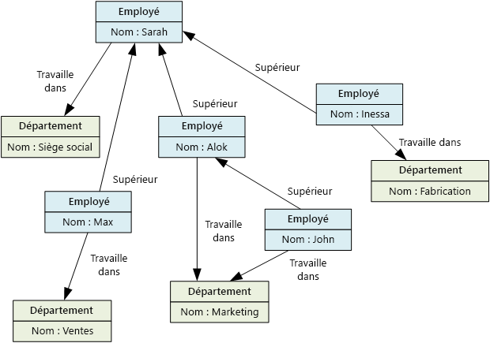

# Données non relationnelles et NoSQLNon-relational data and NoSQL

Une *base de données non relationnelle* est une base de données qui n’utilise pas le schéma tabulaire sous forme de lignes et de colonnes présent dans la plupart des systèmes de base de données plus traditionnels.A *non-relational database* is a database that does not use the tabular schema of rows and columns found in most traditional database systems. Au lieu de cela, les bases de données non relationnelles utilisent un modèle de stockage qui est optimisé pour les exigences spécifiques du type des données stockées.Instead, non-relational databases use a storage model that is optimized for the specific requirements of the type of data being stored. Par exemple, les données peuvent être stockées sous forme de paires clé/valeur simples, de documents JSON ou de graphe comprenant des arêtes et des sommets.For example, data may be stored as simple key/value pairs, as JSON documents, or as a graph consisting of edges and vertices. 

Tous ces magasins de données ont en commun qu’ils n’utilisent pas un [modèle relationnel](./relational-data.md).What all of these data stores have in common is that they don't use a [relational model](./relational-data.md). En outre, ils ont tendance à être plus précis dans le type de données pris en charge et la façon dont les données peuvent être interrogées.Also, they tend to be more specific in the type of data they support and how data can be queried. Par exemple, les magasins de données de séries chronologiques sont optimisés pour les requêtes sur des séquences de données temporelles, tandis que les magasins de données de graphes sont optimisés pour explorer les relations pondérées entre des entités.For example, time series data stores are optimized for queries over time-based sequences of data, while graph data stores are optimized for exploring weighted relationships between entities. Aucun des deux formats n’est adapté à la tâche de gestion des données transactionnelles.Neither format would generalize well to the task of managing transactional data. 

Le terme *NoSQL* fait référence à des magasins de données qui n’utilisent pas SQL pour les requêtes et qui, à la place, utilisent d’autres langages de programmation et constructions pour interroger les données.The term *NoSQL* refers to data stores that do not use SQL for queries, and instead use other programming languages and constructs to query the data. Dans la pratique, « NoSQL » signifie « base de données non relationnelle », même si la plupart de ces bases de données prennent en charge les requêtes SQL compatibles.In practice, "NoSQL" means "non-relational database," even though many of these databases do support SQL-compatible queries. Toutefois, la stratégie d’exécution de requête sous-jacente est généralement très différente de la façon dont un SGBDR traditionnel exécute la même requête SQL.However, the underlying query execution strategy is usually very different from the way a traditional RDBMS would execute the same SQL query.

Les sections suivantes décrivent les principales catégories d’une base de données non relationnelle ou NoSQL.The following sections describe the major categories of non-relational or NoSQL database.

## Magasins de données de documentsDocument data stores
Un magasin de données de documents gère un ensemble de champs de type chaîne nommés et de valeurs de données d’objet dans une entité appelée un *document*.A document data store manages a set of named string fields and object data values in an entity referred to as a *document*. En règle générale, ces magasins de données stockent des données sous la forme de documents JSON.These data stores typically store data in the form of JSON documents. Chaque valeur de champ peut être un élément scalaire, comme un nombre, ou un élément composé, comme une liste ou une collection parent-enfant.Each field value could be a scalar item, such as a number, or a compound element, such as a list or a parent-child collection. Les données dans les champs d’un document peuvent être encodées de différentes façons, notamment XML, YAML, JSON, BSON ou même stockées comme du texte brut.The data in the fields of a document can be encoded in a variety of ways, including XML, YAML, JSON, BSON, or even stored as plain text. Les champs dans les documents sont exposés au système de gestion de stockage, permettant à une application d’interroger et de filtrer des données en utilisant les valeurs de ces champs.The fields within documents are exposed to the storage management system, enabling an application to query and filter data by using the values in these fields.  

En règle générale, un document contient la totalité des données pour une entité.Typically, a document contains the entire data for an entity. Les éléments constituant une entité sont spécifiques à l’application.What items constitute an entity are application specific. Par exemple, une entité peut contenir les détails d’un client, d’une commande ou une combinaison des deux.For example, an entity could contain the details of a customer, an order, or a combination of both. Un seul document peut contenir des informations réparties sur plusieurs tables relationnelles dans un système de gestion de base de données relationnelle (SGBDR).A single document might contain information that would be spread across several relational tables in a relational database management system (RDBMS). Un magasin de documents ne demande pas que tous les documents possèdent la même structure.A document store does not require that all documents have the same structure. Cette approche de forme libre offre une grande flexibilité.This free-form approach provides a great deal of flexibility. Par exemple, les applications peuvent stocker des données différentes dans des documents selon les changements d’exigence de l’entreprise.For example, applications can store different data in documents in response to a change in business requirements.  

  

L’application peut récupérer des documents à l’aide de la clé de document.The application can retrieve documents by using the document key. Il s’agit d’un identificateur unique pour le document, souvent haché, pour aider à répartir les données uniformément.This is a unique identifier for the document, which is often hashed, to help distribute data evenly. Certaines bases de données de documents créent automatiquement la clé de document.Some document databases create the document key automatically. D’autres permettent de spécifier un attribut du document pour l’utiliser comme clé.Others enable you to specify an attribute of the document to use as the key. L’application peut également interroger des documents en fonction de la valeur d’un ou plusieurs champs.The application can also query documents based on the value of one or more fields. Certaines bases de données de documents prennent en charge l’indexation pour faciliter la recherche rapide de documents basée sur un ou plusieurs champs indexés.Some document databases support indexing to facilitate fast lookup of documents based on one or more indexed fields.  

Plusieurs bases de données de documents prennent en charge les mises à jour sur place, permettant à une application de modifier les valeurs des champs spécifiques dans un document sans réécrire la totalité du document.Many document databases support in-place updates, enabling an application to modify the values of specific fields in a document without rewriting the entire document. Les opérations de lecture et d’écriture sur plusieurs champs dans un seul document sont généralement atomiques.Read and write operations over multiple fields in a single document are usually atomic.

Service Azure approprié :Relevant Azure service:  

- [Azure Cosmos DBAzure Cosmos DB](https://azure.microsoft.com/services/cosmos-db/)

## Magasins de données de colonnesColumnar data stores
Un magasin de données de colonnes ou de familles de colonnes organise les données en lignes et colonnes.A columnar or column-family data store organizes data into columns and rows. Dans sa forme la plus simple, un magasin de données de familles de colonnes peut sembler, au moins sur le plan conceptuel, très similaire à une base de données relationnelle.In its simplest form, a column-family data store can appear very similar to a relational database, at least conceptually. La puissance d’une base de données de familles de colonnes se trouve dans son approche dénormalisée pour la structuration des données éparses, qui découle de l’approche en colonnes pour stocker les données.The real power of a column-family database lies in its denormalized approach to structuring sparse data, which stems from the column-oriented approach to storing data.  

Vous pouvez considérer un magasin de données de familles de colonnes comme contenant des données tabulaires avec des lignes et des colonnes, mais les colonnes sont divisées en groupes nommés familles de colonnes.You can think of a column-family data store as holding tabular data with rows and columns, but the columns are divided into groups known as column families. Chaque famille de colonnes conserve un ensemble de colonnes logiquement liées entre elles et généralement récupérées ou manipulées en tant qu’unité.Each column family holds a set of columns that are logically related and are typically retrieved or manipulated as a unit. Les autres données accessibles séparément peuvent être stockées dans des familles de colonnes distinctes.Other data that is accessed separately can be stored in separate column families. Dans une famille de colonnes, de nouvelles colonnes peuvent être ajoutées dynamiquement, et des lignes peuvent être incomplètes (autrement dit, une ligne n’a pas besoin d’avoir une valeur pour chaque colonne).Within a column family, new columns can be added dynamically, and rows can be sparse (that is, a row doesn't need to have a value for every column). 

Le diagramme suivant montre un exemple avec deux familles de colonnes, `Identity` et `Contact Info`.The following diagram shows an example with two column families, `Identity` and `Contact Info`. Les données d’une même entité ont la même clé de ligne dans chaque famille de colonnes.The data for a single entity has the same row key in each column family. Cette structure, où les lignes pour un objet donné dans une famille de colonnes peuvent être modifiées dynamiquement, constitue un avantage important de l’approche par famille de colonnes, rendant cette forme de magasin de données hautement adaptée pour le stockage des données avec des schémas différents.This structure, where the rows for any given object in a column family can vary dynamically, is an important benefit of the column-family approach, making this form of data store highly suited for storing data with varying schemas.

Contrairement à un magasin de clés/valeurs ou une base de données de documents, la plupart des bases de données de familles de colonnes stockent physiquement les données dans l’ordre des clés, plutôt qu’en calculant un hachage.Unlike a key/value store or a document database, most column-family databases physically store data in key order, rather than by computing a hash. La clé de ligne est considérée comme l’index primaire et permet un accès basé sur clé via une clé spécifique ou une plage de clés.The row key is considered the primary index and enables key-based access via a specific key or a range of keys. Certaines nombreuses implémentations permettent de créer des index secondaires sur des colonnes spécifiques dans une famille de colonnes.Some implementations allow you to create secondary indexes over specific columns in a column family. Les index secondaires vous permettent de récupérer des données à partir de la valeur des colonnes, au lieu d’utiliser la clé de ligne.Secondary indexes let you retrieve data by columns value, rather than row key.

Sur le disque, toutes les colonnes d’une famille de colonnes sont stockées dans le même fichier, avec un certain nombre de lignes dans chaque fichier.On disk, all of the columns within a column family are stored together in the same file, with a certain number of rows in each file. Pour les jeux de données volumineux, cette approche crée un gain de performances en réduisant la quantité de données qui doivent être lues à partir du disque lorsque seules quelques colonnes sont interrogées conjointement à la fois.With large data sets, this approach creates a performance benefit by reducing the amount of data that needs to be read from disk when only a few columns are queried together at a time. 

Les opérations de lecture et d’écriture pour une ligne sont généralement atomiques avec une famille de colonnes unique, même si certaines implémentations permettent l’atomicité sur la ligne entière, couvrant alors plusieurs familles de colonne.Read and write operations for a row are usually atomic within a single column family, although some implementations provide atomicity across the entire row, spanning multiple column families.

Service Azure approprié :Relevant Azure service:  

- [HBase dans HDInsightHBase in HDInsight](/azure/hdinsight/hdinsight-hbase-overview)

## Magasins de données de clés/valeursKey/value data stores
Un magasin de clés/valeurs est essentiellement une table de hachage volumineuse.A key/value store is essentially a large hash table. Vous associez chaque valeur de données à une clé unique, le magasin de clés/valeurs utilise cette clé pour stocker les données à l’aide d’une fonction de hachage appropriée.You associate each data value with a unique key, and the key/value store uses this key to store the data by using an appropriate hashing function. La fonction de hachage est sélectionnée pour offrir une répartition des clés hachées sur le stockage de données.The hashing function is selected to provide an even distribution of hashed keys across the data storage.

La plupart des magasins de clés/valeurs prennent uniquement en charge les opérations simples de requête, d’insertion et de suppression.Most key/value stores only support simple query, insert, and delete operations. Pour modifier une valeur (partiellement ou entièrement), une application doit remplacer les données existantes pour la valeur entière.To modify a value (either partially or completely), an application must overwrite the existing data for the entire value. Dans la plupart des implémentations, la lecture ou écriture d’une valeur unique est une opération atomique.In most implementations, reading or writing a single value is an atomic operation. Si la valeur est grande, l’écriture peut prendre un certain temps.If the value is large, writing may take some time.

Une application peut stocker des données arbitraires en tant qu’ensemble de valeurs, bien que certains magasins de clés/valeurs imposent des limites sur la taille maximale des valeurs.An application can store arbitrary data as a set of values, although some key/value stores impose limits on the maximum size of values. Les valeurs stockées sont opaques pour le logiciel de système de stockage.The stored values are opaque to the storage system software. Toutes les informations de schéma doivent être fournies et interprétées par l’application.Any schema information must be provided and interpreted by the application. Fondamentalement, les valeurs sont des objets BLOB et le magasin de clés/valeurs récupère ou stocke simplement la valeur par clé.Essentially, values are blobs and the key/value store simply retrieves or stores the value by key.

Les magasins de clés/valeurs sont optimisés pour les applications effectuant des recherches simples à l’aide de la valeur de la clé, ou d’une plage de clés, mais sont moins adaptés aux systèmes qui doivent interroger des données entre différentes tables de clés/valeurs, comme la jointure de données entre plusieurs tables.Key/value stores are highly optimized for applications performing simple lookups using the value of the key, or by a range of keys, but are less suitable for systems that need to query data across different tables of keys/values, such as joining data across multiple tables. 

Les magasins de clés/valeurs ne sont pas optimisés pour les scénarios où la requête ou le filtrage par des valeurs autres que la clé est plus importante que les recherches basées uniquement sur les clés.Key/value stores are also not optimized for scenarios where querying or filtering by non-key values is important, rather than performing lookups based only on keys. Par exemple, avec une base de données relationnelle, vous pouvez rechercher un enregistrement à l’aide d’une clause WHERE pour filtrer les colonnes non-clés, mais généralement les magasins de clés/valeurs ne disposent pas de ce type de fonctionnalité de recherche pour les valeurs, ou s’ils en disposent, la fonctionnalité requiert une analyse lente de toutes les valeurs.For example, with a relational database, you can find a record by using a WHERE clause to filter the non-key columns, but key/values stores usually do not have this type of lookup capability for values, or if they do it requires a slow scan of all values.

Un magasin de clés/valeurs unique peut être extrêmement évolutif, étant donné qu’il peut facilement distribuer des données entre plusieurs nœuds sur des machines distinctes.A single key/value store can be extremely scalable, as the data store can easily distribute data across multiple nodes on separate machines.

Services Azure appropriés :Relevant Azure services:  
- [API Table d’Azure Cosmos DBAzure Cosmos DB Table API](/azure/cosmos-db/table-introduction)  
- [Cache Redis AzureAzure Redis Cache](https://azure.microsoft.com/services/cache/)  
- [Stockage Table AzureAzure Table Storage](https://azure.microsoft.com/services/storage/tables/)

## Magasins de données de graphesGraph data stores
Un magasin de données de graphes gère deux types d’informations, les nœuds et les bords.A graph data store manages two types of information, nodes and edges. Les nœuds représentent des entités et les bords définissent les relations entre ces entités.Nodes represent entities, and edges specify the relationships between these entities. Les nœuds et les bords peuvent avoir des propriétés fournissant des informations sur ce nœud ou ce bord, semblables aux colonnes dans une table.Both nodes and edges can have properties that provide information about that node or edge, similar to columns in a table. Les bords peuvent également avoir un sens indiquant la nature de la relation.Edges can also have a direction indicating the nature of the relationship.  

Un magasin de données de graphes vise à permettre à une application d’effectuer efficacement des requêtes parcourant le réseau de nœuds de bords et d’analyser les relations entre des entités.The purpose of a graph data store is to allow an application to efficiently perform queries that traverse the network of nodes and edges, and to analyze the relationships between entities. Le diagramme suivant montre la structure de données du personnel d’une entreprise sous forme de graphe.The following diagram shows an organization's personnel data structured as a graph. Les entités sont les employés et les services, les bords indiquent les relations hiérarchiques et le service de chaque employé.The entities are employees and departments, and the edges indicate reporting relationships and the department in which employees work. Dans ce graphique, les flèches sur les bords indiquent le sens des relations.In this graph, the arrows on the edges show the direction of the relationships.

Cette structure simplifie l’exécution de requêtes telles que « Trouver tous les employés qui rendent compte directement ou indirectement à Sarah » ou « Qui travaille dans le même service que John ? »This structure makes it straightforward to perform queries such as "Find all employees who report directly or indirectly to Sarah" or "Who works in the same department as John?" Pour les graphiques de grande taille avec un grand nombre d’entités et de relations, vous pouvez effectuer des analyses très complexes en un temps record.For large graphs with lots of entities and relationships, you can perform very complex analyses very quickly. Plusieurs bases de données de graphiques fournissent un langage de requête que vous pouvez utiliser pour parcourir efficacement un réseau de relations.Many graph databases provide a query language that you can use to traverse a network of relationships efficiently.  

Service Azure approprié :Relevant Azure service:  
- [API Graph Azure Cosmos DBAzure Cosmos DB Graph API](/azure/cosmos-db/graph-introduction)  

## Magasin de données de séries chronologiquesTime series data stores
Les données de séries chronologiques sont des ensembles de valeurs organisées par l’heure, et un magasin de données de séries chronologiques est optimisé pour ce type de données.Time series data is a set of values organized by time, and a time series data store is optimized for this type of data. Les magasins de données de séries chronologiques doivent prendre en charge un très grand nombre d’écritures, étant donné qu’ils collectent généralement d’importantes quantités de données en temps réel à partir d’un grand nombre de sources.Time series data stores must support a very high number of writes, as they typically collect large amounts of data in real time from a large number of sources. Les magasins de données de séries chronologiques sont optimisés pour le stockage des données de télémétrie.Time series data stores are optimized for storing telemetry data. Les scénarios incluent des capteurs IoT ou des compteurs de l’application ou du système.Scenarios include IoT sensors or application/system counters. Les mises à jour sont rares, et les suppressions sont souvent réalisées par des opérations en bloc.Updates are rare, and deletes are often done as bulk operations.

Bien que les enregistrements écrits dans une base de données de séries chronologiques soient généralement petits, il existe souvent un grand nombre d’enregistrements, et la taille totale des données peut croître rapidement.Although the records written to a time series database are generally small, there are often a large number of records, and total data size can grow rapidly. Les données de séries chronologiques stockent également les données en désordre et en retard, l’indexation automatique des points de données et les optimisations pour les requêtes décrites en termes de fenêtres de temps.Time series data stores also handle out-of-order and late-arriving data, automatic indexing of data points, and optimizations for queries described in terms of windows of time. Cette dernière fonctionnalité permet aux requêtes de s’exécuter sur des millions de points de données et plusieurs flux de données rapidement, afin de prendre en charge les visualisations de série chronologique, qui est une façon courante dont les données de série chronologique sont consommées.This last feature enables queries to run across millions of data points and multiple data streams quickly, in order to support time series visualizations, which is a common way that time series data is consumed. 

Pour plus d’informations, consultez [Solutions de la série chronologique](../scenarios/time-series.md)For more information, see [Time series solutions](../scenarios/time-series.md)

Service Azure approprié :Relevant Azure service:  
- [Azure Time Series InsightsAzure Time Series Insights](https://azure.microsoft.com/services/time-series-insights/)  
- [OpenTSDB avec HBase sur HDInsightOpenTSDB with HBase on HDInsight](/azure/hdinsight/hdinsight-hbase-overview)

## Magasins de données d’objetObject data stores
Les magasins de données d’objet sont optimisés pour le stockage et la récupération d’objets binaires volumineux ou d’objets blob (images, fichiers texte, flux vidéo et audio, objets de données d’application et documents de grande taille, images de disque de machine virtuelle).Object data stores are optimized for storing and retrieving large binary objects or blobs such as images, text files, video and audio streams, large application data objects and documents, and virtual machine disk images. Un objet est composé des données stockées, de métadonnées et d’un ID unique pour accéder à l’objet.An object consists of the stored data, some metadata, and a unique ID for accessing the object. Les magasins d’objets sont conçus pour prendre en charge les fichiers qui sont individuellement très volumineux et pour fournir une grande quantité d’espace de stockage afin de gérer tous les fichiers.Object stores are designed to support files that are individually very large, as well provide large amounts of total storage to manage all files.  

Certains magasins de données d’objet répliquent un objet blob donné entre plusieurs nœuds de serveur, ce qui permet des lectures rapides en parallèle.Some object data stores replicate a given blob across multiple server nodes, which enables fast parallel reads. Ceci permet ensuite l’interrogation avec montée en puissance des données contenues dans des fichiers volumineux, car plusieurs processus, généralement exécutés sur des serveurs différents, peuvent interroger le fichier de données volumineux simultanément.This in turn enables the scale-out querying of data contained in large files, because multiple processes, typically running on different servers, can each query the large data file simultaneously.

Le partage de fichiers réseau constitue un cas particulier en termes de magasins de données d’objet.One special case of object data stores is the network file share. L’utilisation de partages de fichiers permet d’accéder à des fichiers via un réseau à l’aide de protocoles réseau standard, comme SMB.Using file shares enables files to be accessed across a network using standard networking protocols like server message block (SMB). Compte tenu de la sécurité et des mécanismes de contrôle d’accès simultanés, un tel partage de données peut permettre aux services distribués de fournir un accès de données hautement évolutif pour effectuer des opérations de base et de bas niveau telles que des requêtes simples de lecture et d’écriture.Given appropriate security and concurrent access control mechanisms, sharing data in this way can enable distributed services to provide highly scalable data access for basic, low level operations such as simple read and write requests.

Service Azure approprié :Relevant Azure service:   

- [Stockage Blob AzureAzure Blob Storage](https://azure.microsoft.com/services/storage/blobs/)  
- [Azure Data Lake StoreAzure Data Lake Store](https://azure.microsoft.com/services/data-lake-store/)  
- [Stockage Fichier AzureAzure File Storage](https://azure.microsoft.com/services/storage/files/)  

## Magasins de données d’index externeExternal index data stores

Les magasins de données d’index externe fournissent la possibilité de rechercher des informations contenues dans d’autres magasins de données et services.External index data stores provide the ability to search for information held in other data stores and services. Un index externe agit comme un index secondaire pour tout magasin de données, et peut être utilisé pour indexer des volumes importants de données et fournir un accès à ces index quasiment en temps réel.An external index acts as a secondary index for any data store, and can be used to index massive volumes of data and provide near real-time access to these indexes. 

Par exemple, vous pouvez avoir des fichiers texte stockés dans un système de fichiers.For example, you might have text files stored in a file system. La recherche d’un fichier par son chemin d’accès est rapide, mais la recherche en fonction du contenu du fichier nécessite une analyse de tous les fichiers, une opération lente.Finding a file by its file path is quick, but searching based on the contents of the file would require a scan of all of the files, which is slow. Un index externe vous permet de créer des index de recherche secondaires et de rechercher rapidement le chemin d’accès aux fichiers qui correspondent à vos critères.An external index lets you create secondary search indexes and then quickly find the path to the files that match your criteria. Un autre exemple d’application d’un index externe concerne les magasins de clés/valeurs qui indexent uniquement en fonction de la clé.Another example application of an external index is with key/value stores that only index by the key. Vous pouvez créer un index secondaire basé sur les valeurs dans les données et rechercher rapidement la clé qui identifie de façon unique chaque élément mis en correspondance.You can build a secondary index based on the values in the data, and quickly look up the key that uniquely identifies each matched item. 

Les index sont créés par l’exécution d’un processus d’indexation.The indexes are created by running an indexing process. L’indexation peut être effectuée à l’aide d’un modèle Pull d’extraction, déclenché par le magasin de données, ou à l’aide d’un modèle Push d’émission, initié par le code de l’application.This can be performed using a pull model, triggered by the data store, or using a push model, initiated by application code. Les index peuvent être multidimensionnels et peuvent prendre en charge les recherches en texte libre sur de grands volumes de données de texte.Indexes can be multidimensional and may support free-text searches across large volumes of text data. 

Les magasins de données d’index externe sont souvent utilisés pour prendre en charge la recherche en texte intégral et recherche basée sur le web.External index data stores are often used to support full text and web based search. Dans ces cas, la recherche peut être exacte ou approximative.In these cases, searching can be exact or fuzzy. Une recherche approximative trouve les documents correspondant à un ensemble de conditions et calcule leur niveau de correspondance.A fuzzy search finds documents that match a set of terms and calculates how closely they match. Certains index externes prennent également en charge l’analyse linguistique qui peut retourner des correspondances basées sur des synonymes, les expansions de genre (par exemple, faire correspondre « dogs » à « pets ») et la recherche de radical (par exemple, la recherche de « run » correspond également à « ran » et « running »).Some external indexes also support linguistic analysis that can return matches based on synonyms, genre expansions (for example, matching "dogs" to "pets"), and stemming (for example, searching for "run" also matches "ran" and "running"). 

Service Azure approprié :Relevant Azure service:  

- [Azure SearchAzure Search](https://azure.microsoft.com/services/search/)

## Exigences standardTypical requirements
Les magasins de données non relationnels utilisent souvent une architecture de stockage différente de celle utilisée par les bases de données relationnelles.Non-relational data stores often use a different storage architecture from that used by relational databases. Plus précisément, ils ont tendance à n’avoir aucun schéma fixe.Specifically, they tend towards having no fixed schema. En outre, ils ont tendance à ne pas prendre en charge les transactions, ou à limiter la portée des transactions, et ils ne comprennent pas en général d’index secondaires pour des raisons d’évolutivité.Also, they tend not to support transactions, or else restrict the scope of transactions, and they generally don't include secondary indexes for scalability reasons.

La liste suivante compare la configuration requise pour chaque magasin de données non relationnel :The following compares the requirements for each of the non-relational data stores:

| PrérequisRequirement | Données de documentDocument data | Données de familles de colonnesColumn-family data | Données de clés/valeursKey/value data | Données de graphesGraph data | 
| --- | --- | --- | --- | --- | 
| NormalisationNormalization | DénormaliséDenormalized | DénormaliséDenormalized | DénormaliséDenormalized | NormaliséNormalized | 
| SchémaSchema | Schéma lors de la lectureSchema on read | Familles de colonnes définies lors de l’écriture, schéma de colonne lors de la lectureColumn families defined on write, column schema on read | Schéma lors de la lectureSchema on read | Schéma lors de la lectureSchema on read | 
| Cohérence (sur transactions simultanées)Consistency (across concurrent transactions) | Cohérence ajustable, garanties au niveau du documentTunable consistency, document-level guarantees | Famille de colonnes&ndash;garanties de niveauColumn-family&ndash;level guarantees | Garanties de niveau cléKey-level guarantees | Garanties de niveau grapheGraph-level guarantees 
| Atomicité (étendue de transaction)Atomicity (transaction scope) | CollectionCollection | TableTable | TableTable | GraphGraph | 
| Stratégie de verrouillageLocking Strategy | Optimiste (verrouillage libre)Optimistic (lock free) | Pessimiste (verrous de ligne)Pessimistic (row locks) | Optimiste (ETag)Optimistic (ETag) | 
| Modèle d’accèsAccess pattern | Accès aléatoireRandom access | Agrégats sur données hautes/largesAggregates on tall/wide data | Accès aléatoireRandom access | Accès aléatoireRandom access |
| IndexationIndexing | Index primaires et secondairesPrimary and secondary indexes | Index primaires et secondairesPrimary and secondary indexes | Index primaire uniquementPrimary index only | Index primaires et secondairesPrimary and secondary indexes | 
| Forme des donnéesData shape | DocumentDocument | Tabulaire avec familles de colonnes contenant des colonnesTabular with column families containing columns | Clé et valeurKey and value | Graphe contenant des bords et des sommetsGraph containing edges and vertices | 
| Partiellement allouéSparse | OUIYes | OUIYes | OUIYes | Non No | 
| Large (un grand nombre de colonnes et d’attributs)Wide (lots of columns/attributes) | OUIYes | OUIYes | Non No | Non No |  
| Taille de donnéeDatum size | Petite (Ko) à moyenne (faible Mo)Small (KBs) to medium (low MBs) | Moyenne (Mo) à grande (faible Go)Medium (MBs) to Large (low GBs) | Petite (Ko)Small (KBs) | Petite (Ko)Small (KBs) | 
| Échelle maximale globaleOverall Maximum Scale | Très grande (Po)Very Large (PBs) | Très grande (Po)Very Large (PBs) | Très grande (Po)Very Large (PBs) | Grande (To)Large (TBs) | 

| PrérequisRequirement | Données de séries chronologiquesTime series data | Données d’objetObject data | Données d’index externeExternal index data |
| --- | --- | --- | --- |
| NormalisationNormalization | NormaliséNormalized | DénormaliséDenormalized | DénormaliséDenormalized |
| SchémaSchema | Schéma lors de la lectureSchema on read | Schéma lors de la lectureSchema on read | Schéma lors de l’écritureSchema on write | 
| Cohérence (sur transactions simultanées)Consistency (across concurrent transactions) | N/AN/A | N/AN/A | N/AN/A | 
| Atomicité (étendue de transaction)Atomicity (transaction scope) | N/AN/A | ObjectObject | N/AN/A |
| Stratégie de verrouillageLocking Strategy | N/AN/A | Pessimiste (verrous de blob)Pessimistic (blob locks) | N/AN/A |
| Modèle d’accèsAccess pattern | Agrégation et accès aléatoireRandom access and aggregation | Accès séquentielSequential access | Accès aléatoireRandom access | 
| IndexationIndexing | Index primaires et secondairesPrimary and secondary indexes | Index primaire uniquementPrimary index only | N/AN/A |
| Forme des donnéesData shape | TabulaireTabular | Blob et métadonnéesBlob and metadata | DocumentDocument |
| Partiellement allouéSparse | Non No | N/AN/A | Non No | 
| Large (un grand nombre de colonnes et d’attributs)Wide (lots of columns/attributes) |  Non No | OUIYes | OUIYes |  
| Taille de donnéeDatum size | Petite (Ko)Small (KBs) | Grande (Go) à très grande (To)Large (GBs) to Very Large (TBs) | Petite (Ko)Small (KBs) |
| Échelle maximale globaleOverall Maximum Scale | Grande (faible To)Large (low TBs)  | Très grande (Po)Very Large (PBs) | Grande (faible To)Large (low TBs) | 

