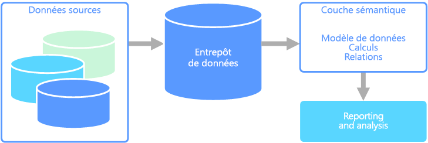

# Modélisation sémantique

Un modèle de données sémantique est un modèle conceptuel qui décrit la signification des éléments de données qu’il contient. Les organisations ont souvent leurs propres termes pour désigner certaines choses, parfois avec des synonymes ou encore des significations différentes pour le même terme. Par exemple, une base de données d’inventaire peut effectuer le suivi d’un équipement avec un ID de ressource et un numéro de série, mais une base de données de ventes peut faire référence au numéro de série en tant qu’ID de ressource. Il n’existe aucun moyen simple de relier ces valeurs sans un modèle qui décrit la relation. 

La modélisation sémantique fournit un niveau d’abstraction sur le schéma de base de données, afin que les utilisateurs n’aient pas besoin de connaître les structures de données sous-jacentes. Cela permet aux utilisateurs finaux d’interroger facilement des données sans effectuer d’agrégats et de jointures sur le schéma sous-jacent. En outre, les colonnes sont généralement renommées avec des noms plus conviviaux, afin que le contexte et la signification des données soient plus évidents.

La modélisation sémantique est principalement utilisée pour les scénarios intensifs en lecture, comme l’analytique et la Business Intelligence (OLAP), par opposition au traitement des données transactionnelles (OLTP) plus intensif en écriture. Ceci est principalement dû à la nature d’une couche sémantique classique :

- Les comportements d’agrégation sont définis de façon à ce que les outils de création de rapports les affichent correctement.
- La logique métier et les calculs sont définis.
- Les calculs axés sur le temps sont inclus.
- Les données sont souvent intégrées à partir de plusieurs sources. 

En règle générale, la couche sémantique est placée sur un entrepôt de données pour ces raisons.

Il existe deux types de modèles sémantiques principaux :

* **Tabulaire**. Utilise des constructions de modélisation relationnelle (modèle, tables, colonnes). En interne, les métadonnées sont héritées de constructions de modélisation OLAP (cubes, dimensions, mesures). Le code et le script utilisent des métadonnées OLAP.
* **Multidimensionnel**. Utilise des constructions de modélisation OLAP traditionnelles (cubes, dimensions, mesures).

Service Azure approprié :
- [Azure Analysis Services](https://azure.microsoft.com/services/analysis-services/)

## Exemple de cas d’usage

Une organisation a des données stockées dans une base de données volumineuse. Elle souhaite rendre ces données disponibles pour les utilisateurs professionnels et les clients afin qu’ils puissent créer leurs propres rapports et effectuer des analyses. Une option consiste simplement à attribuer aux utilisateurs un accès direct à la base de données. Toutefois, cela comporte plusieurs inconvénients, notamment la gestion de la sécurité et le contrôle d’accès. En outre, la conception de la base de données, notamment les noms des tables et des colonnes, peut être difficile à comprendre pour un utilisateur. Il faudrait que les utilisateurs sachent quelles tables interroger, comment ces tables doivent être jointes et la logique métier à appliquer pour obtenir des résultats corrects. Il faudrait aussi que les utilisateurs connaissent un langage de requête comme SQL afin de se lancer. En règle générale, cela donne plusieurs utilisateurs utilisant les mêmes métriques de création de rapports, mais avec des résultats différents.

Une autre option consiste à encapsuler toutes les informations dont les utilisateurs ont besoin dans un modèle sémantique. Le modèle sémantique peut être plus facilement interrogé par les utilisateurs avec l’outil de création de rapports de leur choix. Les données fournies par le modèle sémantique sont extraites d’un entrepôt de données. Tous les utilisateurs voient donc une seule et même version de la vérité. Le modèle sémantique fournit également des noms de tables et de colonnes conviviaux, des relations entre les tables, des descriptions, des calculs et une sécurité de niveau ligne.

## Caractéristiques par défaut de la modélisation sémantique

La modélisation sémantique et le traitement analytique ont généralement les caractéristiques suivantes :

| Prérequis | Description |
| --- | --- |
| Schéma | Schéma lors de l’écriture, fortement appliqué|
| Utilise des transactions | Non  |
| Stratégie de verrouillage | Aucun |
| Peut être mise à jour | Non (requiert généralement le recalcul du cube) |
| Modifiable | Non (requiert généralement le recalcul du cube) |
| Charge de travail | Lectures intensives, en lecture seule |
| Indexation | Indexation multidimensionnelle |
| Taille de donnée | Petite à moyenne taille |
| Modèle | Multidimensionnel |
| Forme des données :| Cube ou étoile/schéma en flocon |
| Flexibilité de requête | Très flexible |
| Échelle : | Grande (10 s-100 s Go) |

## Voir aussi

- [Entrepôt de données](../scenarios/data-warehousing.md)
- [Traitement analytique en ligne (OLAP)](../scenarios/online-analytical-processing.md)
