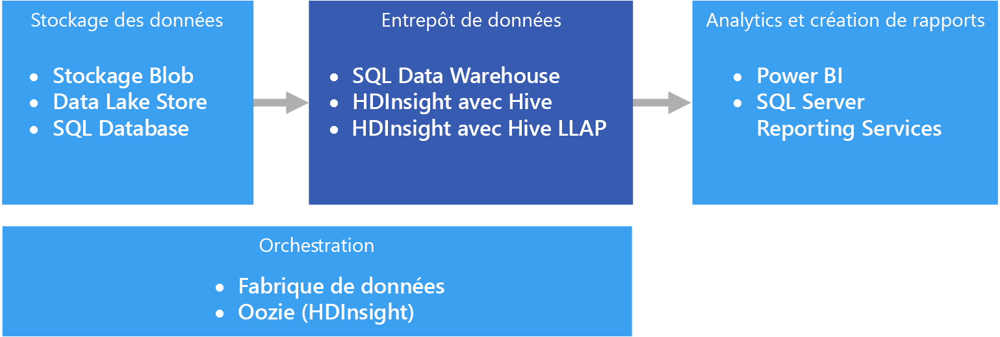

# Entreposage de données et mini-Data WarehousesData warehousing and data marts

Un entrepôt de données est un référentiel central, organisationnel et relationnel de données intégrées provenant d’une ou de plusieurs sources hétérogènes, à travers de nombreuses ou toutes les zones de sujet.A data warehouse is a central, organizational, relational repository of integrated data from one or more disparate sources, across many or all subject areas. Les entrepôts de données stockent des données d’historique et actuelles, et permettent de créer des rapports et d’analyser des données de différentes façons.Data warehouses store current and historical data and are used for reporting and analysis of the data in different ways.

Les données à déplacer dans un entrepôt de données sont régulièrement extraites de différentes sources qui contiennent d’importantes informations d’entreprise.To move data into a data warehouse, it is extracted on a periodic basis from various sources that contain important business information. Durant leur déplacement, les données peuvent être mises en forme, nettoyées, validées, synthétisées et réorganisées.As the data is moved, it can be formatted, cleaned, validated, summarized, and reorganized. Elles peuvent également être stockées avec le plus bas niveau de détail, avec des vues agrégées fournies dans l’entrepôt pour la création de rapports.Alternately, the data can be stored in the lowest level of detail, with aggregated views provided in the warehouse for reporting. Dans tous les cas, l’entrepôt de données devient un espace de stockage permanent pour les données utilisées pour la création de rapports, l’analyse et la prise d’importantes décisions commerciales à l’aide d’outils de Business Intelligence (BI).In either case, the data warehouse becomes a permanent storage space for data used for reporting, analysis, and forming important business decisions using business intelligence (BI) tools.

## Mini-Data Warehouses et magasins de données opérationnelsData marts and operational data stores

La gestion des données à l’échelle est complexe, et disposer d’un entrepôt de données unique qui représente l’ensemble des données au sein de toute l’entreprise est une pratique de moins en moins courante.Managing data at scale is complex, and it is becoming less common to have a single data warehouse that represents all data across the entire enterprise. À la place, les organisations créent des entrepôts de données plus petits et plus spécifiques, appelés *mini-Data Warehouses*, qui exposent les données souhaitées à des fins d’analyse.Instead, organizations create smaller, more focused data warehouses, called *data marts*, that expose the desired data for analytics purposes. Un processus d’orchestration renseigne les mini-Data Warehouses à partir des données conservées dans un magasin de données opérationnel.An orchestration process populates the data marts from data maintained in an operational data store. Le magasin de données opérationnel agit en tant qu’intermédiaire entre le système transactionnel source et le mini-Data Warehouse.The operational data store acts as an intermediary between the source transactional system and the data mart. Les données gérées par le magasin de données opérationnel sont une version nettoyée des données présentes dans le système transactionnel source, et représentent généralement un sous-ensemble des données d’historique gérées par l’entrepôt de données ou le mini-Data Warehouse.Data managed by the operational data store is a cleaned version of the data present in the source transactional system, and is typically a subset of the historical data that is maintained by the data warehouse or data mart.

## Quand utiliser cette solution ?When to use this solution

Optez pour un entrepôt de données si vous avez besoin de convertir un grand nombre de données de systèmes d’exploitation dans un format actuel, précis et facile à comprendre.Choose a data warehouse when you need to turn massive amounts of data from operational systems into a format that is easy to understand, current, and accurate. Les entrepôts de données ne doivent pas forcément suivre la même structure de données laconique que vous pouvez utiliser dans vos bases de données opérationnelles/OLTP.Data warehouses do not need to follow the same terse data structure you may be using in your operational/OLTP databases. Vous pouvez utiliser des noms de colonne pertinents pour les utilisateurs professionnels et les analystes, restructurer le schéma pour simplifier les relations entre les données, et consolider plusieurs tables en une seule.You can use column names that make sense to business users and analysts, restructure the schema to simplify data relationships, and consolidate several tables into one. Ces étapes guident les utilisateurs qui ont besoin de créer des rapports ad hoc, ou de créer des rapports et d’analyser les données dans des systèmes de BI, sans l’aide d’un administrateur de base de données (DBA) ou d’un développeur de données.These steps help guide users who need to create ad hoc reports, or create reports and analyze the data in BI systems, without the help of a database administrator (DBA) or data developer.

Vous pouvez utiliser un entrepôt de données si vous avez besoin de conserver vos données d’historique dans un emplacement autre que les systèmes transactionnels sources pour des raisons de performances.Consider using a data warehouse when you need to keep historical data separate from the source transaction systems for performance reasons. Les entrepôts de données facilitent l’accès aux données d’historique à partir de plusieurs emplacements, en fournissant un emplacement centralisé utilisant des formats, des clés, des méthodes d’accès et des modèles de données courants.Data warehouses make it easy to access historical data from multiple locations, by providing a centralized location using common formats, common keys, common data models, and common access methods.

L’accès en lecture des entrepôts de données est optimisé, ce qui accélère la génération de rapports en comparaison avec l’exécution de rapports via le système transactionnel source.Data warehouses are optimized for read access, resulting in faster report generation compared to running reports against the source transaction system. Les entrepôts de données présentent en outre les avantages suivants :In addition, data warehouses provide the following benefits:

- Toutes les données d’historique provenant de différentes sources peuvent être stockées et sont accessibles à partir d’un entrepôt de données en tant que source de vérité unique.All historical data from multiple sources can be stored and accessed from a data warehouse as the single source of truth.
- Vous pouvez améliorer la qualité des données en les nettoyant au cours de leur importation dans l’entrepôt de données, afin de disposer de données plus précises, ainsi que de descriptions et codes cohérents.You can improve data quality by cleaning up data as it is imported into the data warehouse, providing more accurate data as well as providing consistent codes and descriptions.
- Les outils de création de rapports ne sont pas comparables aux systèmes transactionnels sources pour ce qui est des cycles de traitement des requêtes.Reporting tools do not compete with the transactional source systems for query processing cycles. Un entrepôt de données permet au système transactionnel de se centrer principalement sur la gestion des écritures, tandis que l’entrepôt lui-même répond à la plupart des demandes de lecture.A data warehouse allows the transactional system to focus predominantly on handling writes, while the data warehouse satisfies the majority of read requests.
- Un entrepôt de données peut aider à consolider des données provenant de différents logiciels.A data warehouse can help consolidate data from different software.
- Les outils d’exploration de données peuvent vous aider à rechercher des modèles masqués à l’aide de méthodologies automatiques appliquées aux données stockées dans votre entrepôt.Data mining tools can help you find hidden patterns using automatic methodologies against data stored in your warehouse.
- Les entrepôts de données facilitent la mise en place d’un accès sécurisé aux utilisateurs autorisés, tout en limitant l’accès aux autres utilisateurs.Data warehouses make it easier to provide secure access to authorized users, while restricting access to others. Il n’est pas nécessaire d’accorder aux utilisateurs professionnels l’accès aux données sources, ce qui élimine un vecteur d’attaque potentiel par rapport à un ou plusieurs systèmes transactionnels de production.There is no need to grant business users access to the source data, thereby removing a potential attack vector against one or more production transaction systems.
- Les entrepôts de données facilitent la création de solutions de Business Intelligence applicables aux données, telles que les [cubes OLAP](online-analytical-processing.md).Data warehouses make it easier to create business intelligence solutions on top of the data, such as [OLAP cubes](online-analytical-processing.md).

## DéfisChallenges

La configuration correcte d’un entrepôt de données en fonction des besoins de votre entreprise peut présenter les difficultés suivantes :Properly configuring a data warehouse to fit the needs of your business can bring some of the following challenges:

- Consacrer le temps nécessaire à la définition correcte des concepts de votre entreprise :Committing the time required to properly model your business concepts. il s’agit d’une étape importante, car les entrepôts de données sont axés sur les informations, où le reste du projet dépend du mappage des concepts.This is an important step, as data warehouses are information driven, where concept mapping drives the rest of the project. Cela implique la normalisation des termes et formats professionnels courants (tels que les devises et les dates) et la restructuration du schéma qui soit pertinente pour les utilisateurs professionnels, mais qui garantisse toujours l’exactitude des relations et agrégats de données.This involves standardizing business-related terms and common formats (such as currency and dates), and restructuring the schema in a way that makes sense to business users but still ensures accuracy of data aggregates and relationships.

- Planifier et configurer l’orchestration de vos données :Planning and setting up your data orchestration. Les considérations à prendre en compte incluent la façon dont les données doivent être copiées du système transactionnel source vers l’entrepôt de données, et le moment auquel les données d’historique doivent être déplacées de vos magasins de données opérationnels vers l’entrepôt.Considerations include how to copy data from the source transactional system to the data warehouse, and when to move historical data out of your operational data stores and into the warehouse.

- Préserver ou améliorer la qualité des données en les nettoyant au cours de leur importation dans l’entrepôt.Maintaining or improving data quality by cleaning the data as it is imported into the warehouse.

## Entreposage de données dans AzureData warehousing in Azure

Dans Azure, vous pouvez avoir une ou plusieurs sources de données, provenant de transactions de clients ou de diverses applications métier utilisées par différents services.In Azure, you may have one or more sources of data, whether from customer transactions, or from various business applications used by various departments. Ces données sont généralement stockées dans une ou plusieurs bases de données [OLTP](online-transaction-processing.md).This data is traditionally stored in one or more [OLTP](online-transaction-processing.md) databases. Les données peuvent être persistantes dans d’autres supports de stockage tels que des partages réseau, des objets blob de stockage Azure ou un Data Lake.The data could be persisted in other storage mediums such as network shares, Azure Storage Blobs, or a data lake. Elles peuvent également être stockées dans l’entrepôt de données lui-même ou dans une base de données relationnelle comme Azure SQL Database.The data could also be stored by the data warehouse itself or in a relational database such as Azure SQL Database. L’objectif de la couche du magasin de données analytique est de satisfaire les requêtes émises par les outils d’analyse et de création de rapports au niveau de l’entrepôt de données ou du mini-Data Warehouse.The purpose of the analytical data store layer is to satisfy queries issued by analytics and reporting tools against the data warehouse or data mart. Dans Azure, cette fonctionnalité de magasin analytique est disponible avec Azure SQL Data Warehouse, ou avec HDInsight Azure à l’aide d’une requête Hive ou interactive.In Azure, this analytical store capability can be met with Azure SQL Data Warehouse, or with Azure HDInsight using Hive or Interactive Query. Vous avez également besoin d’un certain niveau d’orchestration pour déplacer ou copier régulièrement des données du stockage de données vers l’entrepôt de données, ce qui peut être effectué à l’aide d’Azure Data Factory ou d’Oozie sur Azure HDInsight.In addition, you will need some level of orchestration to periodically move or copy data from data storage to the data warehouse, which can be done using Azure Data Factory or Oozie on Azure HDInsight.

Il existe plusieurs façons d’implémenter un entrepôt de données dans Azure, en fonction des besoins.There are several options for implementing a data warehouse in Azure, depending on your needs. Les listes suivantes sont divisées en deux catégories, [multitraitement symétrique](https://en.wikipedia.org/wiki/Symmetric_multiprocessing) (SMP) et [traitement massivement parallèle](https://en.wikipedia.org/wiki/Massively_parallel) (MPP).The following lists are broken into two categories, [symmetric multiprocessing](https://en.wikipedia.org/wiki/Symmetric_multiprocessing) (SMP) and [massively parallel processing](https://en.wikipedia.org/wiki/Massively_parallel) (MPP).

SMP :SMP:

- [Base de données SQL AzureAzure SQL Database](/azure/sql-database/)
- [SQL Server dans une machine virtuelleSQL Server in a virtual machine](/sql/sql-server/sql-server-technical-documentation)

MPP :MPP:

- [Azure Data WarehouseAzure Data Warehouse](/azure/sql-data-warehouse/sql-data-warehouse-overview-what-is)
- [Apache Hive sur HDInsightApache Hive on HDInsight](/azure/hdinsight/hadoop/hdinsight-use-hive)
- [Interactive Query (Hive LLAP) sur HDInsightInteractive Query (Hive LLAP) on HDInsight](/azure/hdinsight/interactive-query/apache-interactive-query-get-started)

En règle générale, les entrepôts SMP sont idéaux pour les jeux de données de taille petite ou moyenne (jusqu'à 4-100 To), tandis que les entrepôts MPP sont souvent utilisés pour le Big Data.As a general rule, SMP-based warehouses are best suited for small to medium data sets (up to 4-100 TB), while MPP is often used for big data. La frontière entre le Big Data et les volumes petits/moyens de données est en partie liée à la définition et à l’infrastructure sous-jacente de votre organisation.The delineation between small/medium and big data partly has to do with your organization's definition and supporting infrastructure. (Voir [Choisir un magasin de données OLTP](online-transaction-processing.md#scalability-capabilities).)(See [Choosing an OLTP data store](online-transaction-processing.md#scalability-capabilities).)

Au-delà de la taille des données, le type de modèle de charge de travail a toutes les chances d’être un facteur plus déterminant.Beyond data sizes, the type of workload pattern is likely to be a greater determining factor. Par exemple, les requêtes complexes risquent d’être trop lentes pour une solution SMP et d’exiger plutôt une solution MPP.For example, complex queries may be too slow for an SMP solution, and require an MPP solution instead. Les systèmes MPP sont susceptibles d’imposer une pénalité de performances aux données de petite taille, en raison de la façon dont les tâches sont distribuées et consolidées sur les différents nœuds.MPP-based systems are likely to impose a performance penalty with small data sizes, due to the way jobs are distributed and consolidated across nodes. Si vos données dépassent déjà 1 To et qu’elles seront amenées à croître en permanence, envisagez une solution MPP.If your data sizes already exceed 1 TB and are expected to continually grow, consider selecting an MPP solution. Toutefois, si elles sont de plus petite taille, mais que vos charges de travail dépassent les ressources disponibles de votre solution SMP, le meilleur choix reste peut-être là aussi un système MPP.However, if your data sizes are less than this, but your workloads are exceeding the available resources of your SMP solution, then MPP may be your best option as well.

Les données lues et stockées par l’entrepôt de données peuvent provenir de différentes sources de données, y compris un lac de données comme [Azure Data Lake Store](/azure/data-lake-store/).The data accessed or stored by your data warehouse could come from a number of data sources, including a data lake, such as [Azure Data Lake Store](/azure/data-lake-store/). Vous trouverez une session vidéo comparant les différents avantages offerts par les services MPP qui peuvent utiliser Azure Data Lake sur la page [Azure Data Lake et Azure Data Warehouse : application de pratiques modernes à votre application](https://azure.microsoft.com/resources/videos/build-2016-azure-data-lake-and-azure-data-warehouse-applying-modern-practices-to-your-app/).For a video session that compares the different strengths of MPP services that can use Azure Data Lake, see [Azure Data Lake and Azure Data Warehouse: Applying Modern Practices to Your App](https://azure.microsoft.com/resources/videos/build-2016-azure-data-lake-and-azure-data-warehouse-applying-modern-practices-to-your-app/).

Les systèmes SMP sont caractérisés par une seule instance d’un système de gestion de base de données relationnelle, partageant toutes les ressources (UC / mémoire / disque).SMP systems are characterized by a single instance of a relational database management system sharing all resources (CPU/Memory/Disk). Un système SMP peut monter en puissance.You can scale up an SMP system. Si SQL Server est exécuté sur une machine virtuelle, vous pouvez augmenter la taille de cette dernière.For SQL Server running on a VM, you can scale up the VM size. Dans le cas d’Azure SQL Database, la montée en puissance passe par le choix d’un autre niveau de service.For Azure SQL Database, you can scale up by selecting a different service tier.

Pour monter en charge des systèmes MPP, il faut ajouter des nœuds de calcul (qui ont leurs propres sous-systèmes d’UC, de mémoire et d’E/S).MPP systems can be scaled out by adding more compute nodes (which have their own CPU, memory and I/O subsystems). La montée en puissance d’un serveur est soumise à des limites physiques, au-delà desquelles la montée en charge est plus judicieuse, en fonction de la charge de travail.There are physical limitations to scaling up a server, at which point scaling out is more desirable, depending on the workload. Toutefois, les solutions MPP requièrent des compétences différentes, en raison des écarts dans la manière d’interroger, de modéliser et de partitionner les données, ainsi que d’autres facteurs propres au traitement parallèle.However, MPP solutions require a different skillset, due to variances in querying, modeling, partitioning of data, and other factors unique to parallel processing.

Pour choisir quelle solution SMP utiliser, consultez la page [Retour sur Azure SQL Database et SQL Server sur des machines virtuelles Azure](/azure/sql-database/sql-database-paas-vs-sql-server-iaas#a-closer-look-at-azure-sql-database-and-sql-server-on-azure-vms).When deciding which SMP solution to use, see [A closer look at Azure SQL Database and SQL Server on Azure VMs](/azure/sql-database/sql-database-paas-vs-sql-server-iaas#a-closer-look-at-azure-sql-database-and-sql-server-on-azure-vms).

Azure SQL Data Warehouse est également utilisable pour des jeux de données de taille petite ou moyenne, dont la charge de travail nécessite de nombreuses ressources de calcul et de mémoire.Azure SQL Data Warehouse can also be used for small and medium datasets, where the workload is compute and memory intensive. Pour plus d’informations sur les modèles SQL Data Warehouse et les scénarios courants :Read more about SQL Data Warehouse patterns and common scenarios:

- [Modèles et antimodèles SQL Data WarehouseSQL Data Warehouse Patterns and Anti-Patterns](https://blogs.msdn.microsoft.com/sqlcat/2017/09/05/azure-sql-data-warehouse-workload-patterns-and-anti-patterns/)

- [Stratégies et modèles de charge Azure SQL Data WarehouseSQL Data Warehouse Loading Patterns and Strategies](https://blogs.msdn.microsoft.com/sqlcat/2017/05/17/azure-sql-data-warehouse-loading-patterns-and-strategies/)

- [Migrating Data to Azure SQL Data Warehouse](https://blogs.msdn.microsoft.com/sqlcat/2016/08/18/migrating-data-to-azure-sql-data-warehouse-in-practice/) (Migration de données vers Microsoft Azure SQL Data Warehouse)[Migrating Data to Azure SQL Data Warehouse](https://blogs.msdn.microsoft.com/sqlcat/2016/08/18/migrating-data-to-azure-sql-data-warehouse-in-practice/)

- [Modèles d’application courants des ISV avec Azure SQL Data WarehouseCommon ISV Application Patterns Using Azure SQL Data Warehouse](https://blogs.msdn.microsoft.com/sqlcat/2017/09/05/common-isv-application-patterns-using-azure-sql-data-warehouse/)

## Critères de sélection principauxKey selection criteria

Pour restreindre les choix, commencez par répondre aux questions suivantes :To narrow the choices, start by answering these questions:

- Préférez-vous opter pour un service géré plutôt que de gérer vos propres serveurs ?Do you want a managed service rather than managing your own servers?

- Travaillez-vous avec des jeux de données extrêmement volumineux, ou des requêtes longues et très complexes ?Are you working with extremely large data sets or highly complex, long-running queries? Si oui, envisagez un système MPP.If yes, consider an MPP option.

- Dans le cas d’un jeu de données volumineux, la source de données est-elle structurée ou non structurée ?For a large data set, is the data source structured or unstructured? Le traitement des données non structurées doit parfois s’effectuer dans un environnement Big Data comme Spark sur HDInsight, Azure Databricks, Hive LLAP sur HDInsight ou Azure Data Lake Analytics.Unstructured data may need to be processed in a big data environment such as Spark on HDInsight, Azure Databricks, Hive LLAP on HDInsight, or Azure Data Lake Analytics. Tous ces outils peuvent servir de moteurs ELT (extraction, chargement, transformation) et ETL (extraction, transformation, chargement).All of these can serve as ELT (Extract, Load, Transform) and ETL (Extract, Transform, Load) engines. À partir des données traitées, ils peuvent produire des données structurées, plus faciles à charger dans SQL Data Warehouse ou les autres solutions.They can output the processed data into structured data, making it easier to load into SQL Data Warehouse or one of the other options. Pour les données structurées, SQL Data Warehouse a un niveau de performances nommé Optimisé pour le calcul, adapté aux charges de travail nécessitant de nombreuses ressources de calcul et des performances extrêmement élevées.For structured data, SQL Data Warehouse has a performance tier called Optimized for Compute, for compute-intensive workloads requiring ultra-high performance.

- Souhaitez-vous séparer vos données historiques de vos données opérationnelles actuelles ?Do you want to separate your historical data from your current, operational data? Si oui, sélectionnez l’une des solutions pour lesquelles [l’orchestration](../technology-choices/pipeline-orchestration-data-movement.md) est requise.If so, select one of the options where [orchestration](../technology-choices/pipeline-orchestration-data-movement.md) is required. Ces sont des entrepôts autonomes optimisés pour un accès en lecture intensif et idéaux comme magasins de données historiques distincts.These are standalone warehouses optimized for heavy read access, and are best suited as a separate historical data store.

- Avez-vous besoin d’intégrer des données provenant de plusieurs sources, au-delà de votre magasin de données OLTP ?Do you need to integrate data from several sources, beyond your OLTP data store? Si oui, choisissez des solutions qui intègrent facilement plusieurs sources de données.If so, consider options that easily integrate multiple data sources.

- Avez-vous une exigence d’architecture mutualisée ?Do you have a multi-tenancy requirement? Si oui, SQL Data Warehouse n’est pas idéal pour y répondre.If so, SQL Data Warehouse is not ideal for this requirement. Pour plus d’informations, consultez la page [Modèles et antimodèles SQL Data Warehouse](https://blogs.msdn.microsoft.com/sqlcat/2017/09/05/azure-sql-data-warehouse-workload-patterns-and-anti-patterns/).For more information, see [SQL Data Warehouse Patterns and Anti-Patterns](https://blogs.msdn.microsoft.com/sqlcat/2017/09/05/azure-sql-data-warehouse-workload-patterns-and-anti-patterns/).

- Préférez-vous un magasin de données relationnel ?Do you prefer a relational data store? Si oui, concentrez-vous sur les solutions possédant un magasin de données relationnel, mais sachez également que vous pouvez utiliser un outil comme PolyBase pour interroger des magasins de données non relationnels si nécessaire.If so, narrow your options to those with a relational data store, but also note that you can use a tool like PolyBase to query non-relational data stores if needed. Si vous décidez d’utiliser PolyBase, toutefois, exécutez des tests de performances sur vos jeux de données non structurées pour votre charge de travail.If you decide to use PolyBase, however, run performance tests against your unstructured data sets for your workload.

- Avez-vous des exigences de création de rapports en temps réel ?Do you have real-time reporting requirements? Si vous avez besoin de faibles temps de réponse aux requêtes sur des volumes élevés d’insertions de singletons, limitez vos recherches aux solutions prenant en charge les rapports en temps réel.If you require rapid query response times on high volumes of singleton inserts, narrow your options to those that can support real-time reporting.

- Devez-vous prendre en charge un grand nombre de connexions et d’utilisateurs simultanés ?Do you need to support a large number of concurrent users and connections? La capacité à prendre en charge de nombreux utilisateurs/connexions simultanés dépend de plusieurs facteurs.The ability to support a number of concurrent users/connections depends on several factors.

  - Pour Azure SQL Database, référez-vous aux [limites de ressources documentées](/azure/sql-database/sql-database-resource-limits) selon votre niveau de service.For Azure SQL Database, refer to the [documented resource limits](/azure/sql-database/sql-database-resource-limits) based on your service tier.
  
  - SQL Server autorise un maximum de 32 767 connexions utilisateurs.SQL Server allows a maximum of 32,767 user connections. En cas d’exécution sur une machine virtuelle, les performances dépendront de la taille de cette machine virtuelle et d’autres facteurs.When running on a VM, performance will depend on the VM size and other factors.

  - SQL Data Warehouse est soumis à des limites sur les requêtes et les connexions simultanées.SQL Data Warehouse has limits on concurrent queries and concurrent connections. Pour plus d’informations, consultez la page [Gestion de la concurrence et des charges de travail dans SQL Data Warehouse](/azure/sql-data-warehouse/sql-data-warehouse-develop-concurrency).For more information, see [Concurrency and workload management in SQL Data Warehouse](/azure/sql-data-warehouse/sql-data-warehouse-develop-concurrency). Vous pouvez utiliser des services complémentaires, par exemple, [Azure Analysis Services](/azure/analysis-services/analysis-services-overview), pour surmonter les limites de SQL Data Warehouse.Consider using complementary services, such as [Azure Analysis Services](/azure/analysis-services/analysis-services-overview), to overcome limits in SQL Data Warehouse.

- De quel type est votre charge de travail ?What sort of workload do you have? En général, les solutions d’entrepôts MPP sont idéales pour les charges de travail analytiques par lots.In general, MPP-based warehouse solutions are best suited for analytical, batch-oriented workloads. Si les vôtres sont de nature transactionnelle, avec beaucoup de petites opérations de lecture/écriture ou d’opérations ligne par ligne, regardez du côté des solutions SMP.If your workloads are transactional by nature, with many small read/write operations or multiple row-by-row operations, consider using one of the SMP options. Il existe une exception à cette recommandation : si vous utilisez le traitement des flux de données sur un cluster HDInsight, par exemple, Spark Streaming, et que vous stockez les données dans une table Hive.One exception to this guideline is when using stream processing on an HDInsight cluster, such as Spark Streaming, and storing the data within a Hive table.

## Matrice des fonctionnalitésCapability Matrix

Les tableaux suivants résument les principales différences de fonctionnalités.The following tables summarize the key differences in capabilities.

### Fonctionnalités généralesGeneral capabilities

<!-- markdownlint-disable MD033 -->

| | Azure SQL DatabaseAzure SQL Database | SQL Server (machine virtuelle)SQL Server (VM) | SQL Data WarehouseSQL Data Warehouse | Apache Hive sur HDInsightApache Hive on HDInsight | Hive LLAP sur HDInsightHive LLAP on HDInsight |
| --- | --- | --- | --- | --- | --- | -- |
| Est un service géréIs managed service | OuiYes | Non No | OuiYes | Oui 1Yes 1 | Oui1Yes 1 |
| Nécessite l’orchestration des données (conserve une copie des données/données historiques)Requires data orchestration (holds copy of data/historical data) | Non No | Non No | OUIYes | OUIYes | OuiYes |
| Intègre facilement plusieurs sources de donnéesEasily integrate multiple data sources | Non No | Non No | OUIYes | OUIYes | OuiYes |
| Prend en charge l’interruption du calculSupports pausing compute | Non No | Non No | OuiYes | Non2No 2 | Non2No 2 |
| Magasin de données relationnelRelational data store | OuiYes | OUIYes |  OuiYes | Non No | Non No |
| Rapports en temps réelReal-time reporting | OuiYes | OuiYes | Non No | Non No | OuiYes |
| Points de restauration de sauvegarde flexiblesFlexible backup restore points | OuiYes | OuiYes | Non3No 3 | Oui4Yes 4 | Oui4Yes 4 |
| SMP/MPPSMP/MPP | SMPSMP | SMPSMP | MPPMPP | MPPMPP | MPPMPP |

<!-- markdownlint-enable MD033 -->

[1] Mise à l’échelle et configuration manuelles.[1] Manual configuration and scaling.

[2] Les clusters HDInsight peuvent être supprimés s’ils ne sont pas nécessaires, puis recréés.[2] HDInsight clusters can be deleted when not needed, and then re-created. Attachez un magasin de données externe à votre cluster afin de conserver vos données si vous supprimez votre cluster.Attach an external data store to your cluster so your data is retained when you delete your cluster. Vous pouvez utiliser Azure Data Factory pour automatiser le cycle de vie de votre cluster en créant un cluster HDInsight à la demande pour traiter votre charge de travail, puis en le supprimant une fois le traitement terminé.You can use Azure Data Factory to automate your cluster's lifecycle by creating an on-demand HDInsight cluster to process your workload, then delete it once the processing is complete.

[3] Avec SQL Data Warehouse, vous pouvez restaurer une base de données sur n’importe quel point de restauration disponible au cours des sept derniers jours.[3] With SQL Data Warehouse, you can restore a database to any available restore point within the last seven days. Les captures instantanées démarrent toutes les quatre à huit heures et sont disponibles pendant sept jours.Snapshots start every four to eight hours and are available for seven days. Quand une capture instantanée a une ancienneté supérieure à sept jours, elle expire et son point de restauration n’est plus disponible.When a snapshot is older than seven days, it expires and its restore point is no longer available.

[4] Envisagez d’utiliser un [metastore Hive externe](/azure/hdinsight/hdinsight-hadoop-provision-linux-clusters#use-hiveoozie-metastore) qui peut être sauvegardé et restauré en fonction des besoins.[4] Consider using an [external Hive metastore](/azure/hdinsight/hdinsight-hadoop-provision-linux-clusters#use-hiveoozie-metastore) that can be backed up and restored as needed. Il est possible d’utiliser les options de sauvegarde et de restauration standard qui s’appliquent au Stockage Blob ou à Data Lake Store pour les données, ou bien des solutions de sauvegarde et de restauration HDInsight tierces, comme [Imanis Data](https://azure.microsoft.com/blog/imanis-data-cloud-migration-backup-for-your-big-data-applications-on-azure-hdinsight/), pour plus de flexibilité et de facilité d’utilisation.Standard backup and restore options that apply to Blob Storage or Data Lake Store can be used for the data, or third party HDInsight backup and restore solutions, such as [Imanis Data](https://azure.microsoft.com/blog/imanis-data-cloud-migration-backup-for-your-big-data-applications-on-azure-hdinsight/) can be used for greater flexibility and ease of use.

### Fonctionnalités d’évolutivitéScalability capabilities

<!-- markdownlint-disable MD033 -->

| | Azure SQL DatabaseAzure SQL Database | SQL Server (machine virtuelle)SQL Server (VM) |  SQL Data WarehouseSQL Data Warehouse | Apache Hive sur HDInsightApache Hive on HDInsight | Hive LLAP sur HDInsightHive LLAP on HDInsight |
| --- | --- | --- | --- | --- | --- | -- |
| Serveurs régionaux redondants pour assurer une haute disponibilitéRedundant regional servers for high availability  | OuiYes | OUIYes | OuiYes | Non No | Non No |
| Prend en charge les requêtes avec montée en charge (requêtes distribuées)Supports query scale out (distributed queries)  | Non No | Non No | OUIYes | OUIYes | OuiYes |
| Évolutivité dynamiqueDynamic scalability | OuiYes | Non No | Oui 1Yes 1 | Non No | Non No |
| Prend en charge la mise en cache en mémoire des donnéesSupports in-memory caching of data | OuiYes |  OuiYes | Non No | OUIYes | OuiYes |

[1] SQL Data Warehouse permet de monter ou de descendre en puissance en ajustant le nombre d’unités DWU (Data Warehouse Unit).[1] SQL Data Warehouse allows you to scale up or down by adjusting the number of data warehouse units (DWUs). Voir [Gérer la puissance de calcul dans Azure SQL Data Warehouse](/azure/sql-data-warehouse/sql-data-warehouse-manage-compute-overview).See [Manage compute power in Azure SQL Data Warehouse](/azure/sql-data-warehouse/sql-data-warehouse-manage-compute-overview).

<!-- markdownlint-enable MD033 -->

### Fonctionnalités de sécuritéSecurity capabilities

<!-- markdownlint-disable MD033 -->

|                         |           Azure SQL DatabaseAzure SQL Database            |  SQL Server dans une machine virtuelleSQL Server in a virtual machine  | SQL Data WarehouseSQL Data Warehouse |   Apache Hive sur HDInsightApache Hive on HDInsight    |    Hive LLAP sur HDInsightHive LLAP on HDInsight     |
|-------------------------|-----------------------------------------|-----------------------------------|--------------------|-------------------------------|-------------------------------|
|     AuthentificationAuthentication      | SQL / Azure Active Directory (Azure AD)SQL / Azure Active Directory (Azure AD) | SQL / Azure AD / Active DirectorySQL / Azure AD / Active Directory |   SQL / Azure ADSQL / Azure AD   | local / Azure AD1local / Azure AD 1 | local / Azure AD 1local / Azure AD 1 |
|      AuthorizationAuthorization      |                   OuiYes                   |                OUIYes                |        OUIYes         |              OuiYes              |       Oui 1Yes 1        |
|        AuditAuditing         |                   OuiYes                   |                OUIYes                |        OUIYes         |              OuiYes              |       Oui 1Yes 1        |
| Chiffrement des données au reposData encryption at rest |            Oui 2Yes 2             |         Oui2Yes 2          |  Oui2Yes 2  |       Oui 2Yes 2        |       Oui 1Yes 1        |
|   Sécurité au niveau des lignesRow-level security    |                   OuiYes                   |                OUIYes                |        OuiYes         |              Non No               |       Oui 1Yes 1        |
|   Prend en charge les pare-feuSupports firewalls    |                   OuiYes                   |                OUIYes                |        OUIYes         |              OuiYes              |       Oui 3Yes 3        |
|  Masquage des données dynamiquesDynamic data masking   |                   OuiYes                   |                OUIYes                |        OuiYes         |              Non No               |       Oui 1Yes 1        |

<!-- markdownlint-enable MD033 -->

[1] Suppose d’utiliser un [cluster HDInsight joint à un domaine](/azure/hdinsight/domain-joined/apache-domain-joined-introduction).[1] Requires using a [domain-joined HDInsight cluster](/azure/hdinsight/domain-joined/apache-domain-joined-introduction).

[2] Suppose d’utiliser le chiffrement TDE (Transparent Data Encryption) pour chiffrer et déchiffrer les données au repos.[2] Requires using Transparent Data Encryption (TDE) to encrypt and decrypt your data at rest.

[3] Pris en charge si [utilisé au sein d’un Réseau virtuel Azure](/azure/hdinsight/hdinsight-extend-hadoop-virtual-network).[3] Supported when [used within an Azure Virtual Network](/azure/hdinsight/hdinsight-extend-hadoop-virtual-network).

Pour plus d’informations sur la sécurisation de l’entrepôt de données :Read more about securing your data warehouse:

- [Sécurisation de votre base de données SQLSecuring your SQL Database](/azure/sql-database/sql-database-security-overview#connection-security)

- [Sécuriser une base de données dans SQL Data WarehouseSecure a database in SQL Data Warehouse](/azure/sql-data-warehouse/sql-data-warehouse-overview-manage-security)

- [Étendre HDInsight à l’aide d’un Réseau virtuel AzureExtend Azure HDInsight using an Azure Virtual Network](/azure/hdinsight/hdinsight-extend-hadoop-virtual-network)

- [Sécurité Hadoop au niveau de l’entreprise avec des clusters HDInsight joints à un domaineEnterprise-level Hadoop security with domain-joined HDInsight clusters](/azure/hdinsight/domain-joined/apache-domain-joined-introduction)
