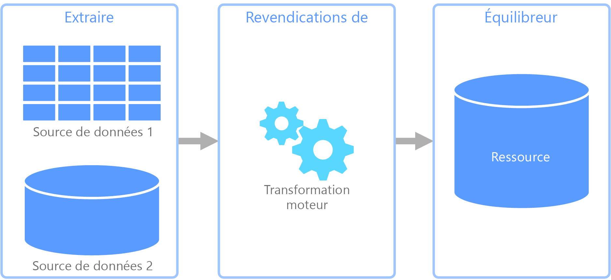
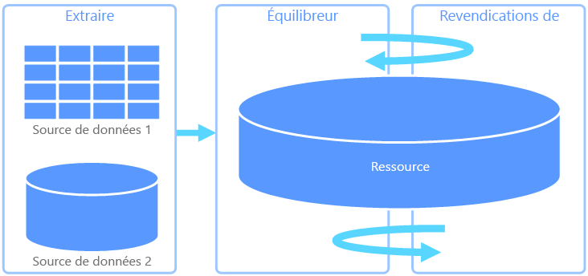
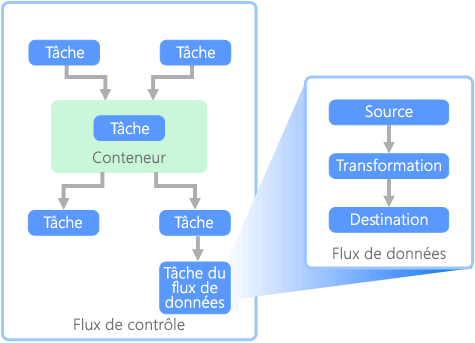

# Extraire, transformer et charger (ETL)Extract, transform, and load (ETL)

Un problème courant auquel les organisations font face est le mode de collecte de données à partir de plusieurs sources, dans plusieurs formats, et le déplacement de ces données vers un ou plusieurs magasins de données.A common problem that organizations face is how to gathering data from multiple sources, in multiple formats, and move it to one or more data stores. La destination peut ne pas être le même type de magasin de données que la source, et souvent le format est différent, ou les données doivent être mises en forme ou nettoyées avant d’être chargées dans leur destination finale.The destination may not be the same type of data store as the source, and often the format is different, or the data needs to be shaped or cleaned before loading it into its final destination.

Au fil des années, différents outils, services et processus ont été développés pour relever ces défis.Various tools, services, and processes have been developed over the years to help address these challenges. Quel que soit le processus utilisé, il est nécessaire de coordonner le travail et d’appliquer un certain degré de transformation des données dans le pipeline de données.No matter the process used, there is a common need to coordinate the work and apply some level of data transformation within the data pipeline. Les sections suivantes illustrent les méthodes couramment utilisées pour effectuer ces tâches.The following sections highlight the common methods used to perform these tasks.

## Processus ETL (extraction, transformation et chargement)Extract, transform, and load (ETL) process

ETL est un pipeline de données utilisé pour collecter des données provenant de différentes sources, transformer les données en fonction des règles métier et charger les données dans un magasin de données de destination.Extract, transform, and load (ETL) is a data pipeline used to collect data from various sources, transform the data according to business rules, and load it into a destination data store. Le travail de transformation dans ETL a lieu dans un moteur spécialisé et implique souvent l’utilisation de tables intermédiaires pour conserver temporairement les données lors de leur transformation et leur chargement final vers leur destination.The transformation work in ETL takes place in a specialized engine, and often involves using staging tables to temporarily hold data as it is being transformed and ultimately loaded to its destination.

La transformation des données qui a lieu implique généralement plusieurs opérations, comme le filtrage, le tri, l’agrégation, la jointure des données, le nettoyage des données, la déduplication et la validation des données.The data transformation that takes place usually involves various operations, such as filtering, sorting, aggregating, joining data, cleaning data, deduplicating, and validating data.

Souvent, les trois phases ETL sont exécutées en parallèle pour gagner du temps.Often, the three ETL phases are run in parallel to save time. Par exemple, tandis que les données sont extraites, un processus de transformation peut travailler sur les données déjà reçues et les préparer pour le chargement, et un processus de chargement peut commencer à travailler sur les données préparées, au lieu d’attendre la fin du processus d’extraction complet.For example, while data is being extracted, a transformation process could be working on data already received and prepare it for loading, and a loading process can begin working on the prepared data, rather than waiting for the entire extraction process to complete.

Service Azure approprié :Relevant Azure service:

- [Azure Data Factory v2Azure Data Factory v2](https://azure.microsoft.com/services/data-factory/)

Autres outils :Other tools:

- [SQL Server Integration Services (SSIS)SQL Server Integration Services (SSIS)](/sql/integration-services/sql-server-integration-services)

## Extraire, charger et transformer (ELT)Extract, load, and transform (ELT)

Extraire, charger et transformer (ELT) diffère du processus ETL uniquement où la transformation a lieu.Extract, load, and transform (ELT) differs from ETL solely in where the transformation takes place. Dans le pipeline ELT, la transformation se produit dans le magasin de données cible.In the ELT pipeline, the transformation occurs in the target data store. Au lieu d’utiliser un moteur de transformation distinct, les fonctionnalités de traitement du magasin de données cible sont utilisées pour transformer les données.Instead of using a separate transformation engine, the processing capabilities of the target data store are used to transform data. Cela simplifie l’architecture en supprimant le moteur de transformation du pipeline.This simplifies the architecture by removing the transformation engine from the pipeline. Un autre avantage de cette approche est que la montée en puissance du magasin de données cible permet également la montée en puissance des performances du pipeline ELT.Another benefit to this approach is that scaling the target data store also scales the ELT pipeline performance. Toutefois, ELT fonctionne bien uniquement lorsque le système cible est suffisamment puissant pour transformer les données de manière efficace.However, ELT only works well when the target system is powerful enough to transform the data efficiently.

Les scénarios d’utilisation classiques d’ELT concernent le domaine du Big Data.Typical use cases for ELT fall within the big data realm. Par exemple, vous pouvez commencer par extraire toutes les données sources dans des fichiers plats dans un stockage évolutif comme le système de fichiers distribués (HDFS) Hadoop ou Azure Data Lake Store.For example, you might start by extracting all of the source data to flat files in scalable storage such as Hadoop distributed file system (HDFS) or Azure Data Lake Store. Les technologies comme Spark, Hive ou PolyBase peuvent ensuite être utilisées pour interroger les données sources.Technologies such as Spark, Hive, or PolyBase can then be used to query the source data. Le point clé avec ELT est que le magasin de données utilisé pour effectuer la transformation est le même magasin de données que celui où les données sont finalement consommées.The key point with ELT is that the data store used to perform the transformation is the same data store where the data is ultimately consumed. Ce magasin de données lit directement à partir du stockage évolutif, au lieu de charger les données dans son propre stockage propriétaire.This data store reads directly from the scalable storage, instead of loading the data into its own proprietary storage. Cette approche ignore l’étape de copie des données présente dans ETL, qui peut être une opération longue pour les jeux de données volumineux.This approach skips the data copy step present in ETL, which can be a time consuming operation for large data sets.

Dans la pratique, le magasin de données cible est un [entrepôt de données](./data-warehousing.md) utilisant un cluster Hadoop (avec Hive ou Spark) ou un SQL Data Warehouse.In practice, the target data store is a [data warehouse](./data-warehousing.md) using either a Hadoop cluster (using Hive or Spark) or a SQL Data Warehouse. En général, un schéma est placé sur les données de fichier plat au moment de la requête et stocké sous la forme d’une table, permettant l’interrogation des données comme toute autre table dans le magasin de données.In general, a schema is overlaid on the flat file data at query time and stored as a table, enabling the data to be queried like any other table in the data store. Celles-ci sont désignées comme des tables externes, car les données ne résident pas dans le stockage géré par le magasin de données lui-même, mais dans un stockage évolutif externe.These are referred to as external tables because the data does not reside in storage managed by the data store itself, but on some external scalable storage.

Le magasin de données gère uniquement le schéma des données et applique le schéma lors de la lecture.The data store only manages the schema of the data and applies the schema on read. Par exemple, un cluster Hadoop utilisant Hive décrit une table Hive où la source des données est en réalité un chemin d’accès à un ensemble de fichiers dans HDFS.For example, a Hadoop cluster using Hive would describe a Hive table where the data source is effectively a path to a set of files in HDFS. Dans SQL Data Warehouse, PolyBase peut obtenir le même résultat &mdash; créant une table sur des données stockées en externe à la base de données.In SQL Data Warehouse, PolyBase can achieve the same result &mdash; creating a table against data stored externally to the database itself. Une fois la source de données chargée, les données présentes dans les tables externes peuvent être traitées grâce aux fonctionnalités du magasin de données.Once the source data is loaded, the data present in the external tables can be processed using the capabilities of the data store. Dans les scénarios Big Data, cela signifie que le magasin de données doit être capable d’un traitement parallèle massif (MPP), qui fractionne les données en segments plus petits et distribue le traitement des segments sur plusieurs machines en parallèle.In big data scenarios, this means the data store must be capable of massively parallel processing (MPP), which breaks the data into smaller chunks and distributes processing of the chunks across multiple machines in parallel.

La dernière phase du pipeline ELT consiste généralement à transformer la source de données dans un format final plus efficace pour les types de requêtes qui doivent être pris en charge.The final phase of the ELT pipeline is typically to transform the source data into a final format that is more efficient for the types of queries that need to be supported. Par exemple, les données peuvent être partitionnées.For example, the data may be partitioned. En outre, ELT peut utiliser des formats de stockage optimisé comme Parquet, qui stocke les données orientées ligne dans un mode en colonnes et fournit une indexation optimisée.Also, ELT might use optimized storage formats like Parquet, which stores row-oriented data in a columnar fashion and providess optimized indexing.

Service Azure approprié :Relevant Azure service:

- [Azure SQL Data WarehouseAzure SQL Data Warehouse](/azure/sql-data-warehouse/sql-data-warehouse-overview-what-is)
- [HDInsight avec HiveHDInsight with Hive](/azure/hdinsight/hadoop/hdinsight-use-hive)
- [Azure Data Factory v2Azure Data Factory v2](https://azure.microsoft.com/services/data-factory/)
- [Oozie sur HDInsightOozie on HDInsight](/azure/hdinsight/hdinsight-use-oozie-linux-mac)

Autres outils :Other tools:

- [SQL Server Integration Services (SSIS)SQL Server Integration Services (SSIS)](/sql/integration-services/sql-server-integration-services)

## Flux de données et flux de contrôleData flow and control flow

Dans le contexte de pipelines de données, le flux de contrôle garantit le traitement de façon ordonnée d’un ensemble de tâches.In the context of data pipelines, the control flow ensures orderly processing of a set of tasks. Pour appliquer l’ordre de traitement correct de ces tâches, des contraintes de priorité sont utilisées.To enforce the correct processing order of these tasks, precedence constraints are used. Vous pouvez comparer ces contraintes à des connecteurs dans un diagramme de flux de travail, comme indiqué dans l’image ci-dessous.You can think of these constraints as connectors in a workflow diagram, as shown in the image below. Chaque tâche a un résultat, comme la réussite, l’échec ou l’achèvement.Each task has an outcome, such as success, failure, or completion. Le traitement de la tâche suivante n’est lancé que lorsque la tâche précédente est terminée avec l’un de ces résultats.Any subsequent task does not initiate processing until its predecessor has completed with one of these outcomes.

Les flux de contrôle exécutent les flux de données en tant que tâche.Control flows execute data flows as a task. Dans une tâche de flux de données, les données sont extraites d’une source, transformées ou chargées dans un magasin de données.In a data flow task, data is extracted from a source, transformed, or loaded into a data store. La sortie d’une tâche de flux de données peut correspondre à l’entrée de la prochaine tâche de flux de données et les flux de données peuvent s’exécuter en parallèle.The output of one data flow task can be the input to the next data flow task, and data flowss can run in parallel. Contrairement aux flux de contrôle, vous ne pouvez pas ajouter de contraintes entre les tâches d’un flux de données.Unlike control flows, you cannot add constraints between tasks in a data flow. Toutefois, vous pouvez ajouter une visionneuse de données afin d’observer les données lorsqu’elles sont traitées par chaque tâche.You can, however, add a data viewer to observe the data as it is processed by each task.

Dans le schéma ci-dessus, le flux de contrôle comporte plusieurs tâches, notamment une tâche de flux de données.In the diagram above, there are several tasks within the control flow, one of which is a data flow task. L’une des tâches est imbriquée dans un conteneur.One of the tasks is nested within a container. Les conteneurs peuvent être utilisés pour donner une structure aux tâches, fournissant une unité de travail.Containers can be used to provide structure to tasks, providing a unit of work. La répétition d’éléments dans une collection, comme des fichiers dans un dossier ou des instructions dans une base de données, en est un exemple.One such example is for repeating elements within a collection, such as files in a folder or database statements.

Service Azure approprié :Relevant Azure service:

- [Azure Data Factory v2Azure Data Factory v2](https://azure.microsoft.com/services/data-factory/)

Autres outils :Other tools:

- [SQL Server Integration Services (SSIS)SQL Server Integration Services (SSIS)](/sql/integration-services/sql-server-integration-services)

## Choix de technologieTechnology choices

- [Magasins de données de traitement transactionnel en ligne (OLTP)Online Transaction Processing (OLTP) data stores](./online-transaction-processing.md#oltp-in-azure)
- [Magasins de données de traitement analytique en ligne (OLAP)Online Analytical Processing (OLAP) data stores](./online-analytical-processing.md#olap-in-azure)
- [Entrepôts de donnéesData warehouses](./data-warehousing.md)
- [Orchestration de pipelinePipeline orchestration](../technology-choices/pipeline-orchestration-data-movement.md)

## Étapes suivantesNext steps

Les architectures de référence suivantes présentent des pipelines ELT de bout en bout sur Azure :The following reference architectures show end-to-end ELT pipelines on Azure:

- [BI d’entreprise dans Azure avec SQL Data WarehouseEnterprise BI in Azure with SQL Data Warehouse](../../reference-architectures/data/enterprise-bi-sqldw.md)
- [BI d’entreprise automatisée avec SQL Data Warehouse et Azure Data FactoryAutomated enterprise BI with SQL Data Warehouse and Azure Data Factory](../../reference-architectures/data/enterprise-bi-adf.md)