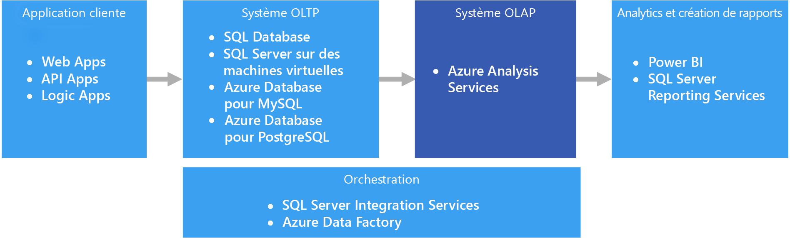
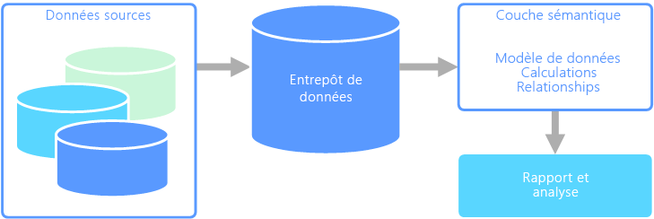

# Traitement analytique en ligne (OLAP)

Le traitement analytique en ligne (OLAP) est une technologie qui organise les bases de données de grandes entreprises et prend en charge les analyses complexes. Il peut être utilisé pour effectuer des requêtes analytiques complexes sans impact négatif sur les systèmes transactionnels.

Les bases de données utilisées par une entreprise pour stocker l’ensemble de ses transactions et enregistrements sont appelées bases de données de [traitement transactionnel en ligne (OLTP)](./online-transaction-processing.md). Généralement, ces bases de données disposent d’enregistrements entrés un par un. Elles contiennent souvent une grande quantité d’informations précieuses pour l’organisation. Toutefois, les bases de données utilisées pour l’OLTP ne sont pas conçues pour l’analyse. Par conséquent, la récupération de réponses en provenant est à la fois coûteuse et laborieuse. Les systèmes OLAP ont été conçus pour aider à extraire ces informations décisionnelles de manière très performante à partir des données. La raison en est que les bases de données OLAP sont optimisées pour des charges de travail fortes en lecture et faibles en écriture.

## Modélisation sémantique

Un modèle de données sémantique est un modèle conceptuel qui décrit la signification des éléments de données qu’il contient. Les organisations ont souvent leurs propres termes pour désigner certaines choses, parfois avec des synonymes ou encore des significations différentes pour le même terme. Par exemple, une base de données d’inventaire peut effectuer le suivi d’un équipement avec un ID de ressource et un numéro de série, mais une base de données de ventes peut faire référence au numéro de série en tant qu’ID de ressource. Il n’existe aucun moyen simple de relier ces valeurs sans un modèle qui décrit la relation.

La modélisation sémantique fournit un niveau d’abstraction sur le schéma de base de données, afin que les utilisateurs n’aient pas besoin de connaître les structures de données sous-jacentes. Cela permet aux utilisateurs finaux d’interroger facilement des données sans effectuer d’agrégats et de jointures sur le schéma sous-jacent. En outre, les colonnes sont généralement renommées avec des noms plus conviviaux, afin que le contexte et la signification des données soient plus évidents.

La modélisation sémantique est principalement utilisée pour les scénarios intensifs en lecture, comme l’analytique et la Business Intelligence (OLAP), par opposition au traitement des données transactionnelles (OLTP) plus intensif en écriture. Ceci est principalement dû à la nature d’une couche sémantique classique :

- Les comportements d’agrégation sont définis de façon à ce que les outils de création de rapports les affichent correctement.
- La logique métier et les calculs sont définis.
- Les calculs axés sur le temps sont inclus.
- Les données sont souvent intégrées à partir de plusieurs sources.

En règle générale, la couche sémantique est placée sur un entrepôt de données pour ces raisons.

Il existe deux types de modèles sémantiques principaux :

- **Tabulaire**. Utilise des constructions de modélisation relationnelle (modèle, tables, colonnes). En interne, les métadonnées sont héritées de constructions de modélisation OLAP (cubes, dimensions, mesures). Le code et le script utilisent des métadonnées OLAP.
- **Multidimensionnel**. Utilise des constructions de modélisation OLAP traditionnelles (cubes, dimensions, mesures).

Service Azure approprié :

- [Azure Analysis Services](https://azure.microsoft.com/services/analysis-services/)

## Exemple de cas d’usage

Une organisation a des données stockées dans une base de données volumineuse. Elle souhaite rendre ces données disponibles pour les utilisateurs professionnels et les clients afin qu’ils puissent créer leurs propres rapports et effectuer des analyses. Une option consiste simplement à attribuer aux utilisateurs un accès direct à la base de données. Toutefois, cela comporte plusieurs inconvénients, notamment la gestion de la sécurité et le contrôle d’accès. En outre, la conception de la base de données, notamment les noms des tables et des colonnes, peut être difficile à comprendre pour un utilisateur. Il faudrait que les utilisateurs sachent quelles tables interroger, comment ces tables doivent être jointes et la logique métier à appliquer pour obtenir des résultats corrects. Il faudrait aussi que les utilisateurs connaissent un langage de requête comme SQL afin de se lancer. En règle générale, cela donne plusieurs utilisateurs utilisant les mêmes métriques de création de rapports, mais avec des résultats différents.

Une autre option consiste à encapsuler toutes les informations dont les utilisateurs ont besoin dans un modèle sémantique. Le modèle sémantique peut être plus facilement interrogé par les utilisateurs avec l’outil de création de rapports de leur choix. Les données fournies par le modèle sémantique sont extraites d’un entrepôt de données. Tous les utilisateurs voient donc une seule et même version de la vérité. Le modèle sémantique fournit également des noms de tables et de colonnes conviviaux, des relations entre les tables, des descriptions, des calculs et une sécurité de niveau ligne.

## Caractéristiques par défaut de la modélisation sémantique

La modélisation sémantique et le traitement analytique ont généralement les caractéristiques suivantes :

| Prérequis | Description |
| --- | --- |
| Schéma | Schéma lors de l’écriture, fortement appliqué|
| Utilise des transactions | Non  |
| Stratégie de verrouillage | Aucun |
| Peut être mise à jour | Non (requiert généralement le recalcul du cube) |
| Modifiable | Non (requiert généralement le recalcul du cube) |
| Charge de travail | Lectures intensives, en lecture seule |
| Indexation | Indexation multidimensionnelle |
| Taille de donnée | Petite à moyenne taille |
| Modèle | Multidimensionnel |
| Forme des données :| Cube ou étoile/schéma en flocon |
| Flexibilité de requête | Très flexible |
| Échelle : | Grande (10 s-100 s Go) |

## Quand utiliser cette solution ?

Tenez compte d’OLAP dans les scénarios suivants :

- Vous devez exécuter des requêtes analytiques et ad hoc complexes rapidement, sans impact négatif sur vos systèmes OLTP.
- Vous souhaitez permettre aux utilisateurs professionnels de générer simplement des rapports à partir de vos données.
- Vous souhaitez fournir un nombre d’agrégations qui permettront aux utilisateurs d’obtenir des résultats rapides et cohérents.

OLAP est particulièrement utile pour appliquer des calculs d’agrégats sur de grandes quantités de données. Les systèmes OLAP sont optimisés pour des scénarios forts en lecture, tels que l’analytique et le décisionnel. OLAP permet aux utilisateurs de segmenter des données multidimensionnelles en sections qui peuvent être affichées en deux dimensions (par exemple, un tableau croisé dynamique) ou de filtrer les données par valeurs spécifiques. Ce processus est parfois appelé « découpage » de données et peut être effectué même si les données sont partitionnées entre plusieurs sources de données. Cela permet aux utilisateurs de rechercher des tendances, de repérer des modèles et d’explorer les données sans avoir à connaître les détails de l’analyse traditionnelle des données.

Des modèles sémantiques peuvent aider les utilisateurs professionnels à faire abstraction de la complexité des relations et faciliter l’analyse rapide de données.

## Défis

Malgré tous les avantages des systèmes OLAP, quelques défis doivent être relevés :

- alors que les données dans les systèmes OLTP sont constamment mises à jour via des transactions qui affluent à partir de sources diverses, les magasins de données OLAP sont généralement actualisés à des intervalles beaucoup plus longs, selon les besoins. Cela signifie que les systèmes OLAP sont mieux adaptés à des décisions commerciales stratégiques qu’à des réponses immédiates à des modifications. De même, un niveau de nettoyage des données et les besoins en matière d’orchestration doivent être planifiés pour que les banques de données OLAP restent à jour.
- Contrairement aux tables relationnelles traditionnelles normalisées des systèmes OLT, les modèles de données OLAP ont tendance à être multidimensionnels. De ce fait, il est difficile, voire impossible, de mapper directement à des modèles entité-relation ou orientés objet, où chaque attribut est mappé à une colonne. Au lieu de cela, les systèmes OLAP utilisent généralement un schéma en étoile ou en flocon à la place de la normalisation traditionnelle.

## OLAP dans Azure

Dans Azure, les données conservées dans les systèmes OLTP, tels que la base de données SQL Azure, sont copiées dans le système OLAP, par exemple dans [Azure Analysis Services](/azure/analysis-services/analysis-services-overview). Les outils d’exploration et de visualisation des données tels que [Power BI](https://powerbi.microsoft.com), Excel et des options tierces se connectent aux serveurs d’Analysis Services et fournissent aux utilisateurs des informations hautement interactives et visuellement riches sur les données modélisées. Le flux de données à partir de données d’OLTP à OLAP est généralement orchestré à l’aide de SQL Server Integration Services, qui peut être exécuté à l’aide d’[Azure Data Factory](/azure/data-factory/concepts-integration-runtime).

Dans Azure, toutes les banques de données suivantes répondent aux principales exigences d’OLAP :

- [SQL Server avec index Columnstore](/sql/relational-databases/indexes/get-started-with-columnstore-for-real-time-operational-analytics)
- [Azure Analysis Services](/azure/analysis-services/analysis-services-overview)
- [SQL Server Analysis Services (SSAS)](/sql/analysis-services/analysis-services)

SQL Server Analysis Services (SSAS) offre la fonctionnalité OLAP et l’exploration de données pour les applications intelligentes métier. Vous pouvez installer SSAS sur des serveurs locaux ou l’héberger dans une machine virtuelle dans Azure. Azure Analysis Services est un service entièrement géré qui fournit les mêmes fonctionnalités principales que SSAS. Azure Analysis Services prend en charge la connexion aux [différentes sources de données](/azure/analysis-services/analysis-services-datasource)dans le cloud et localement dans votre organisation.

Les index Columnstore en cluster sont disponibles dans SQL Server 2014 et versions ultérieures, ainsi que de la base de données SQL Azure et sont idéales pour les charges de travail OLAP. Toutefois, à partir de SQL Server 2016 (y compris SQL Database Azure), vous pouvez bénéficier du traitement hybride transactionnel/analytique (HTAP) via l’utilisation des index columnstore non cluster actualisables. HTAP vous permet d’effectuer le traitement OLTP et OLAP sur la même plateforme, ce qui supprime la nécessité de stocker plusieurs copies de vos données et élimine la nécessité de systèmes OLTP et OLAP distincts. Pour plus d’informations, consultez [Prise en main de Columnstore pour l’analytique opérationnelle en temps réel](/sql/relational-databases/indexes/get-started-with-columnstore-for-real-time-operational-analytics).

## Critères de sélection principaux

Pour restreindre les choix, commencez par répondre aux questions suivantes :

- Préférez-vous un service géré plutôt que de gérer vos propres serveurs ?

- Avez-vous besoin de l’authentification sécurisée à l’aide de Azure Active Directory (Azure AD) ?

- Souhaitez-vous effectuer l’analytique en temps réel ? Dans ce cas, limitez vos options à celles qui prennent en charge d’analytique en temps réel.

    *Analytique en temps réel* dans ce contexte s’applique à une source de données unique, par exemple une application Enterprise Resource Planning (ERP), qui exécute à la fois une charge de travail opérationnel et analytique. Si vous avez besoin d’intégrer des données provenant de plusieurs sources ou nécessitez des performances d’analytique extrêmes à l’aide de données préagrégées telles que des cubes, vous pouvez toujours avoir besoin d’un entrepôt de données distinct.

- Devez-vous utiliser des données préagrégées, par exemple, pour fournir des modèles sémantiques qui rendent l’analytique plus conviviale pour les entreprises ? Si tel est le cas, choisissez une option qui prend en charge des cubes multidimensionnels ou des modèles sémantiques tabulaires.

    Fournir des agrégats permet aux utilisateurs de calculer de manière cohérente des agrégats de données. Des données préagrégées peuvent également fournir un sérieux renforcement des performances lors du traitement de plusieurs colonnes sur plusieurs lignes. Les données peuvent être préagrégées dans des cubes multidimensionnels ou des modèles sémantiques tabulaires.

- Devez-vous intégrer des données provenant de plusieurs sources, au-delà de votre banque de données OLTP ? Dans ce cas, envisagez les options qui s’intègrent facilement à plusieurs sources de données.

## Matrice des fonctionnalités

Les tableaux suivants résument les principales différences entre les fonctionnalités.

### Fonctionnalités générales

<!-- markdownlint-disable MD033 -->

| | Azure Analysis Services | SQL Server Analysis Services | SQL Server avec index Columnstore | SQL Database Azure avec des index Columnstore |
| --- | --- | --- | --- | --- |
| Est un service géré | OUI | Non  | Non  | OUI |
| Prend en charge des cubes multidimensionnels | Non  | OUI | Non  | Non  |
| Prend en charge les modèles sémantiques tabulaires | OUI | OUI | Non  | Non  |
| Intègre facilement plusieurs sources de données | OUI | OUI | Nonn 1 | Nonn 1 |
| Prend en charge l’analytique en temps réel | Non  | Non  | OUI | OUI |
| Exige un processus pour copier des données à partir de sources | OUI | OUI | Non  | Non  |
| Intégration Azure AD | OUI | Non  | Non2 | OUI |

<!-- markdownlint-enable MD033 -->

[1] bien que SQL Server et SQL Database Azure ne peuvent pas être utilisés pour interroger et intégrer plusieurs sources de données externes, vous pouvez toujours créer un pipeline qui effectue cette opération à l’aide de [SSIS](/sql/integration-services/sql-server-integration-services) ou [Azure Data Factory](/azure/data-factory/). SQL Server hébergé dans une machine virtuelle Azure, propose des options supplémentaires, telles que les serveurs liés et [PolyBase](/sql/relational-databases/polybase/polybase-guide). Pour plus d’informations, consultez [Orchestration, flux de contrôle et déplacement des données de pipeline](../technology-choices/pipeline-orchestration-data-movement.md).

[2] La connexion à SQL Server s’exécutant sur une machine virtuelle Azure n’est pas prise en charge à l’aide d’un compte Azure AD. Utilisez plutôt un compte Active Directory du domaine.

### Fonctionnalités d’extensibilité

|                                                  | Azure Analysis Services | SQL Server Analysis Services | SQL Server avec index Columnstore | SQL Database Azure avec des index Columnstore |
|--------------------------------------------------|-------------------------|------------------------------|-------------------------------------|---------------------------------------------|
| Serveurs régionaux redondants pour assurer une haute disponibilité |           OUI           |              Non               |                 OUI                 |                     OUI                     |
|             Prend en charge l’augmentation de la taille des instances de la requête             |           OUI           |              Non               |                 OUI                 |                     Non                       |
|          Évolutivité dynamique (montée en puissance)          |           OUI           |              Non               |                 OUI                 |                     Non                       |
